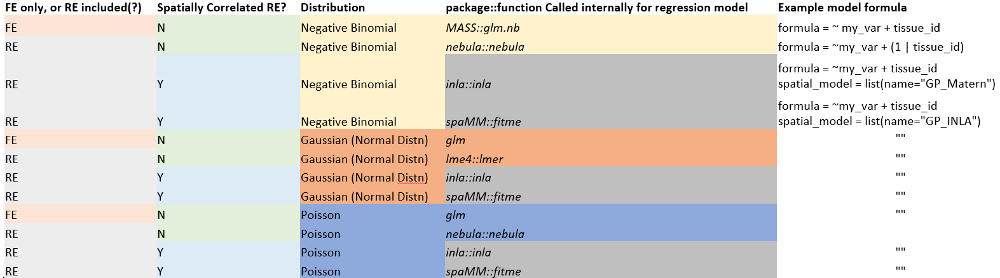

```{r,echo=F} 
# output: rmarkdown::html_vignette
library(knitr)
opts_chunk$set(comment = "#>", collapse = TRUE)
hook_output = knit_hooks$get('output')
knit_hooks$set(output = function(x, options) {
  if (!is.null(n <- options$out.lines)) {
    x = knitr:::split_lines(x)
    if (length(x) > n) {
      # truncate the output
      h = c(head(x, n), '....\n','....\n')
      t = c(tail(x, n))
      x = c(h, t)
    }
    x = paste(x, collapse = '\n') # paste first n lines together
  }
  hook_output(x, options)
})
#opts_chunk$set(eval=FALSE)
#Rscript -e "rmarkdown::render('mamba_example/example_mamba_analysis.Rmd')"
```

# smiDE

## Overview
smiDE (spatial molecular imager Differential Expression) is an R package which aims to 
facilitate highly flexible / customizable Differential Expression regression models suitable for spatially-resolved transcriptomic (SRT) data analysis.
This package also provides tools for addressing challenges specific to SRT data, namely 

* segmentation errors , which can cause bias in fold-change estimates and inference, and 
* correlation among neighboring cells, which may lead naiive regression models to inflate statistical significance.

smiDE attempts to automatically return a rich set of "results" covering all basic contrasts / information one may typically wish to extract from their DE models, and provide a unified syntax for fitting different classes of models.
To that end, smiDE currently relies on 6 different packages for model-fitting, depending on the type of regression model specified by the user:



## Most used functions

* `overlap_ratio_metric()` This function is used to identify average expression of each gene/protein target in each cell type, and average expression in 'neighboring cells of other cell types'.  For cell-type specific DE, this information can be used to remove genes from DE analysis which may be non-trustworthy due to expression from overlapping cells / segmentation imperfection.  (i.e.  may be used to filter out KRT genes in an analysis of T cells)
* `pre_de()` This function computes a set of cell-cell adjacencies at a defined spatial radius.
* `smi_de()` This function is a work-horse for fitting regression models for each gene/protein target given a  $targets \times cells$ `assay_matrix` , and a  $cells \times p$ `metadata` data frame with cell-level covariate information.  A `pre-de` object can be passed in to control for spill-over target expression in spatially neighboring cells, and options for estimating spatially correlated random effects are also available.
* `results()` This function is used to extract "pairwise", "one vs. rest", "one vs. all" contrasts for covariates in DE models, as well as the "marginal means" and "model summaries" from models fitted via `smi_de()`.


## Installation

You can install smiDE using the remotes package

```{r, eval=FALSE}

remotes::install_github("Nanostring-Biostats/CosMx-Analysis-Scratch-Space",
                         subdir = "_code/smiDE", ref = "Main")

```
## More vignettes

* See `spatial-vignette.Rmd` for a deeper exploration of spatial random effect functionality and  usage, more examples.

## Quickstart / Example Usage

```{r}
library(data.table); setDTthreads(1)
library(smiDE)
library(ggplot2)
library(RColorBrewer)
```

### Reading in the data
Read in dataset (Seurat object in this case), do simple normalization based on total counts in assigned to each cell.
```{r}

datadir <- system.file("extdata", package="smiDE")
sem <- readRDS(paste0(datadir, "/small_nsclc.rds"))
sem <- subset(sem, tissue=="Lung5-5")

### Add a normalized expression matrix
totalcount_scalefactors <- mean(sem@meta.data[["totalcounts"]]) / sem@meta.data[["totalcounts"]]
names(totalcount_scalefactors) <- sem@meta.data[["cell_ID"]]
sem <- Seurat::SetAssayData(sem
                           ,"data"
                           ,sem[["RNA"]]@counts %*% Matrix::Diagonal(x=totalcount_scalefactors, names=colnames(sem))
                             )
```


### Using `overlap_ratio_metric()`
Use `overlap_ratio_metric()` function to determine cell-type specific problematic genes, which may express primarily due to segmentation overlap.
For each cell type and each gene, `avg_cluster` indicates the average expression of `assay_matrix` for the corresponding cell type, and  `avg_neighbor_other_cluster` indicates the average expression in neighboring cells of other cell types.  The ratio of the two is a useful metric for filtering out genes before DE analysis which may be falsely expressed primarily due to cell overlap in the cell type we want to analyze. 
```{r}
overlap_metrics <- 
smiDE::overlap_ratio_metric(assay_matrix = sem[["RNA"]]@data
                                  ,metadata = sem@meta.data
                                  ,cellid_col = "cell_ID"
                                  ,cluster_col = "cell_type"
                                  ,sdimx_col = "sdimx"
                                  ,sdimy_col = "sdimy"
                                  ,radius = 0.05
                                  )
overlap_metrics[][1:10]
```

For example, if I wish to analyze macrophage cells, I may wish to exclude genes which are higher expressed in other cell types amongst macrophage neighbors (ratio > 1).

In this case, I might exclude "TPSB2", "COL1A1", "FN1", and "TYK2" from a DE analysis focused on macrophage cells.

```{r}
overlap_metrics[cell_type=="macrophage"][order(ratio)][]
genes_to_analyze <- overlap_metrics[cell_type=="macrophage"][ratio < 1][["target"]]
genes_to_analyze
```


### Using `pre_de()`
Compute cell-cell adjacencies using `pre-de()` 
```{r}
pre_de_obj <- 
pre_de(metadata = sem@meta.data
       ,cell_type_metadata_colname = "cell_type"
       ,split_neighbors_by_colname = "tissue"
       ,mm_radius = 0.05 
       ,sdimx_colname = "sdimx"
       ,sdimy_colname = "sdimy"
       ,verbose=TRUE
)

### data.table of of cell-cell adjacencies
pre_de_obj$cell_adjacency_dt[1:10][]

```
### Using `smi_de()`

Fit a negative binomial regression model for macrophage cells DE across spatial niches using `smi_de()`.
The covariate "otherct_expr" is a keyword, using the `pre_de_obj` of cell adjacencies to conpute neighboring expression of the analyzed gene in "other cell types".

Here, the `neighbor_expr_*` arguments are used to indicate how we create the "otherct_expr" covariate.  In this case, for each cell and each gene, we compute the total "sum" expression of that gene in neighbors of macrophage cells, and re-scale the neighbor cell expressions by their total counts (using `totalcount_scalefactors`).

```{r}
metainfo <- data.table(sem@meta.data)
macrophage_cells <- metainfo[cell_type=="macrophage"][["cell_ID"]] 
de_obj <- 
   smi_de(assay_matrix = sem[["RNA"]]@counts
          ,metadata = metainfo[cell_ID %in% macrophage_cells]
          ,formula = ~RankNorm(otherct_expr) + niche + offset(log(totalcounts)) 
          ,pre_de_obj = pre_de_obj
          ,neighbor_expr_cell_type_metadata_colname = "cell_type"
          ,neighbor_expr_overlap_weight_colname = NULL
          ,neighbor_expr_overlap_agg ="sum"
          ,neighbor_expr_totalcount_normalize = TRUE
          ,neighbor_expr_totalcount_scalefactor = totalcount_scalefactors
          ,family="nbinom2"
          ,targets=genes_to_analyze
   ) 

```

### Using `results()`

Check out the results.  `one.vs.rest` and `one.vs.all` contrasts use the cell-weighted averages across "other" and "all" categories, respectively, when computing the contrasts.


```{r}

### pairwise comparisons
results(de_obj, comparisons = "pairwise", variable = "niche")[[1]][1:10]

### one vs. the rest  comparisons
results(de_obj, comparisons = "one.vs.rest", variable = "niche")[[1]][1:10]

### model summaries for each gene
results(de_obj, comparisons = "model_summary", variable = "niche", target = "C1QC")[[1]]

### model estimated 'marginal mean' counts expression of each gene at each level of 'niche'
results(de_obj, comparisons = "emmeans", variable = "niche")[[1]][1:10]

```

### Note on contrasts for continuous variables
For continuous variables (like "otherct_expr" in the above model), the returned contrast compares expression of the gene at the "average" vs. "average + 1SD" of the continuous variable.

Note that the "otherct_expr" variable is unique, because it is a gene-specific covariate (total expression of each gene in the neighbors of macrophage cells), so the mean and sd of "otherct_expr" are different for each gene.
```{r}
results(de_obj, "pairwise", variable="otherct_expr")
```


### Using `volcano()`

Make a volcano plot.  This function returns a list of plots corresponding to each contrast.
Note we've only analyzed a few genes. 
```{r}
vlist <- smiDE::volcano(de_obj, comparison = "one.vs.rest", variable="niche", interactive = FALSE)
print(vlist$`tumor interior vs. avg.rest`)
```

### Spatial Random Effects models


Fit the same negative binomial regression model as before, but add a spatially correlated random effect using the spaMM package.
First, we look at cells in x/y space and assign them to clusters using simple k-means.
The number of clusters below is specified to be 5\% of the number of cells.
Cells within the same spatial cluster are assigned a common spatial random effect.


```{r}

de_nb_sre_spamm <- 
  smiDE::smi_de(assay_matrix = sem[["RNA"]]@counts
                ,metadata = metainfo[cell_ID %in% macrophage_cells]
                ,formula = ~RankNorm(otherct_expr) + niche  + offset(log(totalcounts))
                ,pre_de_obj = pre_de_obj
                ,neighbor_expr_cell_type_metadata_colname = "cell_type"
                ,neighbor_expr_overlap_weight_colname = NULL
                ,neighbor_expr_overlap_agg ="sum"
                ,neighbor_expr_totalcount_normalize = TRUE
                ,neighbor_expr_totalcount_scalefactor = totalcount_scalefactors
                ,family="nbinom2"
                ,targets = genes_to_analyze
                ,spatial_model = list(
             name = "GP_Matern"
             ,k_prop_n = 0.05 ## ~0.05 * # of cells spatial clusters based on x/y coordinates
             ,x_coord_col = "sdimx"
             ,y_coord_col = "sdimy"
             ,split_neighbors_by_colname = NULL
             ,spatial_random_effect = ~Matern(1 | sdimx_cluster + sdimy_cluster ) ## spatial correlated random effect
           )
                ,nCores=1
  )
```


```{r}
results(de_nb_sre_spamm, comparisons = "one.vs.rest", variable="niche")[[1]][1:10]
```

```{r}
results(de_nb_sre_spamm, comparisons = "pairwise", variable="niche")[[1]][1:10]
```

Visualize the spatial random effects
```{r}
p <- 
ggplot(results(de_nb_sre_spamm, comparisons = "spatial_random_effect", target="C1QC")[[1]]
       ,aes(sdimx,sdimy,color=re)) + 
  theme_bw() + 
  geom_point(size=0.5) + 
  scale_color_gradientn(colors = rev(brewer.pal(11,"RdYlBu"))) + 
  labs(title = "Predicted spatial random effects for C1QC")
print(p)

```


### Brief note on Spatial Random Effects implementations and computational considerations

The `spatial_model` argument in `smi_de()` can be used for fitting spatially correlated random effects within DE models, internally calling either the `spaMM` or `INLA` packages.  This can be an especially useful approach to control for unmeasured sources of spatially correlated expression if they are independent of our primary covariates of interest.

Specifying `spatial_model = list(name = "GP_Matern",...)` calls the `spaMM` package, first assigning cells to spatial clusters using k-means, and fitting a spatially correlated random effect for the analyzed gene based on the locations of these clusters.  The random effect is specified to follow a Gaussian Process with Matern covariance matrix.

Specifying `spatial_model = list(name = "GP_INLA",...)` calls the `INLA` package ([INLA website](https://www.r-inla.org/what-is-inla)), an approximate bayesian approach, specifying the random effect as a Gaussian Process with Matern prior covariance fit on a mesh across $x$ and $y$ dimensions. 

It is worth highlighting that the choice of model depends on the goal of the analysis and the size of the dataset. Running DE for several genes can take substantial time, especially when there are a large number of cells (or in the `"GP_Matern"` case, a large number of spatial clusters). 
Some performance considerations are summarized in the table below, based on simulation studies in the preprint ["Differential Expression Analysis for Spatially Correlated Data"](https://www.biorxiv.org/content/10.1101/2024.08.02.606405v1.full) where data were simulated with spatial confounding.

|                        | No spatial random effect | Independent clusters      | GP_Matern (spaMM) | GP_INLA                            |
|------------------------|--------------------------|---------------------------|-------------------|------------------------------------|
| **Time**               | Very fast                | Very fast                 | Slower            | Fast                               |
| **Type 1 error**       | $>>>\alpha$              | $>>\alpha$                | $\alpha$          | $\alpha$                           |
| **Rank correlation of true and estimated effects sizes**            | Bad                      | Good depending on cluster | Good              | Good                               |
| **Cluster suggestion (as % of total cells)** | \-                       | 5%                        | 25%               | \-                                 |
| **Results stability**  | Stable                   | Stable                    | Stable            | Depends on prior specified by user |

For a more detailed discussion, as well as examples of syntax for calling these models, we point the reader to the [spatial-vignette](https://github.com/Nanostring-Biostats/CosMx-Analysis-Scratch-Space/tree/Main/_code/smiDE/vignettes) and the help page (`?smiDE::spatial_model`).


