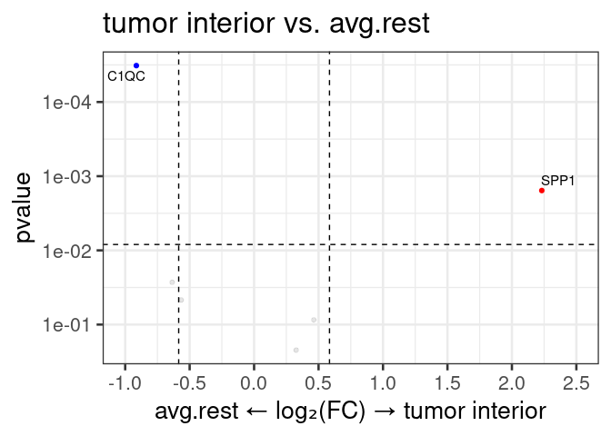
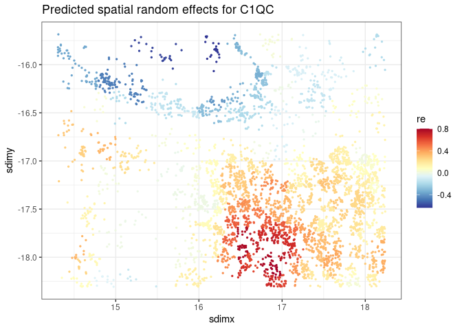

# smiDE

## Overview

smiDE (spatial molecular imager Differential Expression) is an R package
which aims to facilitate highly flexible / customizable Differential
Expression regression models suitable for spatially-resolved
transcriptomic (SRT) data analysis. This package also provides tools for
addressing challenges specific to SRT data, namely

- segmentation errors , which can cause bias in fold-change estimates
  and inference, and
- correlation among neighboring cells, which may lead naiive regression
  models to inflate statistical significance.

smiDE attempts to automatically return a rich set of “results” covering
all basic contrasts / information one may typically wish to extract from
their DE models, and provide a unified syntax for fitting different
classes of models. To that end, smiDE currently relies on 6 different
packages for model-fitting, depending on the type of regression model
specified by the user:


## Most used functions

- `overlap_ratio_metric()` This function is used to identify average
  expression of each gene/protein target in each cell type, and average
  expression in ‘neighboring cells of other cell types’. For cell-type
  specific DE, this information can be used to remove genes from DE
  analysis which may be non-trustworthy due to expression from
  overlapping cells / segmentation imperfection. (i.e. may be used to
  filter out KRT genes in an analysis of T cells)
- `pre_de()` This function computes a set of cell-cell adjacencies at a
  defined spatial radius.
- `smi_de()` This function is a work-horse for fitting regression models
  for each gene/protein target given a $targets \times cells$
  `assay_matrix` , and a $cells \times p$ `metadata` data frame with
  cell-level covariate information. A `pre-de` object can be passed in
  to control for spill-over target expression in spatially neighboring
  cells, and options for estimating spatially correlated random effects
  are also available.
- `results()` This function is used to extract “pairwise”, “one
  vs. rest”, “one vs. all” contrasts for covariates in DE models, as
  well as the “marginal means” and “model summaries” from models fitted
  via `smi_de()`.

## Installation

You can install smiDE using the devtools package

``` r
# install.packages("devtools")
devtools::install_github("Nanostring-Biostats/smiDE")
```

## More vignettes

- See `spatial-vignette.Rmd` for a deeper exploration of spatial random
  effect functionality and usage, more examples.

## Quickstart / Example Usage

``` r
library(data.table); setDTthreads(1)
library(smiDE)
library(ggplot2)
library(RColorBrewer)
```

### Reading in the data

Read in dataset (Seurat object in this case), do simple normalization
based on total counts in assigned to each cell.

``` r

datadir <- system.file("extdata", package="smiDE")
sem <- readRDS(paste0(datadir, "/small_nsclc.rds"))
sem <- subset(sem, tissue=="Lung5-5")
#> Loading required package: SeuratObject
#> Loading required package: sp
#> 'SeuratObject' was built under R 4.3.0 but the current version is
#> 4.3.3; it is recomended that you reinstall 'SeuratObject' as the ABI
#> for R may have changed
#> 
#> Attaching package: 'SeuratObject'
#> The following object is masked from 'package:base':
#> 
#>     intersect

### Add a normalized expression matrix
totalcount_scalefactors <- mean(sem@meta.data[["totalcounts"]]) / sem@meta.data[["totalcounts"]]
names(totalcount_scalefactors) <- sem@meta.data[["cell_ID"]]
sem <- Seurat::SetAssayData(sem
                           ,"data"
                           ,sem[["RNA"]]@counts %*% Matrix::Diagonal(x=totalcount_scalefactors, names=colnames(sem))
                             )
```

### Using `overlap_ratio_metric()`

Use `overlap_ratio_metric()` function to determine cell-type specific
problematic genes, which may express primarily due to segmentation
overlap. For each cell type and each gene, `avg_cluster` indicates the
average expression of `assay_matrix` for the corresponding cell type,
and `avg_neighbor_other_cluster` indicates the average expression in
neighboring cells of other cell types. The ratio of the two is a useful
metric for filtering out genes before DE analysis which may be falsely
expressed primarily due to cell overlap in the cell type we want to
analyze.

``` r
overlap_metrics <- 
smiDE::overlap_ratio_metric(assay_matrix = sem[["RNA"]]@data
                                  ,metadata = sem@meta.data
                                  ,cellid_col = "cell_ID"
                                  ,cluster_col = "cell_type"
                                  ,sdimx_col = "sdimx"
                                  ,sdimy_col = "sdimy"
                                  ,radius = 0.05
                                  )
overlap_metrics[][1:10]
#>       target avg_neighbor_othercluster avg_cluster  cell_type  all_data
#>  1:     C1QC                 0.7818223  0.27138574 epithelial all_cells
#>  2:     CD14                 0.3079658  0.10445182 epithelial all_cells
#>  3:   COL1A1                 2.4543713  0.77938728 epithelial all_cells
#>  4:      FN1                 1.4555024  0.56612533 epithelial all_cells
#>  5: HLA-DQA1                 0.6205484  0.31058838 epithelial all_cells
#>  6:    HLA-E                 1.1639959  0.89717777 epithelial all_cells
#>  7:     SPP1                 0.1431516  0.09042455 epithelial all_cells
#>  8:    TPSB2                 1.0222118  0.28792865 epithelial all_cells
#>  9:     TYK2                 4.5429922  5.38275994 epithelial all_cells
#> 10:      VIM                 1.4619042  0.59625994 epithelial all_cells
#>         ratio
#>  1: 2.8808524
#>  2: 2.9484009
#>  3: 3.1491036
#>  4: 2.5709897
#>  5: 1.9979767
#>  6: 1.2973972
#>  7: 1.5831059
#>  8: 3.5502261
#>  9: 0.8439894
#> 10: 2.4517900
```

For example, if I wish to analyze macrophage cells, I may wish to
exclude genes which are higher expressed in other cell types amongst
macrophage neighbors (ratio \> 1).

In this case, I might exclude “TPSB2”, “COL1A1”, “FN1”, and “TYK2” from
a DE analysis focused on macrophage cells.

``` r
overlap_metrics[cell_type=="macrophage"][order(ratio)][]
#>       target avg_neighbor_othercluster avg_cluster  cell_type  all_data
#>  1:     C1QC                 0.5392999   4.2548115 macrophage all_cells
#>  2:     CD14                 0.2708922   1.2572861 macrophage all_cells
#>  3: HLA-DQA1                 0.5213611   2.0290977 macrophage all_cells
#>  4:     SPP1                 0.1797029   0.4568300 macrophage all_cells
#>  5:      VIM                 0.9772822   1.4974255 macrophage all_cells
#>  6:    HLA-E                 1.1232012   1.4928392 macrophage all_cells
#>  7:     TYK2                 3.3858147   2.8786018 macrophage all_cells
#>  8:      FN1                 1.1005461   0.3094079 macrophage all_cells
#>  9:   COL1A1                 1.5760829   0.3051308 macrophage all_cells
#> 10:    TPSB2                 1.0136058   0.1582883 macrophage all_cells
#>         ratio
#>  1: 0.1267506
#>  2: 0.2154579
#>  3: 0.2569423
#>  4: 0.3933693
#>  5: 0.6526417
#>  6: 0.7523926
#>  7: 1.1762011
#>  8: 3.5569428
#>  9: 5.1652701
#> 10: 6.4035414
genes_to_analyze <- overlap_metrics[cell_type=="macrophage"][ratio < 1][["target"]]
genes_to_analyze
#> [1] "C1QC"     "CD14"     "HLA-DQA1" "HLA-E"    "SPP1"     "VIM"
```

### Using `pre_de()`

Compute cell-cell adjacencies using `pre-de()`

``` r
pre_de_obj <- 
pre_de(metadata = sem@meta.data
       ,cell_type_metadata_colname = "cell_type"
       ,split_neighbors_by_colname = "tissue"
       ,mm_radius = 0.05 
       ,sdimx_colname = "sdimx"
       ,sdimy_colname = "sdimy"
       ,verbose=TRUE
)
#> 2025-01-31 20:57:14.281626, identifying cell-cell spatial neighbors within 0.05 radius.
#> neighbors calculated for tissue: Lung5-5

### data.table of of cell-cell adjacencies
pre_de_obj$cell_adjacency_dt[1:10][]
#>           to       from sdimx_begin sdimy_begin sdimx_end sdimy_end   distance
#>  1: c_3_11_1   c_3_11_1    14.38246   -17.65750  14.38246  -17.6575 0.00000000
#>  2: c_3_11_1  c_3_11_15    14.33908   -17.65786  14.38246  -17.6575 0.04338149
#>  3: c_3_11_1  c_3_11_59    14.34340   -17.67136  14.38246  -17.6575 0.04144615
#>  4: c_3_11_1  c_3_11_65    14.35744   -17.66866  14.38246  -17.6575 0.02739609
#>  5: c_3_11_1  c_3_11_66    14.36932   -17.66866  14.38246  -17.6575 0.01723964
#>  6: c_3_11_1  c_3_11_69    14.35024   -17.67208  14.38246  -17.6575 0.03536531
#>  7: c_3_11_1  c_3_11_89    14.40298   -17.67802  14.38246  -17.6575 0.02901966
#>  8: c_3_11_1 c_3_11_125    14.34250   -17.68234  14.38246  -17.6575 0.04705133
#>  9: c_3_11_1 c_3_11_126    14.40532   -17.68648  14.38246  -17.6575 0.03691097
#> 10: c_3_11_1 c_3_11_130    14.35366   -17.68414  14.38246  -17.6575 0.03923174
#>       weight tissue_from tissue_to cell_type_from cell_type_to
#>  1:      Inf     Lung5-5   Lung5-5     epithelial   epithelial
#>  2: 23.05130     Lung5-5   Lung5-5           mast   epithelial
#>  3: 24.12769     Lung5-5   Lung5-5     epithelial   epithelial
#>  4: 36.50155     Lung5-5   Lung5-5    endothelial   epithelial
#>  5: 58.00585     Lung5-5   Lung5-5     epithelial   epithelial
#>  6: 28.27630     Lung5-5   Lung5-5             NK   epithelial
#>  7: 34.45939     Lung5-5   Lung5-5        tumor 5   epithelial
#>  8: 21.25339     Lung5-5   Lung5-5        tumor 5   epithelial
#>  9: 27.09221     Lung5-5   Lung5-5        tumor 5   epithelial
#> 10: 25.48956     Lung5-5   Lung5-5     epithelial   epithelial
```

### Using `smi_de()`

Fit a negative binomial regression model for macrophage cells DE across
spatial niches using `smi_de()`. The covariate “otherct_expr” is a
keyword, using the `pre_de_obj` of cell adjacencies to conpute
neighboring expression of the analyzed gene in “other cell types”.

Here, the `neighbor_expr_*` arguments are used to indicate how we create
the “otherct_expr” covariate. In this case, for each cell and each gene,
we compute the total “sum” expression of that gene in neighbors of
macrophage cells, and re-scale the neighbor cell expressions by their
total counts (using `totalcount_scalefactors`).

``` r
metainfo <- data.table(sem@meta.data)
macrophage_cells <- metainfo[cell_type=="macrophage"][["cell_ID"]] 
de_obj <- 
   smi_de(assay_matrix = sem[["RNA"]]@counts
          ,metadata = metainfo[cell_ID %in% macrophage_cells]
          ,formula = ~RankNorm(otherct_expr) + niche + offset(log(totalcounts)) 
          ,pre_de_obj = pre_de_obj
          ,neighbor_expr_cell_type_metadata_colname = "cell_type"
          ,neighbor_expr_overlap_weight_colname = NULL
          ,neighbor_expr_overlap_agg ="sum"
          ,neighbor_expr_totalcount_normalize = TRUE
          ,neighbor_expr_totalcount_scalefactor = totalcount_scalefactors
          ,family="nbinom2"
          ,targets=genes_to_analyze
   ) 
```

### Using `results()`

Check out the results. `one.vs.rest` and `one.vs.all` contrasts use the
cell-weighted averages across “other” and “all” categories,
respectively, when computing the contrasts.

``` r

### pairwise comparisons
results(de_obj, comparisons = "pairwise", variable = "niche")[[1]][1:10]
#>                                             contrast     ratio         SE  df
#>  1:                      immune / lymphoid structure 0.9663701 0.25361675 Inf
#>  2:                 immune / myeloid-enriched stroma 0.4988895 0.12565690 Inf
#>  3:                             immune / neutrophils 0.6091148 0.17497428 Inf
#>  4:             immune / plasmablast-enriched stroma 0.7298861 0.18803513 Inf
#>  5:                                  immune / stroma 0.7023251 0.17774638 Inf
#>  6:                          immune / tumor interior 1.0789193 0.31687270 Inf
#>  7:                   immune / tumor-stroma boundary 0.7678581 0.19980071 Inf
#>  8:     lymphoid structure / myeloid-enriched stroma 0.5162509 0.04008771 Inf
#>  9:                 lymphoid structure / neutrophils 0.6303121 0.09978276 Inf
#> 10: lymphoid structure / plasmablast-enriched stroma 0.7552862 0.07116898 Inf
#>     null    z.ratio      p.value fold_change modelest_cpc_1 modelest_cpc_2
#>  1:    1 -0.1303460 8.962927e-01   0.9663701       2.460455       2.546080
#>  2:    1 -2.7607966 5.766058e-03   0.4988895       2.460455       4.931865
#>  3:    1 -1.7257838 8.438632e-02   0.6091148       2.460455       4.039395
#>  4:    1 -1.2222020 2.216312e-01   0.7298861       2.460455       3.371013
#>  5:    1 -1.3962188 1.626486e-01   0.7023251       2.460455       3.503300
#>  6:    1  0.2586358 7.959163e-01   1.0789193       2.460455       2.280481
#>  7:    1 -1.0151615 3.100289e-01   0.7678581       2.460455       3.204310
#>  8:    1 -8.5144716 1.673516e-17   0.5162509       2.546080       4.931865
#>  9:    1 -2.9154772 3.551450e-03   0.6303121       2.546080       4.039395
#> 10:    1 -2.9785097 2.896538e-03   0.7552862       2.546080       3.371013
#>     counts_1  propnz_1 ncells_1 counts_2  propnz_2 ncells_2  term target
#>  1:       37 0.6363636       11      344 0.7006803      147 niche   C1QC
#>  2:       37 0.6363636       11    12626 0.8180024     2533 niche   C1QC
#>  3:       37 0.6363636       11      144 1.0000000       30 niche   C1QC
#>  4:       37 0.6363636       11      826 0.8028169      213 niche   C1QC
#>  5:       37 0.6363636       11     2766 0.8114144      806 niche   C1QC
#>  6:       37 0.6363636       11      102 0.4750000       40 niche   C1QC
#>  7:       37 0.6363636       11      509 0.6666667      168 niche   C1QC
#>  8:      344 0.7006803      147    12626 0.8180024     2533 niche   C1QC
#>  9:      344 0.7006803      147      144 1.0000000       30 niche   C1QC
#> 10:      344 0.7006803      147      826 0.8028169      213 niche   C1QC

### one vs. the rest  comparisons
results(de_obj, comparisons = "one.vs.rest", variable = "niche")[[1]][1:10]
#>                                     contrast     ratio         SE  df null
#>  1:                      immune vs. avg.rest 0.5756122 0.14487046 Inf    1
#>  2:          lymphoid structure vs. avg.rest 0.5847612 0.04497077 Inf    1
#>  3:     myeloid-enriched stroma vs. avg.rest 1.4969317 0.04244110 Inf    1
#>  4:                 neutrophils vs. avg.rest 0.9460546 0.13217843 Inf    1
#>  5: plasmablast-enriched stroma vs. avg.rest 0.7792923 0.04540263 Inf    1
#>  6:                      stroma vs. avg.rest 0.7803076 0.02622642 Inf    1
#>  7:              tumor interior vs. avg.rest 0.5309130 0.08087442 Inf    1
#>  8:       tumor-stroma boundary vs. avg.rest 0.7412843 0.05080510 Inf    1
#>  9:                      immune vs. avg.rest 1.1247050 0.36936073 Inf    1
#> 10:          lymphoid structure vs. avg.rest 0.8147052 0.08896324 Inf    1
#>        z.ratio      p.value fold_change counts_1  propnz_1 ncells_1 counts_2
#>  1: -2.1945313 2.819724e-02   0.5756122       37 0.6363636       11    17317
#>  2: -6.9768567 3.018573e-12   0.5847612      344 0.7006803      147    17010
#>  3: 14.2288583 6.066407e-46   1.4969317    12626 0.8180024     2533     4728
#>  4: -0.3969138 6.914310e-01   0.9460546      144 1.0000000       30    17210
#>  5: -4.2801803 1.867420e-05   0.7792923      826 0.8028169      213    16528
#>  6: -7.3806746 1.574895e-13   0.7803076     2766 0.8114144      806    14588
#>  7: -4.1564606 3.232159e-05   0.5309130      102 0.4750000       40    17252
#>  8: -4.3680465 1.253628e-05   0.7412843      509 0.6666667      168    16845
#>  9:  0.3578511 7.204547e-01   1.1247050       24 0.7272727       11     5733
#> 10: -1.8766925 6.056025e-02   0.8147052      171 0.5578231      147     5586
#>      propnz_2 ncells_2 modelest_cpc_1 modelest_cpc_2  term target
#>  1: 0.8028956     3937       2.460455       4.274502 niche   C1QC
#>  2: 0.8063667     3801       2.546080       4.354051 niche   C1QC
#>  3: 0.7745583     1415       4.931865       3.294649 niche   C1QC
#>  4: 0.8009188     3918       4.039395       4.269728 niche   C1QC
#>  5: 0.8024096     3735       3.371013       4.325737 niche   C1QC
#>  6: 0.8001273     3142       3.503300       4.489640 niche   C1QC
#>  7: 0.8057830     3908       2.280481       4.295395 niche   C1QC
#>  8: 0.8084656     3780       3.204310       4.322647 niche   C1QC
#>  9: 0.4960630     3937       1.493615       1.328006 niche   CD14
#> 10: 0.4943436     3801       1.090577       1.338616 niche   CD14

### model summaries for each gene
results(de_obj, comparisons = "model_summary", variable = "niche", target = "C1QC")[[1]]
#>                                 term           est         se           z
#>  1:                      (Intercept) -4.732176e+00 0.25134892 -18.8271203
#>  2:           RankNorm(otherct_expr)  3.236927e-02 0.01383686   2.3393503
#>  3:          nichelymphoid structure  3.420836e-02 0.26244266   0.1303460
#>  4:     nichemyeloid-enriched stroma  6.953707e-01 0.25187322   2.7607966
#>  5:                 nicheneutrophils  4.957486e-01 0.28725995   1.7257838
#>  6: nicheplasmablast-enriched stroma  3.148668e-01 0.25762258   1.2222020
#>  7:                      nichestroma  3.533589e-01 0.25308278   1.3962188
#>  8:              nichetumor interior -7.595991e-02 0.29369453  -0.2586358
#>  9:       nichetumor-stroma boundary  2.641504e-01 0.26020525   1.0151615
#> 10:                            theta  3.034291e+00 0.13654403          NA
#> 11:                           logLik -8.696903e+03         NA          NA
#>             pval    termtype user.self sys.self elapsed target             msg
#>  1: 4.527190e-79       fixed     1.525    2.302   0.249   C1QC converged=TRUE 
#>  2: 1.931731e-02       fixed     1.525    2.302   0.249   C1QC converged=TRUE 
#>  3: 8.962927e-01       fixed     1.525    2.302   0.249   C1QC converged=TRUE 
#>  4: 5.766058e-03       fixed     1.525    2.302   0.249   C1QC converged=TRUE 
#>  5: 8.438632e-02       fixed     1.525    2.302   0.249   C1QC converged=TRUE 
#>  6: 2.216312e-01       fixed     1.525    2.302   0.249   C1QC converged=TRUE 
#>  7: 1.626486e-01       fixed     1.525    2.302   0.249   C1QC converged=TRUE 
#>  8: 7.959163e-01       fixed     1.525    2.302   0.249   C1QC converged=TRUE 
#>  9: 3.100289e-01       fixed     1.525    2.302   0.249   C1QC converged=TRUE 
#> 10:           NA       fixed     1.525    2.302   0.249   C1QC converged=TRUE 
#> 11:           NA model_stats     1.525    2.302   0.249   C1QC converged=TRUE

### model estimated 'marginal mean' counts expression of each gene at each level of 'niche'
results(de_obj, comparisons = "emmeans", variable = "niche")[[1]][1:10]
#>                           level response         SE  df asymp.LCL asymp.UCL
#>  1:                      immune 2.460455 0.61843282 Inf 1.5033736  4.026837
#>  2:          lymphoid structure 2.546080 0.19293423 Inf 2.1946766  2.953748
#>  3:     myeloid-enriched stroma 4.931865 0.07850716 Inf 4.7803694  5.088162
#>  4:                 neutrophils 4.039395 0.56192824 Inf 3.0754173  5.305529
#>  5: plasmablast-enriched stroma 3.371013 0.19122544 Inf 3.0163022  3.767437
#>  6:                      stroma 3.503300 0.10544751 Inf 3.3026050  3.716191
#>  7:              tumor interior 2.280481 0.34604319 Inf 1.6938078  3.070358
#>  8:       tumor-stroma boundary 3.204310 0.21545304 Inf 2.8086721  3.655679
#>  9:                      immune 1.493615 0.48979911 Inf 0.7854259  2.840351
#> 10:          lymphoid structure 1.090577 0.11746523 Inf 0.8830276  1.346911
#>      term category .offset.  wts target
#>  1: niche       c1 5.632523   11   C1QC
#>  2: niche       c2 5.632523  147   C1QC
#>  3: niche       c3 5.632523 2533   C1QC
#>  4: niche       c4 5.632523   30   C1QC
#>  5: niche       c5 5.632523  213   C1QC
#>  6: niche       c6 5.632523  806   C1QC
#>  7: niche       c7 5.632523   40   C1QC
#>  8: niche       c8 5.632523  168   C1QC
#>  9: niche       c1 5.632523   11   CD14
#> 10: niche       c2 5.632523  147   CD14
```

### Note on contrasts for continuous variables

For continuous variables (like “otherct_expr” in the above model), the
returned contrast compares expression of the gene at the “average”
vs. “average + 1SD” of the continuous variable.

Note that the “otherct_expr” variable is unique, because it is a
gene-specific covariate (total expression of each gene in the neighbors
of macrophage cells), so the mean and sd of “otherct_expr” are different
for each gene.

``` r
results(de_obj, "pairwise", variable="otherct_expr")
#> $pairwise
#>                                   contrast    ratio         SE  df null
#> 1:    otherct_expr 25 / otherct_expr 14.43 1.043818 0.01913532 Inf    1
#> 2: otherct_expr 15.32 / otherct_expr 7.803 1.375791 0.04370336 Inf    1
#> 3: otherct_expr 30.83 / otherct_expr 15.35 1.182432 0.03213974 Inf    1
#> 4: otherct_expr 50.28 / otherct_expr 30.71 1.125149 0.02726187 Inf    1
#> 5: otherct_expr 10.38 / otherct_expr 4.761 1.818029 0.14258052 Inf    1
#> 6: otherct_expr 57.67 / otherct_expr 29.98 1.128402 0.03697140 Inf    1
#>      z.ratio      p.value fold_change modelest_cpc_1 modelest_cpc_2
#> 1:  2.339350 1.931731e-02    1.043818      3.2609124      3.1240241
#> 2: 10.043107 9.852093e-24    1.375791      1.7003144      1.2358810
#> 3:  6.165065 7.045404e-10    1.182432      1.6566158      1.4010246
#> 4:  4.866614 1.135265e-06    1.125149      1.3699693      1.2175887
#> 5:  7.621886 2.499957e-14    1.818029      0.5048498      0.2776907
#> 6:  3.686993 2.269193e-04    1.128402      1.6382047      1.4517922
#>            term   target
#> 1: otherct_expr     C1QC
#> 2: otherct_expr     CD14
#> 3: otherct_expr HLA-DQA1
#> 4: otherct_expr    HLA-E
#> 5: otherct_expr     SPP1
#> 6: otherct_expr      VIM
```

### Using `volcano()`

Make a volcano plot. This function returns a list of plots corresponding
to each contrast. Note we’ve only analyzed a few genes.

``` r
vlist <- smiDE::volcano(de_obj, comparison = "one.vs.rest", variable="niche", interactive = FALSE)
print(vlist$`tumor interior vs. avg.rest`)
```

<!-- -->

### Spatial Random Effects models

Fit the same negative binomial regression model as before, but add a
spatially correlated random effect using the spaMM package. First, we
look at cells in x/y space and assign them to clusters using simple
k-means. The number of clusters below is specified to be 5% of the
number of cells. Cells within the same spatial cluster are assigned a
common spatial random effect.

``` r

de_nb_sre_spamm <- 
  smiDE::smi_de(assay_matrix = sem[["RNA"]]@counts
                ,metadata = metainfo[cell_ID %in% macrophage_cells]
                ,formula = ~RankNorm(otherct_expr) + niche  + offset(log(totalcounts))
                ,pre_de_obj = pre_de_obj
                ,neighbor_expr_cell_type_metadata_colname = "cell_type"
                ,neighbor_expr_overlap_weight_colname = NULL
                ,neighbor_expr_overlap_agg ="sum"
                ,neighbor_expr_totalcount_normalize = TRUE
                ,neighbor_expr_totalcount_scalefactor = totalcount_scalefactors
                ,family="nbinom2"
                ,targets = genes_to_analyze
                ,spatial_model = list(
             name = "GP_Matern"
             ,k_prop_n = 0.05 ## ~0.05 * # of cells spatial clusters based on x/y coordinates
             ,x_coord_col = "sdimx"
             ,y_coord_col = "sdimy"
             ,split_neighbors_by_colname = NULL
             ,spatial_random_effect = ~Matern(1 | sdimx_cluster + sdimy_cluster ) ## spatial correlated random effect
           )
                ,nCores=1
  )
#> Registered S3 methods overwritten by 'registry':
#>   method               from 
#>   print.registry_field proxy
#>   print.registry_entry proxy
#> Creating k-means clusters for spatial random effects.
```

``` r
results(de_nb_sre_spamm, comparisons = "one.vs.rest", variable="niche")[[1]][1:10]
#>                                     contrast     ratio         SE  df null
#>  1:                      immune vs. avg.rest 0.6280327 0.15798192 Inf    1
#>  2:          lymphoid structure vs. avg.rest 0.7166203 0.06418825 Inf    1
#>  3:     myeloid-enriched stroma vs. avg.rest 1.0765659 0.06070323 Inf    1
#>  4:                 neutrophils vs. avg.rest 0.9940944 0.14397631 Inf    1
#>  5: plasmablast-enriched stroma vs. avg.rest 0.9348696 0.07118765 Inf    1
#>  6:                      stroma vs. avg.rest 1.0621042 0.05770670 Inf    1
#>  7:              tumor interior vs. avg.rest 0.6167755 0.09820098 Inf    1
#>  8:       tumor-stroma boundary vs. avg.rest 0.8804254 0.06935981 Inf    1
#>  9:                      immune vs. avg.rest 1.4667297 0.50378465 Inf    1
#> 10:          lymphoid structure vs. avg.rest 1.0775537 0.15289890 Inf    1
#>        z.ratio      p.value fold_change counts_1  propnz_1 ncells_1 counts_2
#>  1: -1.8491839 0.0644312568   0.6280327       37 0.6363636       11    17317
#>  2: -3.7200639 0.0001991724   0.7166203      344 0.7006803      147    17010
#>  3:  1.3084152 0.1907325167   1.0765659    12626 0.8180024     2533     4728
#>  4: -0.0408964 0.9673784908   0.9940944      144 1.0000000       30    17210
#>  5: -0.8844483 0.3764542410   0.9348696      826 0.8028169      213    16528
#>  6:  1.1089511 0.2674512607   1.0621042     2766 0.8114144      806    14588
#>  7: -3.0351721 0.0024039850   0.6167755      102 0.4750000       40    17252
#>  8: -1.6165308 0.1059796068   0.8804254      509 0.6666667      168    16845
#>  9:  1.1151772 0.2647745092   1.4667297       24 0.7272727       11     5733
#> 10:  0.5264009 0.5986097001   1.0775537      171 0.5578231      147     5586
#>      propnz_2 ncells_2 modelest_cpc_1 modelest_cpc_2  term target
#>  1: 0.8028956     3937       2.228089       3.547728 niche   C1QC
#>  2: 0.8063667     3801       2.570779       3.587365 niche   C1QC
#>  3: 0.7745583     1415       3.638070       3.379329 niche   C1QC
#>  4: 0.8009188     3918       3.522367       3.543292 niche   C1QC
#>  5: 0.8024096     3735       3.324425       3.556030 niche   C1QC
#>  6: 0.8001273     3142       3.717170       3.499817 niche   C1QC
#>  7: 0.8057830     3908       2.196043       3.560523 niche   C1QC
#>  8: 0.8084656     3780       3.136415       3.562386 niche   C1QC
#>  9: 0.4960630     3937       1.791819       1.221642 niche   CD14
#> 10: 0.4943436     3801       1.314131       1.219550 niche   CD14
```

``` r
results(de_nb_sre_spamm, comparisons = "pairwise", variable="niche")[[1]][1:10]
#>                                             contrast     ratio         SE  df
#>  1:                      immune / lymphoid structure 0.8666980 0.22209759 Inf
#>  2:                 immune / myeloid-enriched stroma 0.6124370 0.15618646 Inf
#>  3:                             immune / neutrophils 0.6325545 0.18288021 Inf
#>  4:             immune / plasmablast-enriched stroma 0.6702179 0.17177165 Inf
#>  5:                                  immune / stroma 0.5994046 0.15101264 Inf
#>  6:                          immune / tumor interior 1.0145924 0.28404308 Inf
#>  7:                   immune / tumor-stroma boundary 0.7103936 0.18379524 Inf
#>  8:     lymphoid structure / myeloid-enriched stroma 0.7066326 0.06832539 Inf
#>  9:                 lymphoid structure / neutrophils 0.7298441 0.12228132 Inf
#> 10: lymphoid structure / plasmablast-enriched stroma 0.7733004 0.08120320 Inf
#>     null     z.ratio      p.value fold_change modelest_cpc_1 modelest_cpc_2
#>  1:    1 -0.55828560 0.5766493750   0.8666980       2.228089       2.570779
#>  2:    1 -1.92259611 0.0545307932   0.6124370       2.228089       3.638070
#>  3:    1 -1.58411323 0.1131679531   0.6325545       2.228089       3.522367
#>  4:    1 -1.56131292 0.1184499362   0.6702179       2.228089       3.324425
#>  5:    1 -2.03152735 0.0422015283   0.5994046       2.228089       3.717170
#>  6:    1  0.05174707 0.9587302289   1.0145924       2.228089       2.196043
#>  7:    1 -1.32162953 0.1862915447   0.7103936       2.228089       3.136415
#>  8:    1 -3.59126015 0.0003290829   0.7066326       2.570779       3.638070
#>  9:    1 -1.87964633 0.0601562940   0.7298441       2.570779       3.522367
#> 10:    1 -2.44825337 0.0143550671   0.7733004       2.570779       3.324425
#>     counts_1  propnz_1 ncells_1 counts_2  propnz_2 ncells_2  term target
#>  1:       37 0.6363636       11      344 0.7006803      147 niche   C1QC
#>  2:       37 0.6363636       11    12626 0.8180024     2533 niche   C1QC
#>  3:       37 0.6363636       11      144 1.0000000       30 niche   C1QC
#>  4:       37 0.6363636       11      826 0.8028169      213 niche   C1QC
#>  5:       37 0.6363636       11     2766 0.8114144      806 niche   C1QC
#>  6:       37 0.6363636       11      102 0.4750000       40 niche   C1QC
#>  7:       37 0.6363636       11      509 0.6666667      168 niche   C1QC
#>  8:      344 0.7006803      147    12626 0.8180024     2533 niche   C1QC
#>  9:      344 0.7006803      147      144 1.0000000       30 niche   C1QC
#> 10:      344 0.7006803      147      826 0.8028169      213 niche   C1QC
```

Visualize the spatial random effects

``` r
p <- 
ggplot(results(de_nb_sre_spamm, comparisons = "spatial_random_effect", target="C1QC")[[1]]
       ,aes(sdimx,sdimy,color=re)) + 
  theme_bw() + 
  geom_point(size=0.5) + 
  scale_color_gradientn(colors = rev(brewer.pal(11,"RdYlBu"))) + 
  labs(title = "Predicted spatial random effects for C1QC")
print(p)
```

<!-- -->

### Brief note on Spatial Random Effects implementations and computational considerations

The `spatial_model` argument in `smi_de()` can be used for fitting
spatially correlated random effects within DE models, internally calling
either the `spaMM` or `INLA` packages. This can be an especially useful
approach to control for unmeasured sources of spatially correlated
expression if they are independent of our primary covariates of
interest.

Specifying `spatial_model = list(name = "GP_Matern",...)` calls the
`spaMM` package, first assigning cells to spatial clusters using
k-means, and fitting a spatially correlated random effect for the
analyzed gene based on the locations of these clusters. The random
effect is specified to follow a Gaussian Process with Matern covariance
matrix.

Specifying `spatial_model = list(name = "GP_INLA",...)` calls the `INLA`
package ([INLA website](https://www.r-inla.org/what-is-inla)), an
approximate bayesian approach, specifying the random effect as a
Gaussian Process with Matern prior covariance fit on a mesh across $x$
and $y$ dimensions.

It is worth highlighting that the choice of model depends on the goal of
the analysis and the size of the dataset. Running DE for several genes
can take substantial time, especially when there are a large number of
cells (or in the `"GP_Matern"` case, a large number of spatial
clusters). Some performance considerations are summarized in the table
below, based on simulation studies in the preprint [“Differential
Expression Analysis for Spatially Correlated
Data”](https://www.biorxiv.org/content/10.1101/2024.08.02.606405v1.full)
where data were simulated with spatial confounding.

|                                                          | No spatial random effect | Independent clusters      | GP_Matern (spaMM) | GP_INLA                            |
|----------------------------------------------------------|--------------------------|---------------------------|-------------------|------------------------------------|
| **Time**                                                 | Very fast                | Very fast                 | Slower            | Fast                               |
| **Type 1 error**                                         | $>>>\alpha$              | $>>\alpha$                | $\alpha$          | $\alpha$                           |
| **Rank correlation of true and estimated effects sizes** | Bad                      | Good depending on cluster | Good              | Good                               |
| **Cluster suggestion (as % of total cells)**             | \-                       | 5%                        | 25%               | \-                                 |
| **Results stability**                                    | Stable                   | Stable                    | Stable            | Depends on prior specified by user |

For a more detailed discussion, as well as examples of syntax for
calling these models, we point the reader to the
[spatial-vignette](https://github.com/Nanostring-Biostats/smiDE/blob/main/vignettes)
and the help page (`?smiDE::spatial_model`).
