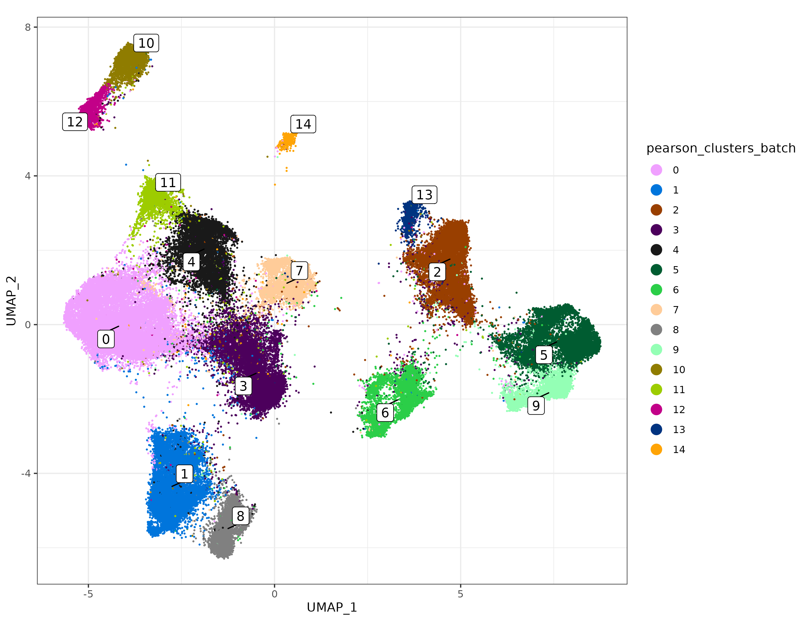

# scPearsonPCA: An R package for efficient Principal Components decomposition of pearson residual normalized single cell data

## Introduction

Pearson residuals can be an effective normalization method for
spatially-resolved transcriptomic data. However, the normalized data
matrix produced is **dense** with nearly all values non-zero. This
limits the usability of pearson residuals for high-plex or large
datasets where computing memory can be a limiting factor.

However, the principal component (PC) decomposition of quasi-poisson
pearson residuals can be computed directly from a sparse counts matrix
and a few easy-to-calculate summary statistics. The R package
[scPearsonPCA](https://github.com/Nanostring-Biostats/CosMx-Analysis-Scratch-Space/tree/Main/_code/scPearsonPCA)
enables this PC decomposition, including the returning the PCs as if the
normalized data had been centered, scaled, and influential values
clipped according to common best practices for PC analysis.

In this post we demonstrate a few quick examples for the package, as
well as how to use the PCA results returned for common downstream
analyses like UMAP and unsupervised clustering.

## Installation

You can install `scPearsonPCA` using the remotes package

``` r
remotes::install_github("Nanostring-Biostats/CosMx-Analysis-Scratch-Space",
                         subdir = "_code/scPearsonPCA", ref = "Main")
```

## Most used functions

- `sparse_quasipoisson_pca_seurat()` This function takes a counts matrix
  as input and returns a PCA Seurat-style reduction by default. The PCA
  is based on quasi-poisson pearson residual normalization. Similar to a
  NormalizeData $\rightarrow$ ScaleData $\rightarrow$ RunPCA workflow,
  arguments available for returning the PCA as if data were centered and
  scaled, with extreme values clipped.

- `sparse_quasipoisson_pca_seurat_batch()` This function employs a
  batch-correction method to PCA, provided there is a single categorical
  variable for ‘batch’. Examples could be ‘patient’, ‘slide_id’,
  ‘tma_id’, etc. Akin to a quasipoisson glm-based correction with the
  batch variable used as a covariate, the basic idea here is that gene
  frequencies are computed separately by batch rather than across the
  full sample.

## Quickstart / Example Usage

First we’ll read in our Seurat object dataset. This is 960-plex NSCLC
tissue.

``` r
library(data.table); setDTthreads(1)
library(scPearsonPCA)
library(ggplot2)
library(ggrepel)
```

``` r
sem <- readRDS("seurat_obj_nsclc.rds")
```

## Pearson PCA using `sparse_quasipoisson_pca_seurat`

We typically recommend to use up to 2,000-3,000 highly variable genes
for generating PCA results.

A few summary stats used as input for calculating pearson-normalized
PCs:

- `tc` is the total counts per cell across all genes.
- `genefreq` is the proportion of transcript calls for each gene across
  all cells.

In general, it’s recommended to calculate these summary stats based on
all genes rather than a subset of highly variable genes. While this
dataset is only 960-plex, the code below uses 900 highly-variable genes
as a demonstration for a basic workflow.

``` r
tc <- Matrix::colSums(sem[["RNA"]]@counts) ## total counts per cell (across all genes)
genefreq <- scPearsonPCA::gene_frequency(sem[["RNA"]]@counts) ## gene frequency (across all cells)
sum(genefreq)==1 # TRUE

sem <- Seurat::FindVariableFeatures(sem, nfeatures = 900)
hvgs <- sem@assays$RNA@var.features

### Returns a Seurat-style DimReduc object with 
### hvgs x pcs feature loadings
### cells x pcs cell embeddings
### gene-length vector of the mean pearson of residuals
### gene-length vector of the standard deviation of pearson residuals
pcaobj <- 
sparse_quasipoisson_pca_seurat(sem[["RNA"]]@counts[hvgs,]
                               ,totalcounts = tc
                               ,grate = genefreq[hvgs]
                               ,scale.max = 10 ## PCs reflect clipping pearson residuals > 10 SDs above the mean pearson residual
                               ,do.scale = TRUE ## PCs reflect as if pearson residuals for each gene were scaled to have standard deviation=1
                               ,do.center = TRUE ## PCs reflect as if pearson residuals for each gene were centered to have mean=0
                               )
```

### Using the output for downstream analysis

Here we’ll take the `pcaobj` we created and add the “`DimReduc`” to our
seurat object. We can use this for downstream Seurat package analysis.
Then, we’ll create a UMAP from these PC results using a helper function
`make_umap`, which will also return a cells x cells nearest-neighbors
graph we’ll use for unsupervised clustering.

``` r
umapobj <- scPearsonPCA::make_umap(pcaobj)
sem[["pearsonpca"]] <- pcaobj$reduction.data
sem[["pearsonumap"]] <- umapobj$ump  ## umap
sem[["pearsongraph"]] <- Seurat::as.Graph(umapobj$grph) ## nearest neighbors / adjacency matrix used for unsupervised clustering
sem <- Seurat::FindClusters(sem, graph = "pearsongraph")
sem@meta.data$pearson_clusters <- sem@meta.data$seurat_clusters
umapplot <- scPearsonPCA::plot_umap(umapreduc = "pearsonumap", clustercol = "pearson_clusters", semuse = sem)
print(umapplot)
```


## Batch corrected Pearson PCA using `sparse_quasipoisson_pca_seurat_batch`

The syntax is very similar if we want to correct for a batch variable,
in this case ‘patient’. A few extra arguments are the cell identifier
`cellid_colname`, batch identifier `batch_variable`, and a data.frame
`obs` which should include both of these columns.

We also re-compute gene frequency passing these same additional
arguments. This returns a genes x batches matrix of gene frequencies.

``` r
genefreq_batch <- 
gene_frequency(sem[["RNA"]]@counts, obs = data.table(sem@meta.data)[,.(cell_ID, patient)]
               ,cellid_colname = "cell_ID"
               ,batch_variable = "patient")

Matrix::colSums(genefreq_batch)

### Returns a Seurat-style DimReduc object with 
### hvgs x pcs feature loadings
### cells x pcs cell embeddings
### gene-length vector of the mean pearson of residuals
### gene-length vector of the standard deviation of pearson residuals
pcaobj_batch <- 
sparse_quasipoisson_pca_seurat_batch(sem[["RNA"]]@counts[hvgs,]
                                     ,totalcounts = tc
                                     ,grate = genefreq_batch[hvgs,] ##
                                     ,obs =data.table(sem@meta.data)[,.(cell_ID, patient)] 
                                     ,batch_variable = "patient"
                                     ,cellid_colname = "cell_ID"
                                     ,scale.max = 10
                                     ,do.scale = TRUE
                                     ,do.center = TRUE
                                     )
```

### Using the output for downstream analysis

Here again we’ll take the `pcaobj_batch` object and use it to create a
UMAP and perform unsupervised clustering.

``` r
umapobj_batch <- scPearsonPCA::make_umap(pcaobj_batch)
sem[["pearsonbatchpca"]] <- pcaobj_batch$reduction.data
sem[["pearsonbatchumap"]] <- umapobj_batch$ump
sem[["pearsonbatchgraph"]] <- Seurat::as.Graph(umapobj_batch$grph) ## nearest neighbors / adjacency matrix used for unsupervised clustering
sem <- Seurat::FindClusters(sem, graph = "pearsonbatchgraph")
sem@meta.data$pearson_clusters_batch <- sem@meta.data$seurat_clusters
umapplotbatch <- scPearsonPCA::plot_umap(umapreduc = "pearsonbatchumap", clustercol = "pearson_clusters_batch", semuse = sem)
print(umapplotbatch)
```



For this dataset, there are epithelial cell clusters which are fairly
specific to each patient. This is expected in cancer tissue and may not
warrant any batch correction.

For sake of demonstration here, however, we can visualize how the batch
variable ‘patient’ separates more on the UMAP before vs. after
batch-correction, where patient clusters have higher overlap in UMAP
space.

In case of known batch effects, multiple methods of correction may be
considered, and the best performing method may well vary from dataset to
dataset. One alternative recommended method which often works well is
‘Harmony’, described in this
[post](https://nanostring-biostats.github.io/CosMx-Analysis-Scratch-Space/posts/batchcorrection/).

``` r
umapplot_patient_batch <- scPearsonPCA::plot_umap(umapreduc = "pearsonbatchumap", clustercol = "patient", semuse = sem,alpha=0.1)
umapplot_patient <- scPearsonPCA::plot_umap(umapreduc = "pearsonumap", clustercol = "patient", semuse = sem,alpha=0.1)

cp <- 
cowplot::plot_grid(umapplot_patient_batch + labs(title = "UMAP using batch-corrected pearson PCs")
                   ,umapplot_patient + labs(title = "UMAP using pearson PCs")
                   ,nrow=1) + 
  theme(plot.background = element_rect(fill = 'white',color='white')) + 
  cowplot::panel_border(remove=TRUE)  
print(cp)
```


