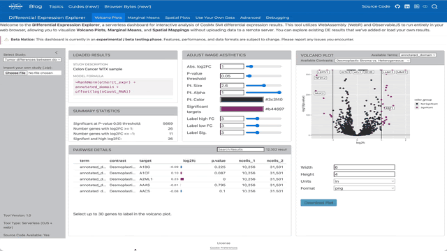

::: {.column-screen .hero-banner}
::: {.content-block}
# Scratch Space's Browser Bytes 🧬

Welcome to the new Browser Bytes section of Scratch Space. These are a collection
of "Byte-sized" dashboards and tools that you may find useful as you explore your
AtoMx® SIP, CosMx® SMI, or GeoMx® DSP data.
:::
:::

::: {.tech-note}
**Technical Note:** Browser Bytes are primarily client-side tools, meaning computation occurs within your browser. Performance may vary based on your hardware. As part of the **Scratch Space** initiative, these tools are experimental and have not undergone standard rigorous testing. We prioritize rapid delivery to help you iterate at the speed of discovery.
:::

::: {.content-block}
## Available Browser Bytes
::: {.card-grid}

::: {.tool-card}
::: {.thumbnail-container}

:::
### DE Explorer
**Differential Expression for CosMx® SMI**

A companion dashboard for interacting with results from AtoMx® SIP or `smiDE`.
Developed for rapid visualization of volcano plots and spatial contexts.

[Launch Dashboard →](de_explorer/index.html){.btn .btn-primary}
:::
::: {.tool-card .request-card}
### Request a Tool
**Have a specific workflow in mind?**
We prioritize new tools based on your feedback.
Help us expand the spatial toolkit by suggesting a feature or report.

[Create GitHub Issue](https://github.com/Nanostring-Biostats/CosMx-Analysis-Scratch-Space/issues/new?labels=BrowserBytes){target="_blank" .btn .btn-outline-primary}
:::
:::

