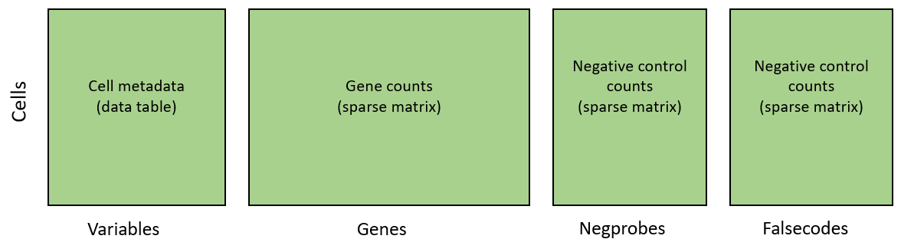

<style>
p.caption {
  font-size: 1.5em;
}
</style>
```{r, include = FALSE}
knitr::opts_chunk$set(
  collapse = TRUE,
  comment = "#>"
)
```


First we'll load the packages we need. 
Importantly, we'll load "Matrix", which handles *sparse matrices*. 
When a matrix has mainly zeroes, which is generally the case for single cell data,
storing it in sparse matrix format has huge memory savings. Given the size of CosMx
data, it is vital to be memory-efficient. 

Note: we'll store our count matrices with cells in rows and genes in columns. 
Many protocols arrange their count matrix the other way around, 
but our approach here will be more performant for most operations. 

```{r libraries}
# necessary libraries
library(data.table) # for more memory efficient data frames
library(Matrix) # for sparse matrices like our counts matrix
```

Now let's see the files we have to work with:

```{r files}
# location of flat files:
message(getwd())
myflatfiledir <- "../data/flatFiles"
dir(myflatfiledir)
# where to write output:
outdir <- ".."
```
So there are two slides, each with 4 files: an expression matrix, cell metadata, cell polygons, and a map of fov positions

Now we'll load in the flat files and format as we want. A function for parsing flat
files can be found in the "utils" folder:

```{r loading}
source("utils/loadFlatFiles.R")
atomxdata <- loadAtoMxFlatFiles(flatfiledir = myflatfiledir) 
str(atomxdata)
```

Now our data looks like this:




Next we save the data as .RDS files. These files are smaller on disk (they 
benefit from more compression than flat files do), and they're faster to read
back into R.

```{r saving}
if(!dir.exists(paste0(outdir, "/processed_data"))){
  dir.create(paste0(outdir, "/processed_data"))
}
saveRDS(atomxdata$counts, file = paste0(outdir, "/processed_data/counts_unfiltered.RDS"))
saveRDS(atomxdata$negcounts, file = paste0(outdir, "/processed_data/negcounts_unfiltered.RDS"))
saveRDS(atomxdata$falsecounts, file = paste0(outdir, "/processed_data/falsecounts_unfiltered.RDS"))
saveRDS(atomxdata$metadata, file = paste0(outdir, "/processed_data/metadata_unfiltered.RDS"))
```

Now we have data in 3 locations:

- The RDS files we just created
- The flat files we began with
- The original data on AtoMx

This is unnecessary duplication. Once you've confirmed this script has run successfully,
you can safely delete the flat files - you won't be using them again. 
If you do need to go back to them, you can always export them from AtoMx again:
AtoMx acts as a persistent, authoritative source of unmodified data.

### Note on data size

A reasonably high-performance compute instance can generally handle a few slides of 
 CosMx data using the scripts we use here. But once studies get to millions of cells, they
 can overwhelm the memory available to most analysts. At this point, you have two options:

1. Use data formats that store data on disk, not in memory, e.g. TileDB, SeuratDisk, hdf5... 
These tools can be harder to use.
2. Analyze your data one tissue at a time. Put all tissues through a standard analysis pipeline, then, for multi-tissue analyses, judiciously load in just the data you need
for a given analysis. 

Neither option is terribly convenient, but having millions or tens of millions of cells 
to analyze is worth some hassle. 


