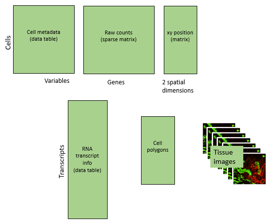

# Basic CosMx analysis workflow

## Introduction

This directory contains a complete demo analysis of a CosMx dataset. 
It's intended to be used as a template for other analyses to follow. 

We'll be analyzing a 6000-plex dataset from a _______.
We begin with the files written by the AtoMx flat file export module. 
The full dataset we've used is too big to be saved on Github. 
To follow along, we recommend using your own data, also as output by the AtoMx flat file export module.

## File structure

We'll organize the data for this analysis as follows:

- The "raw_data" folder holds the exports from AtoMx
- "processed_data" holds data objects generated during analysis, meant to be used by later analyses. 
- "results" holds results intended for human consumption.

And we'll organize code as follows:

- Analysis scripts are numbered by the order in which they should be run. Each creates data used by the downstream scripts. 
- Scripts are meant to be run in the directory where they lie.
- "utils" holds R scripts containing functions used by analyses.
  
## Data structure

Our flat file exports contain the following data types:

- Raw counts
- Cell metadata: other attributes of cells, e.g. size, immunofluorescence values, tissue and FOV IDs,...
- Spatial locations: xy locations given in mm. **Warning**: studies containing multiple slides may initially have overlapping xy locations.
- Transcript data: for all RNA transcripts detected, location, gene ID, and cell ID. Most analyses use cell-level data, not this transcript-level data, but it can make compelling plots.
- Tissue images. Not used by most analyses, but useful for Figures. 

Our analyses will append lots of new information to this starting point, ending here:

New data types include:
- UMAP coordinates
- Data acting as new metadata columns, e.g. cell type assignment and spatial cluster
- Special results objects from analyses: cell typing, differential expression, InSituCor, ...

## Workflow:

Our workflow performs the below steps:

First, the fundamentals:

- [Parse and format data export by AtoMx](0.%20loading%20flat%20files.Rmd)
- [Custom arranging of tissues and FOVs in space](1.%20finessing%20tissues%20spatial%20arrangement.Rmd)
- [QC and normalization](2.%20QC%20and%20normalization.Rmd)
- [Dimension reduction (PCA and UMAP)](3.%20dimension%20reduction.Rmd)
- [Cell typing](4.%20cell%20typing.Rmd)

Then, we go after biology:

- [Defining cells' spatial context](5.%20define%20spatial%20context.Rmd)
- Hypothesis-driven analyses, i.e. differential expression: how do cells change behavior based on their spatial context? (tbd)
- Hypothesis-generating analyses: identifying spatially correlated genes with InSituCor (tbd)

## General analysis advice

- For large experiments, [more advanced workflows](../../blog/big%20data%20strategies.md) may be needed to avoid overwhelming your compute and/or memory. 
- For studies across multiple flow cells, batch correction should be considered.
  

