## Introduction

CosMx (R) SMI analyses often culminate in a differential expression (DE) analysis. Exploratory analyses uncover all manner of interesting trends, and then these trends suggest hypotheses that can be tested with DE. A surprising breadth of questions can be framed as DE problems. To give a few examples:

-	How do tumor cells respond to the presence of T-cells?
-	How do microglia activate in regions of inflammation? 
-	How do microglia differ across brain regions?
-	How do T-cells change as they get farther from blood vessels?
-	How do fibroblasts respond to signaling from ligands in nearby cells?
-	How are macrophages different in inflamed tissue regions?
-	How do beta cells in pancreatic islets respond to local inflammation? 

Or, in the general form:

"How does *my favorite cell type* change in response to *some aspect of its environment*?"

The goal of this post is to review major topics in DE in spatial transcriptomics, and to provide code when necessary. 


## Setting up a DE question

Our experience suggests that most studies demand a highly custom DE question whose framing depends on the investigator’s primary questions and working assumptions about the biological system. To assist with this framing, we present below a collection of examples which, with slight modifications and remixing, covers most DE investigations you are likely to find productive. In each case we'll define a variable that can be used as a predictor in DE models.


### Important note: treatment of continuous variables

Say we want to run DE against a continuous variable like distance to a cell type, or the expression level of a cytokine in a cell's neighbors. 
We can calculate that distance (or neighborhood expression level) and use it as a predictor in our model. 
However, in doing so we implicitly assume a linear relationship between the variable and our outcome (either linear or log-scale gene expression, depending on the model). 
Other models might be more appropriate: we could consider transforming the variable, 
 or we could break it into bins for a non-parametric approach. 
In particular, we have often found that binning of continuous variables produces satisfactory results.

#### Transformations:
- If you think distance to a feature matters because of some diffused signals, then concentration of those molecules will vary with $distance^{-1}$.
- If neighborhood expression of a molecule is strongly right-tailed, which is likely, then a log transformation could prevent the end of the tail from having undue influence.
- To make effect sizes more interpretable, scale the variable from 0-1. 
- For variables with strong skew or long tails, a quantile transformation can prevent extreme values from exerting excess influence on DE results.

#### Binning / discretizing:
You can avoid assumptions about the shape of a variable by binning it, e.g. assigning cells to 20 bins of "distance to nearest T-cell". 
Then, you can use a likelihood ratio test against a null model (intercept-only) to test the compound null hypothesis that "this variable predicts expression." 
Because we usually have so many cells to work with, the slight loss in statistical power that 
 comes with this approach is usually a cheap tradeoff to make for its flexibility.
Also nice: you can use plots like the below to show how each gene changes expression across bins:

```{r echo = FALSE, eval = TRUE, out.width = "110%"}
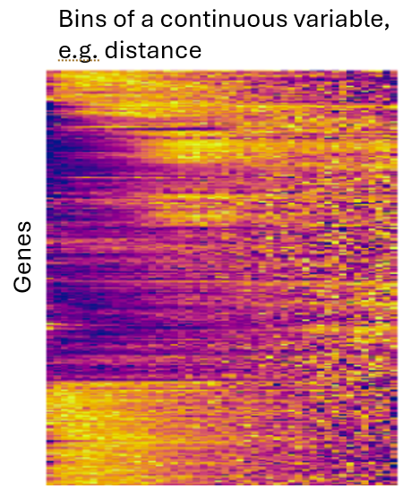
```

Note: When binning, examine the number of cells per bin. If some bins have too few cells to produce stable results, either consider discarding them, or take wider bins. 

#### Splines: flexibility without bins

Discretizing / binning has one drawback: the fit to discretized variables can be highly discontinuous, 
 e.g. with a single bin having a large estimated effect size. 
It often makes sense to assume your design variable's impact on gene expression varies smoothly 
 across its range. 
To achieve this, you can use splines:

```{r echo = TRUE, eval = FALSE, out.width = "110%"}
# define a continuous variable:
x <- rnorm(5000)
# fit splines to it, producing a matrix of 10 dimensions:
splinex <- as.matrix(splines::ns(x, df = 20))
# the "splinex" matrix can now be input into DE models

# how splinex relates to x:
o = order(x)
plot(x, splinex[,1], col = 0, xlab = "variable", ylab = "spline values", cex.lab = 1.3)
# draw each spline as a line:
for (i in 1:ncol(splinex)) {
  lines(x[o], splinex[o, i], col = scales::alpha("darkblue", 0.3))
}
```

```{r echo = FALSE, eval = TRUE, out.width = "170%"}
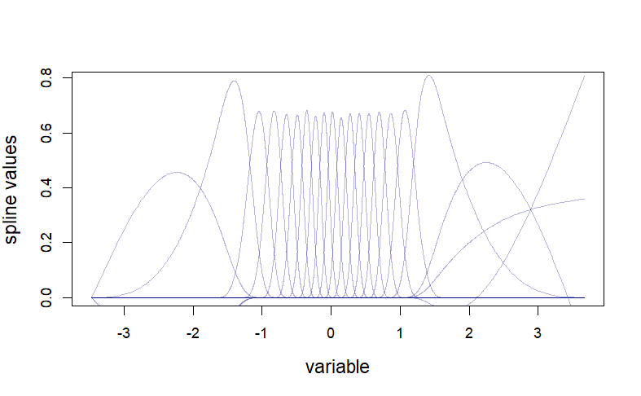
```

As with DE models fitting to bins, use a likelihood ratio test against an intercept-only null model, just as you would with a binned variable.
To explore your results, plot mean values across bins for your most significant genes.

### Example data

First, let's pull in data in a standard format. We'll assume you're starting with flat files exported from AtoMx, 
loaded with code similar to the below.


```{r echo = TRUE, eval = FALSE}
# Define paths
raw_data_dir <- "/path/to/raw/data"
out_dir <- "/path/to/out/dir"
slide_name <- "slideName" # Set this to your slide name, i.e. the identifier at the front of each flat file

# Read flat file exports: 
meta_data <- read.csv(paste0(raw_data_dir, "/", slide_name, "_metadata_file.csv.gz")) #Note this is a small file and we read it into a data frame for convenience
xy <- meta_data[, c("x_slide_mm", "y_slide_mm")]  
counts <- as.matrix(data.table::fread(  
  file.path(raw_data_dir, paste0(slide_name, "_exprMat_file.csv.gz"))
))  # <-------------------------------- PROBABLY WRONG ------------------------ #
# normalize:
norm_factors <- mean(meta_data$nCount_RNA) / meta_data$nCount_RNA 
norm <- Matrix::Diagonal(x = norm_factors) %*% counts
```

For our examples, we'll look at a subset of data from a breast tumor. 
Our metadata picks up midway through an analysis: we already have cell types and niche calls in the metadata. 
Here's a glance at all the metadata we'll use:

```{r echo = TRUE, eval = FALSE}
head(meta_data)
```

```{r echo = FALSE, eval = TRUE, out.width = "170%"}
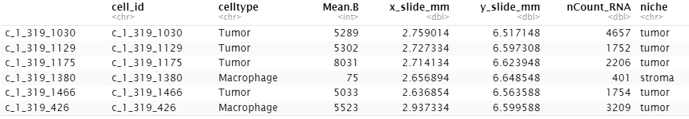
```


...and the sample itself:


```{r echo = TRUE, eval = FALSE}
clustcols  <- c(Tumor="#C4B7A6",Macrophage="#D55E00",Fibroblast="#009E73",dendritic="#CC79A7",`Necrotic cells`="#999999",Tcell="#0072B2",Plasma="#56B4E9",neutrophil="#E69F00",innate_lymphoid="#F0E442",Vasculature="#800000",nk="#117733",mast="#A65628",bcell="#6A3D9A",Unknown="#666666")

par(mar = c(0,0,0,0))
plot(xy, pch = 16, cex = 0.3, asp = 1,
     col = clustcols[meta_data$celltype], xlab = "", ylab = "")
legend("topleft", pch = 16, col = clustcols, legend = names(clustcols), cex = 0.7)
```

```{r echo = FALSE, eval = TRUE, out.width = "170%"}
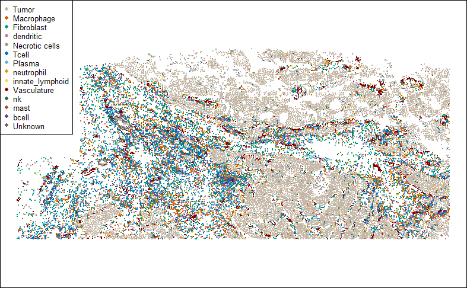
```


### Gallery of Differential Expression setups

Below are examples of variables useful for DE. 
In each case, we'll plot the variable spatially and provide code for defining it. 

#### Niche / spatial domain (unsupervised)

A great many algorithms exist for clustering cellular neighborhoods into niches / spatial domains. 
Lately we favor the Novae algorithm. 
However you define niches, they're often a reasonable basis for a DE analysis. 

```{r echo = TRUE, eval = FALSE}
## (use pre-calculated niche)
## plot niche:
inds <- meta_data$celltype == "Tumor"
par(mar = c(0,0,2,0))
plot(xy[inds, ], pch = 16, cex = 0.3, asp = 1,
     main = "Tumor cells colored by niche",
     col = c("dodgerblue3", "orange")[as.numeric(as.factor(meta_data$niche[inds]))],
     xlab = "", ylab = "")
points(xy[!inds, ], pch = 16, cex = 0.1, col = "grey80")
legend("topleft", pch = 16, col = c("dodgerblue3", "orange"), legend = paste0("niche = ", levels(as.factor(meta_data$niche[inds]))), cex = 0.7)
```
```{r echo = FALSE, eval = TRUE, out.width = "170%"}
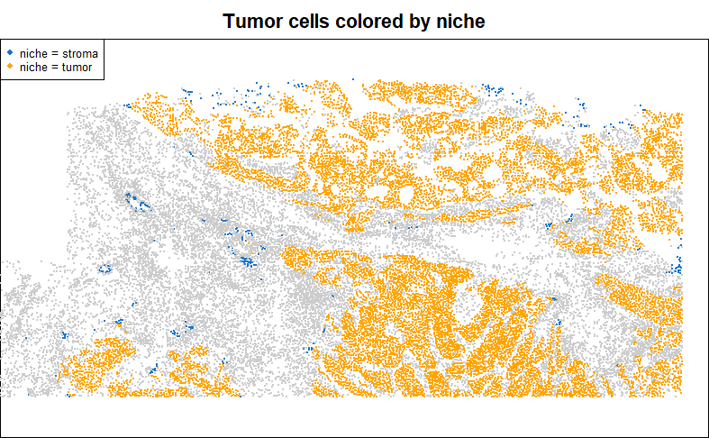
```


### Custom-defined niche

Niches defined through a spatial clustering algorithm are useful for exploring a dataset, 
but often they are not perfectly aligned to your understanding of a tissue. 
It is therefore often necessary to define niches by hand, to capture precisely the biology you want.
Examples include anatomical structures like cortical layers in the brain, 
disease states like areas of inflammation, or custom constructs like "near vs. far from glomeruli". 

In general, such partitions of the data can be built by applying the code of the following examples,
using thresholds to dichotomize continuous variables as needed.

For example, in a past anaylsis of a kidney, we defined niches as follows:

- "glomeruli": cells with >30% of their nearest neighbors being glomerulus-specific cell types (podocyte, mesangial cell, glomerular endothelial cells).
- "glomerular boundary": cells within a fixes distance of glomeruli
- "tubulointerstitium": everything else
- "immune hotspots": cells with >10 immune cells in their nearest neighbors. This overrode all the above annotations. 

This approach was driven by our knowledge of the tissue and by our biological questions. 


### Distance to nearest cell from a given cluster / group

A common and productive DE question is: how does my favorite cell type change with proximity to another cell type? 

To demonstrate how to ask this kind of question, below we score tumor cells by their distance to the nearest T-cell:

```{r echo = TRUE, eval = FALSE}
## Calculate tumor cells' distance to nearest T-cell:
inds.tumor <- meta_data$celltype == "Tumor"
inds.t     <- meta_data$celltype == "Tcell"
stopifnot(any(inds.tumor), any(inds.t))
dist2tcell <- FNN::get.knnx(
  data  = as.matrix(xy[inds.t, , drop=FALSE]),
  query = as.matrix(xy),
  k = 1
)$nn.dist[, 1]
# store in metadata:
meta_data$dist2tcell <- dist2tcell

## plot tumor cells, coloring by distance to T-cell:
par(mar = c(0,0,2,0))
plot(xy[inds.tumor, ], pch = 16, cex = 0.3, asp = 1,
     main = "Tumor cells colored by distance to T-cell",
     col = colorRampPalette(c(c("#A6CEE3","#1F78B4","#081D58", "black")))(101)[
       1 + round(100 * dist2tcell / max(dist2tcell))
     ][inds.tumor],
     xlab = "", ylab = "")
points(xy[!inds.tumor, ], pch = 16, cex = 0.1, col = "wheat")
points(xy[inds.t, ], pch = 16, cex = 0.3, col = "red")

legend("topleft", pch = 16, col = c("#1F78B4", "red", "wheat"), 
       legend = c("Tumor cells (colored by distance to T-cells)", "T-cells", "other cells"), cex = 0.7)
```

```{r echo = FALSE, eval = TRUE, out.width = "170%"}
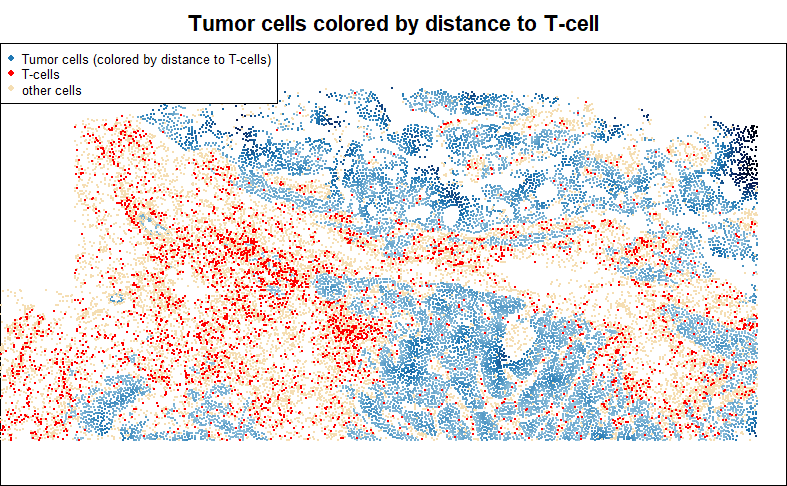
```


### Distance to nearest cell from an anatomical structure

Many cell types fall in structures, e.g. blood vessels, tumor glands, or glomeruli. 
When calculating distance to a structure, it is tempting to simply record distance to the nearest
 relevant cell type, e.g. endothelial cells for blood vessels, or tumor cells for tumor glands, or podocytes and mesangial cells for glomeruli. However, this approach is easily distorted by sporadic cell typing errors. 
It is more robust to look at distance to the nearest *spatially contiguous group* of the target cell type.

Below, we'll define an annotation for 'vascular structure', based on contiguous groups of endothelial cells. 
We use DBSCAN algorithm, an incredibly fast algorithm which can cluster together cells within a fixed radius of each other. We'll keep only cells that fall in clusters of at least 3. 


```{r echo = TRUE, eval = FALSE}
## show the target cell type: endothelial cells:
inds <- meta_data$celltype == "Vasculature"
par(mar = c(0,0,2,0))
plot(xy[, ], pch = 16, cex = 0.1, asp = 1,
     main = "Vasculature", col = "grey80",
     xlab = "", ylab = "")
points(xy[inds, ], pch = 16, cex = 0.3, col = "darkred")
```


```{r echo = FALSE, eval = TRUE, out.width = "170%"}
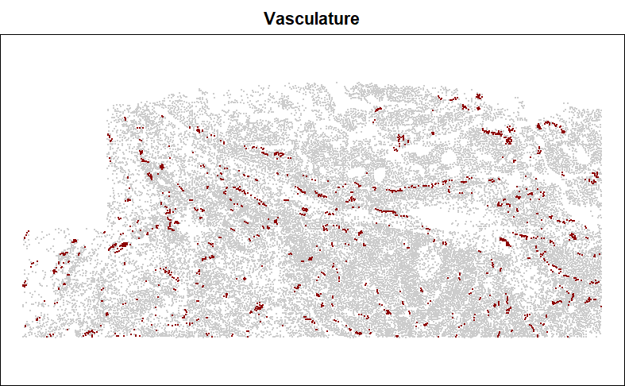
```

```{r echo = TRUE, eval = FALSE}
## use dbscan to isolate clusters of Vasculature cells:
db <- dbscan::dbscan(xy[inds, ],
                     eps = 0.05, # very small radius
                     minPts = 3)$cluster
inds.in.clusters <- db != 0
is.vessel <- inds
is.vessel[which(inds)] <- inds.in.clusters
# store in metadata:
meta_data$is.vessel <- is.vessel

## show the result:
par(mar = c(0,0,2,0))
plot(xy[, ], pch = 16, cex = 0.1, asp = 1,
     main = "Vasculature after filter with dbscan", col = "grey80",
     xlab = "", ylab = "")
points(xy[inds & !is.vessel,], pch = 16, cex = 0.3, col = "blue")
points(xy[is.vessel, ], pch = 16, cex = 0.3, col = "red")
legend("topleft", pch = 16, col = c("red", "blue"), 
       legend = c("Blood vessel cells", "Vasculature cells excluded by dbscan"))
```


```{r echo = FALSE, eval = TRUE, out.width = "170%"}
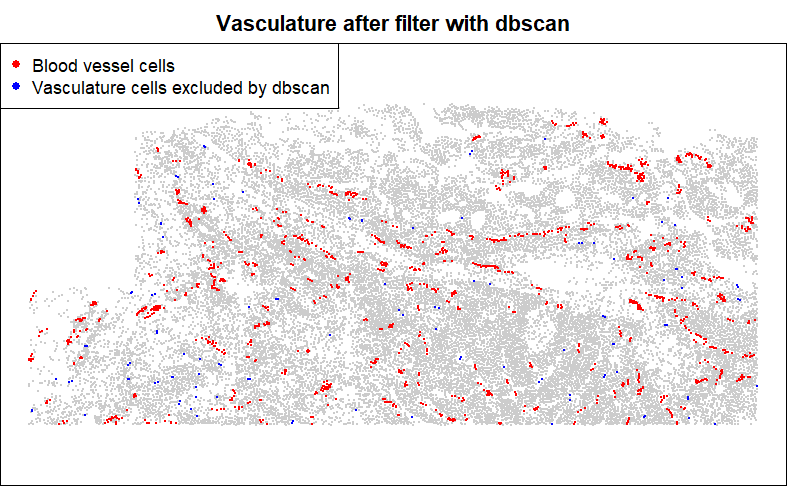
```

After obtaining this cleaned up annotation, we could then take the distance to it using  
 code from the tumor distance to T-cell example earlier. 

### Number of a given cell type in a neighborhood

Another common question: how does a cell type change in response to the abundance of another cell type in its neighborhood? Here we'll log-transform our predictor to acknowledge the probability of diminishing effects of each new T-cell in a tumor cell's neighborhood. 

```{r echo = TRUE, eval = FALSE}
## Calculate the number of T-cells in each tumor cell's neighborhood:
inds.tumor <- meta_data$celltype == "Tumor"
inds.t <- meta_data$celltype == "Tcell"

# get the 50 nearest neighbors of each cell:
neighbors <- InSituCor:::nearestNeighborGraph(x = xy[, 1], y = xy[, 2], N = 50)
# (or alternatively, get neighbors within a radius of 0.1mm):
neighbors.radius <- InSituCor:::radiusBasedGraph(x = xy[, 1], y = xy[, 2], R = 0.1)

# count the T-cells among cells' neighbors:
neighboring.tcells <- InSituCor:::neighbor_sum(x = 1 * (meta_data$celltype == "Tcell"),
                                               neighbors = neighbors)
log.neighboring.tcells <- log2(1 + neighboring.tcells)
# store in metadata:
meta_data$log.neighboring.tcells <- log.neighboring.tcells

# color tumor cells by the number of T-cell neighbors:
par(mar = c(0,0,2,0))
plot(xy[inds.tumor, ], pch = 16, cex = 0.3, asp = 1,
     main = "Tumor cells colored by log2(number of T-cell neighbors)",
     col = colorRampPalette(c(c("#A6CEE3","#1F78B4","#081D58", "black")))(101)[
       1 + round(100 * log.neighboring.tcells / max(log.neighboring.tcells))
     ][inds.tumor],
     xlab = "", ylab = "")
points(xy[!inds.tumor, ], pch = 16, cex = 0.1, col = "wheat")
points(xy[inds.t, ], pch = 16, cex = 0.3, col = "red")
legend("topleft", pch = 16, col = c("#1F78B4", "red", "wheat"), 
       legend = c("Tumor cells colored by log2(number of neighboring T-cells)", "T-cells", "other cells"), cex = 0.7)
```

```{r echo = FALSE, eval = TRUE, out.width = "170%"}
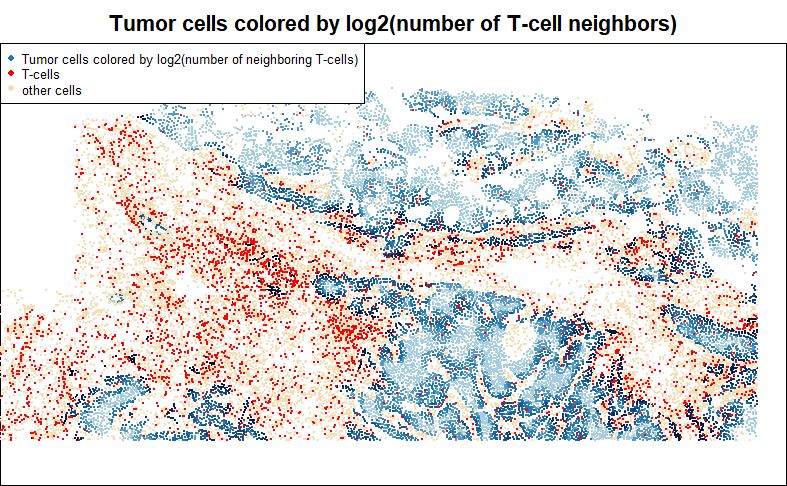
```


### Gene expression in cells' neighborhoods

To investigate how a gene impacts nearby cells, we can run differential expression against the gene's total expression in each cell's neighborhood. 
Below, we score macrophages for the total abundance of CXCL14 in their neighborhoods.
This sets us up for DE studies of how macrophages respond to signaling from CXCL14.
In the below example, we take the additional step of log-transforming neighborhood CXCL14.

```{r echo = TRUE, eval = FALSE}
## get average CXCL14 expression in each cell's neighborhood:

# get the 50 nearest neighbors of each cell:
neighbors <- InSituCor:::nearestNeighborGraph(x = xy[, 1], y = xy[, 2], N = 50)
# (or alternatively, get neighbors within a radius of 0.1mm):
neighbors.radius <- InSituCor:::radiusBasedGraph(x = xy[, 1], y = xy[, 2], R = 0.1)

# normalized CXCL14:
normvals <- counts[, "CXCL14"] / meta_data$nCount_RNA
# get average CXCL14 expression in each cell's neighborhood:
neighboring.cxcl14 <- InSituCor:::neighbor_sum(x = normvals,
                                               neighbors = neighbors)
log2.neighboring.cxcl14 <- log2(1 + neighboring.cxcl14)
# add to metadata:
meta_data$log2.neighboring.cxcl14 <- log2.neighboring.cxcl14

## plot macrophages, coloring by local CXCL14 expression:
inds.mac <- meta_data$celltype == "Macrophage"
par(mar = c(0,0,2,0))
plot(xy, pch = 16, cex = 0.1, asp = 1, col = "wheat",
     main = "Macrophages colored by log2(neighborhood CXCL14 expression)",
     xlab = "", ylab = "")
points(xy[inds.mac, ], pch = 16, cex = 0.4, 
            col = colorRampPalette(c(c("#A6CEE3","#1F78B4","#081D58", "black")))(101)[
       1 + round(100 * log2.neighboring.cxcl14 / max(log2.neighboring.cxcl14))
     ][inds.mac])
legend("topleft", pch = 16, col = c("#1F78B4", "wheat"), 
       legend = c("Macrophages colored by log2(neighborhood CXCL14 expression)", "other cells"), cex = 0.7)


```

```{r echo = FALSE, eval = TRUE, out.width = "170%"}
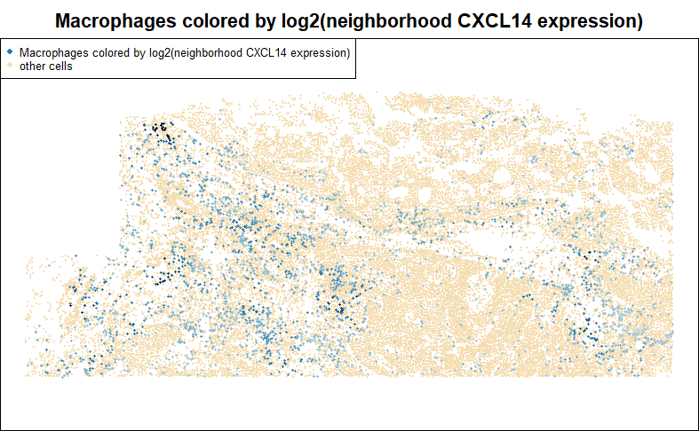
```


### Distance to a hand-selected region

Sometimes it's easier to select a region of a tissue by hand than to devise a computational rule to do so. 
If your study has e.g. hundreds of glomeruli, you probably want a rule to define in/out of a glomerulus. 
But if your study has e.g. just a few tertiary lymphoid structures, it's probably simpler to circle them by hand. 
Below is code for hand-drawing Regions Of Interest (ROIs) and flagging cells as in/out of them:

```{r echo = TRUE, eval = FALSE}
#' Define roi's by Clicking on cells in a graphics window
#' 
#' How to use:
#' \itemize{
#' \item Plot your cells in xy space. Use asp = 1. 
#' \item Click cells around the boundary of your roi.
#' \item Hit enter or escape when done with your selection.
#' }
#' Other details:
#' \itemize{
#' \item Uses graphics::identify() to select points. 
#' \item Only works for base graphics, not ggplots.
#' \item Can go wrong (draw rois in the wrong place) if the plot doesn't have asp = 1. 
#' }
#' @param xy Matrix of xy positions used in the plot. 
#' @param show Logical, for whether to show the selected roi when you're done. 
#' @param type One of:
#' \itemize{
#' \item "direct" to define the boundary points in order, exactly as you click
#' \item "ahull" to draw an alpha hull around your selection
#' } 
#' @return A list with 3 elements:
#' \itemize{
#' \item roi: The indices of the points in the roi
#' \item selected: The indices of the user-selected points
#' \item hull: The hull of the roi, either the user-selected polygon or the results of alphahull:ahull}
#' @importFrom graphics identify
#' @importFrom alphahull ahull
#' @
defineROI <- function(xy, type = "direct", boundary_points = NULL, show = TRUE) {
  if (!is.null(boundary_points)) {
    hull.x <- boundary_points[, 1]
    hull.y <- boundary_points[, 2]
    # get points in the boundary:
    roi <- sp::point.in.polygon(point.x = xy[, 1], point.y = xy[, 2], 
                                pol.x = hull.x, pol.y = hull.y) > 0
    inds <- NULL
    hull <- NULL
  }
  if (is.null(boundary_points)) {
    
    if (!is.element(type, c("direct", "ahull"))) {
      stop("must either give boundary_points or set type to \'direct\' or \'ahull\'")
    }
    # user identifies boundary:
    identifyres <- identify(xy, plot = FALSE, order = TRUE)
    inds <- identifyres$ind[order(identifyres$order)]
    
    if (type == "direct") {
      # The hull is just the polygon you've selected:
      hull.x <- xy[inds, 1]
      hull.y <- xy[inds, 2]
      hull <- inds
      # get points in the boundary:
      roi <- sp::point.in.polygon(point.x = xy[, 1], point.y = xy[, 2], 
                                  pol.x = hull.x, pol.y = hull.y) > 0
    }
    
    if (type == "ahull") {
      # get alpha hull of boundary:
      hull <- alphahull::ahull(xy[inds, 1], xy[inds, 2], alpha = 0.05)
      # get points in the boundary:
      roi <- alphahull::inahull(ahull.obj = hull, xy)
    }
    
  }
  # plot:
  if (show) {
    points(xy[inds, ], col = "red", cex = 0.5, pch = 16)
    polygon(xy[hull, ])
    points(xy[roi, ], pch = 16, cex = 1, col = scales::alpha("gold", 0.3))
  }
  
  out = list(roi = roi, selected = inds, hull = hull)
  return(out)
}


## example usage:
clustcols  <- c(Tumor="#C4B7A6",Macrophage="#D55E00",Fibroblast="#009E73",dendritic="#CC79A7",`Necrotic cells`="#999999",Tcell="#0072B2",Plasma="#56B4E9",neutrophil="#E69F00",innate_lymphoid="#F0E442",Vasculature="#800000",nk="#117733",mast="#A65628",bcell="#6A3D9A",Unknown="#666666")

par(mar = c(0,0,0,0))
plot(xy, pch = 16, cex = 0.3, asp = 1,
     col = clustcols[meta_data$celltype], xlab = "", ylab = "")

roi <- defineROI(xy, type = "direct", show = TRUE) 
```


```{r echo = FALSE, eval = TRUE, out.width = "170%"}
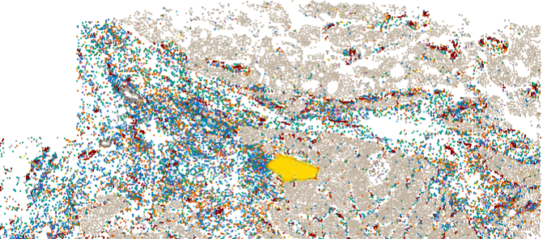
```


Note that the ```identify()``` function used by ```defineROI()``` above can be finnicky
 and surprisingly challenging to debug.
If it works in your R environment, great. If not, then you can instead 
call the ```defineROI()``` function as below code to 
flag cells inside a set of xy coordinates.

```{r echo = TRUE, eval = FALSE}
# draw the tissue:
clustcols  <- c(Tumor="#C4B7A6",Macrophage="#D55E00",Fibroblast="#009E73",dendritic="#CC79A7",`Necrotic cells`="#999999",Tcell="#0072B2",Plasma="#56B4E9",neutrophil="#E69F00",innate_lymphoid="#F0E442",Vasculature="#800000",nk="#117733",mast="#A65628",bcell="#6A3D9A",Unknown="#666666")
par(mar = c(2,2,0,0))
plot(xy, pch = 16, cex = 0.3, asp = 1,
     col = clustcols[meta_data$celltype], xlab = "", ylab = "")

# place a grid over it to determine where to pick boudnary points:
abline(h = pretty(range(xy[,2]), n=30), v = pretty(range(xy[,1]), n=30), lty=3, col="grey20")

# select points by hand:
boundary_points <- t(matrix(c(
    1.85,7.05,
    2,7.1,
    2.05,6.95,
    1.95,6.85,
    1.87,6.9
), nrow = 2))

# define the ROI, i.e. the points in the boundary:
roi <- defineROI(xy, type = NULL, boundary_points = boundary_points, show = TRUE) 
```


```{r echo = FALSE, eval = TRUE, out.width = "170%"}
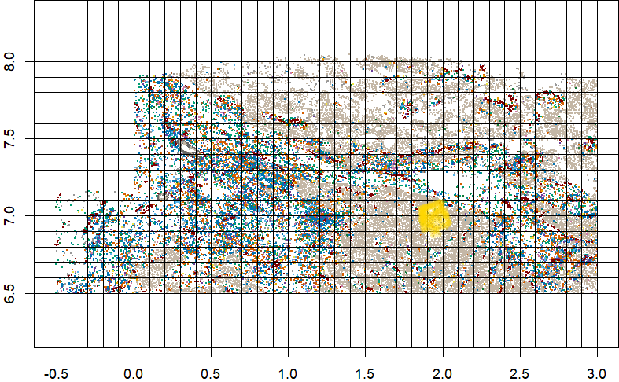
```

Then, you can record distance to your ROI:

```{r echo = TRUE, eval = FALSE}
## Calculate macrophages' distance to nearest T-cell:
inds.mac <- meta_data$celltype == "Macrophage"
inds.roi <- roi$roi
dist2roi <- FNN::get.knnx(
  data = xy[inds.roi, ], # 2-column matrix of xy locations
  query = xy, 
  k = 1)$nn.dist
# add to metadata:
meta_data$dist2roi <- dist2roi


## plot:
par(mar = c(0,0,0,0))
plot(xy, pch = 16, cex = 0.1, asp = 1,
     col = "wheat", xlab = "", ylab = "")
points(xy[inds.roi, ], pch = 16, col = "orange", cex = 0.5)
points(xy[inds.mac, ], pch = 16, cex = 0.5,
       col = colorRampPalette(c("#A6CEE3","#1F78B4","#081D58", "black"))(101)[
       1 + round(100 * dist2roi / max(dist2roi))][inds.mac])
legend("topleft", pch = 16,
       col = c("#1F78B4", "orange", "wheat"),
       legend = c("Macrophages colored by distance to ROI",
                  "Cells in ROI",
                  "Other cells"))

```


```{r echo = FALSE, eval = TRUE, out.width = "170%"}
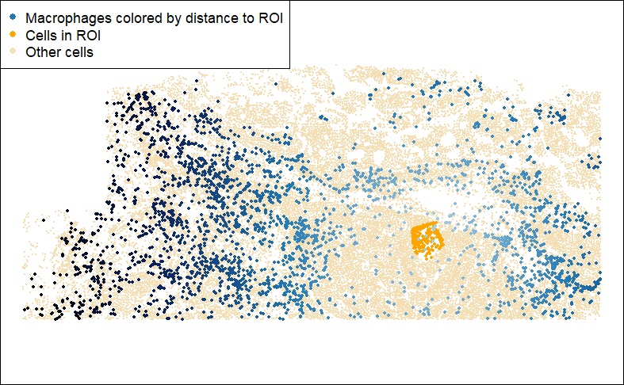
```

## Considerations for running DE

Above we showed how to set up a variable to run DE against. 
Now we turn to the mechanics of actually running DE.
We'll discuss 2 important topics:

- How to handle bias arising from cell segmentation errors
- How to account for possible spatial correlation in your data

Both of these topics are discussed in great depth in [this preprint](https://www.biorxiv.org/content/10.1101/2024.08.02.606405v2.abstract){target="_blank"},
which accompanies our differential expression package smiDE ([blog post](https://nanostring-biostats.github.io/CosMx-Analysis-Scratch-Space/posts/smiDE/){target="_blank"})  ([package](https://github.com/Nanostring-Biostats/CosMx-Analysis-Scratch-Space/tree/Main/_code/smiDE){target="_blank"}).
Here we'll merely summarize. 

### Bias from segmentation errors:

Until the day that cell segmentation algorithms become perfectly accurate, 
 cells' expression profiles will occasionally be assigned transcripts from neighboring cells.
Because the gene identity of these misassigned transcripts isn't random across space, 
 they can act as a powerful unmodeled confounding variable. 
For example: if we're comparing T-cells in the stroma to T-cells in the tumor,
 the stroma T-cell profiles will contain transcripts from fibroblasts, and 
 the tumor T-cell profiles will contain transcripts from tumor cells. 
DE will then discover many highly significant genes: fibroblast genes will appear up-regulated 
 in stroma T-cells, and tumor genes will appear up in tumor-residing T-cells. 
These spurious hits waste analyst time and compromise analysis quality.  

We propose two countermeasures to this bias, both implemented in the smiDE package:

1. **Don't even analyze the genes at greatest risk of this bias.**
If you're running DE on T-cells, don't include genes like EPCAM, which is highly abundant in tumor cells and nearly absent in T-cells. smiDE implements a simple filter to flag genes based on their risk of cell segmentation bias - see the function ```overlap_ratio_metric()```.

2. **In the remaining genes, adjust for minor bias.** We measure a gene's potential to suffer 
 misassignment into a cell using its mean expression *in other cell types* around the cell. This then becomes a term in DE models. 
Taking this step mitigates bias from segmentation errors, though does not fully remove it. 

 
### Accounting for spatial correlation

Due to the large number of cells in most experiments, it's common for DE analyses 
 to produce infinitesimal p-values, e.g. 10^-60. 
This seems intuitively wrong: how can a dataset hold such strong evidence for expression changes? 
Where traditional models differ from our intuition (and from common sense) is the assumption 
 that every cell is *independent* from every other cell. 
This is almost never true: cells nearby each other are subject to similar environmental influences
 unrelated to our design variables, so so their standard errors will be dependent, or correlated. 
In practice, this means that p-values from models assuming independence will be profoundly over-excitable.

The field of spatial statistics has long grappled with inference in the presence of spatial correlation such as this,
 and a sizeable arsenal of methods has been developed.
In Vasconcelos & McGuire et al., the aforementioned preprint, we characterize the performance of many of these methods, along with some new ones we propose. 
We find a tradeoff between accuracy and computational efficiency, with the best methods taking unacceptably 
 long to run in large datasets. 
Our key finding is that ignoring spatial correlation, i.e. running a traditional DE method,
 leads to large numbers of false positive hits, often far in excess of the presumed true positive hits whose p-values survive accounting for spatial correlation.
Whichever method in the paper seems suitable for your study, you can run it using  
[our R package smiDE](https://github.com/Nanostring-Biostats/CosMx-Analysis-Scratch-Space/tree/Main/_code/smiDE){target="_blank"}. 

### Other model choice considerations

We find that negative binomial models outperform Gaussian models, but at a cost in computational time. 
Poisson models offer a middle ground in terms of computational time, but typically underestimate standard errors, leading to inflated Type I errors.

The performance of Gaussian models is generally acceptable, making them a reasonable choice
 when computation time is a limitation. 
smiDE implements all these options under a variety of spatial correlation-aware methods. 


## Approach for maximal speed: simultaneous fitting of all genes using linear algebra

Unfortunately, there’s a cost in compute time and money to many of the more theoretically optimal DE approaches
(e.g. using a NB distribution, accounting for spatial correlation, adjusting for bias from segmentation errors). 
An analysis of 19k genes in hundreds of thousands of cells can take a reasonably powerful EC2 instance a day or more to complete. 
When computation time is a concern, or when simply pursuing exploratory analysis, we recommend using a less optimal but much faster approach. 
In the code below, we demonstrate how to run a basic Gaussian / “ordinary least squares” regression simultaneously across all genes at once. This code returns reasonable DE results in seconds. 
This approach cannot model spatial correlation, nor can it even adjust for confounding from cell segmentation errors.
But its speed makes it very useful for exploratory analyses. 
It could also be used to prioritize genes for more computationally expensive models. 

```{r echo = TRUE, eval = FALSE}
source()

### Example usage:
# run DE:
inds.tumor <- meta_data$celltype == "Tumor"
inds.t <- meta_data$celltype == "Tcell"
dist2tcell <- FNN::get.knnx(
  data = xy[inds.t, ], # 2-column matrix of xy locations
  query = xy, 
  k = 1)$nn.dist

out <- hastyDE(y = norm[inds.tumor, ], 
               df = data.frame("dist2tcell" = dist2tcell[inds.tumor])) 
str(out)
```


## Multi-tissue analyses 

So far we have only discussed the case of a single-tissue analysis. 
When analyzing multiple tissues, we have a simple recommendation: 
 instead of running one giant DE model across all tissues at once, 
 run your model separately for each tissue. 
This approach has a few benefits. First, it's easier to manage computationally - you don't need to load several large datasets into memory at once. 
Second, it's scientifically appealing: we'll usually have relatively few tissues and a whole lot of cells per tissue. 
This means we're powered to run DE within each tissue, and there are few enough tissues that we have the cognitive ability to understand their results individually rather than averaged together. This per-tissue approach lets you see conclusions like, "T-cells react strongly to tumor cells in these three tissues, but not in these other two." 
If you want to reduce a DE relationship to a single number, you can always use metaanalysis techniques to get the average relationship across all tissues.

Our favorite way to display a multi-tissue DE analysis is with a heatmap of per-tissue results, 
 coloring by effect size when results meet a p-value threshold:
 
```{r echo = FALSE, eval = TRUE, out.width = "170%"}
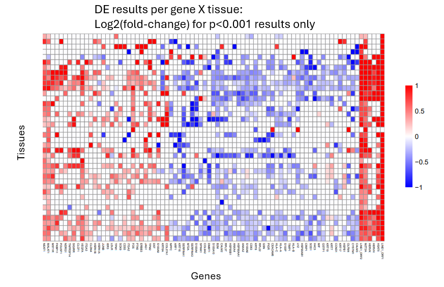
```

This approach lets you see which DE trends are universal and which are tissue-specific. 

### Best practices for multi-tissue DE:

1. Choose an appropriate single-tissue DE approach as described earlier. We recommend the smiDE library for most cases. 
2. As with all DE analyses, remove genes failing smiDE's cell overlap ratio metric. 
3. Display results in a heatmap of genes x tissues. Color by effect size, and only give color to results with p < 0.001 (or choose your own threshold). Show only genes that meet a strong effect size / p-value threshold in at least one tissue.
4. Summarize each gene's total evidence with a meta-analysis. We have had luck with the metafor package. 

 
## Experimental approach: stratifying DE across tissue patches

Here we describe an alternative, experimental approach to DE that we have found to be useful. 

Our motivation is twofold:

1. Biology: we'll often expect a DE relationship to vary across space, or to only occur locally. For example, perhaps T-cells only respond to nearby tumor cells when they're in the nutrient-rich stroma rather than the tumor interior. When we look across the whole tissue for this relationship, we have a harder time discovering it since we model both regions where it occurs and regions where it doesn't. 
In statistical terminology: unobserved variables across the span of the tissue are acting as effect modifiers. 
2. Convenience: because accounting for spatial correlation can be slow, running DE on a highly abundant cell type often means making a choice between extreme compute times or using sub-optimal methods that ignore spatial correlation. 

Our solution is to divide the tissue into small patches, then to run DE separately within each patch. 
This produces a matrix of DE results across genes X patches. 
Then looking at patch-specific results, we can discover strong relationships that only occur in a few places. 
And using metaanalysis techniques across all patches, we recover our ability to discover relationships that exist broadly. 
In short, we get a more nuanced picture of DE behavior within a diverse tissue. 

This approach has one other benefit: when we analyze small patches, spatial correlation becomes less important, 
 as the spatial context within a given patch will be less variable than spatial context across a whole tissue.
This lets us run the super-fast \code{hastyDE} algorithm above within each patch. 
The speed benefit of this approach is so great that even in a large WTX dataset we obtain full DE results 
 across all patches in minutes, while running just a single tissue-wide model for each gene might take a day. 

To support patch-based DE. We have created an algorithm to partition a tissue into patches. 
This algorithm, "varrymander", attempts to build patches that achieve a balance between the following goals:

- Ensure each patch has reasonable statistical power 
- Prevent overly large patches
- Build as many patches as possible

In other words, we seek to gerrymander the tissue into districts of similar size and with high variance 
 of the predictor variable. 
 
The varrymander algorithm is available as a .R script [here](https://github.com/Nanostring-Biostats/CosMx-Analysis-Scratch-Space/blob/Main/_code/varrymander/varrymander.R){target="_blank"}.

Below is a demonstration of varrymander's use in DE. 

First we use varrymander to define patches:


```{r echo = TRUE, eval = FALSE}
### use Patch DE to partition the tissue into patches:
source("https://github.com/Nanostring-Biostats/CosMx-Analysis-Scratch-Space/blob/Main/_code/PatchDE/DEutilsr.R")

# define your design variable:
inds.tumor <- meta_data$celltype == "Tumor"
inds.t     <- meta_data$celltype == "Tcell"
stopifnot(any(inds.tumor), any(inds.t))
dist2tcell <- FNN::get.knnx(
  data  = as.matrix(xy[inds.t, , drop=FALSE]),
  query = as.matrix(xy),
  k = 1
)$nn.dist[, 1]

patches <- getPatches(xy = xy[inds.tumor, ], 
                      X = dist2tcell[inds.tumor], 
                      dbscan_eps = 0.05, maxdbsize = 50, 
                      maxradius = 0.5,
                      totvarthresh = 100  # main driver of patch size
) # produces a vector of patch assigments, potentially including NA's for cells not given a patch


# to view, draw polygon boundaries around each patch:
polys <- getPatchPolys(xy = xy[inds.tumor, ], patch = patches)

# plot patches:
par(mar = c(0,0,2,0))
plot(xy[inds.tumor, ], pch = 16, cex = 0.3, asp = 1,
     main = "Tumor cells colored by distance to T-cell, with patches for stratified DE",
     col = colorRampPalette(c(c("#A6CEE3","#1F78B4","#081D58", "black")))(101)[
       1 + round(100 * dist2tcell / max(dist2tcell))[inds.tumor]
     ],
     xlab = "", ylab = "")
for (i in 1:length(polys)) {
  polygon(polys[[i]], border = "black")
}
```

```{r echo = FALSE, eval = TRUE, out.width = "170%"}
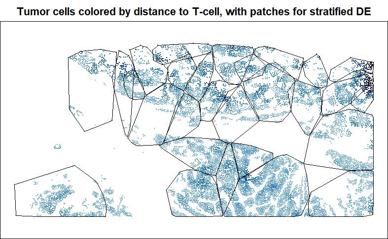
```

And now we run DE within each patch:

```{r echo = TRUE, eval = FALSE}
### run DE in each patch, using hastyDE, which computationally-efficient but ignores spatial correlation:
deresults <- patchDE(y = norm[inds.tumor, ],
                     df = data.frame("dist2tcell" = dist2tcell[inds.tumor]),
                     patch = patches)

  
### explore the results:

# find genes with strong results in any region
lowestp <- apply(deresults$dist2tcell$pvals, 1, min)
topgenes1 <- names(lowestp)[order(lowestp, decreasing = TRUE)[1:50]]

# use meta-analysis to summarize genes' trends across patches
metapvals <- sapply(rownames(deresults$dist2tcell$pvals), function(gene) {
  fit <- metafor::rma.uni(yi = deresults$dist2tcell$ests[gene, ], 
                          sei = deresults$dist2tcell$ses[gene, ], 
                          method = "REML")
  return(fit$pval)
})
topgenes2 <- names(metapvals)[order(metapvals, decreasing = TRUE)[1:50]]

## now use a heatmap to plot results from either list of top genes:
pheatmap::pheatmap((ests * (pvals < 1e-3))[topgenes1, ],
         col = colorRampPalette(c("darkblue", "white", "darkred"))(100),
         breaks = seq(-1, 1, length.out = 101))
```
 
Below is an example snippet of a heatmap of DE results on varrymander patches from a larger study:

```{r echo = FALSE, eval = TRUE, out.width = "170%"}
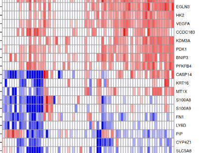
```

## Comment on statistical power and false discoveries

Very large numbers of cells give us very high statistical power to detect even tiny effect sizes. 
Paradoxically, this creates a hazard for analysts,
as our high statistical power applies both to real effects **and** to the effects of unmeasured confounding variables. Now it's usually a safe assumption that a given gene is being influences by a variety of factors in a tissue, many 
 of them unmeasured and at least lightly correlated with your design variable. 
In other words, any given gene is likely subject to unmeasured confounding, meaning there's a false positive signal that we are well-powered to find significant and get fooled by. 

The countermeasure to this phenomenon is simple: don't get excited by p-values, but rather focus on effect sizes. 
The stronger a gene's fold-change with your design variable, the more likely the change you see is driven by your design variable rather than unobserved confounders. You should still apply a reasonable p-value or FDR cutoff, but beyond that cutoff you should rank genes by effect size.  


## The limitations of DE

DE analyses have a tidy framework: you specify variables that you hypothesize will impact gene 
 expression, then you look for which genes correlate with those variables. 
But when we look at gene expression in space, we often find variability far beyond the explanatory ability of 
 any variables we known enough to specify. 
In other words, the spatial determinants of gene expression are far more complicated than the DE models
we build from our limited biological knowledge. 
This does not mean the DE is futile - we still consider it the primary tool for wringing biology from spatial data - but it's worth keeping some implications of this phenomenon in mind: 

1. When DE identifies a gene, look at its expression in space and evaluate: how much of its variability is due to your design variable? Are there other strong spatial trends that suggest a different explanation? 
Taking the Moran's I stat of a gene's residuals could also be useful:

```{r echo = TRUE, eval = FALSE}
inds.tumor <- meta_data$celltype == "Tumor"
W <- spdep::dnearneigh(xy[inds.tumor, ], 0, quantile(FNN::get.knn(xy[inds.tumor, ], k=1)$nn.dist[,1], .95))
Wl <- spdep::nb2listw(W, style="W", zero.policy = TRUE)
outcome <- norm[inds.tumor, "VEGFA"]
predictor <- dist2tcell
spdep::moran.test(residuals(lm(outcome ~ predictor)), Wl)
```

2. To understand a tissue, you should also pursue approaches that are not limited by the design variables you specify. Look for spatial variable genes, or for [spatially correlated genes](https://nanostring-biostats.github.io/CosMx-Analysis-Scratch-Space/posts/insitucor/){target="_blank"}, or for [perturbed spatial neighborhoods](https://nanostring-biostats.github.io/CosMx-Analysis-Scratch-Space/posts/insitudiff/){target="_blank"}. These unsupervised, exploratory approaches will reveal the strongest spatial signals in your data without requiring you to know the full set of explanatory variables a priori. 
