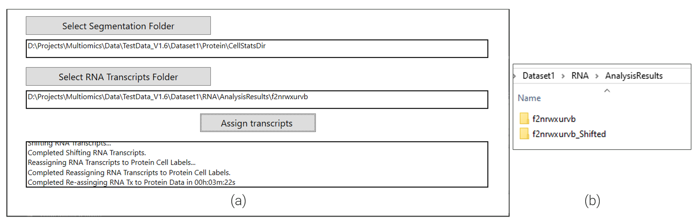

# CosMx<sup>&#174;</sup> SMI Aligned RNA to Expression matrix

When running a multiomic CosMx<sup>&#174;</sup> SMI experiment, RNA data must be aligned to protein data as described in the post [here](../multiomics-alignment/index.qmd). This alignment generates new transcript location files for each FOV in a folder with the suffix `_Shifted`, as shown in panel (b) of the screenshot below (@fig-align-screenshot).

```{r}
#| label: fig-align-screenshot
#| fig-cap: "Output of RNA alignment to protein data"
#| out-width: "100%"
#| echo: false


```


For downstream analysis, it’s common to create an expression matrix that captures gene expression for every cell on the slide. This brief post includes `R` code demonstrating how to extract transcripts for each cell and combine them into a single sparse matrix. After loading the three indicated libraries and the three functions, the key function is `load_aligned_RNA_to_expMat`. The resulting matrices, one for endogenous targets and another for Negative Probes, can be used directly or converted into a convenient format, such as a Seurat object with the function `CreateSeuratObject`, for further processing.

```{r echo = TRUE, eval = FALSE}
# ---- Load required libraries ----
library(data.table)    # Fast file reading and data manipulation
library(Matrix)        # Sparse matrix operations
library(future.apply)  # Parallel processing

# ---- Helper: Pad a sparse matrix to full gene/cell dimensions ----
pad_matrix <- function(mat, all_genes, all_cells) {
  out <- Matrix(0, nrow = length(all_genes), ncol = length(all_cells), sparse = TRUE,
                dimnames = list(all_genes, all_cells))
  out[match(rownames(mat), all_genes), match(colnames(mat), all_cells)] <- mat
  return(out)
}

# ---- Helper: Load one target file into sparse matrices ----
load_to_exp_mat <- function(target_file, slide_number) {
  calls <- fread(target_file, select = c("CellId", "fov", "codeclass", "target"))
  if (nrow(calls) == 0) return(list(Endogenous = NULL, Negative = NULL))
  
  # Get gene sets BEFORE filtering CellId == 0
  all_endogenous <- unique(calls[codeclass == "Endogenous", target])
  all_negative <- unique(calls[grepl("Neg", codeclass, ignore.case = TRUE), target])
  
  # Remove extracellular transcripts
  calls <- calls[CellId != 0]
  
  # Add slide-wide cell ID
  calls[, cell_ID := paste0("c_", slide_number, "_", fov, "_", CellId)]
  all_cells <- unique(calls$cell_ID)
  
  # Function to build sparse matrix for a given type
  make_sparse <- function(type, genes) {
    subset <- calls[codeclass == type]
    if (nrow(subset) == 0) {
      return(Matrix(0, nrow = length(genes), ncol = length(all_cells), sparse = TRUE,
                    dimnames = list(genes, all_cells)))
    }
    counts <- subset[, .N, by = .(target, cell_ID)]
    sparseMatrix(i = match(counts$target, genes),
                 j = match(counts$cell_ID, all_cells),
                 x = counts$N,
                 dims = c(length(genes), length(all_cells)),
                 dimnames = list(genes, all_cells))
  }
  
  list(Endogenous = make_sparse("Endogenous", all_endogenous),
       Negative = make_sparse("Negative", all_negative))
}

# ---- Main Function ----
#' Load aligned RNA data into sparse expression matrices
#'
#' Reads multiple target call files from an aligned RNA directory and returns two
#' sparse matrices: one for endogenous targets (genes) and one for negative controls.
#'
#' @param aligned_RNA_dir Path to aligned RNA data (folder ending with "_Shifted")
#' @param slide_number Slide number used in cell IDs
#' @return A named list with two sparse matrices: "Endogenous" and "Negative"
#' @examples
#' exp_matrices <- load_aligned_RNA_to_expMat("AnalysisResults/7hzxsoa7rs_Shifted", 2)
#' 
#' library(Seurat)
#' sem <- CreateSeuratObject(exp_matrices[["Endogenous"]])
#' 
 

load_aligned_RNA_to_expMat <- function(aligned_RNA_dir, slide_number) {
  # Validate input
  if (!dir.exists(aligned_RNA_dir)) stop("Directory does not exist")
  
  # Get target call files
  target_call_files <- list.files(aligned_RNA_dir, pattern = "_complete_code_cell_target_call_coord.csv",
                                  recursive = TRUE, full.names = TRUE)
  if(length(target_call_files) == 0) stop("No target call files found")
  
  # Parallel load of all FOVs
  plan(multisession)  # Set parallel backend
  exp_mat_list <- future_lapply(target_call_files, load_to_exp_mat, slide_number = slide_number)
  
  # Collect all genes and cells across FOVs
  all_endogenous_genes <- unique(unlist(lapply(exp_mat_list, function(x) rownames(x[["Endogenous"]]))))
  all_negative_genes <- unique(unlist(lapply(exp_mat_list, function(x) rownames(x[["Negative"]]))))
  all_cells <- unique(unlist(lapply(exp_mat_list, function(x) colnames(x[["Endogenous"]]))))
  
  # Combine matrices across FOVs
  combine_mats <- function(type, all_genes) {
    mats <- lapply(exp_mat_list, function(x) pad_matrix(x[[type]], all_genes, all_cells))
    Reduce(`+`, mats)
  }
  
  list(Endogenous = combine_mats("Endogenous", all_endogenous_genes),
       Negative = combine_mats("Negative", all_negative_genes))
}

```

Once you have this expression matrix and / or Seurat object, you are ready to continue with downstream tertiary analysis. As mentioned in the alignment post, after alignment all cell metadata and segmentation information is contained in the protein data and thus can be extracted from the protein run outputs. As one example of a downstream analysis utilizing both the RNA and protein data, see our recently released approach for [multiomic cell typing](../multiomics-hieratype/index.qmd).
