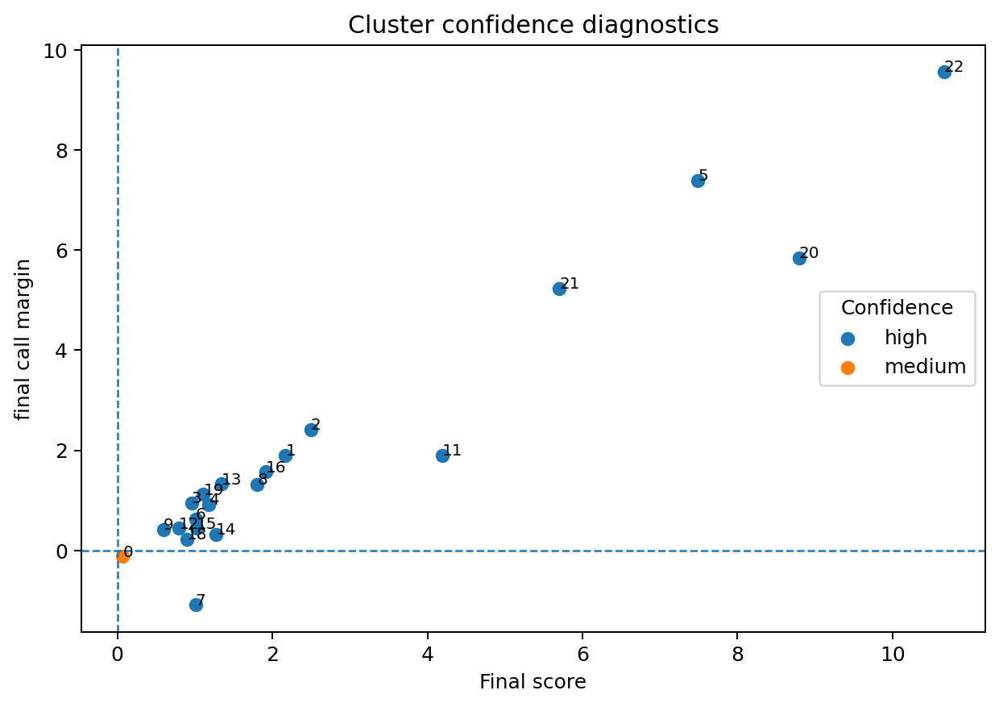
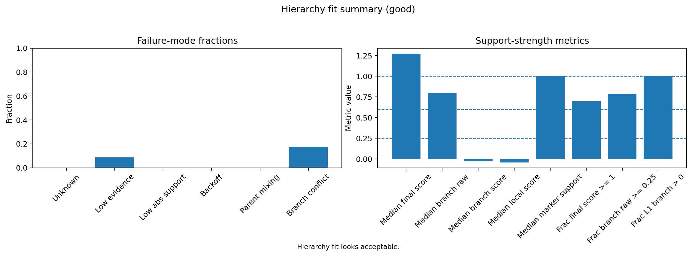
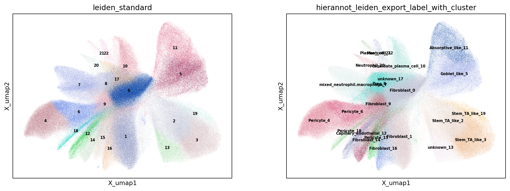
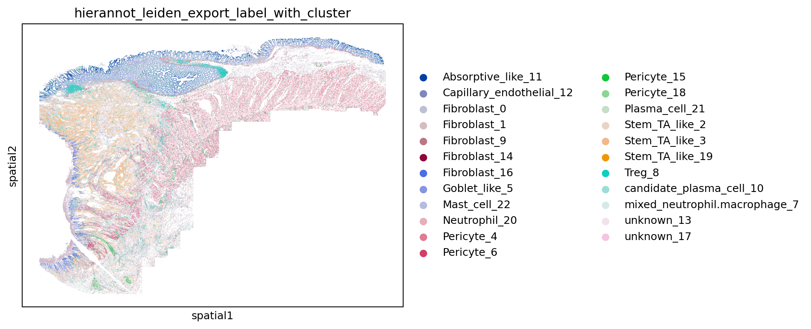
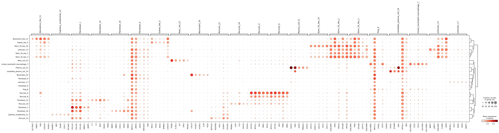
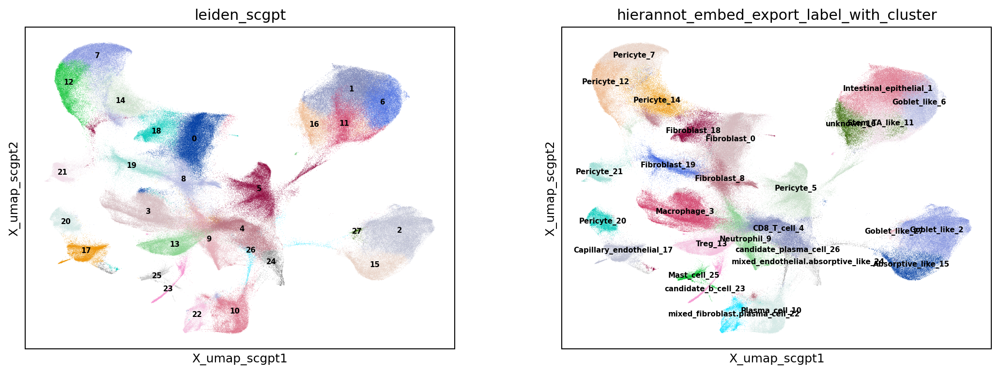
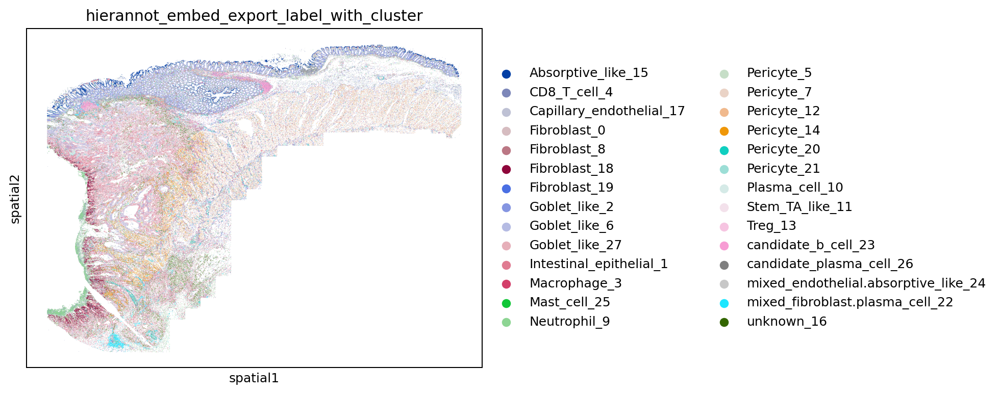
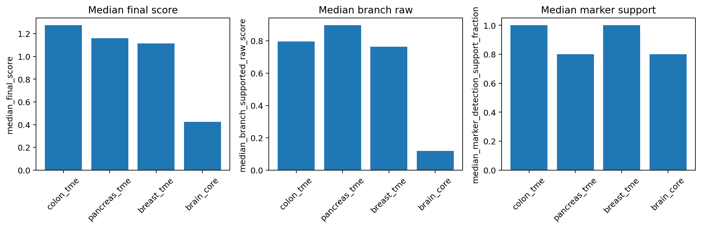

<style>
.table-scroll {
  max-width: 100%;
  max-height: 420px;
  overflow-x: auto;
  overflow-y: auto;
}

.table-scroll .table {
  margin-bottom: 0;
}
</style>

# Introduction

Modern spatial pipelines excel at representation learning, graph construction, and clustering. Yet a persistent bottleneck remains: interpreting clusters and assigning biologically 
meaningful names. This step is critical, but often manual, iterative, and difficult to standardize across datasets and projects.

`HierAnnot` is an analyst-assist layer for this stage. Rather than replacing expert judgment, it accelerates and structures annotation by leveraging predefined cell type hierarchies and marker genes, producing hierarchy-aware, uncertainty-aware cell type suggestions that are easy to inspect and refine. Importantly, `HierAnnot` is not a substitute for iterative analysis, like subclustering broad populations, but a structured engine to guide and document the process. It offers four practical advantages:

1. **Hierarchy-aware calls**: broad-to-specific label routing follows biological structure.
2. **Explicit uncertainty**: weak or conflicted cases are exported as `unknown`, `mixed_*`, or `candidate_*` rather than over-called labels.
3. **Auditability**: outputs keep both final calls and supporting evidence.
4. **Flexible integration**: works with standard pipelines and embedding-based workflow that leverages foundation model.

In a typical workflow, cells are first embedded (e.g., via PCA or learned representations) and grouped by unsupervised clustering. `HierAnnot` then operates on these clusters, assigning candidate labels using predefined hierarchies and marker genes to provide a structured starting point for downstream interpretation.

{#fig-pipeline-overview fig-alt="Pipeline schematic showing preprocessing, embedding, clustering, hierarchical annotation, and export"}

# Working Principles

`HierAnnot` starts from a tissue-appropriate marker hierarchy, which acts as the main biological prior for annotation. The marker hierarchy is a tree-shaped catalogue of cell types organized from broad categories (e.g., "immune cell") down to specific subtypes (e.g., "CD8 T cell"). Each node in this tree carries a _marker program_: a curated list of genes that are expected to be switched _ON_ (or _OFF_) in that particular cell type. Think of a marker program as a genetic fingerprint for a cell identity: if the right genes are highly expressed, the evidence points toward that label.

In practice, the package provides several ways to facilitate this step, including built-in hierarchy catalogues, direct matching helpers, and ranked suggestions. The detailed code workflow for choosing and comparing hierarchies appears in latter @sec-choose-hierarhcy. For a concrete example of a built-in hierarchy used by `HierAnnot`, see the example `colon_tme` hierarchy in @lst-colon-tme-example.

Once a reasonable hierarchy is selected, `HierAnnot` combines multiple evidence sources to decide how far to descend and when to stop conservatively.

## A Concise View Of The Scoring And Routing Logic

At each node in the hierarchy, `HierAnnot` builds up a picture of how well a cluster of cells matches that node's marker program. It does this by layering four kinds of evidence:

1. **Marker enrichment**: are the node's expected genes expressed more than you would expect by chance? To avoid being fooled by genes that are simply abundant everywhere, the comparison is made against control genes with similar baseline expression levels.

2. **Sibling competition**: even if a node looks enriched, is it clearly *more* enriched than its sibling nodes (the other cell types at the same level)? This is measured by converting enrichment into a standardized score and asking how far apart the best candidate is from the runner-up.

3. **Marker-detection support**: what fraction of the node's marker genes are actually detected in this cluster? A node whose markers are mostly undetected gets down-weighted, even if the few detected markers look enriched.

4. **Child-node rescue**: sometimes the evidence at a parent node is ambiguous, but one of its children has very strong support. `HierAnnot` propagates the best child's score upward so that a well-supported deeper label can "rescue" an otherwise uncertain parent, preventing the algorithm from stopping too early.

These four signals are blended into a single **branch-supported score** for every node. The algorithm then walks the tree from top to bottom. At each fork it picks the sibling with the highest branch-supported score and asks two questions: 

- *Is the score high enough in absolute terms?* 
- *Is the gap to the next-best sibling wide enough?* 

If both answers are yes, it descends; if not, it backs off to the deepest ancestor that did pass both gates. This is what makes the routing conservative rather than over-eager, and thus the algorithm would rather give you a confident broad label than a shaky specific one.

## Routing vs. Export

That routing logic is separate from how the final labels are exported. After routing identifies the best-supported level in the hierarchy, `HierAnnot` applies a second pass decides whether the final call is trustworthy enough to report as-is:

- **`mixed_*`**: the winner and runner-up are nearly tied and both have strong support, suggesting the cluster genuinely contains more than one type.
- **`candidate_*`**: the hierarchy couldn't be resolved at the top of the tree (e.g., negative enrichment at L1), but a specific leaf far down the tree has very strong support on its own. That leaf is surfaced as a candidate worth investigating.
- **`unknown`**: overall support is too low to commit to any label.

This way, downstream users always know how much confidence backs each annotation.

## Flowchat 

```{mermaid}
flowchart TD
    A["Choose a tissue-appropriate hierarchy<br/><i>each node carries a marker program</i>"] --> B["Score each node:<br/>enrichment vs. matched controls"]
    B --> C["Compare siblings:<br/>standardized specificity scores"]
    C --> D["Weight by marker-detection support"]
    D --> E["Propagate best-child scores upward"]
    E --> F{"Winner strong enough<br/>AND well separated?"}
    F -- Yes --> G["Descend to best-supported child"]
    F -- No --> H["Stop at deepest supported ancestor"]
    G --> I{"Reached a leaf or<br/>failed a downstream gate?"}
    I -- No --> F
    I -- Yes --> J["Finalize routed label"]
    H --> J
    J --> K["Export with conservative labeling:<br/><i>mixed</i>, <i>candidate</i>, or <i>unknown</i><br/>when evidence is uncertain"]
```

The detailed equations are included below for readers who want to know more about the scoring mechanism.

::: {.callout-note collapse="true" title="Under the hood: scoring and routing math"}
`HierAnnot` uses two complementary scores at each node in the hierarchy: a **raw enrichment score** that measures how strongly a cluster expresses a node's marker genes, and a **decision score** that measures how clearly one sibling wins over the others.

### Raw enrichment score

`HierAnnot` performs LogNormalized-style of preprocessing on the input raw cluster-mean gene expression profiles to get the normalized expression $x$; $\overline{x}_S$ denotes the mean of $x$ across a gene set $S$ within the cluster.

For cluster $c$ and marker program/node $n$, `HierAnnot` computes an raw enrichment score as:

$$
R_{c,n}=\overline{x}_{\text{markers}}-\overline{x}_{\text{matched-controls}}-w_{\text{neg}}\,\overline{x}_{\text{negative markers}}
$$

The matched controls are sampled from genes with similar bulk abundance. Subtracting them out keeps highly-expressed genes from inflating the score. The optional negative-marker penalty ($w_{\text{neg}}$) down-weights programs whose _"shouldn't be on"_ genes are actually on.

### Sibling competition (decision score)

Raw enrichment alone doesn't tell you whether a program is *the best* among its siblings. To get at that, `HierAnnot` standardizes the raw scores into robust z-scores and then looks at the gap between each program and its strongest competitor:

$$
Z_{c,n}=\frac{R_{c,n}-\operatorname{median}(R_{\cdot,n})}{\text{scale}_n},
\qquad
D_{c,n}=\left(Z_{c,n}-\max_{j\in\text{sibs}(n),\,j\neq n} Z_{c,j}\right)\left(0.5+0.5f_{\text{detect}}\right)
$$

Here $\text{scale}_n$ is a MAD-based dispersion (more outlier-robust than standard deviation), and $f_{\text{detect}}$ is the fraction of expected markers that are actually detected in the cluster, serving as a reality check that shrinks the score when too many markers are missing.

### Branch-supported score

This is where the hierarchy really kicks in. Each node gets a **local score** that blends raw enrichment with the decision score:

$$
L_{c,n}=\big(\alpha R_{c,n}+(1-\alpha)g(R_{c,n})D_{c,n}\big)\,s(m_n)
$$

where $s(m_n)$ is a marker-count scaling term and $g(\cdot)$ gates the decision component based on raw strength (so a node with near-zero raw support can't win on specificity alone).

The local scores then roll up recursively via **best-child rescue**:

$$
B_{c,n}=\begin{cases}
L_{c,n}, & n\text{ is leaf}\\
(1-\beta_n)L_{c,n}+\beta_n\max\big(0,\max_{d\in\text{child}(n)}B_{c,d}\big), & n\text{ internal}
\end{cases}
$$

This way, the final routing score at each node $B_{c,n}$ is a weighted mix of its own evidence and the best evidence found among its direct children. The mixing weight $\beta$ controls how much child-rescue is allowed. By default, `HierAnnot` set this weight a bit higher at the first level of the tree (0.4 vs. 0.35 elsewhere) because top-level programs tend to be broader and benefit more from child support. You can adjust this value via `level1_branch_child_rescue_weight` and `branch_child_rescue_weight` variables when initialize `HierAnnotPipeline` class. 

### Top-down routing

Starting from the root, `HierAnnot` picks the sibling with the largest $B_{c,n}$ and descends only when three gates are met:

1. The branch-supported score is above a minimum threshold.
2. The margin over the runner-up sibling is large enough.
3. The node-level raw evidence isn't deeply negative.

If any gate fails, the algorithm stops and backs off to the deepest ancestor on that path whose support was solid.

### Export logic (post-routing)

Export labels are decided *after* routing is done, so they never distort the traversal itself:

| Label | Condition and default threshold value|
|-------|-----------|
| **mixed** | Final margin < 0.02 and both top candidates have branch score ≥ 0.35 |
| **candidate** | Unresolved at L1 (negative raw, poor L2 fit) but a leaf has final score ≥ 1.0 and raw ≥ 0.2 |
| **unknown** | Final-call branch score below a user-set floor (default 0.1); optionally rescued by a strong candidate |

One could adjust those threshold values when using  [`make_cluster_annotation_export_summary()`](https://github.com/Nanostring-Biostats/CosMx-Analysis-Scratch-Space/tree/Main/_code/HierAnnot/hierannot/workflows.py#L1137){target="_blank"} function to create the export-ready cluster annotation summary. 

:::

# Installation
The source code and wheel file for `HierAnnot` **python** package are located at [here](https://github.com/Nanostring-Biostats/CosMx-Analysis-Scratch-Space/tree/Main/_code/HierAnnot){target="_blank"}. You can either download the latest [wheel file](https://github.com/Nanostring-Biostats/CosMx-Analysis-Scratch-Space/tree/Main/_code/HierAnnot/dist){target="_blank"} for `pip` installation or install the package directly using command line like below in your python environment. 

```{default filename="Terminal"}
#| eval: false
#| code-fold: false
pip install git+https://github.com/Nanostring-Biostats/CosMx-Analysis-Scratch-Space.git#subdirectory=_code/HierAnnot
```

Like other items in our [CosMx Analysis Scratch Space](https://nanostring-biostats.github.io/CosMx-Analysis-Scratch-Space/about.html){target="_blank"},
the usual [caveats](https://nanostring-biostats.github.io/CosMx-Analysis-Scratch-Space/about.html){target="_blank"} and [license](https://nanostring-biostats.github.io/CosMx-Analysis-Scratch-Space/license.html){target="_blank"} apply.


::: {.callout-note title="Illustration Dataset"}
To illustrate usage, this post uses a publicly available CosMx<sup>&#174;</sup> whole-transcriptomics single-slide dataset on human colon cancer FFPE tissue that you can download from the Bruker Spatial Biology [webpage](https://brukerspatialbiology.com/products/cosmx-spatial-molecular-imager/ffpe-dataset/){target="_blank"}.
Please refer to [earlier post](https://nanostring-biostats.github.io/CosMx-Analysis-Scratch-Space/posts/h5ad_conversion/){target="_blank"} on how to generate `AnnData` object from either post-analyzed `Seurat` object or the flat files exported by AtoMx<sup>&#174;</sup> SIP.
:::

::: {.callout-tip appearance="simple"}
**R users**: If your data is already in `Seurat` and you prefer to stay in **R**, you can use `HierAnnot` through R's `reticulate` package. See @sec-r-integration for more details.
:::

# Basic Usage: Standard Clustering -> HierAnnot

This first illustration follows a familiar workflow and applies `HierAnnot` after standard Leiden clustering. Think of this as a first-pass naming workflow: fast, explicit, and reviewable.

For your own dataset, the main places to adjust are: 

1. clustering settings (`n_neighbors`, Leiden `resolution`), 
2. hierarchy selection (`match_builtin_hierarchy(...)` and `get_builtin_hierarchy(...)`),  
3. export behavior in `make_cluster_annotation_export_summary(...)` (`unknown_*`, `mixed_*`, `unresolved_candidate_*` controls). 

In general, `HierAnnotPipeline(...)` defaults are a good starting point and usually do not require manual tuning.

## Step 1: Default preprocessing and clustering

```{python}
#| label: code-basic-usage
#| eval: false
import anndata as ad
import scanpy as sc
import matplotlib.pyplot as plt
from pathlib import Path

# setup output folder
out_dir = Path("output")
out_dir.mkdir(parents=True, exist_ok=True)

# read in anndata object
adata = ad.read_h5ad("path/to/data.h5ad")

# Minimal assumed inputs:
# - adata.layers["counts"]   (raw integer counts, required)
# - adata.obsm["spatial"]    (spatial coordinates, for visualization)

cluster_key = "leiden_standard"

# Select highly variable genes from raw counts for high-plex datasets.
flag_hvg = adata.n_vars > 5000
if flag_hvg:
    sc.pp.highly_variable_genes(
        adata, flavor="seurat_v3", n_top_genes=3000, layer="counts"
    )

# Normalize and log-transform for PCA / neighborhood graph.
sc.pp.normalize_total(adata, target_sum=1e4)
sc.pp.log1p(adata)

# PCA uses highly_variable genes automatically when flag_hvg=True.
sc.pp.pca(adata, use_highly_variable=flag_hvg)

# Common user-tuning region: n_neighbors, n_pcs, and Leiden resolution.
sc.pp.neighbors(adata, n_neighbors=15, n_pcs=50)
sc.tl.umap(adata)
sc.tl.leiden(adata, key_added=cluster_key, resolution=1.0)
```

## Step 2: HierAnnot scoring and export summary

See the later @sec-choose-hierarhcy for the full exploration and comparison workflow around hierarchies.
For a quick start, `match_builtin_hierarchy("tissue description")` is usually a strong first-pass choice before deeper hierarchy comparison. Here, the `"tissue description"` is a free-form text string describing the tissue type or biological context of your dataset (e.g., "breast tumor", "colorectal cancer", "pancreatic cancer"). You can use natural language, and the function will try to match your input to the most appropriate built-in hierarchy. This makes it easy to get started even if you are not sure of the exact hierarchy name.


```{python}
#| label: code-basic-hierannot
#| eval: false
from hierannot import (
    HierAnnotPipeline,
    get_builtin_hierarchy,
    match_builtin_hierarchy,
    aggregate_anndata_to_cluster_means,
    make_cluster_annotation_export_summary,
)

# Choose an appropriate built-in hierarchy.
# `list_builtin_hierarchies()` to see all available options.
# `match_builtin_hierarchy()` returns the single best-matching built-in name directly.

hierarchy_name = match_builtin_hierarchy("colon cancer")
root_programs = get_builtin_hierarchy(hierarchy_name)

# Aggregate raw counts across all genes by cluster for HierAnnot.
cluster_means = aggregate_anndata_to_cluster_means(
    adata,
    cluster_key=cluster_key,
    source="layer",
    source_key="counts",
    method="mean",
    uppercase_genes=True,
)

# Most users should keep pipeline defaults.
# The main dataset-dependent knobs are:
# - root_programs: choose the right hierarchy for tissue/context
# - preset: "auto" for automatically setting control variables based on the size of input RNA panel
pipe = HierAnnotPipeline(
    root_programs=root_programs,
    preset="auto",
    input_type="raw_cluster_means",
)

# Score computation and hierarchical routing for each cluster.
result = pipe.fit_score(cluster_means)

# Apply export logic on fitted results.
cluster_export = make_cluster_annotation_export_summary(
    result,

    # label_with_cluster=True retains cluster identity in exported labels
    # (e.g., "CD8_T_3" labels for original cluster "3"), helpful for review.
    label_with_cluster=True,
    
    # These control only export behavior (unknown/mixed/candidate),
    # without altering the underlying hierarchy routing.
    unknown_on_low_confidence=True,
    unknown_branch_raw_threshold=0.1,
    mixed_on_parent_mixing=True,
    unresolved_candidate_min_score=1.0,
    unresolved_candidate_min_raw_score=0.2,

    # To update the hierarchy routing with new thresholds and weights, 
    # set rerun_decision = True along with updated values for relevant control 
    # arguments (e.g. weak_raw_score_threshold, min_leaf_raw_score, etc).
)

# save full cluster annotation summary with per-level details
adata.uns[f"hierannot_{cluster_key}"] = cluster_export
cluster_export.to_csv(out_dir / "cluster_export_leiden.csv", index=False)

print(cluster_export.head(10))
```
```{r tbl-basic-export, message=FALSE, eval = TRUE, echo=FALSE, results ='asis'}
#| tbl-cap: "Example cluster-level HierAnnot export summary for standard clustering."
df <- read.csv("assets/cluster_export_leiden.csv")
df <- df[, c("cluster_id",
            "annot_label",
            "annot_export_label_with_cluster",
            "annot_export_label",
            "annot_export_status",
            "annot_confidence",
            "annot_final_call_margin")]

cat('<div class="table-scroll">')
print(knitr::kable(df, format = "html", table.attr = 'class="table table-striped table-hover"'))
cat("</div>")
```

`HierAnnot` provides utility functions to inspect naming confidence and hierarchy fit before committing to downstream interpretation.

```{python}
#| label: code-basic-diagnostics
#| eval: false
from hierannot import (
    plot_cluster_confidence,
    plot_hierarchy_fit_summary, 
)

# Confidence diagnostics.
fig, _ = plot_cluster_confidence(result)
fig.savefig(out_dir / "fig_diag_confidence.png", dpi=180, bbox_inches="tight")

# Hierarchy fit summary
fig, _ = plot_hierarchy_fit_summary(result)
fig.savefig(out_dir / "fig_diagnostic_hierarchy_fit.png", dpi=180, bbox_inches="tight")
```
::: {.panel-tabset}

### Confidence diagnostics

{#fig-diag-confidence fig-alt="Scatter plot showing confidence diagnostics"}

### Hierarchy fit

{#fig-diag-hierarchy-fit fig-alt="Bar plot showing hierarchy fitting summary"}

:::


## Step 3: Add cell-level results and inspect outputs

```{python}
#| label: code-basic-inspect
#| eval: false
from hierannot import expand_cluster_annotation_to_cells

# create join table for per-cell annotation
cell_labels = expand_cluster_annotation_to_cells(
    cluster_assignments=adata.obs[cluster_key],
    cluster_summary=cluster_export,
    cluster_key=cluster_key,
    include_columns=[
        "annot_export_label",
        "annot_export_label_with_cluster",
    ],
    prefix="hierannot_leiden", # for renaming the column names
)

adata.obs = adata.obs.join(cell_labels.drop(columns=[cluster_key], errors="ignore"))

# Visualize the named label-with-cluster on expression umap and in space 
result_column = "hierannot_leiden_export_label_with_cluster" 

sc.pl.embedding(adata, basis="X_umap", color=[cluster_key, result_column], legend_loc="on data", ncols=2, show=False)
plt.savefig(out_dir / "fig_umap_std_cluster_hierannot.png", dpi=180, bbox_inches="tight")

sc.pl.embedding(adata, basis="spatial", color=result_column, show=False)
plt.savefig(out_dir / "fig_spatial_hierannot_leiden.png", dpi=180, bbox_inches="tight")
```
::: {.panel-tabset}

### UMAP

{#fig-umap-leiden fig-alt="UMAP colored by Leiden and HierAnnot labels"}

### Spatial

{#fig-spatial-hierannot-leiden fig-alt="Spatial map colored by HierAnnot labels"}

:::


## Step 4: Marker Validation For Naming

After assigning cluster-level labels, validate naming with marker differential expression. The example below wraps robust marker identification into a reusable function that finds top robust markers for each cluster. Those outputs are then used downstream to generate diagnostic plots for naming review.

```{python}
#| label: code-basic-marker-top
#| eval: false
import numpy as np
from hierannot import get_builtin_hierarchy

def identify_top_robust_markers_by_cluster(
    adata,
    group_key,
    min_cells_per_group=10,
    max_cells_per_group=5000,
    padj_cutoff=0.05,
    logfc_cutoff=0.25,
    min_pct_expr=0.10,
    rank_key="marker_rankings",
    random_state=0,
):
    """Identify robust markers per cluster from differential ranking.

    The function ranks genes on a filtered/downsampled copy of the input AnnData
    for stable runtime and marker statistics, then returns only robust markers
    with threshold flags and per-group robust rank.
    """
    groups = adata.obs[group_key].astype(str).fillna("unassigned")

    # Drop tiny groups that can make DE unstable.
    group_sizes = groups.value_counts(dropna=False)
    keep_groups = group_sizes[group_sizes >= min_cells_per_group].index
    keep_mask = groups.isin(keep_groups)
    adata_rank = adata[keep_mask].copy()
    adata_rank.obs[group_key] = groups.loc[keep_mask].astype("category")

    # Optional per-group cap for faster and more stable ranking runtime.
    if max_cells_per_group and max_cells_per_group > 0:
        rng = np.random.default_rng(random_state)
        g = adata_rank.obs[group_key].astype(str)
        idx_keep = []
        for _, idx in g.groupby(g).groups.items():
            idx = np.array(list(idx))
            if len(idx) > max_cells_per_group:
                pick = rng.choice(idx, size=max_cells_per_group, replace=False)
                idx_keep.extend(pick.tolist())
            else:
                idx_keep.extend(idx.tolist())
        adata_rank = adata_rank[idx_keep].copy()
        adata_rank.obs[group_key] = adata_rank.obs[group_key].astype(str).astype("category")

    if adata_rank.n_obs == 0:
        raise ValueError("No cells left after filtering marker groups.")
    if adata_rank.obs[group_key].nunique() < 2:
        raise ValueError("Need >=2 groups for marker ranking.")

    sc.tl.rank_genes_groups(
        adata_rank,
        groupby=group_key,
        method="wilcoxon",
        pts=True,
        key_added=rank_key,
    )
    markers_df = sc.get.rank_genes_groups_df(adata_rank, group=None, key=rank_key)

    robust_markers = markers_df.copy()
    robust_markers["meets_padj"] = robust_markers["pvals_adj"] <= padj_cutoff
    robust_markers["meets_logfc"] = robust_markers["logfoldchanges"] >= logfc_cutoff
    if "pct_nz_group" in robust_markers.columns:
        robust_markers["meets_min_pct_expr"] = robust_markers["pct_nz_group"] >= min_pct_expr
    else:
        robust_markers["meets_min_pct_expr"] = True

    robust_markers = robust_markers[
        robust_markers["meets_padj"]
        & robust_markers["meets_logfc"]
        & robust_markers["meets_min_pct_expr"]
    ].copy()
    robust_markers = robust_markers.sort_values(
        ["group", "pvals_adj", "logfoldchanges"],
        ascending=[True, True, False],
    )
    robust_markers["robust_rank_within_group"] = robust_markers.groupby("group").cumcount() + 1
    return robust_markers


# identify top markers for standard leiden clusters and visualize along with hierannot names
marker_group_key = "hierannot_leiden_export_label_with_cluster"
top_n_dotplot = 5

robust_markers = identify_top_robust_markers_by_cluster(
    adata=adata,
    group_key=marker_group_key,
    min_cells_per_group=10,
    max_cells_per_group=5000,
)
robust_markers.to_csv(out_dir / "marker_rankings_robust.csv", index=False)
if robust_markers.empty:
    raise ValueError("No robust markers passed thresholds. Relax padj/logFC/min_pct_expr cutoffs.")

sc.tl.dendrogram(adata, groupby=marker_group_key)

# Generate dot plot for top 5 markers per cluster.
marker_dict_dotplot = (
    robust_markers.groupby("group")["names"]
    .apply(lambda s: s.head(top_n_dotplot).tolist())
    .to_dict()
)
marker_dict_dotplot = {k: v for k, v in marker_dict_dotplot.items() if len(v) > 0}

sc.pl.dotplot(
    adata,
    var_names=marker_dict_dotplot,
    groupby=marker_group_key,
    dendrogram=True,
    show=False,
)
plt.savefig(out_dir / "fig_marker_dotplot.png", dpi=180, bbox_inches="tight")
```

In practice, DE-ranked markers can be influenced by tissue background composition. A canonical-marker panel is often easier to interpret for naming validation and discussion with domain experts.

```{python}
#| label: code-basic-marker-valid
#| eval: false
# Canonical markers from the selected hierarchy, filtered to genes present in this dataset.
from hierannot import collect_positive_marker_genes

all_canonical_markers = collect_positive_marker_genes(
    hierarchy="colon_tme",
    return_format="list"
)

canonical_markers = [g for g in all_canonical_markers if g in adata.var_names]

if len(canonical_markers) == 0:
    raise ValueError("No canonical markers from colon_tme were found in adata.var_names.")

sc.pl.dotplot(
    adata,
    var_names=canonical_markers,
    groupby=marker_group_key,
    dendrogram=True,
    show=False,
)
plt.savefig(out_dir / "fig_marker_canonical_dotplot.png", dpi=180, bbox_inches="tight")

```
::: {.panel-tabset}

### Marker Dot Plot

{#fig-marker-dotplot fig-alt="Marker dotplot of thresholded robust markers across HierAnnot labels for standard Leiden clusters."}

### Canonical Marker Dot Plot

{#fig-marker-canonical-dotplot fig-alt="Canonical marker dotplot across HierAnnot labels for standard Leiden clusters."}
:::

# Advanced Usage: Foundation-Model Embeddings -> HierAnnot

`HierAnnot` works equally well when cluster structure comes from embeddings generated by pretrained foundation models such as [scGPT](https://www.nature.com/articles/s41592-024-02201-0){target="_blank"} [@Cui2024scGPT].

In this pipeline, the annotation step is decoupled from how clusters were produced. Clustering can come from either classical PCA or a foundation-model embedding space, while `HierAnnot` applies the same hierarchy-based scoring on cluster-level raw expression. This makes `HierAnnot` a practical bridge: embeddings improve structure discovery, and `HierAnnot` turns that structure into biologically interpretable, uncertainty-aware labels on the query dataset.

Here, the cell embeddings were obtained using a custom scGPT-style model pre-trained on various CosMx datasets of diverse tissue types.

```{python}
#| label: code-advanced-embedding
#| eval: false
from hierannot import (
    cluster_anndata_on_representation,
    aggregate_anndata_to_cluster_means,
    make_cluster_annotation_export_summary,
    expand_cluster_annotation_to_cells,
)

# The foundation-model embedding is stored at `adata.obsm[embedding_key]` layer
model_name="scgpt"
embedding_key = f"X_emb_{model_name}"
cluster_key = f"leiden_{model_name}"

# Cluster directly on the embedding; no PCA since the embedding is already compact.
# cluster_anndata_on_representation handles neighbor graph, Leiden, and UMAP in one call.
cluster_anndata_on_representation(
    adata,
    source="obsm",
    source_key=embedding_key,
    cluster_key=cluster_key,

    # names for embedding-derived data 
    neighbors_key=f"X_neighbors_{model_name}",
    umap_key=f"X_umap_{model_name}",

    n_neighbors=15,
    leiden_resolution=1.0,
    random_state=0,
    compute_umap=True,
    copy=False,     # modifies adata in place
    do_pca=False,
)

# Aggregate raw counts by the new embedding-derived clusters.
cluster_means_embed = aggregate_anndata_to_cluster_means(
    adata,
    cluster_key=cluster_key,
    source="layer",
    source_key="counts",
    method="mean",
    uppercase_genes=True,
)

# pipe is the same HierAnnotPipeline from the standard-clustering section above.
result_embed = pipe.fit_score(cluster_means_embed)

cluster_export_embed = make_cluster_annotation_export_summary(
    result_embed,
    # Keep cluster ID in exported labels for easier embedding-cluster QA.
    label_with_cluster=True,
    # Tune these thresholds when you want stricter or looser uncertainty export.
    unknown_on_low_confidence=True,
    unknown_branch_raw_threshold=0.1,
    mixed_on_parent_mixing=True,
    unresolved_candidate_min_score=1.0,
    unresolved_candidate_min_raw_score=0.2,
)

cell_labels_embed = expand_cluster_annotation_to_cells(
    cluster_assignments=adata.obs[cluster_key],
    cluster_summary=cluster_export_embed,
    cluster_key=cluster_key,
    include_columns=["annot_export_label_with_cluster", "annot_export_label", "annot_export_status"],
    prefix="hierannot_embed",
)

adata.obs = adata.obs.join(
    cell_labels_embed.drop(columns=[cluster_key], errors="ignore")
)
```
::: {.panel-tabset}

### UMAP for model-derived embeddings

{#fig-umap-scgpt-cluster fig-alt="UMAP of embedding-based clustering and the corresponding HierAnnot labels"}

### Spatial for model-embedding-based clusters

{#fig-spatial-scgpt-hierannot fig-alt="Spatial map of embedding-derived HierAnnot labels"}
:::

# Choosing A Hierarchy {#sec-choose-hierarhcy}

The annotation result depends on hierarchy choice, so selecting a tissue-appropriate hierarchy is a key practical step.

`HierAnnot` ships with rich tissue-flavored built-in hierarchies. These built-ins are intentionally designed to work across RNA panels of different sizes, so they tend to focus on critical broad cell types rather than pushing too deeply into very fine-grained subtypes. Users can discover options with `list_builtin_hierarchies()`, get a direct automatic suggestion with `match_builtin_hierarchy("description")`, or inspect ranked candidates with `suggest_builtin_hierarchies("description")`. Note that the `"description"` here is a free-form text string describing the tissue type (e.g., "brain cortex"). For a complete and maintained catalog of built-ins, plus additional usage guidance, refer to the package [README](https://github.com/Nanostring-Biostats/CosMx-Analysis-Scratch-Space/tree/Main/_code/HierAnnot){target="_blank"}.

As a practical rule of thumb: 

- If you have a small or very targeted panel, the more immediate question is often whether enough marker separation remains after intersecting the hierarchy with your measured genes; for that, see @sec-compile-hierarchy-panel. 
- If you have a large RNA panel and want finer cell-type distinctions, start from the built-ins and then adapt them, see @sec-building-your-own-hierarchy. 

A typical workflow for choosing a built-in hierarchy is:

1. Call `list_builtin_hierarchies()` to see all available options.
2. Call `match_builtin_hierarchy(...)` for the single best-matching built-in, or `suggest_builtin_hierarchies(...)` for a ranked DataFrame of candidates. 
3. If the tissue type is ambiguous, run several candidates and compare fit diagnostics on your own cluster means profiles.

```{python}
#| label: code-list-hierarchy
#| eval: false
from hierannot import (
    list_builtin_hierarchies,
    match_builtin_hierarchy,
    suggest_builtin_hierarchies,
    get_builtin_hierarchy,
    format_hierarchy_tree,
)

# Step 1: inspect all available built-ins
print(list_builtin_hierarchies())

# Step 2: match_builtin_hierarchy() returns a single best name;
# suggest_builtin_hierarchies() returns a ranked DataFrame for broader exploration.
best = match_builtin_hierarchy("colon cancer")
print(best)  # e.g. 'colon_tme'

ranked = suggest_builtin_hierarchies("colon cancer", top_k=5)
print(ranked[["name", "score", "tissue_scope"]])

# visualize the chosen hierarchy as a tree
print(format_hierarchy_tree(get_builtin_hierarchy(best)))
```
::: {.panel-tabset}

### All availables
```{r tbl-hierarchy-list, message=FALSE, eval = TRUE, echo=FALSE, results ='asis'}
#| tbl-cap: "All built-in hierarchies returned by `list_builtin_hierarchies()`"
df <- read.csv("assets/builtin_hierarchies.csv")
knitr::kable(df)
```


### Suggested

```{r tbl-suggested-hierarchy, message=FALSE, eval = TRUE, echo=FALSE, results ='asis'}
#| tbl-cap: "Built-in hierarchies suggested for free-form text `colon cancer`."
df <- read.csv("assets/ranked_suggest_colon_cancer.csv")
df <- df[, c("name", "score", "tissue_scope")]
knitr::kable(df)
```

### `colon_tme` hierarchy
Formatted tree returned by `format_hierarchy_tree()` for built-in `colon_tme` hierarchy.

```{#lst-colon-tme-example lst-cap="Example built-in hierarchy"}
- Intestinal epithelial (+6, -4, children=3)
  - Absorptive-like (+5, -1, children=0)
  - Goblet-like (+5, -1, children=0)
  - Stem/TA-like (+5, -1, children=0)
- Fibroblast (+5, -4, children=0)
- Endothelial (+5, -3, children=1)
  - Capillary endothelial (+5, -2, children=0)
- Mural (+5, -2, children=1)
  - Pericyte (+5, -6, children=0)
- Immune (+5, -2, children=6)
  - T cell (+5, -2, children=3)
    - CD4 T cell (+5, -2, children=0)
    - CD8 T cell (+5, -1, children=0)
    - Treg (+5, -2, children=0)
  - B cell (+5, -2, children=1)
    - Plasma cell (+5, -2, children=0)
  - NK cell (+5, -2, children=0)
  - Myeloid (+5, -2, children=3)
    - Macrophage (+5, -2, children=0)
    - Monocyte (+5, -2, children=0)
    - Dendritic cell (+5, -2, children=0)
  - Mast cell (+5, -2, children=0)
  - Neutrophil (+5, -2, children=0)
```
:::

```{python}
#| label: code-compare-hierarchy-fit
#| eval: false
from hierannot import (
    get_builtin_hierarchy,
    HierAnnotPipeline,
    compare_hierarchy_fit,
    plot_compare_hierarchy_fit,
)

# Step 3: compare fit across a set of candidate hierarchies
# here I include colon, breast, pancreas, brain for a cross-tissue perspective
candidate_names = ["colon_tme", "breast_tme", "pancreas_tme", "brain_core"]
results_fit = {}
for name in candidate_names:
    pipe_i = HierAnnotPipeline(
        root_programs=get_builtin_hierarchy(name),
        preset="auto",
        input_type="raw_cluster_means",
    )
    results_fit[name] = pipe_i.fit_score(cluster_means)

fit_df = compare_hierarchy_fit(results_fit)
print(fit_df[["name", "hierarchy_fit_status", "fit_rank_score", "fit_rank"]])

# visualize the fit outcomes 
fig, ax = plot_compare_hierarchy_fit(fit_df)
fig.savefig(out_dir / "fig_hierarchy_fit_compare.png", dpi=180, bbox_inches="tight")
```

::: {.panel-tabset}
### Hierarchy fit metrics
```{r tbl-hierarchy-fit, message=FALSE, eval = TRUE, echo=FALSE, results ='asis'}
#| tbl-cap: "Hierarchy fit comparison across candidate built-in ontologies."
df <- read.csv("assets/hierarchy_fit_compare.csv")
df <- df[, c("name", "hierarchy_fit_status", "fit_rank_score", "fit_rank")]
knitr::kable(df)
```

### Bar plot

{#fig-hierarchy-fit-compare fig-alt="Bar plots comparing hierarchy-fit metrics across candidates"}
:::

## Compile A Built-in Hierarchy Against Your Panel {#sec-compile-hierarchy-panel}

The built-in hierarchies are designed to be fairly robust across different panel sizes, so in most cases you don’t need to worry about marker coverage when running `HierAnnot`. However, if you’re working with a small or targeted gene panel, it’s worth checking which markers remain at each node after filtering to genes present in your dataset. Missing markers can blur distinctions between related cell types and this inspection helps diagnose weak separation and decide whether a simpler hierarchy would be more robust.

```{python}
#| label: code-compile-hierarchy-panel
#| eval: false
import json
from hierannot import (
    compile_builtin_hierarchy_for_panel,
    format_hierarchy_tree,
    hierarchy_to_dict,
)

panel_genes = set(adata.var_names.str.upper())

compiled_roots, report = compile_builtin_hierarchy_for_panel(
    gene_list=panel_genes,
    builtin_name="colon_tme", 
    panel_name="small_1K_panel",
    preserve_major_immune_subtypes=True,
)

# Summary report on marker retention 
print(report)

# Visualize tree format of the compiled hierarchy
print(format_hierarchy_tree(compiled_roots))

# Inspect the remaining markers in each node after panel filtering.
print(json.dumps(hierarchy_to_dict(compiled_roots), indent=2))
```

## Building Your Own Hierarchy {#sec-building-your-own-hierarchy}

If the built-ins are close but not exact, a practical pattern is to start from a built-in and replace one branch. This is useful when you have a larger RNA panel and want finer cell-type distinctions than what the default built-ins provide. 

```{python}
#| label: code-custom-hierarchy
#| eval: false
from hierannot import MarkerProgram, get_builtin_hierarchy, HierAnnotPipeline

roots = get_builtin_hierarchy("breast_tme")

breast_epithelial = MarkerProgram(
    name="breast epithelial",
    positive_markers=["EPCAM", "KRT8", "KRT18", "KRT19"],
    children=[
        MarkerProgram(
            name="luminal epithelial",
            positive_markers=["EPCAM", "KRT8", "KRT18", "ESR1", "PGR"],
        ),
        MarkerProgram(
            name="basal epithelial",
            positive_markers=["KRT5", "KRT14", "KRT17", "TP63"],
        ),
    ],
)

custom_roots = []
for node in roots:
    if node.name == "Epithelial":
        custom_roots.append(breast_epithelial)
    else:
        custom_roots.append(node)

pipe_custom = HierAnnotPipeline(
    root_programs=custom_roots,
    preset="auto",
    input_type="raw_cluster_means",
)
```

# R integration via reticulate {#sec-r-integration}

If your analysis pipeline is based in **R** and you use `Seurat` for clustering and quality control, you can still leverage `HierAnnot` through the `reticulate` package, which provides seamless Python-to-R interoperability. This approach is ideal for analysts who have already performed clustering in `Seurat` and want to add hierarchical annotation without leaving the R ecosystem.

## Setting up a Python virtual environment for R

First, create a dedicated Python virtual environment with `HierAnnot` installed. 

**Option 1: From the terminal**

If you already work in Python, this is just the usual Python installation flow; after that, you can point `reticulate` to the same environment from R.

```{default filename="Terminal"}
#| eval: false
# Create virtual environment
python -m venv hierannot_env

# Activate it
source hierannot_env/bin/activate  # on Linux/Mac
# or
hierannotenv\\Scripts\\activate  # on Windows

# Install HierAnnot
pip install git+https://github.com/Nanostring-Biostats/CosMx-Analysis-Scratch-Space.git#subdirectory=_code/HierAnnot

# Or install from a downloaded wheel file
# pip install /path/to/hierannot-<version>-py3-none-any.whl

# Deactivate
deactivate
```

```{r filename="R"}
#| eval: false
library(reticulate)
use_virtualenv("/path/to/hierannot_env")  # absolute path to your virtual environment
```


**Option 2: From R directly**

You can also create and install from R using `reticulate` directly.

```{r filename="R"}
#| label: code-r-setup-venv
#| eval: false
library(reticulate)

# Create a virtual environment named 'hierannot_env'
virtualenv_create("hierannot_env")

# Install HierAnnot from GitHub; pip will also install declared dependencies.
virtualenv_install(
  "hierannot_env",
  packages = "git+https://github.com/Nanostring-Biostats/CosMx-Analysis-Scratch-Space.git#subdirectory=_code/HierAnnot"
)

# If you already downloaded a wheel locally, install from that file instead.
# virtualenv_install(
#   "hierannot_env",
#   packages = "/path/to/hierannot-<version>-py3-none-any.whl"
# )

# Use this environment for your R session
use_virtualenv("hierannot_env")
```


## Using HierAnnot from Seurat

The workflow is straightforward:

1. Extract cluster assignments and raw counts from your `Seurat` object.
2. Compute cluster-level means in R.
3. Call `HierAnnot` scoring functions via `reticulate`.
4. Merge the annotations back into your `Seurat` metadata.
5. Visualize results with standard `Seurat` plotting functions.

```{r filename="R"}
#| label: code-r-hierannot
#| eval: false
library(Seurat)
library(reticulate)

# Assuming you have a Seurat object 'seurat_obj' with clustering already done.
# Set this to the metadata column that stores your cluster IDs.
cluster_col <- "seurat_cluster"

# Point reticulate to your Python virtual environment with HierAnnot installed
use_virtualenv("/path/to/hierannot_env")  # update to your actual path

# Import HierAnnot Python module
hierannotpkg <- import("hierannot")

# (1) Add a temporary string-safe cluster column to Seurat metadata
seurat_obj$hierannot_cluster_safe <- as.character(seurat_obj@meta.data[[cluster_col]])
seurat_obj$hierannot_cluster_safe[is.na(seurat_obj$hierannot_cluster_safe)] <- "NA"

# (2) Use Seurat's own function to compute cluster mean profiles
cluster_means_df <- as.data.frame(
    AverageExpression(
        seurat_obj,
        assays = "RNA",
        slot = "counts",
        group.by = "hierannot_cluster_safe",
        verbose = FALSE
    )$RNA
)

# (3) Pass to Python and run HierAnnot
cluster_means_py <- cluster_means_df[, colnames(cluster_means_df) != "NA", drop = FALSE]

# Choose and load an appropriate hierarchy
hierarchy_name <- hierannotpkg$match_builtin_hierarchy("colon cancer")
root_programs <- hierannotpkg$get_builtin_hierarchy(hierarchy_name)

# Create HierAnnotPipeline and score clusters
pipe <- hierannotpkg$HierAnnotPipeline(
  root_programs = root_programs,
  preset = "auto",
  input_type = "raw_cluster_means"
)
result <- pipe$fit_score(cluster_means_py)

# Export cluster-level annotations
cluster_export <- hierannotpkg$make_cluster_annotation_export_summary(
  result,
  label_with_cluster = TRUE,
  unknown_on_low_confidence = TRUE,
  unknown_branch_raw_threshold = 0.1,
  mixed_on_parent_mixing = TRUE,
  unresolved_candidate_min_score = 1.0,
  unresolved_candidate_min_raw_score = 0.2
)

# (4) Format results in R, add to Seurat metadata, then clean up
annot_cols <- c("annot_export_label", "annot_export_label_with_cluster", "annot_confidence")
annot_map <- as.data.frame(cluster_export)[, c("cluster_id", annot_cols), drop = FALSE]
annot_map[[1]] <- as.character(annot_map[[1]])
colnames(annot_map) <- gsub("^annot_", "hierannot_", colnames(annot_map)) # rename columns if desired

# Left-merge so all original Seurat cells are kept; unmatched rows stay NA.
cell_meta <- cbind(cell_id = rownames(seurat_obj@meta.data), cluster_id = seurat_obj$hierannot_cluster_safe)
cell_meta <- merge(cell_meta, annot_map, by = "cluster_id", all.x = TRUE, sort = FALSE)
rownames(cell_meta) <- cell_meta$cell_id
cell_meta$cell_id <- NULL
cell_meta$cluster_id <- NULL

seurat_obj <- AddMetaData(seurat_obj, metadata = cell_meta)

# Clean up temporary safe cluster column
seurat_obj$hierannot_cluster_safe <- NULL

# Visualize HierAnnot labels on your existing embeddings
viz_col <- "hierannot_export_label_with_cluster"
DimPlot(seurat_obj, group.by = viz_col) # UMAP
ImageDimPlot(seurat_obj, fov="my_slide", group.by = viz_col)  # spatial coordinates under seurat_obj@images
```


# Troubleshooting 

Even with its robust design, the cluster annotation may encounter challenges in certain datasets. Here are some common issues and how to address them:

**Mixed Labels**

If clusters are annotated with `mixed_*` or unexpected labels, it may indicate:

- _Low Resolution Clustering_: `mixed_*` labels indicate strong support from different L1 nodes (cell lineages) within same cluster. Try increasing the resolution of your clustering algorithm to create smaller, more distinct clusters.
- _Signal Bleedthrough_: In spatial datasets, abundant cell types may influence rare cell types due to segmentation ambiguity. Try [`HierType`](https://github.com/Nanostring-Biostats/CosMx-Analysis-Scratch-Space/tree/Main/_code/HieraType){target="_blank"} algorithm introduced in [earlier post](https://nanostring-biostats.github.io/CosMx-Analysis-Scratch-Space/posts/immune-cell-typing-smooth/){target="_blank"} for robust marker-based fine-clustering on minority cell types.

**Targeted RNA Panels**

For datasets with small RNA panels, ensure:

- _Marker Gene Separation_: Check that the remaining marker genes are still sufficiently distinct after intersecting the hierarchy with your input gene list. Refer to @sec-compile-hierarchy-panel on how to inspect the markers that remain after panel filtering.
- _Shallower Hierarchies_: If too little specific marker separation remains, remove or simplify fragile branches so the hierarchy stays broad enough for the panel. For example, if you see a `CD8 T cell` cluster but no separate `CD4 T cell` or `Treg` cluster in the exported label summary, it may be safer to call that cluster `T cell`, especially when only 1~2 markers differ among the relevant nodes in the dataset-filtered hierarchy. 

**General Tips**

- Review the hierarchy structure and marker gene lists to ensure they are appropriate for your dataset.
- For rare cell types, consider providing custom marker lists to improve detection.
- For advanced users, the default `HierAnnot` settings are a robust starting point, especially for spatial datasets. If you want to explore tunable parameters, see the docstring of [`HierAnnotPipeline.__init__()`](https://github.com/Nanostring-Biostats/CosMx-Analysis-Scratch-Space/tree/Main/_code/HierAnnot/hierannot/pipeline.py#L70){target="_blank"} and [`make_cluster_annotation_export_summary()`](https://github.com/Nanostring-Biostats/CosMx-Analysis-Scratch-Space/tree/Main/_code/HierAnnot/hierannot/workflows.py#L954){target="_blank"} functions for descriptions of all available knobs at both scoring/routing and exporting steps.


# Conclusion

`HierAnnot` is most useful as a bridge from cluster structure to interpretable biology. In standard workflows, it provides fast, uncertainty-aware first-pass naming. In foundation-model workflows, it connects embedding-derived structure back to biologically interpretable labels on the query dataset.

