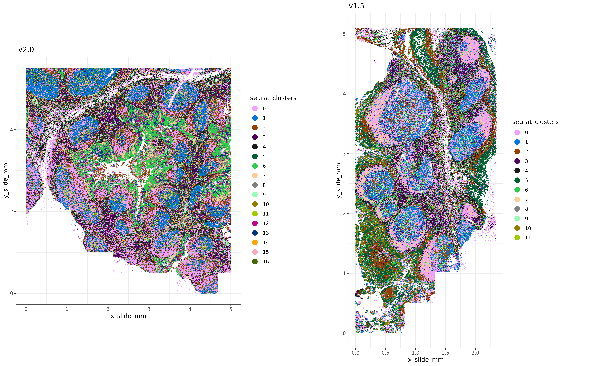
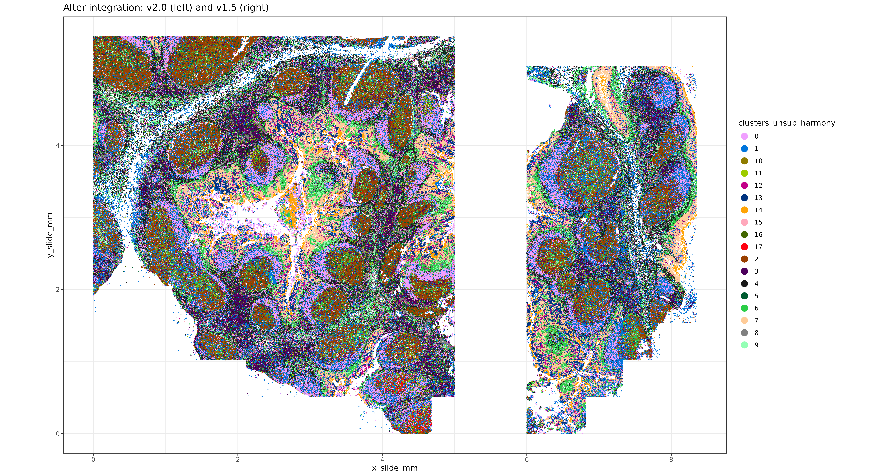
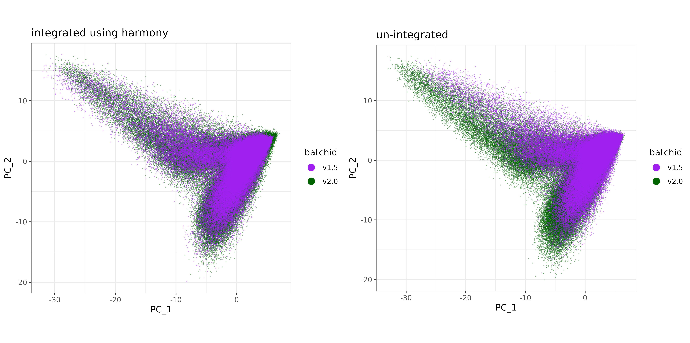
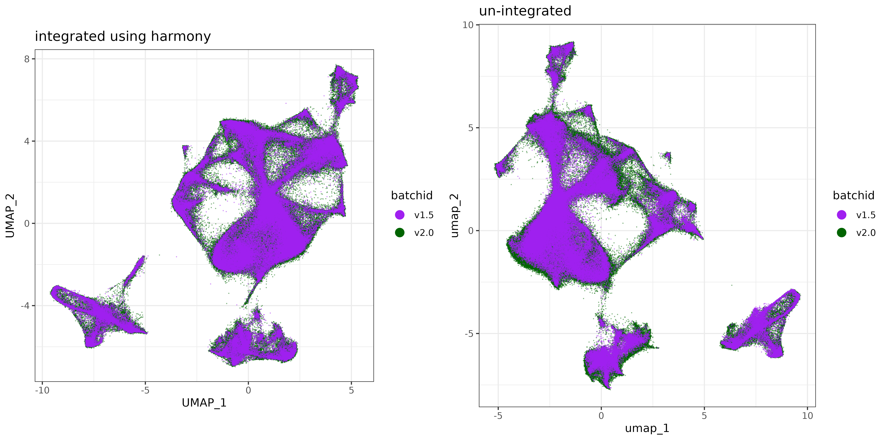

# Introduction 

When analyzing multiple samples or 'batches' of data collected under different technologies or sample conditions, we may need to harmonize the data in a way that preserves the biological differences while minimizing technical variation.

There is a multitude of existing research on batch correction methodology [link] as well as methods . 
Here, we demonstrate the effectiveness of Harmony[link ] (cite), and show  


For those in a hurry to 'just see the code' , they can jump ahead to [Harmony Analysis](#tldr) section.

# Initial Look at the data
```{r}
#| eval: false
#| echo: false

sem_v20 <- readRDS("figures/sem_v20.tiss_a.rds")
sem_v15 <- readRDS("figures/sem_v15.tiss_b.rds")


```

```{r}
#| eval: true
#| echo: false

library(data.table)

```
```{r}
#| eval: false
#| echo: true

library(data.table)
library(ggplot2)
library(ggrepel)

options(Seurat.object.assay.version = "v3")  

#### Make a combined Seurat Object
sem_v20 <- readRDS("sem_v20.tiss_a.rds") ## tonsil dataset A with CosMx v2.0
sem_v15 <- readRDS("sem_v15.tiss_b.rds") ## tonsil dataset B with CosMx v1.5

```

## Plot the two batches
Lets take a quick peek at these two tissues, with unsupervised clustering has been performed independently on each:

```{r}
#| eval: false
#| code-fold: true

xyplot <- function (cluster_column, x_column = "x_slide_mm", y_column = "y_slide_mm", 
                   cls = NULL, clusters = NULL, metadata, ptsize = 0.25, plotfirst = NULL, 
                   alphasize = 1){
  pd <- data.table::copy(data.table::data.table(metadata))
  if (is.null(clusters)) 
    clusters <- unique(pd[[cluster_column]])
  if (!is.null(plotfirst)) {
    plotfirst <- intersect(clusters, plotfirst)
    notplotfirst <- setdiff(clusters, plotfirst)
    p <- ggplot(pd[pd[[cluster_column]] %in% plotfirst], 
                aes(.data[[x_column]], .data[[y_column]], color = .data[[cluster_column]])) + 
      geom_point(size = ptsize)
    p <- p + geom_point(data = pd[pd[[cluster_column]] %in% 
                                    notplotfirst], aes(.data[[x_column]], .data[[y_column]], 
                                                       color = .data[[cluster_column]]), size = ptsize, 
                        alpha = alphasize) + theme_bw()
  }
  else {
    p <- ggplot(pd[pd[[cluster_column]] %in% clusters], aes(.data[[x_column]], 
                                                            .data[[y_column]], color = .data[[cluster_column]])) + 
      geom_point(size = ptsize, alpha = alphasize) + theme_bw()
  }
  if (is.null(cls)) {
    cls <- rep(unname(pals::alphabet()), 100)
    if (any(is.na(suppressWarnings(as.numeric(as.character(clusters)))))) {
      clnames <- sort(clusters)
    }
    else {
      clnames <- sort(as.numeric(as.character(clusters)))
    }
    cls <- cls[1:length(clusters)]
    names(cls) <- clnames
    p <- p + scale_color_manual(values = cls, guide = guide_legend(override.aes = list(size = 4, 
                                                                                       alpha = 1)))
  }
  else {
    p <- p + scale_color_manual(values = cls, guide = guide_legend(override.aes = list(size = 4, 
                                                                                       alpha = 1)))
  }
  return(p)
}

xyp <- 
cowplot::plot_grid(
  xyplot("seurat_clusters",metadata =  sem_v20@meta.data,ptsize = 0.02) + coord_fixed() + labs(title = " v2.0")
  ,xyplot("seurat_clusters",metadata =  sem_v15@meta.data,ptsize = 0.02) + coord_fixed() + labs(title = "v1.5")
  ,nrow=1
) +  theme(plot.background = element_rect(fill = 'white',color='white')) + 
  cowplot::panel_border(remove=TRUE) 

```

```{r}
#| eval: false
#| echo: false

ggsave(filename = "figures/xyplot_v15_v20.png"
       ,plot = xyp
       ,width = 1500*sqrt(20)
       ,height = 924*sqrt(20)
       ,units = 'px'
       ,dpi=450
       )
```

<div class="wider-image">
  
</div>


```{r}
#| eval: false
#| echo: false


```


## Differences in sensitivity between batches

Here, we can compute some high level summary stats like transcripts per cell and signal to noise ratio (SNR) for each batch.

We see ~2x increase in transcripts per cell with the v2.0 dataset, and higher signal to noise ratio (snr).

```{r}
#| eval: false 
#| echo: true

## Comparing counts/cell

cts_cell_1.5 <- mean(Matrix::colSums(sem_v15[["RNA"]]$counts))
cts_cell_2.0 <- mean(Matrix::colSums(sem_v20[["RNA"]]$counts))

## Comparing SNR
snr_1.5 <- mean(Matrix::colMeans(sem_v15[["RNA"]]$counts)) / mean(Matrix::colMeans(sem_v15[["negprobes"]]$counts)) 
snr_2.0 <- mean(Matrix::colMeans(sem_v20[["RNA"]]$counts)) / mean(Matrix::colMeans(sem_v20[["negprobes"]]$counts))

summary_stats <- 
data.table(transcripts_per_cell = c(cts_cell_1.5, cts_cell_2.0)
           ,snr = c(snr_1.5, snr_2.0)
           ,version = c("v1.5", "v2.0"))[]

```

```{r}
#| eval: false 
#| echo: false


fwrite(summary_stats, "figures/summary_stats.csv")

```

```{r}
#| eval: true 
#| echo: false

summary_stats <- fread("figures/summary_stats.csv")

```

```{r}
print(summary_stats[])
```


# Combining the data

Here we'll combine the two datasets and prepare to harmonize them.
```{r}
#| eval: false 
#| echo: true


### Get overlapping genes (all the genes in this case) to combine the two datasets
overlapping_genes <- intersect(rownames(sem_v20), rownames(sem_v15))
combined_metadata <- data.table::rbindlist(list(
  sem_v20@meta.data
  ,sem_v15@meta.data
  )
  ,use.names=TRUE,fill = TRUE)
combined_metadata[cell_ID %in% colnames(sem_v15),batchid:="v1.5"]
combined_metadata[cell_ID %in% colnames(sem_v20),batchid:="v2.0"]

### Create a combined seurat object
sem_comb <- 
Seurat::CreateSeuratObject(counts = cbind(sem_v20[["RNA"]]@counts[overlapping_genes,]
                                          ,sem_v15[["RNA"]]@counts[overlapping_genes,])
                           ,meta.data = data.frame(combined_metadata
                                                   ,row.names = combined_metadata$cell_ID)
                           )

### offset the x-coordinate of v1.5 to 
### more easily plot both tissues side-by-side
x_offset <- max(sem_comb@meta.data$x_slide_mm[sem_comb@meta.data$batchid=="v2.0"]) + 1
sem_comb@meta.data$x_slide_mm[sem_comb@meta.data$batchid=="v1.5"] <-  sem_comb@meta.data$x_slide_mm[sem_comb@meta.data$batchid=="v1.5"]  + x_offset
  
```


# 'Harmony Analysis' {#tldr}

Initial tertiary analysis on the combined dataset using the `Seurat` package, up through principal component analysis.

```{r}
#| eval: false 
#| echo: true

### Normalize, Scale, and Run PCA on the combined dataset 
#### (standard data analysis steps so far)
sem_comb <- Seurat::FindVariableFeatures(sem_comb)
normed <- Seurat::LogNormalize(sem_comb[["RNA"]]@counts
                                 ,scale.factor = mean(Matrix::colSums(sem_comb[["RNA"]]@counts))
                                 )
sem_comb <- Seurat::SetAssayData(sem_comb, layer="data", new.data = normed)
sem_comb <- Seurat::ScaleData(sem_comb)
sem_comb <- Seurat::RunPCA(sem_comb)


```

```{r}
#| eval: false
#| echo: false

saveRDS(pcaobj, "figures/pcaobj.combined.regular.rds")

```

```{r}
#| eval: false
#| echo: false

pcaobj <- readRDS("figures/pcaobj.combined.regular.rds")
sem_comb[["pca"]] <- pcaobj

```

Then we run harmony with our PCA embeddings and specifying `"batchid"` as our variable to adjust for (our indicator for v1.5 and v2.0).
```{r}
#| eval: false
#| echo: true

harmony_embeddings <- harmony::RunHarmony(sem_comb[["pca"]]@cell.embeddings
                                          ,meta_data = sem_comb@meta.data
                                          ,vars_use = "batchid"
                                          )

```

```{r}
#| eval: false
#| echo: false


saveRDS(harmony_embeddings, "figures/harmony_embeddings.rds")

```
```{r}
#| eval: false
#| echo: false


harmony_embeddings <- readRDS("figures/harmony_embeddings.rds")
harmony_embeddings <- readRDS("figures/harmony_embeddings.rds")

```

# UMAP and clustering with harmony

```{r}
#| eval: false
#| code-fold: true

## (minor side-note), this helper function `make_umap` calls the same package 
## and function as Seurat::RunUMAP, but also returns the 
## 'nearest-neighbor graph' used in the UMAP algorithm.
## Using the same nearest neighbor graph for clustering and UMAP, 
## can give better concordance between UMAP and unsupervised clusters.

make_umap <- function(pcaobj, min_dist=0.01, n_neighbors=30, metric="cosine",key ="UMAP_" ){
  ump <- 
    uwot::umap(pcaobj$reduction.data@cell.embeddings
               ,n_neighbors = n_neighbors
               ,nn_method = "annoy"
               ,metric = metric
               ,min_dist = min_dist
               ,ret_extra = c("fgraph","nn")
               ,verbose = TRUE)
  
  umpgraph <- ump$fgraph
  dimnames(umpgraph) <- list(rownames(ump$nn[[1]]$idx), rownames(ump$nn[[1]]$idx))
  colnames(ump$embedding) <- paste0(key, c(1,2)) 
  ump <- Seurat::CreateDimReducObject(embeddings = ump$embedding, key = key)
  return(list(grph = umpgraph
              ,ump = ump))
}

```


```{r}
#| eval: false
#| echo: true

umapharmony <- make_umap(pcaobj = list(
  reduction.data = Seurat::CreateDimReducObject(embeddings = harmony_embeddings)
  ))

```


```{r}
#| eval: false
#| echo: false


saveRDS(umapharmony, "figures/umapobj.combined.harmony.rds")

```

```{r}
#| eval: false
#| echo: false

umapharmony <- readRDS("figures/umapobj.combined.harmony.rds")

```


```{r}
#| eval: false
#| echo: true


sem_comb[["umapharmony"]] <- umapharmony$ump
sem_comb[["umapharmonygrph"]] <- Seurat::as.Graph(umapharmony$grph)
sem_comb <- Seurat::FindClusters(sem_comb, graph.name = "umapharmonygrph")
sem_comb@meta.data$clusters_unsup_harmony <- sem_comb@meta.data$seurat_clusters

```

```{r}
#| eval: false
#| echo: false

fwrite(data.table(sem_comb@meta.data)[,.(clusters_unsup_harmony, cell_ID)]
       ,file="figures/clustersunsup.combined.harmony.csv")
```

```{r}
#| eval: false
#| echo: false

harmony_clusters <- fread("figures/clustersunsup.combined.harmony.csv")
sem_comb <- 
Seurat::AddMetaData(sem_comb
                    ,data.frame(harmony_clusters[,.(clusters_unsup_harmony = as.character(clusters_unsup_harmony))]
                               ,row.names = harmony_clusters$cell_ID)
                    )

```

Here's another look at the tissue, with clustering results after using Harmony integration.

```{r}
#| eval: false
#| code-fold: true

xyp_harmony <- 
  xyplot("clusters_unsup_harmony", metadata = data.table(sem_comb@meta.data),ptsize = 0.02) + 
    coord_fixed() + labs(title = "After integration: v2.0 (left) and v1.5 (right)")

print(xyp_harmony)

```

```{r}
#| eval: false
#| echo: false

ggsave(filename = "figures/xyplotharmony_v15_v20.png"
       ,plot = xyp_harmony
       ,width = 1741*sqrt(20)
       ,height = 937*sqrt(20)
       ,units = 'px'
       ,dpi=450
       )
```

<div class="wider-image">
  
</div>


```{r}
#| eval: false
#| echo: false


```


# UMAP and clustering without harmony


Here we can re-make the UMAP and cluster without integration for sake of comparison.
```{r}
#| eval: false
#| echo: true

##### Run helper function to make a umap, and also return the nearest-neighbors graph.
#### ( Using the same nearest-neighbors graph as the UMAP can give better concordance 
#### between unsupervised clusters and UMAP )

pcaobj <- sem_comb[["pca"]]
class(pcaobj)
umapobj <- make_umap(list(reduction.data = pcaobj))


```

```{r}
#| eval: false
#| echo: false

#saveRDS(umapobj, "umapobj.combined.regular.rds")
umapobj <- readRDS("figures/umapobj.combined.regular.rds")

```

```{r}
#| eval: false
#| echo: true

sem_comb[["umap"]] <- umapobj$ump
sem_comb[["umapgrph"]] <- Seurat::as.Graph(umapobj[["grph"]])

### Unsupervised clustering
sem_comb <- Seurat::FindClusters(sem_comb, graph.name = "umapgrph")
sem_comb@meta.data$clusters_unsup_unintegrated <- sem_comb@meta.data$seurat_clusters
```

```{r}
#| eval: false
#| echo: false

fwrite(data.table(sem_comb@meta.data)[,.(clusters_unsup_noncorrect, cell_ID)]
       ,file="clustersunsup.combined.regular.csv")

```


```{r}
#| eval: false
#| echo: false

regular_clusters <- fread("figures/clustersunsup.combined.regular.csv")
sem_comb <- 
Seurat::AddMetaData(sem_comb
                    ,data.frame(regular_clusters[,.(clusters_unsup_unintegrated = as.character(clusters_unsup_unintegrated))]
                               ,row.names = regular_clusters$cell_ID)
                    )

```


# Comparison with and without integration

Plotting the first two PC's, colored by `batchid`, it looks like the v1.5 data may span a more similar domain of PC1 and PC2 space after Harmony, indicating better integration.


```{r}
#| eval: false
#| code-fold: true

all.equal(rownames(harmony_embeddings), sem_comb@meta.data$cell_ID)

pc1vs2_harmony <- 
cbind(data.table(sem_comb@meta.data)[,.(cell_ID, batchid, x_slide_mm, y_slide_mm)]
      ,data.table(harmony_embeddings))

harmony_plt <- 
ggplot(pc1vs2_harmony, aes(x = PC_1, y = PC_2, color=batchid)) + geom_point(size=0.2, alpha=0.5, shape=16) + 
  scale_color_manual(values = c("purple","darkgreen")) + 
  theme_bw() + 
  coord_fixed() + 
  guides(color = guide_legend(override.aes=list(size=4, alpha=1)))

pc1vs2_regular <- 
cbind(data.table(sem_comb@meta.data)[,.(cell_ID, batchid, x_slide_mm, y_slide_mm)]
      ,data.table(sem_comb@reductions$pca@cell.embeddings))

regular_pca_plt <- 
ggplot(pc1vs2_regular, aes(x = PC_1, y = PC_2, color=batchid)) + geom_point(size=0.2, alpha=0.5, shape=16) + 
  scale_color_manual(values = c("purple", "darkgreen")) + 
  theme_bw() + 
  coord_fixed() + 
  guides(color = guide_legend(override.aes=list(size=4, alpha=1)))

pc_comparison_plt <- 
cowplot::plot_grid(harmony_plt + labs(title = "integrated using harmony")
                   ,regular_pca_plt + labs(title = "un-integrated")) + 
  theme(plot.background = element_rect(fill = 'white',color='white')) + 
  cowplot::panel_border(remove=TRUE) 

print(pc_comparison_plt)

```


```{r}
#| eval: false
#| echo: false

ggsave(filename = "figures/pc_comparison_plot.png"
       ,plot = pc_comparison_plt
       ,width = 1704*sqrt(10)
       ,height = 848*sqrt(10)
       ,units = 'px'
       ,dpi=450
       )
ggsave(filename = "figures/pc_comparison_plot.png"
       ,plot = pc_comparison_plt
       ,width = 1704*sqrt(10)
       ,height = 848*sqrt(10)
       ,units = 'px'
       ,dpi=450
       )

```

<div class="wider-image">
  
</div>


```{r}
#| eval: false
#| echo: false


```

Plotting the UMAP, colored by `batchid`, there doesn't appear to be a large difference (which is not a bad thing).  But it does look perhaps like there may be some areas of the UMAP better covered by both datasets (less batch-specific) after Harmony integration.


```{r}
#| eval: false
#| code-fold: true

umap_harmony <- 
cbind(data.table(sem_comb@meta.data)[,.(cell_ID, batchid, x_slide_mm, y_slide_mm)]
      ,data.table(sem_comb@reductions$umapharmony@cell.embeddings))

harmony_plt <- 
ggplot(umap_harmony, aes(x = UMAP_1, y = UMAP_2, color=batchid)) + geom_point(size=0.2, alpha=0.5, shape=16) + 
  scale_color_manual(values = c("purple","darkgreen")) + 
  theme_bw() + 
  coord_fixed() + 
  guides(color = guide_legend(override.aes=list(size=4, alpha=1)))

umap_regular <- 
cbind(data.table(sem_comb@meta.data)[,.(cell_ID, batchid, x_slide_mm, y_slide_mm)]
      ,data.table(sem_comb@reductions$umap@cell.embeddings))

regular_umap_plt <- 
ggplot(umap_regular, aes(x = umap_1, y = umap_2, color=batchid)) + geom_point(size=0.2, alpha=0.5, shape=16) + 
  scale_color_manual(values = c("purple", "darkgreen")) + 
  theme_bw() + 
  coord_fixed() + 
  guides(color = guide_legend(override.aes=list(size=4, alpha=1)))

umap_comparison_plt <- 
cowplot::plot_grid(harmony_plt + labs(title = "integrated using harmony")
                   ,regular_umap_plt + labs(title = "un-integrated")) + 
  theme(plot.background = element_rect(fill = 'white',color='white')) + 
  cowplot::panel_border(remove=TRUE) 

print(umap_comparison_plt)


```

```{r}
#| eval: false
#| echo: false

ggsave(filename = "figures/umap_comparison_plot.png"
       ,plot = umap_comparison_plt
       ,width = 1704*sqrt(10)
       ,height = 848*sqrt(10)
       ,units = 'px'
       ,dpi=450
       )
```

<div class="wider-image">
  
</div>


```{r}
#| eval: false
#| echo: false


```


# Conclusion

Here we demonstrate a well established technique for batch integration, applied to two tonsil datasets, where 'v1.5' is 'v2.0'.


