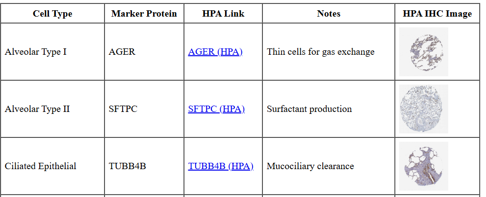
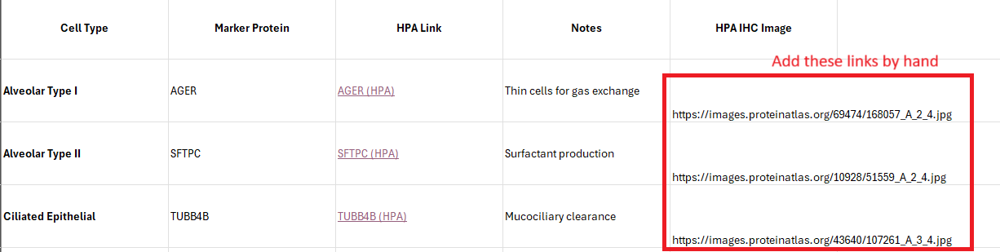

# Introduction 

A key part of any cell typing attempt is examination of each cell type's spatial distributions. 
These patterns can strongly suggest which cell type an unknown cluster is, and they
are useful for confirming putative cell type assignments. 

The Human Protein Atlas is a powerful resource for these exercises.
For almost every cell type in the human body, the HPA contains high-res IHC images
of a protein that is highly specific to the cell type. 

Here, with the help of LMMs, we have compiled "cheat sheets" for a small collection of tissues.
Each sheet delineates the cell types present in a tissue type, suggests a marker protein that can be found in the HPA, and links to the relevant HPA page and to a relevant IHC image. 

Here's a glance at one:

Caveat: this information was generated by an LLM and reviewed/edited by humans. 
As with any product of an LMM (or a human), give any individual claim less than total credence.

We are posting this now with just 3 tissues covered, with the plan to add more later.
If you mimic our approach for another tissue, feel free to send us your own cheat sheets,
and we'll host them here for the community. 

# Cheat sheets for tissue-specific cell typing:

* [Kidney](resources/kidney cell types cheat sheet.html){target="_blank"}
* [Pancreas](resources/pancreas cheat sheet.html){target="_blank"}
* [Lung](resources/lung cheat sheet.html){target="_blank"}

# Example LLM prompts for generating your own cheat sheet:

We employed variations of the below to elicit these cheat sheets from a LLM. 
The whole exercise should take ~2 minutes per cell type. 

::: {.callout-tip}
## Prompt to get good markers
Can you please give me a table of the major cell types in the human lung, and 1-3 good marker genes or proteins for each one? (Marker proteins are better - we'll be looking them up in the Human protein atlas next.)
:::

::: {.callout-tip}
## Prompt to get HPA links
Now please add links to the Human Protein Atlas tissue page for the best marker for each cell type
:::

Here we exercised some curatorial judgment and selected the best IHC image by eye. 
We appended the links to those images to the table generated from the previous prompt. 
See the final column below:

::: {.callout-tip}
## Prompt to compile into HTML file
OK, now make me an html please from the below table. The links to images should be thumbnails.
:::

Now copy the response to notepad, save as .html, and you're done!