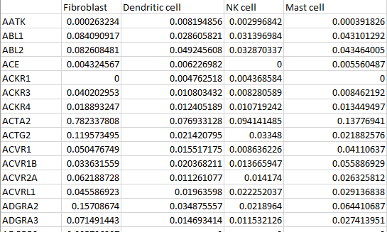
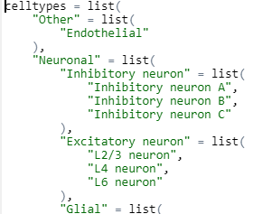
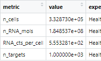
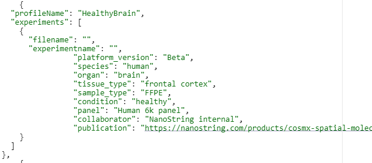

```{css}
#| echo: false
#| eval: true
.center {
  display: block;
  margin-left: auto;
  margin-right: auto;
  width: 50%;
}

```


# CosMx SMI Cell Profiles

## Introduction

Cell typing CosMx Spatial Molecular Imager (SMI) data can be done in [several ways](https://nanostring-biostats.github.io/CosMx-Analysis-Scratch-Space/posts/cell-typing-basics/){target="_blank"}. One of these is to employ a reference matrix of known cell type profiles using our `Insitutype` package ([manuscript](https://www.biorxiv.org/content/10.1101/2022.10.19.512902v1){target="_blank"},  [GitHub repository](https://github.com/Nanostring-Biostats/insitutype){target="_blank"}, and [GitHub FAQ](https://github.com/Nanostring-Biostats/InSituType/blob/main/FAQs.md){target="_blank"}). While spatially-naive scRNAseq-derived profiles work well ([Cell Profile Library](https://github.com/Nanostring-Biostats/CellProfileLibrary){target="_blank"}), platform differences can extend the iterative process of celltyping [@Danaher2022]. To that end, we present CosMx SMI-derived cell profiles, available on the GitHub repository [CosMx-Cell-Profiles](https://github.com/Nanostring-Biostats/CosMx-Cell-Profiles){target="_blank"}.

## Overview

This repository contains a library of cell profile matrices with accompanying statistics and metadata. For each featured tissue, the profiles matrix gives the average expression of a variety of relevant cell types. Each matrix in the library was derived from one or more CosMx SMI experiments of a mix of panels. There are profiles from healthy and cancerous adult human samples as well as mouse brain.

Each profile contains the following components:

1.	Cell profiles matrix
2.	Cell type annotations
3.	Basic statistics
4.	Target statistics
5.	Metadata


## File Types

### Cell Profiles Matrix

CSV file of targets by cell types. Each cell type is a unique row. Each target is a unique column. Where multiple experiments were combined, only the intersection of targets was used. The profiles were generated using `InSituType::Estep()`, which removes background readout (negative probes) when calculating the net expression profile for each cell type. For details, refer to the [InSituType manual](https://github.com/Nanostring-Biostats/InSituType).

```{r, out.width="600px"}
#| eval: true
#| echo: false
#| label: "cell_profiles"
#| fig-cap: "Snippet of a cell profiles matrix."


```


### Cell Type Annotations

To put cell types in context, we offer both cell type hierarchies and ontology terms.

R file defining a nested list object so users can group cell type categories. Human-readable ensures non-R users (e.g., Python) can parse and use. 

::: {.callout-note}
Note that some inner nodes on the hierarchies are both lower-granularity categorizations as well as a final cell type included in the profiles themselves.
:::


```{r out.width="400px"}
#| eval: true
#| echo: false
#| label: "cell_type_hierarchy"
#| fig-cap: "Snippet of a cell type hierarchy."


```


[Cell Ontology](https://obofoundry.org/ontology/cl.html) annotations are also provided for all nodes on the hierarchies. Where applicable, the identified match and/or parent (more general) matches are provided. For other cell types, where no node or parent node matches are found, we instead provide the closest term. Finally, the column `in_profiles` indicates whether the table row corresponds to a cell type present in the profiles (independent of whether it is an internal or terminal node within the hierarchies).


### Basic Statistics

CSV files of basic statistics on the profiles: number of input cells of each type per profile, standard deviation for each target, etc.

```{r out.width="400px"}
#| eval: true
#| echo: false
#| label: "basic_stats"
#| fig-cap: "Snippet of basic statistics for a set of profiles."


```


```{r out.width="400px"}
#| eval: true
#| echo: false
#| label: "cell_counts"
#| fig-cap: "Snippet of input cell counts of each cell type for a set of profiles."

knitr::include_graphics("./figures/cell_counts.png")
```


### Target Statistics

CSV files of average and standard deviation of targets in profiles so that users may remove targets as desired. Unlike the cell profiles, the average values by cell type and target here are simple means that do not use the negative probe values.

```{r out.width="600px"}
#| eval: true
#| echo: false
#| label: "cell_stdevs"
#| fig-cap: "Snippet of input cell standard deviations matrix of each cell type for a set of profiles."

knitr::include_graphics("./figures/cell_stdevs.png")
```


### Metadata

JSON file on experimental design and attribution, including collaborators (if applicable), species, tissue type/substructure, CosMx SMI instrument version, input panel, etc. ***Please cite the source of the data if using the CosMx SMI cell profiles in your work.***

```{r out.width="600px"}
#| eval: true
#| echo: false
#| label: "metadata"
#| fig-cap: "Snippet of input metadata for a set of cell profiles."


```


## Usage

::: {.callout-caution title="Important note"}
If you use the cell profiles in your work, please include citations applicable for the relevant tissue(s). See the Metadata file for more information.
:::


These matrices can be downloaded directly and loaded into environments for analysis with Insitutype.

Caution:

- We do not recommend combining CosMx SMI-derived cell type profiles with scRNA-seq derived profiles in cell typing. For example, we advise against combining the CosMx SMI IO profiles with scRNA-seq profiles for the tissue type.
- Note that some inner nodes on the hierarchies are both lower-granularity categorizations as well as a final cell type included in the profiles themselves.
- If you choose to combine multiple CosMX SMI-derived profiles into a single hybrid reference, please see our [Scratch Space post here](https://nanostring-biostats.github.io/CosMx-Analysis-Scratch-Space/posts/hybrid-reference-profiles/){target="_blank"} for guidance.


## Methodology

All profiles were derived from CosMx SMI experiments. Projects with high-confidence cell typing were identified and permission obtained from collaborators/customers where necessary. Cell type names were corrected for consistent style. Where necessary, poor-confidence typed cells as well as genes with high discordance between CosMx SMI-derived and scRNA-seq derived profiles were removed. In profiles built from multiple experiments, only the intersection of targets was used. `InSituType::Estep()` was run to generate mean expression profiles from the raw counts of cells x targets, negative probe counts, and given cell types.

Please note the profiles, while derived from CosMx SMI experiments, may not contain the exact suite of targets of current CosMx SMI panel products.


## Contribution

If you would like to contribute to the `CosMx Cell Profiles` repository with data from your experiments, please contact us at support.spatial@bruker.com. Broadly speaking, the process involves a license agreement, finalized cell typing, and generation of the standardized file types of the repository as outlined above.
