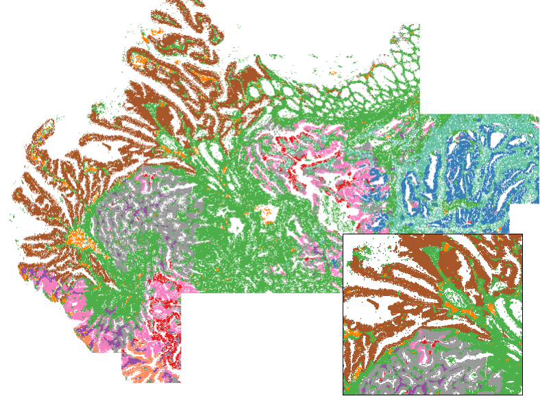
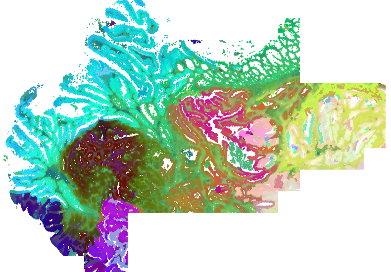

  
# Background

Here we address two related problems:

1. How to partition a tissue or study into discrete spatial domains / niches
2. How to numerically represent cells' "spatial contexts" (output: a matrix of cells x variables encoding details of cells' surroundings)

The first problem has been a focus of spatial data analysis since the very beginning - 
see e.g. Zhu et al. 2018, “Identification of spatially associated subpopulations by combining scRNA-seq and sequential fluorescence in situ hybridization data.”
Numerous methods have been developed since then, and more recently papers have come out benchmarking them. 

The second problem - that of encoding spatial context - is usually solved in service of domain detection, 
 but we have frequently found a need for it in other contexts. 
For example, you might want to condition on it to avoid confounding, or you might want to measure similarity between cells' spatial contexts. 
 
Circa 2021, we began using a simple approach: 

1. Identify a cell's nearest neighbors
2. Record their average characteristics, e.g. their cell type composition or average expression profile. This is their spatial context. 
3. Cluster the resulting matrix to obtain domains. 

Lately we favor the Novae algorithm, which uses a spatial transformer to obtain an embedding of spatial context, 
then applies a well-crafted hierarchical clustering method to that embedding matrix to define domains. . 
Novae produces spatially-nuanced domains, but it is relatively inconvenient to stand up, is slow without a GPU, and often needs computationally expensive fine-tuning. 

# An updated simple embedding of cellular neighborhoods

Here we define an embedding of cellular neighborhoods / spatial context that is 
 simple, fast and spatially granular. 
We have not tested it extensively, but it appears in early results to offer spatial 
 resolution qualitatively similar to Novae while running in minutes in R on a CPU. 

To achieve this, we make modest updates to our previous approach to get the below procedure:

1. Begin with a highly informative embedding of single cell expression data. 
The [scPearsonPCA package](https://github.com/Nanostring-Biostats/CosMx-Analysis-Scratch-Space/tree/Main/_code/scPearsonPCA){target="_blank"} offers a straighforward way to obtain this. 
2. Record each cell's nearest 5 neighbors and nearest 50 neighbors.
3. Report the average single cell embedding values across each cell's k=5 and k=50 neighbors. cbind() these two matrices to each other. Then e.g. if your single cell embedding matrix held 30 PC's, then this final matrix will have 60 columns. 

That's it. Code to perform these steps is below. 

```{r echo = TRUE, eval = FALSE}
#### functions ------------------------------------

nearestNeighborGraph <- function (x, y, N, subset = 1) {
    DT <- data.table::data.table(x = x, y = y, subset = subset)
    nearestNeighbor <- function(i) {
        subset_dt <- DT[subset == i]
        idx <- which(DT[["subset"]] == i)
        ndist <- spatstat.geom::nndist(subset_dt[, .(x, y)], 
            k = 1:N)
        nwhich <- spatstat.geom::nnwhich(subset_dt[, .(x, y)], 
            k = 1:N)
        ij <- data.table::data.table(i = idx[1:nrow(subset_dt)], 
            j = idx[as.vector(nwhich)], x = as.vector(ndist))
        return(ij)
    }
    ij <- data.table::rbindlist(lapply(unique(subset), nearestNeighbor))
    adj.m <- Matrix::sparseMatrix(i = ij$i, j = ij$j, x = ij$x, 
        dims = c(nrow(DT), nrow(DT)))
    return(adj.m)
}

neighbor_colMeans <- function(x, neighbors) {
    neighbors@x <- rep(1, length(neighbors@x))
    neighbors <- Matrix::Diagonal(x = 1/Matrix::rowSums(neighbors)) %*% 
        neighbors
    neighbors@x[neighbors@x == 0] <- 1
    out <- neighbors %*% x
    return(out)
}

#' Get embedding of cellular neighborhoods from single cell embeddings and xy positions
#' @param mat Single cell embeddings matrix, cells x features
#' @param xy 2-column matrix of cells' positions
#' @param ks Vector giving the number of nearest neighbors to use for each neighbor network
#' @param tissue Optional vector giving tissue IDs, used to prevent cells from different tissues becoming neighbors due to xy overlap. 
#' @return A matrix of cellular neighborhood embeddings, dimension = n cells x ncol(mat)*length(ks)
embedCellNeighborhoods <- function(mat, xy, ks = c(5, 50), tissue = NULL) {
  
  # get neighbor networks:
  if (is.null(tissue)) {
    tissue <- 1
  }
  neighborslist <- list()
  for (k in ks) {
    neighborslist[paste0("k", k)] <- nearestNeighborGraph(xy[, 1], xy[, 2], N = k, subset = tissue) 
  }
  # average over neighbors:
  env <- c()
  for (name in names(neighborslist)) {
    env <- cbind(env, as.matrix(neighbor_colMeans(mat, neighbors = neighborslist[[name]])))
    newinds <- (ncol(env) - ncol(mat) + 1) : ncol(mat)
    colnames(env)[newinds] <- paste0(name, colnames(env)[newinds])
  }
  return(as.matrix(env))
}

#' Color cells by similarity in a data matrix
#' @param mat Matrixof observations x features 
#' @param maxquant Truncate the umap axes at this quantile (and 1 minus this value)
#' @param na.color Color for NA values
#' @param ... Arguments passed to uwot::umap
#' @return A vector of color values
colorByMatrix <- function(mat, maxquant = 0.99, na.color = "#808080", ...) {
  
  um <- uwot::umap(as.matrix(mat), n_components = 3)
  mat <- as.matrix(mat)
  # truncate at max quantile
  um <- apply(um, 2, function(x){replace(x, x < quantile(x, 1-maxquant, na.rm = TRUE), 1 - maxquant)})
  um <- apply(um, 2, function(x){replace(x, x > quantile(x, maxquant, na.rm = TRUE), maxquant)})
    # Scale each column to [0,1]
  scale01 <- function(x) {
    rng <- range(x, na.rm = TRUE)
    if (diff(rng) == 0) {
      return(rep(0.5, length(x)))  # constant column -> midpoint
    }
    (x - rng[1]) / diff(rng)
  }
  scaled <- apply(um, 2, scale01)
  # Identify rows with NA
  bad <- apply(scaled, 1, function(x) any(is.na(x)))
  # Convert to RGB
  cols <- rgb(
    red   = scaled[, 1],
    green = scaled[, 2],
    blue  = scaled[, 3]
  )
  cols[bad] <- na.color
  return(cols)
}


```


And an example workflow is:

```{r echo = TRUE, eval = FALSE}
## starting data:
# - counts: matrix of raw counts, cells x genes
# - xy: matrix of cells' xy positions

#### get single cell embedding using scPearsonPCA: -------------------------------

# remotes::install_github("Nanostring-Biostats/CosMx-Analysis-Scratch-Space",
#                          subdir = "_code/scPearsonPCA", ref = "Main")
library(scPearsonPCA)
library(Seurat)

## find HVG's:
# recommend nfeatures = 3000 for WTX, 2000 for 6k panel, and using all features for 1k panels
seu <- Seurat::CreateSeuratObject(counts = Matrix::t(counts),
                                  meta.data = metadata)
seu <- Seurat::FindVariableFeatures(seu, nfeatures = 3000) 
hvgs <- setdiff(seu@assays$RNA@meta.data$var.features, NA)

## load and run scPearsonPCA:  (note there is also a batch-aware method)
# total counts:
tot <- Matrix::rowSums(counts)
# gene abundance:
genefreq <- scPearsonPCA::gene_frequency(Matrix::t(counts)) ## gene frequency (across all cells)
# run PCA:
pcaobj <- scPearsonPCA::sparse_quasipoisson_pca_seurat(
  x = Matrix::t(counts),
  totalcounts = tot,
  grate = genefreq,
  scale.max = 10, ## PC's reflect clipping pearson residuals > 10 SDs above the mean pearson residual
  do.scale = TRUE, ## PC's reflect as if pearson residuals for each gene were scaled to have standard deviation=1
  do.center = TRUE ## PC's reflect as if pearson residuals for each gene were centered to have mean=0
)


#### compute the cellular neighborhood embedding ------------------------

env <- embedCellNeighborhoods(mat = pcaobj$reduction.data@cell.embeddings, 
                              xy = xy, 
                              ks = c(5, 50)) 


#### Simple niche definition by clustering the env matrix -------------------

## with Mclust (similar to K-means)
niche <- mclust::Mclust(env, G = 10, modelNames = "EII")$classification
plot(xy, pch = 16, cex = 0.1, asp = 1, 
     col = cellcols[as.numeric(as.factor(niche))])
```

```{r echo = FALSE, eval = TRUE, out.width = "170%"}

```

# For data exploration: coloring tissues by their environment embeddings

Mostly for fun, but also as a legitimately useful view for exploratory data analysis, 
 we can color tissues by their environment embedding. 
We make a 3-dimensional umap projection from the embedding, then convert these 3 dimensions to RGB values. 
Note this can take a few minutes, since it does need to compute a UMAP. 

``` {r echo = TRUE, eval = FALSE}
# color cells by their cellular neighborhood embedding:
envcols <- colorByMatrix(mat = env, maxquant = 0.99, na.color = "#808080") 

# plot the tissue:
par(bg = "black")
par(mar = c(0,0,0,0))
plot(xy, pch = 16, cex = 0.1, asp = 1, col = envcols)
```


```{r echo = FALSE, eval = TRUE, out.width = "170%"}

```
