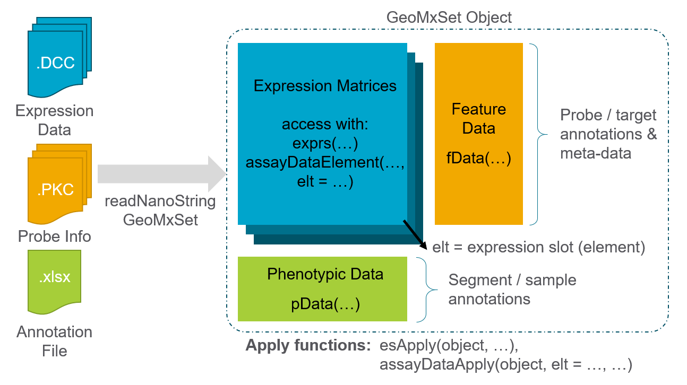
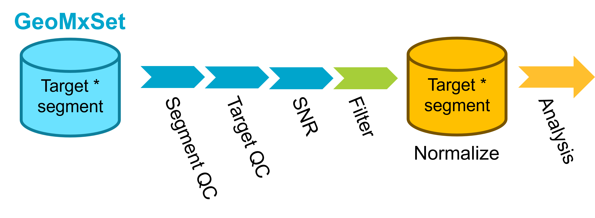
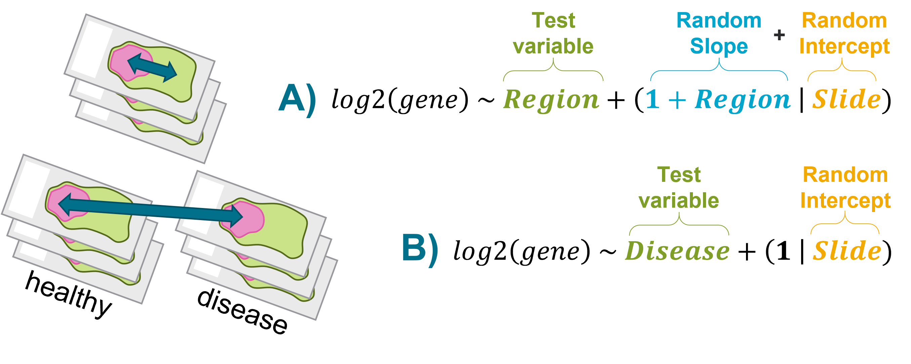

# Introduction

In this vignette, we will introduce a data analysis workflow for GeoMx&#174; NGS protein expression data profiled with the [GeoMx IO Proteome Atlas (IPA) atlas](https://nanostring.com/products/geomx-digital-spatial-profiler/geomx-protein-assays/io-proteome-atlas/){target="_blank"}. The workflow introduced in this vignette can be applied to the new [Discovery Proteome Atlas (DPA) panel](https://nanostring.com/products/geomx-digital-spatial-profiler/geomx-protein-assays/discovery-proteome-atlas/){target="_blank"}, as well. 

The GeoMx Digital Spatial Profiler (DSP) is a platform for capturing spatially resolved high-plex gene or protein expression data from tissue (@Merritt2020). In particular, formalin-fixed paraffin-embedded (FFPE) or fresh-frozen (FF) tissue sections are stained with barcoded in-situ hybridization probes that bind to endogenous mRNA transcripts or barcoded antibodies that recognize endogenous proteins. The user then selects regions of the interest (ROI) to profile; if desired, each ROI segment can be further sub-divided into areas of illumination (AOI) based on tissue morphology. The GeoMx DSP then photo-cleaves and collects expression barcodes for each AOI segment separately for downstream sequencing and data processing.

The final results are spatially resolved unique expression datasets for every protein-coding gene (>18,000 genes) or over 570 proteins from every individual segment profiled from tissue. Here, we walk through an analysis workflow with one example dataset.

This vignette is divided into the following major sections:

- @sec-study-design Study Design
- @sec-quality-control Quality Control
- @sec-eda Exploratory Data Analysis
- @sec-de Differential Expression 
- @sec-conclusion Conclusions

```{r}
#| label: file_setup_rendering
#| echo: false
#| eval: true

outdir <- "./Assets"
qc_dir <- file.path(outdir, "qc")
de_dir <- file.path(outdir, "de")
de_plot_dir <- file.path(de_dir, "Plots")
```

```{css, echo=FALSE}
.hscroll-plot {
  overflow-x: auto;
  overflow-y: hidden;
  max-width: 100%;
  padding-bottom: 0.25rem;
}
.hscroll-plot img, .hscroll-plot svg, .hscroll-plot canvas {
  display: block;
  max-width: none !important;
}
```

Before getting started, we load in key libraries and set locations of folders we'll use for intermediate
and final analyses and results.

```{r initiate_analysis, message=FALSE, warning=FALSE}
#| echo: true
#| eval: false
# List of CRAN packages for session
.cran_packages <- c("plyr", "dplyr", "FactoMineR", "ggplot2", "ggforce", 
                    "openxlsx", "psych", "kableExtra", "GGally", "magick", 
                    "ggrepel", "circlize", "pals", "ggupset", "tidyr", 
                    "reshape2", "ggprism", "gtools", "parcats", "svglite", 
                    "vdiffr", "parallel",
                    "easyalluvial", "ggtext")

# List of Bioconductor packages for session
.bioc_packages <- c("GSEABase", "GSVA", "Biobase", "NanoStringNCTools", 
                    "GeomxTools", "GeoMxWorkflows", "SpatialDecon", 
                    "ComplexHeatmap", "org.Hs.eg.db", "org.Mm.eg.db")

## Install packages if any are missing
# Install CRAN packages (if not already installed)
.inst <- .cran_packages %in% installed.packages()
if(length(.cran_packages[!.inst]) > 0) install.packages(.cran_packages[!.inst])

# Install Bioconductor packages (if not already installed)
.bioc_inst <- .bioc_packages %in% installed.packages()
if(length(.bioc_packages[!.bioc_inst]) > 0){
  BiocManager::install(.bioc_packages[!.bioc_inst])
}

# require these packages
cran_loaded <- lapply(.cran_packages, require, character.only=TRUE)
bioc_loaded <- lapply(.bioc_packages, require, character.only=TRUE)


# Load in useful functions for GeoMx Data Analysis
source("https://raw.githubusercontent.com/Nanostring-Biostats/CosMx-Analysis-Scratch-Space/Main/_code/geomx_vignette/GeoMx_Workflow_Helpers.R")


## Set up directory structure
# datadir is the location of dcc files, pkc file(s), and images (if applicable).
datadir <- "/path/to/data/dir/" # Set data directory

# Initiate a date tag & directory naming
project_name <- "Demo" # Set a name for the project
date_tag <- paste0(format(Sys.Date(), "%Y%m%d"), "_", project_name)
outdir <- paste0("output_", date_tag)
object_dir <- file.path(outdir, "R_objects")
qc_dir <- file.path(outdir, "qc")
de_plot_dir <- file.path(outdir, "de", "Plots")
de_data_dir <- file.path(outdir, "de", "Data")

# Initialize output directory for static images, tables, and serialized R objects.
for(dir_i in c(outdir, object_dir, qc_dir, de_plot_dir, de_data_dir)){
  if(!dir.exists(dir_i)){
    dir.create(dir_i, recursive = TRUE)
  }
}

# Select your p_adjust method. Note: this value must be one of the following: "holm", "hochberg", "hommel", "bonferroni", "BH", "BY", "fdr", "none"
p_adjust_method_selected <- "fdr"
p_adjust_threshold <- 0.05
```


# Study Design {#sec-study-design}

Here we describe the experimental setup and the raw data that will form the 
basis of our analysis.

<details>
<summary>Click to show/hide a description of the study design</summary>

## Slides and Profiling Strategy 

In this vignette, we will analyze a GeoMx DSP breast cancer dataset created 
with the IPA assay. The dataset of interest is comprised of six breast cancer samples 
from six patients who received a therapeutic treatment, with 3 responders and 3 
non-responders. Regions of interest (ROIs) were further segmented into PanCK+ 
and PanCK- areas of illumination (AOIs), separating epithelial and tumor
compartments from stromal compartments.

To follow along with this vignette, the data set used here can be downloaded 
from this [Box link](https://nanostring.box.com/s/o15x51acki3096y52li2jcxrw3r855wk){target="_blank"}.
After downloading, unzip the file and place the outputs (key data files) in your
`datadir`, as specified above.


The key data files are:


- DCCs files - expression count data and sequencing quality metadata
- PKCs file(s) - probe assay metadata describing the protein targets present in the data. PKC files can be found [here](https://nanostring.com/products/geomx-digital-spatial-profiler/geomx-dsp-configuration-files/){target="_blank"}.
- Annotation file - This should be the Lab Worksheet from the GeoMx instrument study readout package. Users should add any useful tissue information, including the type of segment profiled (ex: responder vs. non-responder), segment area/nuclei count, and other tissue characteristics when applicable (ex: diseased vs. healthy). Please note, the row order of NTCs is important to ensure proper processing of files. To ensure the proper order, the file should be sorted by DSP file name. The Lab Worksheet needs to be formatted for ingestion with GeoMxTools. First, the lab worksheet should be opened in Excel, and the first ~15 rows should be deleted so that only the header row and sample information remain.

We first locate the downloaded files and then we load the data to create a data 
object using the `readNanoStringGeoMxSet` function from the `GeomxTools` package.
For more information about this data object, see this [GeoMxSetObject Overview](https://www.bioconductor.org/packages/release/workflows/vignettes/GeoMxWorkflows/inst/doc/GeomxTools_RNA-NGS_Analysis.html#91_GeoMxSet_Object_Overview){target="_blank"}.



```{r read_data, message = FALSE, warning = FALSE, show=FALSE}
#| echo: true
#| eval: false
# If the object probe_data already exists in object_dir, 
# load it from disk. Otherwise, run readNanoStringGeoMxSet

if(file.exists(file.path(object_dir, "probe_data.RDS"))){
  probe_data <- readRDS(file.path(object_dir, "probe_data.RDS"))
} else {
 DCCFiles <- dir(file.path(datadir, "dccs"), pattern = ".dcc$",
                 full.names = TRUE, recursive = TRUE)
 PKCFiles <- dir(file.path(datadir, "pkcs"), pattern = ".pkc$",
                                 full.names = TRUE, recursive = TRUE)
 SampleAnnotationFile <-
  dir(file.path(datadir), pattern = "demo.xlsx$",
      full.names = TRUE, recursive = TRUE)
  probe_data <-
    readNanoStringGeoMxSet(dccFiles = DCCFiles,
                           pkcFiles = PKCFiles,
                           phenoDataFile = SampleAnnotationFile,
                           phenoDataSheet = "Sheet 1",
                           phenoDataDccColName = "Sample_ID",
                           protocolDataColNames = c("aoi", "roi"),
                           experimentDataColNames = c("panel"),
                           analyte = 'Protein')
  saveRDS(object=probe_data, file=file.path(object_dir, "probe_data.RDS"))
}

if(!"slide name" %in% colnames(pData(probe_data))){
  stop("The reserved column \'slide name\' was not found in this dataset.")
}

# Select factors of interest from the data's metadata
factors_of_interest <- c("Responder","slide","Segment")

# Set colors for main factors of interest
pal_main <- 
 getColorPalette(pData(probe_data)[, factors_of_interest[c(2:length(factors_of_interest),1)]], method = "Main")


```


All of the expression, annotation, and probe information are now linked and stored together into a single data object.


We summarize the study design in a Sankey diagram, which illustrates how samples
flow through each step and link to their biological annotations. The width of 
each connecting band reflects how many segments are shared between the two
annotations, making it easy to see where groups diverge or overlap.


```{r alluvial, fig.width=8, fig.height=6}
#| echo: true
#| eval: false

pheno_data <- pData(probe_data)

# Select factor of interest to color sankey based on this factor
sankey_focal_factor <- factors_of_interest[1]

# Subset the desired columns
sample_overview <- pheno_data[factors_of_interest]

# Create alluvial plot
p <- easyalluvial::alluvial_wide(sample_overview, 
                                 max_variables = 15, 
                                 col_vector_value = unlist(pal_main),
                                 col_vector_flow = as.vector(pal_main[[sankey_focal_factor]]))
ggsave(p, filename = "Main_Alluvial.svg", path = qc_dir, device = "svg", width=7, height=7)

# For an interactive plot, use the code below:
pc <- parcats(p,
        marginal_histograms = FALSE,
        data_input = sample_overview,
        labelfont = list(size = 12, color = "black"),
        hoveron="dimension",
        hoverinfo = "count",
        offset_marginal_histograms = 0.7)
saveRDS(pc, file = paste0(qc_dir, "/pc_interactive.rds"))
```

Here we show the static Sankey diagram:
```{r}
#| echo: false
#| eval: true
knitr::include_graphics(paste0(qc_dir, "/Main_Alluvial.svg"))
```

</details>

# Quality Control {#sec-quality-control}

Before we dive into deeper analysis, we first run through a few key quality 
measures to assess the dataset.

<details>
<summary>Click to show/hide quality control steps</summary>

The QC steps can be summarized as follows: 



## Segment QC

Set up QC parameters to use for the study. Here we list parameters that are a
good starting point for IPA datasets, but as always we recommend examining
the distribution of these metrics in your dataset to choose appropriate 
thresholds.

Every ROI/AOI segment is tested for:

* __Raw sequencing reads__: segments with <1000 raw reads are removed.
* __% Aligned, % Trimmed, or % Stitched sequencing reads__: segments below ~80% for 
one or more of these QC parameters are removed.
* __% Sequencing saturation__: Defined as ([1-deduplicated reads/aligned reads]%). Segments 
below ~50% require additional sequencing to capture full sample diversity and 
are not typically analyzed until improved.
* __Minimum Negative Count__: this is the geometric mean of the several unique negative 
probes in the GeoMx panel that do not target endogenous proteins and establish the background 
count level per segment; segments with low negative counts (1-10) are not 
necessarily removed but may be studied closer for low endogenous signal 
and/or insufficient tissue sampling.


* __No Template Control (NTC) count__: values >1000 could indicate contamination 
for the segments associated with this NTC; however, in cases where the NTC 
count is between 1000-10000, the segments may be used if the NTC data is 
uniformly low (e.g. 0-2 counts for all probes).
* __Nuclei__: >100 nuclei per segment is generally recommended; however, this 
cutoff is highly study/tissue dependent and may need to be reduced; what is 
most important is consistency in the nuclei distribution for segments within 
the study.
* __Area__: generally correlates with nuclei; a strict cutoff is not generally 
applied based on area.

More information about these parameters can be found in the [GeomxTools Bioconductor page](http://www.bioconductor.org/packages/release/bioc/html/GeomxTools.html){target="_blank"} and [reference manual](http://www.bioconductor.org/packages/release/bioc/manuals/GeomxTools/man/GeomxTools.pdf){target="_blank"}. 


```{r qc_parameters}
#| echo: true
#| eval: false
# Parameters used
QC_params <- list(
  minSegmentReads = 1000,
  percentTrimmed = 80,
  percentStitched = 80,
  percentAligned = 75,
  percentSaturation = 50,
  minNegativeCount = 1,
  maxNTCCount = 9000,
  minNuclei = 20,
  minArea = 1000
 
)

top_quantile <- 0.90 # quantile of features to select for comparing top CV features
```


We first will assess sequencing quality and adequate tissue sampling for every 
ROI/AOI segment. We do this by comparing segment metrics to the QC thresholds
set above. Following this QC check, we show plots visualizing each metric
followed by a table summarizing the segments
that pass the key QC metrics.


```{r segment_qc}
#| echo: true
#| eval: false


probe_data_qc <- probe_data

# Save this as a data frame
qc_param_tab <- data.frame(Parameter=names(QC_params), 'Default value'=as.numeric(GeomxTools:::DEFAULTS[names(QC_params)]), 'Actual value'=as.numeric(QC_params))

results_list <- readRDS(paste0(outdir, "/results.rds"))
results_list$qc_param_tab <- qc_param_tab
saveRDS(results_list, paste0(outdir, "/results.rds"))

# Assess QC flags using setSegmentQCFlags
probe_data_qc <- setSegmentQCFlags(probe_data_qc, qcCutoffs = QC_params)

# Collate QC Results
QCResults <- data.frame(protocolData(probe_data_qc)[["QCFlags"]])
flag_columns <- colnames(QCResults)
QC_Summary <- data.frame(Pass = colSums(!QCResults[, flag_columns]),
                         Warning = colSums(QCResults[, flag_columns]))
QCResults$QCStatus <- apply(QCResults, 1L, function(x) {
    ifelse(sum(x) == 0L, "PASS", "WARNING")
})
QC_Summary["TOTAL FLAGS", ] <-
    c(sum(QCResults[, "QCStatus"] == "PASS"),
      sum(QCResults[, "QCStatus"] == "WARNING"))

# Add QC status back to probe_data
pData(probe_data)$QC <- QCResults$QCStatus

# Save QC Summary
results_list <- readRDS(paste0(outdir, "/results.rds"))
results_list$QC_Summary <- QC_Summary
saveRDS(results_list, paste0(outdir, "/results.rds"))
```

```{r}
#| echo: false
#| eval: true

results_list <- readRDS(paste0(outdir, "/results.rds"))
results_list$qc_param_tab$Default.value <- format(round(results_list$qc_param_tab$Default.value), scientific = FALSE)
results_list$qc_param_tab$Actual.value <- format(round(results_list$qc_param_tab$Actual.value), scientific = FALSE)

knitr::kable(results_list$qc_param_tab)
```


### Segment QC Plots

```{r seg_qc_processing}
#| echo: true
#| eval: false

# Processing data for QC plots

# Un-embed data frames from the QC data
for (column in colnames(sData(probe_data_qc))) {
    if (inherits(sData(probe_data_qc)[,column], "data.frame") && ncol(sData(probe_data_qc)[,column])==1){
        probe_data_qc@protocolData@data[,column] <- sData(probe_data_qc)[, column][,1]
    }
}
# calculate the negative geometric means for each module
negativeGeoMeans <- 
    esBy(negativeControlSubset(probe_data_qc), 
         GROUP = "Module", 
         FUN = function(x) { 
             assayDataApply(x, MARGIN = 2, FUN = ngeoMean, elt = "exprs") 
         }) 
# Convert embedded matrix to df then to AnnotatedDataFrame
protocolData(probe_data_qc) <-  as(
  cbind(
    as(protocolData(probe_data_qc), "data.frame"),
    as.data.frame(negativeGeoMeans)
  ), "AnnotatedDataFrame")
# Here are the module names
pkcs <- annotation(probe_data_qc)
modules <- gsub(".pkc", "", pkcs)
# Copy the Negative geoMeans from sData to pData
negCols <- paste0("NegGeoMean_", modules)
# negCols <- colnames(sData(probe_data_qc)[["NegGeoMean"]])
pData(probe_data_qc)[, negCols] <- sData(probe_data_qc)[, which(colnames(sData(probe_data_qc)) %in% modules)]
# detatch neg_geomean columns ahead of aggregateCounts call
pData(probe_data_qc) <- pData(probe_data_qc)[, !colnames(pData(probe_data_qc)) %in% negCols]
```


The tabs below visualize the segment QC distributions for various sequence and segment quality metrics. 


::: {.panel-tabset}

### Percent trimmed

The plot below shows the distribution of trimmed reads in the data with the
percent threshold as set in the QC parameters code block shown as a vertical
dotted line. Typically we want to see very few reads getting trimmed (ie high
percentage remaining after trimming) as this
indicates a high quality sequencing run.

```{r qc_trimmed, fig.width=6, fig.height=6}
#| echo: true
#| eval: false

# Plot trimmed reads with helper function makeQCHistograms
p <- makeQCHistogram(probe_data_qc, 
                     annotation_col = "Trimmed (%)", 
                     fill_by = "Segment", 
                     bins = 50,
                     xintercept = QC_params$percentTrimmed)
ggsave(p, filename = file.path(qc_dir, "trimmed.svg"), width=6, height=6)

```

```{r}
#| echo: false
#| eval: true
knitr::include_graphics(file.path(qc_dir, "trimmed.svg"))
```


### Percent Aligned

The plot below shows the distribution of aligned reads in the data with the 
percent threshold of aligned reads as set in the QC parameters code block 
shown as a vertical dotted line. Typically we look to see high levels of percent
alignment as this indicates a high quality sequencing run without contaminating
sequences present.


```{r qc_aligned, fig.width=6, fig.height=6}
#| echo: true
#| eval: false
p <- makeQCHistogram(probe_data_qc, 
                     annotation_col = "Aligned (%)", 
                     fill_by = "Segment", 
                     bins = 50,
                     xintercept = QC_params$percentAligned)
ggsave(p, filename = file.path(qc_dir, "aligned.svg"), width=6, height=6)

```

```{r}
#| echo: false
#| eval: true
knitr::include_graphics(file.path(qc_dir, "aligned.svg"))
```

### Percent Stitched

The plot below shows the distribution of stitched reads in the data with the 
percent threshold of stitched reads as set in the QC parameters code block 
shown as a vertical dotted line. Typically we look to see high levels of percent
stitched as this indicates a high quality sequencing run.


```{r qc_stitched, fig.width=6, fig.height=6}
#| echo: true
#| eval: false
p <- makeQCHistogram(probe_data_qc, 
                     annotation_col = "Stitched (%)", 
                     fill_by = "Segment", 
                     bins = 50,
                     xintercept = QC_params$percentStitched)
ggsave(p, filename = file.path(qc_dir, "stitched.svg"), width=6, height=6)

```

```{r}
#| echo: false
#| eval: true
knitr::include_graphics(file.path(qc_dir, "stitched.svg"))
```


### Percent Saturation

The plot below shows the distribution of aligned reads in the data with the
percent saturation threshold as set in the QC parameters code block 
shown as a vertical dotted line. Saturation is defined as: 

$$100* \left( 1 - \frac{deduplicated}{aligned} \right)$$

Typically we look to see about 50% saturation or higher, with lower values
indicating that the sample may benefit from additional sequencing.

```{r qc_saturated, fig.width=6, fig.height=6}
#| echo: true
#| eval: false
p <- makeQCHistogram(probe_data_qc, 
                     annotation_col = "Saturated (%)", 
                     fill_by = "Segment", 
                     bins = 50,
                     xintercept = QC_params$percentSaturation) +
  labs(title = "Sequencing Saturation (%)",
       x = "Sequencing Saturation (%)")
ggsave(p, filename = file.path(qc_dir, "saturated.svg"), width=6, height=6)

```

```{r}
#| echo: false
#| eval: true
knitr::include_graphics(file.path(qc_dir, "saturated.svg"))
```


### Segment Areas

The plot below shows the distribution of area in the data with the area 
threshold in μm<sup>2</sup> as set in the QC parameters code block shown as a 
vertical dotted line. AOI area is dependent on experimental design and so
thresholds may vary between studies. However, one thing to check for is large
outliers in area, which may introduce technical artifacts.

```{r qc_area, fig.width=6, fig.height=6}
#| echo: true
#| eval: false
p <- makeQCHistogram(probe_data_qc, 
                     annotation_col = "area", 
                     fill_by = "Segment", 
                     bins = 50,
                     xintercept = QC_params$minArea)
ggsave(p, filename = file.path(qc_dir, "area.svg"), width=6, height=6)
```

```{r}
#| echo: false
#| eval: true
knitr::include_graphics(file.path(qc_dir, "area.svg"))
```


### Segment Nuclei

The plot below shows the distribution of nuclei counts in the data with the 
threshold of nuclei as set in the QC parameters code block shown as a vertical
dotted line. Nuclei number per AOI is dependent on experimental design and so
thresholds may vary between studies. However, one thing to check for is large
outliers, which may introduce technical artifacts. 

```{r qc_nuclei, fig.width=6, fig.height=6}
#| echo: true
#| eval: false
p <- makeQCHistogram(probe_data_qc, 
                     annotation_col = "nuclei", 
                     fill_by = "Segment", 
                     bins = 50,
                     xintercept = QC_params$minNuclei)
ggsave(p, filename = file.path(qc_dir, "nuclei.svg"), width=6, height=6)
```

```{r}
#| echo: false
#| eval: true
knitr::include_graphics(file.path(qc_dir, "nuclei.svg"))
```


### Negative probe means

Plot the negative probe geometric mean. The vertical bars represent a value of two. Typically geometric mean background values of less than 2 are considered "unstable".


```{r, qc_background, fig.width=6, fig.height=6, collapse=TRUE}
#| echo: true
#| eval: false

# Set core panel name - change this if using a different core panel
# This is the panel that includes the negative probes
core_name = "Hs_P_PRO_NGS_Core_v1.1"

p <- makeQCHistogram(probe_data_qc, 
                     annotation_col = core_name, 
                     fill_by = "Segment", 
                     bins = 50,
                     xintercept = 2,
                     scale_trans = "log10")
ggsave(p, filename = file.path(qc_dir, paste0(core_name, ".svg")), width=6, height=6)

```


```{r}
#| echo: false
#| eval: true

knitr::include_graphics(file.path(qc_dir, "Hs_P_PRO_NGS_Core_v1.1.svg"))
```

:::

As a summary, we show a table of passing and flagged segments.


```{r}
#| label: show_qc_summary
#| echo: false
#| eval: true

results_list <- readRDS(paste0(outdir, "/results.rds"))
knitr::kable(results_list$QC_Summary)
```


Additionally, we summarize the No Template Control (NTC) counts on a per plate basis.
Values >1,000 
could indicate contamination for the segments associated with this NTC; however, 
in cases where the NTC count is between 1,000- 10,000, the segments may be used 
if the NTC data is uniformly low (e.g. distributed across the whole panel, this would represent 0-2 counts for all probes).


```{r}
#| eval: false
#| echo: true

# Create summary table of NTCs
ntc_summary_tab <- ddply(sData(probe_data_qc) %>% 
                          dplyr::select(Plate_ID, NTC_ID, NTC), .(Plate_ID, NTC_ID), function(x){
 ntc_well <- x$NTC_ID[1]
 ntc_count <- x$NTC[1]
 n_samples <- nrow(x)
 return(data.frame('NTC Well ID'=ntc_well, 'NTC counts' = ntc_count, 'Samples'=n_samples))
}) %>% dplyr::select(-NTC_ID)
colnames(ntc_summary_tab) <- c("Plate", "NTC Well", "NTC Counts", "Samples")

# Save NTC Summary
results_list <- readRDS(paste0(outdir, "/results.rds"))
results_list$NTC_Summary <- ntc_summary_tab
saveRDS(results_list, paste0(outdir, "/results.rds"))

```

```{r}
#| label: show_ntc_summary
#| echo: false
#| eval: true

results_list <- readRDS(paste0(outdir, "/results.rds"))
knitr::kable(results_list$NTC_Summary)
```


Here, we remove any segments that were flagged in our segment QC.


```{r seg_qc_filtering}
#| echo: true
#| eval: false
seg_qc_samples_to_remove <- rownames(QCResults)[QCResults$QCStatus!="PASS"]

if(length(seg_qc_samples_to_remove)>0){
  probe_data_qc <- probe_data_qc[,-which(colnames(probe_data_qc) %in% seg_qc_samples_to_remove)]
}
```


## Quality control of housekeeper proteins and background (isotypes)

Before we perform any normalization to control molecules, we need to check if the control 
molecules are themselves correlated with the predictors of interests. There are
two classes of control molecules in the dataset: isotypes and housekeepers. We
extract their names here. 


```{r control_names}
#| echo: true
#| eval: false

results_list <- readRDS(paste0(outdir, "/results.rds"))

# biological negatives (isotype controls)
iggs = iggNames(probe_data_qc)
message(paste0("All IgGs: ",paste0(iggs, collapse=", ")))

# housekeepers:
hks = hkNames(probe_data_qc)
message(paste0("All HKGs: ",paste0(hks, collapse=", ")))

# Store names
results_list$iggs <- iggs
results_list$hks <- hks
saveRDS(results_list, paste0(outdir, "/results.rds"))
```


```{r}
#| echo: false
#| eval: true

results_list <- readRDS(paste0(outdir, "/results.rds"))
message(paste0("All IgGs: ",paste0(results_list$iggs, collapse=", ")))
message(paste0("All HKGs: ",paste0(results_list$hks, collapse=", ")))

```


### Isotype Controls

Plot the joint expression of each pairwise `IgG` control molecule to see
if: 

1. There's evidence that one `IgG` is noisy compared to others
2. There's clustering by predictors, which could bias the normalized data


```{r igg_plot, fig.width=8, fig.height=8, message=F, warning=F}
#| echo: true
#| eval: false

# Extract counts
counts <- t(assayDataElement(probe_data_qc, elt="exprs"))
iggs_df <- log2(as.data.frame(counts[,iggs]))

# Bind to phenotypic data
pheno_data <- pData(probe_data_qc)
n <- ncol(iggs_df)
iggs_df <- cbind(iggs_df, pheno_data %>% dplyr::select(Responder, slide, Segment))

# Plots
p0 <- GGally::ggpairs(data=iggs_df, columns=1:n, progress=FALSE,
            ggplot2::aes(alpha=0.1)) + theme_bw()
ggsave(p0, file=file.path(qc_dir, "QC_pairs_background.svg"), width=n*2.5, height=n*2.5)


# Explore by factors of interest
p2 <- pairs_custom(iggs_df %>% dplyr::select(eval(iggs), Responder), Responder)
ggsave(p2, file=file.path(qc_dir, "QC_pairs_background_Responder.svg"), width=n*2.8, height=n*2.8)

p3 <- pairs_custom(iggs_df %>% dplyr::select(eval(iggs), slide), slide) + theme(axis.text.x = element_text(angle=45, vjust=0.5))
ggsave(p3, file=file.path(qc_dir, "QC_pairs_background_slide.svg"), width=n*2.8, height=n*2.8)

p4 <- pairs_custom(iggs_df %>% dplyr::select(eval(iggs), Segment), Segment)
ggsave(p4, file=file.path(qc_dir, "QC_pairs_background_Segment.svg"), width=n*2.8, height=n*2.8)
```

::: {.panel-tabset}

## IgGs Alone
```{r}
#| echo: false
#| eval: true
knitr::include_graphics(file.path(qc_dir, "QC_pairs_background.svg"))
```

## Responder
```{r}
#| echo: false
#| eval: true
knitr::include_graphics(file.path(qc_dir, "QC_pairs_background_Responder.svg"))
```

## Slide
```{r}
#| echo: false
#| eval: true
knitr::include_graphics(file.path(qc_dir, "QC_pairs_background_slide.svg"))
```

## Segment
```{r}
#| echo: false
#| eval: true
knitr::include_graphics(file.path(qc_dir, "QC_pairs_background_Segment.svg"))
```

:::


::: {.callout-note}
As expected, we see high correlations between isotype controls, indicating that all five isotype controls can be used for normalization. If an isototype control were to show low correlations with all others, we would suggest excluding that isotype control from normalization.
:::


### Housekeeping Controls

Run the same analysis for the housekeepers. This is the same overall process as for the isotypes.

```{r hk_plot, fig.width=10, fig.height=10, message=F, warning=F}
#| echo: true
#| eval: false
hks_df <- log2(as.data.frame(counts[,hks]))
n <- ncol(hks_df)
hks_df <- cbind(hks_df, pheno_data %>% dplyr::select(Responder, slide, Segment))

p6 <- ggpairs(data=hks_df, columns=1:n, progress=FALSE,
            ggplot2::aes(alpha=0.1)) + theme_bw()
ggsave(p6,file=file.path(qc_dir, "QC_pairs_housekeepers.svg"), width=n*2.5, height=n*2.5)


p7 <- pairs_custom(hks_df %>% dplyr::select(eval(hks), Responder), Responder)
ggsave(p7, file=file.path(qc_dir, "QC_pairs_HK_Responder.svg"), width=n*2.8, height=n*2.8)

p8 <- pairs_custom(hks_df %>% dplyr::select(eval(hks), slide), slide) + theme(axis.text.x = element_text(angle=45, vjust=0.5))
ggsave(p8, file=file.path(qc_dir, "QC_pairs_HK_slide.svg"), width=n*2.8, height=n*2.8)

p9 <- pairs_custom(hks_df %>% dplyr::select(eval(hks), Segment), Segment)
ggsave(p9, file=file.path(qc_dir, "QC_pairs_HK_Segment.svg"), width=n*2.8, height=n*2.8)


```


::: {.panel-tabset}

## HKs Alone
```{r}
#| echo: false
#| eval: true
knitr::include_graphics(file.path(qc_dir, "QC_pairs_housekeepers.svg"))
```

## Responder
```{r}
#| echo: false
#| eval: true
knitr::include_graphics(file.path(qc_dir, "QC_pairs_HK_Responder.svg"))
```

## Slide
```{r}
#| echo: false
#| eval: true
knitr::include_graphics(file.path(qc_dir, "QC_pairs_HK_slide.svg"))
```

## Segment
```{r}
#| echo: false
#| eval: true
knitr::include_graphics(file.path(qc_dir, "QC_pairs_HK_Segment.svg"))
```

:::

::: {.callout-note}
As expected, we see high correlation between housekeeper proteins. It is possible for one or two of the proteins to show lower correlation with the others, indicating that these should be removed if using the housekeeper proteins for normalization.
:::


### Isotype vs housekeeper controls

Next, we look at the correlation between the geometric means of the housekeeper
proteins and the isotype (background) controls. We're looking for concordance between the two sets of controls. In a
high quality dataset, we expect to see reasonable correlation between the housekeeper and isotype controls.


```{r pairwise_plot_geomeans, fig.width=14, fig.height=10, warning=FALSE}
#| echo: true
#| eval: false
iggs_df <- (as.data.frame(counts[,iggs]))
hks_df <- (as.data.frame(counts[,hks]))
igg_geo_means <- as.numeric(apply(iggs_df, 1, EnvStats::geoMean))
hks_geo_means <- as.numeric(apply(hks_df, 1, EnvStats::geoMean))
geo_means <- as.data.frame(cbind(igg_geo_means, hks_geo_means))

n <- ncol(geo_means)
p10 <- GGally::ggpairs(data=geo_means, columns=1:2, progress=FALSE,
            ggplot2::aes(alpha=0.1)) + theme_bw()
ggsave(p10, file=file.path(qc_dir, "QC_pairwise_geomeans.svg"), width=n*2.8, height=n*2.8)

```

```{r}
#| echo: false
#| eval: true
knitr::include_graphics(file.path(qc_dir, "QC_pairwise_geomeans.svg"))
```

::: {.callout-note}
High correlation between the geometric means of the housekeeper proteins and the isotype (background) controls.
:::

## Signal to noise ratio, SNR

We calculate the signal-to-noise ratio (SNR) for every protein in every
AOI using the background probes. For this, we use the `IgGs` to represent
background. We then plot the signal-to-noise ratio for all AOIs with all protein 
probes together. Because we have hundreds of proteins, we make an extra wide
plot for exploration such that the protein names are legible.


```{r snr_boxplot}
#| echo: true
#| eval: false

# Calculate SNR
backgrounds <- iggs
prData <- pData(protocolData(probe_data_qc))
snr <- get_snr(exp=counts, backgrounds = backgrounds, n_processors = 5, 
                type="SBR")
snr2 <- reshape2::melt(snr, id.var=NA)
colnames(snr2) <- c("name", "protein", "snr")
snr2 <- base::merge(snr2, prData %>% mutate(name=rownames(prData)) %>% dplyr::select(name), by="name")
                            
# Order proteins based on median SNR, low to high. 
medians_snr <- ddply(snr2, .(protein), summarize, Median=median(snr), 
            UQ=as.numeric(quantile(snr, probs=0.75))) %>% arrange(UQ)
snr2$protein <- factor(as.character(snr2$protein), 
              levels=as.character(medians_snr$protein), order=TRUE)
snr2 <- snr2 %>% arrange(protein, name)


# Set up protein names to color by type
levs <- levels(factor(snr2$protein))                                  
labs <- setNames(paste0("<span style='color:",
                        ifelse(levs %in% iggs, "red",
                               ifelse(levs %in% hks,  "grey", "black")),
                        "'>", levs, "</span>"), levs)                  

# Add segment metadata
snr2$Segment <- pheno_data[snr2$name, "Segment"]

# Plot SNRs
p <- ggplot(data=snr2, aes(x=protein, y=log2(snr))) + 
  geom_boxplot(outlier.shape = NA) + 
  geom_point(alpha=0.5, size=0.3, aes(color = Segment)) +
  scale_color_manual(values = pal_main$Segment) +
  geom_hline(yintercept = 0, lty="dashed") +
  theme_bw() + xlab("Protein") + ylab("log2(SNR)") +
  scale_x_discrete(labels = labs) +
  theme(axis.text.x = ggtext::element_markdown(angle = 90, vjust = 1, 
                                               hjust = 1),
        legend.background = element_rect(fill="white",
                                  linewidth = 0.5, linetype="solid", 
                                  colour ="grey20"),
        legend.position = c(0.05, 0.75)) +
  guides(colour=guide_legend(override.aes = list(size=2))) 

ggsave(p, file= file.path(qc_dir, "snr_plot.png"), height=8, width=80, limitsize=FALSE)
```


::: {.hscroll-plot}
```{r}
#| echo: false
#| fig-align: left
#| fig-responsive: false
#| out.width: 6000px
knitr::include_graphics(file.path(qc_dir, "snr_plot.png"))
```
:::

::: {.callout-note}
Most proteins show signal‑to‑noise ratios above background in at least one AOI, though a few have relatively low overall signal. As expected, different antibodies exhibit different background levels, so we look for AOIs with high outlier values as evidence of true expression. For example, compare the `Ms IgG1` control towards the left, whose distribution is very tight, to `CD38`, the first protein on the left, which has a much wider spread. The AOIs at the upper end of the `CD38` distribution are likely true positives because they rise well above the main background range. Another illustrative case is `Cytokeratin 19` towards the right side of the plot, which shows a long high‑signal tail and a clear separation between CK+ and CK– segments.

We will not be dropping any proteins at this point, but will use these results as context while investigating the data further.
:::

## Normalization 

The purpose of normalization is to adjust for technical variables, such as ROI/AOI surface area and tissue quality, and enable meaningful biological and statistical discoveries. 

Two common methods for normalization of GeoMx DSP Protein data are i) Background (IgGs) or ii) Housekeeper normalization. Both methods estimate a normalization factor per ROI/AOI segment to bring the segment data distributions together. Background is typically the preferred approach as off-target binding means the negative controls end up measuring the total amount of bindable biological material, which is exactly what we're trying to normalize out. We demonstrate both approaches here.

::: {.callout-note}
High correlation between the geometric mean of the negative control probe counts and the geometric mean of the housekeeper protein counts suggests that both background and housekeeper-based normalization would work well in this dataset. We generally recommend background normalization as we find it to be robust in the majority of datasets. Therefore, this dataset will undergo background normalization using the isotype controls.
:::


```{r normalization}
#| echo: true
#| eval: false
# Background or IgG normalization
target_data <- normalize(probe_data_qc, norm_method = "neg",
                         fromElt = "exprs", toElt = "neg_norm")

assayDataElement(object = target_data, elt = "log_neg") <-
     assayDataApply(target_data, 2, FUN = log, base = 2, elt = "neg_norm")

# # use norm_method = "hk" for housekeeper norm
target_data <- normalize(target_data, norm_method = "hk",
                         toElt = "hk_norm")
assayDataElement(object = target_data, elt = "log_hk") <-
    assayDataApply(target_data, 2, FUN = log, base = 2, elt = "hk_norm")
```

At this point, we have now performed quality control checks on our AOIs 
(sequencing statistics, area metrics) and on our probes (control probe 
correlations, SNR). We've additionally performed normalization to take technical 
effects into account and are ready to proceed to exploratory data analyses.


In summary:

* 175 out of 190 AOI segments passed QC
* 14 AOIs were flagged for low sequencing saturation and 1 AOI was flagged for low nuclei counts
* We see high correlation between the IgG proteins, as well as within the housekeeper proteins
* Data underwent background (IgG) normalization


</details>


# Exploratory Data Analysis {#sec-eda}

The following section is used to understand the general structure of the data and whether the hypotheses that were defined initially are likely to identify significant findings. This qualitative exploration can also help identify any study design considerations for downstream analyses.

<details>
<summary>Click to show/hide exploratory data analysis steps</summary>


## Dimensional Reduction

In this section, we use two dimensional reduction techniques to identify 
broad patterns in the expression data. For both of these, we start from the
normalized data.


::: {.panel-tabset}

## PCA

```{r}
#| echo: true
#| eval: false

target_data <- getPCA(target_data, elt = "log_neg", the_prefix = "PCA")
```

::: {.panel-tabset}

### Basic


```{r pca_make, fig.width=8, fig.height=5}
#| echo: true
#| eval: false

# Set the variables that will determine the color/shape of the points in the dim reduction section:
dim_reduction_color_by <- factors_of_interest[3]
dim_reduction_shape_by <- factors_of_interest[1]

p <- ggplot(data = pData(target_data),
            aes(x = PCA_coords_1, y = PCA_coords_2)) +
  geom_point(aes_string(color = dim_reduction_color_by,
                        shape = dim_reduction_shape_by),
             alpha = 0.5, size = 3) +
  labs(
    x = paste0("PCA 1 (", round(experimentData(target_data)@other$PCA[1], 2), "%)"),
    y = paste0("PCA 2 (", round(experimentData(target_data)@other$PCA[2], 2), "%)"),
    title = "PCA"
  ) +
  theme_bw() +
  theme(legend.position = "right") +
  coord_fixed()

if (!is.null(dim_reduction_color_by)) {
  p <- p + scale_color_manual(values = pal_main[[dim_reduction_color_by]])
}

ggsave(p, filename = file.path(qc_dir, "PCA_log2_norm.svg"), width = 8, height = 5)
```


```{r}
#| echo: false
#| eval: true

knitr::include_graphics(file.path(qc_dir, "PCA_log2_norm.svg"))
```


### Faceted


```{r pca_facet_make, fig.width=10, fig.height=5}
#| echo: true
#| eval: false
p <- ggplot(data = pData(target_data),
            aes(x = PCA_coords_1, y = PCA_coords_2)) +
  geom_point(aes_string(color = dim_reduction_color_by,
                        shape = dim_reduction_shape_by),
             alpha = 0.5, size = 3) +
  facet_wrap(~ slide, nrow = 2) +
  labs(
    x = paste0("PCA 1 (", round(experimentData(target_data)@other$PCA[1], 2), "%)"),
    y = paste0("PCA 2 (", round(experimentData(target_data)@other$PCA[2], 2), "%)")
  ) +
  theme_bw() +
  theme(legend.position = "bottom") +
  coord_fixed()

if (!is.null(dim_reduction_color_by)) {
  p <- p + scale_color_manual(values = pal_main[[dim_reduction_color_by]])
}

ggsave(p, filename = file.path(qc_dir, "PCA_log2_norm_faceted.svg"), width = 12, height = 8)
```


```{r}
#| echo: false
#| eval: true
knitr::include_graphics(file.path(qc_dir, "PCA_log2_norm_faceted.svg"))
```

:::

## UMAP

```{r}
#| echo: true
#| eval: false

target_data <- getUMAP(target_data, elt = "log_neg", the_prefix = "UMAP")
```

::: {.panel-tabset}

### Basic

```{r umap_make, fig.width=8, fig.height=5}
#| echo: true
#| eval: false


p <- ggplot(data = pData(target_data),
            aes(x = UMAP_coords_1, y = UMAP_coords_2)) +
  geom_point(aes_string(color = dim_reduction_color_by,
                        shape = dim_reduction_shape_by),
             alpha = 0.5, size = 3) +
  labs(x = "UMAP 1", y = "UMAP 2", title = "UMAP") +
  theme_bw() + theme(legend.position = "right") +
  coord_fixed()

if (!is.null(dim_reduction_color_by)) {
  p <- p + scale_color_manual(values = pal_main[[dim_reduction_color_by]])
}

ggsave(p, filename = file.path(qc_dir, "UMAP_log2_norm.svg"), width = 8, height = 5)
```


```{r}
#| echo: false
#| eval: true
knitr::include_graphics(file.path(qc_dir, "UMAP_log2_norm.svg"))
```


### Faceted

```{r umap_facet_make, fig.width=10, fig.height=5}
#| echo: true
#| eval: false
p <- ggplot(data = pData(target_data),
            aes(x = UMAP_coords_1, y = UMAP_coords_2)) +
  geom_point(aes_string(color = dim_reduction_color_by,
                        shape = dim_reduction_shape_by),
             alpha = 0.5, size = 3) +
  facet_wrap(~ slide, nrow = 2) +
  labs(x = "UMAP 1", y = "UMAP 2") +
  theme_bw() +
  theme(legend.position = "bottom",
        legend.box = "vertical",
        legend.margin = margin()) +
  coord_fixed()

if (!is.null(dim_reduction_color_by)) {
  p <- p + scale_color_manual(values = pal_main[[dim_reduction_color_by]])
}

ggsave(p, filename = file.path(qc_dir, "UMAP_log2_norm_faceted.svg"), width = 16, height = 12)
```


```{r}
#| echo: false
#| eval: true
knitr::include_graphics(file.path(qc_dir, "UMAP_log2_norm_faceted.svg"))
```

:::

:::

::: {.callout-note}
Data in the PCA and UMAP show clustering primarily by segment type, with some localized clustering by response status.
:::

## Clustering features with high coefficient of variation

Another approach to explore the data is to calculate the coefficient of 
variation (CV) for each protein ($g$) using the formula $CV_g = SD_g/mean_g$. We 
then identify proteins with high CVs that should have large differences across 
the various profiled segments. This unbiased approach can reveal highly 
variable proteins across the study that may be of particular interest. 


For this study, we plot the proteins with CVs in the 90th quantile for closer
exploration. We use unsupervised hierarchical clustering based on Pearson 
distance, displayed as a heatmap.


``` {r cv_heatmap, eval=FALSE, echo=TRUE, message=FALSE, warning=FALSE, collapse=TRUE, fig.width = 10, fig.height = 9}
top_quantile <- 0.90

CV_dat <- assayDataApply(target_data, elt = "log_neg", MARGIN = 1, getCV)
cv_feats <- names(CV_dat)[CV_dat > quantile(CV_dat, top_quantile)]

if(file.exists(file.path(qc_dir, "cv_heatmap.RDS"))){
 cv_heatmap <- readRDS(file.path(qc_dir, "cv_heatmap.RDS"))
} else {
  cv_heatmap <- Heatmap(t(scale(t(assayDataElement(target_data[cv_feats, ], 
                                   elt = "log_neg")))),
        col = colorRamp2(c(seq(-2.5, 2.5, 0.05)), 
                         c(colorRampPalette(c("#0092b5", "white", "#a6ce39"))(101))),
        name = 'z-score',
        clustering_distance_rows = "pearson", clustering_method_rows = "average",
        clustering_distance_columns = "pearson", clustering_method_columns = "average",
        column_split = 2, row_split = 2,
        border_gp = gpar(col = "darkgray"),
        show_row_names = FALSE, show_column_names = FALSE,
        use_raster = TRUE,
        top_annotation = 
         HeatmapAnnotation(df= pData(target_data)[, factors_of_interest],
                           col = pal_main,
                           gp = gpar(col = "gray"))
        )
  saveRDS(cv_heatmap, file=file.path(qc_dir, "cv_heatmap.RDS"))
}

svglite::svglite(filename = file.path(qc_dir, "cv_heatmap.svg"),
                 width=10, height=6.5)
draw(cv_heatmap, heatmap_legend_side = "left")
dev.off()

```

```{r}
#| echo: false
#| eval: true

knitr::include_graphics(file.path(qc_dir, "cv_heatmap.svg"))
```

::: {.callout-note}
In this plot of top CV proteins, we see that the cv data cluster by segment and slide.
:::

After these exploratory analyses are complete, we recommend saving the processed
object, `target_data`, for easier reloading in future sessions.

```{r save_target_data}
#| echo: true
#| eval: false
# Save normalized expression to disk.
saveRDS(object=target_data, file=file.path(object_dir, "target_data.RDS"))
```


We've now done some basic exploratory analysis to examine which segments and
proteins tend to cluster together, and to identify which factors may be the
biggest drivers of differences across our dataset. Next, we'll move on to test
explicitly laid out hypotheses in our differential expression section.

</details>


# Differential Expression {#sec-de}

Differential expression (DE) is a common method used to compare protein expression between sample groups and to quantify the significance of these differences. We perform DE on a per-protein basis where the normalized expression is modeled using a linear mixed-effect model (LMM) to account for the sampling of multiple ROI/AOI segments per tissue. 

<details>
<summary>Click to show/hide differential expression steps</summary>


For a given comparison, we will subset the data down to the relevant segments and perform DE. We provide tables, heatmaps, violin plots, and volcano plots of the top differentially expressed proteins.


## Contrasting groups with linear mixed models

In a given contrast, we are interested in comparing the magnitude of differences
between groups and quantifying their significance. In many GeoMx experiments, 
multiple areas of illumination (AOIs) or regions of interest (ROIs) are sampled 
from each slide. Because these AOIs are nested within a slide and therefore not 
independent, we use a linear mixed‑effects model (LMM) with slide as a random 
effect. This allows us to correctly account for subsampling within each tissue 
section, rather than treating all AOIs as independent in a traditional 
statistical test.

There are two common versions of the LMM used for GeoMx data:
A) with a random slope, and B) without a random slope.

A random slope is used when the groups being compared co‑exist within a slide 
(for example, different Regions drawn on the same tissue section). In this case, 
different slides may show different magnitudes of the Region effect, and the 
random slope allows each slide to have its own version of that effect. This 
captures the fact that slides can differ not just in baseline expression (random 
intercept) but also in how strongly the contrast appears.

When the features being compared are mutually exclusive at the slide level 
(e.g., each slide is entirely “healthy” or entirely “disease”), the contrast 
does not vary within any single slide. In such cases, a random slope is 
unnecessary because there is no within‑slide effect whose size could vary across 
slides; the model only needs a random intercept to account for per‑slide 
baseline shifts.
 
We represent the two variations on the LMM in the schematic below. Note that the 
schematic says 'gene' but the same logic applies to proteins. In this example,
there are a number of slides ("Slide"). A slide is classified as either healthy
or a disease in the "Disease" category. Within a slide, different regions are
present and these are illustrated as pink or green ROIs. 


_Example A_: When estimating the effect
of "Region", "Slide" is used as a random effect. Because the slope of "Region" may
differ across slides, "Region" is used as a random slope. 

_Example B_: In this example study design, Disease is mutually exclusive to a slide. 
In other words, a slide can only be a "disease" or "healthy". In this case, there is
no need to include the additional term in the model.



In the breast cancer dataset that we're working with in this vignette, there
are not known biological differences (for example tumor vs healthy tissue) within
slides and so we will set up our DE test following Example B. We ask: *within the
stromal compartments, how does protein abundance differ between responders and
non-responders?*


## CK- Responder vs Non-responder

We will compare the stromal compartment between responders vs non-responders in the CK negative compartment.

The following formula was used to model differences for a given protein:

$$ protein \sim Responder + (1|slide) $$

We adjust for the multiple sampling of ROI/AOI segments per tissue with the $slide$ variable.


``` {r}
#| label: de_contrast
#| eval: false
#| echo: true


# convert test variables to factors
for (variable in factors_of_interest){
  pData(target_data)[[variable]] <- factor(pData(target_data)[[variable]])
  rm(variable)
  }
if ("slide name" %in% factors_of_interest){
    pData(target_data)[["slide"]] <- factor(pData(target_data)[["slide name"]])
}

pData(target_data)$Responder <- factor(pData(target_data)$Responder, levels = c("Yes", "No"))

# Subset data: Filter samples for the contrast as needed. 
# Add and remove parameters as needed. 
# If no filtering is required, use contrast{i}_samples <- rownames(filter(pData(target_data)))
model_formula1 <- ~ Responder + (1|slide)
group_variable1 <- "Responder"

contrast1_samples <- 
 rownames(filter(pData(target_data),
                 Segment == "CK neg"))
contrast1 <- target_data[,contrast1_samples] 

if(file.exists(file.path(de_data_dir, "de_contrast1.RDS"))){
 de_contrast1 <- readRDS(file.path(de_data_dir, "de_contrast1.RDS"))
} else {
  de_contrast1 <- mixedModelDE(contrast1,
                   elt = "log_neg",
                   modelFormula = model_formula1,
                   groupVar = group_variable1, 
                   nCores = parallel::detectCores()-1,
                   multiCore = FALSE)
  de_contrast1 <- formatLMMResults(de_contrast1, p_adjust_method = p_adjust_method_selected)
  saveRDS(de_contrast1, file=file.path(de_data_dir, "de_contrast1.RDS"))

}

# Identify top features to label
de_padj_threshold_contrast1 <- 0.05
de_fc_threshold_contrast1 <- 0.25

label_de1 <- getTopFeatures(de_contrast1, 
                            n_features = 11,
                            est_thr = de_fc_threshold_contrast1, 
                            p_adjust_column = "P",
                            p_adjust_thr = de_padj_threshold_contrast1)
```


Figures in the tabs below can be used to visualize differences between our two groups. The `Volcano` tab plots the log~2~ fold change (FC) between groups within the contrast and significance (p-value) for all protein, as well as a correction for multiple comparisons (`p_adjust`). The `Heatmap` tab visualizes the top proteins using unsupervised hierarchical clustering on Pearson distances of the normalized data z-scores.


::: {.panel-tabset}

## Volcano

```{r de_volcano_1, warning = FALSE, fig.width=10, fig.height=5}
#| echo: true
#| eval: false
de_contrast1_volcano_list <- makeVolcano(df=de_contrast1, 
                                         to_label=label_de1$all,
                                         label_color="grey20", 
                                         SCALE=1.4, LWD=1,
                                         the_name = paste0("CK- Responder vs CK- Non-responder"),
                                         log_type="log2(FC)", 
                                         fc_cutoff=de_fc_threshold_contrast1,
                                         p_adjust_column = toupper(p_adjust_method_selected),
                                         pval_cutoff=0.05)

write.table(de_contrast1_volcano_list[[2]], file.path(de_data_dir, "contrast1_de_volcano.tsv"), sep="	", quote=FALSE, col.names=TRUE, row.names=FALSE)
p <- de_contrast1_volcano_list[[1]]
ggsave(p, filename = file.path(de_plot_dir, "contrast1_de_volcano.svg"), width=10, height=5)

```

```{r}
#| echo: false
#| eval: true
knitr::include_graphics(file.path(de_plot_dir, "contrast1_de_volcano.svg"))
```


## Heatmap

```{r de_heatmap_1, message=FALSE, warning=FALSE, collapse=TRUE, fig.width=10, fig.height=8}
#| echo: true
#| eval: false

heatmap1_features <- unique(c(subset(de_contrast1, de_contrast1[["P"]] < de_padj_threshold_contrast1 & 
                                    abs(`Estimate`) > de_fc_threshold_contrast1)$Feature))

heatmap_dat1 <- t(scale(t(
 assayDataElement(contrast1[heatmap1_features, ], elt = "neg_norm"))))
contrast1_de_heatmap <- 
 Heatmap(heatmap_dat1,
         col = colorRamp2(c(seq(-3, 3, 0.05)), 
                          c(colorRampPalette(c("#0092b5", "white", "#a6ce39"))(121))),
         name = 'z-score', use_raster = TRUE,
         clustering_distance_rows = "pearson", clustering_method_rows = "average",
         clustering_distance_columns = "pearson", clustering_method_columns = "average",
         row_split = 2, column_split = 2,
         border_gp = gpar(col = "darkgray"),
         show_row_names = FALSE, show_column_names = FALSE,
         right_annotation = 
          rowAnnotation(foo = anno_mark(at = match(label_de1$all, rownames(heatmap_dat1)),
                                        labels = label_de1$all)),
         top_annotation = 
          HeatmapAnnotation(df= pData(contrast1)[,factors_of_interest],
                            col = pal_main,
                            gp = gpar(col = "gray")))

svglite::svglite(filename = file.path(de_plot_dir, "contrast1_de_heatmap.svg"),
                 width=12, height=10)
draw(contrast1_de_heatmap, merge_legend = TRUE, heatmap_legend_side = "bottom", 
      annotation_legend_side = "bottom", adjust_annotation_extension = TRUE)
dev.off()

```

```{r}
#| echo: false
#| eval: true
knitr::include_graphics(file.path(de_plot_dir, "contrast1_de_heatmap.svg"))
```


## Violin

```{r de_violin1_FOI, fig.width=16, fig.height=8}
#| echo: true
#| eval: false
if(any(label_de1 %in% colnames(pData(contrast1)))){
  stop("column names in pheno data cannot be label feature names.")
}
# individual points
contrast_factor <- factors_of_interest[1]
violin_df <- cbind(pData(contrast1) %>% dplyr::select(eval(contrast_factor)),
                  t(assayDataElement(contrast1[label_de1$all, ], elt = "neg_norm")))
violin_df <- violin_df %>% tidyr::pivot_longer(cols=-1, names_to = "Feature", values_to = "Expression")
colnames(violin_df)[1] <- "contrast_factor"
# Format summary stats
violin_p_df <- filter(de_contrast1, Feature %in% label_de1$all)
violin_p_df <- violin_p_df %>% tidyr::separate(col = Comparison, into=c("group1", "group2"), sep=" vs ")
violin_p_df[toupper(p_adjust_method_selected)] <- signif(violin_p_df[toupper(p_adjust_method_selected)], 3)
violin_exp_max <- ddply(violin_df, .(Feature), summarize,
                        y.position=((max(Expression)+1)*1.1)) # +1 for safe log2
violin_p_df <- base::merge(violin_p_df, violin_exp_max, by="Feature")


p <- ggplot(violin_df, 
            aes(x=contrast_factor, y=Expression, fill=contrast_factor)) + 
  geom_violin() +
  geom_jitter(width=0.25, height=0, size = 1.5) + 
  scale_fill_manual(values = pal_main[[contrast_factor]]) +
  facet_wrap(~Feature, scales = "free_y") +
  labs(x = eval(contrast_factor), y = "Expression (normalized counts)") +
  scale_y_continuous(trans = "log2", expand = expansion(mult = 0.2)) +
  theme_bw(base_size = 14) + 
  guides(fill=guide_legend(title = eval(contrast_factor)))
p <- p + ggprism::add_pvalue(
  violin_p_df,
  label="{classifyPAdjustMethod(p_adjust_method_selected)} = {violin_p_df[[toupper(p_adjust_method_selected)]]}", label.size = 3.6,
  y.position = violin_p_df$y.position
) + theme(legend.position="bottom")
ggsave(p, filename = file.path(de_plot_dir, "contrast1_FOI.svg"), width=12, height=8)

```

```{r}
#| echo: false
#| eval: true
knitr::include_graphics(file.path(de_plot_dir, "contrast1_FOI.svg"))
```

:::

The searchable table below lists log~2~ fold change estimates and p-values for each protein used in the above heatmap.


``` {r}
#| label: de_table_1
#| echo: true
#| eval: false


# Change the adjusted P-value column name to its classified adjusted P-value method for display.
if(p_adjust_method_selected == "none"){
 dt1 <- de_contrast1[, c("Feature", "Comparison", "Estimate", "P")]
 selected_dt1 <- subset(dt1, Feature %in% heatmap1_features) %>% arrange(P)
} else {
 dt1 <- de_contrast1 %>% arrange(P)
 colnames(dt1)[which(colnames(de_contrast1) == p_adjust_method_selected)] <- classifyPAdjustMethod(p_adjust_method_selected)
 selected_dt1 <- subset(dt1, Feature %in% heatmap1_features) %>% arrange(p_adjust_method_selected)
}

results_list <- readRDS(paste0(outdir, "/results.rds"))
results_list$dt1 <- dt1
saveRDS(results_list, paste0(outdir, "/results.rds"))
```

```{r}
#| eval: true
#| echo: false

results_list <- readRDS(paste0(outdir, "/results.rds"))

tbl <- DT::datatable(
  results_list$dt1,
  extensions = c("Buttons", "Scroller", "FixedColumns"),
  rownames   = FALSE
)

tbl <- DT::formatRound(tbl, columns = 3,   digits = 3)
tbl <- DT::formatSignif(tbl, columns = 4:5)

tbl
              

```

::: {.callout-note}
Overall, we see a handful of proteins are differentially expressed between these two groups. In the heatmap we see that these proteins are clustering primarily by responder.
:::


</details>

# Conclusions {#sec-conclusion}

Together, these steps provide a reproducible framework for processing, 
exploring, and interpreting GeoMx protein expression data. By establishing data 
quality, normalization, and early biological patterns up front, the workflow 
sets a strong foundation for downstream differential expression and biological 
insight.


