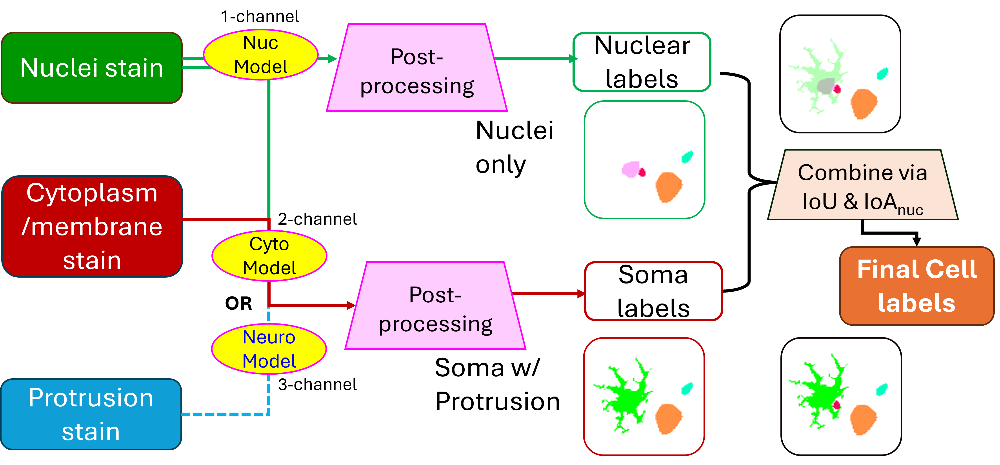

# Introduction 

Cell segmentation is a foundational step in spatial omics analysis. Inaccurate boundaries can lead to the misassignment of transcripts or proteins, ultimately distorting cellular profiles and downstream interpretations. To address this, we developed a robust image-based segmentation pipeline that leverages deep learning to generate accurate and biologically meaningful cell masks across a wide range of tissue types and imaging conditions.

In this post, we introduce our full segmentation pipeline and describe the three custom-trained models that power it. These models improve segmentation fidelity by tailoring input channels, training data composition, and post-processing workflows to specific biological challenges.

Like other items in our [CosMx Analysis Scratch Space](https://nanostring-biostats.github.io/CosMx-Analysis-Scratch-Space/about.html){target="_blank"},
the usual [caveats](https://nanostring-biostats.github.io/CosMx-Analysis-Scratch-Space/about.html){target="_blank"} and [license](https://nanostring-biostats.github.io/CosMx-Analysis-Scratch-Space/license.html){target="_blank"} applies.

You can cite this post as electronic materials in various formats shown below. 
```{r setup, include=FALSE}
title <- "Advancing cell segmentation in spatial omics: new models for diverse morphologies"
date <- "2025-07-16"
url <- "https://nanostring-biostats.github.io/CosMx-Analysis-Scratch-Space/posts/image-segmentation-models/"

# Individual author names
author1 <- "Lidan Wu"
author2 <- "Aster Wardhani"
author3 <- "Joseph-Tin Phan"

# citation style author entries
authors_apa <- paste(
  paste0(strsplit(author1, " ")[[1]][2], ", ", substr(author1, 1, 1), "."),
  paste0(strsplit(author2, " ")[[1]][2], ", ", substr(author2, 1, 1), "."),
  paste0("& ", strsplit(author3, " ")[[1]][2], ", ", substr(author3, 1, 1), "."),
  sep = ", "
)

authors_mla <- paste0(
  strsplit(author1, " ")[[1]][2], ", ", strsplit(author1, " ")[[1]][1], ", ", 
  author2, ", and ", author3)

authors_bib <- paste(author1, author2, author3, sep = " and ")
```
::: {.panel-tabset}
### APA

```{r, echo=FALSE, results='asis'}
cat(paste0(authors_apa, " (", format(as.Date(date), "%Y"), "). ", title, ". Retrieved from ", url))
```

### MLA

```{r, echo=FALSE, results='asis'}
cat(paste0(authors_mla, ". ", title, ". ", format(as.Date(date), "%d %b %Y"), ", ", url))
```

### BibTeX

```{r, echo=FALSE, results='asis'}
cat("<pre><code>")
cat(paste0(
  "@misc{Wu2025CosMxCellSeg\n",
  "  title = {", title, "},\n",
  "  author = {", authors_bib, "},\n",
  "  year = {", format(as.Date(date), "%Y"), "},\n",
  "  url = {", url, "},\n",
  "  note = {Accessed: ", Sys.Date(), "}\n",
  "}"
))
cat("</code></pre>")
```

### RIS

```{r, echo=FALSE, results='asis'}
cat("<pre><code>")
cat(paste0(
"TY  - ELEC\n",
"TI  - ", title, "\n",
"AU  - ", author1, "\n",
"AU  - ", author2, "\n",
"AU  - ", author3, "\n",
"PY  - ", format(as.Date(date), "%Y"), "\n",
"UR  - ", url, "\n",
"ER  -"
))
cat("</code></pre>")
```

### EndNote
```{r, echo=FALSE, results='asis'}
cat("<pre><code>")
cat(paste0(
"%0 Electronic Article\n",
"%T ", title, "\n",
"%A ", author1, "\n",
"%A ", author2, "\n",
"%A ", author3, "\n",
"%D ", format(as.Date(date), "%Y"), "\n",
"%U ", url
))
cat("</code></pre>")
```
:::

# Compartment-Aware Segmentation Pipeline

Our pipeline integrates two complementary segmentation models to produce both **cell-level** and **subcellular** compartment labels for each sample:

1. A **nuclear segmentation model** detects nuclei with high precision.
2. A **whole-cell segmentation model**, which is either a generic **cyto model** or a specific **neural model**, depending on tissue context, identifies the full cell boundaries including cytoplasmic regions.
3. These two masks are then **reconciled and merged** to assign:
   - A unique cell ID to each detected cell
   - Labels for subcellular compartments (nucleus vs. cytoplasm)

This two-model architecture ensures redundancy and resilience: when one compartment is weakly stained or difficult to model, the other can often compensate. The resulting merged masks are more complete and biologically accurate, especially for complex tissues such as brain.

{#fig-seg-pipeline}


# Segmentation Models

All three models in our pipeline are based on the Cellpose-style architecture [@stringer2021cellpose], a widely adopted framework for generalist cell segmentation using spatial gradient flows and vector fields. Following the approach described in Cellpose 2.0 [@pachitariu2022cellpose], we trained separate models from scratch to specialize in nuclear, generic, and neural segmentation, respectively. The training datasets and input configurations were tailored to each segmentation task.

## Nuclear Segmentation Model

Designed to work across many tissue types, this model takes a **single-channel nuclear stain** (e.g., DAPI, Histone stain) as input. It prioritizes accuracy in nucleus identification, even in densely packed or noisy imaging conditions. This model forms the backbone for subcellular compartment labeling.

## Generic Segmentation Model

This model segments complete cell boundaries using **two imaging channels**: a required channel for general cytoplasmic or membrane staining, and an optional channel for nuclear staining. It is optimized for tissues with relatively uniform morphology and minimal extended protrusions, such as non-neural samples.

## Neural Segmentation Model

To address the unique challenges of brain tissue, including highly irregular cell shapes, long processes, and closely apposed glial and neuronal cells, we developed a neural-specific model that uses **three channels**: nuclear, neuronal, and glial stains. This model more accurately segments astrocytes, neurons with elongated axons, and densely packed cerebellum regions.

{#fig-3ch-model}


# Diverse and Context-Relevant Training Datasets

To ensure the segmentation models perform robustly on the types of tissues most relevant to spatial omics, we curated a large and diverse set of training data. A cornerstone of our approach was the generation of high-quality ground-truth annotations from CosMx<sup>&#174;</sup> immunofluorescence images, covering a wide range of FFPE and fresh frozen tissue samples. These internal datasets include various tissue types and staining conditions, and are tailored to the real-world complexities encountered in spatial transcriptomic assays. They were essential in enabling the models to achieve high accuracy on primary tissue samples, which are the central use case for spatial omics.

To complement these internal datasets and further expand morphological and technical diversity, we incorporated a variety of publicly available datasets ([Appendix](#appendix-public-datasets)) that span:

- Sample types: including 2D cell cultures, organoids, and whole-organism samples

- Cell types and disease contexts: such as neurons, immune cells, and tumor cells

- Imaging modalities: beyond immunofluorescence, including H&E, brightfield, and differential interference contrast (DIC) imaging

This hybrid training strategy, anchored in spatial omics–specific imaging and augmented by public data, ensures that the models generalize well across tissue types, imaging conditions, and biological contexts.

![Composition of training datasets used for model development. (A–C) Sunburst charts summarize the distribution of sample sources, image modalities, and staining types used to train the nuclear segmentation model (A), generic cytoplasm segmentation model (B), and neural segmentation model (C). Data were drawn from both internal CosMx assays and diverse public sources. (D) Representative immunofluorescence images from the neural training dataset highlight the complexity of brain tissue morphology, including neurons and glia labeled with various markers.](figures/Fig3-bsb-trainData.png){#fig-trainData}


# The Impact of Training Dataset Composition on Segmentation Performance

Beyond architecture and stain configuration, the composition of training data had a profound effect on segmentation outcomes, particularly for complex tissues like brain. We explored this by training multiple versions of each model type (nuclear, generic whole-cell, and neural), using datasets that varied in their coverage of morphology, staining quality, and tissue types.

For each model type, we compared:

* A **maximally large dataset** (`Model #1`), including all available training images regardless of cell type balance.
* One or more **intermediate models** (`Model #2`).
* A **balanced dataset model** (`Model #3` for generic whole-cell and neural; `Model #2` for nuclei), where we carefully selected training samples to represent a diverse spectrum of cell morphologies and tissue structures.

As shown in @fig-composition-impact, masks predicted by the different models on neural tissue vary considerably in structure and completeness. Pre-trained models like `Cyto2` often undersegment neurons or fail to recover glial processes. In contrast, the morphology-balanced models produced more realistic masks, retaining fine structures and reducing erroneous fusions.

{#fig-composition-impact}

To quantify these differences, we measured sensitivity and precision across a range of IoU (Intersection over Union) thresholds for each model on held-out validation datasets, as shown in @fig-performance-curves. The morphology-balanced models consistently outperformed others across all segmentation types: nuclei, generic cytoplasm, and neural.

* In nuclear segmentation (Panel A), `NucModel#2` (balanced) outperformed both the pretrained models (`nuclei`, `CP`, `Cyto2` and `Cyto3`) and `NucModel#1` (large, unbalanced set).
* In generic cytoplasm segmentation (Panel B), `CytoModel#3` (balanced) showed the best trade-off between sensitivity and precision.
* In neural segmentation (Panel C), `NeuModel#3` demonstrated the clearest performance gain, accurately detecting both large neuronal bodies and thin astrocytic projections (@fig-composition-impact).

These results highlight that **more data is not always better**—especially when morphological diversity is limited. Carefully curating a balanced training set allows models to generalize more robustly, particularly on tissue samples with heterogeneous or complex cellular structures.

![Quantitative performance of segmentation models across IoU thresholds. (A) Nuclear segmentation models. (B) Generic whole-cell segmentation models. (C) Neural segmentation models. Each curve shows sensitivity or precision on held-out test sets. Morphology-balanced models (Model #2 or #3) consistently outperform both pretrained baselines [@stringer2021cellpose; @pachitariu2022cellpose; @stringer2025cellpose] and unbalanced large-set models. ](figures/Fig5-performance-curves.png){#fig-performance-curves}


# Post-Processing for High-Fidelity Cell Recovery

While Cellpose-style models output rich information, including cell probability maps and spatial gradient flows, these predictions must be converted into discrete cell masks for downstream use. The standard Cellpose post-processing pipeline performs this by applying a gradient tracking algorithm. This method first thresholds the cell probability map to define a foreground region. Then, it uses the magnitude and direction of the predicted flow vectors (horizontal and vertical) to trace each pixel along a path toward a “basin” point, interpreted as the cell’s centroid. Pixels with similar destinations are grouped into the same cell.

However, this method breaks down under biologically realistic conditions. Elongated cells (e.g., neurons with long processes) may have centroids that fall outside their actual boundaries, resulting in flow divergence near the edges and causing the mask to fragment. Similarly, large or highly textured cells can generate noisy or irregular flow fields, leading to mask splitting or partial segmentation. These errors persist even when adjusting thresholds on cell probability or flow magnitudes. 

This challenge is clearly illustrated in @fig-gradient-tracking A, where raw model outputs for a neural tissue sample exhibit ambigous "basin" points. Attempts to tune cutoffs (@fig-gradient-tracking B) fail to reliably recover full cell structures, either missing elongated cells or oversegmenting compact ones.

{#fig-gradient-tracking}


To overcome these limitations, we developed a high-recovery post-processing pipeline (@fig-mask-recovery A) that supplements the default gradient tracking with two additional strategies:

1. Initial mask generation preserves the default method’s confident segmentations (Component **a**).
2. Missed cells are recovered by applying auto-thresholding on the residual cell probability and gradient magnitude maps (Component  **b**).
3. Remaining foreground pixels are assigned to nearby cells using distance-based reassignment or neighbor-consistent flow propagation, resulting in a complete, coherent mask set (Component  **c**).

This hybrid strategy improves mask continuity, structural integrity, and cell recovery, especially in densely packed or morphologically complex tissues like brain.

As shown in @fig-mask-recovery B, the resulting masks successfully capture a diverse range of cell types, including large neurons, thin astrocytic processes, and small glia, while minimizing fragmentation and oversegmentation.

{#fig-mask-recovery}


# Integration into the CosMx Platform

The newly developed segmentation models and high-recovery post-processing pipeline have been fully integrated into the CosMx<sup>&#174;</sup> Spatial Molecular Imager platform to support robust and biologically meaningful cell segmentation across a wide range of samples.

These capabilities are now available through two complementary systems:

* **Control Center 2.0 or higher**: Enables on-instrument execution of the new segmentation pipeline during CosMx image processing runs, ensuring consistency and improved performance at the point of acquisition.
* **AtoMx<sup>&#174;</sup> Spatial Informatics Portal (SIP) version 2.0 or higher**: Supports cloud-based analysis workflows that utilize the new models and pipeline for segmentation across large cohorts and multiple users.

For researchers who wish to customize segmentation to suit specific experimental contexts, AtoMx SIP provides a resegmentation toolkit via an interactive UI. This tool allows users to:

* Choose which trained model to apply for nuclear and whole-cell (Cyto) segmentation steps.
* Specify which morphology channels are used as input for each model.
* Re-segment images on demand with customized configurations for tissue type and staining patterns.

More details can be found in the [CosMx SMI Data Analysis User Manual (AtoMx v2.0)](https://university.nanostring.com/cosmx-smi-data-analysis-user-manual){target="_blank"}, available through [NanoU](https://university.nanostring.com/){target="_blank"}.


# Conclusion

Through this work, we’ve shown that better segmentation isn’t just about building a bigger model—it’s about using the right data, asking the right questions, and designing each step of the pipeline with the biology in mind. By training three specialized models for nuclear, generic whole-cell and neural segmentation, and building a smarter post-processing method to handle complex cell shapes, we’ve significantly improved how well we can detect and define cells in spatial omics data.

What we learned goes beyond just this application. A few key takeaways stood out:

* Balanced, diverse training data matters more than sheer volume, especially when working with real tissue.
* Flow-based models need thoughtful post-processing, particularly when cells are irregular or overlapping.
* A flexible, modular approach makes it easier to adapt segmentation tools across different tissue types and experiments.

These lessons can apply to many other segmentation problems. And with these improvements now available in CosMx and AtoMx, we’re excited to see how researchers can push their spatial analysis even further.


---
# Appendix {#appendix-public-datasets}

Public datasets associated with model training include:

- Deepflash2 neurons [@matthias_griebel_2023_7653312]
- Neural nuclei segmentation (S-BSST265) [@SabineTaschner-Mandl2020]
- AMSActa Fluorescent Neuronal Cells [@amsacta7347]
- BBBC collections: 007, 009, 030, 034, 038, 039 [@jones2005bbbc007; @wiegandbbbc009; @koos2016bbbc030; @thirstrup2018bbbc034; @caicedo2019bbbc038; @caicedo2019bbbc039]
- Neuroblastoma images from the Cell Image Library [@yu2013ccdb6843]


