# Introduction 

With spatially-resolved transcriptomics (SRT) data, a number of factors can contribute to challenges in a cell typing analysis and hinder our ability to visualize our favorite marker genes. For example, these factors may include lower sensitivity compared to scRNAseq data, background due to autoflourescence, and segmentation error.
This post demonstrates a cell typing method designed to make it easy to enforce prior biological assumptions about the marker genes and expression profiles we expect to see, while being robust to platform or batch effects that may otherwise challenge the transfer of those assumptions from pre-trained models or reference datasets.  

We'll use a 6k-plex colon cancer dataset to work through two common cell typing scenarios in which we envision this methodology can be useful:

1. Subclustering an existing set of cell types
  * In this first case, we'll assume we've already done some basic clustering, but don't quite have the level of cell type granularity we'd like.  We'll take a 'T cell' cluster and sub-classify those cells into CD8-T, CD4-T, and T-reg cell categories.

2. Top down hierarchical cell typing with focus on immune cells:
  * Here we'll start from scratch; first assigning cells into major categories and identifying immune cells, then classifying those immune cells into various sub classifications of myeloid and lymphocyte cell types.

To set the stage, we can describe the basic framework we'll use for both scenarios in a few basic steps (we'll describe each of these steps in more detail throughout our examples.)

1. First, for each cell type, we define a set of genes we expect may be 'marker genes' or highly expressed based on prior data or biology (either the literature, a reference dataset, or some combination of both).
2. Next, we construct metagene scores from our data for each cell type based on the genes specified in (1).
3. Finally, we model the metagene scores, where the model estimates a posterior probability that each cell belongs to any of the possible cell types.

Let's start by taking an initial look at our data, then walk through some cell typing scenarios.
The tools we discuss throughout this post are available in the R package [XX](link)

# Initial look at our dataset

First, we can load in our data and take a look at some unsupervised leiden clustering we've already performed.

```{r load_libraries, message=FALSE, eval = TRUE}
library(ggplot2)
library(ggrepel)
library(RColorBrewer)
library(data.table)
devtools::load_all("~/data/dan/imputation_smoothing/smiSmooth")
```
```{r , message=FALSE, eval = FALSE}
sem <- readRDS("colon_seurat.rds")
normed <- smiSmooth::totalcount_norm(Matrix::t(sem[["RNA"]]@counts))
sem <- Seurat::SetAssayData(sem, layer = "data", new.data = Matrix::t(normed))
```

#### Spatial plot of initial clusters

Here's a spatial plot of our leiden clusters.  At first glance, we see that some of these unsupervised clusters (i.e., 3, 0, 1, 2, and 7 for example) have distinct spatial patterns; it definitely looks like some meaningful biological structure in these tissue were captured by unsupervised clustering.  

```{r,eval=FALSE}
#| code-fold: true

sem@meta.data$portion <- "part_a"
sem@meta.data$portion[sem@meta.data$fov %in% 60:73] <- "part_b"
xyplist <- 
lapply(split(data.table(sem@meta.data), by = "portion"), function(xx){
  smiSmooth::xyplot("clusters_unsup", metadata = xx,ptsize = 0.1) + coord_fixed()
})
xypl <- 
cowplot::plot_grid(plotlist=xyplist, nrow=1) + 
theme(plot.background = element_rect(fill = 'white',color='white')) + 
  cowplot::panel_border(remove=TRUE) 
print(xypl)

```

<div class="wider-image">
  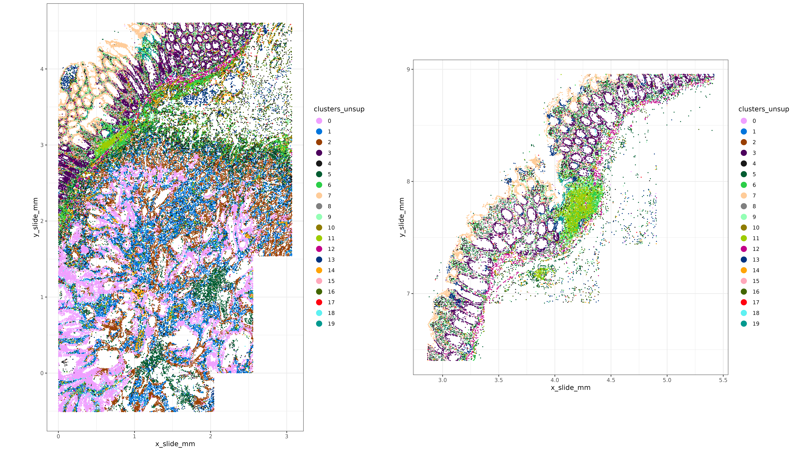
</div>

```{r}
#| eval: false
#| echo: false
#| fig.show: "hold"
#| out-width: "6000px"


```

#### Heatmap of initial clusters

We can make a marker gene heatmap to identify some of the top marker genes for each cluster and see if we recognize any of the celltypes represented by the unsupervised clusters.
Here we can use a couple of convenience functions provided in the R package XX.

```{r, eval=FALSE}
#| code-fold: true

fctbl_unsup <- 
smiSmooth::clusterwise_foldchange_metrics(normed  = sem[["RNA"]]@data
                                          ,metadata = sem@meta.data
                                          ,clustercol = "clusters_unsup"
                                          )

hm_unsup <- smiSmooth::marker_heatmap(fctbl_unsup
                           ,extras = c("CD3D", "CD4", "FOXP3"
                                       , "CD8B", "CD8A")
                           )
print(hm_unsup)

```


<div class="wider-image">
  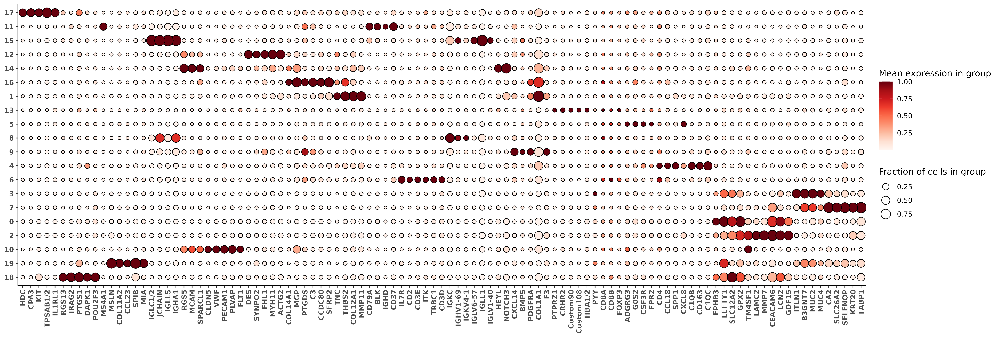
</div>


```{r}
#| eval: false
#| echo: false
#| fig.show: "hold"
#| out-width: "6000px"


```
Let's suppose for sake of demonstration that I recognize (and am comfortable enough) to label these clusters with cell type names based on the marker genes shown in the heatmap.  

However, there are one or a few of my immune clusters I've identified where I desire more granularity.
In this case, I'm particularly interested in my T cells; in the bottom-left hand corner of the heatmap plot above, I see that 'cluster 6' is capturing T-cells, showing enrichment in some key marker genes like CD3 (CD3D, CD3E) as well as other markers like CD2, IL7R, and ITK.

I'd like to split these cells further into at least a few meaningful T-cell subtypes, at minimum: "CD8+", "CD4+", and "Treg". 

# Example case 1: Subclustering T cells {#ex1}

## TL;DR 'just the code' {#tldr}

Here's the code for classifying leiden cluster '6' into `cd8t`, `cd4t`, and `treg` cell types using the R package XXX.

```{r, eval=TRUE}
### List of genes used to estimate a celltype-metagene score for each cell
data("markerslist_tcellmajor")
str(markerslist_tcellmajor)
```

```{r, eval=FALSE}
### these are cells I want to subcluster
tcell_ids <- sem@meta.data[sem@meta.data$clusters_unsup==6,"cell_ID"]

### Fit the metagene score, using the counts matrix and a 
### neighborhood 'adjacency' matrix indicating cells with similar expression profiles
metagenes_t <- 
  smiSmooth::fit_metagene_scores(
    markerslist = markerslist_tcellmajor
    ,counts_matrix = Matrix::t(sem[["RNA"]]@counts[,tcell_ids])
    ,adjacency_matrix = as(sem@graphs$umapgrph
                           ,"CsparseMatrix")[tcell_ids,tcell_ids]
  )

### Fit a model clustering these metagene scores and 
### predicting posterior probabilities each cell belongs 
### to 'cd8t', 'cd4t', or 'treg'
model_t <- 
smiSmooth::cluster_metagenes(metagenes = metagenes_t)

```

```{r}
#| eval: true
#| echo: false
 
metagenes_t <- readRDS("./figures/metagenes_t.rds")
model_t <- readRDS("./figures/model_t.rds")
model_t$post_probs[,celltype:=NULL]

```

The data table `post_probs` in our model object `model_t` gives the cell typing result; showing a posterior probability that each of our cells belongs to either `cd8t`, `cd4t`, or `treg` categories, along with a 'best_class' label dependending on which of these scores is highest for each cell.

```{r}
model_t$post_probs[1:10][]
```

Now lets take a closer look at the details and describe the methodology for each step.

## Detailed walkthrough
###  Part 1: Specifying genes associated with my cell types based on prior biology

Creating a marker list, by specifying genes I expect **might** be associated with my cell types is the first step of this algorithm.
For each of my cell types, `cd4t`, `cd8t`, and `treg`, I specify 

* a primary marker or "index gene"  
* a set of other marker genes which I expect could be expressed as "predictors"

In this case, we'll use CD4, CD8B, and FOXP3 as "index genes" for `cd4t`, `cd8t`, and `treg` respectively.
The other genes we'll specify as predictors are based on the literature.  For example, IL2RA is often associated with Treg cells, so we include it as a predictor here.

It's okay to include markers in multiple cell types if that fits our mental model.
For example, `treg` cells are actually a subcategory of `cd4t`, so I've included 'CD4' as a predictor for `treg` and also as the index gene for `cd4t`.  Similarly, 'CCR7' is used as a predictor in both `cd8t` and `cd4t` cell types, and 'CXCR3' is used as a predictor for all three cell types.

We can create our marker list manually like this:
```{r, eval=TRUE}
tcell_markerslist <- 
smiSmooth::make_markerslist(index_marker = list(cd4t = "CD4"
                                                ,cd8t = "CD8B"
                                                ,treg = "FOXP3"
                                                )
                            ,predictors = list(
                              cd4t = c('CD4','CD40LG','IL2','CCR7','CXCR3','CXCR4','SELL'
                                       ,'IL7R','CD28','STAT5B','STAT3','IKZF1','GATA3'
                                       ,'RUNX3','FOXP1')
                              ,cd8t = c('CD8A','CD8B','PRF1','GZMB','GZMA','GZMH','GNLY'
                                        ,'IFNG','CCR7','SELL','CD44'
                                        ,'LAG3','KLRD1','CXCR3','ITGA1','RUNX3')
                              ,treg =c('FOXP3','IL2RA','CTLA4','TIGIT','LAG3','IKZF2'
                                       ,'CCR4','CCL22','CD44','IL10','TGFB1','PDCD1'
                                       ,'BATF','STAT3','STAT1','CD274','PDCD1LG2'
                                       ,'EOMES','CXCR3','CXCR5','BCL6','HLA-DRA'
                                       ,'IRF4','TOX','SELL','CD69','ITGAE','KLRG1'
                                       ,'CD38','TNFRSF9','TNFRSF18','LRRC32','ICOS'
                                       ,'IL1R2','IL10RA','CCR6','AHR','NRP1','MKI67'
                                       ,'FAS','ENTPD1','TNFRSF25','ADORA2A','CD4' 
                              )
                            )
                            ,use_offclass_markers_as_negative_predictors = TRUE
                            )
```


The object created looks like this below

```{r, eval=TRUE}
str(tcell_markerslist)
```

In practice, we can save and reuse our marker lists for different cell types.
While it should be easy to create/modify a custom list from the literature,  this particular list is included as a package dataset `markerslist_tcellmajor` to facilitate ease of use.  

```{r}
data("markerslist_tcellmajor")
str(markerslist_tcellmajor)
```


### Part 2: Estimating a metagene score for each cell type

In this next step, we fit a model for each cell type, using the primary index marker as the response variable and covariates derived from the predictor genes.  

We fit our models for each cell type class using the `fit_metagene_scores` function.
This function uses 'smoothing', as well as our prior biology / assumptions about which markers are associated with each celltype to predict the pearson residuals of the index gene.

The default regression model setup looks like this:
$$Y = WY\eta  + WX\beta + X\gamma + \epsilon $$
where

* $Y:=$ pearson residuals of the index marker (our response variable)
* $X:=$ (totalcount-normalized) matrix of predictor genes
* $W:=$ a cells $\times$ cells neighborhood matrix, denoting cells with similar expression profiles. 
* $\eta$, $\beta$, and $\gamma$ are the regression coefficients associated with the 'neighbor-averaged' index gene, 'neighbor-averaged' predictor genes, and predictor genes within the cell respectively. 

One way to think about this model specification could be as an implementation of a 'smoothing model', which leverages information across multiple dimensions:

* the index gene in similar cells ($WY$) 
* other expected marker genes (our predictor genes $X$)
* other marker genes in similar cells ($WX$)

We use a non-negative least squares [@nnlsref] (NNLS) regression to estimate our models.  The NNLS model enforces that all of the covariates based on predictor genes we specified must have positive regression coefficients (in practice we'll observe that a number of regression coefficients may shrink to zero).


By specifying `use_offclass_markers_as_negative_predictors = TRUE` in the section above, we further assume that predictors for *other celltypes* that we haven't listed can be used as *negative* predictors of our index gene.
For example, genes like like "GZMA" and "GZMB", which are markers associated with `cd8t`, will be assumed to be *negative* predictors of the other classes (`cd4t` and `treg`) where they are not listed. 

Estimating this model from the dataset at hand rather than using a reference model could make this framework more robust to platform effects or batch effects compared to pre-trained models or reference profiles which used different technology or data with slightly different biology.

Because the model is only using genes we've specified in our 'markers list', we also have complete control over which genes influence the metagene scores, reducing the chance that noisy or irrelevant genes can have negative impact on our cell type classification. 

Here I call the `fit_metagene_scores` function to estimate these models for cells corresponding to the unsupervised cluster I've identified to be T cells.  
For the cells $\times$ cells `adjacency_matrix`, I've used the nearest neighbor matrix in my Seurat object.  This is the same graph that was used to generate my UMAP and my unsupervised leiden clusters.
After fitting our regression models for each cell type, we'll use the predicted scores as 'metagenes' that can be clustered in the next step.

```{r, eval=FALSE}

tcell_ids <- sem@meta.data[sem@meta.data$clusters_unsup==6,"cell_ID"]
metagenes_t <- 
  fit_metagene_scores(
    markerslist = tcell_markerlist
    ,counts_matrix = Matrix::t(sem[["RNA"]]@counts[,tcell_ids])
    ,adjacency_matrix = as(sem@graphs$umapgrph
                           ,"CsparseMatrix")[tcell_ids,tcell_ids]
  )
```

The `metagenes_t` object we've created has an element for each celltype, including the regression coefficients (`bhat`), and predicted values we'll use for clustering (`yhat`) for each cell and each cell type.

```{r}
str(metagenes_t,max.level = 2)
```


We can get a better understanding of the model output by looking at a few diagnostics plots.  In the below, we plot the regression coefficients for each model, ordering them on the x-axis by their ranking.
For each cell type, the positive $\hat{\beta}$ correspond to genes we specified as predictors, and negative $\hat{\beta}$ were predictors for either of the other two cell types.  
A lot of the covariates which have the largest magnitudes have "*lag.*" in their name indicating they correspond to a smoothed (or neighbor-averaged) covariate for that gene.

For `cd4t`, we see that smoothed CD4 (indicated by '*lag.y*' in the plot) is the strongest predictor of observed 'CD4'.  For `cd8t` and `treg` categories, '*lag.y*' (indicating smoothed CD8B and FOXP3) are also among the strongest predictors, but not first in rank.


```{r, eval=FALSE}

coefplots <- metagene_coefficients_plot(metagenes_t)
coefplots <- lapply(coefplots, function(x){x +   theme(text=element_text(face='bold',size=18))
  }) ## just make the text bigger and bold
cowplot::plot_grid(plotlist = coefplots, nrow = 1)

```

<div class="wider-image">
  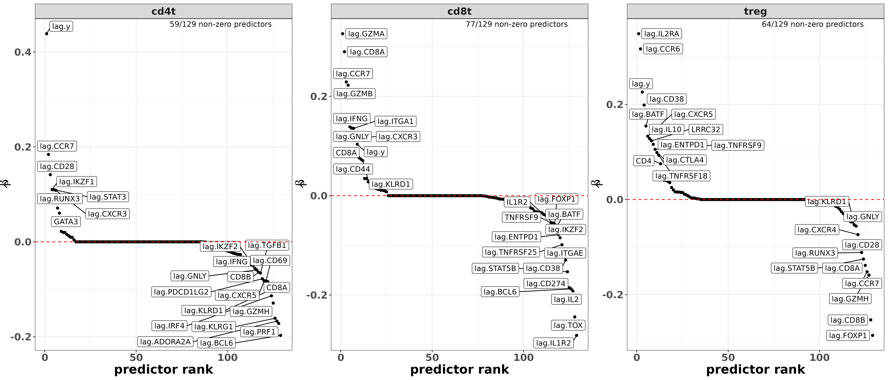
</div>

```{r}
#| eval: false
#| echo: false


```

A pairsplot can show us how well the metagene scores we've created are distinct from each other.  Ideally, if our cell type classes are mutually exclusive, we'd want to not see too many cells which are 'positive' for multiple cell types at the same time.

Here, we see that `cd4t` and `treg` scores are positively correlated.  This isn't too surprising, because T-reg cells are actually a subtype of CD4+ T cells.
`cd8t` is somewhat negatively correlated with both `treg` and `cd4t`, which is good to see.

```{r, eval=FALSE}
metagene_pairsplot(metagenes_t, var= "yhat")
```

```{r}
#| eval: true
#| echo: false

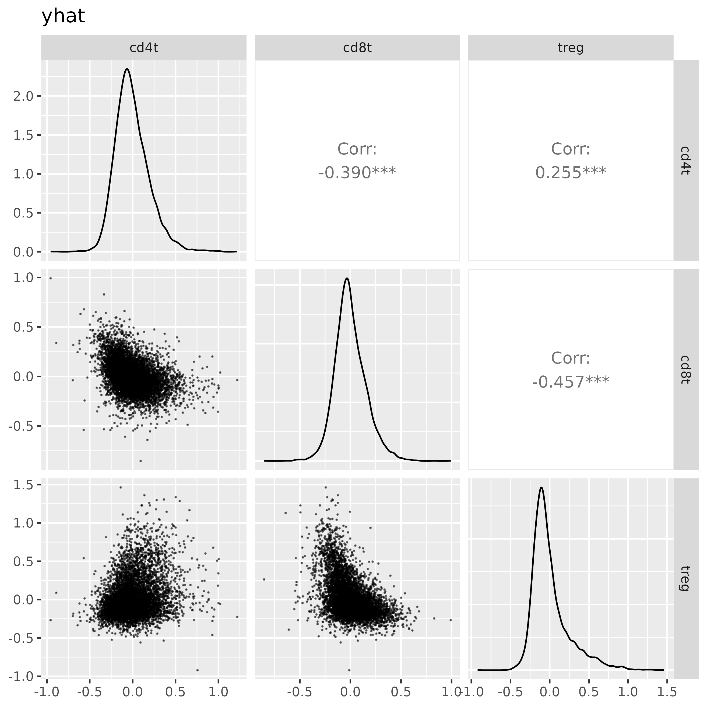
```

### Part 3: Clustering via overfitted gaussian mixture-models 

Finally, we will cluster these scores to infer the T cell types.
The `cluster_metagenes` function we run below estimates a mixture of overfitted multivariate gaussian mixture models [@aragam2020identifiability] to estimate the distribution of metagene scores.

First, we identify all cells with positive metagene scores for a particular cell type. We might loosely interpret these cells as 'anchor cells'.
The data may look like this for example, where here I have subset my original data to cells which have positive scores for my celltype `cd8t`.

```{r}
yh <- make_scores_matrix(metagenes = metagenes_t, "yhat")
yh[yh[,"cd8t"] > 0,][1:10,]

```


Then, a mixture model is fit to these (3-dimensional) scores, by default using 6 components.
The estimates corresponding to the individual mixture models for each cell type are found in the `models` list, with the means (`mu_hat`), covariance matrices (`sigma_hat`), and prior probability (`pihat`) corresponding to each mixture component. 
```{r}
str(model_t$models, max.level = 2)
```
Typically we don't need to interact with this part of the output.  After the mixture models for each cell type are fitted, we can score all cells, and get an overall posterior probability that a cell belongs to any of the three major classes using Bayes rule.

Let $y_c$ be the cell type category for cell $c$, $scores_c$ the corresponding metagene scores, and $t$ denoting a possible cell 'type' or category (for $t = 1,...,T$).

We compute the overall posterior probability that $y_c$ is a particular type $t$, as

$$P(y_c = t | scores_c) = \frac{P(scores_c | y_c = t)P(y_c = t)}{\sum_{l=1}^T P(scores_c | y_c = l)P(y_c = l)}$$

Using the individual mixture models for a particular cell type with $K$ mixture components, we have
$$P(scores_c | y_c = t) = \sum_{j=1}^K P(scores_c | k=j, y_c = t) P(k=j | y_c = t)$$

The prior probability for a particular cell type class $t$ can be estimated by counting the number of cells used to estimate the mixture model in each cell type, and computing a proportion amongst all possible cell type classes, i.e.,
$$P(y_c = t) = \frac{\sum_{c=1}^C I(scores_{c,t} > 0)}{\sum_{l=1}^T \sum_{c=1}^C I(scores_{c,l} > 0)}$$

#### Advanced control: setting preferences for behavior of multi-positive cells

While we expect metagene scores to be **positive** for cells in the corresponding cell type, and lower (in general) for other celltypes, there could be exceptions.  For instance, in this example, we might expect that 
Treg cells have both high `treg` metagene scores AND high `cd4t` scores due to Treg being a subtype of CD4+ T cell.

On the other hand, we might not want to label a cell with the `cd4t` type if it has a high `treg` score (because in that case we'd prefer to call it a `treg`).

The way we implement this in XXX package is through the `discourage_double_positive` argument in  the `cluster_metagenes` function.  Using this argument below, we provide a list of cell types and the corresponding categories in which we want to discourage double positivity.  With the default argument provided below, cells with positive `cd4t` metagene scores are first identified to fit the `cd4t` mixture model.
Then, cells which also have positive posterior-scores for `treg` would be excluded from this training set. 

Ultimately this has the effect of preferentially assigning cells which are positive for both `cd4t` and `treg` to the `treg` cell type class.

These particular settings for `discourage_double_positive` are provided as a default, so the model here is identical to the one we showed in the [previous section](#tldr).

```{r, eval=FALSE}

model_t <- 
smiSmooth::cluster_metagenes(metagenes = metagenes_t
                  ,to_model = "yhat" ## default - use modeled scores for clustering
                  ,discourage_double_positive = list("cd4t" = c("treg")) ## also a provided default.  
#                                                                         ## Discourage assignment of cells to 'cd4t' if they are also high in 'treg'.  
#                                                                         ## Assigning cells to 'treg' which are high in 'cd4t' is **not** discouraged. 
                  )
```


### Examining and validating clustering results

Now we can evaluate the cell typing performance.
In particular, we want to check that the genes we specified as the index marker and predictors are in fact marker genes in the corresponding cell types.

Here we can attach our T-cell annotations back onto our metadata, and remake our marker heatmap.
We see that the primary marker genes have highest expression in the expected cell types.  For example, CD8A and CD8B are highest in `cd8t`, FOXP3 is highest in `treg`, and CD4 is high in both `cd4t` and `treg`.
Several other genes we've chosen to associate with these celltypes based on our `tcell_markerslist` object are also highest in the expected cell type (i.e., CTLA4 in `treg` cells, IL7R in `cd4t`).

```{r,eval=FALSE}

met <- 
merge(data.table(sem@meta.data), model_t$post_probs[,.(cell_ID, celltype, best_score)]
      ,by="cell_ID", all.x=TRUE)
met[is.na(celltype),celltype:=clusters_unsup]

fc_tcell <- 
smiSmooth::clusterwise_foldchange_metrics(normed = sem[["RNA"]]@data
                   ,metadata = met
                   ,clustercol = "celltype"
                   )

hm_tcell <- smiSmooth::marker_heatmap(fc_tcell
                           ,extras = c("CD3D", "CD4", "FOXP3", "CD8A", "CD8B", "GNLY", "GZMA", "IL2RA", "CTLA4", "TIGIT")
                          )

```

<div class="wider-image">
  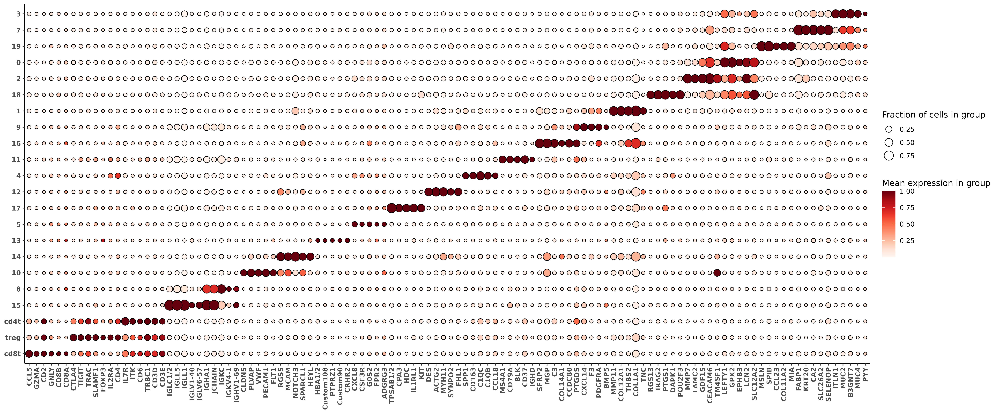
</div>
```{r}
#| eval: false
#| echo: false


```


Treating the 'posterior probability' as a confidence that the cell belongs to the corresponding cluster, we can show that 
the proportion of cells that express the expected marker genes generally increases with higher confidence.
In the plot below, for example, marker genes GZMA, GNLY, CD8B, CD8A (`cd8t` predictors) increase in `cd8t` cells with higher posterior probability.
Marker genes TIGIT, CTLA4, IL2RA, and FOXP3 (`treg` predictors) also increase in `treg` cells with higher posterior probability.  
IL7R and FOXP1 are highest in `cd4t` cells.  CD4 is higher `treg` compared to `cd4t`, which is probably okay because we expect both types to be CD4+.  Both `cd4t` and `treg` have higher observed CD4 relative to `cd8t` class.

```{r,eval=FALSE}
p <- 
marker_threshold_plot(normed = sem[["RNA"]]@data
                      ,metadata = met
                      ,clusters = c("cd8t","cd4t", "treg")
                      ,markers = c("CD3D", "CD4", "CCR7","FOXP1", "IL7R", "FOXP3",  "IL2RA", "CTLA4", "TIGIT","CD8A", "CD8B", "GNLY", "GZMA","CCL5")
                      ,cluster_order = c("cd8t", "treg", "cd4t")
                      ,thresholds = c(0.5, 0.7, 0.8, 0.9,0.95, 0.99, 0.995)
                      ,score_column = "best_score"
                      )

p <- p + theme(text=element_text(size=14,face='bold')) + 
  labs(title = "Proportion of cells expressing marker gene increases with \nposterior probability confidence scores")
print(p)

```

<div class="wider-image">
  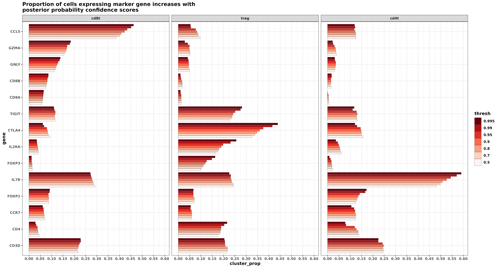
</div>

```{r}
#| eval: false
#| echo: false


```

Here's another look at the pairsplot for our metagene scores,this time coloring the cells based on their classification.  
```{r, eval=FALSE}
metagene_pairsplot(metagenes_t, "yhat", obs = model_t$post_probs[,.(cell_ID, best_class)], colorvar = "best_class")


```

<div class="wider-image">
  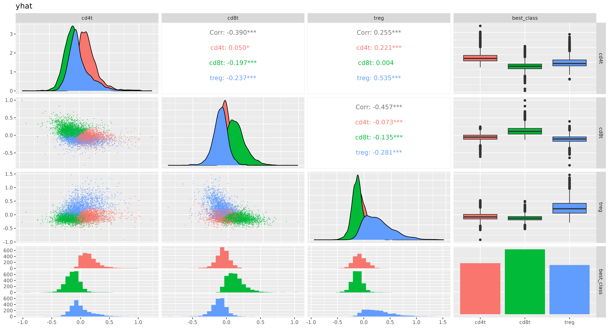
</div>

```{r}
#| eval: false
#| echo: false


```


# Example 2:  Hierarchical cell typing {#ex2}

For the second example, we wish to ignore the unsupervised clustering and infer all cell types based entirely on the framework motivated here.

Using the full dataset, we'll first infer amongst 5 major cell type categories [`immune`, `epithelial`, `endothelial`, `fibroblast`, `plasma`] in a similar fashion as described in our first example.  Then, we'll infer subtypes of the immune cell labels with categories including [`tcell`,`bcell`,`macrophage`,`neutrophil`,`mast`,`monocyte`,`cDC`,`pDC`].


## TL;DR 'just the code' {#tldr2}

Here's the code to produce the final set of cell types.
The next section will cover the details and discuss a few choices that were made.

```{r}
#| eval: true
#| echo: false
 
metagenes_l1 <- readRDS("./figures/metagenes_l1.rds")
metagenes_l2 <- readRDS("./figures/metagenes_l2.rds")
model_l1_unrestricted <- readRDS("./figures/model_l1_unrestricted.rds")
model_l1 <- readRDS("./figures/model_l1.rds")
model_l2 <- readRDS("./figures/model_l2_v1.rds")
model_l2_v2 <- readRDS("./figures/model_l2_v2.rds")

```

```{r,eval=FALSE}

### Level-1
data("markerslist_l1io")
metagenes_l1 <-  
fit_metagene_scores(markerslist_l1io
                    ,counts_matrix =  Matrix::t(sem[["RNA"]]@counts)
                    ,adjacency_matrix = as(sem@graphs$umapgrph, "CsparseMatrix")
)

model_l1 <- 
  cluster_metagenes(metagenes = metagenes_l1
                    ,to_model = "yhat"
                    ,discourage_double_positive = 
                      list("endothelial" = "immune" ### don't estimate components for 
                           ,"epithelial" = "immune" ### epithelial / endothelial / plasma / fibroblast 
                           ,"fibroblast" = "immune" ### using cells which have positive metagene scores for 'immune'  
                           ,"plasma" = c("immune", "fibroblast", "endothelial", "epithelial"))
  )

### Level 2
data("markerslist_l2immune")
metagenes_l2 <- 
  fit_metagene_scores(markerslist_l2immune
                      ,counts_matrix =  Matrix::t(sem[["RNA"]]@counts)
                      ,adjacency_matrix = as(sem@graphs$umapgrph, "CsparseMatrix")
                      ,prior_level_weights = model_l1$post_probs$immune ## weight by probability a cell is an immune cell
  )

model_l2_v2 <- 
  cluster_metagenes(metagenes = metagenes_l2
                    ,to_model = "yhat"
                    ,prior_prob_level = model_l1$post_probs$immune ## weight by probability cell is immune cell based on previous model
                    ,discourage_double_positive = list("mast" = c("tcell"))
  )


```

```{r}
### Final classifications, combining L1 and L2 cell types
probs <- merge(model_l1$post_probs, model_l2_v2$post_probs, suffixes=c("_l1", "_l2"), by = "cell_ID")
probs[,`:=`(celltype=best_class_l2, best_score=best_score_l2)]
probs[best_score_l2 < 0.5,`:=`(celltype=best_class_l1, best_score=best_score_l1)]
probs[best_class_l1 =="immune",`:=`(celltype=best_class_l2, best_score = best_score_l2)]
probs[best_score_l1 < 0.5,celltype:="unknown"]
probs[1:5][] ## peek
```
```{r}
probs[,.N,by=.(celltype)][,prop:=N/sum(N)][order(-N)][] ## proportion of called cells by cell type

```


## Detailed walkthrough

### Level 1: identifying immune cells, and other major celltypes

We'll start with trying to identify major cell types (`endothelial`, `fibroblast`, `plasma`, `immune`, `epithelial`).
Here we use the markerslist provided in the package, giving genes we believe to be associated with our high-level cell type categories.

```{r}
data("markerslist_l1io")
str(markerslist_l1io)
markerslist_l1io$immune$predictors[markerslist_l1io$immune$signs==1] ## immune genes
markerslist_l1io$endothelial$predictors[markerslist_l1io$endothelial$signs==1] ## endothelial genes

```

Fitting the metagene scores requires the same code syntax we used in the [first example](#ex1).
```{r, eval=FALSE}
metagenes_l1 <- 
fit_metagene_scores(markerslist_l1io
                    ,counts_matrix =  Matrix::t(sem[["RNA"]]@counts)
                    ,adjacency_matrix = as(sem@graphs$umapgrph, "CsparseMatrix")
)
```

Here's a few plots showing regression coefficeints for `immune` and and `endothelial` metagene scores.
```{r, eval=FALSE}
coefplots_l1 <- smiSmooth::metagene_coefficients_plot(metagenes_l1)
coefplots_l1 <- lapply(coefplots_l1, function(x){x +   theme(text=element_text(face='bold',size=18))
})
cp_l1 <- cowplot::plot_grid(plotlist = coefplots_l1[c("immune", "endothelial")])
print(cp_l1)

```

<div class="wider-image">
  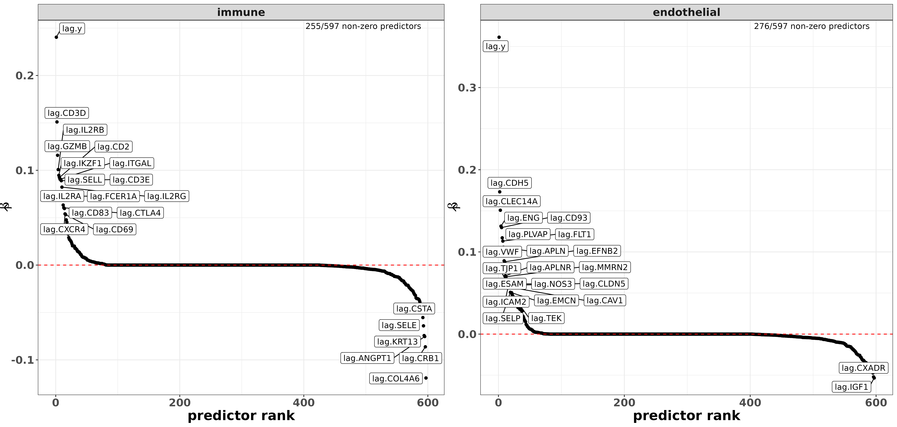
</div>

```{r}
#| eval: false
#| echo: false


```

And here, we can peek at a pairsplot to check whether metagene scores are correlated with each other in a sample of 50k cells.  For the most part, these plots indicate that the major cell type categories here are fairly exclusive.
There are clear examples, however, of cells which have positive metagene scores for multiple cell type classes; we can visually identify examples in the (endothelial,fibroblast), (immune,endothelial),(immune epithelial),  (fibroblast, plasma) and (immune,plasma) panels in particular.


```{r,eval=FALSE}
pairshat_l1 <- metagene_pairsplot(metagenes_l1, "yhat", nsamples = 5*10**4)
print(pairshat_l1)

```

<div class="wider-image">
  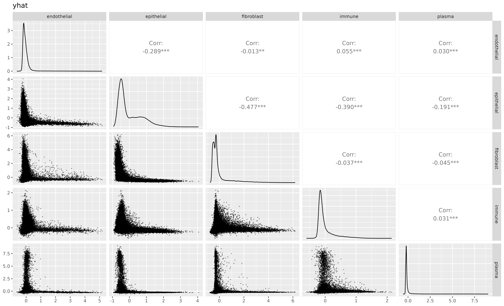
</div>

```{r}
#| eval: false
#| echo: false

  
```

We probably aren't concerned with this yet.
We fit a model like in the [previous example](#ex1), clustering scores into our major cell type categories.
```{r,eval=FALSE}

model_l1_unrestricted <- 
  cluster_metagenes(metagenes = metagenes_l1
                    ,to_model = "yhat"
                    ,discourage_double_positive = list() ## empty: allows double positive cells from other classes to be fit
                                                         ## ,as long as that cells predicted score is positive 
                                                         ## Example: a cell positive scores for both "epithelial" AND "immune" 
                                                         ## would be used to estimate **both** the epithelial distribution and the immune distribution
  )

model_l1_unrestricted$post_probs[,celltype:=best_class]
model_l1_unrestricted$post_probs[best_score < 0.5,celltype:="unknown"]

```

Now, I'll check the marker gene heatmap.  While the marker genes make basic sense, I'm not happy with the some of the some `immune` markers like "HLA-DRB" and "HLA-DRA", which are higher expressed than I'd like to see in `fibroblast`, `endothelial`, and `plasma` categories.  

```{r, eval=FALSE}
#| code-fold: true

fc_l1_unrestricted <- 
  clusterwise_foldchange_metrics(normed = sem[["RNA"]]@data
                     ,metadata = model_l1_unrestricted$post_probs
                     ,clustercol = "best_class"
  )
hm_l1_v1 <- marker_heatmap(fc_l1_unrestricted, extras = c("HLA-DRA", "CD3D", "MS4A1", "HLA-DRB"))
print(hm_l1_v1)

```


<div class="wider-image">
  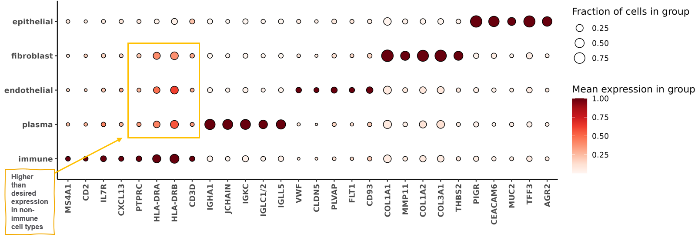
</div>

```{r}
#| eval: false
#| echo: false

  
```

This could be an indication that I've 'lost' some `immune` cells by misclassifying them into other categories.
Another way I can check this behavior is by looking at the pairsplot again, this time colored by the major cell type classifications.

Cells which are positive for both `immune` + another category tend to be classified to the other category.
We suspect that a large percentage of these double positive cells are in fact `immune`. 
Some of the markers for other classes (like immunoglobulin plasma and collagen fibroblast markers) are particularly high expressors that may tend to bleed over cell boundaries, and many of the immune cell related genes are relatively low expressors by comparison.

```{r,eval=FALSE}
#| code-fold: true


pairshat_l1_after_unrestricted <- metagene_pairsplot(metagenes_l1, "yhat"
                                        ,nsamples = 5*10**4
                                       ,obs = model_l1_unrestricted$post_probs[,.(cell_ID, celltype)]
                                       ,colorvar = "celltype"
                                       )

```

<div class="wider-image">
  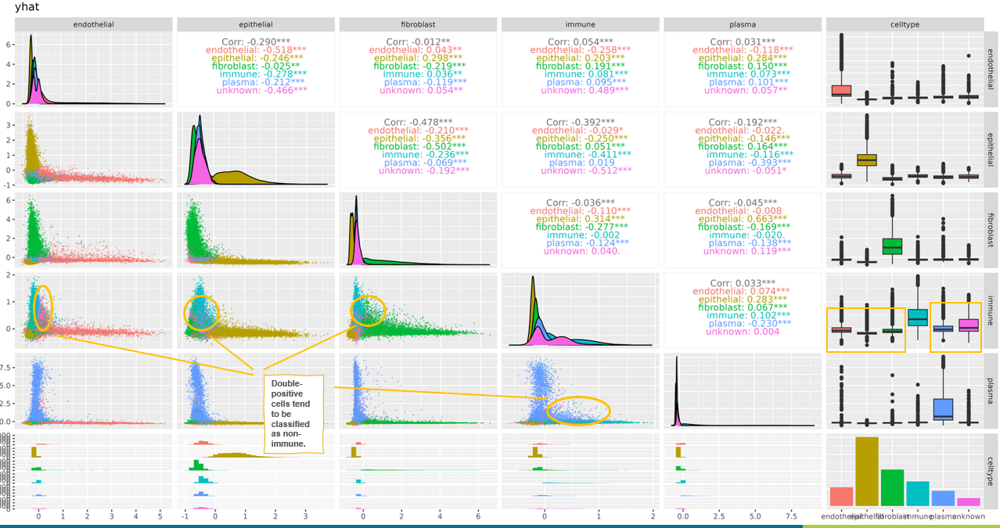
</div>
```{r}
#| eval: false
#| echo: false

  
```

We use the `discourage_double_postive` argument to exclude `immune`-positive cells from the training data for other cell type classes.  This will have the effect of nudging double-positive cells towards the immune category in our model. 

```{r,eval=FALSE}

model_l1 <- 
  cluster_metagenes(metagenes = metagenes_l1
                    ,to_model = "yhat"
                    ,discourage_double_positive = list("endothelial" = "immune" ### don't estimate components for 
                                                       ,"epithelial" = "immune" ### epithelial / endothelial / plasma / fibroblast using cells with positive immune metagene scores
                                                       ,"fibroblast" = "immune" ###  
                                                       ,"plasma" = c("immune", "fibroblast", "endothelial", "epithelial"))
  )
model_l1$post_probs[,celltype:=best_class]
model_l1$post_probs[best_score < 0.5,celltype:="unknown"]

```

We can show that immune cells look objectively better now. The index gene for immune cells, PTPRC (CD45), has gone up in expression for `immune`, and down for all other cell types.  Specificity (measured by fold change) has also increased for `immune`, and decreased for all other cell types.  The number of immune cells we call increases from 17,529 to 25,470.


```{r,eval=FALSE}
#| code-fold: true

comp <- 
rbindlist(list(fc_l1_unrestricted[gene %in% c("PTPRC")][,typ:="unrestricted"]
               ,fc_l1[gene %in% c("PTPRC")][,typ:="discouraged_double_pos"]
))
barplot_prop <- 
ggplot(comp, aes(y= gene, fill = typ, x = cluster_prop)) + 
  geom_bar(stat='identity',position=position_dodge2(width=0.8))  + 
  facet_wrap(~cluster,labeller=label_both) + 
  theme_bw() + 
  theme(text=element_text(face='bold',size=14)) + 
  geom_text(aes(label=paste0("(",scales::comma(ncells),")"), x = cluster_prop + 0.005),position=position_dodge(width=0.8)) + 
  scale_fill_manual(values = brewer.pal(3,"Dark2"), guide=guide_legend(reverse = TRUE)) + 
  labs(x = "Proportion of PTPRC+ cells (# of cells assigned to cluster)"
       ,title="Before vs. After double+ immune scores")


barplot_fc <- 
ggplot(comp, aes(y= gene, fill = typ, x = fold_change)) + 
  geom_bar(stat='identity',position=position_dodge2(width=0.8))  + 
  facet_wrap(~cluster,labeller=label_both) + 
  theme_bw() + 
  theme(text=element_text(face='bold',size=14)) + 
  scale_fill_manual(values = brewer.pal(3,"Dark2"), guide=guide_legend(reverse = TRUE)) + 
  scale_x_continuous(n.breaks=10) + 
  labs(x = "Fold Change for PTPRC")

comp_barplots <- 
cowplot::plot_grid(barplot_prop, barplot_fc, nrow=2) + 
theme(plot.background = element_rect(fill = 'white',color='white')) + 
  cowplot::panel_border(remove=TRUE) 

print(comp_barplots)
```

<div class="wider-image">
  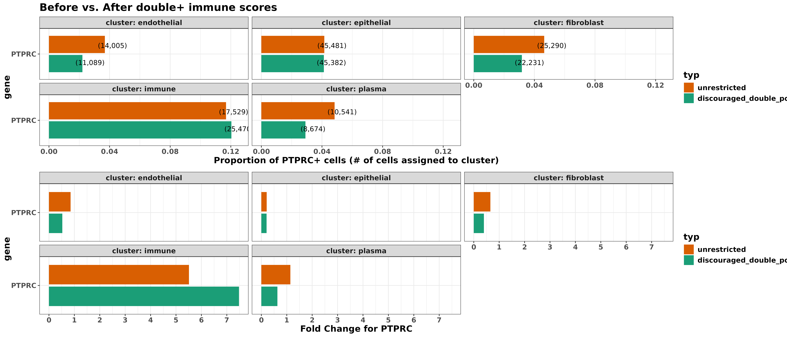
</div>

```{r}
#| eval: false
#| echo: false

  
```
The marker heatmap looks cleaner as well.

```{r,eval=FALSE}
#| code-fold: true


fc_l1 <- 
  clusterwise_foldchange_metrics(normed = sem[["RNA"]]@data
                     ,metadata = model_l1$post_probs
                     ,clustercol = "best_class"
  )
hm_l1_v2 <- marker_heatmap(fc_l1
                           ,featsuse = levels(hm_l1_v1$data$gene)
                           ,geneorder = levels(hm_l1_v1$data$gene)
                           ,orient_diagonal = FALSE
                           )
print(hm_l1_v2)

```

<div class="wider-image">
  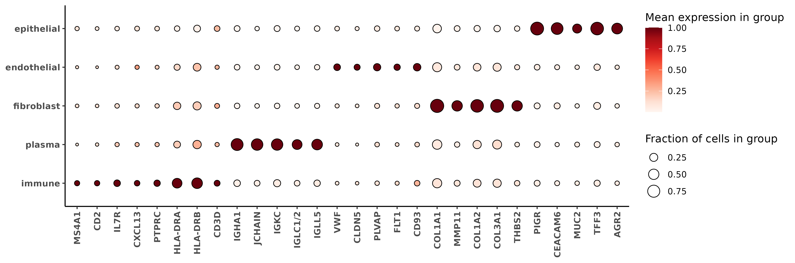
</div>

```{r}
#| eval: false
#| echo: false


```


Remaking the pairsplot, we see many of the cells previously highlighted switch to `immune`.
```{r,eval=FALSE}
#| code-fold: true

pairshat_l1_after <- metagene_pairsplot(metagenes_l1, "yhat"
                                        ,nsamples = 5*10**4
                                       ,obs = model_l1$post_probs[,.(cell_ID, celltype)]
                                       ,colorvar = "celltype"
                                       )


```

<div class="wider-image">
  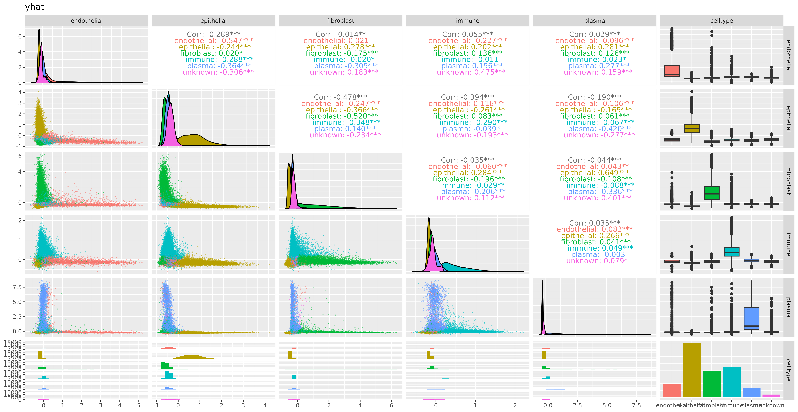
</div>
```{r}
#| eval: false
#| echo: false

  
```


### Level 2: Immune cell classification

Now let's classify our immune cells.  We hope to find some of these cell types: [`tcell`,`bcell`,`macrophage`,`neutrophil`,`mast`,`monocyte`,`cDC`,`pDC`].

The `markerslist_l2immune` dataset follows the previously discussed format with an index gene and predictors for each cell type.

```{r}
data("markerslist_l2immune")
str(markerslist_l2immune)

```

We fit the metagene scores and cluster like before, however this time we can pass in the posterior probability from our as a weight using the `prior_level_weights` argument and `prior_prob_level` arguments.  This allows us to use information from all cells, but account for our uncertainty that they belong to any of the immune cell types we wish to identify.


```{r,eval=FALSE}
metagenes_l2 <- 
  fit_metagene_scores(markerslist_l2immune
                      ,counts_matrix =  Matrix::t(sem[["RNA"]]@counts)
                      ,adjacency_matrix = as(sem@graphs$umapgrph, "CsparseMatrix")
                      ,prior_level_weights = model_l1$post_probs$immune
  )

model_l2 <- 
  cluster_metagenes(metagenes = metagenes_l2
                    ,to_model = "yhat"
                    ,prior_prob_level = model_l1$post_probs$immune
  )


```

The posterior probabilities from `model_l2$post_probs` already account for the probability a cell is '`immune`'.
We can join these data together with our first high-level model, and label cells with low probability for any category as "unknown".  Then we'll take a look at the marker heatmap.  I'm pretty happy with this for the most part; the marker genes in the heatmap line up well with the cell types we assigned them to in `markerslist_l2immune`.
However, I do see that the `mast` cells have some enrichment in `tcell` marker genes (highlighted below in the heatmap). 

```{r, eval=FALSE}

probs <- merge(model_l1$post_probs, model_l2$post_probs, suffixes=c("_l1", "_l2"), by = "cell_ID")
probs[,`:=`(celltype=best_class_l2, best_score=best_score_l2)]
probs[best_score_l2 < 0.5,`:=`(celltype=best_class_l1, best_score=best_score_l1)]
probs[best_class_l1 =="immune",`:=`(celltype=best_class_l2, best_score = best_score_l2)]
probs[best_score_l1 < 0.5,celltype:="unknown"]

fc_l2 <- 
  clusterwise_foldchange_metrics(normed = sem[["RNA"]]@data
                                 ,metadata = probs
                                 ,clustercol = "celltype"
  )

hm_l2 <- smiSmooth::marker_heatmap(fc_l2, extras =c("S100A8", "S100A9", "CD68", "LILRA4", "CLEC4C", "CD14", "CLEC9A"))

```

<div class="wider-image">
  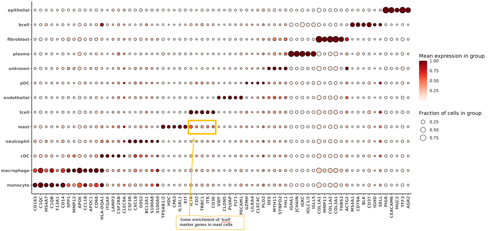
</div>

```{r}
#| eval: false
#| echo: false

  
```

I refit the model again, this time "discouraging double positives" for `tcell` likely cells to be classified as `mast`.


```{r, eval=FALSE}
model_l2_v2 <- 
  cluster_metagenes(metagenes = metagenes_l2
                    ,to_model = "yhat"
                    ,prior_prob_level = model_l1$post_probs$immune
                    ,discourage_double_positive = list("mast" = c("tcell"))
  )
```


This ends up looking a lot better, both visually in terms of the marker heatmap, as well as the actual percentages and fold change of CD3 expression in `mast` and `tcell`.
```{r,eval=FALSE}
#| code-fold: true


probs <- merge(model_l1$post_probs, model_l2_v2$post_probs, suffixes=c("_l1", "_l2"), by = "cell_ID")
probs[,`:=`(celltype=best_class_l2, best_score=best_score_l2)]
probs[best_score_l2 < 0.5,`:=`(celltype=best_class_l1, best_score=best_score_l1)]
probs[best_class_l1 =="immune",`:=`(celltype=best_class_l2, best_score = best_score_l2)]
probs[best_score_l1 < 0.5,celltype:="unknown"]
probs[,.N,by=celltype]

fc_l2_v2 <- 
  clusterwise_foldchange_metrics(normed = sem[["RNA"]]@data
                                 ,metadata = probs
                                 ,clustercol = "celltype"
  )

marker_heatmap(fc_l2_v2)

hm_l2_v2 <- smiSmooth::marker_heatmap(fc_l2_v2, extras =c("S100A8", "S100A9", "CD68", "LILRA4", "CLEC4C", "CD14", "CLEC9A"))
print(hm_l2_v2)
```


<div class="wider-image">
  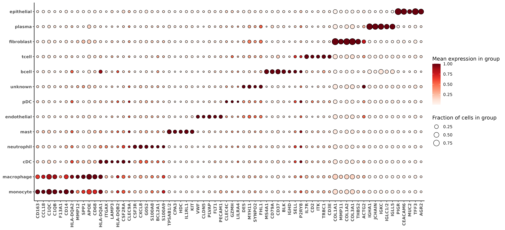
</div>

```{r}
#| eval: false
#| echo: false
  
```

```{r, eval=FALSE}
#| code-fold: true
comp <- 
rbindlist(list(fc_l2[gene %in% c("CD3E", "CD3D", "CD3G")][cluster %in% c("tcell", "mast")][,typ:="v1_before"]
               ,fc_l2_v2[gene %in% c("CD3E", "CD3D", "CD3G")][cluster %in% c("tcell", "mast")][,typ:="v2_after"]
))

barplot_prop <- 
ggplot(comp, aes(y= gene, fill = typ, x = cluster_prop)) + 
  geom_bar(stat='identity',position=position_dodge(width=0.8))  + 
  facet_wrap(~cluster,labeller=label_both) + 
  theme_bw() + 
  theme(text=element_text(face='bold',size=14)) + 
  geom_text(aes(label=paste0("(",scales::comma(ncells),")"), x = cluster_prop + 0.005),position=position_dodge(width=0.8)) + 
  scale_fill_manual(values = brewer.pal(3,"Dark2"), guide=guide_legend(reverse = TRUE)) + 
  labs(x = "Proportion of CD3+ cells (# of cells assigned to cluster)"
       ,title="Before vs. After refining double+ tcell scores in mast cell model")


barplot_fc <- 
ggplot(comp, aes(y= gene, fill = typ, x = fold_change)) + 
  geom_bar(stat='identity',position=position_dodge(width=0.8))  + 
  facet_wrap(~cluster,labeller=label_both) + 
  theme_bw() + 
  theme(text=element_text(face='bold',size=14)) + 
  scale_fill_manual(values = brewer.pal(3,"Dark2"), guide=guide_legend(reverse = TRUE)
                    ) + 
  scale_x_continuous(n.breaks=10) + 
  labs(x = "Fold Change for CD3  (# of cells assigned to cluster)")

comp_barplots <- 
cowplot::plot_grid(barplot_prop, barplot_fc, nrow=2) + 
theme(plot.background = element_rect(fill = 'white',color='white')) + 
  cowplot::panel_border(remove=TRUE) 
print(comp_barplots)
```

<div class="wider-image">
  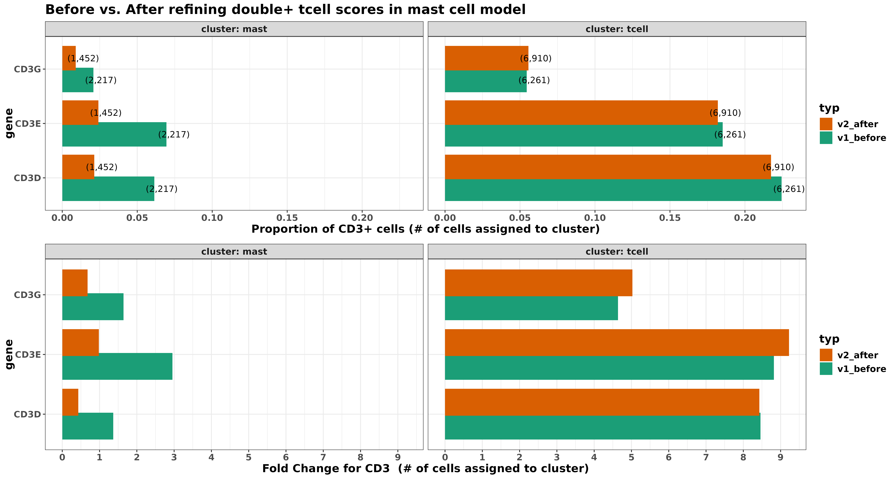
</div>

```{r}
#| eval: false
#| echo: false

  
```


Here's a spatial plot of the cell types we've called so far.  We could stop here, or continue in the same manner for subclassifying any other cell types.
```{r,eval=FALSE}


met <- merge(data.table(sem@meta.data), probs[,.(celltype, cell_ID)])
colorpal <- c('#F0A0FF','#E0FF66','#C20088','#00998F','#426600','#005C31','#808080','#94FFB5','#003380','#191919','#990000','#0075DC','#FFA405')
names(colorpal) <- sort(unique(met[["celltype"]]))


xyplist <- 
lapply(split(met, by="portion"), function(xx){
  smiSmooth:::xyplot(cluster_column = "celltype", metadata = xx, ptsize = 0.01, cls = colorpal) + coord_fixed()
})

cowplot::plot_grid(plotlist=xyplist)


```

<div class="wider-image">
  
</div>

```{r}
#| eval: false
#| echo: false

knitr::include_graphics("./figures/xyplot_celltypes.png")
```


# Conclusion

We've discussed a method for cell typing that uses predefined sets of marker genes to build cell type specific metagene scores, which are probabilistically clustered into cell types.

Using a predefined set of marker genes has several advantages.  For one, this allows users to prespecify the network of genes which are expected to have positive covariance within the cell type, and restricts any undesired influence of non-informative or noisy genes.  Because no assumption is made regarding the average expression or level of covariance between any pair of genes, we suspect that in some cases this approach may be more flexible and robust in the presence of batch effects or platform effects compared to using pre-trained models, data transfer, or reference profiles which may have been trained using different sample conditions or technologies.

The NNLS regression framework for estimating celltype metagenes allows for improved prediction power by incorporating information from similar cells through an adjacency network. By restricting the direction of the regression coefficients, we've implicitly imposed an assumption of positive covariance between these markers within the corresponding cell type class.  Sign constraints have been shown to be as effective in some cases as explicit regularization.  

We use a mixture of overfitted multivariate gaussian mixture models for probabilistic cell type classification.  This approach is effectively a non-parametric mixture model, where we assume that the distribution of metagene scores for each cell type can be a approximated by a 'large-enough' mixture of multivariate gaussians. The simple selection of anchor cells based on score positivity, and ability to fine tune cell typing by controlling behavior of double positivity should allow for easy user control and flexibility. 

There are several future improvements for this method we hope to work on.
For example, allowing the use of multiple 'index genes' for each cell type; in this case the cell type metagene score is a composite score of multiple imputed 'index genes'.  
Simultaneous estimation of metagene scores and clustering (perhaps through a regression-based mixture model) might enhance the power of metagene scores and classification by optimizing the cell allocations to the correct cluster simultaneously during model-fitting.  Exploring other frameworks outside of NNLS regression could potentially capture more flexible model structures with interaction and non-linearity.  
Extension to a semi-supervised framework where cell types where marker genes are unknown a priori would also be useful.

We've implemented the tools presented here in the R package [XX](link).

