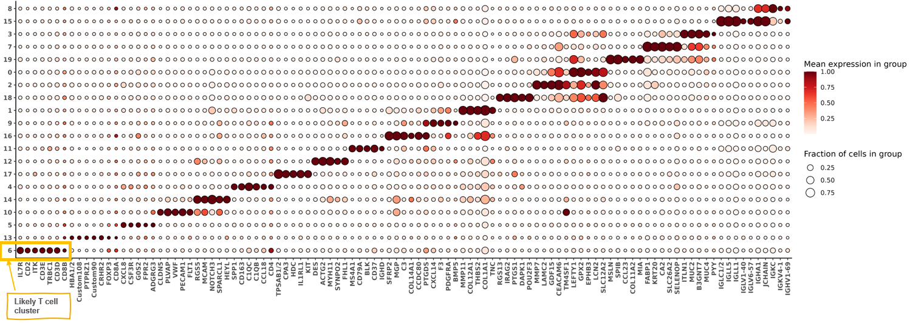
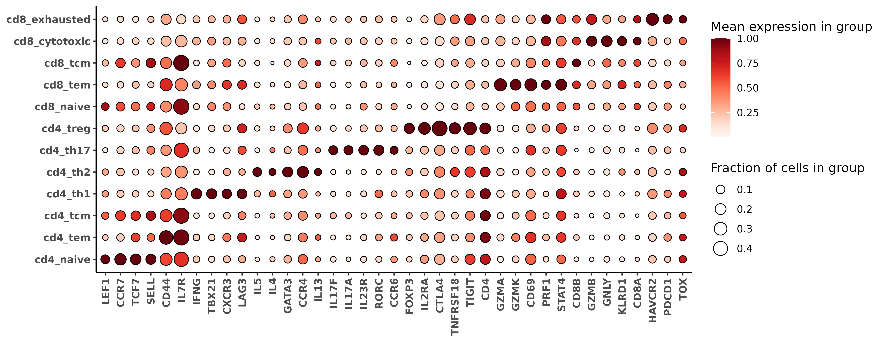
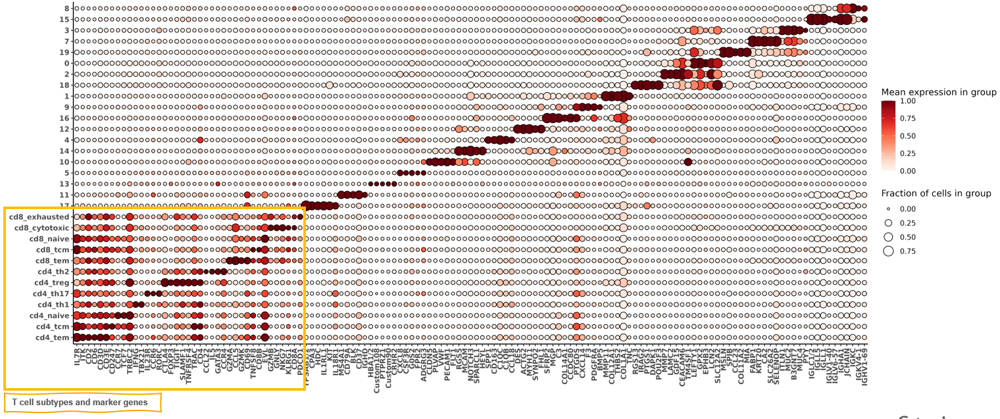
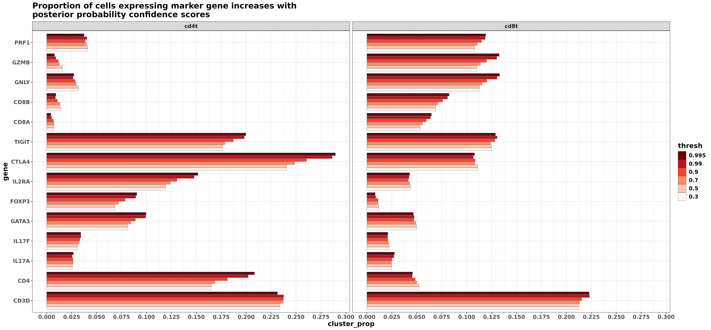
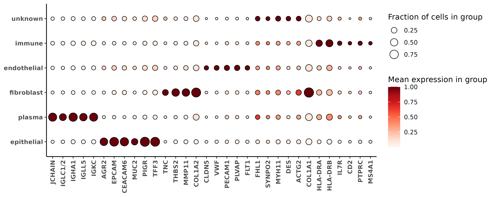

# Abstract

This post showcases a cell typing method optimized for detection and sub-clustering of immune cells.
We use a 6K-plex colon-cancer dataset to demonstrate two common use cases for the method:

1. Subtyping T cells
2. Broad immune cell typing.

Code for the method and utility functions used in this post can be found in the R package [smiSmooth](link). 

# Quick links to the code

For those in a hurry to 'just see the code', they can jump ahead to the "'Just The Code'" sections for [Example 1](#tldr), or [Example 2](#tldr2).

# Introduction 

Often (particularly with immune cells), we may want our cell type calls to be guided by specific sets of marker genes.  
In some spatially-resolved transcriptomics (SRT) datasets, directly using marker gene expression for determining cell type may be a challenge due to data sparsity, background due to autoflourescence, or segmentation ambiguity.

The cell typing method we describe here is designed to make it easy to enforce prior biological assumptions about the marker genes and expression profiles we expect to see in our cell types, 
while being robust to platform or batch effects that may otherwise challenge the transfer of those assumptions from pre-trained models or reference datasets.  

The basic framework for the method can be described in a few basic steps (we'll describe each of these steps in more detail throughout our examples.)

1. First, for each cell type, we define a set of genes we expect may be 'marker genes' or highly expressed based on prior data or biology (either the literature, a reference dataset, or some combination of both).
2. Next, we construct metagene scores from our data for each cell type based on the genes specified in (1).
3. Finally, we model the metagene scores, where the model estimates a posterior probability that each cell belongs to any of the possible cell types.

We'll use an internally generated colon cancer dataset profiled with the CosMx Human 6K Discovery Panel comprised of about 112k cells, and work through two common cell typing scenarios in which we envision this methodology can be useful:

1. Subclustering an existing set of cell types: 
  * In this first case, we'll assume we've already done some basic clustering, but don't quite have the level of cell type granularity we'd like.  We'll take a 'T cell' cluster and sub-classify those cells into CD8-T, CD4-T, and T-reg cell categories.

2. Top down hierarchical cell typing with focus on immune cells: 
  * Here we'll start from scratch; first assigning cells into major categories and identifying immune cells, then classifying those immune cells into various sub classifications of myeloid and lymphocyte cell types.


# Initial look at our dataset

Let's start by taking an initial look at our data, then walk through some cell typing scenarios.  First, we can load in our data and take a look at some unsupervised leiden clustering we've already performed.

```{r load_libraries, message=FALSE, eval = FALSE}
library(ggplot2)
library(ggrepel)
library(data.table)
```
```{r,eval=TRUE}
library(smiSmooth)
```


```{r , message=FALSE, eval = FALSE}
sem <- readRDS("colon_seurat.rds")
normed <- smiSmooth::totalcount_norm(Matrix::t(sem[["RNA"]]@counts))
sem <- Seurat::SetAssayData(sem, layer = "data", new.data = Matrix::t(normed))
```

```{r}
#| eval: false
#| echo: false

devtools::load_all("~/data/dan/imputation_smoothing/smiSmooth", export_all = FALSE)
```

```{r}
#| eval: false
#| echo: false


library(ggplot2)
library(ggrepel)
library(RColorBrewer)
library(data.table)

#sem <- readRDS("colon_seurat.rds")
sem <- readRDS("~/data/dan/imputation_smoothing/colondata/semsub.rds")
normed <- smiSmooth::totalcount_norm(Matrix::t(sem[["RNA"]]@counts))
sem <- Seurat::SetAssayData(sem, layer = "data", new.data = Matrix::t(normed))

```


#### Spatial plot of initial clusters

Here's a spatial plot of our leiden clusters.  At first glance, we see that some of these unsupervised clusters (i.e., 3, 0, 1, 2, and 7 for example) have distinct spatial patterns; it definitely looks like some meaningful biological structure in these tissue were captured by unsupervised clustering.  

```{r,eval=FALSE}
#| code-fold: true

sem@meta.data$portion <- "part_a"
sem@meta.data$portion[sem@meta.data$fov %in% 60:73] <- "part_b"
xyplist <- 
lapply(split(data.table(sem@meta.data), by = "portion"), function(xx){
  smiSmooth::xyplot("clusters_unsup", metadata = xx,ptsize = 0.1) + coord_fixed()
})
xypl <- 
cowplot::plot_grid(plotlist=xyplist, nrow=1) + 
theme(plot.background = element_rect(fill = 'white',color='white')) + 
  cowplot::panel_border(remove=TRUE) 
print(xypl)

```

<div class="wider-image">
  
</div>

```{r}
#| eval: false
#| echo: false
#| fig.show: "hold"
#| out-width: "6000px"

knitr::include_graphics("./figures/xyp_unsup.png")
```

#### Heatmap of initial clusters

We can make a marker gene heatmap to identify some of the top marker genes for each cluster and see if we recognize any of the celltypes represented by the unsupervised clusters.
Here we can use a couple of convenience functions provided in the R package `smiSmooth`.

```{r, eval=FALSE}
#| code-fold: true

fctbl_unsup <- 
smiSmooth::clusterwise_foldchange_metrics(normed  = sem[["RNA"]]@data
                                          ,metadata = sem@meta.data
                                          ,cluster_column = "clusters_unsup"
                                          )

hm_unsup <- smiSmooth::marker_heatmap(fctbl_unsup
                           ,extras = c("CD3D", "CD4", "FOXP3"
                                       , "CD8B", "CD8A")
                           )
print(hm_unsup)

```


<div class="wider-image">
  
</div>


```{r}
#| eval: false
#| echo: false
#| fig.show: "hold"
#| out-width: "6000px"


```
Let's suppose for sake of demonstration that I recognize (and am comfortable enough) to label these clusters with cell type names based on the marker genes shown in the heatmap.  

However, there are one or a few of my immune clusters I've identified where I desire more granularity.
In this case, I'm particularly interested in my T cells; in the bottom-left hand corner of the heatmap plot above, I see that 'cluster 6' is capturing T-cells, showing enrichment in some key marker genes like CD3 (CD3D, CD3E) as well as other markers like CD2, IL7R, and ITK.

I'd like to split these cells further into at least a few meaningful T-cell subtypes, at minimum: "CD8+", "CD4+", and "Treg". 

# Example case 1: Subclustering T cells {#ex1}

## 'Just The Code' {#tldr}

Here's the code for classifying leiden cluster '6' into `cd8t` and `cd4t` cell types , followed by more granular T cell subtyping.  We use the R package `smiSmooth` with a prespecified `tcell_pipeline`, and corresponding lists of marker genes included as package datasets.

```{r, eval=TRUE}

data("pipeline_tcell")
str(pipeline_tcell, max.level = 2)
```

```{r, eval=FALSE}
### these are cells I want to subcluster
tcell_ids <- sem@meta.data[sem@meta.data$clusters_unsup==6,"cell_ID"]

### Run a 'tcell'-typing pipeline, which 
### first classifies into T8/T4 categories (using the `tmajor` markerslist), 
### then runs subclassification for T4 and T8 using the t4minor and t8minor markerslists.
tcell_typing <- 
run_pipeline(pipeline = pipeline_tcell
             ,counts_matrix = Matrix::t(sem[["RNA"]]@counts[,tcell_ids])
             ,adjacency_matrix = as(sem@graphs$umapgrph
                                    ,"CsparseMatrix")[tcell_ids,tcell_ids]
             ,celltype_call_threshold = 0.5
             )

```


```{r}
#| eval: false
#| echo: false
saveRDS(tcell_typing, "figures/tcell_typing.rds")
```

```{r}
#| eval: true
#| echo: false
tcell_typing <- readRDS("figures/tcell_typing.rds")
```
The data table `post_probs` in our model object `model_t` holds the high-level cell typing result; showing a posterior probability that each of our cells belongs to either `cd8t`, or `cd4t` categories, along with a 'best_class' label depending on which of these scores is highest for each cell.


```{r, eval=FALSE}
str(tcell_typing, max.level = 2)
tcell_typing$post_probs$tmajor[1:10][]
```

```{r, eval=TRUE}
### List of genes used to estimate a celltype-metagene score for each cell
data("markerslist_tcellmajor")
str(markerslist_tcellmajor)
```
```{r,eval=FALSE}

tpipeline <- 
  make_pipeline(markerslists = list("tmajor" = smiSmooth::markerslist_tcellmajor
                    ,"t4minor" = smiSmooth::markerslist_cd4tminor
                    ,"t8minor" = smiSmooth::markerslist_cd8tminor
                    )
                 ,priors = list("t4minor" = "tmajor"
                               ,"t8minor" = "tmajor")
                 ,priors_category = list("t4minor" = "cd4t"
                                         ,"t8minor" = "cd8t"
                                         )
    )


```


We then used the posterior probabilities from our high-level T cell model to predict more granular classifications of `cd8t` and `cd4t`, including memory, naive, helper, and exhausted subtypes using corresponding marker gene sets.
The results from `model_t4` and `model_t8` can be combined into a table `probs`, showing the best classification for cd4t or cd8t subtype.


Now lets take a closer look at the details and describe the methodology for each step.


## Detailed walkthrough
###  Part 1: Specifying genes associated with my cell types based on prior biology

We'll describe the first level of cell type classification from our example above to illustrate the method, where we suppose we want to classify `cd4t` vs. `cd8t`.
Creating a marker list, by specifying genes I expect **might** be associated with my cell types is the first step of this algorithm.
For each of my cell types, `cd4t` and `cd8t`, I specify 

* a set of primary defining markers or "index genes" (these are genes that should be fairly exclusive to the cell type if possible)
* a set of other marker genes which I expect could be expressed as "predictors"  

In this case, we'll use [CD4], and [CD8A, CD8B], as "index genes" for `cd4t` and `cd8t` respectively.
The other genes we'll specify as predictors are based on the literature.  For example, FOXP3 is often associated with cd4t 'Treg' cells, so we include it as a predictor here for `cd4t`. 

It's okay to include markers in multiple cell types if that fits our mental model.
For example, CD3D, CD3E, and CD3G are general T cell markers, and so are included as predictors for both subtypes, as are other genes like IL7R, CD27, SELL which could be seen in either `cd4t` or `cd8t` cells.

We can create our marker list manually like this:
```{r, eval=TRUE}
markerslist_tcellmajor <- 
smiSmooth::make_markerslist(
  index_marker = list(
    "cd8t" = c("CD8B", "CD8A")
    ,"cd4t" = c("CD4")
  )
  ,predictors = list(
    "cd8t" =  c("CD3D", "CD3E", "CD3G", "CD8A", "CD8B", "IL7R", "CD27", "SELL", "CCR7", "TCF7", "LEF1", 
                    "FOXP1", "BACH2", "KLF2", "CD28", "ICOS", "STAT3", "STAT5", "RUNX3", "BATF", "EOMES", 
                    "TBX21", "PRDM1", "PDCD1", "LAG3", "TIGIT", "HAVCR2", "GZMK", "GZMA", "GZMB", "PRF1", 
                    "GNLY", "KLRG1", "KLRD1", "IFNG", "CCL5", "CX3CR1", "NKG7", "FAS", "FASLG", "IL2", "CD244", 
                    "CXCR3", "KLRB1", "TOX", "NR4A2", "BCL6", "CXCL13")
    ,"cd4t" = c("CD3D", "CD3E", "CD3G", "CD4", "IL7R", "CD27", "SELL", "CCR7", "TCF7", "LEF1", "FOXP1", 
                     "BACH2", "KLF2", "CD28", "ICOS", "CD40LG", "STAT3", "STAT5", "RUNX1", "RUNX3", "BATF", 
                     "GATA3", "TBX21", "RORC", "FOXP3", "IL2RA", "CTLA4", "PDCD1", "LAG3", "TIGIT", "HAVCR2", 
                     "IL2", "IFNG", "IL4", "IL5", "IL13", "IL17A", "IL17F", "IL10", "CCL5", "CXCR3", "CCR6", 
                     "CXCR5", "PRDM1", "BCL6", "EOMES", "CXCL13", "TOX")
  )
)
```


The object created looks like this below

```{r, eval=TRUE}
str(markerslist_tcellmajor)
```

In practice, we can save and reuse our marker lists for different cell types.
While it should be easy to create/modify a custom list from the literature,  this particular list is included as a package dataset `markerslist_tcellmajor` to facilitate ease of use.  

```{r}
data("markerslist_tcellmajor")
str(markerslist_tcellmajor)
```


### Part 2: Estimating a metagene score for each cell type

In this next step, we fit a model for each cell type, using the primary index marker as the response variable and covariates derived from the predictor genes.  

We fit our models for each cell type class using the `fit_metagene_scores` function.
This function uses 'smoothing', as well as our prior biology / assumptions about which markers are associated with each celltype to predict the pearson residuals of the index gene.

The default regression model setup looks like this:
$$Y = WY\eta  + WX\beta + X\gamma + \epsilon $$
where

* $Y:=$ pearson residuals of the index marker (our response variable)
* $X:=$ (totalcount-normalized) matrix of predictor genes
* $W:=$ a cells $\times$ cells neighborhood matrix, denoting cells with similar expression profiles. 
* $\eta$, $\beta$, and $\gamma$ are the regression coefficients associated with the 'neighbor-averaged' index gene, 'neighbor-averaged' predictor genes, and predictor genes within the cell respectively. 

One way to think about this model specification could be as an implementation of a 'smoothing model', which leverages information across multiple dimensions:

* the index gene in similar cells ($WY$) 
* other expected marker genes (our predictor genes $X$)
* other marker genes in similar cells ($WX$)

We use a non-negative least squares [@nnlsref] (NNLS) regression to estimate our models.  The NNLS model enforces that all of the covariates based on predictor genes we specified must have positive regression coefficients (in practice we'll observe that a number of regression coefficients may shrink to zero).


By specifying `use_offclass_markers_as_negative_predictors = TRUE` in the section above, we further assume that predictors for *other celltypes* that we haven't listed can be used as *negative* predictors of our index gene.
For example, genes like like "GZMA" and "GZMB", which are markers associated with `cd8t`, will be assumed to be *negative* predictors of the other classes (`cd4t`) where they are not listed. 

Estimating this model from the dataset at hand rather than using a reference model could make this framework more robust to platform effects or batch effects compared to pre-trained models or reference profiles which used different technology or data with slightly different biology.

Because the model is only using genes we've specified in our 'markers list', we also have complete control over which genes influence the metagene scores, reducing the chance that noisy or irrelevant genes can have negative impact on our cell type classification. 

Here I call the `fit_metagene_scores` function to estimate these models for cells corresponding to the unsupervised cluster I've identified to be T cells.  
For the cells $\times$ cells `adjacency_matrix`, I've used the nearest neighbor matrix in my Seurat object.  This is the same graph that was used to generate my UMAP and my unsupervised leiden clusters.
After fitting our regression models for each cell type, we'll use the predicted scores as 'metagenes' that can be clustered in the next step.

```{r, eval=FALSE}

tcell_ids <- sem@meta.data[sem@meta.data$clusters_unsup==6,"cell_ID"]
metagenes_t <- 
  fit_metagene_scores(
    markerslist = markerslist_tcellmajor
    ,counts_matrix = Matrix::t(sem[["RNA"]]@counts[,tcell_ids])
    ,adjacency_matrix = as(sem@graphs$umapgrph
                           ,"CsparseMatrix")[tcell_ids,tcell_ids]
  )
```


```{r}
#| eval: false
#| echo: false
saveRDS(metagenes_t, "figures/metagenes_t.rds")
```

```{r}
#| eval: true
#| echo: false
metagenes_t <- readRDS("figures/metagenes_t.rds")
```

The `metagenes_t` object we've created has an element for each celltype, including the regression coefficients (`bhat`), and predicted values we'll use for clustering (`yhat`) for each index marker gene for cell type.


```{r}
str(metagenes_t,max.level = 2)
```

For cell types using multiple 'index marker genes', like `cd8t` here (using CD8A and CD8B), metagene scores are combined together using non-negative sparse pca (implemented in the `nsprcomp` R package) [@nonnegpca].  This allows for summarizing an overall cell type metagene score, using a constrained non-negative combination of individual index-gene scores that explains maximal variation across individual index gene scores. 
Below, we see the PCA rotation representing the individual weights given to CD8A and CD8B metagene scores.
```{r}
metagenes_t$cd8t$nnpcfit

```


We can get a better understanding of the metagene model outputs by looking at a few diagnostics plots.  In the below, we plot the regression coefficients for each model, ordering them on the x-axis by their ranking.
For each cell type, the positive $\hat{\beta}$ correspond to genes we specified as predictors, and negative $\hat{\beta}$ were predictors for either of the other two cell types.  
A lot of the covariates which have the largest magnitudes have "*lag.*" in their name indicating they correspond to a smoothed (or neighbor-averaged) covariate for that gene.

For `cd4t`, we see that smoothed CD4 (indicated by '*lag.y.CD4*' in the plot) is the strongest predictor of observed 'CD4'.  For `cd8t`, '*lag.y.CD8A*' and '*lag.y.CD8B*' (indicating smoothed CD8A and CD8B) are also among the strongest predictors, but not first in rank.


```{r, eval=FALSE}
#| code-fold: true

coefplots <- metagene_coefficients_plot(metagenes_t)
coefplots <- lapply(coefplots, function(x){x +   theme(text=element_text(face='bold',size=18))
  }) ## just make the text bigger and bold
cowplot::plot_grid(plotlist = coefplots, nrow = 1)
```
<div class="wider-image">
  
</div>

```{r}
#| eval: false
#| echo: false
ggsave("figures/coefplots_tcells.png", width = 1904*sqrt(50), height = 671*sqrt(50), units = "px", dpi = 500)
```

```{r}
#| eval: false
#| echo: false

knitr::include_graphics("./figures/coefplots_tcells.png")
```

A pairsplot can show us how well the metagene scores we've created are distinct from each other.  Ideally, if our cell type classes are mutually exclusive, we'd want to not see too many cells which are 'positive' for multiple cell types at the same time.

Here, we see that `cd4t` and `cd8t` metagene scores are negatively correlated with each other, which is good to see.

```{r, eval=FALSE}
#| code-fold: true

metagene_pairsplot(metagenes_t, var= "yhat")
```

```{r}
#| eval: false
#| echo: false
ggsave("figures/yhatpairs_tcells.png", width = 858*sqrt(20), height = 634*sqrt(20), units = "px", dpi = 500)
```


```{r}
#| eval: true
#| echo: false

knitr::include_graphics("./figures/yhatpairs_tcells.png")
```

### Part 3: Clustering via overfitted gaussian mixture-models 

Now, we estimate the multivariate distribution of metagene scores that characterize each cell type.  This allows us to compute the likelihoods for a cell belonging to any of these types, and infer a posterior probability of T cell subtype for each cell.
The `cluster_metagenes` function we run below estimates a mixture of overfitted multivariate gaussian mixture models [@aragam2020identifiability] to estimate the distribution of metagene scores.

```{r}
#| eval: false
#| echo: true

model_t <- 
smiSmooth::cluster_metagenes(metagenes = metagenes_t)
```

```{r}
#| eval: false
#| echo: false

saveRDS(model_t, "figures/model_t.rds")
```

```{r}
#| eval: true
#| echo: false

model_t <- readRDS("figures/model_t.rds")
```

At a high level, the `cluster_metagenes()` function first identifies all cells with positive metagene scores for a particular cell type. We might loosely interpret these cells as 'anchor cells'.
The data may look like this for example, where here I have subset my original data to cells which have positive scores for my celltype `cd8t`.

```{r}
yh <- make_scores_matrix(metagenes = metagenes_t, "yhat")
yh[yh[,"cd8t"] > 0,][1:10,]

```

Then, a mixture model is fit to these (2-dimensional) scores, by default using 6 components.
The estimates corresponding to the individual mixture models for each cell type are found in the `models` list, with the means (`mu_hat`), covariance matrices (`sigma_hat`), and prior probability (`pihat`) corresponding to each mixture component. 
```{r}
str(model_t$models, max.level = 2)
```
Typically we shouldn't need to interact with this part of the output.  After the mixture models for each cell type are fitted, we can score all cells, and get an overall posterior probability that a cell belongs to any of the two major classes using Bayes rule.

Let $y_c$ be the cell type category for cell $c$, $scores_c$ the corresponding metagene scores, and $t$ denoting a possible cell 'type' or category (for $t = 1,...,T$).

We compute the overall posterior probability that $y_c$ is a particular type $t$, as

$$P(y_c = t | scores_c) = \frac{P(scores_c | y_c = t)P(y_c = t)}{\sum_{l=1}^T P(scores_c | y_c = l)P(y_c = l)}$$

Using the individual mixture models for a particular cell type with $K$ mixture components, we have
$$P(scores_c | y_c = t) = \sum_{j=1}^K P(scores_c | k=j, y_c = t) P(k=j | y_c = t)$$

The prior probability for a particular cell type class $t$ can be estimated by counting the number of cells used to estimate the mixture model in each cell type, and computing a proportion amongst all possible cell type classes, i.e.,
$$P(y_c = t) = \frac{\sum_{c=1}^C I(scores_{c,t} > 0)}{\sum_{l=1}^T \sum_{c=1}^C I(scores_{c,l} > 0)}$$
These probabilities are in the `post_probs` data.table object of the model.
```{r}
model_t$post_probs[1:10][]

```

### Granular hierarchical subtyping and using a `pipeline`

These posterior-probability scores can be passed directly to subtyping models for `cd4t` and `cd8t`, via the `prior_level_weights` arguments.
For example, if I wanted to go ahead and cluster the `cd4t` cells into subtypes, I could follow the same process, passing in the prior probability of the cell being `cd4t` as a weight.

Below is an example of this syntax using the `cd4t` subtypes in the package dataset "markerslist_cd4tminor".

```{r, eval=TRUE}
str(smiSmooth::markerslist_cd4tminor, max.level=2)
```

```{r, eval=FALSE}
#### Classify cd4t subtypes
metagenes_t4 <-
  smiSmooth::fit_metagene_scores(
    markerslist = smiSmooth::markerslist_cd4tminor
    ,counts_matrix = Matrix::t(sem[["RNA"]]@counts[,tcell_ids])
    ,adjacency_matrix = as(sem@graphs$umapgrph
                           ,"CsparseMatrix")[tcell_ids,tcell_ids]
    ,prior_level_weights = model_t$post_probs$cd4t ## prior probability of cd4t
  )
model_t4 <- 
smiSmooth::cluster_metagenes(metagenes = metagenes_t4, prior_prob_level = model_t$post_probs$cd4t)

```

A convenient way to simplify this process with minimal code is to use a `pipeline` object.
A custom hierarchical cell typing pipeline could be created like this below, where

* `markerslists` is a named list, with a `markerslist` for each stage of cell typing. "tmajor" will classify `cd8t` vs. `cd4t`, while "t8minor" and "t4minor" will subclassify those cell types respectively.
* `priors`, a list specifying 'parent' celltyping stage. Here , `t4minor` and `t8minor` both need to run after "tmajor", as they will use the estimated probabilities of "`cd4t`" and "`cd8t`" as inputs.  
       "tmajor" runs first, and does not have prior probability inputs.
* `priors_category`, a list specifying 'parent' /  major categories of each celltype. Here , `t4minor` is a subset of `"cd4t"`.  "tmajor" runs first, and does not have a prior.

```{r}
pipeline_tcell <- 
  make_pipeline(markerslists = list("tmajor" = smiSmooth::markerslist_tcellmajor
                    ,"t4minor" = smiSmooth::markerslist_cd4tminor
                    ,"t8minor" = smiSmooth::markerslist_cd8tminor
                    )
                 ,priors = list("t4minor" = "tmajor"
                               ,"t8minor" = "tmajor")
                 ,priors_category = list("t4minor" = "cd4t"
                                         ,"t8minor" = "cd8t"
                                         )
    )

class(pipeline_tcell)
```

This particular pipeline is also saved as a package dataset.
```{r}
str(smiSmooth::pipeline_tcell, max.level=2)
```


The code to run the pipeline looks like below:
```{r}
#| eval: false
#| echo: false

### Run a 'tcell'-typing pipeline, which 
### first classifies into T8/T4 categories (using the `tmajor` markerslist), 
### then runs subclassification for T4 and T8 using the t4minor and t8minor markerslists.
tcell_typing <- 
run_pipeline(pipeline = tpipeline
    ,counts_matrix = Matrix::t(sem[["RNA"]]@counts[,tcell_ids])
    ,adjacency_matrix = as(sem@graphs$umapgrph
                           ,"CsparseMatrix")[tcell_ids,tcell_ids]
    ,celltype_call_threshold = 0.5
    )

```

We could take a look at individual `models` and `metagenes` objects if needed within our `tcell_typing` result.
Below, we show that the outputted objects are the same in the pipeline format, as if we had ran them individually like in the method demonstration.

```{r}
all.equal(model_t, tcell_typing$models$tmajor)
all.equal(metagenes_t, tcell_typing$metagene_scores$tmajor)

```

By default, two possible cell type classifications are returned in the overall `post_probs` data.table object from our pipeline.
Below, `celltype_granular` shows the most granular classification for each cell, carrying the 'best possible' classification at each stage of the pipeline.
For example, the first cell below was first identified as `cd8t` being the best category.  The best subcategory of `cd8t` was `cd8_exhausted`, and the posterior probability score for `cd8t_exhausted` was ~0.47.

We set the the cutoff `celltype_call_threshold=0.5` when we ran the pipeline, so that the `celltype_thresh` classification shows the most granular cell type with probability scores *at least* this threshold.
The first cell below has `cd8_exhausted` score ~0.47 (less than 0.5), and so takes the higher level category of `cd8t`, which is above the threshold at ~0.99999.

```{r}
tcell_typing$post_probs[["tmajor"]][1:10]
```

We can remake this table with a different cutoff in mind as needed, depending on how conservative / aggressive we are comfortable being with the cell type call, using the 
`combine_postprob_tables` function.

As demonstration, we can look at the output if we were to raise our threshold from 0.5 to 0.8.  
We can "`return_all_columns`" to show a more verbose result, with individual columns showing the joint probability scores for all possible cell type categories in each cell.
```{r}
smiSmooth::combine_postprob_tables(pipeline = pipeline_tcell
                                   ,models = tcell_typing$models
                                   ,celltype_call_threshold = 0.8
                                   ,return_all_columns = TRUE)[["tmajor"]][1:10]
```


### Examining and validating clustering results

Now we can evaluate the cell typing performance.
In particular, we want to check that the genes we specified as the index marker and predictors are in fact marker genes in the corresponding cell types.

First, we can look at a marker gene heatmap made with just the t-cells, and show the genes we specified as the most important 'index genes' for each of the `cd8t` and `cd4t` subtypes.
Looking closely, we see that CD8A and CD8B are much higher in `cd8_` compared to `cd4_` types.
Similarly, CD4 is higher expressed in `cd4_` subtypes compared to `cd8_` subtypes.
Looking at the specific index markers for each subtype, we see good agreement between marker gene specified for each subtype reflected in our heatmap. 

```{r,eval=FALSE}

fct <- clusterwise_foldchange_metrics(counts = sem[["RNA"]]@counts[,tcell_ids]
                                      ,metadata = tcell_typing$post_probs[["tmajor"]]
                                      ,cluster_column = "celltype_granular")
idxs <- unique(unname(c(unlist(lapply(smiSmooth::markerslist_cd4tminor, "[[", "index_marker"))
               ,unlist(lapply(smiSmooth::markerslist_cd8tminor, "[[", "index_marker")))))

nms <- c("cd4t", names(smiSmooth::markerslist_cd4tminor), "cd8t", names(smiSmooth::markerslist_cd8tminor))
hmsubtype <- marker_heatmap(fct, featsuse = c("CD8A", "CD8B", "CD4", idxs), geneorder = c("CD8A", "CD8B", "CD4", idxs), clusterorder = nms, orient_diagonal = TRUE)
print(hmsubtype)
```

```{r}
#| eval: false
#| echo: false

ggsave(plot=hmsubtype, filename = "figures/hm_tsubtype.png", width = 1084 * sqrt(20), height = 420 * sqrt(20) , dpi = 450, units = "px")
fwrite(fct, file="data/fc_t_subtypesonly.csv")
```

```{r}
### The key index markers for cd4 subtypes
lapply(smiSmooth::markerslist_cd4tminor, "[[", "index_marker")

### The key index markers for cd8 subtypes
lapply(smiSmooth::markerslist_cd8tminor, "[[", "index_marker")
```

<div class="wider-image">
  
</div>


```{r}
#| eval: false
#| echo: false


```


Here we can attach our T-cell annotations back onto our metadata, and remake our marker heatmap.

```{r,eval=FALSE}
met <- 
merge(data.table(sem@meta.data), tcell_typing$post_probs[["tmajor"]][,.(cell_ID, celltype = celltype_granular, best_score_granular)]
      ,by="cell_ID", all.x=TRUE)
met[is.na(celltype),celltype:=clusters_unsup]

fc_t_all <- 
smiSmooth::clusterwise_foldchange_metrics(normed = sem[["RNA"]]@data
                   ,metadata = met
                   ,cluster_column = "celltype"
                   )

hm_tcell <- smiSmooth::marker_heatmap(fc_t_all
                           ,extras = c("CD4", "CD8A", "CD8B")
                          )
print(hm_tcell)
```

```{r}
#| eval: false
#| echo: false

ggsave(plot=hm_tcell, filename = "figures/hm_tcell.png", width = 1716 * sqrt(20), height = 687 * sqrt(20) , dpi = 450, units = "px")
fwrite(fc_t_all, file="data/fc_tcells_allcells.csv")
```


<div class="wider-image">
  
</div>
```{r}
#| eval: false
#| echo: false


```

Treating the 'posterior probability' as a confidence that the cell belongs to the corresponding cluster, we can show that 
the proportion of cells that express the expected marker genes generally increases with higher confidence.

In the figure below,  we compare the major `cd4t` and `cd8t` T cell types in terms of some of their marker genes which are specific to each. We see that CD8A and CD8B increase in `cd8t` cells as we gain confidence in the cell type call, along with other `cd8t` specific markers (GZMB, GNLY, PRF1).  
Similarly, we see that CD4 increases in `cd4t` calls with higher posterior probability scores, along with `cd4t` subtype-specific markers like FOXP3, CTLA4, TIGIT (`cd4_treg` marker genes), IL17A and IL17F (`cd4_th17` markers) and GATA3 (`cd4_th2` marker).


```{r,eval=FALSE}

p <- 
marker_threshold_plot(normed = sem[["RNA"]]@data
                      ,metadata = tcell_typing$models$tmajor$post_probs
                      ,clusters = c("cd4t", "cd8t")
                      ,markers = c("CD3D", "CD4", "IL17A", "IL17F", "GATA3", "FOXP3",  "IL2RA", "CTLA4", "TIGIT","CD8A", "CD8B", "GNLY", "GZMB","PRF1")
                      ,thresholds = c(0.3, 0.5, 0.7, 0.9, 0.99, 0.995)
                      ,score_column = "best_score"
                      ,cluster_column = "best_class"
                      )

p <- p + theme(text=element_text(size=14,face='bold')) + 
  labs(title = "Proportion of cells expressing marker gene increases with \nposterior probability confidence scores")
print(p)
```

```{r}
#| eval: false
#| echo: false
ggsave(plot=p , filename = "figures/markerbarplot_tcells_major.png", width = 1470 * sqrt(40), height = 967 * sqrt(20), units = "px", dpi = 450)
```

<div class="wider-image">
  
</div>

```{r}
#| eval: false
#| echo: false


```

Here's another look at the pairsplot for our metagene scores,this time coloring the cells based on their classification.  
```{r, eval=FALSE}
metagene_pairsplot(metagenes_t, "yhat", obs = model_t$post_probs[,.(cell_ID, best_class)], colorvar = "best_class")
```
```{r}
#| eval: false
#| echo: false

ggsave(filename = "figures/pairshat_colored.png", width = 1247 * sqrt(20), height = 806 * sqrt(20), units = "px", dpi = 450)
```

<div class="wider-image">
  
</div>

```{r}
#| eval: false
#| echo: false

knitr::include_graphics("./figures/pairshat_colored.png")
```


# Example 2:  Broad immune cell classification  {#ex2}

For the second example, we wish to ignore the unsupervised clustering and infer all cell types based entirely on the framework motivated here.  

Using the full dataset, we can create a pipeline to first infer amongst 5 major cell type categories [`immune`, `epithelial`, `endothelial`, `fibroblast`, `plasma`] in a similar fashion as described in our first example.  
Then, we'll infer subtypes of the immune cell labels with categories including [`tcell`,`bcell`,`macrophage`,`neutrophil`,`mast`,`monocyte`,`cDC`,`pDC`].
Finally, we'll do some basic subclassification of the `tcells` into [`cd4t`,`cd8t`].

## 'Just The Code' {#tldr2}

Here's the code to produce the set of cell types.
The next section will cover the details and discuss a few choices that were made.


```{r}
### Pipeline, with 
### level-1 ('l1') being major categorization 
### level-2 ('l2') being classification of major immune cell categories
### level-t ('lt') being T8/T4 classification

pipeline_io <- smiSmooth::make_pipeline(
  markerslists = list("l1" = smiSmooth::markerslist_l1
                      ,"l2" = smiSmooth::markerslist_immunemajor
                      ,"lt" = smiSmooth::markerslist_tcellmajor)
  ,priors = list("lt" = "l2"
                 ,"l2" = "l1") 
  ,priors_category = list("lt" = "tcell"
                          ,"l2" = "immune")
)

```


```{r}
#| eval: false
#| echo: true

### run my pipeline (using all cells)
immune_typing <- 
run_pipeline(pipeline = pipeline_io
             ,counts_matrix = Matrix::t(sem[["RNA"]]@counts)
             ,adjacency_matrix = as(sem@graphs$umapgrph
                                    ,"CsparseMatrix")
             ,celltype_call_threshold = 0.5
             )
```

```{r}
#| eval: false
#| echo: false

saveRDS(immune_typing, "data/immune_typing.rds")
```

```{r}
#| eval: true
#| echo: false

#immune_typing <- readRDS("data/immune_typing.rds") ## not needed
```

## Evaluation

Like previously, this `pipeline`, and the corresponding `markerslists` are saved as package datasets.
```{r}
str(smiSmooth::pipeline_io,max.level=3)
```

We can look at a heatmap showing the marker genes for our cell types to check whether the algorithm produced sensible results.
Because I have a lot of cell type categories, and some of them are not totally exclusive (for example, macrophage/monocyte are very similar and share many markers), 
I don't necessarily expect all my cells to have very high confidence scores for every cell type; 
I'm okay here with taking the most granular cell type calls and running with them.

These clusters show more granularity in a first pass than my original set of unsupervised clusters.
The heatmap below also shows very sane-looking results, with marker genes corresponding to many of the genes I specified in `markerslists`. 

```{r}
#| eval: false
#| echo: true

fc_l1 <- 
  clusterwise_foldchange_metrics(normed = sem[["RNA"]]@data
                     ,metadata =immune_typing$post_probs[[1]]
                     ,cluster_column = "celltype_granular"
  )
hm_l1 <- marker_heatmap(fc_l1, extras = c("CD3D", "CD4", "CD8A", "CD8B", "FOXP3"))
print(hm_l1)
```


```{r}
#| eval: false
#| echo: false


ggsave(plot=hm_l1, filename = "figures/hm_l1.png", width = 1280 * sqrt(20), height = 433 * sqrt(20), units = "px", dpi = 450)
fwrite(fc_l1, "data/fc_l1.csv")
```

<div class="wider-image">
  
</div>

```{r}
#| eval: false
#| echo: false


```
```{r}
lapply(smiSmooth::markerslist_immunemajor, "[[", "index_marker")

```

Here's a spatial plot of the cell types we've called so far.  We could stop here, or continue in the same manner for subclassifying any other cell types.
```{r,eval=FALSE}
#| code-fold: true

met <- merge(data.table(sem@meta.data)
             ,immune_typing$post_probs$l1[,.(cell_ID, celltype_supervised = celltype_granular)]
             ,by="cell_ID")
#colorpal <- c('#F0A0FF','#E0FF66','#C20088','#00998F','#426600','#808080','#191919','#003380', '#005C31','#94FFB5','#990000','#0075DC','#FFA405')
colorpal <- c('#F0A0FF','#E0FF66','#C20088','#00998F','#426600','#808080','white','#003380', '#005C31','#94FFB5','#990000','#0075DC','#FFA405')
names(colorpal) <- sort(unique(met[["celltype_supervised"]]))


xyplist <- 
lapply(split(met, by="portion"), function(xx){
  smiSmooth:::xyplot(cluster_column = "celltype_supervised", metadata = xx, ptsize = 0.01, cls = colorpal) + coord_fixed() + ggdark::dark_theme_bw()
})

cowplot::plot_grid(plotlist=xyplist) + 
theme(plot.background = element_rect(fill = 'black',color='black')) + 
  cowplot::panel_border(remove=TRUE) 

```


```{r}
#| eval: false
#| echo: false

ggsave("figures/xyplot_celltypes.png",width = 1710*sqrt(50), height = 936*sqrt(50), units = "px", dpi=500)
```

<div class="wider-image">
  
</div>

```{r}
#| eval: false
#| echo: false

knitr::include_graphics("./figures/xyplot_celltypes.png")
```


# Conclusion

We've discussed a method for cell typing that uses predefined sets of marker genes to build cell type specific metagene scores, which are probabilistically clustered into cell types.

Using a predefined set of marker genes has several advantages.  For one, this allows users to prespecify the network of genes which are expected to have positive covariance within the cell type, and restricts any undesired influence of non-informative or noisy genes.  Because no assumption is made regarding the average expression or level of covariance between any pair of genes, we suspect that in some cases this approach may be more flexible and robust in the presence of batch effects or platform effects compared to using pre-trained models, data transfer, or reference profiles which may have been trained using different sample conditions or technologies.

The NNLS regression framework for estimating celltype metagenes allows for improved prediction power by incorporating information from similar cells through an adjacency network. By restricting the direction of the regression coefficients, we've implicitly imposed an assumption of positive covariance between these markers within the corresponding cell type class.  Sign constraints have been shown to be as effective in some cases as explicit regularization [@nnlsref].  

We use a mixture of overfitted multivariate gaussian mixture models for probabilistic cell type classification.  This approach is effectively a non-parametric mixture model, where we assume that the distribution of metagene scores for each cell type can be approximated by a 'large-enough' mixture of multivariate gaussians [@aragam2020identifiability]. The simple selection of anchor cells based on score positivity, and ability to fine tune cell typing by controlling behavior of double positivity should allow for easy user control and flexibility. 

There are several future improvements for this method we hope to work on.
Simultaneous estimation of metagene scores and clustering (perhaps through a regression-based mixture model) might enhance the power of metagene scores and classification by optimizing the cell allocations to the correct cluster simultaneously during model-fitting.  Exploring other frameworks outside of NNLS regression could potentially capture more flexible model structures with interaction and non-linearity.  
The ability or freedom to learn additional marker genes from the data, and an extension to a semi-supervised framework where cell types where marker genes are unknown a priori would also be useful.

We've implemented the tools presented here in the R package [smiSmooth](link).

