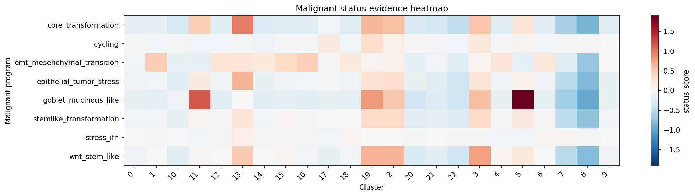
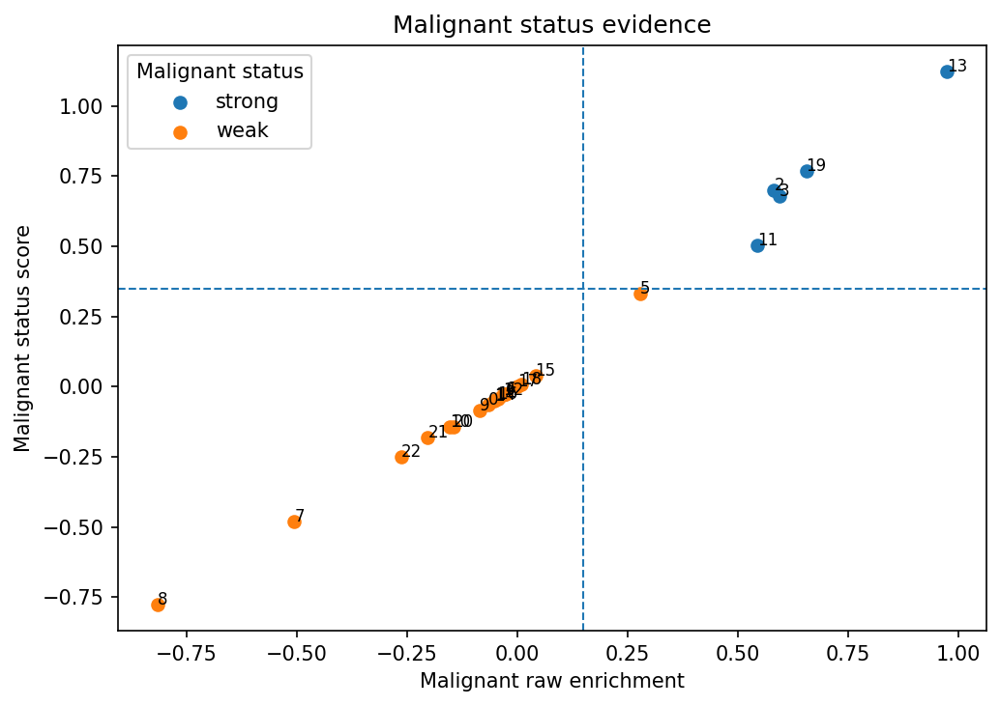
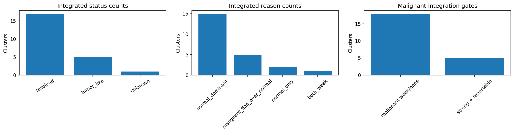
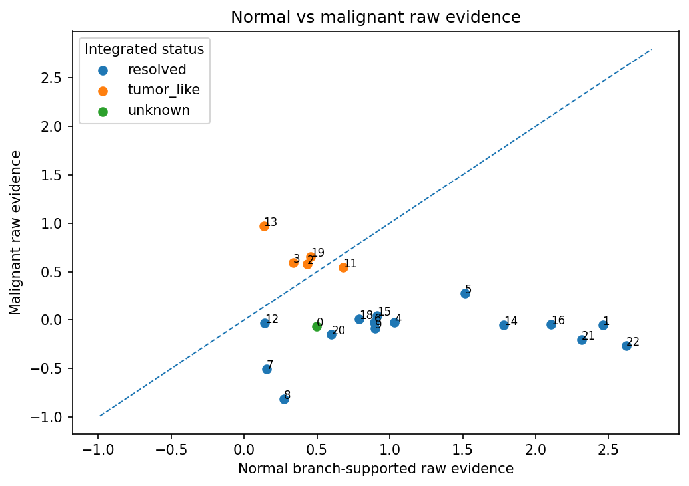

<style>
.table-scroll {
  max-width: 100%;
  max-height: 420px;
  overflow-x: auto;
  overflow-y: auto;
}

.table-scroll .table {
  margin-bottom: 0;
}
</style>

# Introduction

The first `HierAnnot` [post](https://nanostring-biostats.github.io/CosMx-Analysis-Scratch-Space/posts/auto-cluster-naming/){target="_blank"} introduced a structured way to assign normal lineage or cell-type labels to clusters. That workflow starts from a tissue-appropriate marker hierarchy and asks a lineage-routing question:

> Which normal hierarchy node best explains this cluster?

That question is essential, but it is not always enough. In tumor and disease datasets, a cluster may have a clear normal lineage identity and also show several biological programs at the same time. For example, a colon epithelial cluster can be tumor-like, stem-like, mesenchymal-shifted, cycling, and interferon-high. A fibroblast cluster can show fibrosis or wound-response programs. An immune cluster can be cytotoxic, exhausted, or IFN-high.

Those are **multi-state annotation** problems. They are related to cell identity, but they are not the same as lineage identity. A cluster does not need to choose between "tumor-like" and "cycling" or between "epithelial" and "IFN-high." Multiple programs can be active together.

`HierAnnot` therefore separates two tasks:

```text
Normal hierarchy track
    Assign a conservative lineage or cell-type identity.

Tumor / auxiliary program track
    Detect and report biological state programs that can coexist with the normal identity.
```

The tumor/auxiliary track was designed primarily for tumor-status annotation and tumor-like label integration. The same machinery can also be used in `flag_only` mode for non-tumor auxiliary programs such as cell cycle, stress, inflammation, or fibrosis.

This post focuses on the tumor/auxiliary program track. I use malignant status annotation as the primary example, but the same design supports broader multi-state annotation.

# The mental model: identity first, programs second

The normal hierarchy track and tumor/auxiliary track solve different problems.

The **normal hierarchy track** is a tree-routing problem. It uses marker enrichment, sibling competition, marker support, and branch support to decide how far to descend through a normal lineage hierarchy. The output is a normal identity label, with safeguards such as `mixed_*`, `candidate_*`, and `unknown` when the evidence is uncertain.

The **tumor/auxiliary program track** is a flat program-reporting problem. It scores marker programs in parallel, then reports them through a tiered interpretation layer.

The main intuition is:

```text
Normal hierarchy = "What is this cluster?"
Tumor/auxiliary track = "What programs are active in this cluster?"
```

For tumor annotation, the program track uses three reporting roles:

| Role | Purpose | Example programs | Can establish tumor-like identity? |
|---|---|---|---|
| `status` | Provides core evidence that a cluster is tumor-like | `core_transformation`, `stemlike_transformation`, `epithelial_tumor_stress` | Yes |
| `state` | Describes the tumor state when tumor-status evidence is present | `emt_mesenchymal_transition` | Not by itself |
| `modifier` | Adds auxiliary context | `cycling`, `stress_ifn` | No |

This keeps the tumor call conservative. A strong `cycling` or `stress_ifn` program can be useful to report, but it should not by itself convert a cluster into a tumor-like label. A strong tumor-status program can establish tumor-like identity; a strong state program can help name that tumor-like label or support a borderline tumor-status call. For a concrete example of a built-in tumor program track used by `HierAnnot`, see the example `tumor_colon` marker program set in @lst-tumor-colon-example.

::: {.callout-note collapse="true" title="Why this is not another hierarchy"}
It may be tempting to make tumor programs another hierarchy, but that would impose the wrong structure on the biology.

In a normal hierarchy, sibling nodes are often alternative identity choices. A cluster is more likely to be a T cell or a B cell, a fibroblast or an endothelial cell, a basal epithelial cell or a luminal epithelial cell. The routing logic is designed around that assumption.

Tumor and auxiliary programs can be co-active:

```text
core transformation + EMT/mesenchymal transition + cycling
stem-like tumor state + IFN/stress response
fibrotic program + wound response
```

These combinations are often biologically meaningful rather than ambiguous. Therefore, the tumor/auxiliary track scores marker programs in parallel and reports strong positives through a tiered interpretation layer instead of routing through a tree.

:::

{#fig-hierannot-tumor fig-alt="Two-track annotation design"}

# Working principles at a glance

The flow below summarizes the two-track design and how the final export label is produced.

```{mermaid}
flowchart TD
    A["Cluster-level expression"] --> B["Normal hierarchy track"]
    A --> C["Tumor / auxiliary program track"]

    B --> B1["Route normal hierarchy"]
    B1 --> B2{"Normal export class"}
    B2 --> N1["resolved"]
    B2 --> N2["mixed_*"]
    B2 --> N3["candidate_*"]
    B2 --> N4["unknown"]

    C --> C1["Score flat marker programs"]
    C1 --> C2["Tiered reporting"]
    C2 --> C3["status labels<br/>core_transformation / stemlike / stress"]
    C2 --> C4["state labels<br/>emt_mesenchymal"]
    C2 --> C5["modifier labels<br/>cycling / stress_ifn"]

    C3 --> D{"Combined tumor-status<br/>score passes?"}
    C4 --> D
    C5 --> E1["Report modifiers separately"]

    D -- "No" --> E2["Keep normal export label<br/>report program status separately"]
    D -- "Yes" --> F{"Integration mode"}

    F -- "flag_only" --> E2
    F -- "integrate" --> G{"Normal export class"}

    G -- "resolved" --> H["tumor_like_status_state.normal_label"]
    G -- "mixed_*" --> I["keep mixed_* primary<br/>store tumor-like diagnostic"]
    G -- "candidate_*" --> J["keep candidate_* primary<br/>store tumor-like diagnostic"]
    G -- "unknown" --> K["tumor_like_status_state.unknown<br/>if reportable"]

    E1 --> Z["Result tables and diagnostics"]
    E2 --> Z
    H --> Z
    I --> Z
    J --> Z
    K --> Z
```

The most important rule is that tumor-like integration is driven by **combined tumor-status evidence**. State programs can support or decorate tumor-status calls, but modifier programs remain diagnostic by default.

::: {.callout-note collapse="true" title="Under the hood: combined malignant-status scoring"}
The detailed cluster-level tumor/auxiliary decisions are stored in `result.malignant_annotations`, with one row per cluster. Program-level scores are stored in `result.malignant_scores`, with one row per cluster-program pair. The formulas below summarize how program-level evidence is converted into cluster-level tumor-status columns.

Similar to [the scoring of normal hierarchy](https://nanostring-biostats.github.io/CosMx-Analysis-Scratch-Space/posts/auto-cluster-naming/#raw-enrichment-score){target="_blank"}, 
`HierAnnot` computes a control-matched **raw enrichment score** for each cluster $c$ and marker program $p$ in auxiliary track using LogNormalized expression $x$:

$$
R_{c,p}=\overline{x}_{\text{positive markers}(p)}-\overline{x}_{\text{matched controls}(p)}-w_{\text{neg}}\overline{x}_{\text{negative markers}(p)}
$$

The raw score is then weighted by marker-detection support:

$$
A_{c,p} = R_{c,p} \cdot s_{c,p}
$$
where $s_{c,p}$ increases when more positive markers from program $p$ are detected in cluster $c$. In the result tables, $R_{c,p}$ is reported as `raw_score`, and $A_{c,p}$ is reported as `status_score`.

Programs are interpreted by role:

```text
status programs   -> establish tumor-like identity
state programs    -> describe or support tumor state
modifier programs -> auxiliary context only
```

The main tumor-status evidence comes from status programs:

$$
S_{\mathrm{core},c} = \max_{p \in P_{\mathrm{status}}} A_{c,p} + \mathrm{bonus}_{\mathrm{extra\ status},c}
$$

The first term captures the strongest tumor-status program. The bonus term is small and capped; it rewards additional strong status programs without requiring every tumor program to be active.

State programs contribute differently. They do not establish tumor-like identity by themselves. Instead, they can add a small support bonus only when core tumor-status evidence is already borderline:

$$
S_{\mathrm{state\ support},c}=\begin{cases}
\mathrm{small\ capped\ bonus}, & \text{if core status evidence is borderline and strong state evidence is present} \\
0, & \text{otherwise}
\end{cases}
$$

The final combined tumor-status score is:

$$
S_{\mathrm{combined},c} = S_{\mathrm{core},c} + S_{\mathrm{state\ support},c}
$$

This is reported as:

```text
annot_malignant_combined_status_score
annot_malignant_status_score
```
A cluster can pass the tumor-status gate in two ways.

**Direct core-status pass:**

$$
S_{\mathrm{core},c} \ge T_{\mathrm{status}}
\quad\text{and}\quad
R_{\mathrm{core},c} \ge T_{\mathrm{raw}}
$$

where $T_{\mathrm{status}}$ is `malignant_status_score_threshold` and $T_{\mathrm{raw}}$ is `malignant_raw_score_threshold`.

**State-supported pass:**

$$
S_{\mathrm{core},c} \approx T_{\mathrm{status}}
\quad\text{and}\quad
S_{\mathrm{combined},c} \ge T_{\mathrm{status}}
\quad\text{with strong state evidence}
$$

In words, a strong state program can help a near-threshold tumor-status call pass, but it cannot convert a cluster with no core tumor-status evidence into tumor-like.

The final pass flag is reported as:

```text
annot_malignant_tumor_status_pass
```

If this flag is true and the tumor program is reportable in the normal-lineage context, the cluster can receive an integrated tumor-like label when `malignant_integration_mode="integrate"`.

:::

# Running pipeline with auxillary track

## Illustration dataset

::: {.callout-note appearance="simple"}
To illustrate usage, this post uses a publicly available CosMx<sup>&#174;</sup> whole-transcriptomics single-slide dataset on human colon cancer FFPE tissue that you can download from the Bruker Spatial Biology [webpage](https://brukerspatialbiology.com/products/cosmx-spatial-molecular-imager/ffpe-dataset/){target="_blank"}.
Please refer to [earlier post](https://nanostring-biostats.github.io/CosMx-Analysis-Scratch-Space/posts/h5ad_conversion/){target="_blank"} on how to generate `AnnData` object from either post-analyzed `Seurat` object or the flat files exported by AtoMx<sup>&#174;</sup> SIP.
:::

For the code examples, assume we already have an `AnnData` object named `adata`. The object should contain expression data and a cluster assignment column:

```{python}
#| eval: false
import anndata as ad 

# read in anndata object and get the `obs` column with clusters
adata = ad.read_h5ad("path/to/data.h5ad")
cluster_key = "cluster"

# Minimal assumed inputs:
# - adata.layers["counts"]   (raw integer counts, required)
# - adata.obs["cluster"]     (cluster labels)
```

`HierAnnot` scores cluster-level expression profiles. We can aggregate the `AnnData` object to cluster means:

```{python}
#| eval: false
from hierannot import (
    aggregate_anndata_to_cluster_means, 
    HierAnnotPipeline, 
    make_cluster_annotation_export_summary,
)

cluster_means = aggregate_anndata_to_cluster_means(
    adata,
    cluster_key=cluster_key,
    source="layer",
    source_key="counts",
    method="mean",
    uppercase_genes=True,
)

cluster_means.head()
```

## Setup hierarhcy and auxiliary marker program set

`HierAnnot` provides several built-in marker-program sets for tumor-status annotation and auxiliary program scoring. These include broad solid-tumor programs, tissue-context tumor programs, and non-tumor auxiliary program sets for `flag_only` workflows. 
You can inspect the available sets and their recommended usage metadata with `list_builtin_marker_program_sets()`:

```{python}
#| eval: false
from hierannot import list_builtin_marker_program_sets

program_sets = list_builtin_marker_program_sets()
print(program_sets)
```
```{r tbl-marker-sets, message=FALSE, eval = TRUE, echo=FALSE, results ='asis'}
#| tbl-cap: "All built-in markger program sets returned by `list_builtin_marker_program_sets()`."
df <- read.csv("assets/builtin_marker_programs.csv")

cat('<div class="table-scroll">')
print(knitr::kable(df, format = "html", table.attr = 'class="table table-striped table-hover"'))
cat("</div>")
```

For the colon cancer example dataset, we will use a colon tissue microenvironment hierarchy `colon_tme` and a colon-specific tumor program set `tumor_colon`.

```{python}
#| eval: false
from hierannot import get_builtin_hierarchy, get_builtin_marker_program_set

# normal hierarchy 
root_programs = get_builtin_hierarchy("colon_tme")

# tumor program set, use `tumor_general` for generic solid-tumor programs shared across tissue types
tumor_programs = get_builtin_marker_program_set("tumor_colon")
```

You can visualize the structure and content of those programs using helper functions:

```{python}
#| code-fold: true
#| eval: false
from hierannot import (
  format_hierarchy_tree, format_marker_program_set, 
  summarize_marker_program_set
) 

# visualize the chosen hierarchy as a tree
print(format_hierarchy_tree(root_programs))

# visualize the tumor program set
print(format_marker_program_set(tumor_programs, title="tumor_colon"))

# get summary info for tumor program set 
program_summary = summarize_marker_program_set(tumor_programs)
print(program_summary[[
    "name",
    "reporting_role",
    "competition_group",
    "n_positive_markers",
    "description",
]])
```

::: {.panel-tabset}

### `tumor_colon` summary
```{r tbl-tumor-summary, message=FALSE, eval = TRUE, echo=FALSE, results ='asis'}
#| tbl-cap: "Program summary for built-in `tumor_colon` marker program set"
df <- read.csv("assets/tumor_colon_summary.csv")
df <- df[, c("name",
             "reporting_role",
             "competition_group",
             "n_positive_markers",
              "description")]

cat('<div class="table-scroll">')
print(knitr::kable(df, format = "html", table.attr = 'class="table table-striped table-hover"'))
cat("</div>")
```

### `tumor_colon` program set

Formatted text returned by `format_marker_program_set()` for built-in `tumor_colon` marker set.

```{#lst-tumor-colon-example lst-cap="Example built-in marker program set"}
tumor_colon: 8 programs

[status]
  competition_group: core_transformation
    - core_transformation (label=transformed; +9, -1)
      + markers: SOX9, KRT17, TACSTD2, CLDN4, MSLN, S100A14, LCN2, CEACAM5, ... (+1 more)
      report_on_lineages: Epithelial, ... (+40 more)
  competition_group: stemlike_transformation
    - stemlike_transformation (label=stemlike; +10, -1)
      + markers: PROM1, LGR5, ASCL2, OLFM4, SOX9, CD44, ALCAM, MSI1, ... (+2 more)
      report_on_lineages: Epithelial, ... (+40 more)
  competition_group: tumor_epithelial_stress
    - epithelial_tumor_stress (label=tumor_stress; +10, -1)
      + markers: KRT17, KRT6A, KRT6B, LCN2, S100A8, S100A9, SERPINB3, SERPINB4, ... (+2 more)
      report_on_lineages: Epithelial, ... (+40 more)

[state]
  competition_group: colon_subtype
    - goblet_mucinous_like (label=goblet_mucinous_like; +5, -1)
      + markers: MUC2, SPINK4, TFF3, AGR2, CLCA1
      report_on_lineages: Epithelial, ... (+40 more)
    - wnt_stem_like (label=wnt_stem_like; +5, -1)
      + markers: LGR5, ASCL2, SOX9, AXIN2, MYC
      report_on_lineages: Epithelial, ... (+40 more)
  competition_group: emt_mesenchymal
    - emt_mesenchymal_transition (label=emt_mesenchymal; +14, -1)
      + markers: VIM, FN1, ITGA5, ITGB1, ITGA6, ZEB1, ZEB2, SNAI1, ... (+6 more)
      report_on_lineages: Epithelial, ... (+40 more)

[modifier]
  competition_group: proliferation
    - cycling (label=cycling; +6, -0)
      + markers: MKI67, TOP2A, UBE2C, PCNA, TYMS, BIRC5
      report_on_lineages: Epithelial, ... (+40 more)
  competition_group: stress_ifn
    - stress_ifn (label=stress_ifn; +6, -0)
      + markers: STAT1, ISG15, IFIT1, IFIT3, MX1, OAS1
      report_on_lineages: Epithelial ... (+40 more)
```

### `colon_tme` hierarchy
Formatted tree returned by `format_hierarchy_tree()` for built-in `colon_tme` hierarchy.

```{#lst-colon-tme-example lst-cap="Example built-in hierarchy"}
- Intestinal epithelial (+6, -4, children=3)
  - Absorptive-like (+5, -1, children=0)
  - Goblet-like (+5, -1, children=0)
  - Stem/TA-like (+5, -1, children=0)
- Fibroblast (+5, -4, children=0)
- Endothelial (+5, -3, children=1)
  - Capillary endothelial (+5, -2, children=0)
- Mural (+5, -2, children=1)
  - Pericyte (+5, -6, children=0)
- Immune (+5, -2, children=6)
  - T cell (+5, -2, children=3)
    - CD4 T cell (+5, -2, children=0)
    - CD8 T cell (+5, -1, children=0)
    - Treg (+5, -2, children=0)
  - B cell (+5, -2, children=1)
    - Plasma cell (+5, -2, children=0)
  - NK cell (+5, -2, children=0)
  - Myeloid (+5, -2, children=3)
    - Macrophage (+5, -2, children=0)
    - Monocyte (+5, -2, children=0)
    - Dendritic cell (+5, -2, children=0)
  - Mast cell (+5, -2, children=0)
  - Neutrophil (+5, -2, children=0)
```
:::

## Choose how auxiliary-track labels interact with final labels

`HierAnnot` provides different modes for controlling how auxiliary-track labels interact with the final exported annotation. These modes are not sequential optimization steps; they are alternative workflows for different analysis goals.

The main control is `malignant_integration_mode`:

| Mode | Best for | Export label behavior |
|---|---|---|
| `off` | Standard normal hierarchy annotation without the auxiliary program track | Export labels are normal-hierarchy labels only; tumor/auxiliary programs are not scored |
| `flag_only` | Reviewing tumor/auxiliary program activity without changing normal labels; non-tumor auxiliary tracks | Normal hierarchy label remains primary; program calls are reported separately |
| `integrate` | Tumor-focused workflows where strong tumor-status evidence should appear in the final label | Strong, reportable tumor-status calls can produce `tumor_like_*` labels |

A second control is `program_report_block_preset`, which controls where tumor-like labels are allowed to be reported after normal hierarchy routing. In this post, we use the recommended solid-tumor default:

```python
#| eval: false
program_report_block_preset="tumor_reportable"
```

This preset allows reporting in curated tumor-reportable built-in lineages while guarding against common false positives in immune, stromal, endothelial, and mural compartments. 
For custom hierarchies or specialized workflows, use an exact block list or `"lineage_aware"` program metadata. For the complete option reference for integration modes, report-block presets, lineage-aware metadata, and export behavior, refer to the package [README](https://github.com/Nanostring-Biostats/CosMx-Analysis-Scratch-Space/tree/Main/_code/HierAnnot#auxillary-track-annotations){target="_blank"}.

The two sections below demonstrate the two most common workflows.

## Workflow A: flag-only multi-state annotation

In `flag_only` mode, the normal hierarchy still produces the export label. The tumor/auxiliary program track is scored and reported separately in `result.malignant_annotations`.

This mode is useful when the program track is a secondary layer of interpretation:

```text
Which clusters show tumor-status, state, or modifier evidence?
```

without changing the final cell-type labels.

```{python}
#| eval: false
pipeline_flag = HierAnnotPipeline(
    root_programs=root_programs,
    malignant_programs=tumor_programs,
    malignant_integration_mode="flag_only",
    program_report_block_preset="tumor_reportable",
)

result_flag = pipeline_flag.fit_score(cluster_means)
```

The normal hierarchy annotations are stored in `result.cluster_annotations`.

```{python}
#| code-fold: true
#| eval: false
hiera_cols = [
    "cluster_id",
    "annot_label",
    "annot_path",
    "annot_level",
    "annot_status",
    "annot_confidence",
    "annot_branch_supported_raw_score",
    "annot_final_call_margin"
]

result_flag.cluster_annotations[hiera_cols]
```

The tumor/auxiliary program summary is stored in `result.malignant_annotations`.

```{python}
#| code-fold: true
#| eval: false
malig_cols = [
    "cluster_id",
    "annot_malignant_status",
    "annot_malignant_label_concise",
    "annot_malignant_status_label",
    "annot_malignant_state_label",
    "annot_malignant_modifier_labels",
    "annot_malignant_tumor_status_pass",
    "annot_malignant_raw_score",
    "annot_malignant_status_score",
    "annot_malignant_status_decision_source",
]

result_flag.malignant_annotations[malig_cols]

## To inspect all strong programs for a given cluster in one field 
result_flag.malignant_annotations[["cluster_id", "annot_malignant_strong_programs"]]

## To inspect tumor-like clusters only 
result_flag.malignant_annotations.loc[
    result_flag.malignant_annotations["annot_malignant_tumor_status_pass"],
    malig_cols,
]

## To inspect clusters where state support helped a borderline tumor-status call pass
result_flag.malignant_annotations.loc[
    result_flag.malignant_annotations["annot_malignant_status_decision_source"]
    == "status_core_plus_state_support",
    malig_cols,
]
```

Although the current result table uses `malignant_*` column names, it is best to think of this table as the summary of the flat tumor/auxiliary program track.

Important columns include:

| Column | Meaning |
|---|---|
| `annot_malignant_status` | Overall strong/weak/none status for the tumor/auxiliary track |
| `annot_malignant_tumor_status_pass` | Whether combined tumor-status evidence passed the tumor-like gate |
| `annot_malignant_status_label` | Primary status label, such as `transformed` |
| `annot_malignant_state_label` | Selected state label, such as `emt_mesenchymal` |
| `annot_malignant_modifier_labels` | Modifier labels, such as `cycling` or `stress_ifn` |
| `annot_malignant_label_concise` | Compact label used if tumor-like integration is enabled |
| `annot_malignant_status_score` | Combined tumor-status score |
| `annot_malignant_raw_score` | Core status raw evidence |
| `annot_malignant_status_decision_source` | Whether the call came from core status alone or core status plus state support |

This table is intentionally richer than a single label. Multi-state annotation should preserve the distinction between status, state, and modifier programs.

In `flag_only` mode, tumor/auxiliary programs do not change the final export label.

```{python}
#| eval: false
export_flag = make_cluster_annotation_export_summary(result_flag)
```
```{python}
#| code-fold: true
#| eval: false
expr_cols = [
    "cluster_id",

    # final export label
    "annot_export_label",
    "annot_export_status",

    # normal hierarchy outcomes 
    "annot_label",
    "annot_confidence",

    # malignant flagging outcomes
    "annot_malignant_status",
    "annot_malignant_label_concise",
    "annot_export_malignant_flag"
]

export_flag[expr_cols]
```

The export label remains normal-hierarchy based. The tumor/auxiliary status can be used as an additional metadata field.

::: {.panel-tabset}

### `cluster_annotations`
```{r tbl-cluster-annot, message=FALSE, eval = TRUE, echo=FALSE, results ='asis'}
#| tbl-cap: "Example `cluster_annotations` results."
df <- read.csv("assets/cluster_annotations.csv")
colns <- c(
    "cluster_id",
    "annot_label",
    "annot_path",
    "annot_level",
    "annot_status",
    "annot_confidence",
    "annot_branch_supported_raw_score",
    "annot_final_call_margin")
df <- df[, colns]

cat('<div class="table-scroll">')
print(knitr::kable(df, format = "html", table.attr = 'class="table table-striped table-hover"'))
cat("</div>")
```

### `malignant_annotations`
```{r tbl-cluster-malig, message=FALSE, eval = TRUE, echo=FALSE, results ='asis'}
#| tbl-cap: "Example `malignant_annotations` results."
df2 <- read.csv("assets/malignant_annotations.csv")
colns2 <- c(
    "cluster_id",
    "annot_malignant_status",
    "annot_malignant_label_concise",
    "annot_malignant_status_label",
    "annot_malignant_state_label",
    "annot_malignant_modifier_labels",
    "annot_malignant_tumor_status_pass",
    "annot_malignant_raw_score",
    "annot_malignant_status_score",
    "annot_malignant_status_decision_source")
df2 <- df2[, colns2]

cat('<div class="table-scroll">')
print(knitr::kable(df2, format = "html", table.attr = 'class="table table-striped table-hover"'))
cat("</div>")
```

### Export labels in `flag_only` mode
```{r tbl-flagonly-export, message=FALSE, eval = TRUE, echo=FALSE, results ='asis'}
#| tbl-cap: "Example export labels in `flag_only` mode."
df3 <- read.csv("assets/cluster_export_flagOnly_leiden.csv")
colns3 <- c(
    "cluster_id",
    "annot_export_label",
    "annot_export_status",
    "annot_label",
    "annot_confidence",
    "annot_malignant_status",
    "annot_malignant_label_concise",
    "annot_export_malignant_flag")
df3 <- df3[, colns3]

cat('<div class="table-scroll">')
print(knitr::kable(df3, format = "html", table.attr = 'class="table table-striped table-hover"'))
cat("</div>")
```

:::

## Workflow B: integrated tumor annotation

Integrated mode combines annotations from both tracks into integrated labels. Use it when the desired final label should explicitly include strong reportable tumor-like status.

```{python}
#| eval: false
pipeline_integrated = HierAnnotPipeline(
    root_programs=root_programs,
    malignant_programs=tumor_programs,
    malignant_integration_mode="integrate",
    program_report_block_preset="tumor_reportable",
)

result_integrated = pipeline_integrated.fit_score(cluster_means)
```

The integrated annotation table, `result.integrated_annotations`, combines normal identity with tumor-status interpretation.

```{python}
#| code-fold: true
#| eval: false
integrated_cols = [
    "cluster_id",
    "annot_integrated_label",
    "annot_integrated_status",
    "annot_integrated_reason",
    "annot_label",
    "annot_malignant_status",
    "annot_malignant_label_concise",
    "annot_malignant_tumor_status_pass",
    "annot_malignant_reporting_blocked",
    "annot_malignant_status_score",
    "annot_malignant_raw_score",
]

result_integrated.integrated_annotations[integrated_cols]

## To inspect clusters whose reporting was blocked by lineage/reporting rules
result_integrated.integrated_annotations.loc[
    result_integrated.integrated_annotations["annot_malignant_reporting_blocked"],
    integrated_cols,
]
```

Resolved normal labels with strong reportable tumor-status evidence can become integrated labels such as:

```text
tumor_like_transformed.Intestinal epithelial
tumor_like_transformed_emt_mesenchymal.Absorptive-like
```

Normal-track safeguards are still respected in the export stage. For example, `mixed_*` or `candidate_*` labels can remain primary when they carry important normal-hierarchy uncertainty.

The export summary gives a concise table that can be joined back to `adata.obs`.

```{python}
#| eval: false
export_integrated = make_cluster_annotation_export_summary(result_integrated)
```
```{python}
#| code-fold: true
#| eval: false
expr_cols2 = [
    "cluster_id",

    # final export label
    "annot_export_label",
    "annot_export_status",

    # normal hierarchy outcomes 
    "annot_label",
    "annot_confidence",

    # malignant flagging outcomes
    "annot_malignant_status",
    "annot_malignant_label_concise",
    "annot_export_malignant_flag",

    # integrated label before applying other export rules 
    "annot_integrated_label",
    "annot_integrated_status",
]

export_integrated[expr_cols2]
```

Attach the final export label back to the original `AnnData` object:

```{python}
#| eval: false
final_col = "annot_export_label" # or "annot_export_label_with_cluster" 

label_map = export_integrated.set_index("cluster_id")[final_col]
adata.obs["hierannot_label"] = (
    adata.obs[cluster_key]
    .astype(label_map.index.dtype)
    .map(label_map)
    .fillna("unassigned")
)

# attach the tumor-like flag separately
tumor_flag_map = export_integrated.set_index("cluster_id")["annot_export_malignant_flag"]
adata.obs["hierannot_tumor_like"] = (
    adata.obs[cluster_key]
    .astype(tumor_flag_map.index.dtype)
    .map(tumor_flag_map)
    .fillna(False)
)
```

::: {.callout-note collapse="true" title="Export precedence with mixed, candidate, and unknown normal labels"}
In integration mode, the tumor/auxiliary track does not simply overwrite every normal hierarchy label.

The default export behavior is:

```text
resolved normal label + reportable tumor-like evidence
    -> use integrated tumor_like_* label

mixed_* normal label + reportable tumor-like evidence
    -> keep mixed_* label as primary
    -> store tumor-like label as diagnostic

candidate_* normal label + reportable tumor-like evidence
    -> keep candidate_* label as primary
    -> store tumor-like label as diagnostic

unknown normal label + reportable tumor-like evidence
    -> use tumor_like_*.unknown if tumor status is reportable
```

This is designed for sparse spatial data, where normal hierarchy safeguards such as mixed labels and candidate rescue often carry useful information.

:::

::: {.panel-tabset}

### `integrated_annotations`
```{r tbl-intgr-annot, message=FALSE, eval = TRUE, echo=FALSE, results ='asis'}
#| tbl-cap: "Example `integrated_annotations` results."
df <- read.csv("assets/integrated_annotations.csv")
colns <- c(
    "cluster_id",
    "annot_integrated_label",
    "annot_integrated_status",
    "annot_integrated_reason",
    "annot_label",
    "annot_malignant_status",
    "annot_malignant_label_concise",
    "annot_malignant_tumor_status_pass",
    "annot_malignant_reporting_blocked",
    "annot_malignant_status_score",
    "annot_malignant_raw_score")
df <- df[, colns]

cat('<div class="table-scroll">')
print(knitr::kable(df, format = "html", table.attr = 'class="table table-striped table-hover"'))
cat("</div>")
```

### Export labels in `integrate` mode
```{r tbl-integr-export, message=FALSE, eval = TRUE, echo=FALSE, results ='asis'}
#| tbl-cap: "Example export labels in `integrate` mode."
df3 <- read.csv("assets/cluster_export_integr_leiden.csv")
colns3 <- c(
    "cluster_id",
    "annot_export_label",
    "annot_export_status",
    "annot_label",
    "annot_confidence",
    "annot_malignant_status",
    "annot_malignant_label_concise",
    "annot_export_malignant_flag",
    "annot_integrated_label",
    "annot_integrated_status")
df3 <- df3[, colns3]

cat('<div class="table-scroll">')
print(knitr::kable(df3, format = "html", table.attr = 'class="table table-striped table-hover"'))
cat("</div>")
```

:::

### Diagnostic plots

`HierAnnot` includes plotting helpers for various diagnostic checks. See [README](https://github.com/Nanostring-Biostats/CosMx-Analysis-Scratch-Space/tree/Main/_code/HierAnnot#examples-and-diagnostic-plots){target="_blank"} and [examples](https://github.com/Nanostring-Biostats/CosMx-Analysis-Scratch-Space/blob/Main/_code/HierAnnot/examples/plot_diagnostics_from_bundle.py){target="_blank"} subfolder of the package for a complete list of all available diagnostic plots. 

```{python}
#| eval: false
from hierannot import (
    plot_malignant_score_heatmap,
    plot_malignant_status_scatter,
)

# same plot functions for `result_flag` and `result_integrated`

# Heatmap of malignant score shows which programs are active across clusters
plot_malignant_score_heatmap(result_flag)

# Scatter plot summarizes raw tumor-status evidence against combined status evidence 
# and helps identify strong, weak, and borderline calls.
plot_malignant_status_scatter(result_flag)
```

::: {.panel-tabset}

### Malignant score heatmap

{#fig-malig-score-heatmap fig-alt="heatmap of tumor-program status scores across clusters."}

### Scatter plot of malignant status evidence

{#fig-malig-status-scatter fig-alt="Scatter plot of malignant raw score vs combined status score, colored by malignant status."}

:::

In integrated mode, the most useful diagnostic plots focus on how the tumor/auxiliary track interacts with the normal hierarchy track.

```{python}
#| eval: false
from hierannot import (
    plot_integration_summary,
    plot_integration_raw_evidence,
)

# Summary bar plot for integrated annotation results
plot_integration_summary(result_integrated)

# Scatter plot of normal raw evidence against malignant raw evidence
plot_integration_raw_evidence(result_integrated)
```

::: {.panel-tabset}

### Integration summary bar plot

{#fig-integr-bar fig-alt="Summary bar plot showing integrated status counts, integration reasons, and blocked/reportable tumor calls."}

### Normal vs. maligant raw evidence 

{#fig-inegr-scatter fig-alt="Raw-evidence scatter plot showing normal hierarchy evidence versus tumor-status evidence."}

:::

These plots are useful for quickly seeing whether tumor-like integration is behaving as expected: which clusters were integrated, which were blocked, and whether tumor-status evidence is clearly separated from normal hierarchy evidence.

### Canonical marker sanity checks

`HierAnnot` provides a helper to collect positive marker genes from built-in hierarchies and marker program sets.

```{python}
#| eval: false
from hierannot import collect_positive_marker_genes

# get all marker genes as a list 
pos_mrk_genes = collect_positive_marker_genes(
    hierarchy="colon_tme", 
    # built-in hierarchy name or actual hierarchy `root_programs` 

    program_sets=["tumor_colon", "stress"],
    # built-in program set names 

    ## or pass in the actual list of flat marker programs 
    # programs = tumor_programs
)

heatmap_genes = [g for g in pos_mrk_genes if g in adata.var_names]

# you can use these markers to make a heatmap across clusters
import scanpy as sc
sc.pl.matrixplot(adata, heatmap_genes, groupby=cluster_key)
```

To keep track of where each gene came from what sources:

```{python}
#| eval: false
marker_table = collect_positive_marker_genes(
    hierarchy="colon_tme",
    program_sets=["tumor_colon", "stress"],
    return_format="dataframe", # default: "list"
)

marker_table.head()
```

```{r tbl-mrk-all, message=FALSE, eval = TRUE, echo=FALSE, results ='asis'}
#| tbl-cap: "Marker table for `colon_tme` hierarhcy and built-in marker program sets for `tumor_colon` and `stress`."
df <- read.csv("assets/marker_table_colon_tumor_stress.csv")

cat('<div class="table-scroll">')
print(knitr::kable(df, format = "html", table.attr = 'class="table table-striped table-hover"'))
cat("</div>")
```

## Non-tumor auxiliary program example

The same flat program track can be used for non-tumor programs. In that case, use `flag_only` mode so that auxiliary program status does not change the final export label.

For example, to score `stress` programs:

```{python}
#| eval: false
stress_programs = get_builtin_marker_program_set("stress")

pipeline_stress = HierAnnotPipeline(
    root_programs=root_programs,
    malignant_programs=stress_programs,
    malignant_integration_mode="flag_only",
    program_report_block_preset="off",
)

result_stress = pipeline_stress.fit_score(cluster_means)

# To inspect auxiliary annotation 
result_stress.malignant_annotations[
    [
        "cluster_id",
        "annot_malignant_status",
        "annot_malignant_label_concise",
        "annot_malignant_modifier_labels",
        "annot_malignant_strong_programs",
    ]
]

# score heatmap 
plot_malignant_score_heatmap(result_stress)
```

Here, `annot_malignant_label_concise` should be interpreted as the selected auxiliary program label, such as `hypoxia`, not necessarily a malignant tumor label.

{#fig-stress-score-heatmap fig-alt="heatmap of tumor-program status scores across clusters."}

# Conclusion

The tumor/auxiliary program track extends `HierAnnot` from lineage annotation to multi-state annotation.

The normal hierarchy track answers:

```text
What is this cluster's best-supported normal identity?
```

The tumor/auxiliary program track answers:

```text
Which tumor-like, state, modifier, or auxiliary marker programs are active?
```

For malignant annotation, the combined tumor-status score aggregates evidence across status programs, allows gated support from state programs, and keeps modifiers as diagnostic context. This lets `HierAnnot` report tumor-like labels when appropriate without treating every active biological program as a new cell identity.
For non-tumor auxiliary programs, `flag_only` mode provides the same program-status summary while keeping final export labels anchored to the normal hierarchy.

Together, this two-track design provides a compact final annotation while preserving the evidence needed to understand, audit, and extend the result.
