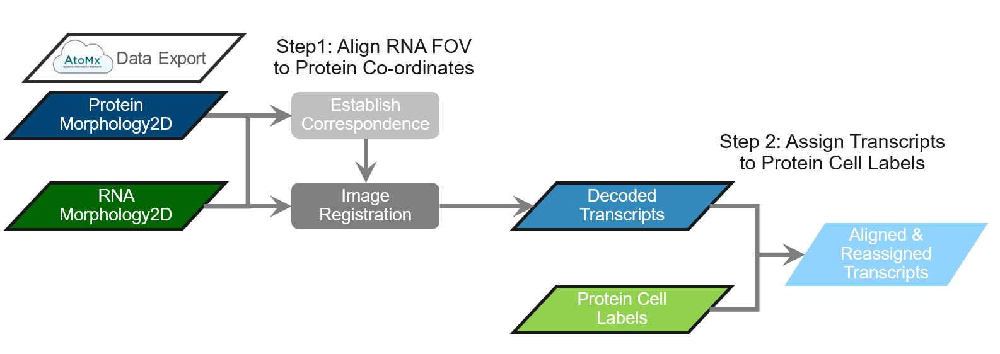
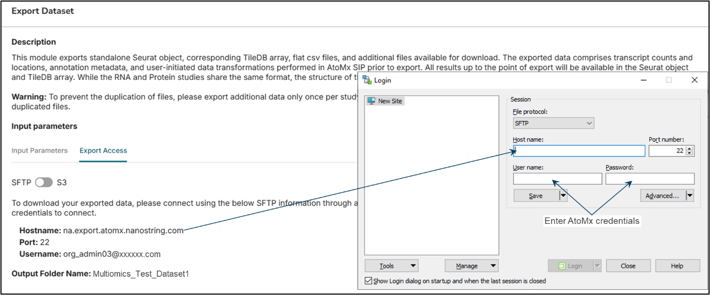
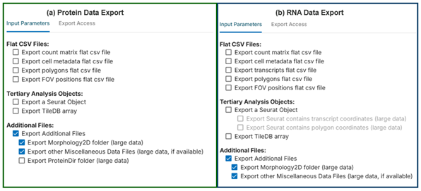
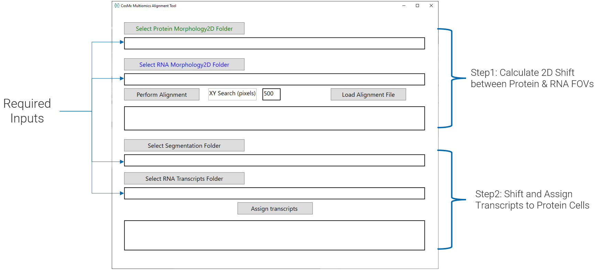
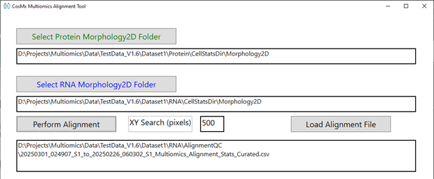

# CosMx Multiomics Data

CosMx<sup>&#174;</sup> SMI allows users to acquire protein and RNA data from the same tissue as consecutive experiments. These data are acquired as independent runs and therefore need to be aligned, post-acquisition, to combine them into a multiomic study. This alignment process brings the decoded RNA transcripts into the coordinate system of protein data. To accomplish this, we have developed a standalone alignment tool that can be used to align CosMx data exported from AtoMx<sup>&#174;</sup> SIP. The tool has a 2-step workflow represented in @fig-align-workflow:

Step 1: Align the RNA morphology fields of view (FOVs) to protein references.

Step 2: Assign the RNA transcripts to the protein cell segmentation labels.

```{r}
#| label: fig-align-workflow
#| fig-cap: "Multiomics alignment workflow"
#| out-width: "100%"
#| echo: false


```

:::{callout-note}
Like other items in our [CosMx Analysis Scratch Space](https://nanostring-biostats.github.io/CosMx-Analysis-Scratch-Space/about.html){target="_blank"},
the multiomics alignment tool presented here is experimental so the usual [caveats](https://nanostring-biostats.github.io/CosMx-Analysis-Scratch-Space/about.html){target="_blank"} and [license](https://nanostring-biostats.github.io/CosMx-Analysis-Scratch-Space/license.html){target="_blank"} applies.
:::

# Export CosMx Multiomics Data from AtoMx SIP

To export data from AtoMx SIP, you will need an sFTP application such as WinSCP. Launch the AtoMx Export function to obtain the AtoMx Hostname and Username (@fig-data-export, left). Use those credentials, with the AtoMx SIP user’s password, to open a WinSCP portal (@fig-data-export, right).

```{r}
#| label: fig-data-export
#| fig-cap: "Establishing export access between AtoMx SIP and WinSCP"
#| out-width: "100%"
#| echo: false

```


Next, export data from the protein experiment according to @fig-data-selection (a). Export data from the RNA experiment according to @fig-data-selection (b).

```{r}
#| label: fig-data-selection
#| fig-cap: "Data selection for (a) Protein and (b) RNA export from AtoMx SIP"
#| out-width: "100%"
#| echo: false

```


Check the exported data to confirm the following contents:

- Protein `CellStatsDir` folder and `Morphology2D` folder within

- RNA `CellStatsDir` folder and `Morphology2D` folder within

- RNA `AnalysisResults` folder

# Download and Use Alignment Tool

Download and unzip the `MultiO_Alignment_Tool_V1.4.1.zip` file available [here](https://bruker-my.sharepoint.com/:u:/p/s_korukonda/IQBavkxg6PHwQ5tbZnfxJAIjARtLulL57UkVRpxUihY3JzE?e=JLrBYi){target='_blank'}. Once the file has been unzipped, launch the tool by double-clicking the `MultiOAligmentUI.bat` file. The executable will launch an interactive graphical user interface (GUI) as shown in @fig-gui.

::: {.callout-note}
This multiomics alignment tool is actively and continuously under development in the RnD groups at
Bruker Spatial Biology. 
Please be aware that there may be bugs and that it has not gone through the regular
level of quality and testing. Our goal here is to bring the capabilities of multiomics
to CosMx SMI users as fast as possible.
For technical support, please contact support.spatial@bruker.com.
:::

```{r}
#| label: fig-gui
#| fig-cap: "Standalone multiomics alignment tool GUI"
#| out-width: "100%"
#| echo: false

```


## Step 1: Calculate 2D Shift

To launch image alignment, select the `Morphology2D` folders for both the protein and RNA runs and click `Perform Alignment`. The standard search area used for the alignment is by default 500 pixels or roughly 60 microns. This range is large enough to account for shifts introduced by slide replacement. This search area is editable and can be increased to 750 if the user suspects a larger shift (though adjustment is typically not needed – the software makes an assessment of search range need prior to alignment).

During alignment a new folder called `AlignmentQC` is created within the RNA data folder structure and is populated with the outputs from the alignment. Occasionally, certain FOVs may be discarded from the multiomic analysis if they fail alignment. This can happen in cases of tissue peeling or significant cell loss. These FOVs, identified as outliers, are recorded in the `Alignment_Stats_Curated.csv` file and are excluded from the transcript re-assignment process. Refer to @tbl-alignment-qc-outputs for a list of `AlignmentQC` folder outputs and descriptions of the individual files.

| AlignmentQC Folder Outputs | Description of individual files |
|---------|:-----|
| Alignment_Stats.csv      | List of the paired Protein and RNA FOVs along with the computed XY shift (in pixels) between them.   |
| FOV_mask.TIF     | Binary Map of the FOV Locations.  |
| FOV_Cluster.TIF       | Visualization of FOV Clusters.    |
| Displacement_Vectors.png | Visualization of the FOV displacement with marker outliers. |
| Alignment_Stats_Curated.csv | Updated Stats file with associated cluster label and outlier flag. |
| Stats_Report.txt | Reports the percentage of FOVs that were successfully aligned, along with a list of FOVs that failed alignment and were excluded from target re-assignment. |

: Folder outputs and descriptions {#tbl-alignment-qc-outputs tbl-colwidths="[40,60]"}

## Step 2: Shift and Assign Transcripts

Once the alignment process has been completed for all the FOVs, the path of the final alignment will appear in the GUI Alignment box (@fig-alignment-folders ). The user can review the computed alignment to verify accuracy of the results.

```{r}
#| label: fig-alignment-folders
#| fig-cap: "Alignment tool generates XY registration between the protein and RNA images"
#| out-width: "100%"
#| echo: false

```


Once the image registration is complete, the next step is to apply the computed shifts to transcripts and re-assign them to protein segmentation labels. For this step, select the Protein `CellStatsDir` and the location of the RNA transcripts folder (@fig-final-output ). If the original folder structure of export is maintained, these folders will be automatically populated when the RNA and protein morphology folders are selected. Once the inputs have been chosen, click `Assign transcripts` as shown in @fig-final-output (a).

```{r}
#| label: fig-final-output
#| fig-cap: "(a) Alignment tool shifts and re-assigns RNA transcripts to protein segmentation labels. (b) Final output fo the alignment."
#| out-width: "100%"
#| echo: false
knitr::include_graphics("./figures/Figure6.png")
```


For every FOV, the assignment process takes as input the calculated shift and applies it to the transcript locations and then updates the cell id based on the associated protein cell label data. Once the re-assignment is complete, the final output is a folder with the updated transcripts data as shown in @fig-final-output (b).

# Conclusions

After using the off-AtoMx alignment tool to apply protein cell segmentation boundaries and cell ID labels to the RNA data, you can use transcript-to-cell alignments found in the `*_FOV#####__complete_code_cell_target_call_coords.csv` per FOV files within the `AnalysisResults_shifted` folder to continue analysis with the aligned RNA dataset. For an example of how to gather the aligned RNA transcript information into an updated gene x cell expression matrix, see the post [here](../aligned_rna_exp_matrix/index.qmd). These updated files can be used alongside the protein run flat files to create a new multiomic data object. It’s important to note that all transcripts in the aligned RNA data will now reference the segmentation results and metadata from the protein run.

If you prefer to integrate the aligned RNA data into an existing data object, you can do so by starting with the protein run object and either replacing the protein expression matrix with an aligned RNA matrix or appending the RNA data as an additional assay.

::: {.callout-important}
Once the protein and RNA data are exported from AtoMx and modified through alignment, the updated data cannot be re-imported into AtoMx. As of AtoMx v2.2 and earlier, the platform retains only the original, pre-aligned data.
:::

