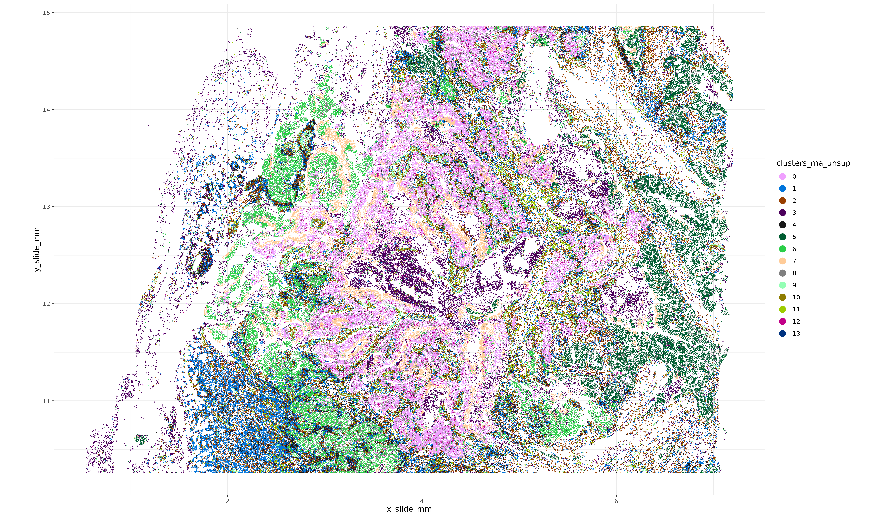
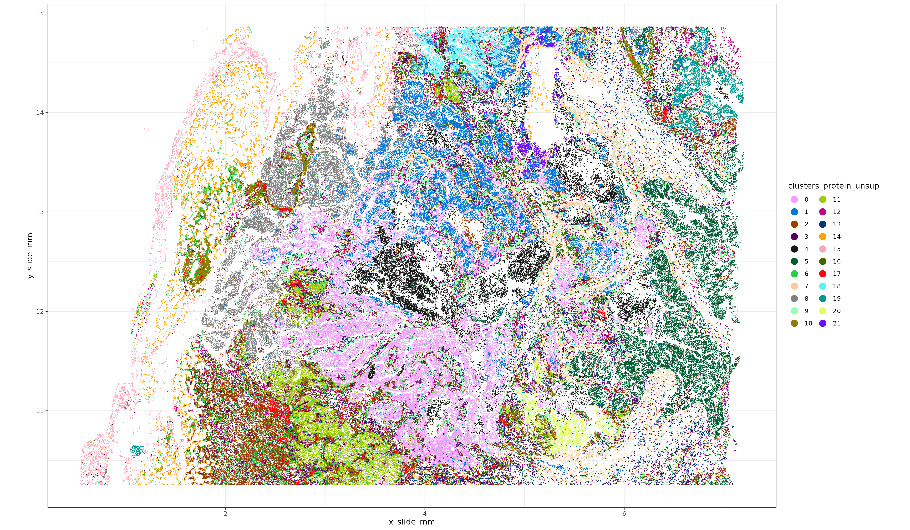

# Introduction

This post showcases how the [HieraType cell typing package](https://github.com/Nanostring-Biostats/CosMx-Analysis-Scratch-Space/tree/Main/_code/HieraType) can be used for integrated same-slide multiomic (protein + rna) cell typing.  

We use a breast cancer tissue sample with both 64-plex protein and WTx 18,935 plex RNA assayed, and demonstrate how cell typing can be performed using 

* both RNA + protein 
* protein-only
* RNA-only

We compare cell typing performance and show that, overall, protein-only and RNA-only cell typing calls show more disagreement with each other than they do with with integrated multiomic cell type calls.

We also demonstrate evidence of improved coherence of cell type labels with the defining marker genes and proteins when using an integrated approach that makes use of both analytes.

Finally, we show a simple yet effective way to integrate unsupervised clusters with supervised immune cell type labels generated with HieraType, to create allowing for identification of novel or tissue-specific cell types with well known immune cell types.

#  A quick look at the tissue

Here's a quick look at this breast cancer tissue, where unsupervised clustering was performed using both the pearson residual normalized RNA + protein.  Code for creating these unsupervised clusters is [here](#multiunsup).

```{r}
#| eval: true
#| echo: false
#| fig.show: "hold"
#| out-width: "6000px"

knitr::include_graphics("./figures/xyp_multi_unsup.png")
```


# Running HieraType using Protein + RNA

The code for using HieraType with protein data uses very similar syntax as a regular HieraType call, with a few exceptions worth calling out.

##### Protein naming convention

HieraType works from a set of pre-defined 'markers' which correspond to each cell type we hope to classify.  For multiomic or protein-only data, protein marker names must end with the suffix "_protein" in our `markerslist` objects.  
For example, here is the HieraType package multiomic markerslist for CD8 T cells (`cd8t`). 


```{r}
#| eval: false
#| echo: false

example_multi_markerslist <- utils::capture.output(print(
  HieraType::markerslist_multiomic_tcellmajor$cd8t
 ))
saveRDS(example_multi_markerslist, "figures/example_multi_markerslist.rds")

```
```{r}
#| eval: false
#| echo: true
print(HieraType::markerslist_multiomic_tcellmajor$cd8t)
```

```{r}
#| eval: true
#| echo: false

example_multi_markerslist <- readRDS("figures/example_multi_markerslist.rds")
message(paste(example_multi_markerslist, collapse = '\n'))

```

##### Protein data normalization and constructing a multiomic adjacency_matrix

Protein data should be normalized, then combined with a sparse un-normalized RNA counts matrix before passing to HieraType.
Here we'll use pearson residuals from a gamma regression model as a normalization method, although many reasonable methods are available.  We then add the "_protein" suffix to the protein names, so they'll align with the HieraType markerlists.
```{r}
#| eval: false
#| echo: true

## normalize each protein taking pearson residuals from gamma generalized linear model.
pgamm <- scPearsonPCA::pearson_normalize_gamma_glm(as.matrix(sem_protein[["RNA"]]@counts)
                                                   ,upper_q_thresh = 0.99
                                                   ,lower_q_thresh = 0.01
                                                   )
rownames(pgamm) <- paste0(rownames(pgamm), "_protein")
```

Here we conduct a principal component decomposition from combined RNA and proteins across all cells; this can be used to give us the cells x cells similarity graph we'll pass to HieraType.
```{r}
#| eval: false
#| echo: true

## select genes from RNA data to use for PCA analysis.
## Take the top 2k features as well as any pre-defined celltyping markers from HieraType
sem_rna <- Seurat::FindVariableFeatures(sem_rna, nfeatures = 2000)
markerg <- unlist(lapply(c(
  HieraType::markerslist_l1
  ,HieraType::markerslist_immune
  ,HieraType::markerslist_cd8tminor
  ,HieraType::markerslist_cd4tminor
  ,HieraType::markerslist_tcellmajor
), "[[", "predictors"))
use_genes <- unique(c(sem_rna@assays$RNA@var.features, intersect(markerg, rownames(sem_rna))))

### total counts and gene frequency from RNA data computed across full dataset
tc <- Matrix::colSums(sem_rna[["RNA"]]@counts)
genefreq <- scPearsonPCA::gene_frequency(sem_rna[["RNA"]]@counts)

# Multiomic RNA and Protein cluster analysis
pcaobj_multi <- scPearsonPCA::sparse_quasipoisson_pca_seurat_multiomic(sem_rna[["RNA"]]@counts[use_genes,]
                                                                       ,totalcounts = tc
                                                                       ,grate = genefreq[use_genes]
                                                                       ,xother = pgamm ## normalized protein
                                                                       ,do.scale = TRUE
                                                                       ,do.center = TRUE
                                                                       ,scale.max = 10
                                                                       ,ncores = 1
)

### Make a cell-cell adjacency matrix for HieraType 
multi_simgrph <- uwot::similarity_graph(pcaobj_multi$reduction.data@cell.embeddings
                                  ,n_neighbors = 30
                                  ,nn_method = "annoy"
                                  ,metric = 'cosine'
                                  )

```

##### HieraType call

Here we construct our .
We combine our normalized protein data and our sparse

```{r}
#| eval: false
#| echo: true


#### combining sparse RNA counts and normalized proteins into a single matrix 'multimat'
overlapping_cells <- intersect(colnames(sem_protein), colnames(sem_rna))
multimat <- Matrix::t(pgamm[,overlapping_cells])
multimat <- cbind(multimat, Matrix::t(sem_rna[["RNA"]]@counts[use_genes,overlapping_cells]))


### Define pipeline, using multiomic markerslists
pipeline_io_multiomics <- HieraType::make_pipeline(
  markerslists = list(
    "l1" = HieraType::markerslist_multiomic_l1
    ,"l2" = HieraType::markerslist_multiomic_immune
    ,"lt" = HieraType::markerslist_multiomic_tcellmajor
    ,"lt4minor" = HieraType::markerslist_multiomic_cd4tminor
    ,"lt8minor" = HieraType::markerslist_multiomic_cd8tminor
  )
  ,priors = list(
    "l2" = "l1"
    ,"lt" = "l2"
    ,"lt4minor" = "lt"
    ,"lt8minor" = "lt"
  )
  ,priors_category = list(
    "l2" = "immune"
    ,"lt" = "tcell"
    ,"lt4minor" = "cd4t"
    ,"lt8minor" = "cd8t"
  )
)

### Run the celltyping pipeline
multictobj <- HieraType::run_pipeline(
   pipeline = pipeline_io_multiomics
   ,totalcounts= tc[rownames(multimat)]
   ,gene_wise_frequency = genefreq
   ,counts_matrix = multimat 
   ,adjacency_matrix = simgrph[rownames(multimat), rownames(multimat)]
 )


```


# Main results

We compared the agreement between celltype predictions and canonical protein markers and RNA markers, and found that the multiomic cell type labels often show stronger alignment than [RNA-only](#rnaonly) or [protein-only](#proteinonly) cell typing.

### T cells 

For example, the figure below shows ROC curves for T cell predictions along with three canonical cell type markers for T cells (one protein, and two RNA).  If we treat our normalized marker expression as a gold standard for cell type calling, then we would want to see high sensitivity and specificity of the T cell calls depending on whether marker expression is high or low.  Below, as we might expect, we see that using  <span style="color:#377EB8;">RNA-only</span> for calling T cells does not optimize agreement between CD3 protein (AUC=0.867).  Unsurprisingly, agreement improves when using CD3 protein directly for celltyping (<span style="color:#4DAF4A;">protein-only</span> AUC=0.924).  In this case, we actually observed the best AUC when both RNA and protein were used  (<span style="color:#E41A1C;">multiomics</span> AUC=0.929).

A perhaps unsurprising theme that emerged from these cell typing comparisons was that we often see the worst agreement for protein markers when using RNA-only for celltyping, and the worst agreement for RNA markers when using protein-only for celltyping.  Meanwhile, using both RNA and protein analytes often yields the best or nearly-best agreement for both marker types.
This is further shown below in the middle-and-right panels when looking at TRBC1 and CD2 RNA markers.  <span style="color:#E41A1C;">Multiomic</span> celltyping outperforms protein-only, and is best or nearly-equal compared to  <span style="color:#377EB8;">RNA-only</span>.


```{r}
#| eval: true
#| echo: false
#| fig.show: "hold"
#| out-width: "6000px"

knitr::include_graphics("./figures/rocplot_tcell_lbl.png")
```

###  Improved AUC across immune cell types

```{r}
#| eval: true
#| echo: false
#| fig.show: "hold"
#| out-width: "6000px"

knitr::include_graphics("./figures/aucbarplot_wtext.png")
```


### Integrating 
```{r}
#| eval: true
#| echo: false
#| fig.show: "hold"
#| out-width: "6000px"

knitr::include_graphics("./figures/xyp_multi_unsup.png")
```


# End-to-end detailed analysis code

For completeness, here are a few end-to-end code blocks for each analysis step:

### Reading in the data
```{r}
#| eval: false
#| echo: true

library(ggplot2)
library(ggrepel)
library(data.table)
library(scPearsonPCA)
library(HieraType)
library(data.table)
library(pROC)

## Note, using a v3-style Seurat Object below, i.e., `sem[["RNA"]]@counts`
## For v5-style, the syntax would be like `sem[["RNA"]]$counts`
options(Seurat.object.assay.version = "v3")  

sem_protein <- readRDS("Breast/sem_protein.rds")
sem_rna <- readRDS("Breast/sem_rna.rds")
sem_rna <- subset(sem_rna, nCount_RNA >=100)


```

### Normalizing protein data

```{r}
#| eval: false
#| echo: true

## normalize each protein taking pearson residuals from gamma generalized linear model.
pgamm <- scPearsonPCA::pearson_normalize_gamma_glm(as.matrix(sem_protein[["RNA"]]@counts)
                                                   ,upper_q_thresh = 0.99
                                                   ,lower_q_thresh = 0.01
                                                   )

```

### Multiomic pearson residual PCA analysis using the protein and RNA


```{r}
#| eval: false
#| echo: true

## select genes from RNA data to use for PCA analysis.
## Will take the top 2k features as well as any pre-defined immune celltyping markers from HieraType
sem_rna <- Seurat::FindVariableFeatures(sem_rna, nfeatures = 2000)
markerg <- unlist(lapply(c(
  HieraType::markerslist_l1
  ,HieraType::markerslist_immune
  ,HieraType::markerslist_cd8tminor
  ,HieraType::markerslist_cd4tminor
  ,HieraType::markerslist_tcellmajor
), "[[", "predictors"))
use_genes <- unique(c(sem_rna@assays$RNA@var.features, intersect(markerg, rownames(sem_rna))))

### total counts and gene frequency from RNA data computed across full dataset
tc <- Matrix::colSums(sem_rna[["RNA"]]@counts)
genefreq <- scPearsonPCA::gene_frequency(sem_rna[["RNA"]]@counts)

### add a '_protein' suffix to the protein names - helps differentiate proteins and RNA's with the same name. 
rownames(pgamm) <- paste0(rownames(pgamm), "_protein")

### Principal components derived from the combined covariance matrix of pearson residual normalized RNA and protein.
### 
pcaobj_multi <- scPearsonPCA::sparse_quasipoisson_pca_seurat_multiomic(sem_rna[["RNA"]]@counts[use_genes,]
                                                                       ,totalcounts = tc
                                                                       ,grate = genefreq[use_genes]
                                                                       ,xother = pgamm ## normalized protein
                                                                       ,do.scale = TRUE
                                                                       ,do.center = TRUE
                                                                       ,scale.max = 10
                                                                       ,ncores = 1
)
```


```{r}
#| eval: true
#| echo: false

msg <- readRDS("figures/pca_multiomics_toppcs_msg.rds")
message(paste(msg, collapse = '\n'))
```


```{r}
#| eval: false
#| echo: true

### Make a cell-cell adjacency matrix for HieraType 
multi_simgrph <- uwot::similarity_graph(pcaobj_multi$reduction.data@cell.embeddings
                                  ,n_neighbors = 30
                                  ,nn_method = "annoy"
                                  ,metric = 'cosine'
                                  )

```

### Multiomic cell typing code using HieraType
```{r}
## Define the pipeline using multiomic markerlists in HieraType package


```


### Integrating unsupervised clusters with immune cell type labels
### RNA-only cell typing  
### protein-only cell typing  
### Making ROC curves, computing and plotting area under the curve

# Conclusion


The HieraType method constructs continuous celltype metagene scores, which are then probabilistically clustered to classify cell types.
Because these metagene scores are continuous and the clustering uses flexible gaussian mixture models, the inputted expression can be fluidly specified in terms of RNA markers, protein markers, or some combination of both.  This allows for an elegant and efficient solution for fully integrated celltyping when both protein and RNA are available.  
Overall, we found improved cell typing performance in the breast cancer sample analyzed in this post when both analytes were used compared to either analyte on its own.

While the HieraType method is fully supervised and cannot identify novel cell types not specified in a '`markerslist`',  we demonstrate an easy approach for integrating unsupervised clusters with HieraType immune cell typing calls, enabling high resolution cell typing for both immune cell types as well as epithelial or tissue context specific cell types which may not have a known marker profile a priori.
This can help reap benefits of both unsupervised and supervised approaches - well controlled pre-specified immune cell typing combined with granular unsupervised epithelial clusters.


We recommend an approach for constructing the adjacency matrix. Derived from smoothed nearest neighbors using pearson residual normalized data. The package xxx cna be used to    for best practices on constructing 


For in-depth description of the cell typing method HieraType please check out this [post](https://nanostring-biostats.github.io/CosMx-Analysis-Scratch-Space/posts/immune-cell-typing-smooth).

# Quick look at the tissue:

Let's start by taking an initial look at our data.  We can visualize some unsupervised leiden clustering we've already performed which used both the Protein + RNA together.  (If interested)
```{r}
make_umap <- function(pcaobj, min_dist=0.01, n_neighbors=30, metric="cosine",key ="UMAP_" ){
  ump <- 
    uwot::umap(pcaobj$reduction.data@cell.embeddings
               ,n_neighbors = n_neighbors
               ,nn_method = "annoy"
               ,metric = metric
               ,min_dist = min_dist
               ,ret_extra = c("fgraph","nn")
               ,verbose = TRUE)
  
  umpgraph <- ump$fgraph
  dimnames(umpgraph) <- list(rownames(ump$nn[[1]]$idx), rownames(ump$nn[[1]]$idx))
  colnames(ump$embedding) <- paste0(key, c(1,2)) 
  ump <- Seurat::CreateDimReducObject(embeddings = ump$embedding, key = key)
  return(list(grph = umpgraph
              ,ump = ump))
}

```
```{r load_libraries, message=FALSE, eval = FALSE}
library(ggplot2)
library(ggrepel)
library(data.table)
library(scPearsonPCA)
library(HieraType)
```
```{r,eval=TRUE,message=FALSE, echo=FALSE}
library(data.table)
```


```{r , message=FALSE, eval = FALSE}

## Note, using a v3-style Seurat Object below, i.e., `sem[["RNA"]]@counts`
## For v5-style, the syntax would be like `sem[["RNA"]]$counts`
options(Seurat.object.assay.version = "v3")  

```

```{r}
#| eval: true
#| echo: false
#| message: false


#setwd("~/data/dan/scratch_space/CosMx-Analysis-Scratch-Space/posts/immune-cell-typing-smooth")
devtools::load_all("~/data/dan/imputation_smoothing/HieraType_dev", export_all = FALSE)
devtools::load_all("~/data/dan/scPearsonPCA", export_all = FALSE)
```


#### Unsupervised clusters using PCA on combined Protein + RNA data 
```{r}
#| eval: false
#| echo: true

xyp_multi_unsup <- xyplot("clusters_multi_unsup", metadata = sem_rna@meta.data, ptsize = 0.05) + coord_fixed()
print(xyp_multi_unsup)
```

```{r}
#| eval: false
#| echo: false

library(ggplot2)
library(ggrepel)
library(RColorBrewer)
library(data.table)


sem_protein <- readRDS("~/data/multiomics_hackathon/Breast/sem_protein.rds")
sem_rna <- readRDS("~/data/multiomics_hackathon/Breast/sem_rna.rds")
sem_rna <- subset(sem_rna, nCount_RNA >=100)

```


# Multiomic (RNA + Protein cell typing)

# Protein-only cell typing

# RNA-only cell typing


# Integrating unsupervised clusters with HieraType immune cell calls


# Quick links to the code


For those in a hurry to 'just see the code', they can jump ahead to the "Just The Code" sections for [Example 1](#tldr), or [Example 2](#tldr2).


### 
```{r}
#| eval: false
#| echo: true

sem_protein <- readRDS("Breast/sem_protein.rds")
sem_rna <- readRDS("Breast/sem_rna.rds")
sem_rna <- subset(sem_rna, nCount_RNA >=100)

pgamm <- scPearsonPCA::pearson_normalize_gamma_glm(sem_protein[["RNA"]]@counts, upper_q_thresh = 0.99)


sem_rna <- Seurat::FindVariableFeatures(sem_rna, nfeatures = 2000)
markerg <- unlist(lapply(c(
                 HieraType::markerslist_l1
                 ,HieraType::markerslist_immunemajor
                 ,HieraType::markerslist_cd8tminor
                 ,HieraType::markerslist_cd4tminor
                 ,HieraType::markerslist_tcellmajor
  ), "[[", "predictors"))
#use_genes <- unname(unlist(lapply(HieraType::markerslist_immune, "[[", "predictors")))
use_genes <- unique(c(sem_rna@assays$RNA@var.features, intersect(markerg, rownames(sem_rna))))


tc <- Matrix::colSums(sem_rna[["RNA"]]@counts)
genefreq <- scPearsonPCA::gene_frequency(sem_rna[["RNA"]]@counts)
pcaobj <- scPearsonPCA::sparse_quasipoisson_pca_seurat(sem_rna[["RNA"]]@counts[use_genes,]
                                                              ,totalcounts = tc
                                                              ,grate = genefreq[use_genes]
                                                              ,do.scale = TRUE
                                                              ,do.center = TRUE
                                                              ,scale.max = 10
                                                              ,ncores = 1
                                                              )


umapobj <- make_umap(pcaobj)
saveRDS(pcaobj, "data/pcaobj_rna.rds")
saveRDS(umapobj, "data/umapobj_rna.rds")

pcaobj <- readRDS("data/pcaobj_rna.rds")
umapobj <- readRDS("data/umapobj_rna.rds")


sem_rna[["pca"]] <- pcaobj$reduction.data
sem_rna[["umap"]] <- umapobj$ump
sem_rna[["umapgrph"]] <- Seurat::as.Graph(umapobj$grph)
sem_rna <- Seurat::FindClusters(sem_rna, graph.name="umapgrph")
sem_rna@meta.data$clusters_rna_unsup <- sem_rna@meta.data$seurat_clusters

fwrite(data.table(sem_rna@meta.data)[,.(cell_ID, clusters_rna_unsup)], file = "data/clusters_rna_unsup.csv")
clusters_rna_unsup <- fread("data/clusters_rna_unsup.csv")
sem_rna <- Seurat::AddMetaData(sem_rna, metadata = data.frame(clusters_rna_unsup[,.(clusters_rna_unsup = as.character(clusters_rna_unsup))], row.names = clusters_rna_unsup$cell_ID))

xyp_rna_unsup <- xyplot("clusters_rna_unsup", metadata = sem_rna@meta.data, ptsize = 0.05) + coord_fixed()

ggsave("figures/xyp_rna_unsup.png"
       ,plot=xyp_rna_unsup
       ,device = "png"
       ,width = 1181 * sqrt(20)
       ,height=689 * sqrt(20)
       ,units = 'px'
       )
```

#### Unsupervised clusters using RNA:
```{r}
#| eval: false
#| echo: false
#| fig.show: "hold"
#| out-width: "6000px"


```

#### Unsupervised clusters using Protein:
```{r}
#| eval: false
#| echo: false
#| fig.show: "hold"
#| out-width: "6000px"


```

#### Unsupervised clusters using PCA on combined Protein + RNA data 

```{r}
#| eval: false
#| echo: false
#| fig.show: "hold"
#| out-width: "6000px"

knitr::include_graphics("./figures/xyp_multi_unsup.png")
```

All of these make for a pretty picture.  

#### HieraType cell typing


```{r}
#| eval: false
#| echo: false


fc_rna_unsup <- 
clusterwise_foldchange_metrics(sem_rna[["RNA"]]@counts[use_genes,]
                               ,totalcounts = tc
                               ,metadata = sem_rna@meta.data
                               ,cluster_column = "clusters_rna_unsup")
fwrite(fc_rna_unsup, "data/fc_rna_unsup.csv")
fc_rna_unsup <- fread("data/fc_rna_unsup.csv")
marker_heatmap(fc_rna_unsup, topn = 3)

fc_rna_unsup_on_prot <- 
clusterwise_foldchange_metrics2(sem_protein[["RNA"]]@counts
                                ,propd = pgamm
                               ,metadata = sem_rna@meta.data
                               ,cluster_column = "clusters_rna_unsup")

fwrite(fc_rna_unsup_on_prot, "data/fc_rna_unsup_on_prot.csv")
marker_heatmap(fc_rna_unsup_on_prot, topn = 3)

hmrna <- marker_heatmap(fc_rna_unsup, topn = 3)
cowplot::plot_grid(hmrna
                   ,marker_heatmap(fc_rna_unsup_on_prot, clusterorder = levels(hmrna$data$cluster),topn=3)
                   , nrow=2)


sem_protein <- Seurat::SetAssayData(sem_protein , layer = "data", new.data = pgamm)
sem_protein <- Seurat::ScaleData(sem_protein)
sem_protein <- Seurat::RunPCA(sem_protein, features = rownames(sem_protein))

#sem_protein[["umap"]] <- 


umapobj_protein <- make_umap(list(reduction.data = sem_protein@reductions$pca))
sem_protein[["umap"]] <- umapobj_protein$ump
sem_protein[["umapgrph"]] <- Seurat::as.Graph(umapobj_protein$grph)
sem_protein <- Seurat::FindClusters(sem_protein, graph.name="umapgrph")
sem_protein@meta.data$clusters_protein_unsup <- sem_protein@meta.data$seurat_clusters


fwrite(data.table(sem_protein@meta.data)[,.(cell_ID, clusters_protein_unsup)], file = "data/clusters_protein_unsup.csv")


saveRDS(list(reduction.data = sem_protein@reductions$pca), "data/pcaobj_protein.rds")
saveRDS(umapobj_protein, "data/umapobj_protein.rds")

umapobj_protein <-  readRDS("data/umapobj_protein.rds")
sem_protein[["pca"]] <- readRDS("data/pcaobj_protein.rds")[["reduction.data"]]
sem_protein[["umap"]] <- umapobj_protein$ump
sem_protein[["umapgrph"]] <- Seurat::as.Graph(umapobj_protein$grph)
clusters_protein_unsup <- fread("data/clusters_protein_unsup.csv")

sem_protein <- Seurat::AddMetaData(sem_protein, metadata = data.frame(clusters_protein_unsup[,.(clusters_protein_unsup = as.character(clusters_protein_unsup))], row.names = clusters_protein_unsup$cell_ID))


#pgamm_prot <- pgamm
rownames(pgamm) <- paste0(rownames(pgamm), "_protein")


pcaobj_multi <- scPearsonPCA::sparse_quasipoisson_pca_seurat_multiomic(sem_rna[["RNA"]]@counts[use_genes,]
                                                                       ,totalcounts = tc
                                                                       ,grate = genefreq[use_genes]
                                                                       ,xother = pgamm
                                                                       ,do.scale = TRUE
                                                                       ,do.center = TRUE
                                                                       ,scale.max = 10
                                                                       ,ncores = 1
)

msg <- utils::capture.output(print(
   x = pcaobj_multi$reduction.data,
   dims = 1:5,
   nfeatures = 30
 ))
saveRDS(msg, "figures/pca_multiomics_toppcs_msg.rds")

umapobj_multi <- make_umap(pcaobj_multi)
saveRDS(pcaobj_multi, "data/pcaobj_multi.rds")
saveRDS(umapobj_multi, "data/umapobj_multi.rds")


sem_rna[["umapmulti"]] <- umapobj_multi$ump
sem_rna[["multigrph"]] <- Seurat::as.Graph(umapobj_multi$grph[colnames(sem_rna),colnames(sem_rna)])

sem_rna <- Seurat::FindClusters(sem_rna, graph.name="multigrph")
sem_rna@meta.data$clusters_multi_unsup <- sem_rna@meta.data$seurat_clusters
fwrite(data.table(sem_rna@meta.data)[,.(cell_ID, clusters_multi_unsup)], file = "data/clusters_multi_unsup.csv")

xyp_multi_unsup <- xyplot("clusters_multi_unsup", metadata = sem_rna@meta.data, ptsize = 0.05) + coord_fixed()

ggsave("figures/xyp_multi_unsup.png"
       ,plot=xyp_multi_unsup
       ,device = "png"
       ,width = 1181 * sqrt(20)
       ,height=689 * sqrt(20)
       ,units = 'px'
       )


xyp_protein_unsup <- xyplot("clusters_protein_unsup", metadata = sem_protein@meta.data, ptsize = 0.05) + coord_fixed()

ggsave("figures/xyp_protein_unsup.png"
       ,plot=xyp_protein_unsup
       ,device = "png"
       ,width = 1181 * sqrt(20)
       ,height=689 * sqrt(20)
       ,units = 'px'
       )


overlapping_cells <- intersect(colnames(sem_protein), colnames(sem_rna))

use_genes <- rownames(pcaobj$reduction.data@feature.loadings)
multimat <- Matrix::t(pgamm[,overlapping_cells])
multimat <- cbind(multimat, Matrix::t(sem_rna[["RNA"]]@counts[use_genes,overlapping_cells]))


pipeline_io_multiomics <- HieraType::make_pipeline(
  markerslists = list(
    "l1" = HieraType::markerslist_multiomic_l1
    ,"l2" = HieraType::markerslist_multiomic_immune
    ,"lt" = HieraType::markerslist_multiomic_tcellmajor
    #,"lt" =markerslist_multiomic_tcellmajor
    ,"lt4minor" = HieraType::markerslist_multiomic_cd4tminor
    ,"lt8minor" = HieraType::markerslist_multiomic_cd8tminor
  )
  ,priors = list(
    "l2" = "l1"
    ,"lt" = "l2"
    ,"lt4minor" = "lt"
    ,"lt8minor" = "lt"
  )
  ,priors_category = list(
    "l2" = "immune"
    ,"lt" = "tcell"
    ,"lt4minor" = "cd4t"
    ,"lt8minor" = "cd8t"
  )
)


multictobj <- HieraType::run_pipeline(
  pipeline = pipeline_io_multiomics
  ,counts_matrix = multimat
  ,totalcounts = 
  ,adjacency_matrix = umapobj_multi$grph[rownames(multimat), rownames(multimat)]
  #,storage
)
saveRDS(multictobj, "data/multictobj_multigrph.rds")

multictobj <- HieraType::run_pipeline(
  pipeline = pipeline_io_multiomics
  ,counts_matrix = multimat
  ,adjacency_matrix = umapobj_multi$grph[rownames(multimat), rownames(multimat)]
  #,storage
)
saveRDS(multictobj, "data/multictobj_multigrph.rds")

multictobj2 <- HieraType::run_pipeline(
  pipeline = pipeline_io_multiomics
  ,totalcounts= tc
  ,gene_wise_frequency = genefreq
  ,counts_matrix = multimat
  ,adjacency_matrix = umapobj_multi$grph[rownames(multimat), rownames(multimat)]
  #,storage
)
saveRDS(multictobj2, "data/multictobj2_multigrph.rds")


rnactobj2 <- HieraType::run_pipeline(
  pipeline = pipeline_io_multiomics
  ,totalcounts= tc
  ,gene_wise_frequency = genefreq
  ,counts_matrix = multimat[,use_genes]
  ,adjacency_matrix = umapobj$grph[rownames(multimat), rownames(multimat)]
  #,storage
)
saveRDS(rnactobj2, "data/rnactobj2_multigrph.rds")


pipeline_io_protein <- pipeline_io_multiomics
pipeline_io_protein$markerslists$l2$mast <- NULL
pipeline_io_protein$markerslists$lt4minor <- NULL
pipeline_io_protein$markerslists$lt8minor <- NULL
lapply(pipeline_io_protein$markerslists, function(xx){
  lapply(xx, "[[")
})

for(ii in names(pipeline_io_protein$markerslists)){
  print(pipeline_io_protein$markerslists[[ii]])
  browser()
  
}

proteinctobj2 <- HieraType::run_pipeline(
  pipeline = pipeline_io_protein
  ,totalcounts= tc
  ,gene_wise_frequency = genefreq
  ,counts_matrix = multimat[,grep("_protein$",colnames(multimat),value=TRUE)]
  ,adjacency_matrix = umapobj_protein$grph[rownames(multimat), rownames(multimat)]
  #,storage
)
saveRDS(proteinctobj2, "data/proteinctobj2_multigrph.rds")


#multictobj_full <- readRDS("MOM_10/multictobj2.rds")
#multictobj <- readRDS("MOM_10_subset/multictobj1.rds")

### Combining metadata
ppmulti <- copy(multictobj$post_probs$l1)
ppmulti[,celltype_multi_major:=celltype_granular]
ppmulti[grepl("cd4",celltype_multi_major),celltype_multi_major:="cd4_tcell"]
ppmulti[grepl("cd8",celltype_multi_major),celltype_multi_major:="cd8_tcell"]
ppmulti[grepl("mono|macro",celltype_multi_major),celltype_multi_major:="macrophage_monocyte"]
ppmulti[,.N,by=.(celltype_multi_major, celltype_granular)]

ppmulti <- merge(ppmulti, data.table(sem_rna@meta.data)[,.(cell_ID, x_slide_mm, y_slide_mm, clusters_multi_unsup, clusters_rna_unsup)], by = "cell_ID")
ppmulti <- merge(ppmulti, data.table(sem_protein@meta.data)[,.(cell_ID, clusters_protein_unsup)], by = "cell_ID")

ppmulti[,celltype_multi_semi:=celltype_multi_major]
ppmulti[celltype_multi_semi %in% c("plasma", "endothelial", "epithelial", "fibroblast", "smooth_muscle"),celltype_multi_semi:=clusters_multi_unsup]
ppmulti[,.N,by=.(clusters_multi_unsup, celltype_multi_major)]
class_other <- ppmulti[,.N,by=.(clusters_multi_unsup, celltype_multi_major)][,prop:=N/sum(N),by=.(clusters_multi_unsup)][order(-prop)][
  ,head(.SD,1),by=.(clusters_multi_unsup)]
others <- class_other[!celltype_multi_major %in% c("plasma", "endothelial", "epithelial", "fibroblast", "smooth_muscle")][["clusters_multi_unsup"]]
ppmulti[celltype_multi_semi %in% others, celltype_multi_semi:="other"]


```

Protein-only, RNA-only, and Multiomic cell typing.
```{r}
#| eval: false
#| echo: false


### Marker metrics
fc_multi_on_rna <- 
clusterwise_foldchange_metrics(sem_rna[["RNA"]]@counts[use_genes,]
                               ,totalcounts = tc
                               ,metadata = ppmulti
                               ,cluster_column = "celltype_multi_major"
                               )

#add_ncells(marker_heatmap(fc_multi_rnamajor, extras = c("")))


rownames(pgamm) <- gsub("_protein$","", rownames(pgamm))
fc_multi_on_prot <- 
  clusterwise_foldchange_metrics2(sem_protein[["RNA"]]@counts[,overlapping_cells]
                                  ,propd = pgamm[,overlapping_cells]
                                  ,metadata = ppmulti[match(overlapping_cells,cell_ID)]
                                  ,cluster_column = "celltype_multi_major"
  )
#add_ncells(marker_heatmap(fc_multi_common_prot))

#fc_multi_on_prot <- data.table::copy(fc_multi_common_prot)
#fc_multi_on_rna <- data.table::copy(fc_multi_rnamajor)
#fc_protein_on_prot <- data.table::copy(fc_protein_common_prot)
#fc_protein_on_rna <- data.table::copy(fc_protein_rnamajor)
#fc_rna_on_prot <- data.table::copy(fc_rna_common_prot)
#fc_rna_on_rna <- data.table::copy(fc_rna_rnamajor)


fwrite(fc_multi_on_prot, "data/fc_multi_on_prot.csv")
fwrite(fc_multi_on_rna, "data/fc_multi_on_rna.csv")
fwrite(fc_rna_on_prot, "data/fc_rna_on_prot.csv")
fwrite(fc_rna_on_rna, "data/fc_rna_on_rna.csv")
fwrite(fc_protein_on_prot, "data/fc_protein_on_prot.csv")
fwrite(fc_protein_on_rna, "data/fc_protein_on_rna.csv")

vm <- marker_heatmap(fc_multi_on_prot)
vp <- marker_heatmap(fc_protein_on_prot, geneorder = levels(vm$data$gene)
                                ,featsuse = levels(vm$data$gene)
                                ,orient_diagonal = FALSE
                                ,clusterorder = levels(vm$data$cluster)
                                )
add_ncells(vm)
add_ncells(vp)

fc_rna_on_rna <- 
clusterwise_foldchange_metrics(sem_rna[["RNA"]]@counts[use_genes,]
                               ,totalcounts = tc
                               ,metadata = ppmulti
                               ,cluster_column = "celltype_rna_major"
                               )

add_ncells(marker_heatmap(fc_rna_rnamajor))


rownames(pgamm) <- gsub("_protein$","", rownames(pgamm))
fc_rna_on_prot <- 
  clusterwise_foldchange_metrics2(sem_protein[["RNA"]]@counts[,overlapping_cells]
                                  ,propd = pgamm[,overlapping_cells]
                                  ,metadata = ppmulti[match(overlapping_cells,cell_ID)]
                                  ,cluster_column = "celltype_rna_major"
  )
add_ncells(marker_heatmap(fc_rna_common_prot))


fc_protein_on_rna <- 
clusterwise_foldchange_metrics(sem_rna[["RNA"]]@counts[use_genes,]
                               ,totalcounts = tc
                               ,metadata = ppmulti
                               ,cluster_column = "celltype_protein_major"
                               )

add_ncells(marker_heatmap(fc_protein_rnamajor))


rownames(pgamm) <- gsub("_protein$","", rownames(pgamm))
fc_protein_on_prot <- 
  clusterwise_foldchange_metrics2(sem_protein[["RNA"]]@counts[,overlapping_cells]
                                  ,propd = pgamm[,overlapping_cells]
                                  ,metadata = ppmulti[match(overlapping_cells,cell_ID)]
                                  ,cluster_column = "celltype_protein_major"
  )


```

Adjusted Rank Index (ARI) is a metric used to quantify the agreement between two pairs of labels.  [cite ]
We can use this metric to compare "multiomic" vs. "rna-only", "multiomic vs. protein-only" and "protein-only vs. rna-only" cell typing.
ARI ranges between 0 (none) and 1 (all labels are the same).  We see that multiomic cell typing agrees better with protein-only and rna-only than .
We see
```{r}
#| eval: false
#| echo: false

mclust::adjustedRandIndex(ppmulti$celltype_multi_major, ppmulti$celltype_protein_major)
mclust::adjustedRandIndex(ppmulti$celltype_multi_major, ppmulti$celltype_rna_major)
mclust::adjustedRandIndex(ppmulti$celltype_protein_major, ppmulti$celltype_rna_major)

```

Next, we show ....
```{r}
#| eval: false
#| echo: false


index_markers <- unlist(lapply(HieraType::markerslist_multiomic_immune, "[[", "index_marker"))
index_markers <- rbindlist(lapply(names(HieraType::markerslist_multiomic_immune), function(ct){
  markerdt <- data.table(celltype = ct
                         ,marker = HieraType::markerslist_multiomic_immune[[ct]][["index_marker"]]
                         ,typ = "rna"
                         )
  markerdt[grepl("_protein$", marker),typ:="protein"]
  markerdt[,marker:=gsub("_protein$","", marker)]
  markerdt <- markerdt[(typ=="rna" & marker %in% rownames(sem_rna)) | (typ=="protein" & marker %in% rownames(sem_protein))]
  return(markerdt)
}))
index_markers[celltype %in% c("macrophage", "monocyte"),celltype:="macrophage_monocyte"]
#index_markers <- index_markers[,unique(.SD)]
aucrocl <- list()
plotdata_markerl <- list()
for(ii in 1:nrow(index_markers)){
  print(ii)
  res <- index_markers[ii]
  typ <- res[["typ"]]
  marker <- res[["marker"]]
  celltype <- res[["celltype"]] 
  if(typ=="rna"){
    x <- sem_rna[["RNA"]]@counts[marker,ppmulti[["cell_ID"]]]
    tc <- Matrix::colSums(sem_rna[["RNA"]]@counts[,ppmulti[["cell_ID"]]])
    muhat <- genefreq[marker] * tc 
    x <- (x - muhat) / sqrt(muhat) ## normalized expression for marker (pearson residuals)
  }  else {
    x <- pgamm[marker,ppmulti[["cell_ID"]]]
  }
 
  pdlbl <- list() 
  for(labelname in c("celltype_multi_major", "celltype_rna_major", "celltype_protein_major")){
    print(labelname)
    labels <- ppmulti[[labelname]]
    labels[grep("tcell", labels)] <- "tcell" 
    y <- as.integer(labels==celltype)
    if(sum(y) > 0){
      roc_obj <- roc(y, x, quiet = TRUE)
      res[,(labelname):=as.numeric(auc(roc_obj))]
    }
    pdlbl[[labelname]] <- 
      data.table(spec=roc_obj$specificities, sens=roc_obj$sensitivities,marker=marker)[,label:=labelname][unique(c(seq(1,.N,10), .N))]
  }
  plotdata_markerl[[ii]] <- rbindlist(pdlbl)[,`:=`(celltype = celltype, marker=marker, typ = typ)]
  #ggplot(rbindlist(pdlbl)[seq(1,.N,by=10)],aes(x = (1-spec), y = sens, color=label)) + geom_line()
  aucrocl[[ii]] <- data.table::copy(res) #return(res)
}

saveRDS(aucrocl, "data/aucrocl.rds")
saveRDS(plotdata_markerl, "data/plotdata_markerl.rds")
pdlbl

aucroc <- rbindlist(aucrocl, use.names=TRUE,fill=TRUE)
shw <- rbindlist(plotdata_markerl)[marker %in% c("CD3", "TRBC1", "CD2")]
shw[,method:=factor(label, levels=c("celltype_multi_major", "celltype_rna_major", "celltype_protein_major"), labels=c("multiomic typing", "rna-only cell typing", "protein-only cell typing"))]
merge(shw, aucrocl)
data.table::setnames(shw, c("typ"), c("analyte"))
shw[,marker:=factor(marker, levels=c("CD3", "CD2", "TRBC1"))]
shw <- shw[order(marker)]
aucroc[marker %in% shw$marker]
rocplot_tcell <- 
ggplot(shw, aes(x = (1-spec), y = sens,group = method,color=method)) + geom_line() + 
  facet_wrap(~marker + analyte, labeller=label_both) + 
  theme_bw() + 
  scale_x_continuous(breaks = seq(0,1,.2), labels = 1-seq(0,1,.2), name = "specificity") + 
  scale_y_continuous(breaks = seq(0,1,.2), name = "sensitivity") + 
  scale_color_manual(values = brewer.pal(3,"Set1")
                    , guide=guide_legend(override.aes=list(lwd=2)))  + 
  theme(text=element_text(size=16)) + 
  theme(legend.position="bottom") +  
  labs(title = "ROC curve with T cell RNA and protein markers:\nMultimomic integrated celltyping outperforms\neither RNA or protein alone when considering cell type markers measured on both analytes")

lbld <- 
aucroc[marker %in% shw$marker]
lbld <- melt(lbld, id.vars=c("celltype", "marker", "typ"),value.name="auc", variable.name="label")
lbld[,method:=factor(label
                     ,levels=c("celltype_multi_major", "celltype_rna_major", "celltype_protein_major")
                     ,labels=c("multiomic typing", "rna-only cell typing", "protein-only cell typing"))]
lbld[,marker:=factor(marker, levels=c("CD3", "CD2", "TRBC1"))]
lbld[,analyte:=typ]
lbld[,lbl:=paste0(method, " auc=", formatC(auc, digits=3))]
lbld[,spec:=0.7]
lbld[,sens:=0.1-as.numeric(lbld$method)*0.05]
rocplot_tcell_lbl <- rocplot_tcell + geom_text(data=lbld, aes(label = lbl),show.legend=FALSE)

ggsave(plot=rocplot_tcell_lbl
       ,filename = "figures/rocplot_tcell_lbl.png"
       ,width=1372*sqrt(9)
       ,height=742*sqrt(9)
       ,units = 'px'
       )
#  labs(title = "ROC curve with T cell RNA and protein markers:\n#How well does normalized protein/RNA marker expression predict the cell type label?\nMultimomic integrated celltyping outperforms\neither RNA or protein alone when considering cell type markers measured on both analytes"
# # ,
#  title="\nMultimomic integrated celltyping outperforms\neither RNA or protein alone when considering cell type markers measured on both analytes")
#


mroc <- melt(aucroc
             ,id.vars=c("celltype", "marker", "typ")
             ,value.name="auc"
             ,variable.name="method"
             ,variable.factor = FALSE
             )
mroc[,celltype:=factor(celltype, levels=c("tcell", "bcell", "macrophage_monocyte", "dendritic", "neutrophil", "nk", "mast"))]
mroc[,marker_label:=paste0(marker, " (", typ, ")")]
mroc[,marker_label:=factor(marker_label,levels=mroc[order(celltype,typ, -auc),unique(marker_label)])]
aucbar <- 
ggplot(mroc, aes(y = marker_label, x = auc, fill=method)) + 
  geom_bar(stat='identity',position=position_dodge()) + 
  theme_bw() + 
  scale_fill_manual(values = brewer.pal(3,"Set1")#unname(pals::alphabet())
                    , guide=guide_legend(reverse=TRUE)) + 
  facet_wrap(~celltype, labeller=label_both,scales="free")


```


Relative weights or proteins vs. RNA's for cell type metagene scores
```{r}
#| eval: false
#| echo: false

multictobj2$metagene_scores$l2$tcell$nnpcfit
multictobj2$metagene_scores$l2$macrophage$nnpcfit
multictobj2$metagene_scores$l2$neutrophil$nnpcfit
multictobj2$metagene_scores$l2$nk$nnpcfit
multictobj2$metagene_scores$l2$dendritic$nnpcfit
multictobj2$metagene_scores$l2$bcell$nnpcfit

cor(Matrix::t(pgamm[c("CD56", "GZMB", "CD3"),]))
corp <- cor(Matrix::t(pgamm))
sort(corp["CD56",], decreasing = TRUE)
sort(corp["FOXP3",], decreasing = TRUE)
```

```{r}
#| eval: false
#| echo: false

data.table(names(sem_protein[["RNA"]]@counts["CD20",]), sem_protein[["RNA"]]@counts["CD20",])
ppmulti[,cd20:=sem_protein[["RNA"]]@counts["CD20",ppmulti[["cell_ID"]]]]
ppmulti[,cd3:=sem_protein[["RNA"]]@counts["CD3",ppmulti[["cell_ID"]]]]


fc_multi_rnamajor_semi <- 
clusterwise_foldchange_metrics(sem_rna[["RNA"]]@counts[use_genes,]
                               ,totalcounts = tc
                               ,metadata = ppmulti
                               ,cluster_column = "celltype_multi_semi"
                               )

add_ncells(marker_heatmap(fc_multi_rnamajor_semi, extras = c("CD3D", "CD3G", "FOXP3", "CD4", "CD8A", "CD8B")))
fc_multi_common_prot_semi <- 
  clusterwise_foldchange_metrics2(sem_protein[["RNA"]]@counts[,overlapping_cells]
                                  ,propd = pgamm[,overlapping_cells]
                                  ,metadata = ppmulti[match(overlapping_cells,cell_ID)]
                                  ,cluster_column = "celltype_multi_semi"
  )
add_ncells(marker_heatmap(fc_multi_common_prot_semi))

xyplot("celltype_multi_semi", metadata = ppmulti, ptsize = 0.05) + coord_fixed()

xyplot("celltype_multi_semi", metadata = ppmulti, ptsize = 0.05, clusters = grep("[a-z]", unique(ppmulti$celltype_multi_semi),value=TRUE)) + coord_fixed()


### crosstab heatmap
ppmulti[match(sem_rna@meta.data$cell_ID, cell_ID),multi_unsup:=sem_rna@meta.data$multi_unsup]
crosstab_heatmap(ppmulti, "multi_unsup", "celltype_multi_major")


ppmulti <- copy(multictobj$post_probs$l1)
ppmulti[,celltype_multi_major:=celltype_granular]
ppmulti[grepl("cd4",celltype_multi_major),celltype_multi_major:="cd4_tcell"]
ppmulti[grepl("cd8",celltype_multi_major),celltype_multi_major:="cd8_tcell"]
ppmulti[grepl("mono|macro",celltype_multi_major),celltype_multi_major:="macrophage_monocyte"]
ppmulti[,.N,by=.(celltype_multi_major, celltype_granular)]


ppmulti <- merge(ppmulti, rnactobj2$post_probs$l1[,.(cell_ID, celltype_granular)]
                 ,by="cell_ID", suffixes=c("_multi", "_rna"))

ppmulti[,celltype_rna_major:=celltype_granular_rna]
ppmulti[grepl("cd4",celltype_rna_major),celltype_rna_major:="cd4_tcell"]
ppmulti[grepl("cd8",celltype_rna_major),celltype_rna_major:="cd8_tcell"]
ppmulti[grepl("mono|macro",celltype_rna_major),celltype_rna_major:="macrophage_monocyte"]
ppmulti[,.N,by=.(celltype_rna_major, celltype_granular_rna)]
crosstab_heatmap(ppmulti, "celltype_rna_major", "celltype_multi_major")

ppmulti <- merge(ppmulti, proteinctobj2$post_probs$l1[,.(cell_ID, celltype_granular)]
                 ,by="cell_ID", suffixes=c("_multi", "_protein"))
setnames(ppmulti, c("celltype_granular"), c("celltype_granular_protein"))
ppmulti[,celltype_protein_major:=celltype_granular_protein]
ppmulti[grepl("cd4",celltype_protein_major),celltype_protein_major:="cd4_tcell"]
ppmulti[grepl("cd8",celltype_protein_major),celltype_protein_major:="cd8_tcell"]
ppmulti[grepl("mono|macro",celltype_protein_major),celltype_protein_major:="macrophage_monocyte"]
ppmulti[,.N,by=.(celltype_protein_major, celltype_granular_protein)]


cowplot::plot_grid(
  
crosstab_heatmap(ppmulti, "celltype_protein_major", "celltype_multi_major")
,crosstab_heatmap(ppmulti, "celltype_rna_major", "celltype_multi_major")
,crosstab_heatmap(ppmulti, "celltype_protein_major", "celltype_rna_major")
,nrow=3
)


```


```{r}
#| eval: false
#| echo: false

get_top <- function(fctbl, topn = 3,extras = NULL){
  ret <- fctbl[order(-fold_change)][cluster_prop > 0.05][,head(.SD,topn),by=.(cluster)]
  if(!is.null(extras)){
#    ret2 <- fctbl[order(-fold_change)][gene %in% extras][,head(.SD,1),by=.(gene)]
    ret2 <- fctbl[order(-fold_change)][gene %in% extras]
    ret <- rbindlist(list(ret, ret2),use.names = TRUE)[,unique(.SD)]
  }
  return(ret)
}
pp <- get_top(fc_prot_celesta, extras =     c("CD56", "GZMB", "GZMA", "ICAM1",   "CD163", "CD11b", "IDO1", "CD16", "EpCAM", "CD56", "CD45", "CD15", "CD3", "CD8", "CD20", "CD68", "CD14", "CD4", "CD11c"))[,typ:="protein-only"][]
rr <- get_top(fc_prot_rnaunsup, extras =    c("CD56", "GZMB", "GZMA", "ICAM1",   "CD163", "CD11b", "IDO1", "CD16", "EpCAM", "CD56", "CD45", "CD15", "CD3", "CD20", "CD8", "CD68", "CD14", "CD4", "CD11c"))[,typ:="rna-only unsup"][]
rrh <- get_top(fc_prot_rna_major, extras =  c("CD56", "GZMB", "GZMA", "ICAM1", "CD163", "CD11b", "IDO1", "CD16", "EpCAM", "CD56", "CD45", "CD15", "CD3", "CD20", "CD8", "CD68", "CD14", "CD4", "CD11c"))[,typ:="rna-only hieratype"][]
mm <- get_top(fc_prot_multi_major, extras = c("CD56", "GZMB", "GZMA", "ICAM1",   "CD163", "CD11b", "IDO1", "CD16", "EpCAM", "CD56", "CD45", "CD15", "CD3", "CD20", "CD8", "CD68", "CD14", "CD4", "CD11c"))[,typ:="multiomics"][]

pp_rna <- get_top(fc_celesta, extras =    c("NKG7", "GNLY", "FCGR3A", "S100A8",  "S100A9", "CXCL10", "ELANE", "CD68", "CEACAM8", "MPO", "CSF3R", "FCGR3B", "CD3D", "MS4A1", "CD8A", "LAMP3", "CD4"))[,typ:="protein-only"][]
rr_rna <- get_top(fc_unsup_lbl, extras =  c("NKG7", "GNLY", "FCGR3A", "S100A8",  "S100A9", "CXCL10", "ELANE", "CD68", "CEACAM8", "MPO", "CSF3R", "FCGR3B", "CD3D", "MS4A1", "LAMP3", "CD8A", "CD4"))[,typ:="rna-only unsup"][]
rrh_rna <- get_top(fc_rna_major, extras = c("NKG7", "GNLY", "FCGR3A", "S100A8",  "S100A9", "CXCL10", "ELANE", "CD68", "CEACAM8", "MPO", "CSF3R", "FCGR3B", "CD3D", "MS4A1", "LAMP3", "CD8A", "CD4"))[,typ:="rna-only hieratype"][]
mm_rna <- get_top(fc_multi_major, extras= c("NKG7", "GNLY", "FCGR3A", "S100A8",  "S100A9", "CXCL10", "ELANE", "CD68", "CEACAM8", "MPO", "CSF3R", "FCGR3B", "CD3D", "MS4A1", "LAMP3", "CD8A", "CD4"))[,typ:="multiomics"][]


pd <- rbindlist(list(pp, rr, rrh, mm))
pd[,clusterlbl:=paste0(cluster, " (", scales::comma(ncells), ")")]

pd_rna <- rbindlist(list(pp_rna, rr_rna,rrh_rna, mm_rna))
pd_rna[,clusterlbl:=paste0(cluster, " (", scales::comma(ncells), ")")]

cowplot::plot_grid(
ggplot(pd[gene=="CD3"][!grepl("unsup",typ)][cluster %in% common_celltypes], aes(x = cluster, fill=typ, y = cluster_expr)) + 
  geom_bar(stat='identity', position=position_dodge()) + 
  facet_wrap(~gene, scales="free") + 
  theme_bw() + 
  theme(text = element_text(size=20,face='bold')) + 
  coord_flip()
,ggplot(pd_rna[gene=="CD3D"][!grepl("unsup", typ)][cluster %in% common_celltypes], aes(x = cluster, fill=typ, y = cluster_expr)) + 
  geom_bar(stat='identity', position=position_dodge()) + 
  facet_wrap(~gene, scales="free") + 
  theme_bw() + 
  theme(text = element_text(size=20,face='bold')) + 
  coord_flip()
,nrow=2
  
)
```


# Conclusion

Even on their own, cell typing using either protein or RNA in spatial assays can be challenging: protein signals can bleed across segmented cell boundaries, creating mixed or incompatible marker profiles (e.g., simultaneous detection of CD3 and CD20), while transcriptomic measurements are often sparse and stochastic, limiting the reliability of individual marker genes.
