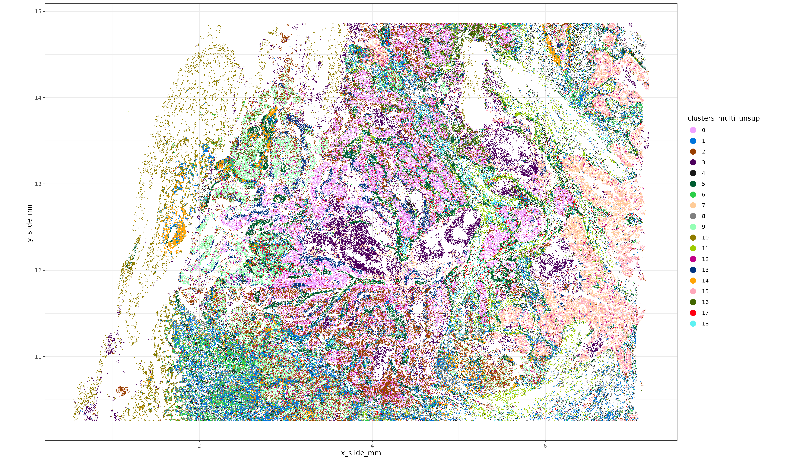
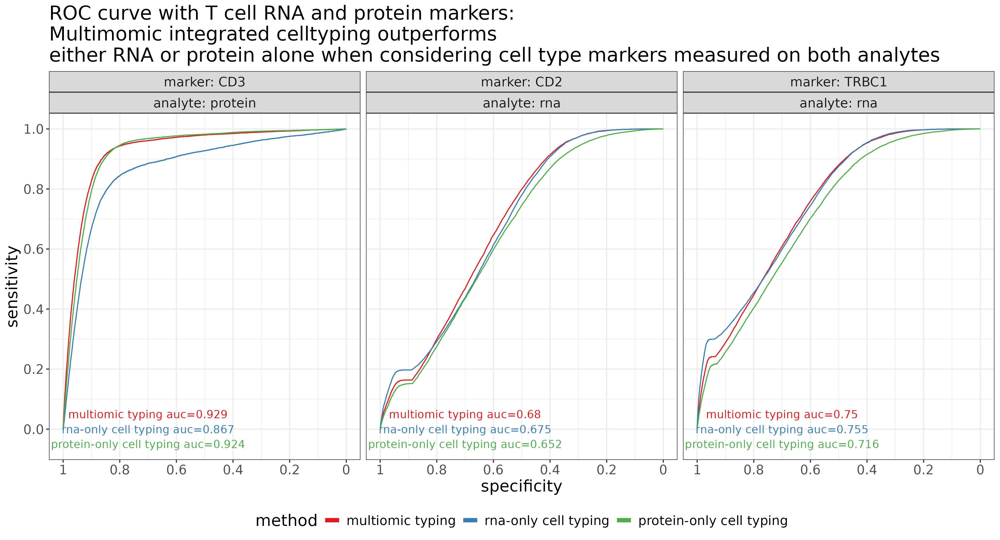
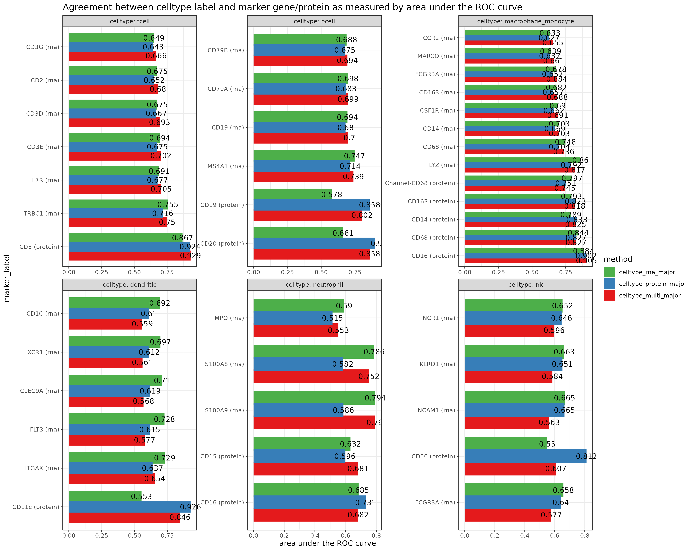
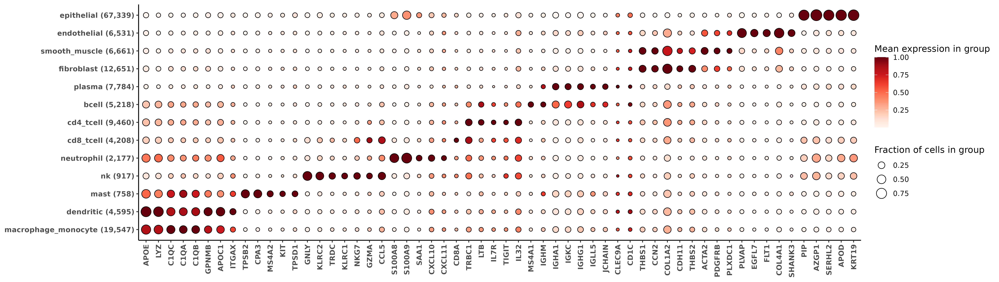
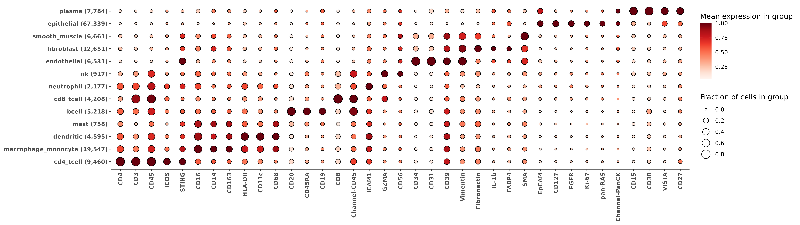
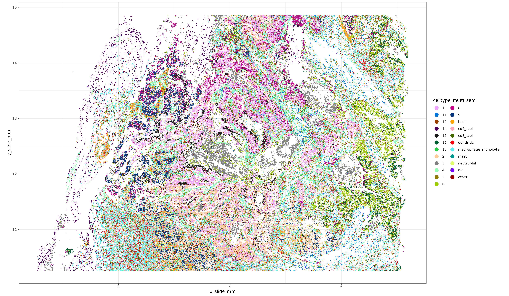

# Introduction

This post showcases how the [HieraType cell typing package](https://github.com/Nanostring-Biostats/CosMx-Analysis-Scratch-Space/tree/Main/_code/HieraType) can be used for integrated same-slide multiomic (protein + rna) cell typing.  

As an example, we use a breast cancer tissue sample with both 64-plex protein and WTx 18,935 plex RNA assayed. We start by comparing cell typing with three approaches: 

* both RNA + protein 
* protein-only
* RNA-only

We compare cell typing performance and show that, overall, protein-only and RNA-only cell typing calls show more disagreement with each other than they do with with integrated multiomic cell type calls.  We also demonstrate evidence of improved coherence of cell type labels with the defining marker genes and proteins when using an integrated approach that makes use of both analytes.

Finally, we show a simple yet effective way to integrate unsupervised clusters with supervised immune cell type labels generated with HieraType. This can enable granular detection of novel or tissue-specific cell types along with well known immune cell types.

Code for this analysis end-to-end can be found by skipping ahead [here](#endtoend).


#  A quick look at the tissue

Here's a quick look at this breast cancer tissue, where unsupervised clustering was performed using both the pearson residual normalized RNA + protein.  Code for creating these unsupervised clusters is [here](#multiunsup).  Next, we'll compare multiomic immune cell typing performance with RNA-only or protein-only cell typing.

<div class="wider-image">
  
</div>
```{r}
#| eval: false
#| echo: false
#| fig.show: "hold"
#| out-width: "6000px"


```


# Evidence multiomics can improve cell typing

We used the Adjusted Rand Index (ARI) metric to quantify the agreement between protein-only, RNA-only, and multiomic cell type labels ([code](#ari)).  ARI is a numerical measure of similarity between two data clusterings [@ariref].  We found protein-only and RNA-only cell typing calls show more disagreement with each other than they do with with integrated multiomic cell type calls, with:

* $ARI(\text{multiomic,RNA-only})= 0.679$
* $ARI(\text{multiomic, protein-only})= 0.589$
* $ARI(\text{protein-only, RNA-only})= 0.483$

We compared the agreement between celltype predictions and canonical protein markers and RNA markers, and found that the multiomic cell type labels often show stronger alignment than RNA-only or protein-only cell typing. ( Code for [RNA-only](#rnaonly), [protein-only](#proteinonly), [multiomic](#multiomic) HieraType calls.)

### T cell improvement demonstration via area under the ROC curves

For example, the figure below shows ROC curves for T cell predictions along with three canonical cell type markers for T cells (one protein, and two RNA).  In this context, for a given level of marker expression, '*sensitivity*' refers to the frequency a cell is labeled a T-cell (for all cells above that threshold of marker expression). '*Specificity*' refers to the proportion of times a cell is labeled anything other than a T-cell (for all cells below that threshold).  
If we treat our normalized marker expression as a gold standard for cell type calling, then we would want to see high sensitivity and specificity of the T cell calls depending on whether marker expression is high or low.  In general, larger area under the ROC curve indicates better agreement between cell type calls and marker expression.


<div class="wider-image">
  
</div>
```{r}
#| eval: false
#| echo: false
#| fig.show: "hold"
#| out-width: "6000px"
#| fig-dpi: 600


```

Above, as we might expect, we see that using  <span style="color:#377EB8;">RNA-only</span> for calling T cells does not optimize agreement between CD3 protein (AUC=0.871).  Unsurprisingly, agreement improves when using CD3 protein directly for celltyping (<span style="color:#4DAF4A;">protein-only</span> AUC=0.927).  In this case, we actually observed the best AUC when both RNA and protein were used jointly (<span style="color:#E41A1C;">multiomics</span> AUC=0.937).

A perhaps unsurprising theme that emerged from these cell typing comparisons was that we often see the worst agreement for protein markers when using RNA-only for celltyping, and the worst agreement for RNA markers when using protein-only for celltyping.  Meanwhile, using both RNA and protein analytes often yields the best or nearly-best agreement for both marker types.
This is further shown above in the middle-and-right panels when looking at CD3D and CD2 RNA markers.  <span style="color:#E41A1C;">Multiomic</span> celltyping outperforms <span style="color:#4DAF4A;">protein-only</span> by the widest margin, and also slightly outperforms <span style="color:#377EB8;">RNA-only</span>.

<span style="color:#E41A1C;">protein-only</span>
<span style="color:#6A3D9A;">multiomic</span>.
<span style="color:#377EB8;">RNA-only</span>.

One interesting point of note when comparing the shapes of the ROC curves above is the smoothness of the curve for the CD3 protein marker, compared to the CD2 and CD3D RNA markers (which show a sharper bump closer to the lower-left corner where sensitivity=0 and specificity=1).  Due to the sparsity of RNA counts, we see a sharp spike in sensitivity close to an expression threshold at which cells have a single count of the marker gene. Because <span style="color:#377EB8;">RNA-only</span> cell typing uses only the RNA markers, the AUC is larger and more influenced around this local threshold of a single marker gene count, while <span style="color:#4DAF4A;">protein-only</span> and <span style="color:#E41A1C;">multiomic</span> cell type labels are impacted directly by marker protein expression. 

###  Improved AUC across immune cell types

We saw a similar trend as that demonstrated above across immune cell types.  
Here, for the most important 'index markers' of each immune cell type, we show the area under the ROC curve for <span style="color:#377EB8;">RNA-only</span>, <span style="color:#4DAF4A;">protein-only</span>, and <span style="color:#E41A1C;">multiomic</span> celltyping results (code for this analysis can be found here in the [end-to-end](#endtoend) code section).  In general, there appears to be an improvement in AUC for both RNA and protein markers compared to if one of the analytes were removed. 
  
Average AUC was highest for multiomic celltyping across all markers and celltypes, with

* $\overline{AUC}(\text{multiomic}) = 0.711$
* $\overline{AUC}(\text{RNA-only}) = 0.709$
* $\overline{AUC}(\text{protein-only}) = 0.701$

<div class="wider-image">
  
</div>
```{r}
#| eval: false
#| echo: false
#| fig.show: "hold"
#| out-width: "6000px"


```


# Running HieraType using Protein + RNA {#multiomic}

Below, we'll step through the process of generating cell type labels with multiomic data.
The code for using HieraType with protein data uses very similar syntax as a regular HieraType call, with a few exceptions worth calling out.

##### Protein naming convention

HieraType works from a set of pre-defined 'markers' which correspond to each cell type we hope to classify.  For multiomic or protein-only data, protein marker names must end with the suffix "_protein" in our `markerslist` objects.  
For example, here is the HieraType package multiomic markerslist for CD8 T cells (`cd8t`). 


```{r}
#| eval: false
#| echo: false

example_multi_markerslist <- utils::capture.output(print(
  HieraType::markerslist_multiomic_tcellmajor$cd8t
 ))
saveRDS(example_multi_markerslist, "figures/example_multi_markerslist.rds")

```
```{r}
#| eval: false
#| echo: true
print(HieraType::markerslist_multiomic_tcellmajor$cd8t)
```

```{r}
#| eval: true
#| echo: false

example_multi_markerslist <- readRDS("figures/example_multi_markerslist.rds")
message(paste(example_multi_markerslist, collapse = '\n'))

```

##### Protein data normalization and constructing a multiomic adjacency_matrix


::: {.callout-note}
Below, we make use of the [scPearsonPCA package](https://github.com/Nanostring-Biostats/CosMx-Analysis-Scratch-Space/tree/Main/_code/scPearsonPCA).  This R package provides convenience functions for getting the principal component embeddings for pearson-residual normalized data directly from a raw counts matrix.  When normalized protein is also available, we can get the PC decomposition from both RNA and normalized protein using the functions below.   For more detail on the package, please check out the [README](https://github.com/Nanostring-Biostats/CosMx-Analysis-Scratch-Space/tree/Main/_code/scPearsonPCA). 
:::

Protein data should be normalized, then combined with a sparse un-normalized RNA counts matrix before passing to HieraType.
Here we'll use pearson residuals from a gamma regression model as a normalization method, although other reasonable methods might be considered and left to the user's disgression.  We then add the "_protein" suffix to the protein names, so they'll align with the HieraType markerlists.

```{r}
#| eval: false
#| echo: true

## normalize each protein taking pearson residuals from gamma generalized linear model.
pgamm <- scPearsonPCA::pearson_normalize_gamma_glm(as.matrix(sem_protein[["RNA"]]@counts)
                                                   ,upper_q_thresh = 0.99
                                                   ,lower_q_thresh = 0.01
                                                   )
rownames(pgamm) <- paste0(rownames(pgamm), "_protein")
```

Here we conduct a principal component decomposition from combined RNA and proteins across all cells; this can be used to give us the cells x cells similarity graph we'll pass to HieraType.
```{r}
#| eval: false
#| echo: true

## select genes from RNA data to use for PCA analysis.
## Take the top 2k features as well as any pre-defined celltyping markers from HieraType
sem_rna <- Seurat::FindVariableFeatures(sem_rna, nfeatures = 2000)
markerg <- unlist(lapply(c(
  HieraType::markerslist_l1
  ,HieraType::markerslist_immune
  ,HieraType::markerslist_cd8tminor
  ,HieraType::markerslist_cd4tminor
  ,HieraType::markerslist_tcellmajor
), "[[", "predictors"))
use_genes <- unique(c(sem_rna@assays$RNA@var.features, intersect(markerg, rownames(sem_rna))))

### total counts and gene frequency from RNA data computed across full dataset
tc <- Matrix::colSums(sem_rna[["RNA"]]@counts)
genefreq <- scPearsonPCA::gene_frequency(sem_rna[["RNA"]]@counts)

# Multiomic RNA and Protein cluster analysis
pcaobj_multi <- scPearsonPCA::sparse_quasipoisson_pca_seurat_multiomic(sem_rna[["RNA"]]@counts[use_genes,]
                                                                       ,totalcounts = tc
                                                                       ,grate = genefreq[use_genes]
                                                                       ,xother = pgamm ## normalized protein
                                                                       ,do.scale = TRUE
                                                                       ,do.center = TRUE
                                                                       ,scale.max = 10
                                                                       ,ncores = 1
)

### Make a cell-cell adjacency matrix for HieraType 
multi_simgrph <- uwot::similarity_graph(pcaobj_multi$reduction.data@cell.embeddings
                                  ,n_neighbors = 30
                                  ,nn_method = "annoy"
                                  ,metric = 'cosine'
                                  )
rownames(multi_simgrph) <- colnames(multi_simgrph) <- rownames(pcaobj_multi$reduction.data@cell.embeddings)

```

##### HieraType call

Here we construct our 'multiomic' expression matrix which includes our sparse RNA counts with the normalized protein expression, then we call `HieraType::run_pipeline` .
```{r}
#| eval: false
#| echo: true

#### combining sparse RNA counts and normalized proteins into a single matrix 'multimat'
overlapping_cells <- intersect(colnames(sem_protein), colnames(sem_rna))
multimat <- Matrix::t(pgamm[,overlapping_cells])
multimat <- cbind(multimat, Matrix::t(sem_rna[["RNA"]]@counts[use_genes,overlapping_cells]))


### Define pipeline, using multiomic markerslists
pipeline_io_multiomics <- HieraType::make_pipeline(
  markerslists = list(
    "l1" = HieraType::markerslist_multiomic_l1
    ,"l2" = HieraType::markerslist_multiomic_immune
    ,"lt" = HieraType::markerslist_multiomic_tcellmajor
    ,"lt4minor" = HieraType::markerslist_multiomic_cd4tminor
    ,"lt8minor" = HieraType::markerslist_multiomic_cd8tminor
  )
  ,priors = list(
    "l2" = "l1"
    ,"lt" = "l2"
    ,"lt4minor" = "lt"
    ,"lt8minor" = "lt"
  )
  ,priors_category = list(
    "l2" = "immune"
    ,"lt" = "tcell"
    ,"lt4minor" = "cd4t"
    ,"lt8minor" = "cd8t"
  )
)

### Run the celltyping pipeline
multictobj <- HieraType::run_pipeline(
   pipeline = pipeline_io_multiomics
   ,totalcounts= tc[rownames(multimat)]
   ,gene_wise_frequency = genefreq
   ,counts_matrix = multimat 
   ,adjacency_matrix = multi_simgrph[rownames(multimat), rownames(multimat)]
 )


```

##### Outputs

For extensive description of the outputs we get from HieraType, we refer the reader to the original post.
Here, we'll demonstrate how to make a few marker heatmaps from the RNA and protein data to sanity check our cell typing results.
```{r}
#| eval: false
#| echo: true

multictobj$post_probs[[1]][1:10] ## posterior probabilities for each cell type


```

```{r}
#| eval: true
#| echo: false

#saveRDS(multictobj$post_probs[[1]][1:10], file="figures/postprobs_head.rds")
print(readRDS("figures/postprobs_head.rds"))
```
```{r}
#| eval: false
#| echo: true

### Use the major cell type categories for a heatmap
ppmulti <- copy(multictobj$post_probs$l1)
ppmulti[,celltype_multi_major:=celltype_granular]
ppmulti[grepl("cd4",celltype_multi_major),celltype_multi_major:="cd4_tcell"]
ppmulti[grepl("cd8",celltype_multi_major),celltype_multi_major:="cd8_tcell"]
ppmulti[grepl("mono|macro",celltype_multi_major),celltype_multi_major:="macrophage_monocyte"]

### fold change metrics to show in RNA heatmap
fctbl_rna <- 
clusterwise_foldchange_metrics(sem_rna[["RNA"]]@counts[use_genes,]
                               ,totalcounts = Matrix::colSums(sem_rna[["RNA"]]@counts)
                               ,metadata = ppmulti
                               ,cluster_column = "celltype_multi_major"
                               ,cellid_column = "cell_ID"
                               )

hm_rna <- add_ncells(marker_heatmap(fctbl_rna))
print(hm_rna)
```

```{r}
#| eval: false
#| echo: false

ggsave(plot=hm_rna, filename = "figures/hm_rna_multi.png", width = 1522 * sqrt(20), height = 430*sqrt(20), dpi=400,units='px')

```

<div class="wider-image">
  
</div>


For the protein data, almost all proteins have some positive measurement in each cell.  We can use the pearson residuals to set a cutoff for computing the proportion of positive cells by marker and by cell type.  Below, we'll use cutoff of 'pearson residual > 1' to determine the size of the bubble in the heatmap.
```{r}
#| eval: false
#| echo: true

fctbl_protein <- 
clusterwise_foldchange_metrics_protein(sem_protein[["RNA"]]@counts[,overlapping_cells]
                               ,metadata = ppmulti
                               ,cluster_column = "celltype_multi_major"
                               ,propd = (pgamm[,overlapping_cells] > 1))

hm_protein <- add_ncells(marker_heatmap(fctbl_protein))
print(hm_protein)

```
```{r}
#| eval: false
#| echo: false


ggsave(plot=hm_protein, filename = "figures/hm_protein_multi.png", width = 1522 * sqrt(20), height = 430*sqrt(20), dpi=400,units='px')


```
<div class="wider-image">
  
</div>

# Integrating unsupervised clusters with immune cell type labels

HieraType was designed to find celltypes with known, pre-specified markers.  Often, unsupervised clustering is sufficiently granular to identify very distinct tissue-specific clusters, but may not identify commune immune cell types of interest due to relative sparsity of the immune markers.  We demonstrate an easy way ([code](#integrateunsup)) to  reconcile the labels between HieraType and unsupervised clustering; keeping the HieraType label when a cell is classified as immune, and taking the unsupervised cluster label otherwise.  This can be a useful technique regardless of whether one is using RNA, protein, or both to cell type their single cell dataset.
<div class="wider-image">
  
</div>
```{r}
#| eval: false
#| echo: false
#| fig.show: "hold"
#| out-width: "12000px"


```

# Conclusion

The HieraType method constructs continuous celltype metagene scores, which are then probabilistically clustered to classify cell types. 
Because these metagene scores are continuous and the clustering uses flexible gaussian mixture models, the inputted expression can be fluidly specified in terms of RNA markers, protein markers, or some combination of both.  This allows for an elegant and efficient solution for fully integrated celltyping when both protein and RNA are available.  
Overall, we've found improved cell typing performance when both analytes are used compared to either analyte on its own across multiple multiomic datasets, and as demonstrated for the breast cancer sample in this post.

While the HieraType method is fully supervised and cannot identify novel cell types not specified in a '`markerslist`',  we demonstrate an easy approach for integrating unsupervised clusters with HieraType immune cell typing calls, enabling high resolution cell typing for both immune cell types as well as epithelial or tissue context specific cell types which may not have a known marker profile a priori.
This can help reap benefits of both unsupervised and supervised approaches - well controlled pre-specified immune cell typing combined with granular unsupervised epithelial clusters.

# End-to-end detailed analysis code {#endtoend}

For completeness, here are a few end-to-end code blocks for each analysis step.

##### Reading in the data  
```{r}
#| eval: false
#| echo: true

#remotes::install_github("Nanostring-Biostats/CosMx-Analysis-Scratch-Space", 
#                        subdir = "_code/HieraType", ref = "Main")
#remotes::install_github("Nanostring-Biostats/CosMx-Analysis-Scratch-Space", 
#                        subdir = "_code/scPearsonPCA", ref = "Main")

library(ggplot2)
library(ggrepel)
library(data.table)
library(scPearsonPCA)
library(HieraType)
library(data.table)
library(pROC)
library(mclust)

## Note, using a v3-style Seurat Object below, i.e., `sem[["RNA"]]@counts`
## For v5-style, the syntax would be like `sem[["RNA"]]$counts`
options(Seurat.object.assay.version = "v3")  

sem_protein <- readRDS("Breast/sem_protein.rds")
sem_rna <- readRDS("Breast/sem_rna.rds")
sem_rna <- subset(sem_rna, nCount_RNA >=100)


```

##### Normalizing protein data

```{r}
#| eval: false
#| echo: true

## normalize each protein taking pearson residuals from gamma generalized linear model.
pgamm <- scPearsonPCA::pearson_normalize_gamma_glm(as.matrix(sem_protein[["RNA"]]@counts)
                                                   ,upper_q_thresh = 0.99
                                                   ,lower_q_thresh = 0.01
                                                   )
rownames(pgamm) <- paste0(rownames(pgamm), "_protein")

```

##### Multiomic pearson residual PCA analysis using the protein and RNA {#multiunsup}

```{r}
#| eval: false
#| echo: true

## select genes from RNA data to use for PCA analysis.
## Will take the top 2k features as well as any pre-defined immune celltyping markers from HieraType
sem_rna <- Seurat::FindVariableFeatures(sem_rna, nfeatures = 2000)
markerg <- unlist(lapply(c(
  HieraType::markerslist_l1
  ,HieraType::markerslist_immune
  ,HieraType::markerslist_cd8tminor
  ,HieraType::markerslist_cd4tminor
  ,HieraType::markerslist_tcellmajor
), "[[", "predictors"))
use_genes <- unique(c(sem_rna@assays$RNA@var.features, intersect(markerg, rownames(sem_rna))))

### total counts and gene frequency from RNA data computed across full dataset
tc <- Matrix::colSums(sem_rna[["RNA"]]@counts)
genefreq <- scPearsonPCA::gene_frequency(sem_rna[["RNA"]]@counts)

### add a '_protein' suffix to the protein names - helps differentiate proteins and RNA's with the same name. 
rownames(pgamm) <- paste0(rownames(pgamm), "_protein")

### Principal components derived from the combined covariance matrix of pearson residual normalized RNA and protein.
### 
pcaobj_multi <- scPearsonPCA::sparse_quasipoisson_pca_seurat_multiomic(sem_rna[["RNA"]]@counts[use_genes,]
                                                                       ,totalcounts = tc
                                                                       ,grate = genefreq[use_genes]
                                                                       ,xother = pgamm ## normalized protein
                                                                       ,do.scale = TRUE
                                                                       ,do.center = TRUE
                                                                       ,scale.max = 10
                                                                       ,ncores = 1
)

```

```{r}
#| eval: false
#| echo: false

saveRDS(pcaobj_multi, "data2/pcaobj_multi.rds")
pcaobj_multi <- readRDS("data2/pcaobj_multi.rds")
use_genes <- grep("_protein", rownames(pcaobj_multi$reduction.data@feature.loadings) , value=TRUE, invert=TRUE)

msg <- utils::capture.output(print(
  x = pcaobj_multi$reduction.data,
  dims = 1:5,
  nfeatures = 20
))
message(paste(msg, collapse = '\n'))
saveRDS(msg, "figures/pca_multiomics_toppcs_msg.rds")
```

```{r}
#| eval: true
#| echo: false

msg <- readRDS("figures/pca_multiomics_toppcs_msg.rds")
message(paste(msg, collapse = '\n'))
```


```{r}
#| eval: false
#| echo: true

### Make a cell-cell adjacency matrix for HieraType 
multi_simgrph <- uwot::similarity_graph(pcaobj_multi$reduction.data@cell.embeddings
                                  ,n_neighbors = 30
                                  ,nn_method = "annoy"
                                  ,metric = 'cosine'
                                  )
rownames(multi_simgrph) <- colnames(multi_simgrph) <- rownames(pcaobj_multi$reduction.data@cell.embeddings)


###  Unsupervised clusters using multiomic cell-cell adjacency graph
sem_rna[["multigrph"]] <- Seurat::as.Graph(multi_simgrph[colnames(sem_rna),colnames(sem_rna)])
sem_rna <- Seurat::FindClusters(sem_rna, graph.name="multigrph")
sem_rna@meta.data$clusters_multi_unsup <- sem_rna@meta.data$seurat_clusters

xyp_multi_unsup <- xyplot("clusters_multi_unsup", metadata = sem_rna@meta.data, ptsize = 0.05) + coord_fixed()

ggsave("figures/xyp_multi_unsup.png"
       ,plot=xyp_multi_unsup
       ,device = "png"
       ,width = 1181 * sqrt(20)
       ,height=689 * sqrt(20)
       ,units = 'px'
)


```

##### Multiomic cell typing code using HieraType
```{r}
#| eval: false
#| echo: true


## Define the pipeline using multiomic markerlists in HieraType package

overlapping_cells <- intersect(colnames(sem_protein), colnames(sem_rna))
multimat <- Matrix::t(pgamm[,overlapping_cells])
multimat <- cbind(multimat, Matrix::t(sem_rna[["RNA"]]@counts[use_genes,overlapping_cells]))


pipeline_io_multiomics <- HieraType::make_pipeline(
  markerslists = list(
    "l1" = HieraType::markerslist_multiomic_l1
    ,"l2" = HieraType::markerslist_multiomic_immune
    ,"lt" = HieraType::markerslist_multiomic_tcellmajor
    ,"lt4minor" = HieraType::markerslist_multiomic_cd4tminor
    ,"lt8minor" = HieraType::markerslist_multiomic_cd8tminor
  )
  ,priors = list(
    "l2" = "l1"
    ,"lt" = "l2"
    ,"lt4minor" = "lt"
    ,"lt8minor" = "lt"
  )
  ,priors_category = list(
    "l2" = "immune"
    ,"lt" = "tcell"
    ,"lt4minor" = "cd4t"
    ,"lt8minor" = "cd8t"
  )
)

multictobj <- HieraType::run_pipeline(
  pipeline = pipeline_io_multiomics
  ,totalcounts= tc[rownames(multimat)]
  ,gene_wise_frequency = genefreq
  ,counts_matrix = multimat
  ,adjacency_matrix = multi_simgrph[rownames(multimat), rownames(multimat)]
)
```

```{r}
#| eval: false
#| echo: false

saveRDS(multictobj, "data2/multictobj_multigrph.rds")
multictobj <- readRDS("data2/multictobj_multigrph.rds")

```


##### RNA-only cell typing  {#rnaonly}

```{r}
#| eval: false
#| echo: true

### RNA-only PCA and similarity graph
pcaobj_rna <- scPearsonPCA::sparse_quasipoisson_pca_seurat(sem_rna[["RNA"]]@counts[use_genes,]
                                                       ,totalcounts = tc
                                                       ,grate = genefreq[use_genes]
                                                       ,do.scale = TRUE
                                                       ,do.center = TRUE
                                                       ,scale.max = 10
                                                       ,ncores = 1
)

### Make a cell-cell adjacency matrix for HieraType 
rna_simgrph <- uwot::similarity_graph(pcaobj_rna$reduction.data@cell.embeddings
                                  ,n_neighbors = 30
                                  ,nn_method = "annoy"
                                  ,metric = 'cosine'
                                  )
rownames(rna_simgrph) <- colnames(rna_simgrph) <- rownames(pcaobj_rna$reduction.data@cell.embeddings)

## RNA-only hieratype
rnactobj <- HieraType::run_pipeline(
  pipeline = pipeline_io_multiomics ## the _protein markers are automatically excluded, 
                                    ## because they won't be found in the counts_matrix below
  ,totalcounts= tc[rownames(multimat)]
  ,gene_wise_frequency = genefreq[use_genes]
  ,counts_matrix = multimat[,use_genes] ## exclude proteins, only use the 'use_genes'.  
  ,adjacency_matrix = rna_simgrph[rownames(multimat), rownames(multimat)]
)
```

```{r}
#| eval: false
#| echo: false

saveRDS(pcaobj_rna, "data2/pcaobj_rna.rds")
saveRDS(rnactobj, "data2/rnactobj_rnagrph.rds")


pcaobj_rna <- readRDS("data2/pcaobj_rna.rds") 
rnactobj <- readRDS("data2/rnactobj_rnagrph.rds") 
 
```


##### Protein-only cell typing {#proteinonly}

```{r}
#| eval: false
#| echo: true

pgamm_prot <- pgamm
rownames(pgamm_prot) <- gsub("_protein$", "", rownames(pgamm_prot))
sem_protein <- Seurat::SetAssayData(sem_protein,layer = "data", new.data = pgamm_prot)
sem_protein <- Seurat::ScaleData(sem_protein)
sem_protein <- Seurat::RunPCA(sem_protein, features = rownames(sem_protein))
### Make a cell-cell adjacency matrix for HieraType 
protein_simgrph <- uwot::similarity_graph(sem_protein@reductions$pca@cell.embeddings
                                  ,n_neighbors = 30
                                  ,nn_method = "annoy"
                                  ,metric = 'cosine'
                                  )
rownames(protein_simgrph) <- colnames(protein_simgrph) <- rownames(sem_protein@reductions$pca@cell.embeddings)
#### Make a copy of the cell typing pipeline to use for protein
#### -- Remove 'mast' cells, which dont have a specific protein marker.
#### -- remove the minor T8 and T4 subtypes
pipeline_io_protein <- pipeline_io_multiomics
pipeline_io_protein$markerslists$l2$mast <- NULL
pipeline_io_protein$markerslists$lt4minor <- NULL
pipeline_io_protein$markerslists$lt8minor <- NULL
pipeline_io_protein$priors$lt4minor <- NULL
pipeline_io_protein$priors$lt8minor <- NULL
pipeline_io_protein$priors_category$lt4minor <- NULL
pipeline_io_protein$priors_category$lt8minor <- NULL

proteinctobj <- HieraType::run_pipeline(
  pipeline = pipeline_io_protein
  ,counts_matrix = multimat[,grep("_protein$",colnames(multimat),value=TRUE)]
  ,adjacency_matrix = protein_simgrph[rownames(multimat), rownames(multimat)]
)


```

```{r}
#| eval: false
#| echo: false
saveRDS(proteinctobj, "data2/proteinctobj_proteingrph.rds")
proteinctobj <- readRDS("data2/proteinctobj_proteingrph.rds") 

```

##### Combining metadata

```{r}
#| eval: false
#| echo: true


### Combining metadata

## Adding on multiomic celltype annotations
ppmulti <- copy(multictobj$post_probs$l1)
ppmulti[,celltype_multi_major:=celltype_granular]
ppmulti[grepl("cd4",celltype_multi_major),celltype_multi_major:="cd4_tcell"]
ppmulti[grepl("cd8",celltype_multi_major),celltype_multi_major:="cd8_tcell"]
ppmulti[grepl("mono|macro",celltype_multi_major),celltype_multi_major:="macrophage_monocyte"]
ppmulti[,.N,by=.(celltype_multi_major, celltype_granular)]


## Adding on RNA-only based  celltype annotations
ppmulti <- merge(ppmulti, rnactobj$post_probs$l1[,.(cell_ID, celltype_granular)]
                 ,by="cell_ID", suffixes=c("_multi", "_rna"))

ppmulti[,celltype_rna_major:=celltype_granular_rna]
ppmulti[grepl("cd4",celltype_rna_major),celltype_rna_major:="cd4_tcell"]
ppmulti[grepl("cd8",celltype_rna_major),celltype_rna_major:="cd8_tcell"]
ppmulti[grepl("mono|macro",celltype_rna_major),celltype_rna_major:="macrophage_monocyte"]
ppmulti[,.N,by=.(celltype_rna_major, celltype_granular_rna)]

## Adding protein-only based celltype annotations
ppmulti <- merge(ppmulti, proteinctobj$post_probs$l1[,.(cell_ID, celltype_granular)]
                 ,by="cell_ID", suffixes=c("_multi", "_protein"))
setnames(ppmulti, c("celltype_granular"), c("celltype_granular_protein"))
ppmulti[,celltype_protein_major:=celltype_granular_protein]
ppmulti[grepl("cd4",celltype_protein_major),celltype_protein_major:="cd4_tcell"]
ppmulti[grepl("cd8",celltype_protein_major),celltype_protein_major:="cd8_tcell"]
ppmulti[grepl("mono|macro",celltype_protein_major),celltype_protein_major:="macrophage_monocyte"]
ppmulti[,.N,by=.(celltype_protein_major, celltype_granular_protein)]
 
```


##### Integrating unsupervised clusters with immune cell type labels {#integrateunsup}
```{r}
#| eval: false
#| echo: true

### Annotating non-immune clusters with unsupervised labels, creating more granular annotations
### 
ppmulti <- merge(ppmulti, data.table(sem_rna@meta.data)[,.(cell_ID, x_slide_mm, y_slide_mm, clusters_multi_unsup)], by = "cell_ID")
ppmulti[,celltype_multi_semi:=celltype_multi_major]
ppmulti[celltype_multi_semi %in% c("plasma", "endothelial", "epithelial", "fibroblast", "smooth_muscle"),celltype_multi_semi:=clusters_multi_unsup]
ppmulti[,.N,by=.(clusters_multi_unsup, celltype_multi_major)]
class_other <- ppmulti[,.N,by=.(clusters_multi_unsup, celltype_multi_major)][,prop:=N/sum(N),by=.(clusters_multi_unsup)][order(-prop)][
  ,head(.SD,1),by=.(clusters_multi_unsup)]
others <- class_other[!celltype_multi_major %in% c("plasma", "endothelial", "epithelial", "fibroblast", "smooth_muscle")][["clusters_multi_unsup"]]
ppmulti[celltype_multi_semi %in% others, celltype_multi_semi:="other"]

  

xyp_multi_semisup <- xyplot("celltype_multi_semi", metadata = ppmulti, ptsize = 0.05) + coord_fixed()

ggsave("figures/xyp_multi_semisup.png"
       ,plot=xyp_multi_semisup
       ,device = "png"
       ,width = 1181 * sqrt(20)
       ,height=689 * sqrt(20)
       ,units = 'px'
)
```

##### ARI quantifying agreement between cell type labels {#ari}

```{r}
#| eval: false
#| echo: true

## ARI
mclust::adjustedRandIndex(ppmulti$celltype_multi_major, ppmulti$celltype_protein_major)
mclust::adjustedRandIndex(ppmulti$celltype_multi_major, ppmulti$celltype_rna_major)
mclust::adjustedRandIndex(ppmulti$celltype_protein_major, ppmulti$celltype_rna_major)


```
##### Making ROC curves, computing and plotting area under the curve

```{r}
#| eval: false
#| echo: true

### Get the most important 'index markers' for each celltype (including proteins and RNAs)
index_markers <- unlist(lapply(HieraType::markerslist_multiomic_immune, "[[", "index_marker"))
index_markers <- rbindlist(lapply(names(HieraType::markerslist_multiomic_immune), function(ct){
  markerdt <- data.table(celltype = ct
                         ,marker = HieraType::markerslist_multiomic_immune[[ct]][["index_marker"]]
                         ,typ = "rna"
  )
  markerdt[grepl("_protein$", marker),typ:="protein"]
  markerdt[,marker:=gsub("_protein$","", marker)]
  markerdt <- markerdt[(typ=="rna" & marker %in% rownames(sem_rna)) | (typ=="protein" & marker %in% rownames(sem_protein))]
  return(markerdt)
}))

### Combine macrophage and monocyte due to similarity
index_markers[celltype %in% c("macrophage", "monocyte"),celltype:="macrophage_monocyte"]
aucrocl <- list()
plotdata_markerl <- list()
rownames(pgamm) <- gsub("_protein", "", rownames(pgamm))
for(ii in 1:nrow(index_markers)){
  print(ii)
  res <- index_markers[ii]
  typ <- res[["typ"]]


  marker <- res[["marker"]]
  celltype <- res[["celltype"]] 
  if(typ=="rna"){
    x <- sem_rna[["RNA"]]@counts[marker,ppmulti[["cell_ID"]]]
    tc <- Matrix::colSums(sem_rna[["RNA"]]@counts[,ppmulti[["cell_ID"]]])
    muhat <- genefreq[marker] * tc 
    x <- (x - muhat) / sqrt(muhat) ## normalized expression for marker (pearson residuals)
  }  else {
    x <- pgamm[marker,ppmulti[["cell_ID"]]]
  }
  
  pdlbl <- list() 
  for(labelname in c("celltype_multi_major", "celltype_rna_major", "celltype_protein_major")){
    print(labelname)
    labels <- ppmulti[[labelname]]
    labels[grep("tcell", labels)] <- "tcell" 
    y <- as.integer(labels==celltype)
    if(sum(y) > 0){
      roc_obj <- roc(y, x, quiet = TRUE)
      res[,(labelname):=as.numeric(auc(roc_obj))]
    }
    pdlbl[[labelname]] <- 
      data.table(spec=roc_obj$specificities, sens=roc_obj$sensitivities,marker=marker)[,label:=labelname][unique(c(seq(1,.N,10), .N))]
  }
  plotdata_markerl[[ii]] <- rbindlist(pdlbl)[,`:=`(celltype = celltype, marker=marker, typ = typ)]
  aucrocl[[ii]] <- data.table::copy(res) #return(res)
}
 
```
```{r}
#| eval: false
#| echo: false


  saveRDS(aucrocl, "data2/aucrocl.rds")
  saveRDS(plotdata_markerl, "data2/plotdata_markerl.rds")
  aucrocl <- readRDS("data2/aucrocl.rds")
  plotdata_markerl <- readRDS("data2/plotdata_markerl.rds")
 ```
 ```{r}
#| eval: false
#| echo: true

  aucroc <- rbindlist(aucrocl, use.names=TRUE,fill=TRUE)
  
  
```

#### Average AUC across markers and celltypes
```{r}
#| eval: false
#| echo: true

aucroc[celltype!="mast",lapply(.SD, mean),.SDcols=4:6]

```

#### T cell ROC curves
```{r}
#| eval: false
#| echo: true

  shw <- rbindlist(plotdata_markerl)[marker %in% c("CD3", "CD3D", "CD2")]
  shw[,method:=factor(label, levels=c("celltype_multi_major", "celltype_rna_major", "celltype_protein_major"), labels=c("multiomic typing", "rna-only cell typing", "protein-only cell typing"))]
  merge(shw, aucrocl)
  data.table::setnames(shw, c("typ"), c("analyte"))
  shw[,marker:=factor(marker, levels=c("CD3", "CD3D", "CD2"))]
  shw <- shw[order(marker)]
  aucroc[marker %in% shw$marker]
  rocplot_tcell <- 
    ggplot(shw, aes(x = (1-spec), y = sens,group = method,color=method)) + geom_line() + 
    facet_wrap(~marker + analyte, labeller=label_both) + 
    theme_bw() + 
    scale_x_continuous(breaks = seq(0,1,.2), labels = 1-seq(0,1,.2), name = "specificity") + 
    scale_y_continuous(breaks = seq(0,1,.2), name = "sensitivity") + 
    scale_color_manual(values = brewer.pal(8,"Set1")[c(1:2,3)]
    #scale_color_manual(values = brewer.pal(8,"Dark2")[c(1:3)]
                       , guide=guide_legend(override.aes=list(lwd=2)))  + 
    theme(text=element_text(size=16)) + 
    theme(legend.position="bottom") +  
    labs(title = "ROC curve with T cell RNA and protein markers:\nMultimomic integrated celltyping outperforms\neither RNA or protein alone when considering cell type markers measured on both analytes")
  
  lbld <- 
    aucroc[marker %in% shw$marker]
  lbld <- melt(lbld, id.vars=c("celltype", "marker", "typ"),value.name="auc", variable.name="label")
  lbld[,method:=factor(label
                       ,levels=c("celltype_multi_major", "celltype_rna_major", "celltype_protein_major")
                       ,labels=c("multiomic typing", "rna-only cell typing", "protein-only cell typing"))]
  lbld[,marker:=factor(marker, levels=c("CD3", "CD3D", "CD2"))]
  lbld[,analyte:=typ]
  lbld[,lbl:=paste0(method, " auc=", formatC(auc, digits=3))]
  lbld[,spec:=0.7]
  lbld[,sens:=0.1-as.numeric(lbld$method)*0.05]
  rocplot_tcell_lbl <- rocplot_tcell + geom_text(data=lbld, aes(label = lbl),show.legend=FALSE)
  
  ggsave(plot=rocplot_tcell_lbl
         ,filename = "figures/rocplot_tcell_lbl.png"
         ,width=1372*sqrt(18)
         ,height=742*sqrt(18)
         ,dpi = 400
         ,units = 'px'
  )
```

#### AUC barplots
```{r}
#| eval: false
#| echo: true 


  mroc <- melt(aucroc
               ,id.vars=c("celltype", "marker", "typ")
               ,value.name="auc"
               ,variable.name="method"
               ,variable.factor = FALSE
  )
  mroc[,celltype:=factor(celltype, levels=c("tcell", "bcell", "macrophage_monocyte", "dendritic", "neutrophil", "nk", "mast"))]
  mroc[,marker_label:=paste0(marker, " (", typ, ")")]
  mroc[,marker_label:=factor(marker_label,levels=mroc[order(celltype,typ, -auc),unique(marker_label)])]
  methcls <- brewer.pal(3,"Set1")
  names(methcls) <- c("celltype_multi_major", "celltype_rna_major","celltype_protein_major")
  aucbar <- 
    ggplot(mroc[celltype!="mast"]
           ,aes(y = marker_label, x = auc, fill=method)) + 
    geom_bar(stat='identity',position=position_dodge()) + 
    theme_bw() + 
    scale_fill_manual(values = methcls #brewer.pal(3,"Set1")#unname(pals::alphabet())
                      , guide=guide_legend(reverse=TRUE)) + 
    facet_wrap(~celltype, labeller=label_both,scales="free") + 
    labs(title = "Agreement between celltype label and marker gene/protein as measured by area under the ROC curve"
        ,x = "area under the ROC curve")
  
  
  ggsave(plot=aucbar
         ,filename = "figures/aucbarplot.png"
         ,width=1430*sqrt(9)
         ,height=874*sqrt(9)
         ,units = 'px'
  )

  aucbar_with_text <-  
  aucbar + geom_text(aes(label = formatC(auc, digits = 3)),position=position_dodge(width=0.8))  + 
    coord_cartesian(clip = "off")
  
  ggsave(plot=aucbar_with_text 
         ,filename = "figures/aucbarplot_wtext.png"
         ,width=1430*sqrt(12)
         ,height=874*1.3*sqrt(12)
         ,dpi = 400
         ,units = 'px'
  )
  
```


