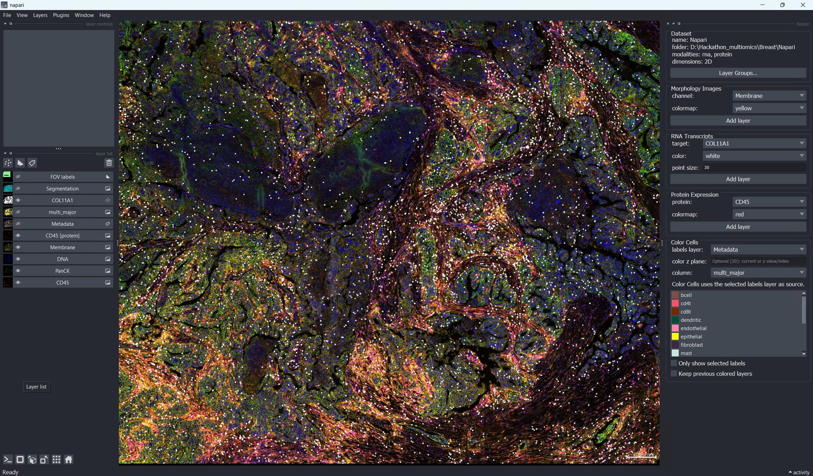
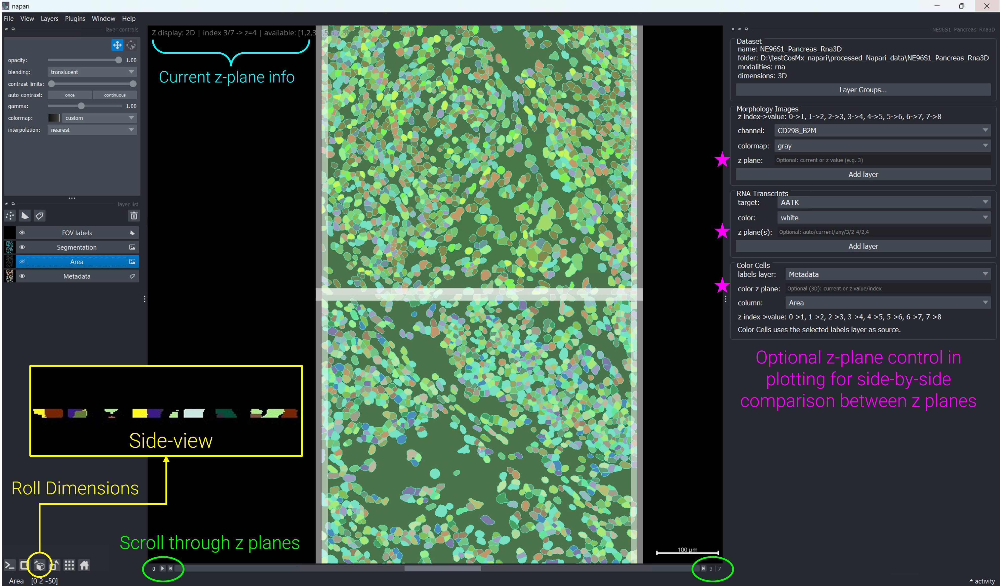
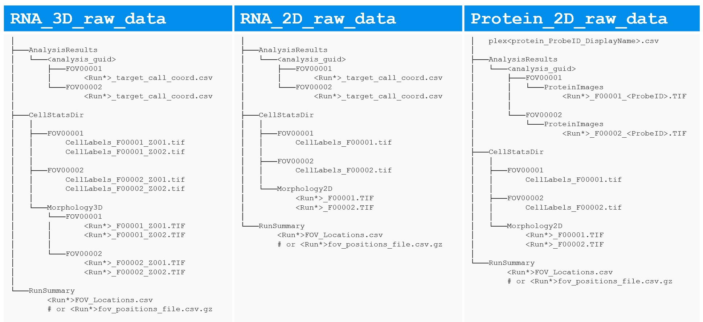
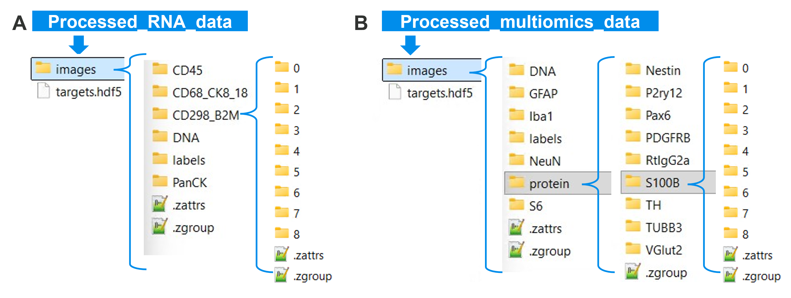

<style>
.feat-table table.table {
  table-layout: auto !important;
  width: 100% !important;
}

/* First column strict width */
.feat-table table.table th:first-child,
.feat-table table.table td:first-child {
  width: 22ch !important;
  max-width: 22ch !important;
  white-space: normal !important;
}

/* Remaining columns behave naturally */
.feat-table table.table th:not(:first-child),
.feat-table table.table td:not(:first-child) {
  width: auto !important;
  white-space: normal !important;
}
</style>

# Introduction 

Are you ready to accelerate your spatial biology discoveries? The latest `napari-CosMx` update empowers research teams to go beyond 2D, unlocking multi-omics (RNA + protein) exploration and volumetric 3D RNA analysis—all within a single, intuitive platform. Whether you’re visualizing complex datasets or building robust pipelines, these new features are designed to help you turn instrument output into actionable insights quickly, reproducibly, and at scale.

- @sec-new-features What’s new at a glance
- @sec-widget-flow How to use new features in `napari` GUI (widget flow, recommended for most users)
- Advanced usage with CLI (@sec-cli) and Python API (@sec-python)


Like other items in our [Analysis Scratch Space](https://nanostring-biostats.github.io/CosMx-Analysis-Scratch-Space/about.html){target="_blank"},
the usual [caveats](https://nanostring-biostats.github.io/CosMx-Analysis-Scratch-Space/about.html){target="_blank"} and [license](https://nanostring-biostats.github.io/CosMx-Analysis-Scratch-Space/license.html){target="_blank"} apply.

::: {.callout-tip title="Enable 3D cell segmentation for CosMx<sup>&#174;</sup> RNA assays"}
Make sure you're running **Control Center 2.3 or higher** and **AtoMx<sup>&#174;</sup> Spatial Informatics Portal (SIP) 2.3 or higher**. 
CosMx instruments produce 2D cell segmentation by default, but upgrading enables 3D cell re-segmentation in AtoMx. Once reprocessed, these 3D segmentation results are fully supported by downstream AtoMx data analysis pipeline and the latest `napari-Cosmx` for interactive visualization.

More details can be found in the relevant [documents](https://university.nanostring.com/atomx-sip-and-cosmx-smi-data-analysis-v23-release-notes){target="_blank"} available through [NanoU](https://university.nanostring.com/){target="_blank"}.
:::

## Quick install / upgrade

1. Download the latest `whl` file for `napari-CosMx v0.5.0.0` from [assets/napari-cosmx releases](https://github.com/Nanostring-Biostats/CosMx-Analysis-Scratch-Space/tree/Main/assets/napari-cosmx%20releases){target="_blank"}.

> Known supported versions for this release:
>
> - [Python](https://www.python.org/downloads/){target="_blank"}: `3.8` to `3.11`
> - [napari](https://napari.org/){target="_blank"}: originally developed for `0.4.17`; tested with `0.5.4` and `0.6.6`


2. **Upgrade an existing environment** (recommended when earlier version of `napari-cosmx` is already working):

Install the new wheel **without dependencies** to avoid unnecessary resolver conflicts (especially around vaex-related packages)

```bash
pip install --no-deps /path/to/napari_CosMx-0.5.0.0-py3-none-any.whl
```

3. **Install in a brand-new virtual environment**:

You could use the latest `napari==0.6.6`. If needed, `napari==0.5.4` is also a tested option.

```bash
# Linux / macOS
python3.11 -m venv .venv
source .venv/bin/activate
pip install napari==0.6.6
pip install /path/to/napari_CosMx-0.5.0.0-py3-none-any.whl
```

```powershell
# Windows PowerShell
py -3.11 -m venv .venv
.venv\Scripts\Activate.ps1
pip install napari==0.6.6
pip install C:\path\to\napari_CosMx-0.5.0.0-py3-none-any.whl
```

This post spotlights what’s new and how to get the most out of these features. For more details on installation and the basic 2D workflow, see our earlier [posts](https://nanostring-biostats.github.io/CosMx-Analysis-Scratch-Space/#category=napari){target="_blank"}.


# What's New at a Glance {#sec-new-features}

::: {.feat-table}
| Feature | Description |
|---|---|
| **3D cell segmentation** | Volumetric cell labels and segmentation outlines across Z planes for richer spatial context |
| **Z-plane navigation** | Instantly view any channel, segmentation, or transcript layer for a single Z plane as a 2D image—perfect for side-by-side comparison |
| **Multi-omics (RNA + Protein)** | Seamlessly load and explore RNA transcripts alongside protein expression images from a single dataset |
| **Layer Group Manager** | Organize napari layers into named groups; show/hide entire groups with one click for streamlined visualization |
| **OME-TIFF export** | Export OME-TIFF pyramids from the command line; 3D data is split into one CYX file per Z plane by default (QuPath-ready); use `--volumetrics` for full CZYX volume output |
:::

# How to Use in `napari` GUI {#sec-widget-flow}

## New capability highlights

1. **Multi-omics in one workspace (RNA + Protein):**
   Explore both modalities in a unified, interactive environment (@fig-multiomics-overview).
2. **3D RNA workflows:**
   Leverage volumetric labels, Z-aware loading, and Z-filtered transcript overlays for advanced spatial analysis (@fig-rna3d-overview).
3. **Layer Group Manager:**
   Effortlessly organize layers into named groups and toggle visibility for efficient data review (@sec-layer-group-manager).

::: {.panel-tabset}

## Multi-Omics View
```{r}
#| eval: true
#| echo: false
#| label: "fig-multiomics-overview"
#| fig-cap: "Multi-omics visualization in `napari-CosMx` with unified workspace showing aligned RNA and protein panels for the same sample, enabling side-by-side modality review."

```

## 3D RNA View
```{r}
#| eval: true
#| echo: false
#| label: "fig-rna3d-overview"
#| fig-cap: "3D RNA view with volumetric cell segmentation and z-aware plotting across selected Z planes. Use `Roll Dimensions` button on lower left of the viewer to see the side-view of tissue section."

```

:::

## Reader + Widget flow

Using `napari-CosMx` from the GUI is a simple two-step workflow:

1. **Step 1 — Stitch Images** ([Stitch Images panel](#sec-stitch-panel)): prepare your raw CosMx output into the `napari-CosMx` zarr format that is ready for `napari` viewer exploration.
2. **Step 2 — Explore** ([Exploration panels](#sec-explore-panels)): drag the prepared output folder into the napari viewer; the plugin reader is invoked automatically and opens the data exploration widget.

::: {.callout-note}
When you open a **preprocessed folder** through drag-and-drop, the exploration widget focuses on viewing panels and does **not** show the Stitch Images panel.
If you want to process a **new raw dataset**, launch `Stitch Images` directly from the napari menu.
:::


### Step 1: Stitch Images panel {#sec-stitch-panel}

Open a terminal, activate your environment, and launch `napari`:

```bash
napari
```

From the `napari` menu, choose **Plugins → Stitch Images (napari CosMx)**. The plugin opens with the **Stitch Images** panel. Use it to turn raw data output exported from AtoMx<sup>&#174;</sup> Spatial Informatics Portal (SIP) into a napari-ready dataset.

{#fig-stitch-panel}


**How it works:**

1. Export raw data for your study from AtoMx SIP (see [earlier post](https://nanostring-biostats.github.io/CosMx-Analysis-Scratch-Space/posts/napari-cosmx-intro/#sec-export-raw-data){target="_blank"}) and organize them by slide. Each slide folder (@fig-raw-inputs) should contain 
   - `CellStatsDir`: contains per-FOV cell segmentation outcomes (`FOV*/CellLabels_F*.tif`) and morphological images (`Morphology2D` for 2D data or `Morphology3D` for 3D data).
   - `RunSummary`:  contains fov position csv file, `*FOV_Locations.csv` or `*fov_positions_file.csv.gz` (flat file). 
   - `AnalysisResults/<guid>`: contains per-FOV organized data for RNA transcripts (`FOV*/*FOV*__complete_code_cell_target_call_coord.csv`) or Protein images (`FOV*/ProteinImages/*_F*_<ProbeID>.TIF`). 
   - `plex*.csv`: required if it's protein data; csv file listing the protein names (`ProbeID` & `DisplayName`) included in your protein data. 

2. Click **Browse Primary Folder** and select your primary CosMx exported data folder.
   The folder must contain `CellStatsDir` and `RunSummary` sub-directories as mentioned above.
   
   > For **multi-omics** runs where RNA and protein data live in separate
     source folders, choose the **protein run folder** as the primary input.
     Then use the **Browse Additional RNA Folder (Optional)** button (Step 2)
     to point to the RNA run folder; the widget will auto-detect the correct
     `AnalysisResults` path inside it.

3. The plugin **auto-detects** whether the `CellLabels_F*.TIF` files carry a
   Z-index suffix (e.g. `CellLabels_F00001_Z003.TIF`) and sets **Input ndim**
   and **Output ndim** accordingly:

   ```
   Detected input ndim: 3 (example: CellLabels_F001_Z001.TIF).
   Default plan set to 3D -> 3D. You can override before stitching.
   ```

   The widget also **auto-detects RNA and protein inputs** and pre-checks the
   corresponding workflow checkboxes. You can manually override either checkbox
   before clicking **Stitch**.

4. Review the **Planned stitch mode** preview and adjust as needed:

::: {.feat-table}
| Setting | What it controls |
|---|---|
| **Input ndim** | Whether the raw files are 2D or 3D (Z-stack) tiles |
| **Output ndim** | Whether to write a volumetric (3D) or flat (2D) zarr store |
| **Z slice** | Which Z plane to extract when collapsing 3D → 2D |
| **Z step (µm)** | Physical Z spacing, e.g. `0.8` for CosMx standard RNA 3D runs; leave blank to read it from raw data |
| **Run read-targets for RNA** | Parse transcript coordinates into `targets.hdf5` |
| **Run stitch-expression for protein** | Stitch protein expression images into the same store |
:::

5. Click **Choose Output Folder** to set the destination, then click **Stitch**.
   High-level status messages appear in real time in the widget as each stage
   completes (reading labels, writing morphology, running RNA/protein steps).


When stitching finishes, all morphological channels, segmentation masks, transcript tables (if RNA), and protein images (if protein) are written to an output directory (@fig-stitch-outcomes) that’s instantly ready for `napari-CosMx` data exploration.

::: {.panel-tabset}

### Raw Data Inputs
```{r}
#| eval: true
#| echo: false
#| label: "fig-raw-inputs"
#| fig-cap: "Raw data inputs for `Stitch Images (napari CosMx)` plugin in case of RNA 3D data (left), RNA 2D data (middle) and Protein 2D data (right)."

```

### Stitched Outputs
```{r}
#| eval: true
#| echo: false
#| label: "fig-stitch-outcomes"
#| fig-cap: "Napari-ready data generated by `Stitch Images (napari CosMx)` plugin. Output folder examples for RNA-only (A) and multiomics (B)."

```

:::


**See it in action**: Here's how to stitch a multi-omics dataset.
<figure style="text-align: center;">
  <video src="figures/multiOmics_stitch_20260320.webm" controls autoplay loop muted style="max-width: 100%; height: auto;">
    Your browser does not support the video tag.
  </video>
  <figcaption>
    <b>Video 1:</b> Demonstration of the Stitch Images widget in `napari-CosMx` with a multi-omics dataset.
  </figcaption>
</figure>


### Step 2: Opening stitched data in the viewer {#sec-explore-panels}

Drag and drop your **stitched output folder** (which contains an `images` sub-folder) into the napari viewer canvas, or use **File → Open Folder**. Napari instantly detects the data and prompts you to choose a reader. Select **napari-CosMx**, check "Remember this choice," and watch as the plugin loads your dataset and opens an interactive exploration environment tailored to your data.

Each exploration panel is designed for a specific analysis task. Here's what you get:

::: {.feat-table}
| Panel | Shown when… |
|---|---|
| **Dataset** | Always — displays summary info and quick access to [Layer Group Manager](#sec-layer-group-manager) |
| **Morphology Images** | Always — channel images (`DNA`, `PanCK`, etc.) with Z-plane navigation for 3D |
| **RNA Transcripts** | When transcript data is present — overlay genes as point clouds with Z-filtering |
| **Protein Expression** | When protein images are present — visualize expression across channels |
| **Color Cells** | When cell labels are present — color cells by any metadata column |
:::

::: {.callout-tip title="Color by cell metadata"}
To enable cell coloring, include your metadata file before opening the dataset: either a custom `*_metadata.csv` (with `cell_ID` column following the `c_[slide]_[fov]_[CellId]` pattern) or the AtoMx SIP-exported `*_metadata_file.csv.gz` placed at the root of your napari-ready data folder.
:::

**See it in action:** Here's a multi-omics dataset being explored interactively—loading RNA transcripts, overlaying protein expression images, and switching between modalities seamlessly in one workspace:

<figure style="text-align: center;">
  <video src="figures/multiOmics_breast_20260320.webm" controls autoplay loop muted style="max-width: 100%; height: auto;">
    Your browser does not support the video tag.
  </video>
  <figcaption>
    <b>Video 2:</b> Interactive multi-omics data exploration: RNA transcripts and protein expression visualized side-by-side in a unified napari workspace.
  </figcaption>
</figure>

::: {.callout-note  title="Smart panel detection"}
The exploration widget automatically enables only the panels relevant to your data. If your dataset has RNA-only data, you'll see Morphology Images and RNA Transcripts panels. For multi-omics (RNA + protein), all relevant panels appear. Each panel supports 3D datasets with full Z-plane filtering.
:::


## Data Exploration widget 

### Dataset panel

At the top of the exploration widget, the **Dataset** panel provides a quick at-a-glance summary of your loaded data:

```
name:        Breast-multiomics
folder:      /data/Breast-multiomics
modalities:  rna, protein
dimensions:  2D
```

This panel also contains the **Layer Groups…** button, giving you instant access to the [Layer Group Manager](#sec-layer-group-manager) for organizing and toggling your layers as you explore.


### Morphology Images panel

Browse and display all available morphology channels (e.g. `DNA`, `PanCK`, `CD45`). Simply select a channel, pick your preferred colormap, and click **Add layer** to overlay it on your canvas. 

**For 3D datasets**, a **Z plane** field unlocks depth-specific exploration:

- Leave blank → loads the **full 3D volume** (Z × Y × X) as a single multiscale layer for volumetric rendering
- Enter a Z value (e.g. `3`) → loads **that plane only** as a lightweight 2D layer named `DNA [z=3]` — perfect for rapid comparisons without reloading the entire stack
- Enter `current` → locks to whichever Z plane you're currently viewing, automatically updating as you scroll

This makes side-by-side depth comparisons effortless, as illustrated in the [Z-plane Comparison for Metadata](#sec-z-plane-metadata-compare) video below.


::: {.callout-tip title="Visualize 3D data in `napari`"}
In napari's **Dimensions** controls (bottom-left), click on **arrow** sign to step through Z planes with the Z slider, or **change the order of visual axes (roll dimensions)** for side-view rendering (see @fig-rna3d-overview).
:::


### Protein Expression panel

When protein data is present, this panel appears automatically. Select a protein channel, pick a colormap, and click **Add layer** to visualize expression patterns.

The same **Z plane** field available in Morphology Images also applies here, giving you identical control for exploring protein expression across tissue depth:

```
Protein:   CD3
Colormap:  red
Z plane:   2     ← loads only the Z=2 plane as 'CD3 [z=2]'
```

When a gene and protein share the same name (e.g. **B**), `napari-CosMx` automatically assigns distinct layer name to the newly added layer—**B [rna]** or **B [protein]**, so you can load both and compare their spatial distributions side-by-side without confusion.


### RNA Transcripts panel

Visualize individual genes as point clouds overlaid on your morphology and protein layers. When `targets.hdf5` is present, this panel activates automatically.

**Controls:**

- **Gene selector** — choose your target from the dropdown
- **Color** — pick from standard colors (white, red, green, blue, magenta, yellow, cyan)
- **Point size** — set the rendered size of transcript dots (default 5; especially useful for 3D datasets where napari's default sizing struggles)

**Z-plane control (3D datasets only):**

For volumetric datasets, the **Z plane(s)** field gives you precise control over which transcripts to display:

::: {.feat-table}
| Input | Behavior |
|---|---|
| *(blank in 3D)* | **All Z planes** (default) — complete volumetric view across the entire tissue section |
| `all` | Explicit "all planes" (same behavior as blank) |
| `2` | Single plane (e.g. Z plane 2) — named `GeneA [3D z=2]` for easy identification |
| `2-4` | Range of planes inclusive (Z 2 through 4) — named `GeneA [3D z=2-4]` |
| `1,3,5` | Non-contiguous planes — named `GeneA [3D z=1,3,5]` |
| `current` | Locked to your currently viewed Z plane — updates dynamically as you navigate |
:::

Layer names automatically include their Z selection for clarity, making it trivial to load multiple Z-plane overlays and toggle them independently.


#### 3D RNA Visualization {#sec-3d-rna-viz}

For **3D datasets**, the RNA Transcripts panel supports volumetric exploration. You can overlay transcripts across multiple Z planes, combine them with morphology channels at different depths, and visualize the spatial organization of genes in full 3D space. This is particularly powerful for detecting spatial relationships that only emerge when viewing the complete volume.

Here's a real example of 3D RNA exploration with transcript overlays and side-view morphology:

<figure style="text-align: center;">
  <video src="figures/rna3D_explore_3dView01_20260320.webm" controls autoplay loop muted style="max-width: 100%; height: auto;">
    Your browser does not support the video tag.
  </video>
  <figcaption>
    <b>Video 3:</b> 3D RNA data exploration with volumetric transcript overlays and morphology channels.
  </figcaption>
</figure>

::: {.callout-tip title="3D rendering for thin tissue sections"}
For thin tissue sections of 5~10 &#181;m thickness, standard 3D volumetric rendering can be difficult to visualize. Use napari's **axis reordering controls** (the button labeled with cube icon in the bottom toolbar) to swap the Z, Y, and X axes and view your data from the side. This "side-view" perspective makes thin sections much easier to visualize and is demonstrated in the video above. You can toggle between standard XY view and side-view as needed during your analysis.
:::


### Color Cells panel

The **Color Cells** panel appears when cell labels are present. Use it to color cells by any metadata column (cell type, niche, cluster, etc.) from your cell `*_metadata.csv` file (or AtoMx-SIP exported flat file `*_metadata_file.csv.gz`) that is placed at the root of the napari-ready data folder.

**Basic usage:**

1. Choose a **metadata column** from the dropdown — the viewer's label layer is automatically updated with per-cell colors drawn from the column's palette.
2. Switch between columns to explore different metadata dimensions instantly.

**Keep multiple colored layers (comparison mode):**

By default, each new metadata column selection **replaces** the previous coloring. To compare different metadata colorings side by side (e.g., cell type vs. niche vs. cluster), check the **"Keep previous colored layers"** checkbox before switching columns. This creates a new colored layer for each metadata column, allowing you to:

- Select cell type → creates layer "cell_type"
- Switch to niche → creates layer "niche" (keeps cell_type visible)
- Switch to cluster → creates layer "cluster" (keeps both visible)

Now you can show/hide each colored layer independently to compare distributions across metadata dimensions. 


#### Z-plane Comparison for Metadata {#sec-z-plane-metadata-compare}

For **3D datasets**, you can deepen your analysis by coloring cells at different Z planes and comparing spatial distributions across depths. This workflow highlights how cell-type composition, niches, or clusters change through the tissue volume:

- Enter a value in the **Z plane** field in the **Color Cells** panel — the viewer automatically loads and colors the corresponding Z plane's labels layer if it's not already present. 
- The coloring updates instantly based on your current metadata column selection. 
- Repeat for other Z planes to compare cell-type distributions side by side—each Z plane is a separate layer you can show or hide independently. 
- For detailed Z-plane comparisons across multiple metadata columns, the [**Layer Group Manager**](#sec-layer-group-manager) helps organize layers by plane and metadata type for cleaner navigation.

Here's a practical demonstration of comparing cell metadata across multiple Z planes:

<figure style="text-align: center;">
  <video src="figures/rna3D_explore_compareZ02_20260320.webm" controls autoplay loop muted style="max-width: 100%; height: auto;">
    Your browser does not support the video tag.
  </video>
  <figcaption>
    <b>Video 4:</b> Comparing cell metadata across different Z planes to visualize spatial heterogeneity through tissue depth.
  </figcaption>
</figure>


### Layer Group Manager {#sec-layer-group-manager}

Managing dozens of layers across multiple Z planes and omics modalities can become unwieldy. Click **Layer Groups…** in the Dataset panel to open the **Layer Group Manager** as a separate dock widget.

**What it does:**

1. **Create a group** — type a name (e.g. *immune*, *epithelial*, *tumor*) and click **New Group**.
2. **Assign layers** — select one or more layers in the napari layer list,  then click **Add selected viewer layers**.
3. **Toggle visibility** — click **Show** or **Hide** to show or hide all layers in a group in one step.


Groups are stored for the current session and are especially useful when switching between RNA morphology stacks and protein expression images (see example below).

<figure style="text-align: center;">
  <video src="figures/rna3D_explore_layerGroups03_20260320.webm" controls autoplay loop muted style="max-width: 100%; height: auto;">
    Your browser does not support the video tag.
  </video>
  <figcaption>
    <b>Video 5:</b> Demonstration of how to use Layer Group Manager.
  </figcaption>
</figure>


# Advanced Usage: Command-line Tools {#sec-cli}

All preprocessing steps are available as standalone console scripts, so they drop directly into shell scripts, Snakemake workflows, and Nextflow pipelines.

## Quick workflow recipes

### Multi-omics (typical current 2D)

```bash
stitch-images \
   -i  /data/run/CellStatsDir \
   -f  /data/run/RunSummary \
   -o  /output/Liver-S2

read-targets /data/run/AnalysisResults/<run-id> -o /output/Liver-S2

stitch-expression \
   -i /data/run \
   -o /output/Liver-S2 \
   --ndim 2
```

### RNA 3D (full volume)

```bash
# Full 3D output (Z × Y × X volumes per channel)
stitch-images \
    -i  /data/run/CellStatsDir \
    -f  /data/run/RunSummary \
    -o  /output/Liver-S2 \
    --input-ndim  3 \
    --output-ndim 3 
```

The output zarr store keeps Z mapping in `CosMx` attributes, and downstream viewer/export steps read it automatically.

### 3D input to 2D output (single Z plane)

```bash
stitch-images \
    -i  /data/run/CellStatsDir \
    -f  /data/run/RunSummary \
    -o  /output/Liver-S2-z2 \
    --input-ndim  3 \
    --output-ndim 2 \
    --zslice      2          # export only Z plane 2
```

### Protein stitching only

```bash
stitch-expression \
   -i /data/run \
   -o /output/Liver-S2 \
   --ndim 2
```

## Export to OME-TIFF

`export-tiff` command converts a stitched zarr store into pyramidal OME-TIFF for [QuPath](https://qupath.readthedocs.io/en/stable/docs/intro/index.html){target="_blank"}, [FIJI](https://imagej.net/software/fiji/){target="_blank"}, and other OME-aware tools.

::: {.callout-note}
Output file count is driven by a few settings:

- Selection is explicit: use `--channels`, `--proteins`, or `--all`.
- One file per batch by default (`batch_0_...`, `batch_1_...`, ...).
- 3D defaults to **one CYX file per Z plane**; use `--volumetrics` for **one CZYX file**.
- Use `--dry-run` to preview batches and estimated file count.
:::

```bash
# 2D dataset → CYX OME-TIFF
export-tiff -i /output/Liver-S2 -o /exports/Liver-S2 --all

# 3D dataset → one CYX OME-TIFF per Z plane (default)
export-tiff -i /output/Liver-S2-3d -o /exports/Liver-S2-3d --all

# Export only Z planes 1 and 3 (still splits into per-Z CYX files by default)
export-tiff -i /output/Liver-S2-3d -o /exports/subset \
    --z-planes 1 3

# Volumetric export: one CZYX OME-TIFF for tools that handle full volumes
export-tiff -i /output/Liver-S2-3d -o /exports/volumetric \
  --volumetrics

# Dry-run preview (no files written)
export-tiff -i /output/Liver-S2-3d -o /exports/Liver-S2-3d \
  --segmentation --channels DNA --proteins CD3 CD8 PanCK \
  --batchsize 5 --dry-run
```

::: {.callout-tip title="Practical defaults for large dataset"}
- Start with `--dry-run` to confirm batch count and expected output files.
- Avoid `--all` on very large protein runs; use targeted `--channels` and `--proteins` lists.
- Use smaller `--batchsize` values (for example `5` to `10`) to reduce memory pressure.
- For QuPath, use the default per-Z split for 3D data (do not use `--volumetrics`); volumetric mode is for tools that support full CZYX volumes like FIJI.
- `--libvips` is an experimental memory-optimized option and depends on compatible `tifffile` +`zarr` + `pyvips` builds. Current working baseline for `napari-cosmx` is `tifffile<2025` with `zarr<3`; if it does not work in your environment, rerun without `--libvips`.
:::


# Advanced Usage: Python API {#sec-python}

Use the Python API when you want script-level control in notebooks or pipelines.

## Minimal setup + dataset introspection

```python
import napari
from napari_cosmx.gemini import Gemini

viewer = napari.Viewer()
dataset = Gemini('/output/Liver-S2-3d', viewer=viewer)
print(dataset.is_3d)          # True
print(dataset.z_slices)       # [1, 2, 3, 4, 5]  (physical Z values from the run)
print(dataset.modalities)     # ('rna',) or ('rna','protein')
print(dataset.is_multiomics)  # True if both RNA and protein are present
print(dataset.channels)       # ['B', 'DNA', 'CK8_18', ...]
print(dataset.proteins)       # ['CD3', 'CD8', 'PanCK', ...]
```

## Common task patterns

### 3D labels, segmentation, and channel loading

```python
# Load the full 3D segmentation volume
full_labels = dataset.add_cell_labels()     # shape: (Z, Y, X)
full_seg    = dataset.add_segmentation()    # outlines, same volume

# Load a single Z plane as a lightweight 2D layer
z3_labels = dataset.add_cell_labels(z_plane=3)   # name: 'Metadata [z=3]'
z3_seg    = dataset.add_segmentation(z_plane=3)  # name: 'Segmentation [z=3]'

# Load morphology at a specific Z
dna_z3 = dataset.add_channel('DNA', z_plane=3)   # name: 'DNA [z=3]'
```

### Multi-omics naming behavior

```python
# Add a protein channel
cd3 = dataset.add_protein('CD3')

# When a gene and protein share a name, modality tags prevent collisions:
#   Gene 'B' → 'B [rna]'
#   Protein 'B' → 'B [protein]'
```

### ROI-based cell selection across Z

This is where interactive exploration becomes decision-ready analysis: draw study-relevant ROIs in the napari viewer, then convert those regions into metadata columns you can filter, summarize, and export.

```python
# 1) In the napari UI, create a Shapes layer (name it 'ROI') and draw polygons.
# 2) Back in Python, retrieve that layer by name.
roi_layer = viewer.layers['ROI']

# 3) Add ROI membership columns to metadata.
# The layer name ('ROI') becomes a boolean column.
meta_with_roi = dataset.layers_to_metadata(['ROI'], shape_z_plane='current')

# 4) Use ROI-positive cells for downstream analysis.
roi_meta = meta_with_roi[meta_with_roi['ROI']]

# Example: summarize cell types in the selected region.
roi_meta['cell_type'].value_counts()

# 3D z-plane examples (polygons are drawn in 2D, then mapped to 3D labels):
# Current displayed z plane only
meta_current = dataset.layers_to_metadata(['ROI'], shape_z_plane='current')
# All z planes
meta_all = dataset.layers_to_metadata(['ROI'], shape_z_plane='any')
# Inclusive z range (by source z values)
meta_range = dataset.layers_to_metadata(['ROI'], shape_z_plane=(1, 3))
# Explicit z-plane list
meta_list = dataset.layers_to_metadata(['ROI'], shape_z_plane=[1, 3, 5])
```

::: {.callout-tip}
See [earlier post](https://nanostring-biostats.github.io/CosMx-Analysis-Scratch-Space/posts/napari-rois/cosmx-rois.html#more-efficient-roi-creation){target="_blank"} on more ways to generate ROIs. 
:::


### Transcript overlays with Z filtering

```python
# If z_plane is omitted in a 3D dataset, behavior follows display mode:
# 2D display -> current Z only; 3D display -> all Z planes.
dataset.add_points(point_size=2)

# Force all transcripts across the full volume regardless of display mode
dataset.add_points(point_size=2, z_plane='any')

# Transcripts only at Z planes 2 and 3
dataset.add_points(point_size=2, z_plane=(2, 3))

# Plot a single gene with the same z-plane semantics
dataset.plot_transcripts('KRT18', color='yellow', point_size=3, z_plane='any')
```

### Open Layer Group Manager

```python
dataset.show_group_manager()
```


# Conclusions

This release brings together two core workflows in one plugin: multi-omics exploration and 3D RNA exploration, providing a seamless path from interactive review in napari to reproducible analysis in scripts and notebooks.

::: {.feat-table}
| Task | Widget | CLI | Python |
|---|---|---|---|
| Prepare raw data (stitch) | Stitch Images panel | `stitch-images`, `stitch-expression`, `read-targets` | — |
| Open stitched data | drag-and-drop → reader prompt | — | `Gemini('/out', viewer=viewer)` |
| View channel at Z plane | Morphology Images — Z plane field | — | `dataset.add_channel(name, z_plane=N)` |
| View protein expression | Protein Expression panel | `stitch-expression --ndim 2` | `dataset.add_protein(name)` |
| View RNA transcripts | RNA Transcripts panel | — | `dataset.add_points(z_plane=...)` |
| Color cells by metadata | Color Cells panel | — | — |
| Color cells at a specific Z plane | Color Cells — Z plane field | — | — |
| Manage layer groups | Layer Group Manager | — | `dataset.show_group_manager()` |
| Select cells in ROI (RNA 3D) | — | — | `dataset.layers_to_metadata(['ROI'], shape_z_plane=...)` |
| Export OME-TIFF | — | `export-tiff` | — |
:::

