# Introduction 

Aligning Hematoxylin and Eosin (H&E) histology with CosMx<sup>&#174;</sup> Spatial Molecular Imager (SMI) data is more than a cosmetic step: it’s turning two complementary modalities into a single, interpretable picture. H&E provides the spatial scaffold which includes tissue boundaries, cell shapes, and histopathology cues, while CosMx adds the multiplexed molecular profile for each cell. When accurately aligned, these layers reinforce each other: structure informs expression, and expression validates structure. However, it's a common challenge to align these two kinds of images as they often differ in scale, orientation, or position due to variations in acquisition methods.

In this tutorial, we’ll walk through how to effectively align H&E and CosMx images in [`napari`](https://napari.org/stable/){target="_blank"} with a two-part workflow:

1. first do a quick landmark-based alignment with [`affinder`](https://github.com/jni/affinder/tree/main){target="_blank"} plugin, 
2. then fine tune with custom transformation widgets [`napari_alignment_tools`](https://github.com/Nanostring-Biostats/CosMx-Analysis-Scratch-Space/tree/Main/_code/napari-alignment-tools){target="_blank"} for controlled micro-nudges. 


By the end, you’ll be able to:

* Load stitched CosMx data and matching H&E images in napari.
* Perform coarse alignment with `affinder` (affine/similarity/euclidean models).
* Fine-tune transforms with intuitive widgets `napari_alignment_tools` for pixel-level adjustments.
* Verify results visually and save an aligned H\&E ready for analysis.

Like other items in our [CosMx Analysis Scratch Space](https://nanostring-biostats.github.io/CosMx-Analysis-Scratch-Space/about.html){target="_blank"},
the usual [caveats](https://nanostring-biostats.github.io/CosMx-Analysis-Scratch-Space/about.html){target="_blank"} and [license](https://nanostring-biostats.github.io/CosMx-Analysis-Scratch-Space/license.html){target="_blank"} applies.

# Environment & Installation

## Set up general environment 

It's recommended to create a dedicated environment for `napari` applications. If you already have an environment with `napari` and `napari-cosmx` plugin installed, you could just activate that environment directly and proceed to @sec-plugins. 

Below is the example command line to create virtual environment `napariEnv`.

```{bash}
#| eval: false
#| echo: true
#| filename: "setup napari environment"
# create environment
python -m venv /path/to/my/napariEnv

# activate environment
source /path/to/my/napariEnv/bin/activate   # Windows: /path/to/my/napariEnv\Scripts\\activate
pip install --upgrade pip

# install napari viewer
pip install "napari[all]"
```

Following the instructions in earlier [post](https://nanostring-biostats.github.io/CosMx-Analysis-Scratch-Space/posts/napari-cosmx-intro/#part-2-installing-napari-cosmx){target="_blank"}, one should next install the `napari-cosmx` plugin from the latest [wheel file](https://github.com/Nanostring-Biostats/CosMx-Analysis-Scratch-Space/tree/Main/assets/napari-cosmx%20releases){target="_blank"} for interacting with CosMx data. 

With `napari-cosmx` plugin installed, one could start to prepare CosMx napari dataset and overlaying single-cell and transcriptional analysis results on top of morphological images. Please refer to earlier [`napari` post series](https://nanostring-biostats.github.io/CosMx-Analysis-Scratch-Space/#category=napari){target="_blank"} for more details. 

## Install alignment-required plugins {#sec-plugins}

Two plugins are required for this tutorial: 

- [`affinder`](https://github.com/jni/affinder/tree/main){target="_blank"} and 
- custom transformation widgets `napari_alignment_tools`, whose wheel file `.whl` needs to be downloaded from [here](https://github.com/Nanostring-Biostats/CosMx-Analysis-Scratch-Space/tree/Main/_code/napari-alignment-tools){target="_blank"}.  

You can either install them via command line or in `napari` GUI. 

**Option 1**: install via command line. 

```{bash}
#| eval: false
#| echo: true
#| filename: "install alignment plugins"
pip install affinder
pip install /path/to/wheel/file/napari_alignment_tools-<version>-py3-none-any.whl
```

**Option 2**: install via `napari` GUI. 

First launch `napari` GUI by typing `napari` in command line, and then go to `Plugins` menu  and follow the steps below. 

::: {.panel-tabset}

## `affinder`
```{r}
#| eval: true
#| echo: false
#| label: "Fig2p1-plugin-install01"
#| fig-cap: "(A) Launch plugin manager; (B) Locate `affinder` in search box and install (red arrows). (C) The installed plugin would show up under `Plugins` menu when launching napari next time. "
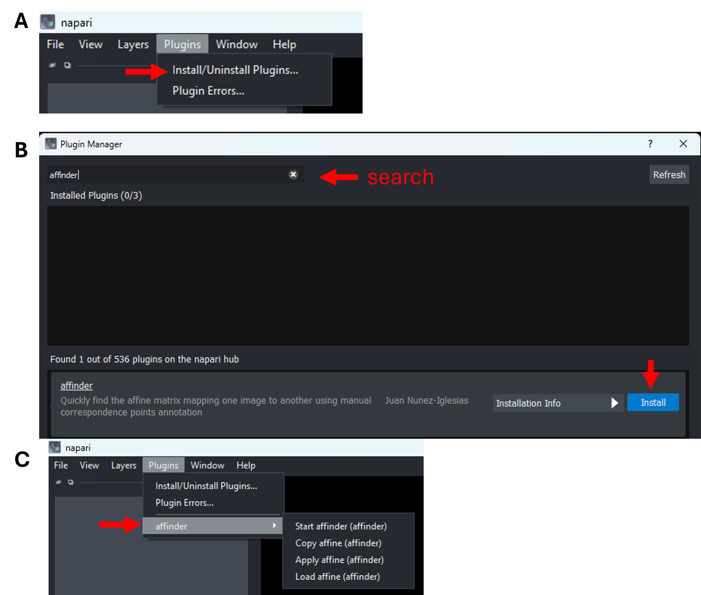
```

## custom `napari-alignment-tools`
```{r}
#| eval: true
#| echo: false
#| label: "Fig2p1-plugin-install02"
#| fig-cap: "For cutom plugin, (A) launch plugin manger under `Plugins` menu; (B) Drag the downloaded wheel file to the bottom field and click `install` (yellow arrows) and watch `Show Status` (C) for the installation progress."
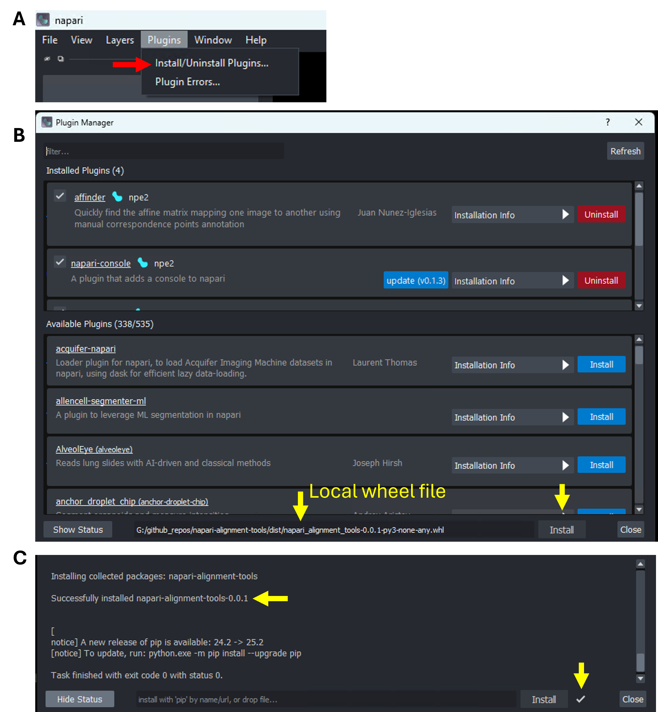
```
:::

# Data prerequisites

* **CosMx (stitched) dataset**:  See the `napari` [stitching tutorial](https://nanostring-biostats.github.io/CosMx-Analysis-Scratch-Space/posts/napari-stitching/napari-cosmx-stitching.html){target="_blank"} on how to create it for your dataset. Example file path at `~/data/cosmx/Napari`.
* **H\&E image**: Example file path at `~/data/cosmx/WTx_Exp-25_Colon_HE.png`. 

  * Napari supports various other image formats, including `TIFF`and `Zarr`. 
  * If your file format is not supported, you could convert it to the supported formats with other tools like `QuPath` (see [here](https://qupath.readthedocs.io/en/stable/docs/advanced/exporting_images.html){target="_blank"}). 

::: {.callout-tip}
For H\&E of large file size, prefer Zarr-backed images and avoid loading every layer at full resolution. Use the minimum layers you need for alignment.
:::

# Alignment workflow

## Load data

1. Start `napari`. 
2. Load H\&E: Drag the H\&E file into `napari` GUI (it will be a 2D image layer), choose `napari builtins` reader if prompted.
3. Load CosMx dataset: Drag the pre-stitched cosmx data folder (which contents morphology image, cell segmentation, cell‑type metadata, etc.) into `napari` GUI, choose `napari CosMx` reader if prompted. 

```{r}
#| eval: true
#| echo: false
#| fig-cap: "Choose reader based on image/data type."
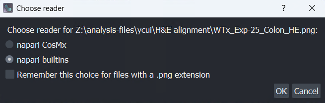
```

## Coarse alignment with `affinder` (landmarks)

Goal: Compute a transform that maps the **Moving** H\&E layer onto the **Reference** CosMx layer by clicking corresponding landmarks.

1. Open `affinder`: **Plugins → affinder → Start affinder**. A right‑dock widget appears with drop-downs listing your layers. 

   * You can further click on the `Select file` field next to `Save transformation as` line of the widget to export the transformation matrix for future usage. 
   * The widget allows 3 different transform models:
  
      * **affine** *(default)*: translation, rotation, scale, shear, reflection (most flexible).
      * **similarity**: translation, rotation, uniform scale (shape‑preserving).
      * **euclidean**: translation + rotation only (most rigid).

2. Select layers:

   * **Reference Layer** = your CosMx image (e.g., morphology or `cell_type` metadata image that has clear features).
   * **Moving Layer** = your H\&E image.

3. Start point selection: Click **Start** in the `affinder` widget.

   * `affinder` adds two `Points` layers—one for the reference, one for the moving image.
   * The viewer would focuse you on the **Reference** layer first. Click at least **three** distinct, clearly identifiable landmarks (features visible in both images) in the **Reference** layer.
   * The viewer would then switch focus to the **Moving** (H\&E) layer. Click the **corresponding** points in the **same order**.

4. Transform application: After the third pair is placed, `affinder` computes and applies the transform so the **H\&E (Moving)** aligns onto the **CosMx (Reference)**. Continue adding additional pairs (alternating layers) to refine the alignment iteratively. The more points you add, the more accurate the alignment.

5. Click **Finish** when the coarse alignment looks good. The transformation matrix used would be saved to the file defined in step (1). 

::: {.callout-important}
Order matters! Always click correspondence points in the same order across **Reference** and **Moving** images.
:::

::: {.panel-tabset}

## load data and launch `affinder`
```{r}
#| eval: true
#| echo: false
#| label: "Fig3p2_affinder01"
#| fig-cap: "The `napari` viewer has both kinds of image data loaded before starting the `affinder`. CosMx data layer `cell_type` is choosen as `reference` layer, while H&E image `WTx_Exp-25_Colon_HE` is chosen as `moving layer`."
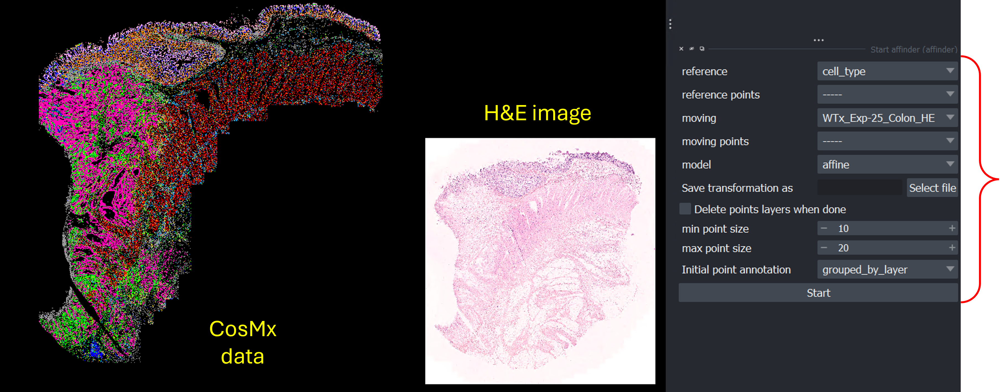
```

## point selection
```{r}
#| eval: true
#| echo: false
#| label: "Fig3p2_affinder02"
#| fig-cap: "Pairs of points are selected in the 2 layers before applying the transformation."
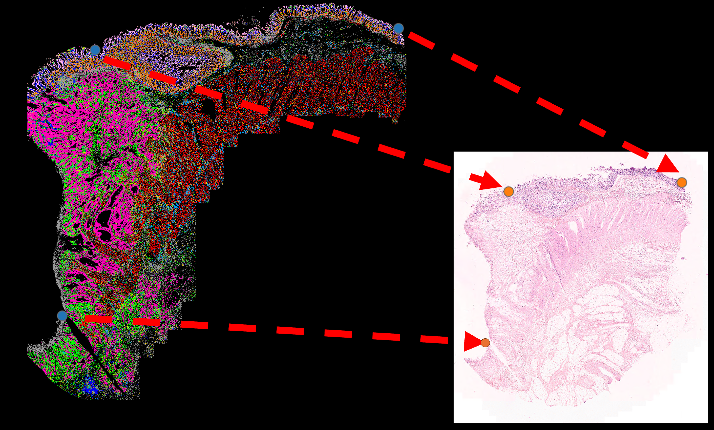
```

## aligned image
```{r}
#| eval: true
#| echo: false
#| label: "Fig1-cosmx-he-align"
#| fig-cap: "Upon clicking `Finish`, the **Moving** layer (H&E) is now displayed in a way aligned to the **Reference** layer (CosMx cell_type metadata) based on the anchor points selected."
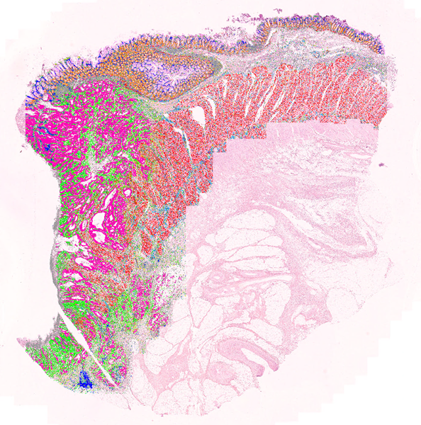
```

:::

## Fine‑tuning with custom transform widgets

Use the widgets from `napari_alignment_tools` to make controlled adjustments after `affinder`’s coarse alignment.

As shown in figure below, one should go to the the console `>` at bottom left corner of the dataset-loaded `napari` viewer and run:
```{bash}
#| eval: false
#| echo: true
#| filename: "add custom widgets in napari console"
from napari_alignment_tools.widgets import add_widgets_to_viewer
add_widgets_to_viewer(viewer)
```

This adds two dock widgets to the right dock: **Alignment Tool** (coarse parameters) and **Fine Nudge** (small increments). Both widgets allow you to put in defined numbers (instead of adding points) for transformation and thus allow the alignment occur in a more controlled way. 
```{r}
#| eval: true
#| echo: false
#| label: "Fig2p1-plugin-install03"
#| fig-cap: "After loading a pre-stitched cosmx dataset in `napari`, one could add the custm widgets (to the right dock) by running short python command in `napari` console."
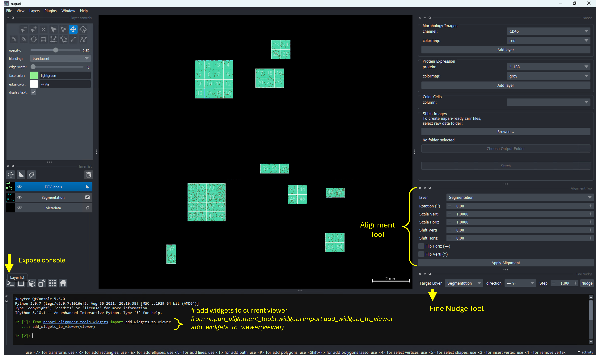
```


### Use the Alignment Tool (top panel)

1. Layer selection: In *Alignment Tool*, choose your **H\&E** image layer (the **Moving** layer you want to adjust).
2. Adjust as needed:

   * **Rotation** (−180 to 180°)
   * **Scale Verti/Horiz** (0.0001 to 1000)
   * **Shift Verti/Horiz** (−1000 to 1000 px)
   * **Flip Horiz/Verti** (checkboxes)
   
3. Apply: Click **Apply Alignment**. Inspect by toggling visibility and using opacity sliders.

### Use the Fine Nudge Tool (micro adjustments, bottom panel)

1. Layer selection: Choose the **H\&E** layer.
2. Direction & step size: 

  * Pick a direction—left (Y−), right (Y+), up (X−), down (X+), rotate counter‑clockwise (Rotate−), rotate clockwise (Rotate+).
  *  Set the **Step** (e.g., 1 px for translation; 0.5–1° for rotation).
  
3. Apply **Nudge**, repeat this until alignment is precise.

```{r}
#| eval: true
#| echo: false
#| label: "Fig4_custom"
#| fig-cap: "(A) Custom widgets from `napari_alignment_tools`; (B) Overlay of cell_type metadata on top of H&E image before vs. after fine-tuning; (C) Side-by-side view of the post-fine-tuned images."
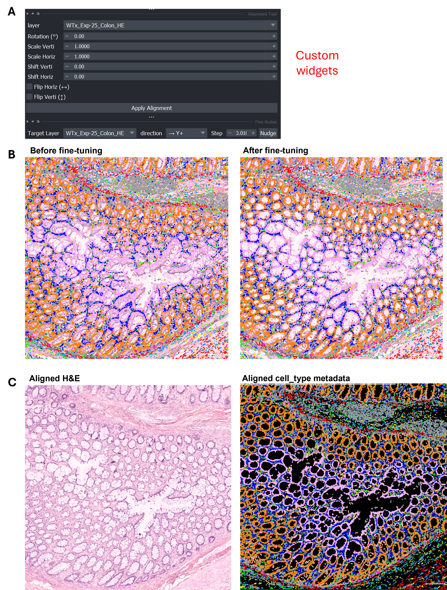
```

::: {.callout-tip}

* Use **opacity** on the H\&E layer to blend with the CosMx background.
* Toggle layer visibility (`V`) to quickly inspect.
* Link pan/zoom across layers by multi‑selecting layers and enabling **Link Layers** (chain icon) in the layer controls.

:::

### Verify & save

1. **Visual checks**: Zoom into salient structures (tissue boundaries, lumen edges, sharp features) and ensure edges coincide across layers.
2. **Save** the transformed H\&E: **File → Save Selected Layer(s)** and pick your desired format (e.g., TIFF or Zarr).
   Consider also saving the **Points** layers or the transform matrix if your widget exposes it.


# Practical Tips

* Either `affinder` or the custom transformation widgets can be **used independently** to achieve the same alignment outcome. The former uses point inputs, while the later uses the numeric inputs. 
* **Pre‑stitch CosMx FOVs** before alignment so both widgets sees a continuous reference image (see [stitching tutorial](https://nanostring-biostats.github.io/CosMx-Analysis-Scratch-Space/posts/napari-stitching/napari-cosmx-stitching.html){target="_blank"}).
* **Mind the scale.** If CosMx and H\&E pixel sizes differ greatly, start with `Affine` model in `affinder`, then refine scale with the custom Alignment Tool.
* **Avoid overfitting.** Don’t spam too many landmarks at once; add a few, check, then add more if needed.
* **Work on downsampled data** to prove the transform, then apply at full resolution if your workflow supports it.


# Gallery of H&E-aligned CosMx datasets

::: {.panel-tabset}

## Colon
```{r}
#| eval: true
#| echo: false
#| label: "FIgure5p1_Colon_ADC"
#| fig-cap: "Human Colon Adenocarcinoma."
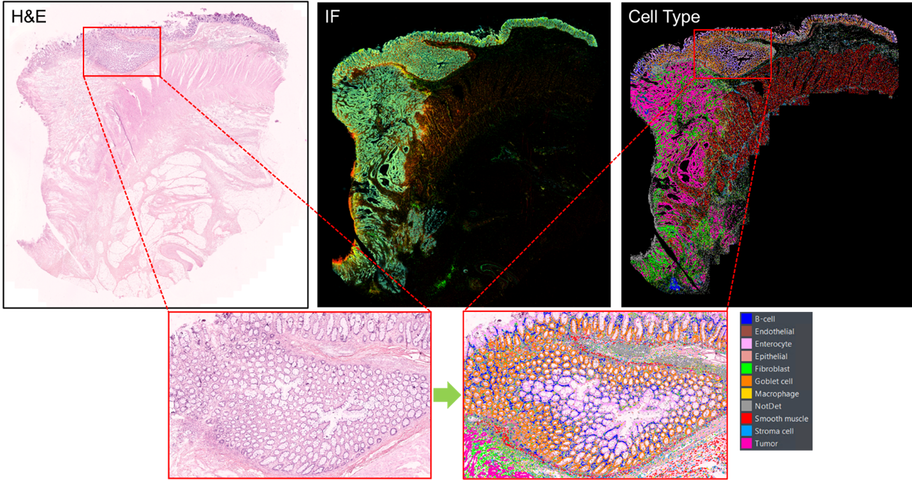
```

## Pancreas
```{r}
#| eval: true
#| echo: false
#| label: "FIgure5p2_Pancreas"
#| fig-cap: "Human Pancreas."
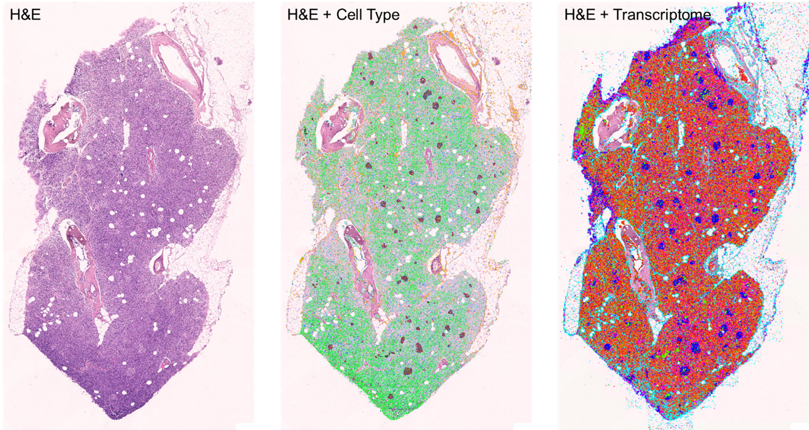
```

## Brain
```{r}
#| eval: true
#| echo: false
#| label: "FIgure5p3_Hippocampus"
#| fig-cap: "Human Hippocampus."
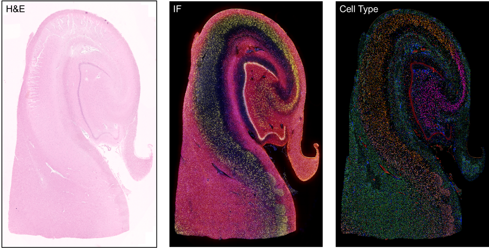
```

:::

# Resources

* [`affinder` usage](https://github.com/jni/affinder/tree/main?tab=readme-ov-file#how-to-guide){target="_blank"}
* The`.whl` file for custom widgets in [`napari_alignment_tools`](https://github.com/Nanostring-Biostats/CosMx-Analysis-Scratch-Space/tree/Main/_code/napari-alignment-tools){target="_blank"}
* `napari‑cosmx`: [Getting started](https://nanostring-biostats.github.io/CosMx-Analysis-Scratch-Space/posts/napari-cosmx-intro/){target="_blank"}
* `napari‑cosmx` [essentials](https://nanostring-biostats.github.io/CosMx-Analysis-Scratch-Space/posts/napari-cosmx-basics/using-napari-cosmx.html){target="_blank"}
* CosMx napari [stitching tutorial](https://nanostring-biostats.github.io/CosMx-Analysis-Scratch-Space/posts/napari-stitching/napari-cosmx-stitching.html){target="_blank"}


