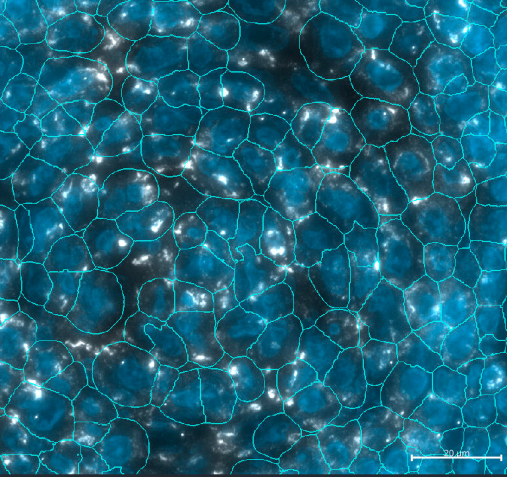

```{r}
#| eval: true
#| echo: false
#| label: "fig-gc"
#| fig.width: 5
#| fig.height: 5
#| fig-cap: "A regressed germinal center within a lymph node sample visualized with the `napari-cosmx` plugin. Membrane = Grey; DAPI = blue, cell segementation = cyan."


```


# Introducion


Immunofluorescence (IF) and protein data exported from AtoMx<sup>&#174;</sup> 
SIP are provided as multi-channel TIFF 
files, where each field of view (FOV) is contained in a separate file.
Our `napari-cosmx` plugin offers one method to stitch these individual
TIFF files, organizing them according to their spatial location. 
This stitching process within `napari-cosmx` generates a Zarr store for
each IF or protein image. For visualization of tissue microscopy data, 
[OME-TIFF](https://docs.openmicroscopy.org/ome-model/5.6.3/ome-tiff/) is a widely used format. The Zarr stores generated with `napari-cosmx` can be converted to OME-TIFF for viewing in other applications and this short blog post demonstrates how to perform this conversion.

This blog post is the fifth in our [`napari series`](https://nanostring-biostats.github.io/CosMx-Analysis-Scratch-Space/#category=napari). 
For details on generating these napari Zarr stores, refer to either the GUI-based [napari-cosmx plugin introduction](../napari-cosmx-intro/index.qmd) or the command-line tutorial on  [stitching](../napari-stitching/napari-cosmx-stitching.qmd).

:::{.callout-note}
While Napari and `napari-cosmx` can be installed on many systems, CosMx SMI data can be quite large. A slide with numerous FOVs may exceed the capabilities of a standard laptop.

`napari-cosmx` is actively and continuously under development in the RnD groups at
Bruker Spatial Biology. We do not (yet) have the source code for `napari-cosmx` opened-sourced.
Please be aware that there may be bugs and that it has not gone through the regular
level of quality and testing. Our goal here is to bring the capabilities of napari
to CosMx SMI users as fast as possible.
:::


# Installation

This tutorial uses version 0.4.17.3 of the `napari-cosmx` plugin. This version
is available as a `whl` file in the assests folder of the [Scratch Space repository](https://github.com/Nanostring-Biostats/CosMx-Analysis-Scratch-Space/blob/Main/assets/napari-cosmx%20releases/napari_CosMx-0.4.17.3-py3-none-any.whl). 


:::{.callout-note}
It is encouraged to use a virtual environment for these steps as there can 
be conflicting package and Python versions and this script has not been installed nor
tested on all configurations. The example below used Python 
3.9.13 within `pyenv`. In general, it is recommended to use Python > 3.8 and Python < 3.11 
for the `napari-cosmx` plugin as newer versions of napari are not yet integrated into the plugin.
:::


::: {.panel-tabset}

## MacOS/Unix Install

Assuming you have a `pyenv` virtual environment named napari_env:

```{.bash}
# terminal
pyenv activate napari_env
pip install "napari[all]"

# Optional use wget to download whl file directly.
# wget https://github.com/Nanostring-Biostats/CosMx-Analysis-Scratch-Space/raw/refs/heads/Main/assets/napari-cosmx%20releases/napari_CosMx-0.4.17.3-py3-none-any.whl

pip install /path/to/your/whl/file
```

You can confirm that the install worked with `pip freeze` or by directly accessing the package script: 

```{.bash}
which export-tiff
```

which should return the path to `export-tiff`.

## Windows 

For windows, [`pyenv-win`](https://github.com/pyenv-win/pyenv-win) and [`pyenv-win-venv`](https://github.com/pyenv-win/pyenv-win-venv) may be a good option but this has not been extensively tested. 

Assuming you have a `pyenv-venv` virtual environment named napari_env:

```{.bash}
# terminal
pyenv-venv activate napari_env
pip install "napari[all]"

pip install /path/to/your/whl/file
```

:::


# Usuage

For help, type `export-tiff --help` in your terminal (unix/macOS) or PowerShell (Windows).

```{.bash}
export-tiff --help
```

```
usage: export-tiff [-h] [-i INPUTDIR] [-o OUTPUTDIR] [--filename FILENAME] [--compression COMPRESSION] [-b BATCHSIZE]
                   [-s] [-c [CHANNELS ...]] [-p [PROTEINS ...]] [--levels LEVELS] [-v] [--libvips]
                   [--vipshome VIPSHOME] [--vipsconcurrency VIPSCONCURRENCY]

Export stitched Zarr to OME-TIFF

optional arguments:
  -h, --help            show this help message and exit
  -i INPUTDIR, --inputdir INPUTDIR
                        Required: Path to existing stitched output.
  -o OUTPUTDIR, --outputdir OUTPUTDIR
                        Required: Path to write OME-TIFF file.
  --filename FILENAME   Name for OME-TIFF file, use ome.tif extension.
  --compression COMPRESSION
                        Passed to TiffWriter, default is 'zlib'. Other options include 'lzma' (smallest), 'lzw', and
                        'none'
  -b BATCHSIZE, --batchsize BATCHSIZE
                        Required: the number of elements to put into each ome-tiff file. Recommended = 5 or fewer.
  -s, --segmentation    Optional: Create TIFF for segmentation mask.
  -c [CHANNELS ...], --channels [CHANNELS ...]
                        Optional: Output only specific morphology channels
  -p [PROTEINS ...], --proteins [PROTEINS ...]
                        Optional: Output only specific proteins
  --levels LEVELS       Optional: Specify number of pyramid levels.
  -v, --verbose         Print verbose output?
  --libvips             Optional: Use libvips to create pyramidal image, will be slower but more memory-efficient.
  --vipshome VIPSHOME   Optional: Path to vips binaries. Required in Windows if vips and associated DLLs are not in
                        PATH
  --vipsconcurrency VIPSCONCURRENCY
                        Optional: Specify number of threads for vips.
```

Since CosMx SMI data with hundreds of FOVs can be large (_e.g._, >50 GBs for RNA and larger still for protein data), the `--batchsize` flag can be used to create batches of smaller OME-TIFF files.
The `--batchsize` flag specifies the upper limit of the number of
channels/proteins that are included in a given OME-TIFF. 
For example, if `--batchsize` was 
set to `5`, and `-c` (channels) was also selected, the OME-TIFF file would include all five IF channels.

Note that the segmentaiton (`-s`) layer does not count toward the batch size. In other
words, if selecting `-b 5 -c -s`, the resulting OME-TIFF file will include the cell borders and the five channels. 

If you would like to generate an OME-TIFF file with only DNA, GFAP, and proteins Amyloid-Beta-1-40 and Phospho-Tau-S199, with cell borders:

```{.bash}
export-tiff -i /path/to/images/folder -o /path/to/output/folder -s -c DNA,GFAP -p Amyloid-Beta-1-40,Phospho-Tau-S199

```


# Human 6K Lymph Node Example

Let's test this script with an example. Here I used the Human Lymph Node FFPE dataset napari files that are [publicly available](https://nanostring.com/products/cosmx-spatial-molecular-imager/ffpe-dataset/cosmx-human-lymph-node-ffpe-dataset/).
This dataset has a scan area of 104 $mm^2$, 400 FOVs, and ~1.8M cells. I am using
an AWS r5b.8xlarge EC2 instance (32 vCPUs, 256 GB RAM) running linux (Amazon Linux 2). 

Navigate to the location of `napari.zip` and unzip it. 

```{.bash}
# Terminal
unzip napari.zip
```

To convert all the channels and the cell segmentation boundaries: 

```{.bash}
# Terminal
# TIME="%e %U %S %M" time export-tiff -i ./napari -o output -s -c -b 5
export-tiff -i ./napari -o output -s -c -b 5
```

> 5352.18 50467.38 11061.83 10366568

This script converted a single OME-TIFF file in just under 1.5 hours (5352/3600 = 1.49). 
The maximum resident set size (_i.e._, Dask; multiprocessing) was ~10.4 GBs. 

The size of the OME-TIFF file, which contains five IF channels plus the segmentation layer, 
is 54 GBs (_i.e._, about 91% of the size of the Zarr stores). 

The default method to convert Zarr to OME-TIFF can require more memory than your
system has. If you run into memory issues, you can try the secondary method that uses
`pyvips` (see Appendix).

# Appendix {-}

The `export-tiff` utility script runs in two different modes. The first one (default)
is generally the quicker of the two. However, if you are 
running into memory issues, you can try the second option that is memory-optimized
but runs slower and requires more disk space. 

## Installing optional dependency {-}


::: {.panel-tabset}

### MacOS/Unix Install

For macOS, I have had success with using brew following libvips' [recommendation](https://www.libvips.org/install.html). 

For Linux, be sure that the appropriate libraries are installed for your distribution. Check out
libvips' [github wiki](https://github.com/libvips/libvips/wiki/#building-and-installing) for more tips. 

### Windows 

Download and install `vips-dev-w64-all-8.16.0.zip` from [here](https://github.com/libvips/build-win64-mxe/releases/download/v8.16.0/)

Unzip it and move its contents to your desired location. Add the folder to a 
convenient location and add the location of the binaries (_e.g._, 
`C:\vips-dev-8.16.0\bin`) to your Path. Restart your computer. 

When using the `--libvips` flag within the `export-tiff` package script, python
will look for these binaries.

:::

### Running with `--libvips` {-}

Rerunning the previous Lymph Node example with `--libvips`:

```{.bash}
# Terminal
# TIME="%e %U %S %M" time export-tiff -i ./napari -o output -s -c -b 5
export-tiff -i ./napari -o output -s -c -b 5 --libvips

```

> 16720.81 17031.40 479.30 17686020


