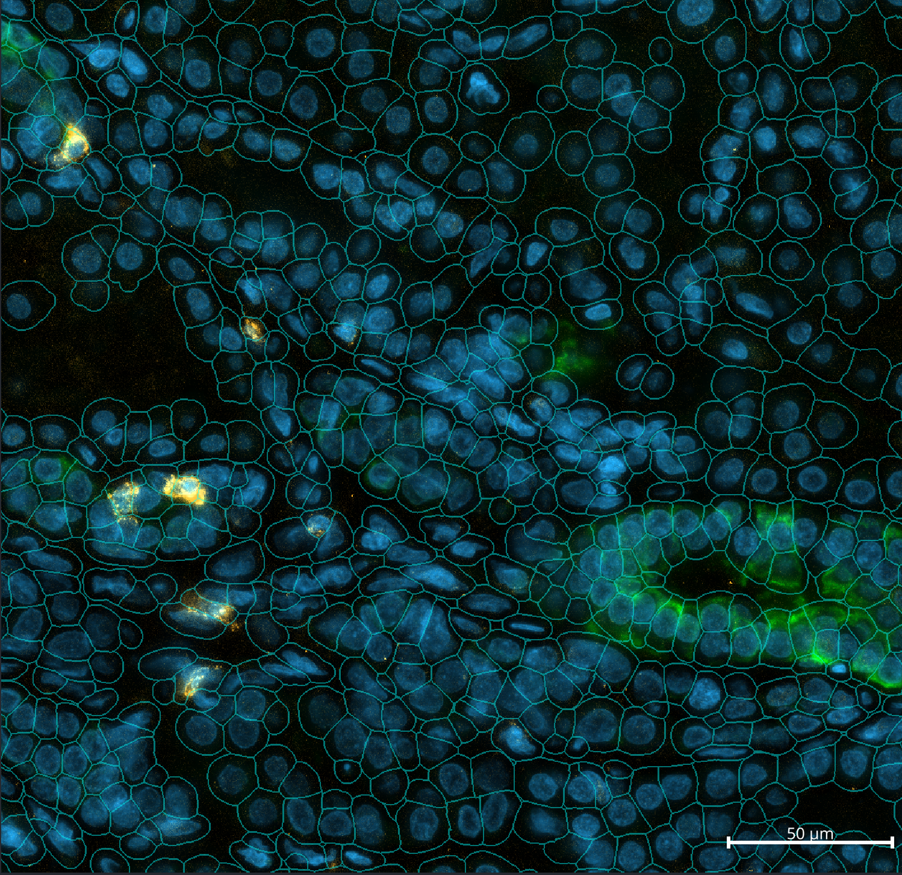
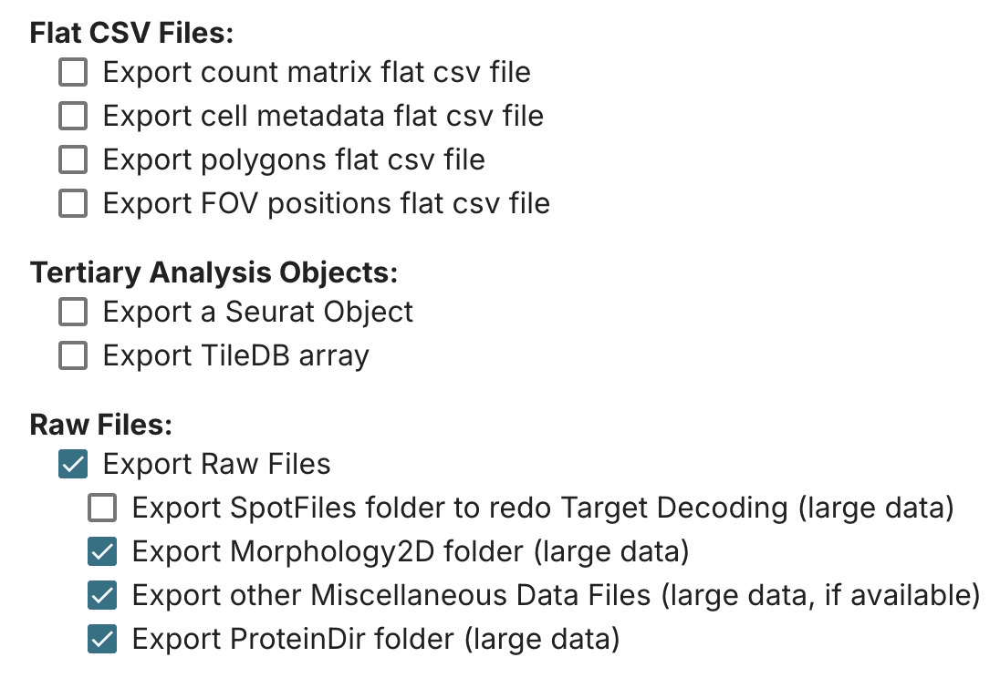

```{r}
#| eval: true
#| echo: false
#| label: "fig-example"
#| fig.width: 3
#| fig-height: 3
#| fig-cap: "A small section of CosMx SMI data showing DNA (blue), PanCK (green) and the CD3 protein (yellow)."


```

The `napari-cosmx` plugin can be used to view CosMx<sup>&#174;</sup> Spatial Molecular Imager (SMI) RNA and protein data. In a [previous post](../napari-stitching/napari-cosmx-stitching.qmd), I showed users how to programmatically
stitch RNA exports from AtoMx<sup>&#174;</sup> Spatial Informatics Platform (SIP).
The process used to stitch protein is similar to RNA with some adjustments that are found below.

This tutorial uses version 0.4.17.3 of the `napari-cosmx` plugin. This version
is available as a `whl` file in the assets folder of the [Scratch Space repository](https://github.com/Nanostring-Biostats/CosMx-Analysis-Scratch-Space/blob/Main/assets/napari-cosmx%20releases/napari_CosMx-0.4.17.3-py3-none-any.whl). The tutorial
below also builds upon the RNA-based post that more broadly covers how to create
the napari environment, installing the plugin, and running scripts. 

When `napari-cosmx` is installed, we get a few package scripts that can be called directly. The ones needed to stitch protein are:

- `stitch-images`, which builds the IF zarr stores
- `stitch-expression`, which creates the zarr stores for each protein

# Exporting protein data

When exporting data from AtoMx SIP, be sure to select "Raw Files" and include Morphology2D,
Miscellaneous, and ProteinDir (@fig-export-options).

```{r}
#| eval: true
#| echo: false
#| label: "fig-export-options"
#| fig-cap: "Export these components to stitch protein."


```

# Stitching immunofluorescence images

This step is identical for RNA and protein.

```{.bash}
stitch-images --help
```

```         
usage: stitch-images [-h] [-i INPUTDIR] [--imagesdir IMAGESDIR] [-o OUTPUTDIR] [-f OFFSETSDIR] [-l] [-u UMPERPX] [-z ZSLICE] [--dotzarr]

Tile CellLabels and morphology TIFFs.

optional arguments:
  -h, --help            show this help message and exit
  -i INPUTDIR, --inputdir INPUTDIR
                        Required: Path to CellLabels and morphology images.
  --imagesdir IMAGESDIR
                        Optional: Path to morphology images, if different than inputdir.
  -o OUTPUTDIR, --outputdir OUTPUTDIR
                        Required: Where to create zarr output.
  -f OFFSETSDIR, --offsetsdir OFFSETSDIR
                        Required: Path to directory location containing a file ending in FOV_Locations.csv or legacy format latest.fovs.csv.
  -l, --labels          
                        Optional: Only stitch labels.
  -u UMPERPX, --umperpx UMPERPX
                        Optional: Override image scale in um per pixel.
                        Instrument-specific values to use:
                        -> beta04 = 0.1228
  -z ZSLICE, --zslice ZSLICE
                        Optional: Z slice to stitch.
  --dotzarr             
                        Optional: Add .zarr extension on multiscale pyramids.
```

Example:
```{.bash}
stitch-images -i path/to/CellStatsDir -o path/to/napari_zarr -f /path/to/RunSummary
```

# Stitch Protein Images

RNA uses `read-targets` to create a file that stores the spatial location of RNA transcripts. In contrast, Protein SMI data are more similar to IF TIFF files and so
we use the `stitch-expression` package script to stitch together individual protein files. 
When complete, protein data will be found in the `images/protein` subfolder. 

```{.bash}
stitch-expression --help
```

```         
usage: stitch-expression [-h] [-i INPUTDIR] [-o OUTPUTDIR] [-t TAG] [-u UMPERPX] [-s SCALE] [-c CYCLE] [--dotzarr]

Tile protein expression images

optional arguments:
  -h, --help            show this help message and exit
  -i INPUTDIR, --inputdir INPUTDIR
                        Required: Path to parent directory containing CellStatsDir, RunSummary, AnalysisResults, and ProteinDir.
  -o OUTPUTDIR, --outputdir OUTPUTDIR
                        Required: Where to create zarr output.
  -t TAG, --tag TAG     
                        Optional: Tag to append to end of protein names.
  -u UMPERPX, --umperpx UMPERPX
                        Optional: Override image scale in um per pixel.
                        Instrument-specific values to use:
                        -> beta04 = 0.1228
  -s SCALE, --scale SCALE
                        Optional: Scale of expression images relative to raw,
                          use if decoded images are binned.
  -c CYCLE, --cycle CYCLE
                        Optional: Cycle to use, default is 1.
  --dotzarr             
                        Optional: Add .zarr extension on multiscale pyramids.
```

Example:

```{.bash}
stitch-expression -i path/to/parent/slide_folder -o path/to/napari_zarr
```


