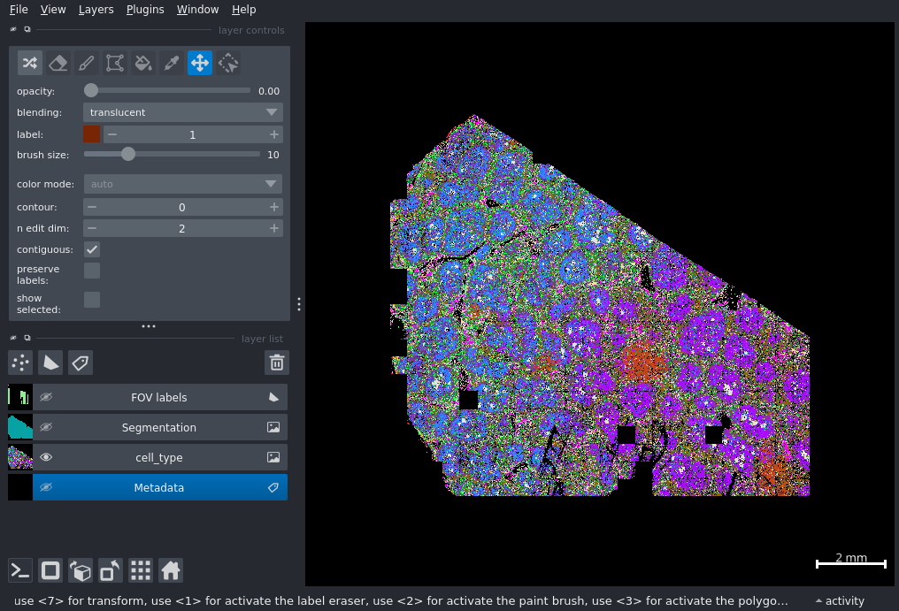

# Introducion

I am consistently impressed by the remarkable cellular resolution, sensitivity, and 
comprehensive spatial profiling capabilities that CosMx<sup>&#174;</sup> 
SMI technology offers. Indeed, I often analyze datasets that consist of 10s of 
slides and millions of cells -- numbers that are steadily growing with time. 

At several points in my analysis workflow I need to subset the data. For example,
I may want to examine a specific niche or ask what the molecular composition of
each kidney glomerulus looks like. While some of these subsets can be achieved
by computational means, there are some scenarios where I isolate specific regions
or specific cells by directly selecting them on the tissue. I refer to this as
selecting Regions of Interest (ROIs). 

In this post, I will show you how to define ROIs using the `napari-cosmx` plugin.
In a future post, we'll show a similar approach using R.

## Preliminaries

This is the fourth installment of our [`napari series`](https://nanostring-biostats.github.io/CosMx-Analysis-Scratch-Space/#category=napari). Readers should be familiar
with the [napari-cosmx plugin](../napari-cosmx-intro/index.qmd) and the [basics](../napari-cosmx-basics/using-napari-cosmx.qmd). I'll also make use of the
python interpreter and users may benefit from reviewing the post on [stitching](../napari-stitching/napari-cosmx-stitching.qmd) before
reading further. 


-   @sec-selecting-groups-of-cells shows a step-by-step guide to create ROIs. It
starts with a simple polygon followed by adding additional code to make the process
of ROI creation more automated via keyboard shortcuts.
-   @sec-selecting-individual-cells shows another way to selection "ROIs" and 
that's by selecting individual cells.

# Selecting Groups of Cells {#sec-selecting-groups-of-cells}

There are two ways to interact with napari and the napari-cosmx plugin. The first is via the GUI (see [napari-cosmx plugin](../napari-cosmx-intro/index.qmd) and the [basics](../napari-cosmx-basics/using-napari-cosmx.qmd) for a refresher).
If you're working with the GUI, drag and drop your CosMx SMI napari folder into napari's main window to view the tissue. Once openned, you can access the ipython terminal by clicking on the  `>_` icon which is located on the bottom left of the application ([see yellow arrow in the previous post](../napari-cosmx-basics/using-napari-cosmx.qmd#fig-initial){target="_blank"}. The main object that we'll work with is named `gem` (for Gemini). 

For users more comfortable with 
directly launching napari and napari-cosmx using the command line, this
second method is for you. Activate your virtual environment containing the napari-cosmx plugin. 
I'm testing this with Python 3.9, pyenv, [napari 0.5.4](https://napari.org/dev/release/release_0_5_4.html), PyQt5 5.15.11, and [napari_CosMx-0.4.17.1](https://github.com/Nanostring-Biostats/CosMx-Analysis-Scratch-Space/blob/05868d8643b2cba0d4248d0d402927284884f7ae/assets/napari-cosmx%20releases/napari_CosMx-0.4.17.1-py3-none-any.whl). After activation, launch ipython and then instantiate your `gem` object.

```
# in bash
cd to_project_directory
pyenv activate your_virtual_environment_name
ipython

```

```{.python}
# in ipython/python
from importlib.metadata import metadata
import numpy
import pandas as pd
import os
from napari_cosmx.gemini import Gemini
import pickle
from os import listdir
#from napari_animation import Animation
import imageio

data_dir = '/home/ec2-user/data/Evelyn/Marketing/LN4_6k_analysis/00-data/napari'
gem = Gemini(data_dir)

````

:::{.callout-note}
If are working directly in ipython, you can open up the right hand widget using the
`show_widget` method.
:::


Whichever method above you chose, our example dataset already has the metadata loaded. 

```{.python}
gem.metadata
```

```
               cell_ID    cell_type initial_cell_type  leiden
UID                                                          
10101        c_1_100_1     B cell 1          B cell 1       0
10200      c_1_100_100   CD4 T cell        CD4 T cell       2
1000100   c_1_100_1000     B cell 1          B cell 1       0
1002101   c_1_100_1001   CD4 T cell        CD4 T cell       2
1004104   c_1_100_1002     B cell 1          B cell 1       0
...                ...          ...               ...     ...
350859     c_1_395_592   CD4 T cell        CD4 T cell       2
20457783  c_1_254_4523     B cell 1          B cell 1       0
3261907   c_1_271_1806     B cell 2          B cell 2       1
4670103   c_1_182_2161  plasma cell       plasma cell      12
25664444   c_1_88_5066  plasma cell       plasma cell      12

```

Let's cells by `cell_type`. I prefer the terminal for this task as I have finer
control of the individual colors for each cell type. 

```{.python}
my_colors = {
"B cell 1": "#AA0DFE",
"B cell 2": "#3283FE", 
"CD4 T cell": "#85660D", 
"B cell 3": "#782AB6", 
"fibroblast reticular cell 1": "#565656", 
"fibroblast reticular cell 2": "#1C8356", 
"macrophage": "#16FF32", 
"pericyte": "#F7E1A0", 
"GC B cell": "#E2E2E2", 
"CD8 T cell": "#1CBE4F", 
"interferon-stimulated cell": "#C4451C", 
"APC 1":"#DEA0FD", 
"plasma cell":"#FE00FA", 
"NK cell":"#325A9B", 
"nonspecific":"#FEAF16", 
"epithelial cell":"#F8A19F", 
"APC 2":"#90AD1C", 
"dendritic cells":"#F6222E"
}

gem.viewer.layers['Segmentation'].visible = False
gem.viewer.layers['FOV labels'].visible = False

gem.color_cells("cell_type", color=my_colors)

# Optional step
fig_path = "./fig-cell-types.png"
with imageio.get_writer(fig_path, dpi=(250, 250)) as writer:
        screenshot = gem.viewer.screenshot(canvas_only=True)
        writer.append_data(screenshot)

```

At this point, you're image should look like @fig-cell-types.

```{r}
#| eval: true
#| echo: false
#| label: "fig-cell-types"
#| fig-cap: "Lymph node dataset with colors corresponding to cell types."


```


Let's create a single ROI around one of the nodules. Here are the steps: 


1. Zoom and pan to desired region
2. Create a Shapes layer by clicking the filled white polygon on the left side panel.
3. Select face color and edge color. Tip: to show no face color, set the alpha to 0.
4. Click on the shape type and draw polygon
5. Optional: save ROI to disk

Steps 1-4 can be seen in the video below.

 

We can rename that layer by double clicking it or with the command below.

```{.python}
gem.viewer.layers['Shapes'].name = 'ROI001'
```

We can also _save_ this ROI as a pickle file so we can later come back to it when
we open the sample again. 

To save:

```{.python}
gem.save_layers(['ROI001'], "path/to/output/data")
```

And if we want to load that file later:

```{.python}
gem.load_layers(['ROI001'], "path/to/output/data")
```

## More efficient ROI creation

There are many nodules in this sample. While the process of creating an ROI is simple,
this manual process can take time. It can be more efficient to look at computational
approaches like defining these nodules based on shared cell type composition (_i.e._, niche). 
But if we still want fine control of the ROIs, we can speed up this process by 
creating a few helper functions that do many of these steps for us. 

In the code below, we are creating a _keyboard shortcut_ that will create a new
shapes layer simply by pressing `n` on your keyboard. The new layer will be named ROI001
if it's the first one; otherwise, it will add an integer to the ROI name (ROI002, ROI003...).
After creating a new layer, pressing `p` will activate the polygon tool allowing you
to select the vertices of a given polygon. Double-clicking the last vertex will
"close" the polygon. 

:::{.callout-tip}
I tend to keep the shapes layer inactive whenever possible. This limits the number
of accidental vertex additions to a shape. 
:::

Here's the code. Be sure to add the shortcut definitions _after_ creating the `gem` object.
You can change the color and edge width to any valid value. Here I'll make the 
border yellow with a width of 100.

```{.python}

def find_next_roi(my_list):
  """Finds the next ROI code in a list of ROI strings.

  Args:
      my_list: A list of strings in the format "ROIxxx" where xxx are digits.

  Returns:
      The next ROI code in the sequence, or "ROI001" if the list is empty 
      or the next sequential code if no gap is found.
  """

  if not my_list:  # Handle empty list
    return "ROI001"

  # Extract numeric parts and convert to integers
  numbers = [int(item[3:]) for item in my_list]

  # Sort the numbers in ascending order
  numbers.sort()

  # Find the first gap in the sequence
  for i in range(len(numbers) - 1):
    if numbers[i + 1] - numbers[i] > 1:
      next_number = numbers[i] + 1
      return f"ROI{next_number:03d}"

  # If no gap is found, return the next sequential number
  next_number = numbers[-1] + 1  # Get the last number and increment
  return f"ROI{next_number:03d}"

# This keybinding makes it easier to create a new shape layer for ROIs
@gem.viewer.bind_key('n', overwrite=True)
def new_roi_layer(viewer):
    # Search layers for "ROI" pattern
    layers = viewer.layers
    names = [x.name for x in layers]
    names_filtered = [item for item in names if "ROI" in item]
    new_roi_name = find_next_roi(names_filtered)
    print(f"Creating {new_roi_name} layer.")
    viewer.add_shapes(
        shape_type='polygon',
        scale = [gem.mm_per_px, gem.mm_per_px],
        name=new_roi_name,
        face_color='transparent',
        edge_color='yellow',
        edge_width=100
    )


```

In the video below, I am quickly creating a new shapes layer using the keyboard
combination `n + p`.

 


And now that I have four ROIs, I can save them like this: 

```{.python}
N=4
roi_list = ['ROI'+str(i).zfill(3) for i in range(1, N+1)]
gem.save_layers(roi_list, "path/to/output/data")
```


## Subsetting Based on ROIs

What we would like to do now is to identify which of the cells are in each of these
polygons. There's a method available in `napari-cosmx` to do just that. 

Using the `roi_list` list we created above, we can generate a Boolean column
in the metdata for all of the ROIs. 

:::{.callout-note}
Depending on the size of the sample, the size of the ROI(s), and your hardware, this
process can be computationally intense. 
:::


```{.python}
new_metadata = gem.layers_to_metadata(roi_list)

new_metadata
```


```
               cell_ID    cell_type initial_cell_type  ...  ROI002  ROI003  ROI004
UID                                                    ...                        
10101        c_1_100_1     B cell 1          B cell 1  ...   False   False   False
10200      c_1_100_100   CD4 T cell        CD4 T cell  ...   False   False   False
1000100   c_1_100_1000     B cell 1          B cell 1  ...   False   False   False
1002101   c_1_100_1001   CD4 T cell        CD4 T cell  ...   False   False   False
1004104   c_1_100_1002     B cell 1          B cell 1  ...   False   False   False
...                ...          ...               ...  ...     ...     ...     ...
350859     c_1_395_592   CD4 T cell        CD4 T cell  ...   False   False   False
20457783  c_1_254_4523     B cell 1          B cell 1  ...   False   False   False
3261907   c_1_271_1806     B cell 2          B cell 2  ...   False   False   False
4670103   c_1_182_2161  plasma cell       plasma cell  ...   False   False   False
25664444   c_1_88_5066  plasma cell       plasma cell  ...   False   False   False
```

ROIs can be hierarchical. For example, one can create concentric rings around a 
focal region. So a given cell can be True for multiple ROIs. 

If you prefer to have these extra columns converted into a single column with 
the name of the ROI a given cell is found in, you can use this function.

```{.python}


def generate_roi_summary_column(df):
    """
    Generates a 'ROI' column based on all ROI columns in the dataframe and removes the individual ROI columns.

    Args:
        df: The pandas dataframe containing ROI columns.

    Returns:
        The updated dataframe with the 'ROI' summary column and individual ROI columns removed.
    """

    # Get all columns that start with 'ROI'
    roi_cols = [col for col in df.columns if col.startswith('ROI')]

    # Filter dataframe to only include ROI columns
    roi_df = df[roi_cols]

    # Create a new column 'ROI' and initialize it with None
    df['ROI'] = None

    # Iterate over each row
    for index, row in roi_df.iterrows():
        # Check if all values in the row are False
        if not any(row):
            continue  # Keep 'ROI' as None

        # If there's at least one True, find the first column name where it's True
        for col in roi_cols:
            if row[col]:
                df.loc[index, 'ROI'] = col
                break

    # Drop the ROI columns
    df.drop(columns=roi_cols, inplace=True)

    return df

```

Here's a tabulation of the number of cells found in each ROI in this example.

```{.python}

meta_summary = generate_roi_summary_column(new_metadata)

meta_summary.ROI.value_counts()

```


```
ROI
ROI001    13503
ROI003     8536
ROI002     7686
ROI004     5721
Name: count, dtype: int64
```

As you can see in the code above, in the case you have hierarchial ROIs, a given
cell that is present in multiple ROIs will be assigned the first ROI in the list.

# Selecting Individual Cells {#sec-selecting-individual-cells}

Sometimes I want to focus on individual cells instead of regions. A typical case
for me is when I want to select "anchor" cells for use with InSituType. And while the
above polygon-based ROI selection approach _does work_ on single cells, it's a little more
effort than just clicking a cell.
 
Here I to zoom into an arbitrary position, replace filled
polygons with cell type contours, and turn on a few IF channels.

```{.python}

gem.viewer.layers['cell_type'].visible = False
gem.color_cells("cell_type", color=my_colors, contour = 1)

gem.viewer.window.set_geometry(0, 49, 1440, 773)
gem.viewer.camera.center = (0.0, 2.2981841637346654, 12.99023480800836)
gem.viewer.camera.zoom = 7477.634103126872

gem.add_channel('CD68', colormap = 'red') 
cd68 = gem.viewer.layers['CD68']
cd68.contrast_limits = [1560.7958115183246, 5072.586387434555]

gem.add_channel('PanCK', colormap = 'green') # PanCK
PanCK = gem.viewer.layers['PanCK']
PanCK.contrast_limits = [2331.937172774869, 9234.471204188483]

gem.add_channel('Membrane', colormap = 'cyan') # membrane
mem = gem.viewer.layers['Membrane']
mem.contrast_limits = [3684.502617801047, 18176.879581151832]

```


In the video below, I selected a few cells using the Points layer.

 


Here are those cell IDs. 

```{.python}
df = gem.layers_to_metadata(['Points'])
df_filtered = df.loc[df['Points'] == True].cell_ID
df_filtered
```


```
UID
13697552    c_1_151_3701
14115200    c_1_151_3757
14554376    c_1_151_3815
15437192    c_1_151_3929
15547400    c_1_151_3943
16000151    c_1_151_4000
16329832    c_1_151_4041
19053376    c_1_151_4365
19105792    c_1_151_4371
19132027    c_1_151_4374
Name: cell_ID, dtype: object

```

# Conclusion

This blog post provides a step-by-step guide on defining Regions of Interest (ROIs)
in CosMx SMI data using the napari-cosmx plugin. It demonstrated how to manually
select ROIs with polygons, streamline the process with keyboard shortcuts for 
efficiency, and subset data based on these selections. I also illustrated how to
select individual cells using a Points layer in napari, offering a precise method
for identifying cells of interest for further analysis. The code used here has not
gone through the typical, vigorous testing process. Please reach out and file a
Github issue if you find any bugs. 


