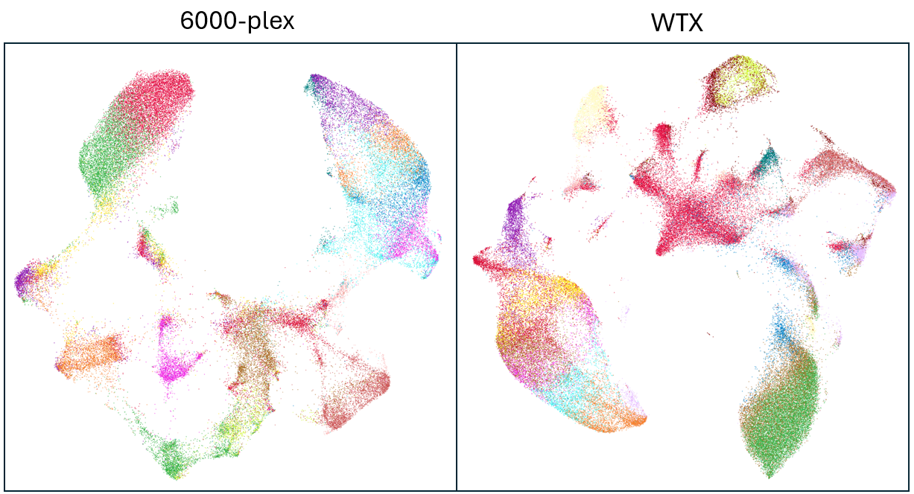
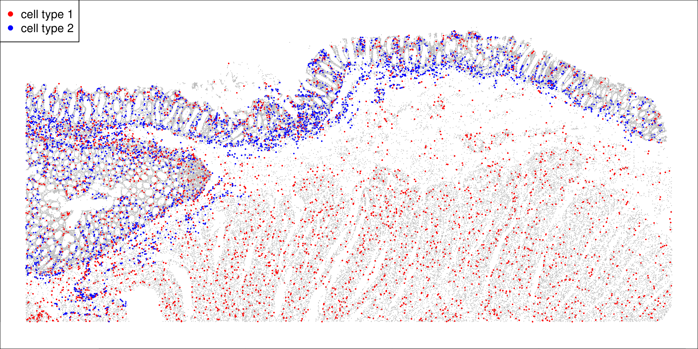
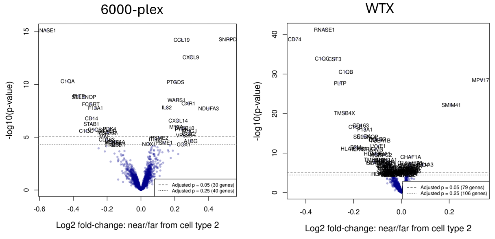

# Introduction 

Choosing the right panel for a spatial transcriptomics study is not always a trivial exercise. 
Higher-plex panels have the obvious appeal of more data per cell and a view into a greater scope of biology,
while lower-plex panels are lower-cost and faster to run. 
To help choose a panel, investigators often run the same tissue through multiple panels. 
Here we recommend analyses for these datasets. 

There are a *lot* of ways to compare two datasets, and a lot of energy is spent
comparing metrics like plex, counts per cell, counts per gene per cell, background levels,
segmentation accuracy, etc... 
(Perhaps even more energy is spent arguing about which of these metrics are most important.)
What actually matters, of course, isn't any single metric: 
it's the *richness of biological insight* you are able to extract from a dataset. 
While data quality is important, its importance lies entirely in how it impacts your ability to
 extract biological conclusions from your data. 
To get at the rather broad concept of "biological richness", we suggest two standard analyses:

1. How deep and clean are the cell typing results? 
2. How much do you learn from a differential expression analysis? 

We suggest these comparisons because they capture the two key phases of most analyses.
You begin with cell typing, characterizing the basic layout of your tissue. 
Then, perhaps after exploratory analyses, you ask a specific biological question.
Very often, this question takes the form of a differential expression analysis.
For example, "How do tumor cells respond when proximal to T-cells?", 
"How do microglia react to amyloid beta plaques?",
or "How do intratumoral macrophages differ in responders vs. non-responders?"
Thus by performing a relevant differential expression analysis, we can get a sense of the
richness of results produced by two panels.

To demonstrate this approach, compare CosMx Human 6k Discovery Panel results and 
CosMx Human Whole Transcriptome Panel results collected from serial sections from a colorectal tumor.
Use the code below as a template for running similar comparisons in your own data (after QC, normalization, etc...).

# Cell typing

## Gaining a gestalt of cell type resolution

First, we'll ask a simple, high-level question: how many cell types can be detected,
 and how well-resolved are they?
Our goal here is not to carefully validate every cell type call; rather, we just
 want to get a sense of how rich and crisp the cell typing results are. 
Our usual expectation is that a given tissue has 10-20 highly distinct cell types,
 and that most panels are sufficient to resolve them. 

(Beyond broad cell types, we may wish for more nuanced dissection of cell states. 
We will get at this ability with an analysis of T-cell subtyping accuracy, and 
with differential expression analysis, which characterizes changes within a cell type across space.)

To get at a general sense of the cell type granularity you can see with each panel, we'll simply run unsupervised clustering and UMAP.
Below is code to quickly perform these steps beginning with a Seurat object exported from AtoMx<sup>&#174;</sup> SIP:

```{r}
#| eval: false
#| echo: true

# get hvgs, scale and run PCA:
seu <- NormalizeData(seu) 
seu <- FindVariableFeatures(seu, selection.method = "vst", nfeatures = 3000)
seu <- ScaleData(seu, features = VariableFeatures(seu))
seu <- RunPCA(seu, features = VariableFeatures(seu))

# cluster:
seu <- FindClusters(seu, resolution = 1)

# umap:
seu <- RunUMAP(seu, dims = 1:30, n.neighbors = 40, metric = "cosine", min.dist = 0.01, spread = 5)

# plot umap and cell types:
distinct_colors <- c(
  "#e6194b", "#3cb44b", "#ffe119", "#0082c8", "#f58231", "#911eb4", "#46f0f0", "#f032e6",
  "#d2f53c", "#fabebe", "#008080", "#e6beff", "#aa6e28", "#fffac8", "#800000", "#aaffc3",
  "#808000", "#ffd8b1", "#000080", "#808080", "#FFFFFF", "#000000", "#a9a9a9", "#DC143C",
  "#00FFFF", "#7FFF00", "#FF7F50", "#6495ED", "#DC143C", "#00CED1", "#FFD700", "#ADFF2F",
  "#4B0082", "#FF69B4", "#CD5C5C", "#20B2AA", "#9370DB", "#3CB371", "#FF4500", "#DA70D6",
  "#7B68EE", "#00FA9A", "#B22222", "#5F9EA0"
)

DimPlot(seu, cols = rep(distinct_colors, 10)) + NoLegend()
```

```{r}
#| eval: true
#| echo: false

```

While the UMAP plots appear quite different at first, we see on closer examination that
 the broad structure is similar in both cases, with the same islands and bridges 
 and largely the same clustering results in both datasets. 
If we were inclined to do so, modifying the UMAP parameters could probably make either dataset
 more strongly resemble the other.
So in this example, our check for cell type resolution comes in reassuringly as a tie. 

For a more thorough evaluation of cell typing quality, consider the following additional analyses:

- Plot cell types in physical space and confirm biological sanity
- Run a marker ID heatmap and confirm that markers for distinct cell types concentrate in different clusters.

## Evaluating accuracy of fine-grained cell typing

We also want to assess the quality of cell typing.
For this comparison, we'll focus on immune cells, which are convenient because
 there is widespread agreement about their marker genes and because they appear in most tissues. 
If your tissue in question has very few immune cells (say, <2000), you may want to assess
cell typing accuracy with other cell types. 

For immune cell typing, we recommend our newly-released method [HieraType](https://nanostring-biostats.github.io/CosMx-Analysis-Scratch-Space/posts/immune-cell-typing-smooth/){target="_blank"}.

Use the below code to quickly identify and subtype immune cells, then produce a heatmap of marker genes.
This code picks up where the previous left off. 
Specifically, it assumes we have a Seurat object, including UMAP results. 
See the HieraType package documentation for how to run outside the Seurat ecosystem. 

Note: to prevent background counts from confusing the evaluation of marker heatmaps,
 we'll subtract background from each cluster's mean expression profile prior to plotting. 
A cluster's mean negprobe counts gives us a fairly accurate estimate of the 
 level of background in its marker genes counts. 

```{r}
#| eval: false
#| echo: true

# install HieraType:
if (FALSE) {
  remotes::install_github("Nanostring-Biostats/CosMx-Analysis-Scratch-Space", 
                          subdir = "_code/HieraType", ref = "Main")
}
# load package:
library(HieraType)
library(ggplot2)

# define a pipeline to automatically call broad cell types then proceed through fine T-cell subtypes:
ct_pipeline <- make_pipeline(
  markerslists = list("l1" = HieroType::markerslist_l1,
                      "l2" = HieroType::markerslist_immunemajor,
                      "lt" = HieroType::markerslist_tcellmajor,
                      "lt4" = HieroType::markerslist_cd4tminor,
                      "lt8" = HieroType::markerslist_cd8tminor
  ),
  priors = list("l2" = "l1",
                 "lt" = "l2",
                 "lt4" = "lt",
                 "lt8" = "lt"
  ),
  priors_category = list("l2" = "immune",
                         "lt" = "tcell",
                         "lt4" = "cd4t",
                         "lt8" = "cd8t"
  )
)

htres <-  HieroType::run_pipeline(
  pipeline = ct_pipeline,
  counts_matrix = Matrix::t(seu[["RNA"]]@counts),
  adjacency_matrix = as(seu@graphs$umapgrph, "dgCMatrix")
)

# primary result: the cell type calls and posterior probabilities:
probdf <- htres$post_probs$l1

## prepare data for marker gene heatmap:
fc_subclus_ctl_gran <- clusterwise_foldchange_metrics(counts = seu[["RNA"]]@counts,
                                                      metadata = htres$post_probs[[1]],
                                                      cluster_column = "celltype_granular"
)
# subtract background from the mean per-cluster expression profiles:
for (name in unique(htres$post_probs[[1]]$celltype_granular)) {
  isthiscelltype <- htres$post_probs[[1]]$celltype_granular == name
  meannegthiscelltype <- Matrix::mean(seu@assays$negprobes$counts[, isthiscelltype])
  
  fc_subclus_ctl_gran$cluster_expr[fc_subclus_ctl_gran$cluster == name] <- 
    pmax(fc_subclus_ctl_gran$cluster_expr[fc_subclus_ctl_gran$cluster == name] - meannegthiscelltype, 0)
}
# create the heatmap:
hm_unsup <- marker_heatmap(fc_subclus_ctl_gran,
                           extras = c("CD3D", "CD4", "FOXP3", "CD8B", "CD8A")
)
print(hm_unsup)
```

The marker heatmaps from both datasets are below, first 6k, then WTX:

```{r}
#| eval: true
#| echo: false
knitr::include_graphics("./figures/marker_heatmap - sixk.png")
knitr::include_graphics("./figures/marker_heatmap - wtx.png")
```

For most purposes, we won't care about small differences between these heatmaps;
rather, we just want to check that both sets of cell typing results are sane at 
 an equivalently granular level. 
Comparing the marker gene heatmaps from both datasets, we see basic sanity in both cases,
 and cleaner marker profiles in the WTX data, suggesting either more accurate cell typing
 or better cell segmentation. 

We'll also want to look at our cell type calls in space as a final sanity check.
 
 
# Differential expression analysis

Spatial analyses often culminate in a differential expression analysis investigating
 how a cell type changes based on its spatial context. 
Below we give an easily-modifiable framework for such an analysis.
The below code is designed to be simple and quick. 
For optimal DE analyses, see the R package smiDE, described 
[here](https://www.biorxiv.org/content/10.1101/2024.08.02.606405v2.abstract){target="_blank"}.

In our example, we'll look at how macrophages vary based on proximity to vasculature, 
 which we detect as endothelial cells. 

```{r}
#| eval: false
#| echo: true
# Example DE question: 
# How does cell type 1 change in response to neighboring cells of cell type 2?

# designate which cells are cell type 1 and 2:
is1 <- probdf$celltype_granular == "macrophage"
is2 <- probdf$celltype_granular == "endothelial"

# Special case: for a cell type where we care about structures, e.g. blood vessels
# or epithelial walls, we can discard lonely cells to focus on distance to structures. 
# The below function winnows down a set of cells to only those belonging to decent-sized
# groups in space. 
inastructure <- function(xy, inds, eps = 0.2, minPts = 10) {
  #' xy: matrix of xy positions
  #' inds: logical vector saying which elements of xy are the cell type in question
  #' eps: radius argument in dbscan
  #' minPts: minimum cluster size to keep
  #' returns a logical vector like inds, but reporting membership in spatial clusters of size >= minPts
  
  # run dbscan clustering of positions:
  db <- dbscan::dbscan(x = xy[inds, ], eps = eps, minPts = minPts)
  # report all positions that are part of a cluster:
  keep <- inds
  keep[inds][db$cluster != 1] <- FALSE
  return(keep)
}
# only keep cell type 2 cells that fall in a structure of at least 5 cells:
is2 <- inastructure(xy = xy, inds = is2, eps = 0.2, minPts = 20)

# plot their layouts:
plot(xy, col = c("grey", "red", "blue")[1 + is1 + 2 * is2],
     pch = 16, cex = 0.15 + 0.15 * (is1 + is2), asp = 1)
```

```{r}
#| eval: true
#| echo: false

```

We see macrophages spread throughout the tissue, and endothelial cells
 at the border of the colon epithelium. 
 
There are a number of ways to quantify proximity to a cell type. We can:

- Count how many of the cell type falls in each cell's neighborhood
- Measure each cell's distance to the nearest member of the cell type
- Treat the above variables as continuous, dichotomize them into high/low, or break them into discrete bins.

All the above approaches are valid. Below we'll demonstrate calculation of all approaches,
 then run DE using continuous number of endothelial neighbors.

```{r}
#| eval: false
#| echo: true
# get distance to nearest cell of cell type 2:
neighbors <- FNN::get.knnx(data = xy[is2, ], 
                           query = xy, 
                           k = 20)
# record various metrics of proximity:
proxdf <- data.frame(
  dist_to_celltype = neighbors$nn.dist[, 1],
  neighbor_count = rowSums(neighbors$nn.dist < 0.02)
)
# log-transformed distance:
proxdf$log2_dist <- log2(0.01 + proxdf$dist_to_celltype)
# example of binned distance:
proxdf$distance_bin <- cut(proxdf$dist_to_celltype, c(seq(0, 0.5, length.out = 10), Inf))
# example of dichotomous distance:
# examine the distances:
hist(log2(0.01 + proxdf$dist_to_celltype[is1]), breaks = 100) # use to choose a breakpoint
# bin the distances:
proxdf$is_close <- (log2(0.01 + disttocelltype2) < -3)

# selected variable for DE analysis:
varforDE <- proxdf$neighbor_count
```

One more step remains before running DE: we need to choose which genes to analyze 
 for our cell type. 
The intuition here is that if a gene is 1. barely expressed in your cell type, 
and 2. highly expressed in neighbors of that cell type, then a large share of that gene's counts
in your cell type will be misassignments from neighboring cells. 
Such a gene will be prone to bias in DE analyses, and should often be excluded from analyses of your cell type. 
See [our post on segmentation error in DE](https://nanostring-biostats.github.io/CosMx-Analysis-Scratch-Space/posts/segmentation-error/){target="_blank"} for why segmentation error must be considered in DE analyses, 
see the smiDE paper linked earlier for countermeasures we recommend,
and see [this post on advanced cell typing strategies](https://nanostring-biostats.github.io/CosMx-Analysis-Scratch-Space/posts/cell-typing-strategies/cell-typing-strategies.html){target="_blank"} for other relevant tools. 
 
```{r}
#| eval: false
#| echo: true
# identify genes with minimal bias from segmentation errors in this cell type
# (see https://www.biorxiv.org/content/10.1101/2024.08.02.606405v2.abstract for details)
source(url("https://raw.githubusercontent.com/Nanostring-Biostats/CosMx-Analysis-Scratch-Space/refs/heads/Main/_code/cell-typing-advanced-strategies/getSubtypingGenes.R"))
# get genes safe from contamination:
contamfilter <- findSafeGenes(
  counts = Matrix::t(seu[["RNA"]]@counts),  # note we're entering info for all cells           
  xy = xy,                            # again entering info for all cells
  ismycelltype = is1,                 # logical indicating the cell type to be run in DE
  tissue = NULL,                      # specify if tissues have xy overlap
  self_vs_neighbor_threshold = 1   # min ratio of expression in the cell type vs. in its neighbors
)
safegenes <- contamfilter$safegenes
```

This final vector "safegenes" is our effective plex for analyzing our chosen cell type, 
 the genes useful for analysis within that cell type. 
Comparing this across panels can also be informative.

Now we'll run a DE analysis using simple linear models. 
For proper DE analyses, we recommend using the full smiDE toolkit. 
The below code is adequate for the purposes of comparing panels, and it runs very quickly.

```{r}
#| eval: false
#| echo: true

# normalized counts:
scaling_factors <- Matrix::colSums(seu[["RNA"]]@counts) 
y <- Matrix::Diagonal(x = scaling_factors[is1]^-1) %*% Matrix::t(seu[["RNA"]]@counts[, is1]) * mean(scaling_factors)
y <- log2(1 + y)
y <- y[, safegenes]

# design matrix:
df <- data.frame(distvar = varforDE[is1])

## run DE:
# Extract predictor and response
x <- df[[1]]
n <- length(x)

# Center x for numerical stability
x_centered <- x - mean(x)

# Design matrix: intercept and centered predictor
X <- cbind(1, x_centered)
XtX_inv <- solve(t(X) %*% X)  # (X'X)^-1 for SEs

# Fit model: β = (X'X)^-1 X'Y
betas <- XtX_inv %*% t(X) %*% y  # 2 x G matrix: row 1 = intercepts, row 2 = slopes

# Residuals
fitted <- X %*% betas
resid <- y - fitted

# Residual variance per gene
sigma2 <- colSums(resid^2) / (n - 2)

# Standard error of slope estimates
se_beta1 <- sqrt(sigma2 * XtX_inv[2, 2])  # scalar * vector

# T-statistics for slope (row 2 of beta matrix)
t_stats <- betas[2, ] / se_beta1

# Two-sided p-values
pvals <- 2 * pt(-abs(t_stats), df = n - 2)

# Output
results <- data.frame(
  slope = betas[2, ],
  pval = pvals
)
results$padj <- p.adjust(results$pval)
```

A simple volcano plot suffices to convey the richness of the DE results:

```{r}
#| eval: false
#| echo: true

plot(betas[2, ], pmin(-log10(pvals), 75), 
     cex = 0.7, pch = 16, col = scales::alpha("darkblue", 0.3),
     xlab = "Log2 fold-change per additional neighbor of cell type 2",
     ylab = "-log10(p-value)",
     cex.lab = 1.25)
showgenes <- rownames(results)[results$padj < 0.3]
abline(h = -log10(max(results$pval[results$padj < 0.05])), lty = 2, col = "grey50")
abline(h = -log10(max(results$pval[results$padj < 0.25])), lty = 3, col = "grey50")
legend("bottomright", lty = c(2,3), cex = 0.7,
       legend = paste0("Adjusted p = ", c(0.05, 0.25), " (", c(sum(results$padj < 0.05), sum(results$padj < 0.25)), " genes)"))
text(results[showgenes, "slope"],
     pmin(-log10(results[showgenes, "pval"]), 75), 
     showgenes,
     col = 1, cex = 0.75)
     
```

The resulting volcano plots are below (note the different y-axis scales):

```{r}
#| eval: true
#| echo: false

```

We find that the WTX panel has more than double the significant (adjusted p-value < 0.05) genes.
Reassuringly, shared genes tend to be significant in the same direction in both datasets. 
From this figure, we would conclude (unsurprisingly) that the larger panel yields
a richer set of results from the same differential expression analysis.


