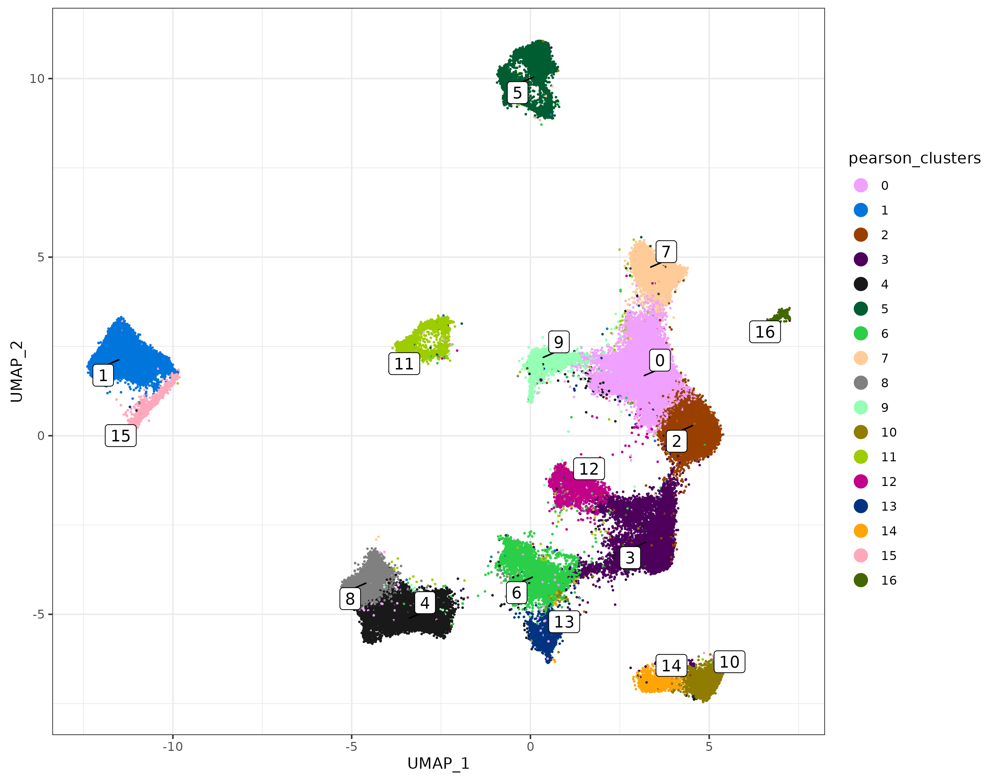
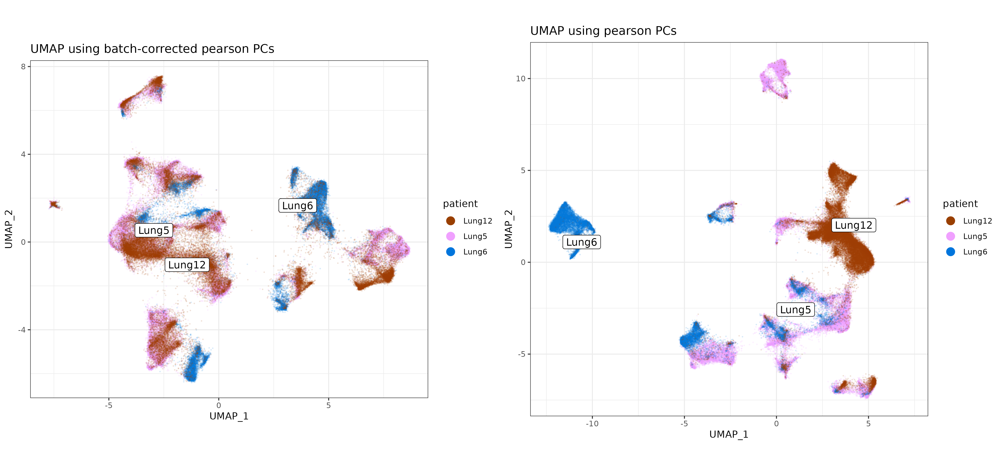
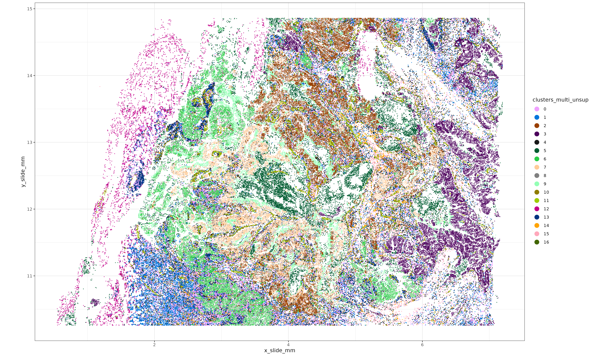
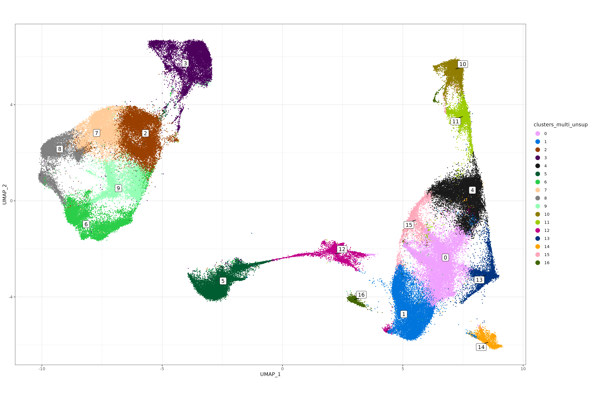
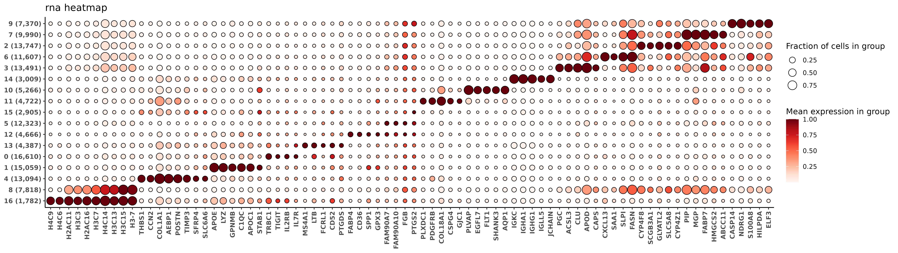
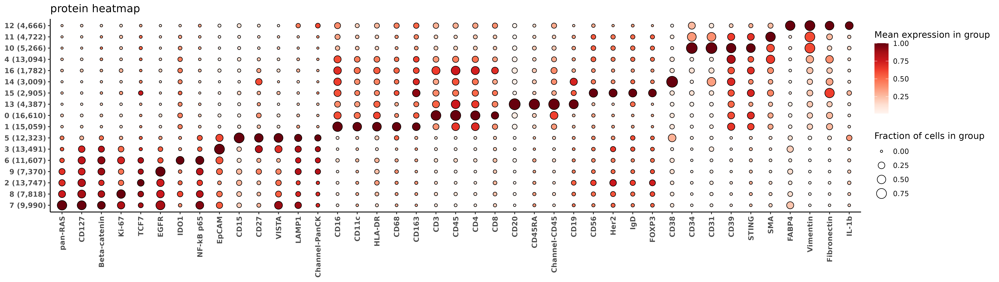

## Introduction

Here we present a package for better dimension reduction in spatial data.
Pearson residuals can be an effective normalization method for spatially-resolved transcriptomic data. However, the normalized data matrix produced is **dense** with nearly all values non-zero. This limits the usability of pearson residuals for high-plex or large datasets where computing memory can be a limiting factor.

However, the principal component (PC) decomposition of quasi-poisson pearson residuals can be computed directly from a sparse counts matrix and a few easy-to-calculate summary statistics. The R package [scPearsonPCA](https://github.com/Nanostring-Biostats/CosMx-Analysis-Scratch-Space/tree/Main/_code/scPearsonPCA) enables this PC decomposition, including the returning the PCs as if the normalized data had been centered, scaled, and influential values clipped according to common best practices for PC analysis.

In this post we demonstrate a few quick examples for the package, as well as how to use the PCA results returned for common downstream analyses like UMAP and unsupervised clustering.

## Installation

You can install `scPearsonPCA` using the remotes package

```{r, eval=FALSE}

remotes::install_github("Nanostring-Biostats/CosMx-Analysis-Scratch-Space",
                         subdir = "_code/scPearsonPCA", ref = "Main")

```

## Most used functions

-   `sparse_quasipoisson_pca_seurat()` This function takes a counts matrix as input and returns a PCA Seurat-style reduction by default. The PCA is based on quasi-poisson pearson residual normalization. Similar to a NormalizeData $\rightarrow$ ScaleData $\rightarrow$ RunPCA workflow, arguments available for returning the PCA as if data were centered and scaled, with extreme values clipped.

-   `sparse_quasipoisson_pca_seurat_batch()` This function employs a batch-correction method to PCA, provided there is a single categorical variable for 'batch'. Examples could be 'patient', 'slide_id', 'tma_id', etc. Akin to a quasipoisson glm-based correction with the batch variable used as a covariate, the basic idea here is that gene frequencies are computed separately by batch rather than across the full sample.

-  `sparse_quasipoisson_pca_seurat_multiomic()` This function is useful for getting the PCA decomposition from same-cell multiomic data.  Here we assume we have two matrices, a sparse RNA counts matrix `x`, 
and a (possibly dense,lower dimensional) matrix of already-normalized protein expression `xother`. 
We want to be able to get PCA from the combined dataset, while still applying effective normalization to the RNA data.  This function uses similar algebraic shortcuts which allow for efficient calculation of PCA from the **covariance matrix** of pearson residuals from the RNA, by deriving PCA from the combined covariance matrix of pre-normalized protein, and pearson-normalized RNA.  We'll demo a full example below using a multiomics breast cancer dataset.

## Quickstart / Example Usage

First we'll read in our Seurat object dataset. This is 960-plex NSCLC tissue.

```{r}
#| eval: false
#| echo: true

library(data.table); setDTthreads(1)
library(scPearsonPCA)
library(ggplot2)
library(ggrepel)
```

```{r}
#| eval: false
#| echo: false

datadir <- system.file("extdata", package="scPearsonPCA")
sem <- readRDS(paste0(datadir, "/seurat_obj_nsclc.rds"))
```

```{r}
#| eval: false
#| echo: true

sem <- readRDS("seurat_obj_nsclc.rds")

```

## Pearson PCA using `sparse_quasipoisson_pca_seurat`

We typically recommend to use up to 2,000-3,000 highly variable genes for generating PCA results.

A few summary stats used as input for calculating pearson-normalized PCs:

-   `tc` is the total counts per cell across all genes.
-   `genefreq` is the proportion of transcript calls for each gene across all cells.

In general, it's recommended to calculate these summary stats based on all genes rather than a subset of highly variable genes. While this dataset is only 960-plex, the code below uses 900 highly-variable genes as a demonstration for a basic workflow.

```{r}
#| echo: true
#| eval: false

tc <- Matrix::colSums(sem[["RNA"]]@counts) ## total counts per cell (across all genes)
genefreq <- scPearsonPCA::gene_frequency(sem[["RNA"]]@counts) ## gene frequency (across all cells)
sum(genefreq)==1 # TRUE

sem <- Seurat::FindVariableFeatures(sem, nfeatures = 900)
hvgs <- sem@assays$RNA@var.features

### Returns a Seurat-style DimReduc object with 
### hvgs x pcs feature loadings
### cells x pcs cell embeddings
### gene-length vector of the mean pearson of residuals
### gene-length vector of the standard deviation of pearson residuals
pcaobj <- 
sparse_quasipoisson_pca_seurat(sem[["RNA"]]@counts[hvgs,]
                               ,totalcounts = tc
                               ,grate = genefreq[hvgs]
                               ,scale.max = 10 ## PCs reflect clipping pearson residuals > 10 SDs above the mean pearson residual
                               ,do.scale = TRUE ## PCs reflect as if pearson residuals for each gene were scaled to have standard deviation=1
                               ,do.center = TRUE ## PCs reflect as if pearson residuals for each gene were centered to have mean=0
                               )

```

### Using the output for downstream analysis

Here we'll take the `pcaobj` we created and add the "`DimReduc`" to our seurat object. We can use this for downstream Seurat package analysis. Then, we'll create a UMAP from these PC results using a helper function `make_umap`, which will also return a cells x cells nearest-neighbors graph we'll use for unsupervised clustering.

```{r}
#| echo: true
#| eval: false


umapobj <- scPearsonPCA::make_umap(pcaobj)
sem[["pearsonpca"]] <- pcaobj$reduction.data
sem[["pearsonumap"]] <- umapobj$ump  ## umap
sem[["pearsongraph"]] <- Seurat::as.Graph(umapobj$grph) ## nearest neighbors / adjacency matrix used for unsupervised clustering
sem <- Seurat::FindClusters(sem, graph = "pearsongraph")
sem@meta.data$pearson_clusters <- sem@meta.data$seurat_clusters
umapplot <- scPearsonPCA::plot_umap(umapreduc = "pearsonumap", clustercol = "pearson_clusters", semuse = sem)
print(umapplot)

```

```{r}
#| echo: false
#| eval: false

saveRDS(pcaobj, "/home/rstudio/data/dan/scPearsonPCA/readmedata/pcaobj.rds")
saveRDS(umapobj, "/home/rstudio/data/dan/scPearsonPCA/readmedata/umapobj.rds")
ggsave("/home/rstudio/data/dan/scPearsonPCA/readmedata/umapplot.png", plot=umapplot, height = 720*sqrt(10), width = 922 * sqrt(10),units='px')
```

```{r}
#| eval: true
#| echo: false
#| fig.show: "hold"
#| out-width: "6000px"


```

## Batch corrected Pearson PCA using `sparse_quasipoisson_pca_seurat_batch`

The syntax is very similar if we want to correct for a batch variable, in this case 'patient'. A few extra arguments are the cell identifier `cellid_colname`, batch identifier `batch_variable`, and a data.frame `obs` which should include both of these columns.

We also re-compute gene frequency passing these same additional arguments. This returns a genes x batches matrix of gene frequencies.

```{r}
#| echo: true
#| eval: false

genefreq_batch <- 
gene_frequency(sem[["RNA"]]@counts, obs = data.table(sem@meta.data)[,.(cell_ID, patient)]
               ,cellid_colname = "cell_ID"
               ,batch_variable = "patient")

Matrix::colSums(genefreq_batch)

### Returns a Seurat-style DimReduc object with 
### hvgs x pcs feature loadings
### cells x pcs cell embeddings
### gene-length vector of the mean pearson of residuals
### gene-length vector of the standard deviation of pearson residuals
pcaobj_batch <- 
sparse_quasipoisson_pca_seurat_batch(sem[["RNA"]]@counts[hvgs,]
                                     ,totalcounts = tc
                                     ,grate = genefreq_batch[hvgs,] ##
                                     ,obs =data.table(sem@meta.data)[,.(cell_ID, patient)] 
                                     ,batch_variable = "patient"
                                     ,cellid_colname = "cell_ID"
                                     ,scale.max = 10
                                     ,do.scale = TRUE
                                     ,do.center = TRUE
                                     )

```

### Using the output for downstream analysis

Here again we'll take the `pcaobj_batch` object and use it to create a UMAP and perform unsupervised clustering.

```{r}
#| echo: true
#| eval: false

umapobj_batch <- scPearsonPCA::make_umap(pcaobj_batch)
sem[["pearsonbatchpca"]] <- pcaobj_batch$reduction.data
sem[["pearsonbatchumap"]] <- umapobj_batch$ump
sem[["pearsonbatchgraph"]] <- Seurat::as.Graph(umapobj_batch$grph) ## nearest neighbors / adjacency matrix used for unsupervised clustering
sem <- Seurat::FindClusters(sem, graph = "pearsonbatchgraph")
sem@meta.data$pearson_clusters_batch <- sem@meta.data$seurat_clusters
umapplotbatch <- scPearsonPCA::plot_umap(umapreduc = "pearsonbatchumap", clustercol = "pearson_clusters_batch", semuse = sem)
print(umapplotbatch)
```

```{r}
#| echo: false
#| eval: false

saveRDS(pcaobj_batch, "/home/rstudio/data/dan/scPearsonPCA/readmedata/pcaobj_batch.rds")
saveRDS(umapobj_batch, "/home/rstudio/data/dan/scPearsonPCA/readmedata/umapobj_batch.rds")
ggsave("/home/rstudio/data/dan/scPearsonPCA/readmedata/umapplotbatch.png", plot=umapplotbatch, height = 720*sqrt(10), width = 922 * sqrt(10),units='px')
```

```{r}
#| eval: true
#| echo: false
#| fig.show: "hold"
#| out-width: "6000px"

knitr::include_graphics("readmedata/umapplotbatch.png")
```

For this dataset, there are epithelial cell clusters which are fairly specific to each patient. This is expected in cancer tissue and may not warrant any batch correction.

For sake of demonstration here, however, we can visualize how the batch variable 'patient' separates more on the UMAP before vs. after batch-correction, where patient clusters have higher overlap in UMAP space.

In case of known batch effects, multiple methods of correction may be considered, and the best performing method may well vary from dataset to dataset. One alternative recommended method which often works well is 'Harmony', described in this [post](https://nanostring-biostats.github.io/CosMx-Analysis-Scratch-Space/posts/batchcorrection/).

```{r}
#| echo: true
#| eval: false

umapplot_patient_batch <- scPearsonPCA::plot_umap(umapreduc = "pearsonbatchumap", clustercol = "patient", semuse = sem,alpha=0.1)
umapplot_patient <- scPearsonPCA::plot_umap(umapreduc = "pearsonumap", clustercol = "patient", semuse = sem,alpha=0.1)

cp <- 
cowplot::plot_grid(umapplot_patient_batch + labs(title = "UMAP using batch-corrected pearson PCs")
                   ,umapplot_patient + labs(title = "UMAP using pearson PCs")
                   ,nrow=1) + 
  theme(plot.background = element_rect(fill = 'white',color='white')) + 
  cowplot::panel_border(remove=TRUE)  
print(cp)
```

```{r}
#| echo: false
#| eval: false

ggsave("/home/rstudio/data/dan/scPearsonPCA/readmedata/umapplot_patient_compare.png", plot=cp, height = 687*sqrt(10), width = 1471 * sqrt(10),units='px')
```

```{r}
#| eval: true
#| echo: false
#| fig.show: "hold"
#| out-width: "6000px"


```


## Pearson PCA for multiomic data using `sparse_quasipoisson_pca_seurat_multiomic`

Below we'll use a breast cancer dataset with WTx RNA + 64-plex protein to demo multiomic PCA and downstream analysis.

##### Reading in RNA and protein datasets
```{r}
#| eval: false
#| echo: true

## Note, using a v3-style Seurat Object below, i.e., `sem[["RNA"]]@counts`
## For v5-style, the syntax would be like `sem[["RNA"]]$counts`
options(Seurat.object.assay.version = "v3")  

sem_protein <- readRDS("Breast/sem_protein.rds")
sem_rna <- readRDS("Breast/sem_rna.rds")
sem_rna <- subset(sem_rna, nCount_RNA >=100)


```


```{r}
#| eval: false
#| echo: false

options(Seurat.object.assay.version = "v3")  
devtools::load_all("~/data/dan/imputation_smoothing/HieraType_dev", export_all = FALSE)
devtools::load_all("~/data/dan/scPearsonPCA", export_all = FALSE)


sem_protein <- readRDS("~/data/multiomics_hackathon/Breast/sem_protein.rds")
sem_rna <- readRDS("~/data/multiomics_hackathon/Breast/sem_rna.rds")
sem_rna <- subset(sem_rna, nCount_RNA >=100)

```

##### Normalizing the protein data

The `sparse_quasipoisson_pca_seurat_multiomic` function won't do any special normalization to the protein data, so the data should be normalized going in.
Here we'll use pearson residuals from a gamma regression model as a normalization method, although other reasonable methods might be considered and left to the user's disgression.

```{r}
#| eval: false
#| echo: true

## normalize each protein taking pearson residuals from gamma generalized linear model.
pgamm <- scPearsonPCA::pearson_normalize_gamma_glm(as.matrix(sem_protein[["RNA"]]@counts)
                                                   ,upper_q_thresh = 0.99
                                                   ,lower_q_thresh = 0.01
                                                   )
### add a '_protein' suffix to the protein names - helps differentiate proteins and RNA's with the same name. 
rownames(pgamm) <- paste0(rownames(pgamm), "_protein")

pgamm[1:5,1:5] ## normalized protein data
```

```{r}
#| eval: true
#| echo: false

print(readRDS("readmedata/pgamm_head.rds"))

```
##### PCA analysis derived from the joint covariance matrix of the the proteins and RNAs

First we'll identify a subset of highly variable genes from the RNA data.  Then , we'll pass in the RNA counts matrix and normalized protein matrix to get the PCA.
```{r}
#| eval: false
#| echo: true

## select genes from RNA data to use for PCA analysis.
## Will take the top 2k features as well as any pre-defined immune celltyping markers from HieraType
sem_rna <- Seurat::FindVariableFeatures(sem_rna, nfeatures = 2000)
use_genes <- c(sem_rna@assays$RNA@var.features)


### total counts and gene frequency from RNA data computed across full dataset
tc <- Matrix::colSums(sem_rna[["RNA"]]@counts)
genefreq <- scPearsonPCA::gene_frequency(sem_rna[["RNA"]]@counts)


### Principal components derived from the combined covariance matrix of pearson residual normalized RNA and protein.
pcaobj_multiomics <- scPearsonPCA::sparse_quasipoisson_pca_seurat_multiomic(sem_rna[["RNA"]]@counts[use_genes,] ## raw counts matrix for hvgs
                                                                       ,totalcounts = tc
                                                                       ,grate = genefreq[use_genes]
                                                                       ,xother = pgamm ## normalized protein
                                                                       ,do.scale = TRUE
                                                                       ,do.center = TRUE
                                                                       ,scale.max = 10
                                                                       ,ncores = 1
)

```

```{r}
#| eval: false
#| echo: false


saveRDS(pgamm[1:5,1:5], "/home/rstudio/data/dan/scPearsonPCA/readmedata/pgamm_head.rds")## normalized protein data
saveRDS(pcaobj_multiomics, "/home/rstudio/data/dan/scPearsonPCA/readmedata/pcaobj_multi.rds")
pcaobj_multiomics <- readRDS("readmedata/pcaobj_multi.rds")

msg <- utils::capture.output(print(
  x = pcaobj_multiomics$reduction.data,
  dims = 1:5,
  nfeatures = 20
))
message(paste(msg, collapse = '\n'))
saveRDS(msg, "/home/rstudio/data/dan/scPearsonPCA/readmedata/pca_multiomics_toppcs_msg.rds")
```
```{r}

```

```{r}
#| eval: true
#| echo: false

msg <- readRDS("readmedata/pca_multiomics_toppcs_msg.rds")
message(paste(msg, collapse = '\n'))
```

### Using the output for downstream analysis


```{r}
#| eval: false
#| echo: true

umapobj_multiomics <- scPearsonPCA::make_umap(pcaobj_multiomics)


sem_rna[["multiumap"]] <- umapobj_multiomics$ump
sem_rna[["multigrph"]] <- Seurat::as.Graph(umapobj_multiomics$grph[colnames(sem_rna),colnames(sem_rna)])
sem_rna <- Seurat::FindClusters(sem_rna, graph.name="multigrph")
sem_rna@meta.data$clusters_multi_unsup <- sem_rna@meta.data$seurat_clusters


xyp_multi_unsup <- xyplot("clusters_multi_unsup", metadata = sem_rna@meta.data, ptsize = 0.05) + coord_fixed()
print(xyp_multi_unsup)
```

```{r}
#| eval: true
#| echo: false

#

```


```{r}
#| eval: false
#| echo: true

umapp <- plot_umap(umapreduc = "multiumap", clustercol = "clusters_multi_unsup", semuse = sem_rna)
print(umapp)
```

```{r}
#| eval: true
#| echo: false

#

```

#### RNA and protein marker heatmaps 

Below we'll look at a couple of marker heatmaps for these unsupervised clusters.
These functions below use the [HieraType package](https://github.com/Nanostring-Biostats/CosMx-Analysis-Scratch-Space/tree/Main/_code/HieraType). 
```{r}
#| eval: false
#| echo: false


saveRDS(umapobj_multiomics,"/home/rstudio/data/dan/scPearsonPCA/readmedata/umapobj_multiomics.rds")
ggsave("/home/rstudio/data/dan/scPearsonPCA/readmedata/xyp_multi_unsup.png"
       ,plot=xyp_multi_unsup
       ,device = "png"
       ,width = 1181 * sqrt(20)
       ,height=689 * sqrt(20)
       ,units = 'px'
)

ggsave("/home/rstudio/data/dan/scPearsonPCA/readmedata/umapp_multi.png"
       ,plot=umapp
       ,device = "png"
       ,width = 1181 * sqrt(20)
       ,height=800 * sqrt(20)
       ,units = 'px'
)
```


```{r}
#| eval: false
#| echo: true

#remotes::install_github("Nanostring-Biostats/CosMx-Analysis-Scratch-Space", 
#                        subdir = "_code/HieraType", ref = "Main")
library(HieraType)

fctbl_rna <- clusterwise_foldchange_metrics(sem_rna[["RNA"]]@counts[use_genes,]
                                            ,totalcounts = tc
                                            ,metadata = sem_rna@meta.data
                                            ,cluster_column = "clusters_multi_unsup"
                                            )

hm_rna <- add_ncells(marker_heatmap(fctbl_rna)) + labs(title = "rna heatmap")
print(hm_rna)


```

```{r}
#| eval: false
#| echo: false

ggsave(plot=hm_rna, filename = "/home/rstudio/data/dan/scPearsonPCA/readmedata/hm_rna_multi.png", width = 1522 * sqrt(20), height = 430*sqrt(20), dpi=400,units='px')

```

<div class="wider-image">
  
</div>

```{r}
#| eval: false
#| echo: true


fctbl_protein <- HieraType::clusterwise_foldchange_metrics_protein(sem_protein[["RNA"]]@counts[,rownames(sem_rna@meta.data)]
                                                        ,metadata = sem_rna@meta.data
                                                        ,cluster_column = "clusters_multi_unsup"
                                                        ,propd = (pgamm[,rownames(sem_rna@meta.data)] > 1)
                                            )
hm_protein <- add_ncells(marker_heatmap(fctbl_protein)) + labs(title = "protein heatmap")
print(hm_protein)

```

```{r}
#| eval: false
#| echo: false

ggsave(plot=hm_protein, filename = "/home/rstudio/data/dan/scPearsonPCA/readmedata/hm_protein_multi.png", width = 1522 * sqrt(20), height = 430*sqrt(20), dpi=400,units='px')

```

<div class="wider-image">
  
</div>


