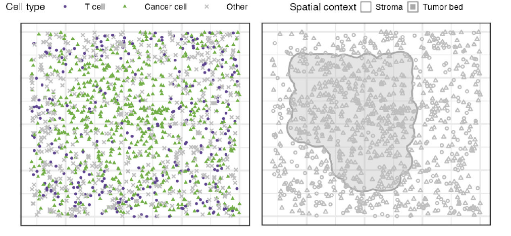
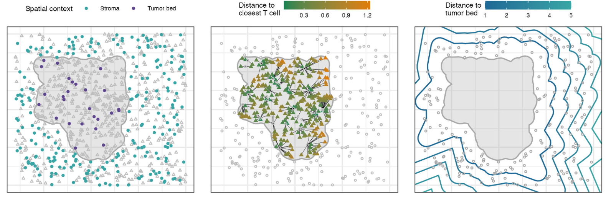
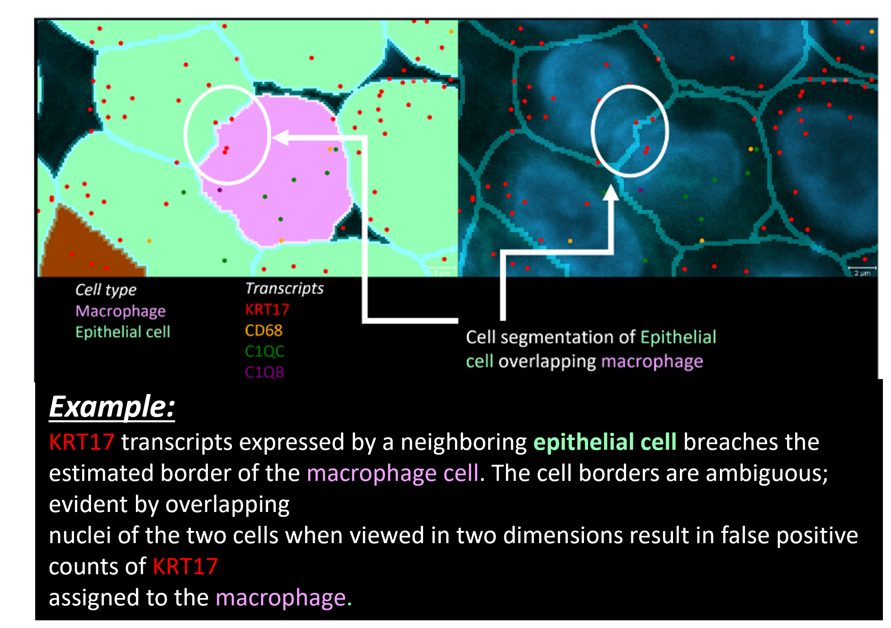
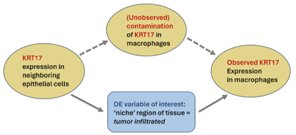
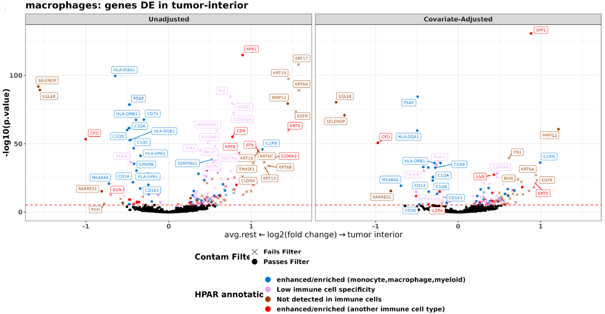
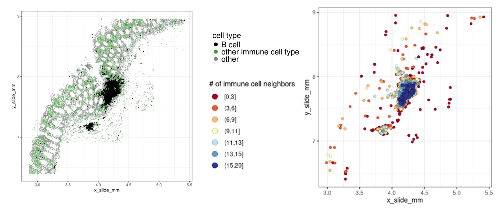
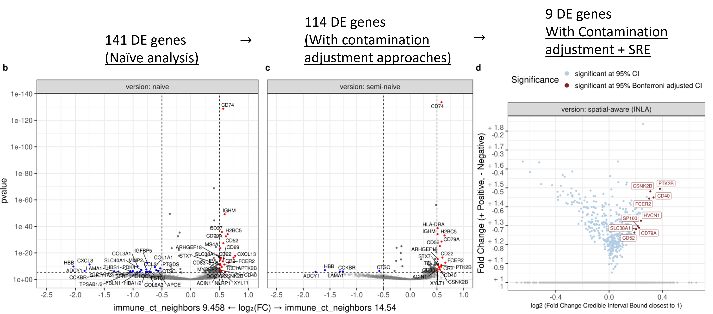
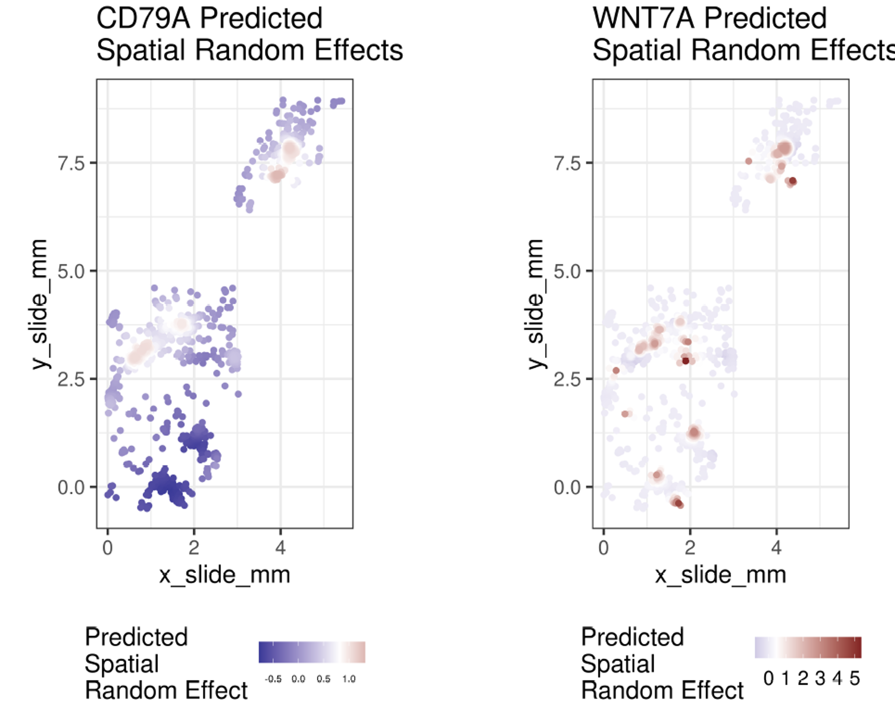

# Differential Expression Analysis With Spatially Correlated Data

Spatially-resolved transcriptomic (SRT) data offers unprecedented insights into gene expression patterns, but analyzing this data requires specialized approaches.  Traditional differential expression (DE) methods often falter when applied to spatially correlated data, leading to unreliable results and significant rates of false discovery.  To address this challenge, [@Vasconcelos2024] present a comprehensive analysis of DE methodologies in their preprint, ["Differential Expression Analysis for Spatially Correlated Data"](https://www.biorxiv.org/content/10.1101/2024.08.02.606405v1.full){target="_blank"} .  This work systematically evaluates the performance of various modeling strategies, providing clear recommendations for researchers.  

The rest of this post aims to summarize some of the key findings from the paper and  provide practical guidance on how to conduct robust DE analysis with spatial data.  The accompanying [smiDE](https://github.com/Nanostring-Biostats/CosMx-Analysis-Scratch-Space/tree/Main/_code/smiDE2){target="_blank"} R package offers readily accessible tools for implementing these recommendations.

## Opportunities

While DE analysis has long been a core component of gene expression studies, SRT data presents new opportunities for addressing fundamental questions regarding how cells respond to their local environment and interact with other cell types.

As a motivating example, suppose I have annotated cell type and spatial context in my dataset; I might be broadly interested in T cells, cancer cells, and how they behave within different spatial contexts.

```{r}
#| eval: true
#| echo: false



```

Tons of interesting questions along these lines can be phrased as DE problems, for example

*  How does the expression of genes in T cells differ when located in stroma vs. tumor bed? (Left panel, blue vs. purple points)
*  How does expression of genes in cancer cells in the tumor bed differ based on distance to the nearest T-cell? (middle panel, cancer cells with arrow drawn to nearest T cell and colored by distance)
*  How is gene expression for T-cells in stroma modulated by distance to the tumor bed? (Right panel, rings highlight benchmarks of "distance from tumor bed")


```{r}
#| eval: true
#| echo: false



```

## Unique challenges for DE analyis with SRT data

While the types of questions we can tackle with DE are limitless, there are unique challenges associated with SRT technologies that can lead to false discoveries when not properly addressed.

Two primary issues include:

* segmentation errors  
* unmodeled auto-correlation in expression amongst spatially neighboring cells 

Below, we'll give a very brief overview of how these problems can lead to biased effects estimates and incorrect inferences in DE.

#### Segmentation error

Even minor segmentation errors can distort DE results if the analysis doesn't properly account for them. For example, suppose I want to analyze the behavior of macrophage cells, and how gene expression differs for macrophages in tumor-infiltrated regions of tissue.

The picture below shows KRT17 transcripts from neighboring epithelial (cancer) cells falsely assigned to the macrophage cell inside a tumor region.

A naiive DE analysis may identify KRT17 as DE in the tumor, while an experienced bioinformatician may immediately recognize that this gene should not be expressed in the macrophage cell type at all (the very presence of the gene would challenge the cell type identity).

<!-- The picture below shows KRT17 transcripts from neighboring epithelial cells falsely assigned to the <span style="color: DeepPink;"> macrophage cell </span>inside a tumor region. -->
The picture below shows KRT17 transcripts from neighboring cancer cells falsely assigned to the macrophage cell inside a tumor region.

```{r}
#| eval: true
#| echo: false



```

Even if the number of falsely assigned transcripts is small, these errors are correlated with our DE question in a way that confounds the analysis.  Namely, the false positive KRT17 transcripts are more likely than not to occur in tumor regions compared to elsewhere because they come from the cancer cells!  

We could describe this dilemma for a DE analysis through a directed-acyclic graph, where the neighboring KRT17 expression in cancer cells acts as a confounder.

```{r}
#| eval: true
#| echo: false



```

In the paper, we propose two approaches to deal with this issue.

1. A 'overlapping cells metric': Used to identify genes which may be expressed within specific cell types due primarily due to overlapping cells / segmentation errors , and exclude them from cell-type specific DE analysis.  The metric computes the average expression in "macrophage cells", and the average expression in *spatial neighbors* of macrophage cells among all non-macrophage cell types.  The ratio of these two average expression vectors is a quick and useful way to discard implausible genes.

2. Covariate adjustment: We can compute the total expression of 'KRT17' in the spatial neighbors of macrophage cells among all non-macrophage neighbors, and include this as a control variable in the regression model.


Below is a side-by-side summary of volcano plots before and after implementing these approaches, where genes are colored by their plausible cell type annotation from the Human Protein Atlas, and marked by whether or not the gene passes the overlapping cells metric. 

On the left, a number of implausible brown genes which should be "Not detected in immune cells" are falsely identified as being upregulated in macrophages in the tumor region.
Nearly all of these genes could be pre-filtered before DE is conducted, by nature of "failing the filter" metric.  
On the right-hand side, we see the significance and fold change for a large number of genes is largely attenuated if we employ the covariate-adjustment approach; controlling for expression in neighboring cells of other cell types.

```{r}
#| eval: true
#| echo: false



```


#### Spatial Correlation

Spatial auto-correlation is another way in which gene expression could inflate statistical significance in DE. Intuitively, neighboring cells may have
more similar gene expression profiles compared to cells located at greater distances, due to factors which may be unrelated to our covariate of interest. 
A solution we propose is to include a spatially correlated random effect (SRE) in the DE model, which can account for the un-modeled spatial correlations in expression.

For example, suppose I am working with a colon-cancer dataset, and am interested in researching how gene expression changes in B cells as they approach the center of tertiary lymphoid structures.

I may count the number of immune cells neighboring the B-cells as a continuous measurement of how close the B cell is to the center of the TLS.

Below, the left hand plot highlights two densely packed clusters of B cells in TLS regions, and on the right, these B cells are annotated by the covariate (# of immune cell neighbors).


```{r}
#| eval: true
#| echo: false



```


Below, we show how inference can change from a naiive DE analysis (left), to a 'segmentation-aware' analysis (middle), to a DE analysis which also includes the spatial random effect (right).  The model with SRE identifies a set of 9 high-confidence DE genes with up-regulated expression in TLS interior, down from 141 DE genes identified through the naiive approach.

```{r}
#| eval: true
#| echo: false



```

The ability to visually assess the behavior of the random effects can provide further context for the analysis.  For example, CD79A retains significance in the SRE model, showing several concentrated regions of high expression captured by the random effect.  For WNT7A, numerous small regions of autocorrelated expression reduce the significance of the gene when taken into context of the model.

```{r}
#| eval: true
#| echo: false



```


# Conclusions 

Here we've discussed opportunities for DE analysis with SRT datasets, along with unique challenges this data type poses.
All of the analysis tools described here are implemented in the [smiDE R package](https://github.com/Nanostring-Biostats/CosMx-Analysis-Scratch-Space/tree/Main/_code/smiDE2){target="_blank"}, with syntax examples and vignettes which can be found on the github page.  We hope the reader will also check out the [preprint](https://www.biorxiv.org/content/10.1101/2024.08.02.606405v1.full){target="_blank"} for more thorough detail on the our study of DE with spatially correlated data.

# Resources

- [preprint](https://www.biorxiv.org/content/10.1101/2024.08.02.606405v1.full){target="_blank"}
- [smiDE R package](https://github.com/Nanostring-Biostats/CosMx-Analysis-Scratch-Space/tree/Main/_code/smiDE2){target="_blank"}
