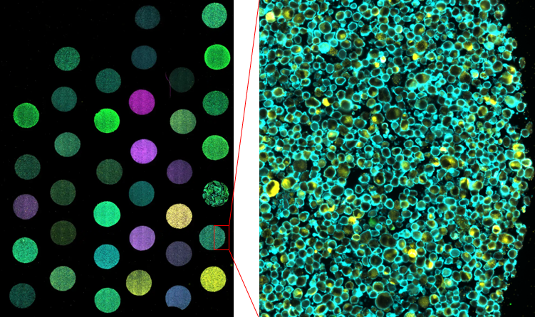
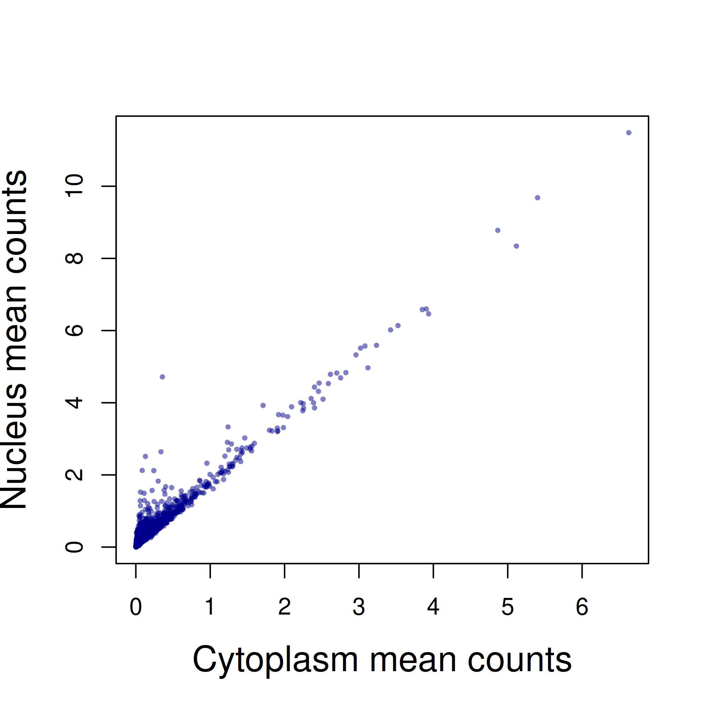
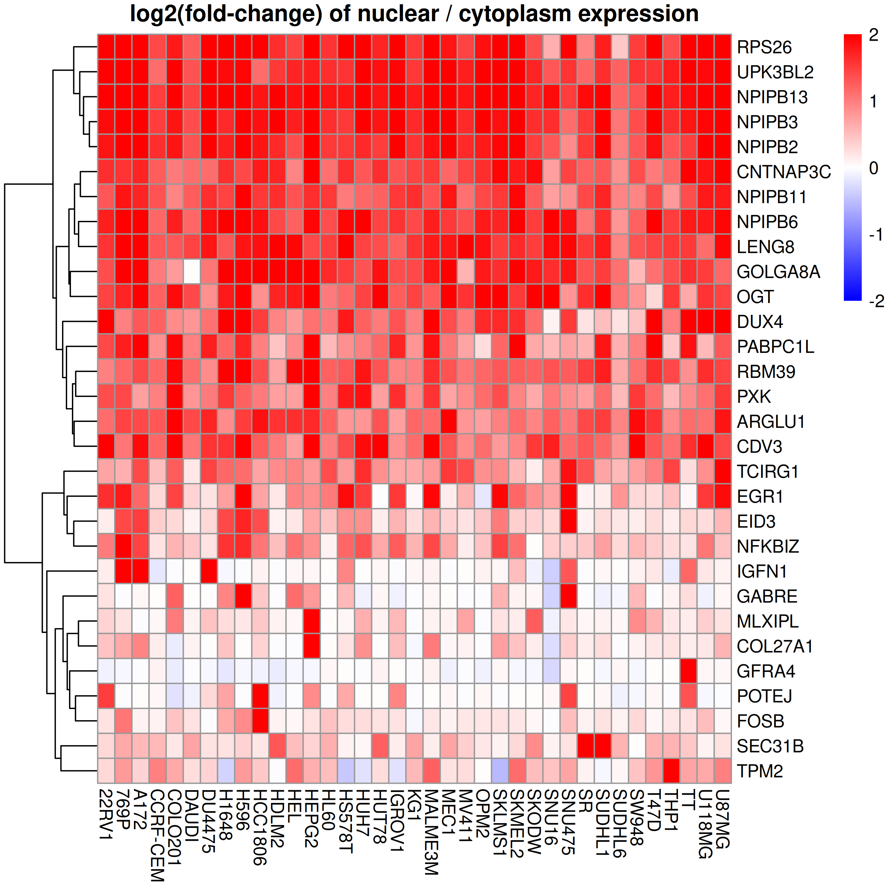
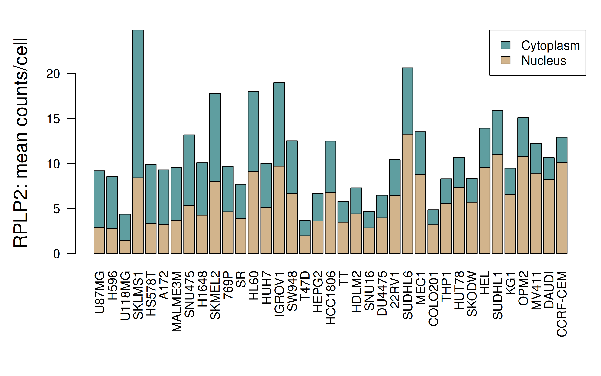
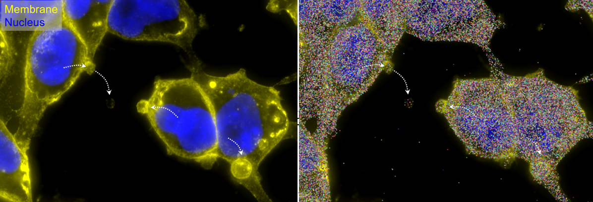

# Introduction 

RNA transcript locations are a standard output of CosMx experiments, but it's uncommon for data analysis to make use of them. 
We speculate that the localization of transcripts within cells might reveal some undiscovered biological gems to those willing to go searching.
Here we present a small demonstration of how this information might be explored. 
We use a cell pellet array constructed by printing 37 cell lines onto a single slide: 

```{r}
#| eval: true
#| echo: false

```

# Setup

We ran the CosMx Human Whole Transcriptome Panel, and collected a single FOV from each cell line.
This produced 18935-plex data with between 600-3400 cells per cell line. 
Typical for a cell line experiments, this study produced great data, with the average cell returning >4000 counts.

Standard CosMx output includes each transcript's cellular compartment: nucleus, cytoplasm, or membrane. 
For this simple demonstration, we focus on the nucleus and cytoplasm, where most transcripts are found. 
Our analysis was straightforward: for each cell line, we simply took the log2 ratio of each gene's expression in the nucleus vs. in the cytoplasm. 
This allowed us to identify genes with bias towards either compartment, and to study how cell lines differ in regard to subcellular localization.

# Results

Nuclear and cytoplasmic expression tended to track each other for most genes, with a small
subset of genes showing strong enrichment in the nucleus. 
For example, see the results from the 22RV1 cell line:

```{r}
#| eval: true
#| echo: false

```

To create a census of nucleus-enriched genes, we recorded all genes attaining 4-fold enrichment in the nucleus vs. the cytoplasm in at least one cell line:

```{r}
#| eval: true
#| echo: false

```

Finally, we looked for genes whose nuclear/cytoplasmic ratio changed across cell lines. 
One top hit was RPLP2:

```{r}
#| eval: true
#| echo: false

```

# Discussion

This post demonstrates the possibility of studying genes' subcellular locations within and across cell types. Other, more complicated approaches are of course possible. RNA velocity can be estimated from the nuclear/cytoplasmic ratio, using subcellular location as a proxy for how recently an mRNA molecule was transcribed, e.g. with the [scVelo](https://scvelo.readthedocs.io/en/stable/){target="_blank} algorithm. It should also be possible to look for genes whose transcripts tend to cluster near each other in intracellular space, or for pairs of genes that cluster. Recent packages offer a few approached on this theme, including [CellSP](http://github.com/bhavaygg/CellSP?tab=readme-ov-file#readme){target="_blank}  [BENTO](https://genomebiology.biomedcentral.com/articles/10.1186/s13059-024-03217-7){target="_blank}  [ELLA](https://pubmed.ncbi.nlm.nih.gov/39386706/){target="_blank} and [INSTANT](https://www.nature.com/articles/s41467-024-49457-w){target="_blank}.

Multiomics data will open new questions as well, for example allowing us to study whether any genes tend to fall atop the signal from any proteins. Or, even without multiomics data, we can use our morphology markers to ask questions of intracellular locations, for example, in the below image, what genes have been captured in the vesicles?


```{r}
#| eval: true
#| echo: false

```
