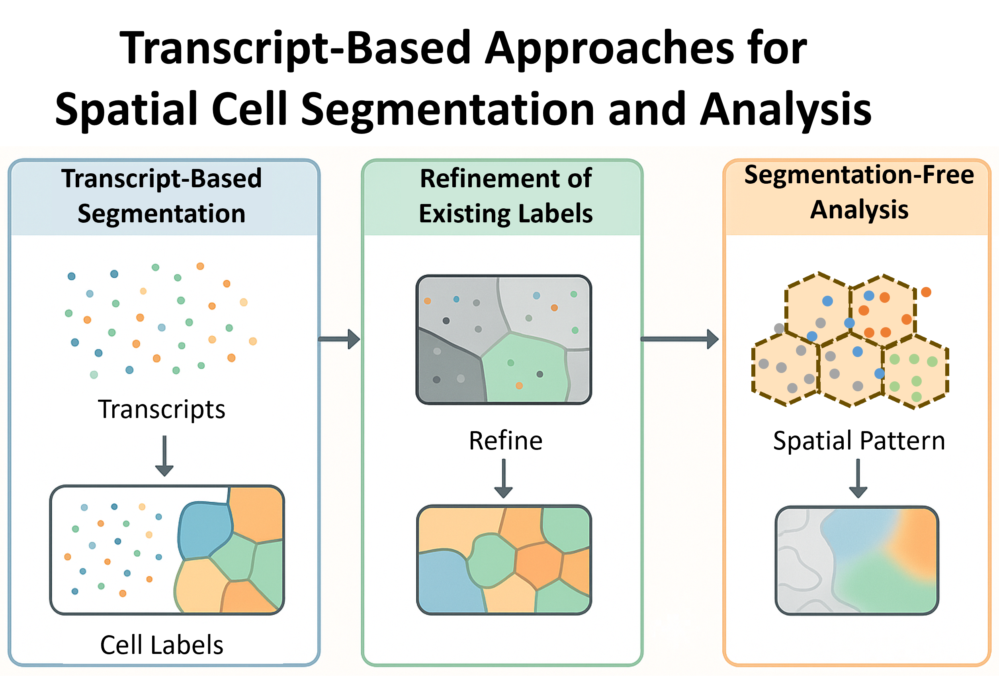

# Introduction 

Spatial transcriptomics technologies provide high-resolution spatial maps of transcript locations within tissue. A central challenge in these datasets is cell segmentation, which assigns transcripts to individual cells accurately, particularly when image data is noisy, missing, or ambiguous.

To address this, researchers have developed **transcript-based analysis techniques** that either:

1. @sec-txSeg Segment cells from transcript locations (e.g., Baysor, ProSeg),
2. @sec-txRefine Refine existing image-based segmentations using transcript patterns (e.g., FastReseg),
3. @sec-segFree Avoid segmentation entirely by analyzing the spatial organization of transcripts directly (e.g., FICTURE).

This post provides a practical walk-through of each technique with examples on using it with CosMx<sup>&#174;</sup> data, whose standard data format are described [here](https://nanostring-biostats.github.io/CosMx-Analysis-Scratch-Space/assets/Pancreas-CosMx-ReadMe.html){target="_blank"}.

{#fig-transcript-seg-methods}

Like other items in our [CosMx Analysis Scratch Space](https://nanostring-biostats.github.io/CosMx-Analysis-Scratch-Space/about.html){target="_blank"},
the usual [caveats](https://nanostring-biostats.github.io/CosMx-Analysis-Scratch-Space/about.html){target="_blank"} and [license](https://nanostring-biostats.github.io/CosMx-Analysis-Scratch-Space/license.html){target="_blank"} apply.


# Choosing the Right Transcript-Based Approach

Spatial transcriptomics platforms differ in resolution, density, and image quality, and so do the challenges in analyzing them. Before diving into individual tools, it's helpful to understand the three major transcript-informed approaches to working with spatial data: segmentation, refinement, and segmentation-free analysis. Each method type fits different scenarios and solves a unique class of problems.


## Transcript-Based Segmentation  {#sec-txSeg}

These methods directly infer cell boundaries by clustering or modeling the spatial distribution of transcripts, often using gene identity as additional signal.

**Use when:**

* You **don’t have reliable cell images** (e.g., missing or low-quality DAPI/membrane stains)
* You want to define cells purely from **mRNA localization**
* You need a **de novo** segmentation pipeline without preprocessing

**Limitations:**

* May oversegment sparse cells or misplace boundaries without priors
* Transcript noise can bias clustering in low-resolution assays and introduce circularity in analysis pipeline

**Best for:** Datasets where transcript positions are abundant and dense.


## Segmentation Refinement {#sec-txRefine}

These tools enhance an existing segmentation mask, correcting common segmentation errors using transcript-level context only when there is sufficient evidence.

**Use when:**

* You **already ran an image-based segmentation** (e.g., Cellpose, watershed)
* You notice cells with **minor contamination from neighboring cells**
* You want to **keep image-based alignment but improve transcript association**

**Limitations:**

* Relies on the quality of the initial mask — can't fix everything
* Adds an extra pipeline step, but is lightweight

**Best for:** Any pipeline combining tissue images with transcript-based validation, especially if accurate cell boundaries affect downstream quantification.


## Segmentation-Free Analysis {#sec-segFree}

Instead of forcing transcripts into discrete cells, these approaches model **gene expression directly in space**, uncovering continuous spatial features, patterns, and regions.

**Use when:**

* You want to **avoid cell segmentation biases**
* Your tissue has ambiguous or **poorly defined boundaries**
* You aim to study **gradients, niches, or expression domains** more than individual cells

**Limitations:**

* No per-cell outputs (e.g., no cell-by-gene matrices)
* Some tools are exploratory and require interpretation beyond standard stats

**Best for:** Ultra-dense data like Seq-Scope or CosMx where transcript resolution enables high-fidelity spatial patterning without segmentation artifacts.


# Running transcript-informed approaches with CosMx data

With this foundation in place, let’s now walk through tools that exemplify each approach. The input files used are exported by AtoMx<sup>&#174;</sup> Spatial Informatics Portal (SIP) and their file structures are described in this [ReadMe](https://nanostring-biostats.github.io/CosMx-Analysis-Scratch-Space/assets/Pancreas-CosMx-ReadMe.html){target="_blank"}.

: Categories of Transcript-Based Methods {#tbl-txSeg-types}

| Type                       | Goal                                    | Example Tools  |
| -------------------------- | --------------------------------------- | -------------- |
| Segmentation               | Create cell boundaries from transcripts | Baysor, ProSeg |
| Segmentation Refinement    | Improve pre-existing cell boundaries    | FastReseg      |
| Segmentation-Free Analysis | Analyze transcript patterns directly    | FICTURE        |


## Baysor: Probabilistic Transcript-Based Segmentation

[Baysor](https://github.com/kharchenkolab/Baysor){target="_blank"} [@petukhov2021cell] segments cells by modeling transcript positions and gene identities using a Bayesian mixture model. It optionally incorporates nuclei positions for prior constraints.

**Pros**

* Fully probabilistic
* Handles overlapping cells and ambiguous boundaries
* Optional priors improve accuracy

**Cons**

* Slower and very high memory consumption on large datasets
* Requires Julia and formatting input data
* Sensitive to input parameters, tend to over-segmenting and bias towards smaller cells. 

### Install Baysor {#sec-baysor-install}

The simplest way to install `Baysor` on Linux is by downloading a precompiled binary from the repository's [release section](https://github.com/kharchenkolab/Baysor/releases){target="_blank"}. Once downloaded, you can run the executable located at `bin/baysor`. Below is the example code on how to setup an AWS EC2 instance to run `baysor`. For other platforms, please refer to the full installation instruction provided by the original authors [here](https://kharchenkolab.github.io/Baysor/dev/installation/){target="_blank"}.

1. SSH log into your AWS EC2 instance as admin and navigate to a folder you can write on, e.g. `/home/YourUserName/data`.

```{bash}
#| eval: false
#| echo: true
#| filename: "log into ec2 as admin"
# replace content inside <> with your actual setup
ssh -i "your-key-to-ec2.pem" <admin-name>@<instance-ip-address> 

# show container/docker info to get container ID
sudo docker ps -a

# get into the container, replace "root" with your admin name 
sudo docker exec --user="root" -it <container-ID> /bin/bash

# navigate to working directory
cd /home/YourUserName/data
```

2. Download and unzip the precompiled binary to target folder. For Baysor v0.7.1, there should be two executable `baysor` and `julia` inside the unzipped`./bin` folder. 

```{bash}
#| eval: false
#| echo: true
#| filename: "obtain Baysor binary"
wget https://github.com/kharchenkolab/Baysor/releases/download/v0.7.1/baysor-x86_x64-linux-v0.7.1_build.zip
unzip baysor-x86_x64-linux-v0.7.1_build.zip

ls -l bin/julia
ls -l bin/baysor
```

3. Make the downloaded binary executable (`./bin` folder) for all users, **set library path to empty** (necessary to work with pre-compiled executable) and verify if `baysor/bin` is working. 

```{bash}
#| eval: false
#| echo: true
#| filename: "make Baysor executable"
chmod -R o+x /home/YourUserName/data/bin 
chmod -R o+r /home/YourUserName/data/bin 

ls -l /home/YourUserName/data/bin/julia 
ls -l /home/YourUserName/data/bin/baysor

LD_LIBRARY_PATH=""
echo $LD_LIBRARY_PATH

/home/YourUserName/data/bin/julia --help
/home/YourUserName/data/bin/baysor --help
```

4. Create symbolic links such that one could run with command line without the full path to the binary file. 

```{bash}
#| eval: false
#| echo: true
#| filename: "create symbolic link"
sudo ln -s /home/YourUserName/data/bin/julia /usr/local/bin/julia
sudo ln -s /home/YourUserName/data/bin/baysor /usr/local/bin/baysor

julia --help
baysor --help
```

Now you should be able to run `Baysor` from command line in your EC2 instance. 

### Run Baysor

As detailed in Baysor's [documentations](https://kharchenkolab.github.io/Baysor/dev/segmentation/){target="_blank"}, `baysor` segmentation command requires data frame of transcripts' coordinates and gene type as inputs. One can specify the data format as command arguments and configure the processing in the `.toml` file. 

**Prepare Inputs**

The transcript file (e.g. `Pancreas_tx_file.csv`) exported by AtoMx<sup>&#174;</sup> SIP has spatial coordinates under pixel unit in global coordinate system and is recommended to convert into micrometer unit before processing. Besides, AtoMx exported transcript file has study-unique cell ID under `cell` column which could be provided to `baysor` command as prior segmentation. 

```{r readTxFile, message=FALSE, eval = FALSE}
# prepare Tx file in R
fullTx <- data.table::fread("Pancreas_tx_file.csv")

# convert to micrometer 
pixel_size <- 0.12028 # micron per pixel 
z_step <- 0.8 # micron per z step 

fullTx[['x_allS_um']] <- fullTx[['x_global_px']] * pixel_size
fullTx[['y_allS_um']] <- fullTx[['y_global_px']] * pixel_size
fullTx[['z_allS_um']] <- fullTx[['z']] * z_step

# assign unify "cell" ID to extracellular transcripts in tx file 
fullTx[cell_ID == 0, cell := "0"]

# export the modified transcript file to use with command line 
data.table::fwrite(fullTx, file = "Pancreas_prepared_tx_file.csv")
```


**Run Command**

Below is an example command that performs Baysor segmentation on transcript file (e.g. `Pancreas_prepared_tx_file.csv`) and output results to folder `~/data/baysor_outputs`. Optionally, one can disable the polygon outputs for faster processing by passing `--polygon-format none` to the command. 

```{bash}
#| eval: false
#| echo: true
#| filename: "run Baysor"
baysor run Pancreas_prepared_tx_file.csv :cell \
  --output ~/data/baysor_outputs \
  --gene-column target \
  --x-column x_allS_um \
  --y-column y_allS_um \
  --z-column z_allS_um \
  --config baysor_cosmx_config.toml \
  --count-matrix-format tsv
```

An example configuration file for using CosMx data with `Baysor` is shown below. 

```{.toml caption="baysor_cosmx_config.toml"}
[data]
gene = "target"
min_molecules_per_gene = 1
exclude_genes = "FalseCode*,NegPrb*,SystemControl*,Negative*,Custom*"
min_molecules_per_cell = 20

[segmentation]
prior_segmentation_confidence = 0.2 # Confidence of the prior segmentation. Default: 0.2
unassigned_prior_label = "0" # Label for unassigned cells in the prior segmentation. Default: "0"

[plotting]
min_pixels_per_cell = 10 # Number of pixels per cell of minimal size, used to estimate size of the final plot. For most protocols values around 7-30 give enough visualization quality. Default: 15
max_plot_size = 3000 # Maximum size of the molecule plot in pixels. Default: 5000A
```

::: {.callout-tip}
Since a full run can be time-consuming, it's recommended to perform a quick preview to extract initial insights from the data and to make informed guesses about the parameters for the full analysis. One can achieve this with `baysor preview` command using the same input arguments. For more details, see [here](https://kharchenkolab.github.io/Baysor/dev/preview/){target="_blank"} and a discussion on parameter choices could be found [here](https://kharchenkolab.github.io/Baysor/dev/segmentation/#Choice-of-parameters){target="_blank"}.
:::

**Outputs**

By default, `baysor` segmentation generates the following outputs. 

```{bash}
#| eval: false
#| echo: true
#| filename: "Baysor outputs"
baysor_outputs/
├── segmentation_cell_stats.csv
├── segmentation_counts.tsv
├── segmentation.csv
├── segmentation_log.log
├── segmentation_params.dump.toml
├── segmentation_polygons_2d.json
└── segmentation_polygons_3d.json
```

A full description on outputs could be found in Baysor's [documentations](https://kharchenkolab.github.io/Baysor/dev/segmentation/){target="_blank"}. Briefly, 

- `segmentation_cell_stats.csv`: a cell x attributes data frame with new cell ID under `cell` column, number of transcripts assigned under `n_transcripts` column, and average assignment confidence per cell under `avg_assignment_confidence` column.  

- `segmentation_counts.tsv`: the single-cell count matrix with segmented statistics; one could choose to output it as `loom` format when setting `--count-matrix-format loom` in command. 

- `segmentation.csv`: the per molecular level information for the full transcript file, with `cell` column for new cell ID, `confidence` and `is_noise` columns for whether the molecule is real (not noise), and `assignment_confidence` column for the confidence that the particular molecule is assigned to a correct cell. 

  + We recommend to remove molecules with `confidence` below `0.9` or `is_nose = True` from single-cell expression matrix for downstream analysis. 


## ProSeg: Fast Transcript Simulation Based Segmentation

[ProSeg](https://github.com/dcjones/proseg){target="_blank"} [@jones2025cell] is a high-speed, Rust-based tool that segments cells using density-based clustering of transcript positions. It is optimized for large datasets from platforms like CosMx.

**Pros**

* Much faster and smaller memory footprint than Baysor
* Does not require image inputs to consider prior segmentation with assigned nuclear compartment 
* Works on compressed csv.gz files directly 

**Cons**

* Fewer model-based refinements than Baysor
* A sampling method which runs in non-deterministic way in its current form.
* The direct outputs are posterior expectations instead of integers counts assigned to each cell. 
* Prone to merge error and generate abnormally large cells near sample edge next to cell-free region. 

### Install ProSeg

To install `ProSeg`, one would need to first install `cargo` and then the `proseg` package. For an AWS EC2 instance, one should first log into the instance as admin (see Baysor installation above @sec-baysor-install for details) and then do the following. 


1. Install `cargo` as admin `root` and set it up for all users. 

```{bash}
#| eval: false
#| echo: true
#| filename: "install cargo"
curl --proto '=https' --tlsv1.2 -sSf https://sh.rustup.rs | sh

# activate cargo environment or restart session to have PATH change in effect 
. "$HOME/.cargo/env"
echo $HOME

# test installation
which cargo
cargo --version
```

By default, `cargo` would be installed under `/root/.cargo` folder. To make it executable for all users, one could copy its binary to local environment. 

```{bash}
#| eval: false
#| echo: true
#| filename: "setup cargo for all users"
ls /root/.cargo/bin/

sudo cp /root/.cargo/bin/* /usr/local/bin/
sudo chmod 755 /usr/local/bin/*
```

Now, one could use `cargo` as non-admin user. 

2. Clone and install `proseg`. 

```{bash}
#| eval: false
#| echo: true
#| filename: "install proseg"
git clone https://github.com/dcjones/proseg.git
cargo install proseg

# test installation
which proseg
proseg --version

```


### Run ProSeg

Same as `baysor`, the primary input for `proseg` is the transcript data frame. Since `proseg` command allows a more flexible data structure and internal conversion between pixel and micrometer units using `coordinate-scale` argument, the transcript file exported by AtoMx<sup>&#174;</sup> SIP could be used directly without modification or decompression (i.e. working for `.csv.gz` file). 

**Run Command**

Below is an example command that performs ProSeg segmentation on transcript file (e.g. `Pancreas_tx_file.csv`) and output results to folder `~/data/proseg_outputs`. In addition to prior segmentation, the assigned nuclear compartments in transcript files are also provided to `proseg` via arguments `--compartment-column CellComp --compartment-nuclear Nuclear`.

```{bash}
#| eval: false
#| echo: true
#| filename: "run ProSeg"
proseg Pancreas_tx_file.csv \
  --output-path ~/data/proseg_outputs \
  --gene-column target \
  --x-column x_global_px \
  --y-column y_global_px \
  --z-column z \
  --compartment-column CellComp \
  --compartment-nuclear Nuclear \
  --fov-column fov \
  --cell-id-column cell \
  --cell-id-unassigned '' \
  --cell-assignment-column cell_ID \
  --cell-assignment-unassigned '0' \
  --excluded-genes '^(SystemControl|Negative)' \
  --coordinate-scale 0.12028 
```

::: {.callout-tip}
ProSeg performs a z coordinate normalization step to remove sample tilt and cap z coordinates within 1st ~ 99th percentile of original value. Thus, it's recommended to split your dataset by tissue sections first and then process each one separately. This helps avoid problems that can happen because the sections may have different z-coordinate values. More advice and description on argument options could be found [here](https://github.com/dcjones/proseg/tree/main?tab=readme-ov-file#modeling-assumptions){target="_blank"}.
:::


**Outputs**

By default, `proseg` segmentation generates the following outputs. 

```{bash}
#| eval: false
#| echo: true
#| filename: "ProSeg outputs"
proseg_outputs/
├── cell-metadata.csv
├── cell-polygons.geojson
├── cell-polygons-layers.geojson
├── expected-counts.csv
├── transcript-metadata.csv
└── union-cell-polygons.geojson
```

A full description on ProSeg's output format could be found [here](https://github.com/dcjones/proseg/tree/main?tab=readme-ov-file#output-options){target="_blank"}. Briefly. 

- `cell-metadata.csv`: a cell x attributes data frame with new cell ID under `cell` column, cell volume under `volume` column. 

  + We recommend to inspect the `volume` value to remove cells that are abnormally large.

- `expected-counts.csv`: the single-cell expression matrix with segmented statistics; the reported expression values are posterior expectations shown as fractional counts instead of integers. 

  + We recommend to calculate the observed single-cell count matrix with the new cell ID assignment from the output `transcript-metadata.csv` before downstream single-cell analysis for consistency. 

- `transcript-metadata.csv`: the per molecular level information for the full transcript file, with `gene` column for gene name, `assignment` column for new cell ID, `probability` and `background` columns for whether the molecule is real and confidently assigned. 

  + We recommend to remove molecules with `background = 1` before generating the observed single-cell count matrix from transcript file. 

**Generate Count Matrix**

```{r generateCounts, message=FALSE, eval = FALSE}
# read in ProSeg processed transcript files in R
dt <- data.table::fread("proseg_outputs/transcript-metadata.csv")

# remove background transcripts and keep only the needed columns 
dt <- dt[background !=1, .SD, .SDcols = c('assignment', 'gene')]
dt[['gene']] <- factor(dt[['gene']])
dt[['assignment']] <- as.character(dt[['assignment']])

# get observed cell x gene count matrix 
counts <- reshape2::acast(dt, assignment ~ gene, fun.aggregate = length)
counts <- Matrix::Matrix(counts, sparse = TRUE) 
```


## FastReseg: Transcript-Based Segmentation Refinement

[FastReseg](https://github.com/Nanostring-Biostats/FastReseg){target="_blank"} [@Wu2025FastReseg] is a transcript-informed refinement tool that improves segmentation masks (e.g., from Cellpose or watershed) by leveraging local transcript expression profiles to resolve over-segmentation, under-segmentation, and cell boundaries.

**Pros**

* Fast and lightweight
* Enhances biological accuracy without radically redefining cell boundaries
* Supports configurable refinement rules

**Cons**

* Requires an existing segmentation mask
* Works best with dense, high-plex data

Please refer to [earlier post](https://nanostring-biostats.github.io/CosMx-Analysis-Scratch-Space/posts/segmentation-error-evaluation/){target="_blank"} and the [package tutorial](https://nanostring-biostats.github.io/FastReseg/articles/tutorial.html){target="_blank"} on how to use `FastReseg` to evaluate segmentation performance and further perform refinement. 

### FastReseg Custom Module in AtoMx

For AtoMx users (version 2.0.1 or later), here we provide a [custom module](https://github.com/Nanostring-Biostats/CosMx-Analysis-Scratch-Space/tree/Main/_code/fastReseg-custom-module){target="_blank"} designed to perform FastReseg analysis on CosMx RNA studies hosted on the AtoMx SIP platform. 

This module conducts segmentation evaluation on pre-segmented data and introduces a new cell metadata column, `lrtest_nlog10P`, which quantifies the degree of spatial dependency observed within existing cells. It also enables the removal of flagged transcripts from current cell segments. When the module is executed a second time with the same configuration and `overwrite_RNA_soma = TRUE`, it allows downstream AtoMx analysis to proceed using the trimmed RNA data. Currently, the FastReseg custom module supports transcript cleanup through trimming only, as this is the primary error mode encountered in thin tissue sections.


## FICTURE: Segmentation-Free Spatial Transcript Analysis

[FICTURE](https://github.com/seqscope/ficture){target="_blank"} [@si2024ficture] is a segmentation-free spatial factorization method. It models spatial transcript patterns using statistical models to extract biologically meaningful regions and interactions.

**Pros**

* No reliance on image or segmentation
* Ideal for spatial transcriptomics data of submicron-resolution (e.g., Seq-Scope, CosMx)
* Avoids biases of segmentation methods

**Cons**

* Works on 2D transcript data only
* Doesn’t yield per-cell outputs (i.e., no cell boundaries)
* Interpretation can be abstract for some users

### Install FICTURE

`FICTURE` relies on `bgzip` and `tabix` for file processing and one could install those libraries as part of `htslib` installation. For an AWS EC2 instance, one should first log into the instance as admin (see Baysor installation above @sec-baysor-install for details) and then do the following. 

1. Install `htslib`C library ([latest release](https://www.htslib.org/download/){target="_blank"}).

```{bash}
#| eval: false
#| echo: true
#| filename: "install C dependencies of FICTURE"
# download and unzip the release version
wget https://github.com/samtools/htslib/releases/download/1.20/htslib-1.20.tar.bz2
tar -xvjf htslib-1.20.tar.bz2
cd htslib-1.20

# setup location to install, typically under /usr/local/ for all users
./configure --prefix=/usr/local/
sudo make
sudo make install

# test installation
htsfile --version

```

If the installation location is not under `/usr/local/`, one would need to add the installation path to `PATH` system environment variable when login as non-admin user. 
```{bash}
#| eval: false
#| echo: true
#| filename: "update PATH"
PATH=/where/to/install/bin/:$PATH

# test installation
bgzip
tabix

```

2. Set up python virtual environment and install `FICTURE` package via pip. 

```{bash}
#| eval: false
#| echo: true
#| filename: "create env and install FICTURE"
## Create a virtual environment
VENV=/path/to/venv/name   ## replace it with your desired path
python -m venv ${VENV}

## Activate the virtual environment
source ${VENV}/bin/activate

## Clone the GitHub repository
git clone https://github.com/seqscope/ficture.git
cd ficture

## Install the required packages
pip install -r requirements.txt

## Install FICTURE locally
pip install -e .
```

### Run FICTURE

A full description on how to run FICTURE could be found [here](https://seqscope.github.io/ficture/localrun/){target="_blank"}. More information regarding how to submit FICTURE jobs to SLURM cluster is described in FICTURE's [documents](https://seqscope.github.io/ficture/run/){target="_blank"}.

**Prepare Inputs**

Below is an example command that prepares AtoMx-exported transcript file (e.g. `Pancreas_tx_file.csv`) for FICTURE processing using its utility function. See [here](https://seqscope.github.io/ficture/format_input/cosmx/){target="_blank"} for more details.

```{bash}
#| eval: false
#| echo: true
#| filename: "prepare CosMx Tx file for FICTURE"
# path to input transcript file, working for .csv.gz file too 
inputFile=/path/to/input/Pancreas_tx_file.csv

## set up output folder and identifier 
outDir=/path/to/preprocess_data
iden=pancreas

filteredFile=${outDir}/filtered.matrix.${iden}.tsv
featureFile=${outDir}/feature.clean.${iden}.tsv

# navigate to the root folder of FICTURE package to use its utilities function
cd ficture 

# generate transcript file (required) and gene list (optional)
python misc/format_cosmx.py \
  --input ${inputFile} \
  --output ${filteredFile} \
  --gcol target \
  --feature ${featureFile} \
  --dummy_genes 'Negative|SystemControl' \
  --px_to_um 0.12028 \
  --precision 2 \
  --annotation cell fov

# sort the filtered transcript files based on coordinate columns (first 2) and then zip it
sort -k2,2g -k1,1g ${filteredFile} | gzip -c > ${filteredFile}.gz

# remove the unsorted unzip version
rm ${filteredFile}

```

```{bash}
#| eval: false
#| echo: true
#| filename: "preprocess outputs"
preprocess_data/
├── coordinate_minmax.tsv
├── feature.clean.pancreas.tsv
└── filtered.matrix.pancreas.tsv.gz
```

**Run Command**

Below is an example command that perform the complete FICTURE pipeline with 2 different hexagon flat-to-flat widths `train-width`, 12 and 18 micron, at same time. 

```{bash}
#| eval: false
#| echo: true
#| filename: "run FICTURE"
# setup pipeline output folder
outDir2=/path/to/ficture_outputs

# generate transcript file and gene list (optional)
ficture run together --in-tsv ${filteredFile}.gz \
  --in-minmax ${outDir}/coordinate_minmax.tsv \
  --in-feature ${featureFile} \
  --out-dir ${outDir2} \
  --train-width 12,18 \
  --n-factor 12 \
  --n-jobs 4\
  --plot-each-factor \
  --all
```

If the installation path for `bgzip` and `tabix` is not under `/usr/local/bin/`, pass the installation location to the `ficture` command as well: `--bgzip /where/to/install/bin/bgzip --tabix /where/to/install/bin/tabix`.


**Outputs**

By default, `ficture run together` command generates the following outputs when setting number of expression factors `n-factor` to 12 with 2 different `train-width` values. A detailed description on the output files are described in FICTURE's [documents](https://seqscope.github.io/ficture/localrun/#output){target="_blank"}.

```{bash}
#| eval: false
#| echo: true
#| filename: "FICTURE outputs"
ficture_outputs
├── analysis
│   ├── nF12.d_12
│   │   ├── figure
│   │   │   ├── nF12.d_12.cbar.png
│   │   │   ├── nF12.d_12.coarse.png
│   │   │   ├── nF12.d_12.coarse.top.png
│   │   │   ├── nF12.d_12.decode.prj_12.r_4_5.pixel.png
│   │   │   ├── nF12.d_12.rgb.tsv
│   │   │   └── sub
│   │   │       ├── nF12.d_12.decode.prj_12.r_4_5.pixel.F_0.png
│   │   │       ├── nF12.d_12.decode.prj_12.r_4_5.pixel.F_10.png
│   │   │       ├── nF12.d_12.decode.prj_12.r_4_5.pixel.F_11.png
│   │   │       ├── nF12.d_12.decode.prj_12.r_4_5.pixel.F_1.png
│   │   │       ├── nF12.d_12.decode.prj_12.r_4_5.pixel.F_2.png
│   │   │       ├── nF12.d_12.decode.prj_12.r_4_5.pixel.F_3.png
│   │   │       ├── nF12.d_12.decode.prj_12.r_4_5.pixel.F_4.png
│   │   │       ├── nF12.d_12.decode.prj_12.r_4_5.pixel.F_5.png
│   │   │       ├── nF12.d_12.decode.prj_12.r_4_5.pixel.F_6.png
│   │   │       ├── nF12.d_12.decode.prj_12.r_4_5.pixel.F_7.png
│   │   │       ├── nF12.d_12.decode.prj_12.r_4_5.pixel.F_8.png
│   │   │       └── nF12.d_12.decode.prj_12.r_4_5.pixel.F_9.png
│   │   ├── nF12.d_12.coherence.tsv
│   │   ├── nF12.d_12.decode.prj_12.r_4_5.anchor.tsv.gz
│   │   ├── nF12.d_12.decode.prj_12.r_4_5.bulk_chisq.tsv
│   │   ├── nF12.d_12.decode.prj_12.r_4_5.done
│   │   ├── nF12.d_12.decode.prj_12.r_4_5.factor.info.html
│   │   ├── nF12.d_12.decode.prj_12.r_4_5.factor.info.tsv
│   │   ├── nF12.d_12.decode.prj_12.r_4_5.pixel.sorted.tsv.gz
│   │   ├── nF12.d_12.decode.prj_12.r_4_5.pixel.sorted.tsv.gz.tbi
│   │   ├── nF12.d_12.decode.prj_12.r_4_5.posterior.count.tsv.gz
│   │   ├── nF12.d_12.done
│   │   ├── nF12.d_12.fit_result.tsv.gz
│   │   ├── nF12.d_12.model_matrix.tsv.gz
│   │   ├── nF12.d_12.model.p
│   │   ├── nF12.d_12.model_selection_candidates.p
│   │   ├── nF12.d_12.posterior.count.tsv.gz
│   │   ├── nF12.d_12.prj_12.r_4.fit_result.tsv.gz
│   │   └── nF12.d_12.prj_12.r_4.posterior.count.tsv.gz
│   └── nF12.d_18
│       ├── figure
│       │   ├── nF12.d_18.cbar.png
│       │   ├── nF12.d_18.coarse.png
│       │   ├── nF12.d_18.coarse.top.png
│       │   ├── nF12.d_18.decode.prj_18.r_4_5.pixel.png
│       │   ├── nF12.d_18.rgb.tsv
│       │   └── sub
│       │       ├── nF12.d_18.decode.prj_18.r_4_5.pixel.F_0.png
│       │       ├── nF12.d_18.decode.prj_18.r_4_5.pixel.F_10.png
│       │       ├── nF12.d_18.decode.prj_18.r_4_5.pixel.F_11.png
│       │       ├── nF12.d_18.decode.prj_18.r_4_5.pixel.F_1.png
│       │       ├── nF12.d_18.decode.prj_18.r_4_5.pixel.F_2.png
│       │       ├── nF12.d_18.decode.prj_18.r_4_5.pixel.F_3.png
│       │       ├── nF12.d_18.decode.prj_18.r_4_5.pixel.F_4.png
│       │       ├── nF12.d_18.decode.prj_18.r_4_5.pixel.F_5.png
│       │       ├── nF12.d_18.decode.prj_18.r_4_5.pixel.F_6.png
│       │       ├── nF12.d_18.decode.prj_18.r_4_5.pixel.F_7.png
│       │       ├── nF12.d_18.decode.prj_18.r_4_5.pixel.F_8.png
│       │       └── nF12.d_18.decode.prj_18.r_4_5.pixel.F_9.png
│       ├── nF12.d_18.coherence.tsv
│       ├── nF12.d_18.decode.prj_18.r_4_5.anchor.tsv.gz
│       ├── nF12.d_18.decode.prj_18.r_4_5.bulk_chisq.tsv
│       ├── nF12.d_18.decode.prj_18.r_4_5.done
│       ├── nF12.d_18.decode.prj_18.r_4_5.factor.info.html
│       ├── nF12.d_18.decode.prj_18.r_4_5.factor.info.tsv
│       ├── nF12.d_18.decode.prj_18.r_4_5.pixel.sorted.tsv.gz
│       ├── nF12.d_18.decode.prj_18.r_4_5.pixel.sorted.tsv.gz.tbi
│       ├── nF12.d_18.decode.prj_18.r_4_5.posterior.count.tsv.gz
│       ├── nF12.d_18.done
│       ├── nF12.d_18.fit_result.tsv.gz
│       ├── nF12.d_18.model_matrix.tsv.gz
│       ├── nF12.d_18.model.p
│       ├── nF12.d_18.model_selection_candidates.p
│       ├── nF12.d_18.posterior.count.tsv.gz
│       ├── nF12.d_18.prj_18.r_4.fit_result.tsv.gz
│       └── nF12.d_18.prj_18.r_4.posterior.count.tsv.gz
├── batched.matrix.tsv.gz
├── hexagon.d_12.tsv.gz
├── hexagon.d_18.tsv.gz
├── Makefile
└── sort_decode.sh
```
