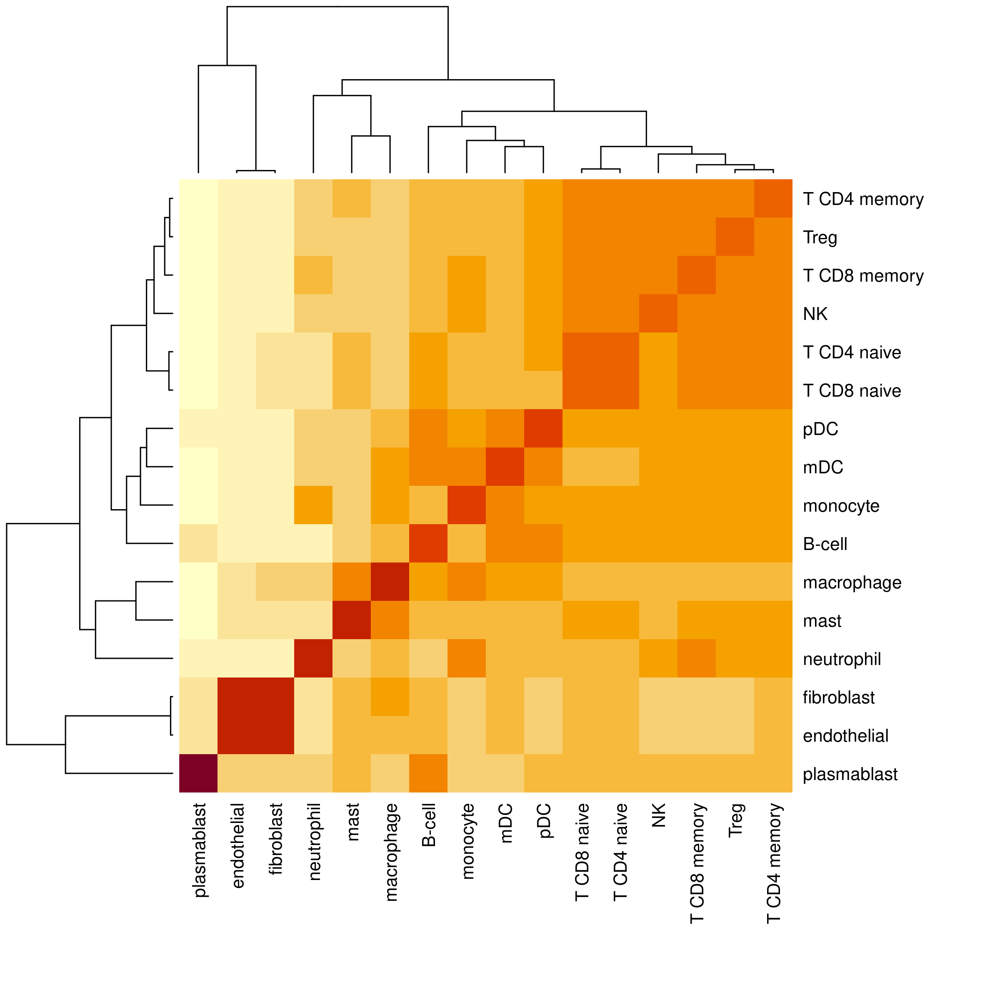

# Introduction 
We developed the [`InSituType`](https://www.biorxiv.org/content/10.1101/2022.10.19.512902v1.abstract){target="_blank"} [@Danaher2022] algorithm to perform cell typing on spatial transcriptomics data, based on a likelihood model that weighs the evidence from every transcript, and this has been shown to work well for many datasets. However, when working with higher-plex datasets or attempting to perform fine-grained cell typing, we have found that a nested approach can generate more satisfactory results than the original implementation in some data sets. Here we provide a small package, [`InSituTree`](https://github.com/Nanostring-Biostats/CosMx-Analysis-Scratch-Space/tree/Main/_code/InSituTree){target="_blank"}, that extends [`InSituType`](https://github.com/Nanostring-Biostats/InSituType/){target="_blank"} and provides a specialized application for its use. For more ideas and suggestions on cell typing, please see [other cell typing posts on the Scratch Space blog](https://nanostring-biostats.github.io/CosMx-Analysis-Scratch-Space/#category=cell%20typing) and [the FAQs provided with the InSituType package](https://github.com/Nanostring-Biostats/InSituType/blob/main/FAQs.md){target="_blank"}.

Like other items in our [CosMx Analysis Scratch Space](https://nanostring-biostats.github.io/CosMx-Analysis-Scratch-Space/about.html){target="_blank"},
the usual caveats and [license](https://nanostring-biostats.github.io/CosMx-Analysis-Scratch-Space/license.html){target="_blank"} apply.

- @sec-package-overview Overview of `InSituTree` approach
- @sec-example-implementation Example usage of `InSituTree`
- @sec-additional-recommendations Additional recommendations
- @sec-conclusions Conclusions

# InSituTree Overview: How does it work? {#sec-package-overview}

This package is an extension for the `InSituType` package 
and takes a nested approach to perform hierarchical supervised cell typing. 
Rather than immediately 
trying to assign cells to all subtypes available, it first starts by classifying
cells into broad categories and then assigns cells to finer subtypes.

There are two core concepts that underlie this tree approach and differentiate 
it from the standard supervised `InSituType`:

1. **Hierarchical annotation** Here, we break up the cell typing into a series 
of annotation decisions, starting at coarse cell type categories and proceeding 
down to fine categories
    + Example: Immune -> Lymphoid -> T-cell -> T4 -> Treg
2. **Automatic feature selection** The genes used for each decision point are 
optimized for maximum contrast given the cell types under consideration.

Aligned with these two core concepts, there are two additional types of input 
that need to be provided to the `InSituTree` function call beyond what is
required for supervised `InSituType`:

* `cth`:  **c**ell **t**ype **h**ierarchy, a nested list object that describes 
the relationship between cell types
* `quantile_absolute_expression_difference_param` and `quantile_percent_expression_difference_param`: feature selection parameters 
based on reference profile expression of each gene at absolute level and 
percentile across the entire dataset.

# `InSituTree` Example: Running the package {#sec-example-implementation}

You can find the `InSituTree` package [here](https://github.com/Nanostring-Biostats/CosMx-Analysis-Scratch-Space/tree/Main/_code/InSituTree){target="_blank"}. See the corresponding [vignette](https://github.com/Nanostring-Biostats/CosMx-Analysis-Scratch-Space/tree/Main/_code/InSituTree/vignettes/InSituTree_basicVignette.html){target="_blank"} inside the package for more details. 

For this example we work with the immune-focused cell type profiles 
as well as the CosMx<sup>&#174;</sup> spatial molecular imager (SMI) RNA
non-small cell lung cancer dataset included
in the `InSituType` package. 

```{r setup, message=FALSE, eval = FALSE}
# Load libraries
library(InSituType)
library(InSituTree)

# Read in io profiles
data(ioprofiles)

head(ioprofiles)
```

```{r, eval = TRUE, echo = FALSE}
profile_head <- readRDS("./assets/io_head.rds")
head(profile_head)
```

We start by setting up a nested list of cell types,
visualized with the helper function `printTree()`.
The nested list should have names for major cell types (for example,
"B-lymphoid" or "structural" below), and should include all cell types in the
reference profile as endpoints (for example, "B-cell" or "endothelial" below).
The endpoint cell types can be set as vectors instead of a list (see "NK" below
which is set as an unnamed character vector of length 1), though setting them as
lists will not cause errors. 

```{r setupCellTypeTree, message=FALSE, eval = FALSE}
# Establish a nested list of cell types
celltype_hierarchy_list <- list(
  "structural" = c(
    "endothelial", 
    "fibroblast"),
  "myeloid" = c(
    "macrophage", 
    "mast", 
    "mDC", 
    "monocyte", 
    "neutrophil"),
  "lymphoid" = list(
    "B-lymphoid" = c(
      "B-cell", 
      "pDC",
      "plasmablast"),
    "T-lymphoid" = list(
      "T4" = c(
        "T CD4 memory", 
        "T CD4 naive", 
        "Treg"),
      "T8" = c(
        "T CD8 memory", 
        "T CD8 naive"),
      "NK")
    )
)

printTree(celltype_hierarchy_list, prefix = "|-")
```

```{r, eval = TRUE, echo = FALSE, warning=FALSE}
tree_text <- readLines("./assets/cth_tree.txt")
cat(tree_text, sep = "\n")
```


Importantly, any middle nodes that have only a single child will
act as end points for cell type assignments. See the example below:
```{r poorCellTypeTree, eval = FALSE}
# Example of a tree with a single child node
cth_single_child_node <- list(
  "structural" = c(
    "endothelial", 
    "fibroblast"),
  "myeloid" = c(
    "macrophage", 
    "monocyte"),
  "lymphoid" = list( # This is a single child node: all cells annotated as 
    # lymphoid would also be 'B and T cells' and so annotations will not
    # continue beyond this point.
    "B and T cells" = list(
      "B-lymphoid" = c(
        "B-cell", 
        "pDC",
        "plasmablast"),
      "T-lymphoid" = list(
        "T4" = c(
          "T CD4 memory", 
          "T CD4 naive", 
          "Treg"),
        "T8" = c(
          "T CD8 memory", 
          "T CD8 naive"),
        "NK")
    )
  )
)

printTree(cth_single_child_node, prefix = "|-")
```

```{r, eval = TRUE, echo = FALSE, warning=FALSE}
tree_text <- readLines("./assets/cth_single_child_tree.txt")
cat(tree_text, sep = "\n")
```

:::{.callout-tip}
If you're working from a CosMx-derived cell profile from our [CosMx Cell Profile library](https://github.com/Nanostring-Biostats/CosMx-Cell-Profiles/tree/main){target="_blank"}, formatted nested cell type lists are available as `*celltypeslist.R` files. Alternatively, if you'd like to
create your own reference profile, see [this](https://nanostring-biostats.github.io/CosMx-Analysis-Scratch-Space/posts/hybrid-reference-profiles)
Scratch Space Post for additional guidance on generating reference profiles. 
:::

To make your own cell type hierarchy, we recommend examining the similarity
between end-point cell types within your reference profile as a starting point.
After that, further adjust the hierarchy based on subject matter expertise. The
cell type hierarchy should reflect similarity in gene expression, which may or
may not correspond to cell type lineages. For a convenient way to visualize the
similarity of cell types in your reference profile, use the function
`plotProfileSimilarity()`. 

```{r, eval = FALSE}
plotProfileSimilarity(ioprofiles)
```

```{r, echo = FALSE}
#| fig-cap: "Similarity matrix of reference profile cell types can be used to help inform cell type hierarchy."

```

As two examples from this heatmap, we can see that T cell subtypes as well as NK cells have high similarity and so should be grouped together. Additionally, endothelial and fibroblast cell types are highly similar, supporting our grouping of them into a 'structural' major cell type.

Once we have this cell type tree, we can use `InSituTree` to run supervised cell typing with a nested approach.
```{r runInSituTree, message=FALSE, eval = FALSE}
# Load basic data consisting of:
#   - counts: cell x gene count matrix
#   - negmeans: vector of mean negative probe counts per cell

load("mini_nsclc")

# Run InSituTree with basic options
res <- runInSituTree(
  x = mini_nsclc$counts,
  neg = rowMeans(mini_nsclc$neg),
  full_profiles = ioprofiles,
  cth = celltype_hierarchy_list,
  cohort = NULL,
  excluded_genes = NULL,
  quantile_absolute_expression_difference_param = 0.5, # Include genes in the top 0.5 fraction in absolute expression differences
  quantile_percent_expression_difference_param = 0.5, # Include genes in the top 0.5 fraction in percentage expression differences
  return_summary_annotation = TRUE
)

# Access the final summarized cell typing results
head(res$summaryAnnotation, 10)

```

```{r echo = FALSE, warning = FALSE, eval = TRUE}

res <- readRDS("./assets/small_results.rds")

head(res, 10)
```

This summary annotation results data frame contains cell typing results at each level of annotation in separate columns, with both the cell type annotation and the posterior probability of that assignment *among the cell types considered at a given branch*. The final, most resolved, cell typing results will be found in the rightmost two columns.
Cells which have no counts among the selected genes for the first level of annotations will appear with `NA` values
for all columns. Otherwise, final annotations will be cascaded right in the summary table.


# Additional recommendations {#sec-additional-recommendations}
The structure of the cell type hierarchy list is a key determinant of how well this approach works. Major cell types that are unnecessarily broad may lead to poor cell typing if the average gene expression is too distinct from the expression of individual cells. The cell type lists available at our [CosMx Cell Profile library](https://github.com/Nanostring-Biostats/CosMx-Cell-Profiles/tree/main){target="_blank"} often contain an initial grouping of cell types into 'Tissue' or 'Immune'; we would recommend removing that large group and providing the next level down as top annotations. As an example, we here show the original [liver cell type hierarchy](https://github.com/Nanostring-Biostats/CosMx-Cell-Profiles/blob/main/Human/Liver/Liver.celltypeslist.R){target="_blank"} on the left and on the right a refined version where the top broad groupings have been removed. For liver samples, we recommend using the refined version on the right.

::::: columns
::: column
## Original hierachy
```{r, eval = TRUE, echo = FALSE, warning=FALSE}
tree_text <- readLines("./assets/cth_tree_liver.txt")
cat(tree_text, sep = "\n")
```
:::

::: column
## Refined hierarchy
```{r, eval = TRUE, echo = FALSE, warning=FALSE}
tree_text <- readLines("./assets/cth_tree_liver_reduced.txt")
cat(tree_text, sep = "\n")
```
:::
:::::

`InSituTree` runs quickly, so in cases of uncertainty we would recommend running the algorithm with multiple cell type hierarchies and choosing the one that gives the best cell typing. Evaluate the results as cell typing is typically evaluated, as described [here](https://github.com/Nanostring-Biostats/InSituType/blob/main/FAQs.md#interpreting-clustering-results){target="_blank"}: spatial distribution of cell types, top markers for each cell type, and clustering of similar cell types in UMAP space.

`InSituTree` is designed to work for fully supervised cell typing only. In datasets where you have novel cell types not captured in your reference profile, one option is to first run semi-supervised `InSituType` on your whole dataset to separate out novel cell types from the rest. Following this, you can create a reference profile from that semi-supervised cell typing result from the CosMx data and redo cell typing via `InSituTree` using the new reference profiles and a `cell_type_hierachy` list.

Another helpful use case for `InSituTree` is to do fine cell typing between closely related subtypes. For a dataset that has been through one iteration of cell typing, one could select out only cells of interest from the full dataset cell typing annotations, for example only the immune cells, and run targeted subclustering with `InSituTree` on those cells only.


# Conclusions {#sec-conclusions}
The nested approach to supervised cell typing presented here adds another layer of control for cell typing, particularly useful when looking to identify fine cell subtypes. This approach is one of many, and users are encouraged to consider this tool in concert with other approaches including unsupervised clustering, [gene smoothing](https://nanostring-biostats.github.io/CosMx-Analysis-Scratch-Space/posts/marker-gene-smoothing/), [cell type refinement](https://github.com/Nanostring-Biostats/InSituType/blob/main/FAQs.md), and label transfer approaches.

# Acknowledgements
The initial idea and code for this nested approach of `InSituType`-based cell typing were developed largely by [Mark Gregory](https://github.com/mtgregory){target='_blank'}.

