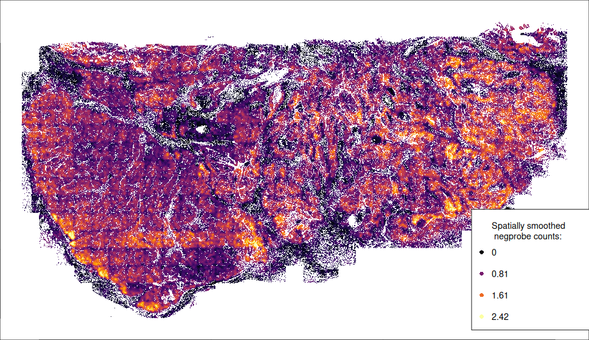

# A recommended preprocessing pipeline

Here we'll walk through a full pipeline for getting your data ready to explore and analyze.  We will:

1. Load in flat files exported by AtoMx
2. Optionally, create custom spatial layout of your tissues for better visualization
3. QC our data, removing cells and FOVs with bad data
4. Perform dimension reduction (features a new algorithm for obtaining better PC projections)
5. Cluster our data and name the clusters we discover
6. Use the HieraType algorithm to obtain superior immune cell subtyping


# Loading flat files

First we'll load the packages we need. 
Importantly, we'll load "Matrix", which handles *sparse matrices*. 
When a matrix has mainly zeroes, which is generally the case for single cell data,
storing it in sparse matrix format has huge memory savings. Given the size of CosMx
data, it is vital to be memory-efficient. 

Note: we'll store our count matrices with cells in rows and genes in columns. 
Many protocols arrange their count matrix the other way around, 
but our approach here will be more performant for most operations. 

```{r libraries}
# necessary libraries
library(data.table) # for more memory efficient data frames
library(Matrix) # for sparse matrices like our counts matrix
```

AtoMx flat file exports come with each slide packaged in its own directory. 
Our example here has one slide, titled "BreastCancer"; its contents look like this:

```{r echo = FALSE, eval = TRUE, out.width = "100%"}
knitr::include_graphics("figures/flatfiles.png")
```

So we have 5 files: an expression matrix, cell metadata, cell polygons, a map of fov positions, and the 
(very large) transcript locations file from this analysis.
This analysis will only use the expression matrix and metadata. 
For examples on how to use the cell polygons in plots, see [this post](https://nanostring-biostats.github.io/CosMx-Analysis-Scratch-Space/posts/spatial-plotting/){target="_blank"}.

Now we'll load in the flat files and format as we want. 

Trying to load an entire matrix into memory at once may cause out-of-memory issues for large files.  
In the code below, we load the counts matrices in chunks.  
* First, we'll use `data.table::fread` function which can directly read gzipped files, and determine how many rows and columns we're working with.  
* Then, we'll read each chunk of data in, and convert it to a low-memory sparse matrix format before moving onto the next chunk.  
* At the end, we'll combine our sparse matrices to create the full data matrix.

To begin, tell your script where to operate:

```{r echo = TRUE, eval = FALSE}
## set up:
# location of flat files:
myflatfiledir <- "path_to_your_flat_files_folder/flatFiles"    # point to a directory containing one folder of flat files per slide
# where to write output:
outdir <- "path_to_your_desired_output_location"

setwd(outdir)
```


The below code performs the loading and merging operations, producing 4 data objects:

* A cell metadata matrix (cells x variables)
* A counts matrix (cells x genes)
* A negative control probe ("negprobe") counts matrix (cells x negprobes)
* A SystemControl ("falsecode") counts matrix (cells x falsecodes)


::: {.callout .code collapse="true"}
```{r echo = TRUE, eval = FALSE}
## set up:
# location of flat files:
myflatfiledir <- "path_to_your_flat_files_folder/flatFiles"    # point to a directory containing one folder of flat files per slide
# where to write output:
outdir <- "path_to_your_desired_output_location"

### automatically get slide names:
slidenames <- dir(myflatfiledir)

### lists to collect the counts matrices and metadata, one per slide
countlist <- vector(mode='list', length=length(slidenames)) 
metadatalist <- vector(mode='list', length=length(slidenames)) 

for(i in 1:length(slidenames)){
  
  slidename <- slidenames[i] 
  
  msg <- paste0("Loading slide ", slidename, ", ", i, "/", length(slidenames), ".")
  message(msg)    
  # slide-specific files:
  thisslidesfiles <- dir(paste0(myflatfiledir, "/", slidename))
  
  # load in metadata:
  thisslidesmetadata <- thisslidesfiles[grepl("metadata\\_file.csv", thisslidesfiles)]
  tempdatatable <- data.table::fread(paste0(myflatfiledir, "/", slidename, "/", thisslidesmetadata))
  
  # numeric slide ID 
  slide_ID_numeric <- tempdatatable[1,]$slide_ID 
  
  # load in counts as a data table:
  thisslidescounts <- thisslidesfiles[grepl("exprMat\\_file", thisslidesfiles)]
  # unzip counts file if needed:
  if (substr(thisslidescounts, nchar(thisslidescounts-2), nchar(thisslidescounts)) == ".gz") {
    R.utils::gunzip(paste0(myflatfiledir, "/", slidename, "/", thisslidescounts), remove = FALSE, overwrite = TRUE)
    thisslidescounts <- gsub(".csv.gz", ".csv", thisslidescounts)
  }
  countsfile <- paste0(myflatfiledir, "/", slidename, "/", thisslidescounts)
  nonzero_elements_perchunk <- 5*10**7
  ### Safely read in the dense (0-filled ) counts matrices in chunks.
  ### Note: the file is gzip compressed, so we don't know a priori the number of chunks needed.
  lastchunk <- FALSE 
  skiprows <- 0
  chunkid <- 1
  
  required_cols <- fread(countsfile, select=c("fov", "cell_ID"))
  stopifnot("columns 'fov' and 'cell_ID' are required, but not found in the counts file" = 
              all(c("cell_ID", "fov") %in% colnames(required_cols)))
  number_of_cells <- nrow(required_cols)
  
  number_of_cols <-  ncol(fread(countsfile, nrows = 2))
  number_of_chunks <- ceiling(exp(log(number_of_cols) + log(number_of_cells) - log(nonzero_elements_perchunk)))
  chunk_size <- floor(number_of_cells / number_of_chunks)
  sub_counts_matrix <- vector(mode='list', length=number_of_chunks)
  
  pb <- txtProgressBar(min = 0, max = number_of_chunks, initial = 0, char = "=",
                       width = NA, title, label, style = 3, file = "")
  cellcount <- 0
  while(lastchunk==FALSE){
    read_header <- FALSE
    if(chunkid==1){
      read_header <- TRUE
    }
    
    countsdatatable <- data.table::fread(countsfile,
                                         nrows=chunk_size,
                                         skip=skiprows + (chunkid > 1),
                                         header=read_header)
    if(chunkid == 1){
      header <- colnames(countsdatatable)
    } else {
      colnames(countsdatatable) <- header
    }
    
    nr <- nrow(countsdatatable)
    cellcount <- cellcount + nr
    lastchunk <- (cellcount >= number_of_cells) || nr == 0L
    skiprows <- skiprows + nr
    
    # deleting next line: fov and id columns no longer in counts matrix:
    slide_fov_cell_counts <- paste0("c_",slide_ID_numeric, "_", countsdatatable$fov, "_", countsdatatable$cell_ID)
    sub_counts_matrix[[chunkid]] <- as(countsdatatable[,setdiff(colnames(countsdatatable), c("fov", "cell_ID")),with=FALSE], "sparseMatrix") 
    rownames(sub_counts_matrix[[chunkid]]) <- slide_fov_cell_counts 
    setTxtProgressBar(pb, chunkid)
    chunkid <- chunkid + 1
  }
  
  close(pb)   
  
  countlist[[i]] <- do.call(rbind, sub_counts_matrix) 
  # ensure that cell-order in counts matches cell-order in metadata   
  slide_fov_cell_metadata <- paste0("c_",slide_ID_numeric, "_", tempdatatable$fov, "_", tempdatatable$cell_ID)
  countlist[[i]] <- countlist[[i]][match(slide_fov_cell_metadata, rownames(countlist[[i]])),] 
  metadatalist[[i]] <- tempdatatable 
  
  # track common genes and common metadata columns across slides
  if(i==1){
    sharedgenes <- colnames(countlist[[i]]) 
    sharedcolumns <- colnames(tempdatatable)
  }  else {
    sharedgenes <- intersect(sharedgenes, colnames(countlist[[i]]))
    sharedcolumns <- intersect(sharedcolumns, colnames(tempdatatable))
  }
  
}

# reduce to shared metadata columns and shared genes
for(i in 1:length(slidenames)){
  metadatalist[[i]] <- metadatalist[[i]][, ..sharedcolumns]
  countlist[[i]] <- countlist[[i]][, sharedgenes]
}

counts <- do.call(rbind, countlist)
metadata <- rbindlist(metadatalist)

# isolate negative control matrices:
negcounts <- counts[, grepl("Negative", colnames(counts))]
falsecounts <- counts[, grepl("SystemControl", colnames(counts))]

# reduce counts matrix to only genes:
counts <- counts[, !grepl("Negative", colnames(counts)) & !grepl("SystemControl", colnames(counts))]

# checks
stopifnot(identical(rownames(counts), metadata$cell_id))
stopifnot(max(abs(Matrix::rowSums(counts) - metadata$nCount_RNA)) == 0)

```


Next we'll perform some well-advised modifications to our metadata:

* Remove the "fov" column, which has duplicate values over multiple slides (e.g. any two slides will each have a fov 1). 
 Replace it with the "FOV" column, which appends a slide identifier to FOV IDs so that each FOV has a unique id.
* Remove the "cell_ID" column, which also can have duplicate values across slides, and retain the duplicate-free column "cell_id".
* For convenience, extract cells' xy positions as a separate data object, and recast them from pixel-scale to mm-scale. 
* Add the mean negprobe counts to the metadata (the metadata has the *sum* of the negprobes already, but since negprobe counts vary across panels it's worth recording this value now so we won't have to remember our negprobe number later.)

Finally, we'll save these data objects as .RDS files. These files are smaller on disk (they 
benefit from more compression than flat files do), and they're faster to read back into R.

**Please note that these files hold intermediate results for convenience during analysis; they are not official file formats supported by NanoString.**

::: {.callout .code collapse="true"}
```{r echo = TRUE, eval = FALSE}
# add to metadata: add a global non-slide-specific FOV ID:
metadata$FOV <- paste0("s", metadata$slide_ID, "f", metadata$fov)
metadata$fov <- NULL

# remove cell_ID metadata column, which only identifies cell within slides, not across slides:
metadata$cell_ID <- NULL

# extract xy positions as a separate object:
xy <- as.matrix(metadata[, c("CenterX_global_px", "CenterY_global_px")])
rownames(xy) <- metadata$cell_id
# rescale to mm:
thisinstrument_nanometers_per_pixel = 120.280945   
# The above value holds for most instruments. Your RunSummary file specifies the value for your instrument. 
xy <- xy * thisinstrument_nanometers_per_pixel / 1000000
colnames(xy) <- paste0(c("x", "y"), "_mm")

# add mean negprobe to metadata:
metadata$negmean <- Matrix::rowMeans(negcounts)

# save data in R-friendly form:
if(!dir.exists(paste0(outdir, "/processed_data"))){
  dir.create(paste0(outdir, "/processed_data"))
}
saveRDS(counts, file = paste0(outdir, "/processed_data/counts_unfiltered.RDS"))
saveRDS(negcounts, file = paste0(outdir, "/processed_data/negcounts_unfiltered.RDS"))
saveRDS(falsecounts, file = paste0(outdir, "/processed_data/falsecounts_unfiltered.RDS"))
saveRDS(metadata, file = paste0(outdir, "/processed_data/metadata_unfiltered.RDS"))
saveRDS(xy, file = paste0(outdir, "/processed_data/xy_unfiltered.RDS"))
```

Now we have data in 3 locations:

- The RDS files we just created
- The flat files we began with
- The original data on AtoMx

This is unnecessary duplication, and since CosMx data is so large, storing extra copies can incur real cost. 
There are two feasible approaches:

1. Once you've finished your analysis, delete all the large .RDS files created during it. 
They can always be regenerated by re-running the analysis scripts. 
If you are computing on the cloud, re-running does incur some compute costs, but these are minor compared to the cost of 
indefinitely storing large files. 

2. Once you've confirmed this data loading script has run successfully,
you can safely delete the flat files - you won't be using them again. 
If you do need to go back to them, you can always export them from AtoMx again:
AtoMx acts as a persistent, authoritative source of unmodified data.

### Note on data size

A reasonably high-performance compute instance can generally handle a few slides of 
 CosMx data using the scripts we use here. But once studies get to millions of cells, they
 can overwhelm the memory available to most analysts. At this point, you have two options:

1. Use data formats that store data on disk, not in memory, e.g. TileDB, SeuratDisk, hdf5... 
2. Analyze your data one tissue at a time. Put all tissues through a standard analysis pipeline, then, for multi-tissue analyses, judiciously load in just the data you need for a given analysis. 

Neither option is terribly convenient, but having millions or tens of millions of cells 
to analyze is worth some hassle. 


# Customizing the tissues' spatial arrangements 

To show multiple slides in the same spatial plot, or just to produce spatial plots without a lot of extraneous white space, 
 we often have to shift around tissues' and/or FOVs' xy positions. 
Only a small number of operations are required to do so; 
 below are some tools and code chunks for facilitating these operations. 
Because our example breast cancer dataset is just one tissue with contiguous FOVs, 
 we'll show results from a different dataset in this section.
 
The basic operations of customized xy layouts are as follows:

**First**, for multi-slide studies, adjust the slides' xy positions do they don't overlap:

```{r echo = TRUE, eval = FALSE}
# source the tiling function:
source("https://raw.githubusercontent.com/Nanostring-Biostats/CosMx-Analysis-Scratch-Space/Main/_code/vignette/utils/condenseTissues.R")
# define new xy positions in which multiple slides no longer overlap each other:
set.seed(1)
xy <- condenseTissues(xy = xy, 
                      tissue = metadata$Run_Tissue_name, 
                      tissueorder = NULL,  # optional, specify the order tissues are tiled in
                      buffer = 1, # space between tissues
                      widthheightratio = 4/3) # desired shape of final xy locations 
```

**Second**, break your cells into spatially contiguous groups (which may be separate tissues from one slide, or merely discontinuous FOV blocks from the same tissue). 
This can be done manually, e.g. below where we select cells in a selected xy range:

```{r echo = TRUE, eval = FALSE}
# select a group of cells based on cutoffs in xy:
xrange <- c(3.4, 5.2)
yrange <- c(6.1, 8)
thisgroup <- ((xy[, 1] > xrange[1]) & (xy[, 1] < xrange[2])) & 
  ((xy[, 2] > yrange[1]) & (xy[, 2] < yrange[2]))
```

Or, we can automatically group contiguous FOVs using the dbscan algorithm:

```{r echo = TRUE, eval = FALSE}
# cells within eps range of each other will be grouped together. 
# Set eps appropriately to link sufficiently close FOVs and separate sufficiently distant FOVs. 
# An FOV's width is about 1. 
cellgroups <- dbscan::dbscan(xy, minPts = 1, eps = 1)$cluster  
```

**Third**, we rearrange groups. We can move groups manually:

```{r echo = TRUE, eval = FALSE}
# shift a group of cells to the right:
xy[thisgroup, 1] <- xy[thisgroup, 1] + 1
# or up:
xy[thisgroup, 2] <- xy[thisgroup, 2] + 5
```

...or we can move them automatically using the same \code{condenseTissues} function we used above:

```{r echo = TRUE, eval = FALSE}
set.seed(1)
xy <- condenseTissues(xy = xy, 
                      tissue = cellgroups, 
                      tissueorder = NULL,  # optional, specify the order tissues are tiled in
                      buffer = 1, # space between tissues
                      widthheightratio = 4/3) # desired shape of final xy locations 
```


# QC

QC of CosMx data is mostly straightforward. Technical effects can be complex,
 but they manifest in limited ways:
 
- Many individual cells can have low signal
- Segmentation errors can create "cells" with bad data
- Sporadic FOVs can have low signal
- Sporadic FOVs can have distorted / outlier expression profiles

Our workflow will create then add to \code{flag}, a vector marking cells flagged for one reason or another.
When we're done, we'll delete everything we've flagged. 
(The full original data will remain on AtoMx, so this step is not as drastic as it seems. 
For smaller studies it could still be reasonable to hold on to the pre-QC .RDS files.)

## Per-cell QC:

First, we'll apply a threshold on cells' total counts. 
Our defaults are fairly permissive; it would be reasonable double them in datasets where you can do so without throwing out too many cells. 

```{r echo = TRUE, eval = FALSE}
## set the total counts threshold:
count_threshold <- 100 # recommendations (on the permissive side): 20 counts for 1000plex, 50 for 6000plex, 100 for WTX 

# require sufficient counts per cell 
hist(log2(metadata$nCount_RNA), breaks = 100, xlab = "Log2 counts per cell", ylab = "N cells", main = "")
# cut off the low tail: 
abline(v = log2(count_threshold), col = "red")
legend("topleft", legend = paste0(round(mean(metadata$nCount_RNA < count_threshold) * 100, 1), "% rejected"))

# flag cells based on total counts:
flag <- metadata$nCount_RNA < count_threshold
mean(flag)
```

```{r echo = FALSE, eval = TRUE}
knitr::include_graphics("figures/QC_counts_histogram.png")
```

Next we'll throw out cells with excessively large areas. In most studies, these "cells" are the result of segmentation errors. 
This step typically removes very few cells.

```{r echo = TRUE, eval = FALSE}
# what's the distribution of areas?
hist(metadata$Area, breaks = 100, xlab = "Cell Area", main = "")
# based on the above, set a threshold way out in the tail:
area_threshold <- 30000
abline(v = area_threshold, col = "red")
legend("topright", legend = paste0(round(mean(metadata$Area > area_threshold) * 100, 2), "% rejected"))

# flag cells based on area:
flag <- flag | (metadata$Area > area_threshold)
mean(flag)
```

```{r echo = FALSE, eval = TRUE}
knitr::include_graphics("figures/QC_area_histogram.png")
```


## FOV QC

We check FOVs for two indicators of artifacts: diminished total counts, and biased gene expression profiles. 
Procedures for both these checks, along with a detailed discussion, can be found in a method
described [here](https://nanostring-biostats.github.io/CosMx-Analysis-Scratch-Space/posts/fov-qc/).

To summarize briefly: for each "bit" in our barcodes (e.g. red in reporter cycle 8), we look for FOVs where 
genes using the bit are underexpressed. We also look for FOVs where total expression is suppressed.

Below we'll run our FOV QC code and examine its results:

```{r echo = TRUE, eval = FALSE}
## preparing resources:
# source the FOV QC tool:
source("https://raw.githubusercontent.com/Nanostring-Biostats/CosMx-Analysis-Scratch-Space/Main/_code/FOV%20QC/FOV%20QC%20utils.R")
# load necessary information for the QC tool: the gene to barcode map:
allbarcodes <- readRDS(url("https://github.com/Nanostring-Biostats/CosMx-Analysis-Scratch-Space/raw/Main/_code/FOV%20QC/barcodes_by_panel.RDS"))
names(allbarcodes)
# get the barcodes for the panel we want:
barcodemap <- allbarcodes$Hs_WTX    # <------- choose the right map for your panel
head(barcodemap)

## run the method:
fovqcresult <- runFOVQC(counts = counts, xy = xy, fov = metadata$FOV, barcodemap = barcodemap) 
saveRDS(fovqcresult, file = "processed_data/fovqcresult.RDS")

# map of flagged FOVs:
mapFlaggedFOVs(fovqcresult)

# list FOVs flagged for any reason, for loss of signal, for bias:
fovqcresult$flaggedfovs
fovqcresult$flaggedfovs_fortotalcounts
fovqcresult$flaggedfovs_forbias

# flag cells in flagged FOVs:
flag[is.element(metadata$FOV, fovqcresult$flaggedfovs)] <- TRUE

# plot the result:
FOVSignalLossSpatialPlot(fovqcresult) 
```


```{r echo = FALSE, eval = TRUE}
knitr::include_graphics("figures/QC_FOVQC.png")
```

We don't have any flagged FOVs in this study. For examples of studies with more flagged FOVs, 
 see [the FOV QC post](https://nanostring-biostats.github.io/CosMx-Analysis-Scratch-Space/posts/fov-qc/){target="_blank"} and [this older vignette](https://nanostring-biostats.github.io/CosMx-Analysis-Scratch-Space/posts/vignette-basic-analysis/assets/2.-QC-and-normalization.html){target="_blank"}.

Finally, we'll remove flagged cells and save the filtered data for downstream analysis:

```{r echo = FALSE, eval = TRUE}
# save data with flagged cells removed
counts <- counts[!flag, ]
metadata <- metadata[!flag, ]
xy <- xy[!flag, ]

# save filtered data objects, to be used in the remainder of the analysis
saveRDS(counts, file = paste0(outdir, "/processed_data/counts.RDS"))
saveRDS(metadata, file = paste0(outdir, "/processed_data/metadata.RDS"))
saveRDS(xy, file = paste0(outdir, "/processed_data/xy.RDS"))
```

## Descriptive QC plots

In addition to the above per-cell flags, it can be worth plotting some QC metrics atop the space of your tissues.
The purpose of these plots is to become aware of possible technical effects that might 
 explain any artifacts you discover later in analysis. 
In the vast majority of studies, these plots will not require any action from you. 

First, plot total counts over space:

```{r echo = TRUE, eval = FALSE}
## plot total counts over space:
par(mar = c(0,0,0,0))
plot(xy, pch = 16, cex = 0.1, asp = 1, 
     col = viridis_pal(option = "B")(101)[
       round(1 + 100 * (log2(pmin(pmax(metadata$nCount_RNA, 10), 5000)) - log2(10)) / log2(5000))
     ])
legendvals <- c(10, 100, 1000, 5000)
legend("bottomright", pch = 16, 
       col = c("white", viridis_pal(option = "B")(101)[round(1 + 100 * (log2(legendvals) - log2(10)) / log2(5000))]),
       legend = c("Total counts:", legendvals))
```

```{r echo = FALSE, eval = TRUE}
knitr::include_graphics("figures/QC_counts_over_xy.png")
```

We see ample variability in total counts over space, but it all appears biological, not technical, with the exception of some FOV edge effects 
 in which cells partially captured at some FOV edges have suppressed counts.
 
We also like to plot background over space. Because negative control counts are so sparse at the level of single cells, 
 we plot *spatially smoothed* background, i.e. we color each cell by the mean background over its 50 nearest neighbors.

```{r echo = TRUE, eval = FALSE}
## plot smoothed background over space:
# get spatial neighbors:
neighbors <- InSituCor:::nearestNeighborGraph(xy[, 1], xy[, 2], N = 50, subset = metadata$slide_ID)  
# calculate spatially-smoothed background:
smoothedbg <- InSituCor:::neighbor_mean(x = metadata$nCount_negprobes, neighbors = neighbors)
# plot spatially-smoothed background:
par(mar = c(0,0,0,0))
plot(xy, pch = 16, cex = 0.1, asp = 1, 
     col = viridis_pal(option = "B")(101)[
       round(1 + 100 * pmin(smoothedbg / quantile(smoothedbg, 0.9995), 1))
     ])
legendvals <- round(seq(0, quantile(smoothedbg, 0.9995), length.out = 4), 2)
legend("bottomright", pch = 16, 
       col = c("white", viridis_pal(option = "B")(101)[round(1 + 100 * (legendvals / quantile(smoothedbg, 0.9995)))]),
       legend = c("Spatially smoothed \n negprobe counts:", legendvals))
```

```{r echo = FALSE, eval = TRUE}

```

FOV edge effects are also notable here, presumably downstream from suppressed signal in those locations.
Of greater note is a band of higher-background FOVs towards the lower left of the tissue. 
No immediate action is needed, but by becoming aware of this small technical effect 
 we'll be armed to interpret any strange results driven by it. 


