# New best practices for CosMx analysis

Here we propose an updated pipeline for basic CosMx<sup>&#174;</sup> analysis in R, 
 from data loading through cell typing. 
This post is the first in a series; coming soon will be posts 
 on exploratory analysis, on differential expression analysis, and on pipelines for large studies. 
This workflow assumes a whole study can be fit into your compute environment's memory. 
 For very large studies, see our upcoming vignette on the topic, or the summary below. 
 
## Basic analysis strategy 

Analyses can meander and sprawl, but often enough they are reducible to 3 phases:

1. **Basic pre-processing**: Prepare your data for deeper analysis: perform QC, normalize your data, 
 perform dimension reduction, and finalize your cell typing. This vignette covers this workflow. 
2. **Exploratory analysis**: See what unexpected trends your data holds. Ideally, these trends 
 can be phrased as formal hypotheses to be tested. (Post coming soon.)
3. **Hypothesis testing**: In our experience, most analyses culminate here, mainly taking the form of differential expression (DE) testing. 
 DE is a flexible tool to interrogate both the hypotheses you designed the study around and new hypotheses discovered in exploratory analysis. 
 We see DE as the workhorse of spatial analyses, but there are other useful tools: e.g., 
 you might calculate changes in cell type abundance or co-localization across space, or compute various metrics of ligand-receptor interactions. (Post coming soon.)  
 
## Basic analysis strategy: large studies 

When your data is too large to fit into memory -- and this can happen with just a few slides of WTX data --
 you need to modify the above strategy. 
We propose the below approach, which we will demonstrate in a separate vignette in late 2025:

1. Obtain a subsample of the larger study. This could be FOVs chosen at random from all the tissues in the study, or just the first couple slides to come off the instrument. 
2. Use this subsample to fix a basic pre-processing pipeline. Importantly, this pipeline has to be applicable to new samples: their data has to be projected onto the same dimension-reduced embedding, and their cell typing has to map to the cell typing of the subsample. 
3. Apply the above pre-processing pipeline separately to each tissue/slide in the study.
4. Define an additional "hypothesis testing" pipeline, also to be applied separately to each tissue. 
 This pipeline will compute whatever summary statistics you're interested in, e.g. DE results, cell type abundance, LR interaction scores.
5. Perform meta-analysis of every tissues' summary statistics together. E.g. contrast DE results or cell type abundances across responders and non-responders. 
6. Custom subset analyses: you may also have to load in custom subsets of the data for analysis, e.g. just the macrophages from every tissue. 


## Outline

Here we'll walk through a full pipeline for getting your data ready to explore and analyze.  We will:

1. [Load in flat files exported by AtoMx<sup>&#174;</sup> SIP](#loading)
2. [Create a custom spatial layout of our tissues for better visualization (optional)](#xy)
3. [QC our data, removing cells and FOVs with bad data](#qc)
4. [Perform dimension reduction (features a new algorithm for obtaining better PC projections)](#dimred)
5. [Cluster our data and name the clusters we discover](#clust)
6. [Perform immune cell typing using the HieraType algorithm](#hieratype)

# Loading flat files {#loading}

First we'll load the packages we need. 
Importantly, we'll load "Matrix", which handles _sparse matrices_. 
When a matrix has mainly zeroes, which is generally the case for single cell data,
storing it in sparse matrix format has huge memory savings. Given the size of CosMx
data, it is vital to be memory-efficient. 

Note: we'll store our count matrices with cells in rows and genes in columns. 
Many protocols arrange their count matrix the other way around, 
but our approach here will be more performant for most operations. 

```{r libraries}
# necessary libraries
library(data.table) # for more memory efficient data frames
library(Matrix) # for sparse matrices like our counts matrix
library(ggplot2)
```

[AtoMx flat file exports](../flat-file-exports/flat-files-compare.qmd){target="_blank"} come with each slide packaged in its own directory. 
Our example here has one slide, titled "BreastCancer"; its contents look like this:

```{r echo = FALSE, eval = TRUE, out.width = "85%"}
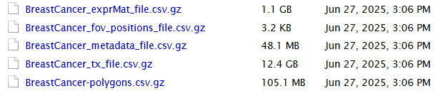
```

So we have 5 files: an expression matrix, cell metadata, cell polygons, a map of fov positions, and the 
(very large) transcript locations file from this analysis.
This analysis will only use the expression matrix and metadata. As such, you could reasonably export only those files from AtoMx.
For examples on how to use the cell polygons in plots, see [this post](https://nanostring-biostats.github.io/CosMx-Analysis-Scratch-Space/posts/spatial-plotting/){target="_blank"}.

Now we'll load in the flat files and format as we want. 

Trying to load an entire matrix into memory at once may cause out-of-memory issues for large files.  
In the code below, we load the counts matrices in chunks.  
* First, we'll use `data.table::fread` function which can directly read gzipped files, and determine how many rows and columns we're working with.  
* Then, we'll read each chunk of data in, and convert it to a low-memory sparse matrix format before moving onto the next chunk.  
* At the end, we'll combine our sparse matrices to create the full data matrix.

To begin, tell your script where to operate:

```{r echo = TRUE, eval = FALSE}
## set up:
# location of flat files:
# (point to a directory containing one folder of flat files per slide)
myflatfiledir <- "path_to_your_flat_files_folder/flatFiles"    
# where to write output:
outdir <- "path_to_your_desired_output_location"

# set up results directories for later
if(!dir.exists(paste0(outdir, "/results"))){
  dir.create(paste0(outdir, "/results"))
}
# directory to hold intermediate data files
if(!dir.exists(paste0(outdir, "/processed_data"))){
  dir.create(paste0(outdir, "/processed_data"))
}
setwd(outdir)
```


The below code performs the loading and merging operations, producing 4 data objects:

* A cell metadata matrix (cells x variables)
* A counts matrix (cells x genes)
* A negative control probe ("negprobe") counts matrix (cells x negprobes)
* A SystemControl ("falsecode") counts matrix (cells x falsecodes)

If given a flat files directory with multiple slides, it will seamlessly load and combine their data into a unified dataset. 

```{r echo = TRUE, eval = FALSE}
### automatically get slide names:
slidenames <- dir(myflatfiledir)

### lists to collect the counts matrices and metadata, one per slide
countlist <- vector(mode='list', length=length(slidenames)) 
metadatalist <- vector(mode='list', length=length(slidenames)) 

for(i in 1:length(slidenames)){
  
  slidename <- slidenames[i] 
  
  msg <- paste0("Loading slide ", slidename, ", ", i, "/", length(slidenames), ".")
  message(msg)    
  # slide-specific files:
  thisslidesfiles <- dir(paste0(myflatfiledir, "/", slidename))
  
  # load in metadata:
  thisslidesmetadata <- thisslidesfiles[grepl("metadata\\_file.csv", thisslidesfiles)]
  tempdatatable <- data.table::fread(paste0(myflatfiledir, "/", slidename, "/", thisslidesmetadata))
  
  # numeric slide ID 
  slide_ID_numeric <- tempdatatable[1,]$slide_ID 
  
  # load in counts as a data table:
  thisslidescounts <- thisslidesfiles[grepl("exprMat\\_file", thisslidesfiles)]
  # if two files, take the one that's been unzipped:
  if (length(thisslidescounts) == 2) {
    thisslidescounts <- thisslidescounts[!grepl("\\.gz", thisslidescounts)]
  }
  # unzip counts file if needed:
  if (substr(thisslidescounts, nchar(thisslidescounts)-2, nchar(thisslidescounts)) == ".gz") {
    R.utils::gunzip(paste0(myflatfiledir, "/", slidename, "/", thisslidescounts), remove = FALSE, overwrite = TRUE)
    thisslidescounts <- gsub(".csv.gz", ".csv", thisslidescounts)
  }
  countsfile <- paste0(myflatfiledir, "/", slidename, "/", thisslidescounts)
  nonzero_elements_perchunk <- 5*10**7
  ### Safely read in the dense (0-filled ) counts matrices in chunks.
  lastchunk <- FALSE 
  skiprows <- 0
  chunkid <- 1
  
  required_cols <- fread(countsfile, select=c("fov", "cell_ID"))
  stopifnot("columns 'fov' and 'cell_ID' are required, but not found in the counts file" = 
              all(c("cell_ID", "fov") %in% colnames(required_cols)))
  number_of_cells <- nrow(required_cols)
  
  number_of_cols <-  ncol(fread(countsfile, nrows = 2))
  number_of_chunks <- ceiling(exp(log(number_of_cols) + log(number_of_cells) - log(nonzero_elements_perchunk)))
  chunk_size <- floor(number_of_cells / number_of_chunks)
  sub_counts_matrix <- vector(mode='list', length=number_of_chunks)
  
  pb <- txtProgressBar(min = 0, max = number_of_chunks, initial = 0, char = "=",
                       width = NA, title, label, style = 3, file = "")
  cellcount <- 0
  while(lastchunk==FALSE){
    read_header <- FALSE
    if(chunkid==1){
      read_header <- TRUE
    }
    
    countsdatatable <- data.table::fread(countsfile,
                                         nrows=chunk_size,
                                         skip=skiprows + (chunkid > 1),
                                         header=read_header)
    if(chunkid == 1){
      header <- colnames(countsdatatable)
    } else {
      colnames(countsdatatable) <- header
    }
    
    nr <- nrow(countsdatatable)
    cellcount <- cellcount + nr
    lastchunk <- (cellcount >= number_of_cells) || nr == 0L
    skiprows <- skiprows + nr
    
    # deleting next line: fov and id columns no longer in counts matrix:
    slide_fov_cell_counts <- paste0("c_",slide_ID_numeric, "_", countsdatatable$fov, "_", countsdatatable$cell_ID)
    sub_counts_matrix[[chunkid]] <- as(countsdatatable[,setdiff(colnames(countsdatatable), c("fov", "cell_ID")),with=FALSE], "sparseMatrix") 
    rownames(sub_counts_matrix[[chunkid]]) <- slide_fov_cell_counts 
    setTxtProgressBar(pb, chunkid)
    chunkid <- chunkid + 1
  }
  
  close(pb)   
  
  countlist[[i]] <- do.call(rbind, sub_counts_matrix) 
  # ensure that cell-order in counts matches cell-order in metadata   
  slide_fov_cell_metadata <- paste0("c_",slide_ID_numeric, "_", tempdatatable$fov, "_", tempdatatable$cell_ID)
  countlist[[i]] <- countlist[[i]][match(slide_fov_cell_metadata, rownames(countlist[[i]])),] 
  metadatalist[[i]] <- tempdatatable 
  
  # track common genes and common metadata columns across slides
  if(i==1){
    sharedgenes <- colnames(countlist[[i]]) 
    sharedcolumns <- colnames(tempdatatable)
  }  else {
    sharedgenes <- intersect(sharedgenes, colnames(countlist[[i]]))
    sharedcolumns <- intersect(sharedcolumns, colnames(tempdatatable))
  }
  
}

# reduce to shared metadata columns and shared genes
for(i in 1:length(slidenames)){
  metadatalist[[i]] <- metadatalist[[i]][, ..sharedcolumns]
  countlist[[i]] <- countlist[[i]][, sharedgenes]
}

counts <- do.call(rbind, countlist)
metadata <- rbindlist(metadatalist)

# isolate negative control matrices:
negcounts <- counts[, grepl("Negative", colnames(counts))]
falsecounts <- counts[, grepl("SystemControl", colnames(counts))]

# reduce counts matrix to only genes:
counts <- counts[, !grepl("Negative", colnames(counts)) & !grepl("SystemControl", colnames(counts))]

# checks
stopifnot(identical(rownames(counts), metadata$cell_id))
stopifnot(max(abs(Matrix::rowSums(counts) - metadata$nCount_RNA)) == 0)
```

Next we'll perform some well-advised modifications to our metadata:

* Remove the "fov" column, which has duplicate values over multiple slides (e.g. any two slides will each have a fov 1). 
 Replace it with the "FOV" column, which appends a slide identifier to FOV IDs so that each FOV has a unique id.
* Remove the "cell_ID" column, which also can have duplicate values across slides, and retain the duplicate-free column "cell_id".
* For convenience, extract cells' xy positions as a separate data object, and recast them from pixel-scale to mm-scale. 
* Add the mean negprobe counts to the metadata (the metadata has the *sum* of the negprobes already, but since negprobe counts vary across panels it's worth recording this value now so we won't have to remember our negprobe number later.)

```{r echo = TRUE, eval = FALSE}
# add to metadata: add a global non-slide-specific FOV ID:
metadata$FOV <- paste0("s", metadata$slide_ID, "f", metadata$fov)
metadata$fov <- NULL

# remove cell_ID metadata column, which only identifies cell within slides, not across slides:
metadata$cell_ID <- NULL

# extract xy positions as a separate object:
xy <- as.matrix(metadata[, c("CenterX_global_px", "CenterY_global_px")])
rownames(xy) <- metadata$cell_id
# rescale to mm:
thisinstrument_nanometers_per_pixel = 120.280945   
# The above value holds for most instruments. Your RunSummary file specifies the value for your instrument. 
xy <- xy * thisinstrument_nanometers_per_pixel / 1000000
colnames(xy) <- paste0(c("x", "y"), "_mm")

# add mean negprobe to metadata:
metadata$negmean <- Matrix::rowMeans(negcounts)
```

Finally, we'll save these data objects as .RDS files. These files are smaller on disk (they 
benefit from more compression than flat files do), and they're faster to read back into R.

::: {.callout-important}
**Please note that these files hold intermediate results for convenience during analysis; they are not official file formats supported by BSB.**
:::

```{r echo = TRUE, eval = FALSE}
# save data in R-friendly form:
saveRDS(counts, file = paste0(outdir, "/processed_data/counts_unfiltered.RDS"))
saveRDS(negcounts, file = paste0(outdir, "/processed_data/negcounts_unfiltered.RDS"))
saveRDS(falsecounts, file = paste0(outdir, "/processed_data/falsecounts_unfiltered.RDS"))
saveRDS(metadata, file = paste0(outdir, "/processed_data/metadata_unfiltered.RDS"))
saveRDS(xy, file = paste0(outdir, "/processed_data/xy_unfiltered.RDS"))
```

Now we have data in 3 locations:

- The RDS files we just created
- The flat files we began with
- The original data on AtoMx SIP

This is unnecessary duplication, and since CosMx data is so large, storing extra copies can incur real cost. 
There are two feasible approaches:

1. Once you've finished your analysis, delete all the large .RDS files created during it. 
They can always be regenerated by re-running the analysis scripts. 
If you are computing on the cloud, re-running does incur some compute costs, but these are minor compared to the cost of 
indefinitely storing large files. 

2. Once you've confirmed this data loading script has run successfully,
you can safely delete the flat files - you won't be using them again. 
If you do need to go back to them, you can always export them from AtoMx again:
AtoMx acts as a persistent, authoritative source of unmodified data.

::: {.callout-note}
**Note on data size:** 
A reasonably high-performance compute instance can generally handle a few slides of 
 CosMx data using the scripts we use here. But once studies get to millions of cells, they
 can overwhelm the memory available to most analysts. At this point, you have two options:

1. Use data formats that store data on disk, not in memory, e.g. TileDB, SeuratDisk, hdf5... 
2. Analyze your data one tissue at a time. Put all tissues through a standard analysis pipeline, then, for multi-tissue analyses, judiciously load in just the data you need for a given analysis. 

Neither option is terribly convenient, but having millions or tens of millions of cells 
to analyze is worth some hassle. 
:::


# Customizing the tissues' spatial arrangements {#xy}

To show multiple slides in the same spatial plot, or just to produce spatial plots without a lot of extraneous white space, 
 we often have to shift around tissues' and/or FOVs' xy positions. 
(We if course will preserve the relative xy positions of any cells we plan to analyze together spatially.) 
Only a small number of operations are required to do so; 
 below are some tools and code chunks for facilitating these operations,
 some borrowed from [this post](https://nanostring-biostats.github.io/CosMx-Analysis-Scratch-Space/posts/visuals-reduce-whitespace/){target="_blank"}.
Because our example breast cancer dataset is just one tissue with contiguous FOVs, 
 we'll show results from a different dataset in this section.
 
The basic operations of customized xy layouts are as follows:

**First**, for multi-slide studies, adjust the slides' xy positions do they don't overlap:

```{r echo = TRUE, eval = FALSE}
# source the tiling function:
source("https://raw.githubusercontent.com/Nanostring-Biostats/CosMx-Analysis-Scratch-Space/Main/_code/vignette/utils/condenseTissues.R")
# define new xy positions in which multiple slides no longer overlap each other:
set.seed(1)
xy <- condenseTissues(xy = xy, 
                      tissue = metadata$Run_Tissue_name, 
                      tissueorder = NULL,  # optional, specify the order tissues are tiled in
                      buffer = 1, # space between tissues
                      widthheightratio = 4/3) # desired shape of final xy locations 
```

**Second**, break your cells into spatially contiguous groups (which may be separate tissues from one slide, or merely discontinuous FOV blocks from the same tissue). 
This can be done manually, e.g. below where we select cells in a selected xy range:

```{r echo = TRUE, eval = FALSE}
# select a group of cells based on cutoffs in xy:
xrange <- c(3.4, 5.2)
yrange <- c(6.1, 8)
thisgroup <- ((xy[, 1] > xrange[1]) & (xy[, 1] < xrange[2])) & 
  ((xy[, 2] > yrange[1]) & (xy[, 2] < yrange[2]))
```

Or, we can automatically group contiguous FOVs using the dbscan algorithm:

```{r echo = TRUE, eval = FALSE}
# cells within eps range of each other will be grouped together. 
# Set eps appropriately to link sufficiently close FOVs and separate sufficiently distant FOVs. 
# An FOV's width is about 1 mm. 
cellgroups <- dbscan::dbscan(xy, minPts = 1, eps = 1)$cluster
# confirm the grouping is as desired:
plot(xy, pch = 16, cex = 0.1, asp = 1, 
     col = sample(colors())[as.numeric(as.factor(cellgroups))])
```

**Third**, we rearrange groups. We can move groups manually:

```{r echo = TRUE, eval = FALSE}
# shift a group of cells to the right:
xy[thisgroup, 1] <- xy[thisgroup, 1] + 1
# or up:
xy[thisgroup, 2] <- xy[thisgroup, 2] + 5
```

...or we can move them automatically using the same `condenseTissues` function we used above:

```{r echo = TRUE, eval = FALSE}
set.seed(1)
xy <- condenseTissues(xy = xy, 
                      tissue = cellgroups, 
                      tissueorder = NULL,  # optional, specify the order tissues are tiled in
                      buffer = 1, # space between tissues
                      widthheightratio = 4/3) # desired shape of final xy locations 
```


# QC {#qc}

QC of CosMx data is mostly straightforward. Technical effects can be complex,
 but they manifest in limited ways:
 
- Many individual cells can have low signal
- Segmentation errors can create "cells" with bad data
- Sporadic FOVs can have low signal
- Sporadic FOVs can have distorted / outlier expression profiles

Our workflow will create then add to `flag`, a vector marking cells flagged for one reason or another.
When we're done, we'll delete everything we've flagged. 
(The full original data will remain on AtoMx, so this step is not as drastic as it seems. 
For smaller studies it could still be reasonable to hold on to the pre-QC .RDS files.)

## Per-cell QC:

First, we'll apply a threshold on cells' total counts. 
Our defaults are fairly permissive; it would be reasonable double them in datasets where you can do so without throwing out too many cells. 

```{r echo = TRUE, eval = FALSE}
# require sufficient counts per cell 
hist(log2(metadata$nCount_RNA), breaks = 100, xlab = "Log2 counts per cell", ylab = "N cells", main = "")
## cut off the low tail: 
# recommendations:
# - 1000plex: 20 (permissive) or 50 (conservative)
# - 6000plex: 50 (permissive) or 100 (conservative)
# - WTX: 100 (permissive) or 200 (conservative)
# - all panels: no more than 5% of cells (permissive) or 10% of cells (conservative)
count_threshold <- min(200, quantile(metadata$nCount_RNA, 0.05)) # apply threshold, but don't flag >5% of cells
abline(v = log2(count_threshold), col = "red")
flag <- metadata$nCount_RNA < count_threshold
legend("topleft", legend = paste0(round(mean(flag) * 100, 1), "% rejected"))
mean(flag)
```

```{r echo = FALSE, eval = TRUE, out.width = "115%"}
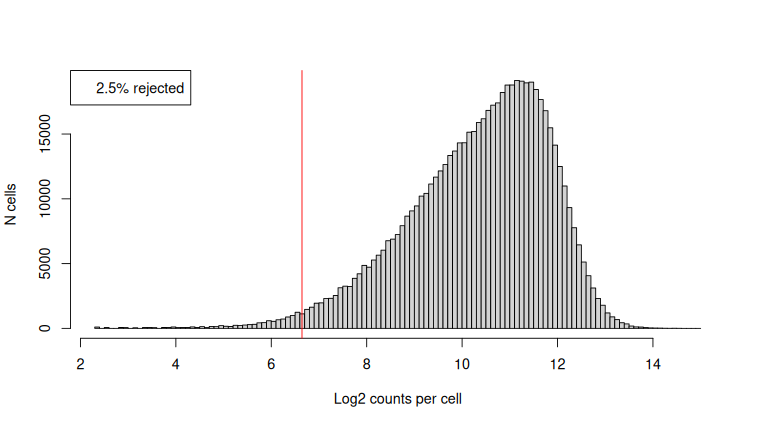
```

Next we'll throw out cells with excessively large areas. In most studies, these "cells" are the result of segmentation errors. 
This step typically removes very few cells.

```{r echo = TRUE, eval = FALSE}
# what's the distribution of areas?
hist(metadata$Area, breaks = 100, xlab = "Cell Area", main = "")

# based on the above, set a threshold well out into the tail:
area_threshold <- 30000
abline(v = area_threshold, col = "red")
legend("topright", legend = paste0(round(mean(metadata$Area > area_threshold) * 100, 2), "% rejected"))

# flag cells based on area:
flag <- flag | (metadata$Area > area_threshold)
mean(flag)
```

```{r echo = FALSE, eval = TRUE, out.width = "115%"}
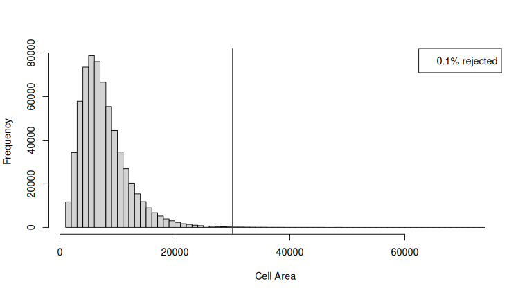
```

Note: some tissues do have very large cells, e.g. purkinje cells in the brain or cardiomyocytes in the heart. 

To check for segmentation errors, consider our R package [FastReseg](https://nanostring-biostats.github.io/CosMx-Analysis-Scratch-Space/posts/segmentation-error-evaluation/){target="_blank"}, which uses transcript positions to flag cells with likely segmentation errors, then remove or reassign transcripts assigned to the wrong cells. 
We also advise examining the segmentation results in AtoMx's tissue viewer; studies will occasionally need to be re-segmented under a different set of parameters. 

## FOV QC

We check FOVs for two indicators of artifacts: diminished total counts, and biased gene expression profiles. 
Procedures for both these checks, along with a detailed discussion, can be found in a method
described [here](https://nanostring-biostats.github.io/CosMx-Analysis-Scratch-Space/posts/fov-qc/){target="_blank"}.

To summarize briefly: for each "bit" in our barcodes (e.g. red in reporter cycle 8), we look for FOVs where 
genes using the bit are underexpressed. We also look for FOVs where total expression is suppressed.

Below we'll run our FOV QC code and examine its results:

```{r echo = TRUE, eval = FALSE}
## preparing resources:
# source the FOV QC tool:
source("https://raw.githubusercontent.com/Nanostring-Biostats/CosMx-Analysis-Scratch-Space/Main/_code/FOV%20QC/FOV%20QC%20utils.R")
# load necessary information for the QC tool: the gene to barcode map:
allbarcodes <- readRDS(url("https://github.com/Nanostring-Biostats/CosMx-Analysis-Scratch-Space/raw/Main/_code/FOV%20QC/barcodes_by_panel.RDS"))
names(allbarcodes)
# get the barcodes for the panel we want:
barcodemap <- allbarcodes$Hs_WTX    # <------- choose the right map for your panel
head(barcodemap)

## run the method:
fovqcresult <- runFOVQC(counts = counts, xy = xy, fov = metadata$FOV, barcodemap = barcodemap) 
saveRDS(fovqcresult, file = paste0(outdir, "/processed_data/fovqcresult.RDS"))

# map of flagged FOVs:
mapFlaggedFOVs(fovqcresult)

# list FOVs flagged for any reason, for loss of signal, for bias:
fovqcresult$flaggedfovs
fovqcresult$flaggedfovs_fortotalcounts
fovqcresult$flaggedfovs_forbias

# flag cells in flagged FOVs:
flag[is.element(metadata$FOV, fovqcresult$flaggedfovs)] <- TRUE

# plot the result:
FOVSignalLossSpatialPlot(fovqcresult) 
```

```{r echo = FALSE, eval = TRUE}
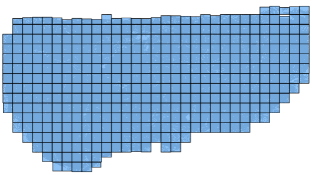
```

We don't have any flagged FOVs in this study. For examples of studies with more flagged FOVs, 
 see [the FOV QC post](https://nanostring-biostats.github.io/CosMx-Analysis-Scratch-Space/posts/fov-qc/){target="_blank"} and [this older vignette](https://nanostring-biostats.github.io/CosMx-Analysis-Scratch-Space/posts/vignette-basic-analysis/assets/2.-QC-and-normalization.html){target="_blank"}.

Finally, we'll remove flagged cells and save the filtered data for downstream analysis:

```{r echo = TRUE, eval = FALSE}
# save data with flagged cells removed
counts <- counts[!flag, ]
metadata <- metadata[!flag, ]
xy <- xy[!flag, ]

# save filtered data objects, to be used in the remainder of the analysis
saveRDS(counts, file = paste0(outdir, "/processed_data/counts.RDS"))
saveRDS(metadata, file = paste0(outdir, "/processed_data/metadata.RDS"))
saveRDS(xy, file = paste0(outdir, "/processed_data/xy.RDS"))
```

## Descriptive QC plots

In addition to the above per-cell flags, it can be worth plotting some QC metrics atop the space of your tissues.
The purpose of these plots is to become aware of possible technical effects that might 
 explain any artifacts you discover later in analysis. 
In the vast majority of studies, these plots will not require any action from you. 

First, plot total counts over space:

```{r echo = TRUE, eval = FALSE}
## plot total counts over space:
par(mar = c(0,0,0,0))
plot(xy, pch = 16, cex = 0.1, asp = 1, 
     col = viridis_pal(option = "B")(101)[
       round(1 + 100 * (log2(pmin(pmax(metadata$nCount_RNA, 10), 5000)) - log2(10)) / log2(5000))
     ])
legendvals <- c(10, 100, 1000, 5000)
legend("bottomright", pch = 16, 
       col = c("white", viridis_pal(option = "B")(101)[round(1 + 100 * (log2(legendvals) - log2(10)) / log2(5000))]),
       legend = c("Total counts:", legendvals))
```

```{r echo = FALSE, eval = TRUE, out.width = "115%"}
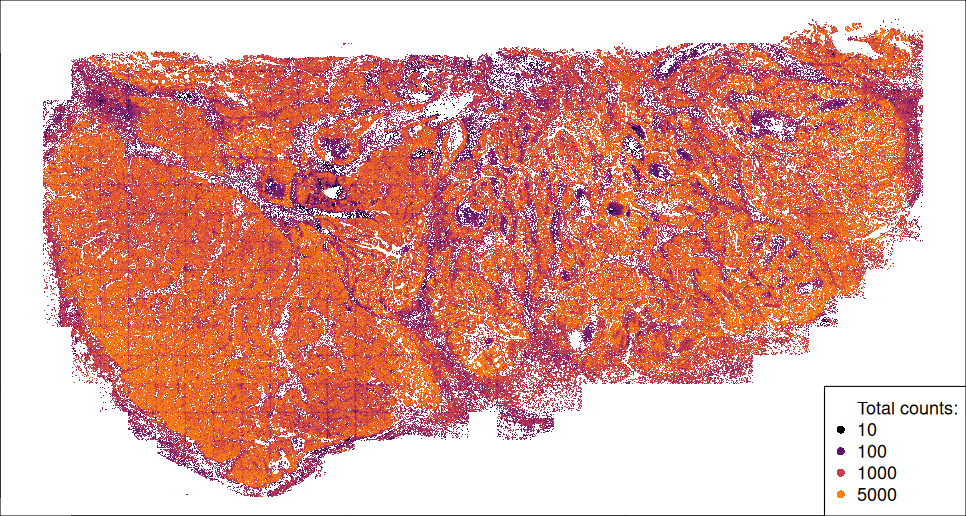
```

We see ample variability in total counts over space, but it all appears biological, not technical, with the exception of some FOV edge effects 
 in which cells partially captured at some FOV edges have suppressed counts.
 
We also like to plot background over space. Because negative control counts are so sparse at the level of single cells, 
 we plot *spatially smoothed* background, i.e. we color each cell by the mean background over its 50 nearest neighbors.
To isolate background tendency from overall signal strength, we also normalize our background (negprobe) counts to each cells' total RNA counts.

```{r echo = TRUE, eval = FALSE}
# install insitucor:
if (FALSE) {
  devtools::install_github("https://github.com/Nanostring-Biostats/InSituCor")
}

## plot smoothed background over space:
# get spatial neighbors:
neighbors <- InSituCor:::nearestNeighborGraph(xy[, 1], xy[, 2], N = 50, subset = metadata$slide_ID)  
# calculate spatially-smoothed and totalcount-normalized background:
smoothedgbrate <- InSituCor:::neighbor_mean(x = metadata$nCount_negprobes / metadata$nCount_RNA, neighbors = neighbors)
# plot:
par(mar = c(0,0,0,0))
plot(xy[, 2:1], pch = 16, cex = 0.1, asp = 1, 
     col = viridis_pal(option = "B")(101)[
       round(1 + 100 * pmin(smoothedgbrate / quantile(smoothedgbrate, 0.9995), 1))
     ])
legendvals <- signif(median(smoothedgbrate) * c(0.5,1,2,5,10), 2)
legend("bottomright", pch = 16, 
       col = c("white", viridis_pal(option = "B")(101)[signif(1 + 100 * pmin(legendvals / quantile(smoothedgbrate, 0.9995), 1), 2)]),
       legend = c("Spatially smoothed totalcounts-normalized background:", paste0(c(0.5,1,2,5,10), "x median")))
```

```{r echo = FALSE, eval = TRUE}
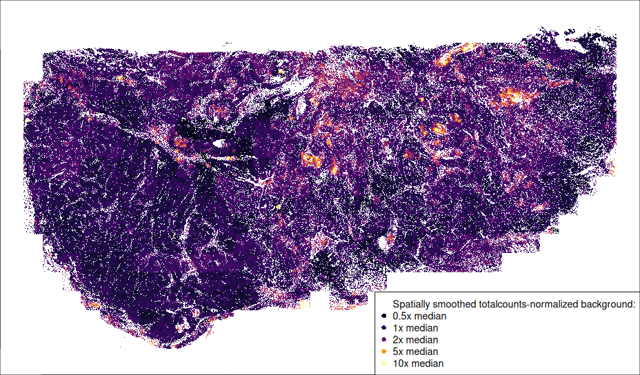
```

FOV edge effects are also notable here, presumably downstream from suppressed signal in those locations.
Of greater note is a band of higher-background FOVs towards the lower left of the tissue. 
No immediate action is needed, but by becoming aware of this small technical effect 
 we'll be armed to interpret any strange results driven by it. 

Finally, we just flagged cells in space:

```{r echo = TRUE, eval = FALSE}
# plot flagged cells in space:
par(mar = c(0,0,0,0))
plot(xy[, 2:1], pch = 16, cex = 0.1, asp = 1, 
     col = c("grey80", "red")[1 + flag])
legendvals <- signif(median(smoothedgbrate) * c(0.5,1,2,5,10), 2)
legend("bottomright", pch = 16, 
       col = c("white", viridis_pal(option = "B")(101)[signif(1 + 100 * pmin(legendvals / quantile(smoothedgbrate, 0.9995), 1), 2)]),
       legend = c("Spatially smoothed totalcounts-normalized background:", paste0(c(0.5,1,2,5,10), "x median")))
```

```{r echo = FALSE, eval = TRUE, out.width = "115%"}
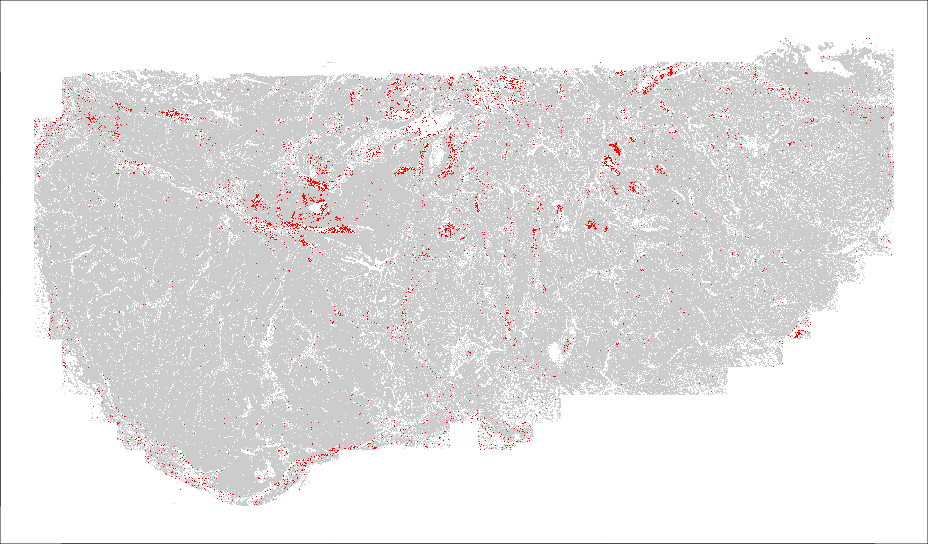
```

We can see flagged cells clustered in ducts/vessels/gaps in the tissue. 
Again, no action is needed, but we should keep this in mind while we interpret results. 

## Normalization

We typically normalize each cell's expression profile to its total counts. 
The below code does this efficiently. 
In fact, given the size of the matrix and the speed of this calculation, there is no need to save a normalized data object; 
it's usually cheaper to re-compute it that to store it. 

Note that no steps in this workflow actually use the normalized data, 
 although the dimension reduction step performs its own normalization under the hood. 
Normalized data will be useful in later analyses, e.g. for plotting expression over space or running differential expression. 

```{r echo = TRUE, eval = FALSE}
# normalize counts matrix using efficent sparse matrix calls:
scale_row <- mean(metadata$nCount_RNA)/metadata$nCount_RNA
norm <- counts
norm@x <- norm@x * scale_row[norm@i + 1L]
```


# Dimension reduction {#dimred}

Here we demonstrate an important improvement in dimension reduction for large studies.
The single cell analysis world has long used Pearson residuals to normalize & transform their data prior to running PCA;
these residuals scale count data to better balance the information available in each cell / gene.
However, Pearson residuals are dense, meaning we cannot encode them with a sparse matrix, making
them computationally intractable for larger datasets.
To benefit from Pearson residuals without taxing our compute instances,
we have developed a method of calculating the principal components of a Pearson residual matrix
without ever having to store the entire matrix. We demonstrate this function below. 
(Scratch Space post on the subject coming soon.)

We'll start by identifying highly variable genes. 
In this section we'll take advantage of some of the functions in the Seurat ecosystem.

```{r echo = TRUE, eval = FALSE}
# make a seurat object:
library(Seurat)
seu <- Seurat::CreateSeuratObject(counts = Matrix::t(counts),
                                  meta.data = metadata)
# find HVG's:
# recommend nfeatures = 3000 for WTX, 2000 for 6k panel, and using all features for 1k panels
seu <- Seurat::FindVariableFeatures(seu, nfeatures = 3000) 
hvgs <- setdiff(seu@assays$RNA@meta.data$var.features, NA)
saveRDS(hvgs, file = paste0(outdir, "/processed_data/hvgs.RDS"))
```

Next we run our Pearson residual-based PCA algorithm. 
You can install it with this command:

```{r echo = TRUE, eval = FALSE}
# install the sparse pearson PCA package:
  remotes::install_github("Nanostring-Biostats/CosMx-Analysis-Scratch-Space",
                          subdir = "_code/scPearsonPCA", ref = "Main")
```

The algorithm runs in two versions: standard, and batch-aware. 
The batch-aware version allows for gene frequencies that vary across some categorical batch variable like tissue or slide. 

Note the code saving the output. This lets us re-run the script without waiting for long algorithms to reprocess.
However, this particular routine runs fast enough, and generates a large enough data object,
 that it would also be reasonable to recalculate rather than store its output. 

::: {.panel-tabset}

## Standard mode

```{r echo = TRUE, eval = FALSE}
## get PCs based on Pearson residuals:
# version without batch adjustment:
if (TRUE) {
  genefreq <- scPearsonPCA::gene_frequency(Matrix::t(counts)) ## gene frequency (across all cells)
  pcaobj <- scPearsonPCA::sparse_quasipoisson_pca_seurat(
    x = Matrix::t(counts[, hvgs]),
    totalcounts = metadata$nCount_RNA,
    grate = genefreq[hvgs],
    scale.max = 10, ## PC's reflect clipping pearson residuals > 10 SDs above the mean pearson residual
    do.scale = TRUE, ## PC's reflect as if pearson residuals for each gene were scaled to have standard deviation=1
    do.center = TRUE ## PC's reflect as if pearson residuals for each gene were centered to have mean=0
  )
  saveRDS(pcaobj, file = paste0(outdir, "/processed_data/pcaobj.RDS"))
  } else {
  pcaobj <- readRDS(paste0(outdir, "/processed_data/pcaobj.RDS"))
}
```

## Batch-aware mode

```{r echo = TRUE, eval = FALSE}
# In this example code we assume the metadata has a column "patient" that we wish to treat as a possible batch effect
if (TRUE) {
  genefreq_batch <- scPearsonPCA::gene_frequency(
    x = Matrix::t(counts),
    obs = metadata[,.(cell_id, patient)],
    cellid_colname = "cell_id",
    batch_variable = "patient")
  
  pcaobj <- 
    sparse_quasipoisson_pca_seurat_batch(
      Matrix::t(counts[, hvgs]),
      totalcounts = metadata$nCount_RNA,
      grate = genefreq_batch[hvgs,],
      obs = metadata[,.(cell_id, patient)],
      batch_variable = "patient",
      cellid_colname = "cell_id",
      scale.max = 10,
      do.scale = TRUE,
      do.center = TRUE
    )
  saveRDS(pcaobj, file = paste0(outdir, "/processed_data/pcaobj.RDS"))
} else {
  pcaobj <- readRDS(paste0(outdir, "/processed_data/pcaobj.RDS"))
}
```

:::

Next we'll obtain a UMAP projection from those PCs:

```{r echo = TRUE, eval = FALSE}
## run UMAP:
if (TRUE) {
  umapobj <- scPearsonPCA::make_umap(pcaobj)
  # save the full object: the umap connectivity graph will be useful later on:
  saveRDS(umapobj, file = paste0(outdir, "/processed_data/umapobj.RDS"))
} else {
  umapobj <- readRDS(paste0(outdir, "/processed_data/umapobj.RDS"))
}

## plot the UMAP projection, coloring by total counts:
par(mar = c(0,0,0,0))
plot(umapobj$ump@cell.embeddings, pch = 16, asp = 1, cex = 0.1,
     col = scales::alpha(viridis_pal(option = "B")(101)[
       round(1 + 100 * (log2(pmin(pmax(metadata$nCount_RNA, 10), 5000)) - log2(10)) / log2(5000))
     ], 0.05))
legendvals <- c(10, 100, 1000, 5000)
legend("topleft", pch = 16, 
       col = c("white", viridis_pal(option = "B")(101)[round(1 + 100 * (log2(legendvals) - log2(10)) / log2(5000))]),
       legend = c("Total counts:", legendvals))
```


```{r echo = FALSE, eval = TRUE, out.width = "100%"}
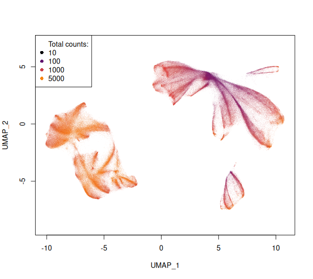
```

# Cell typing {#clust}

Here we demo the most consistently-successful approach to cell typing we have found.
First, we perform unsupervised clustering using a set of a few thousand highly variable genes (hvg's).
This approach is robust, and requires minimal configuration and re-running.
Naming clusters used to be time-consuming, but we have found that the right prompts to a large language model (LLM), **combined with rigorous oversight**, minimize the burden of cluster naming.
We will demonstrate two approaches to unsupervised clustering:

- Louvain clustering, using PC's derived from Pearson residuals of hvg's.
- InSituType's unsupervised mode, run on hvg's. 

Of the above two methods, Louvain tends to be faster, while InSituType is easier to refine,
 and, more importantly, straightforward to project onto future datasets.

::: {.panel-tabset}

## Louvain clustering

**Note:** Here we run louvain clustering with a high resolution, intentionally over-clustering with the plan to condense afterwards.
It's often better to run with the default resolution (0.8) at first, then subcluster selected cell types afterwards.
To sub-cluster a cell type, first filter out genes for which segmentation errors are likely to bias its profiles.
Use `smiDE::overlap_ratio_metric` to do so. (smiDE is available on the scratch space.)

```{r echo = TRUE, eval = FALSE}
# use Seurat to run Louvain clustering on the graph from our umap object
if (TRUE) {
  seu[["pearsongraph"]] <- Seurat::as.Graph(umapobj$grph) ## nearest neighbors / adjacency matrix used for unsupervised clustering
  seu <- Seurat::FindClusters(seu, graph = "pearsongraph", resolution = 1.2)  # choosing a high resolution with the plan to condense afterwards
  clust <- seu@meta.data$seurat_clusters
  saveRDS(clust, file = paste0(outdir, "/processed_data/clust.RDS"))
} else {
  clust <- readRDS(paste0(outdir, "/processed_data/clust.RDS"))
}

# save to metadata
metadata$clust <- clust

cellcols <- rep(c(
  "#E41A1C", "#377EB8", "#4DAF4A", "#984EA3", "#FF7F00",
  "#A65628", "#F781BF", "#999999", "#66C2A5", "#FC8D62",
  "#8DA0CB", "#E78AC3", "#A6D854", "#FFD92F", "#E5C494",
  "#B3B3B3", "#1B9E77", "#D95F02", "#7570B3", "#E7298A",
  "#66A61E", "#E6AB02", "#A6761D", "#666666", "#A6CEE3",
  "#1F78B4", "#B2DF8A", "#33A02C", "#FB9A99", "#E31A1C",
  "#FDBF6F", "#FF7F00", "#CAB2D6", "#6A3D9A", "#FFFF99",
  "#B15928", "#8DD3C7", "#FFFFB3", "#BEBADA", "#FB8072"
), 3)[1:length(unique(clust))]

# Quick xy and umap plots of clusters to confirm resolution looks right:
plot(umapobj$ump@cell.embeddings, pch = 16, asp = 1, cex = 0.1, 
     col = scales::alpha(cellcols[as.numeric(as.factor(clust))], 0.05))
plot(xy, pch = 16, asp = 1, cex = 0.1, 
     col = cellcols[as.numeric(as.factor(clust))])
```


```{r echo = FALSE, eval = TRUE}
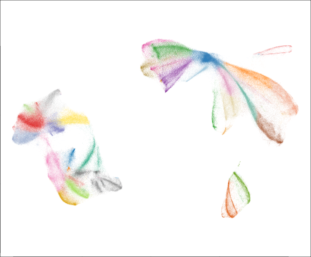
```


```{r echo = FALSE, eval = TRUE}
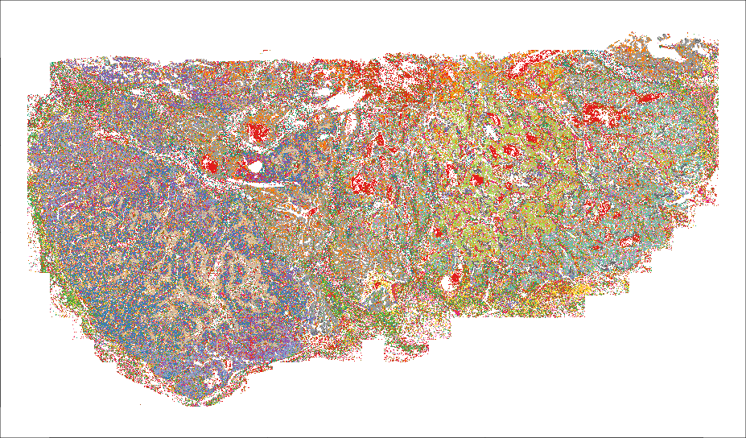
```


## Clustering with InSituType

Here we refer you to the [InSituType vignette](https://github.com/Nanostring-Biostats/InSituType/blob/main/vignettes/NSCLC-RNA_InsituType-vignette.Rmd){target="_blank"}. Running in unsupervised mode is simplest, though supervised and semi-supervised modes can work well provided with good reference profiles. 

A call to InSituType that would work with our setup here is:

```{r echo = TRUE, eval = FALSE}
if (TRUE) {
  unsup <- insitutype(
    x = counts[, hvgs],  # only use HVG's. InSituType's computation time scales with the number of genes, so analyzing the full WTX panel is very slow. 
    neg = metadata$negmean,
    assay_type = "RNA", 
    reference_profiles = NULL,
    reference_sds = NULL,
    cohort = NULL,   # see the InSituType docs for how to use this argument to incorporate spatial information into clustering
    n_clusts = 20,
    n_starts = 5,
    max_iters = 25
  ) 
  saveRDS(unsup, file = paste0(outdir, "/processed_data/unsup.RDS"))
} else {
  unsup <- readRDS(paste0(outdir, "/processed_data/unsup.RDS"))
}
# save results
metadata$clust <- clust <- unsup$clust
```

:::

## Naming clusters

Determining which cell type a cluster corresponds to is a complex exercise that should take into account:

- The cluster's marker genes
- Its overall abundance
- Its spatial locations

This can be onerous, but we can get a big jump start on this work by using large language models (LLM's).
Below, we'll create a custom prompt asking a LLM to name your cluster. 
We have found LLM's to do a very good (**though not perfect**) job of naming cell types given this information.
After this step we'll show how to QC your cell type assignments. 

As a first step, we'll derive marker genes for our clusters:

```{r echo = TRUE, eval = FALSE}
if (TRUE) {
  markers <- HieraType::clusterwise_foldchange_metrics(
    Matrix::t(counts),
    metadata = metadata,
    cluster_column = "clust",
    cellid_column = "cell_id")
  saveRDS(markers, file = "processed_data/markers.RDS")
} else {
  markers <- readRDS("processed_data/markers.RDS")
}

# get a more succinct list of markers: only the top N per cell type:
# prioritize by fold change, but penalize low-expressers:
markers$prioritystat <- (markers$cluster_expr + 0.025) / (markers$clusterprime_expr + 0.025)
markersshort <- c()
nperclust <- 5
for (name in unique(markers$cluster)) {
  inds <- markers$cluster == name
  if (length(inds) > 0) {
    markersshort <- c(markersshort,
                      markers$gene[inds][order(markers$prioritystat[inds], decreasing = TRUE)[1:min(nperclust, sum(inds))]])
  }
}
```

In addition to data-derived marker genes, we'll also look at a pre-defined list of well-known markers of broad cell types and lineages. 

```{r echo = TRUE, eval = FALSE}
# load general-purpose lineage and marker genes:
source("https://raw.githubusercontent.com/Nanostring-Biostats/CosMx-Analysis-Scratch-Space/Main/_code/vignette2/lineage_and_marker_genes.R")
# (loads the list "lineagegenes")

# save both selected markers and lineage genes:
allusefulmarkers <- intersect(colnames(counts), unique(c(unlist(lineagegenes), markersshort)))
```

Now that we have marker genes identified, we can proceed to crafting an LLM prompt:

```{r echo = TRUE, eval = FALSE}
## describe your tissue here. 
mytissuetype <- "HER2+ breast cancer"

# the preamble:
prompt_preamble <- paste0(
"Please propose cell type names for the clusters I\'ve found in a CosMx study. This is data from a ", mytissuetype, ". ",
"Below are two tables. The first is each cell type\'s abundance in the dataset. ",
"The second is a table of mean expression levels of various marker genes and lineage-defining genes in each cluster. ",
"It\'s possible that some clusters could be closely-related cell types, or distinct states of the same cell type. Call that out when it\'s apparent. ",
"For each cluster, give me your best guess at its identity, and give me your justification. Let me know when you\'re uncertain. ",
"Then, give me R code defining a named vector called \'cluster_labels\' in which my cluster IDs are the names and the values are your proposed cell types. ",
"Don\'t hallucinate, and check your work three times. ")

# info on cluster frequencies:
prompt_frequencies <- paste0(
"
The cluster frquencies are: ", 
paste0(paste0("cluster ", names(table(clust)), ":", table(clust)), collapse = ", "))

## give the LLM each cluster's mean expression profile over relevant genes:

# obtain a matrix of the clusters' marker gene profiles:
allusefulmarkers <- intersect(colnames(counts), unique(c(unlist(lineagegenes), markersshort)))
meanexpression <- markers[, dcast(.SD, gene ~ cluster, value.var = "cluster_expr")]
meanexpression <- as.matrix(meanexpression[, -1])          # drop gene col
rownames(meanexpression) <- markers[, unique(gene)]
meanexpression <- meanexpression[allusefulmarkers, ]

# reduce to just lineage genes with decent expression (but keep de novo markers):
isdenovo <- is.element(rownames(meanexpression), markersshort)
meanexpression <- meanexpression[isdenovo | apply(meanexpression, 1, max) > 0.2, ]

meanexpressionastext <- write.table(round(meanexpression[1:5,1:5], 1), sep = ",", row.names = TRUE, col.names = TRUE)

prompt_profiles <- paste0(
  "And here is a table of each cluster's mean expression of selected data- and biology-derived marker genes: ",
  paste(capture.output(
    write.table(round(meanexpression, 1), sep = ",", row.names = TRUE, col.names = TRUE)
  ), collapse = "\n"))

message(paste0(prompt_preamble, "\n", prompt_frequencies, "\n", prompt_profiles))

# save old results for rewriting later on:
unnamedclust <- clust
unnamedmeanexpression <- meanexpression
```

This creates the below prompt, which can be copied into whichever LLM you prefer:

```{r echo = FALSE, eval = TRUE, out.width = "120%"}
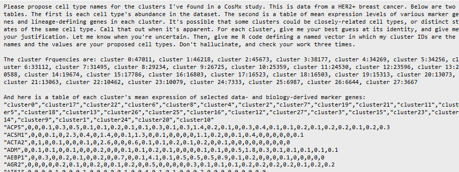
```

When this prompt was passed to ChatGPT5, it produced a writeup that looked like this:

```{r echo = FALSE, eval = TRUE, out.width = "110%"}
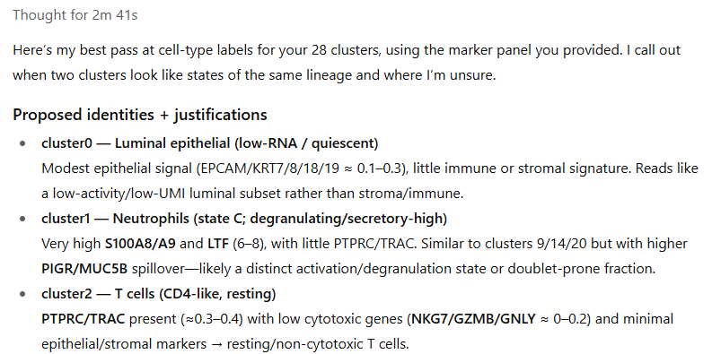
```

... and more importantly, the below code ready to be copy-pasted into our analysis:

```{r echo = TRUE, eval = FALSE}
cluster_labels <- c(
  "0"  = "Luminal epithelial (low-RNA/quiescent)",
  "1"  = "Neutrophils (state C, degranulating/secretory-high)",
  "2"  = "T cells (CD4-like, resting)",
  "3"  = "IFN-high epithelial (luminal, inflamed)",
  "4"  = "Luminal epithelial (apocrine-leaning; state A)",
  "5"  = "CAFs (matrix-rich fibroblasts)",
  "6"  = "Antigen-presenting myeloid (cDC2 / moDC)",
  "7"  = "Luminal epithelial (apocrine-high; state B)",
  "8"  = "Luminal epithelial (apocrine-high; state C)",
  "9"  = "Neutrophils (state B)",
  "10" = "Luminal epithelial (apocrine-secretory)",
  "11" = "Luminal epithelial (apocrine-high; state D)",
  "12" = "Luminal epithelial (apocrine-very-high; state E)",
  "13" = "Macrophages (APOE+/C1QA+ TAMs)",
  "14" = "Neutrophils (state A; S100A8/A9-max)",
  "15" = "Epithelial–neutrophil admixture (uncertain)",
  "16" = "CAFs (cycling)",
  "17" = "Endothelial (blood/lymphatic mix)",
  "18" = "Inflamed epithelial with myeloid shadow (uncertain)",
  "19" = "Pericytes / vascular SMC",
  "20" = "Luminal epithelial (mucociliary-like secretory)",
  "21" = "Cycling epithelial",
  "22" = "Luminal epithelial (baseline state)",
  "23" = "IFN-high epithelial (luminal, inflamed)",
  "24" = "Luminal epithelial (mucociliary-like secretory)",
  "25" = "Plasma cells",
  "26" = "Antigen-presenting cells (B/cDC; cycling, uncertain)",
  "27" = "Cytotoxic T / NK cells"
)

# for now, just uncritically take the names. Clustering QC and possible renaming will come later.
metadata$clust <- clust <- cluster_labels[as.character(unnamedclust)]
colnames(meanexpression) <- cluster_labels[as.character(gsub("cluster", "", colnames(unnamedmeanexpression)))]
```


# QC of clustering results {#clustqc}

The LLM gave us a good guess at cluster names, but we still need to verify them.
To assist in this process, we recommend looking at 4 outputs:

  1. The LLM's justifications for its calls
  2. A heatmap of each cluster's expression of key marker genes
  3. The clusters' distributions in space.
  4. The clusters' UMAP positions

The code below draws the key plots:

```{r echo = TRUE, eval = FALSE}

# heatmap of marker genes - drawn tall so we can read all gene names:
dev.off() # need to silence the current graphics device for a pheatmap pdf to render properly
pdf(paste0(outdir, "/results/marker heatmap tall.pdf"), height = 17, width = 6)
pheatmap::pheatmap(sweep(meanexpression, 1, pmax(0.1, apply(meanexpression, 1, max)), "/"),
         col = colorRampPalette(c("white", "darkblue"))(101),
         fontsize_row = 6)
dev.off()

# umap positions
png("results/umap_by_cluster.png", width = 16, height = 16, units = "in", res = 400)
par()
dev.off()
  
# xy positions:
for (name in unique(clust)) {
  png(paste0("results/cluster xy - ", make.names(name), ".png"), 
      width = diff(range(xy[, 1])) * 0.5, 
      height = diff(range(xy[, 2])) * 0.5,
      unit = "in", res = 350)
  par(mar = c(0,0,0,0))
  plot(xy, pch = 16, cex = 0.1, 
       col = scales::alpha(cellcols, 0.3)[as.numeric(as.factor(clust))], 
       xlab = "", ylab = "", xaxt = "n", yaxt = "n")
  points(xy[clust == name, ], pch = 16, cex = 0.1, 
         col = "black")
  legend("top", legend = name, bty = "n")
  dev.off()
}

```

We obtain:

A .pdf heatmap of marker gene expression, stretched out to allow for scrutinizing gene names 
(not legible zoomed-out; meant to be explored via zooming and scrolling):

```{r echo = FALSE, eval = TRUE, out.width = "100%"}
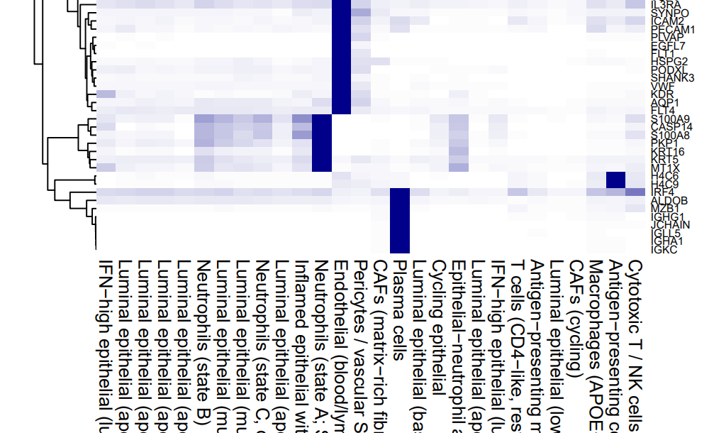
```

A .png showing each cluster in umap space, giving you another look at which clusters
 are similar to each other:

```{r echo = FALSE, eval = TRUE, out.width = "100%"}
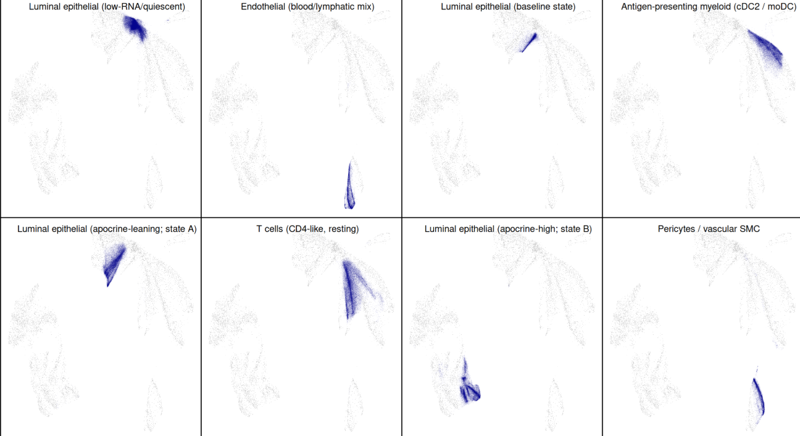
```

A .png for each cluster showing its positions in xy space (bold black points atop faded points for other clusters):

```{r echo = FALSE, eval = TRUE, out.width = "80%"}
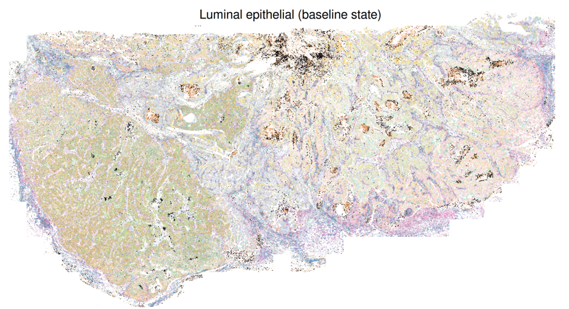
```

With these plots in hand, you should scrutinize the initial cluster names and correct as needed.
Note that you can gloss over immune clusters: we'll be overriding them later with the HieraType algorithm's results.

To rename clusters, simply edit the cluster names in the definition of `cluster_labels` above, and re-run from that code block onward. This step can also be used to merge closely-related clusters by assigning multiple clusters the same name. In our case, we renamed three clusters of cancer cells that the LLM labeled as neutrophils (some of the classic neutrophil markers are also expressed by cancer cells). 

::: {.callout-note}
For tumor studies, additional techniques can help classify cancer cells:

1. Cancer cells tend to be extremely transcriptionally active. Clusters with high total counts per cell are usually cancer.
2. The [scMalignantFinder algorithm](https://github.com/Jonyyqn/scMalignantFinder){target="_blank"} promises to call cells as cancer vs. non-cancer. We have not tried it, but it seems promising.
3. For WTX studies, it's possible to estimate cells' copy number variants. We have used [insituCNV](https://github.com/Moldia/InSituCNV){target="_blank"} successfully. 
A newer method, [ClonalScope](https://github.com/seasoncloud/Clonalscope){target="_blank"}, also looks promising.
:::


# Optimizing immune cell calling with the HieraType algorithm {#hieratype}

We created the [HieraType algorithm](https://nanostring-biostats.github.io/CosMx-Analysis-Scratch-Space/posts/immune-cell-typing-smooth/){target="_blank"} to classify immune cells in a way that is informed by marker genes. 
We have found it to consistently outperform other algorithms in immune cell typing. 
Our standard approach now is to overwrite our initial clustering results with HieraType's results whenever it calls an immune cell.

Below, we run HieraType in two steps. 
In the first, we call broad cell types (e.g. epithelial, immune, ...) then subclassify the immune cells (B, T, macrophage...)

```{r echo = TRUE, eval = FALSE}
### set up hieratype pipeline:
pipeline_io_rna <- HieraType::make_pipeline(
  markerslists = list(
    "l1" = HieraType::markerslist_l1
    ,"l2" = HieraType::markerslist_immune
  )
  ,priors = list(
    "l2" = "l1"
  )
  ,priors_category = list(
    "l2" = "immune"
  )
)

if (TRUE) {
  hieratyperes <- HieraType::run_pipeline(
    pipeline = pipeline_io_rna
    ,counts_matrix = counts
    ,totalcounts = metadata$nCount_RNA
    ,adjacency_matrix = umapobj$grph[rownames(counts), rownames(counts)]
  )
  saveRDS(hieratyperes, file = "processed_data/hieratyperes.RDS")
} else {
  hieratyperes <- readRDS("processed_data/hieratyperes.RDS")
}

# further subclassify T-cells:
tcell_ids <- hieratyperes$post_probs$l1[celltype_granular=="tcell"][["cell_ID"]]
if (TRUE) {
  tcell_typing <- 
    HieraType::run_pipeline(pipeline = HieraType::pipeline_tcell
                 ,counts_matrix = counts[tcell_ids, ]
                 ,adjacency_matrix = umapobj$grph[tcell_ids,tcell_ids]
                 ,celltype_call_threshold = 0.5
    )
  saveRDS(tcell_typing, file = "processed_data/tcell_typing.RDS")
} else {
  tcell_typing <- readRDS("processed_data/tcell_typing.RDS")
}

# unify the two levels of hieratype results:
htclust <- hieratyperes$post_probs$l1$celltype_granular
names(htclust) <- hieratyperes$post_probs$l1$cell_ID
htclust[tcell_typing$post_probs$tmajor$cell_ID] <- tcell_typing$post_probs$tmajor$celltype_granular
htclust <- htclust[match(metadata$cell_id, names(htclust))]
```

Now we'll use a simple marker heatmap to confirm HieraType worked as hoped:

```{r echo = TRUE, eval = FALSE}

# pull out canonical ("index") markers for immune cells:
indexmarkers <- unique(c(
  unlist(pipeline_io_rna$markerslists)[grepl("index_marker", names(unlist(pipeline_io_rna$markerslists)))],
  unlist(HieraType::pipeline_tcell)[grepl("index_marker", names(unlist(HieraType::pipeline_tcell)))]
))
indexmarkers <- intersect(indexmarkers, hvgs)

# make a marker heatmap for the hieratype immune cell calls:
fcmetrics <- HieraType::clusterwise_foldchange_metrics(
  normed  = Matrix::t(norm[, indexmarkers]),
  metadata = data.frame("cell_ID" = names(htclust), "hieratype_call" = htclust),
  cluster_column = "hieratype_call"
)
hm_unsup <- HieraType::marker_heatmap(fcmetrics, extras = NULL)

print(hm_unsup)
```

```{r echo = FALSE, eval = TRUE, out.width = "80%"}
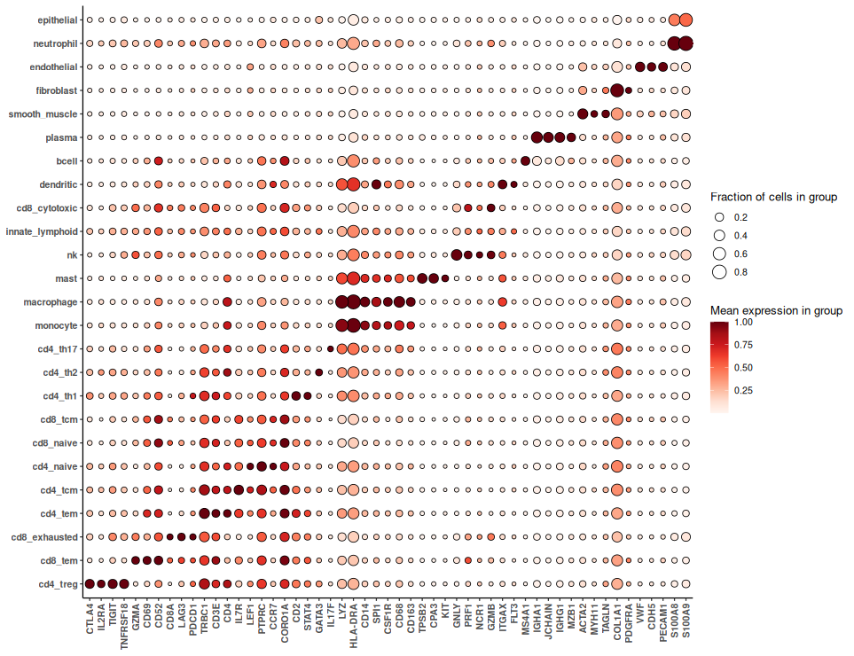
```

The above heatmap doesn't show the strongest markers; it shows the most biologically-relevant markers. 
We can gain further confidence in our immune cell typing results looking at data-driven markers:

```{r echo = TRUE, eval = FALSE}
fctbl_unsup <- 
  HieraType::clusterwise_foldchange_metrics(normed  = Matrix::t(norm),
                                            metadata = data.frame("cell_ID" = names(htclust), "hieratype_call" = htclust),
                                            cluster_column = "hieratype_call"
  )

## make a marker heatmap
hm_unsup <- HieraType::marker_heatmap(fctbl_unsup)
print(hm_unsup)
```

```{r echo = FALSE, eval = TRUE, out.width = "80%"}
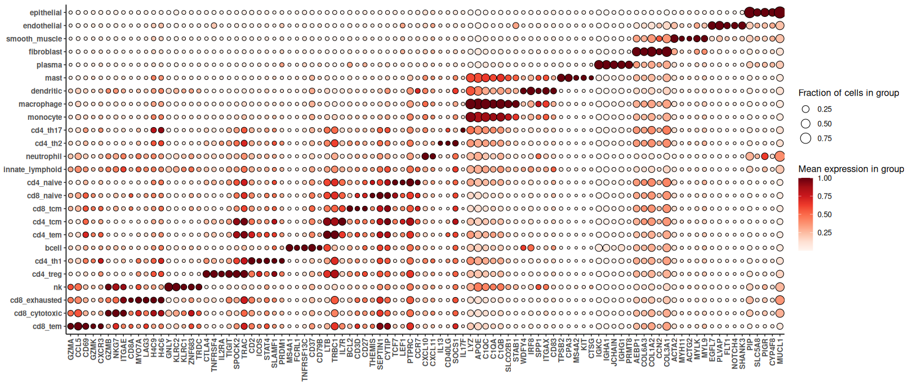
```

### Merging clustering and HieraType results

To finish our cell typing exercise, we now merge the Louvain and HieraType results.
All cells called immune by HieraType will get HieraType labels. 
All other cells will retain their old labels, with one important exception: any cells in an immune Louvain cluster but not called immune by HieraType will be reclassified as "unknown":

```{r echo = TRUE, eval = FALSE}
# combine hieratype and clustering:
immune.ids <- hieratyperes$post_probs$l1$cell_ID[
  !is.element(hieratyperes$post_probs$l1$celltype_thresh, c("epithelial", "fibroblast", "endothelial", "smooth_muscle"))]
celltype <- clust
names(celltype) <- metadata$cell_id
celltype[immune.ids] <- htclust[immune.ids]


# which clusters to reassign: >90% taken by hieratype, and < 5% of total cells left.
propoverwritten <- by(clust != celltype, clust, mean)
proppercluster <- table(celltype) / length(celltype)
clusterstodrop <- union(
  intersect(
    names(which(propoverwritten > 0.9)),
    names(which(proppercluster < 0.05))),
  intersect(
    names(which(propoverwritten > 0.5)),
    names(which(proppercluster < 0.01)))
)
# find nearest neighbors (in valid clusters) for cells in target clusters:
cellstoreclassify <- names(celltype)[is.element(celltype, clusterstodrop)]
neighborclusts <- InSituCor:::neighbor_tabulate(celltype, neighbors = umapobj$grph)
neighborclusts <- neighborclusts[, !is.element(colnames(neighborclusts), clusterstodrop)]
# reclassify by most common nearest neighbor among valid clusters:
celltype[cellstoreclassify] <- colnames(neighborclusts)[apply(neighborclusts[cellstoreclassify, ], 1, which.max)]
  
table(celltype)[order(table(celltype))]


# # what to do with the leftover immune cells from clustering?
# setdiff(unique(celltype), unique(htclust))
# louvain_immune_names <- c("Macrophages (APOE+/C1QA+ TAMs)",
#                           "Neutrophils (state A; S100A8/A9-max)",
#                           "Neutrophils (state C, degranulating/secretory-high)",
#                           "T cells (CD4-like, resting)",
#                           "Antigen-presenting myeloid (cDC2 / moDC)",
#                           "Neutrophils (state B)",
#                           "Plasma cells",
#                           "Antigen-presenting cells (B/cDC; cycling, uncertain)",
#                           "Cytotoxic T / NK cells")
# 
# # check overlaps, making sure there aren't huge numbers of cells called immune by Louvain but not HieraType:
# par(mar = c(22,4,2,1))
# barplot(table(celltype), las = 2, 
#         col = c("grey", "orange", "cornflowerblue")[1 + is.element(names(table(celltype)), louvain_immune_names) + 2 * is.element(names(table(celltype)), unique(htclust))])
# legend("topleft", fill = c("grey", "orange", "cornflowerblue"), legend = c("Louvain non-immune", "Louvain immune", "HieraType immune"))
# 
# # overwrite left-behind louvain immune clusters:
# celltype[is.element(celltype, louvain_immune_names)] <- "immune_unspecified"
metadata$celltype <- celltype
saveRDS(celltype, file = paste0(outdir, "/processed_data/celltype.RDS"))
saveRDS(metadata, file = paste0(outdir, "/processed_data/metadata.RDS"))
```


```{r echo = FALSE, eval = TRUE, out.width = "75%"}
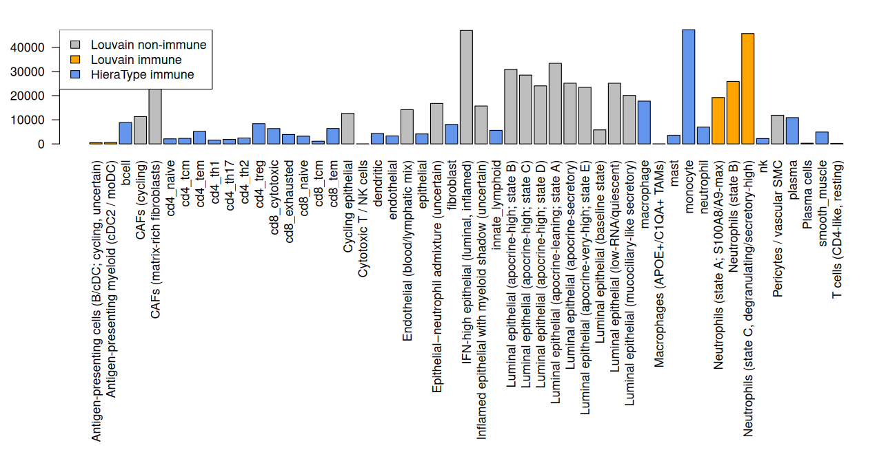
```

Note that in the above plot, we have 3 tall bars from neutrophil clusters called by Louvain. 
This result would be concerning for a merge of HieraType and Louvain, implying many immune cells were getting left behind. In our case, these are the 3 clusters that the LLM misclassified; we renamed them to "cancer" for our analysis.

Once our cell types are complete, we re-generate the spatial plots:

```{r echo = TRUE, eval = FALSE}
# xy positions:
for (name in unique(celltype)) {
  png(paste0("results/celltype xy - ", make.names(name), ".png"), 
      width = diff(range(xy[, 1])) * 0.5, 
      height = diff(range(xy[, 2])) * 0.5,
      unit = "in", res = 350)
  par(mar = c(0,0,0,0))
  plot(xy, pch = 16, cex = 0.1, 
       col = scales::alpha(cellcols, 0.3)[as.numeric(as.factor(celltype))], 
       xlab = "", ylab = "", xaxt = "n", yaxt = "n")
  points(xy[celltype == name, ], pch = 16, cex = 0.1, 
         col = "black")
  legend("top", legend = name, bty = "n")
  dev.off()
}
```


# Conclusion

The code above provides a direct path through the basic preprocessing of CosMx data. 
With these results secured, you're ready to proceed to the rewarding parts of data analysis: 
 exploring your data and testing hypotheses. 
We will have posts on these subjects soon. 
For now, here are some reasonable next steps:

Exploratory analysis:
- If your experiment has baseline / control tissues, try  [InSituDiff](https://nanostring-biostats.github.io/CosMx-Analysis-Scratch-Space/posts/insitudiff/){target="_blank"}.
- To explore genes' spatial correlation in studies without control tissues (e.g. tumors), try [InSituCor](https://github.com/Nanostring-Biostats/InSitucor){target="_blank"}.
- Calculate pathway scores using [AUCell](https://github.com/aertslab/AUCell){target="_blank"}.

Hypothesis testing:
- Use [smiDE](https://nanostring-biostats.github.io/CosMx-Analysis-Scratch-Space/posts/smiDE/){target="_blank"} for differential expression testing.
- Try Ligand-Receptor analysis (many packages exist; we have no recommendation yet).

We recommend containing those analyses in standalone scripts, each beginning by loading the data we've prepared here:

```{r echo = TRUE, eval = FALSE}
# load basic data:
counts <- readRDS(paste0(outdir, "/processed_data/counts.RDS"))
metadata <- readRDS(paste0(outdir, "/processed_data/metadata.RDS"))
xy <- readRDS(paste0(outdir, "/processed_data/xy.RDS"))

# get normalized data if desired:
norm <- Matrix::Diagonal(x = mean(metadata$nCount_RNA)/metadata$nCount_RNA,names=colnames(counts)) %*% counts
rownames(norm) <- rownames(counts)

# likely to be useful: compute nearest neighbors:
neighbors <- InSituCor:::nearestNeighborGraph(xy[, 1], xy[, 2], N = 50, subset = metadata$slide_ID)  
```
