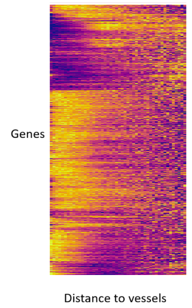
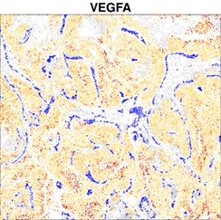
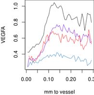

  
# Introduction

Whether you crafted your study with specific hypotheses in mind or discovered interesting trends while exploring your data,
 most CosMx<sup>&#174;</sup> analyses will culminate in differential expression (DE) analyses. 
DE is a remarkably versatile tool for posing biological questions about how cells' behavior changes in response to exposures like spatial context or patient-level attributes. 
Here we provide a convenient framework for posing your biological questions as DE tests. 

Code is organized into the following sections:
1. A collection of code chunks that can be edited and recombined to produce exactly the DE question you want. 
2. A collection of code chunks for run DE under different conditions
3. Recommended code for exploring DE results

This document exists to facilitate the coding of DE analyses, not as a literature review or an unveiling of new methods. 
For an extensive discussion of DE in spatial data, see [this ealier post](https://nanostring-biostats.github.io/CosMx-Analysis-Scratch-Space/posts/DE-guide/){target="_blank"}. 
We'll be relying on the 
[smiDE package](https://github.com/Nanostring-Biostats/CosMx-Analysis-Scratch-Space/tree/Main/_code/smiDE){target="_blank"}, described in 
[this post](https://nanostring-biostats.github.io/CosMx-Analysis-Scratch-Space/posts/smiDE/){target="_blank"} and 
[this preprint](https://www.biorxiv.org/content/10.1101/2024.08.02.606405v2.abstract){target="_blank"}.


## Getting started

To begin, load your fully pre-processed data (including cell type annotations):

```{r echo = TRUE, eval = FALSE}
## load necessary libraries
library(data.table) # for more memory efficient data frames
library(Matrix) # for sparse matrices like our counts matrix
library(ggplot2)
library(smiDE) # remotes::install_github("Nanostring-Biostats/CosMx-Analysis-Scratch-Space", subdir = "_code/smiDE", ref = "Main")
library(pheatmap)
library(InSituCor) # devtools::install_github("https://github.com/Nanostring-Biostats/InSituCor")

## load data:
counts <- readRDS(paste0(outdir, "/processed_data/counts.RDS"))
metadata <- readRDS(paste0(outdir, "/processed_data/metadata.RDS")) # expected to have the column "celltype"
xy <- readRDS(paste0(outdir, "/processed_data/xy.RDS"))
```

Then we'll define each cell's neighbors. 
This will prove useful for a variety of downstream calculations.
Note that cells are not included in their own neighbors.

```{r echo = TRUE, eval = FALSE}
## define cell neighborhoods:
# get the 50 nearest neighbors of each cell:
neighbors <- InSituCor:::nearestNeighborGraph(
  x = xy[, 1], y = xy[, 2], 
  N = 50,  # number of neighbors
  subset = metadata$slide_ID_numeric)  # optional argument to ensure cells with similar xy positions in different slides aren't linked

# or alternatively, get neighbors within a radius of 0.1mm:
neighbors <- InSituCor:::radiusBasedGraph(
  x = xy[, 1], y = xy[, 2], 
  R = 0.1,  # radius
  subset = metadata$slide_ID_numeric) # optional argument to ensure cells with similar xy positions in different slides aren't linked

# see how many neighbors you're defining for each cell:
summary(Matrix::rowSums(1 * (neighbors20 > 0)))
```

# Crafting predictor variables for DE

Repurpose the below code chunks to create precisely the predictor variable you want to use in DE. 


## Defining categorical variables

Below we provide code for 4 different approaches to defining categorical variables for analysis:

1. Partitioning the tissue into niches / spatial domains using the Novae algorithm. 
 Spatial domains are a natural framework for comparing cells' expression patterns across spatial contexts; 
 we have found the Novae algorithm to perform well. 
2. Selecting custom regions of interest. Use this code to hand-select regions for comparison, e.g. distinct lobes of a tumor, or a tertiary lymphoid structure, or a region suggested by review of H&E, IF, or protein images. 
3. Logical combinations of existing metadata columns, including dichotomization of continuous variables, e.g. gene expression ("B2M high"), pathway score ("INFG signaling high") or one of the continuous variables calculated below ("distance to tumor glands"). 
4. Defining anatomical features consisting of spatially contiguous cells. 

::: {.panel-tabset}

## Novae niches

You can now get Novae niches in an AtoMx pipeline module. 
Alternatively, compute them with the below code. 
Note that Novae is a python package; here we show how to call it from R, leaving details of python setup to you. 

First we'll use R to prepare our data for Novae, writing it to a h5ad file:

```{r echo = TRUE, eval = FALSE}
# create a seurat object:

# Convert to single cell experiment
sce <- as.SingleCellExperiment(seu.obj)

# Save as h5ad
h5ad_path <- paste0(objects_dir, "/assay_data.h5ad")
#writeH5AD(se_hdf5, file = h5ad_path)
writeH5AD(sce, file = h5ad_path, X_name = "counts", assay = "counts")
```

Now we run python code to call Novae. Note that this can easily take a day to compute on a CPU; a GPU might take 30 minutes.

```{r echo = TRUE, eval = FALSE}
library(reticulate)

py_run_string("


import novae
import igraph
import matplotlib
matplotlib.use('Agg')
import matplotlib.pyplot as plt
import scanpy as sc
import numpy as np
import os
import hdf5plugin

sc.settings.figdir = os.path.join(r.niche_dir, "Plots")
#torch.set_float32_matmul_precision('high') 
novae.settings.auto_preprocessing = True
#os.environ["CUDA_VISIBLE_DEVICES"] = "0,1,2"


# Read in sample
adata = sc.read_h5ad("analysis/Robjects/assay_data.h5ad")

## convert spatial from mm to microns for novae

# Extract coordinates from obs
x_mm = adata.obs["x_slide_mm"].to_numpy()
y_mm = adata.obs["y_slide_mm"].to_numpy()

# Create spatial_mm matrix
spatial_mm = np.column_stack((x_mm, y_mm))
adata.obsm["spatial_mm"] = spatial_mm

# Convert to microns
spatial_um = spatial_mm * 1000
adata.obsm["spatial_um"] = spatial_um

# Duplicate spatial_um to spatial
adata.obsm["spatial"] = spatial_um


## Start running novae
# Create a Delaunay graph of the data
novae.spatial_neighbors(adata, radius=80, coord_type='generic')

# Use a quick plot to ensure that neighbors were calculated appropriately
# Looking for very few red (unconnected) cells that are only on the edges of tissue
novae.plot.connectivities(adata)

# Load in pre-trained model
model1 = novae.Novae.from_pretrained("MICS-Lab/novae-human-0")

# Fine tune model based on CosMx data in this study
#model1.fine_tune(adata, max_epochs=50, logger=True, accelerator='cuda', num_workers=4)
model1.fine_tune(adata, max_epochs=50, logger=True) # Took ~24 hours on an r5b.12xlarge with CPU only
model1.compute_representations(adata, zero_shot=False) # Took ~8 hrs

for i in range(1, 20):
  model1.assign_domains(adata, i)

model1_dir = os.path.join(r.niche_dir, "novae_model_one")
model1.save_pretrained(save_directory=model1_dir)

import matplotlib.pyplot as plt
dh = model1.plot_domains_hierarchy()
plt.savefig(os.path.join(r.niche_dir, "Plots", "novae_model1_hierarchy.png"))
plt.close()

novae.plot.paga(adata, obs_key="novae_domains_11", save="_novae_model1_graph.png")

adata.write_h5ad(
  os.path.join(r.objects_dir, "anndata-plus-novae.h5ad"),
  compression=hdf5plugin.FILTERS["zstd"],
  compression_opts=hdf5plugin.Zstd(clevel=5).filter_options
)

")


# get python outputs back into R:

```

## Custom ROIs

Here we provide a function, `defineROI`, to support two workflows for selecting ROIs:

1. Clicking on points in the graphics window to define an ROI boundary (relies on the `identify` function, which can be buggy.)
2. Hard-coding the xy coordinates of the ROI boundary.

```{r echo = TRUE, eval = FALSE}
#' Define roi's by Clicking on cells in a graphics window
#' 
#' How to use:
#' \itemize{
#' \item Plot your cells in xy space. Use asp = 1. 
#' \item Click cells around the boundary of your roi.
#' \item Hit enter or escape when done with your selection.
#' }
#' Other details:
#' \itemize{
#' \item Uses graphics::identify() to select points. 
#' \item Only works for base graphics, not ggplots.
#' \item Can go wrong (draw rois in the wrong place) if the plot doesn't have asp = 1. 
#' }
#' @param xy Matrix of xy positions used in the plot. 
#' @param show Logical, for whether to show the selected roi when you're done. 
#' @param type One of:
#' \itemize{
#' \item "direct" to define the boundary points in order, exactly as you click
#' \item "ahull" to draw an alpha hull around your selection
#' } 
#' @return A list with 3 elements:
#' \itemize{
#' \item roi: The indices of the points in the roi
#' \item selected: The indices of the user-selected points
#' \item hull: The hull of the roi, either the user-selected polygon or the results of alphahull:ahull}
#' @importFrom graphics identify
#' @importFrom alphahull ahull
#' @
defineROI <- function(xy, type = "direct", boundary_points = NULL, show = TRUE) {
  if (!is.null(boundary_points)) {
    hull.x <- boundary_points[, 1]
    hull.y <- boundary_points[, 2]
    # get points in the boundary:
    roi <- sp::point.in.polygon(point.x = xy[, 1], point.y = xy[, 2], 
                                pol.x = hull.x, pol.y = hull.y) > 0
    inds <- NULL
    hull <- NULL
  }
  if (is.null(boundary_points)) {
    
    if (!is.element(type, c("direct", "ahull"))) {
      stop("must either give boundary_points or set type to \'direct\' or \'ahull\'")
    }
    # user identifies boundary:
    identifyres <- identify(xy, plot = FALSE, order = TRUE)
    inds <- identifyres$ind[order(identifyres$order)]
    
    if (type == "direct") {
      # The hull is just the polygon you've selected:
      hull.x <- xy[inds, 1]
      hull.y <- xy[inds, 2]
      hull <- inds
      # get points in the boundary:
      roi <- sp::point.in.polygon(point.x = xy[, 1], point.y = xy[, 2], 
                                  pol.x = hull.x, pol.y = hull.y) > 0
    }
    
    if (type == "ahull") {
      # get alpha hull of boundary:
      hull <- alphahull::ahull(xy[inds, 1], xy[inds, 2], alpha = 0.05)
      # get points in the boundary:
      roi <- alphahull::inahull(ahull.obj = hull, xy)
    }
    
  }
  # plot:
  if (show) {
    points(xy[inds, ], col = "red", cex = 0.5, pch = 16)
    polygon(xy[hull, ])
    points(xy[roi, ], pch = 16, cex = 1, col = scales::alpha("gold", 0.3))
  }
  
  out = list(roi = roi, selected = inds, hull = hull)
  return(out)
}
```

An example of the click-to-select workflow:

```{r echo = TRUE, eval = FALSE}

### example usage 1: clicking the graphics window to identify a region 
# NOTE: uses the identify() function, which can be finnicky and hard to debug.
par(mar = c(0,0,0,0))
plot(xy, pch = 16, cex = 0.3, asp = 1,
     xlab = "", ylab = "")
roi <- defineROI(xy, type = "direct", show = TRUE) 
# add to metadata: 
metadata$inmyroi <- roi$roi
```

... and of the hard-coded boundary workflow:

```{r echo = TRUE, eval = FALSE}
### example usage 2: inputing xy coordinates of the ROI's boundary:
par(mar = c(2,2,0,0))
plot(xy, pch = 16, cex = 0.3, asp = 1,
     xlab = "", ylab = "")
# place a grid over it to determine where to pick boundary points:
abline(h = pretty(range(xy[,2]), n=30), v = pretty(range(xy[,1]), n=30), lty=3, col="grey20")

# hard-code boundary points:
boundary_points <- t(matrix(c(
    1.85,7.05,
    2,7.1,
    2.05,6.95,
    1.95,6.85,
    1.87,6.9
), nrow = 2))
roi <- defineROI(xy, type = NULL, boundary_points = boundary_points, show = TRUE) 
# add to metadata: 
metadata$inmyroi <- roi$roi
```

## Combining existing annotations

No example code is needed here, but here are some examples for inspiration:

- **Condense niches**: in one study, we obtained 9 niches, then condensed them into 3 broad categories (tumor, interior stroma, exterior stroma) for some analyses.  
- **Dichotomize a continuous variable**: for example, you could pretty accurately identify cells in glomeruli as all cells with >5 native glomerular cells (podocytes/mesangial cells/glomerular endothelial cells...) in their 20 nearest neighbors. And in some tumors, you could pretty accurately define tertiary lymphoid structures as all cells with >10 B/T cells in their 20 nearest neighbors. Or you could divide a tumor into glycolysis high/low zones by dichotomizing a score of cells' mean neighborhood glycolysis pathway scores. 
- **Combine metadata columns**: for example, combine a handful of custom ROI's into a single annotation column like "inflamed regions" or "dysplastic regions".

## Anatomical features / groups of contiguous cells

Often, instead of just selecting cells belonging to a given cell type, you want cells in anatomical structures. 
For example, you might want to select tumor glands while omitting single isolated tumor cells, 
 or you might want to define blood vessels as groups of contiguous endothelial cells, omitting isolated endothelial cells. 
The below code uses the DBSCAN algorithm to achieve this:

```{r echo = TRUE, eval = FALSE}
# define the starting group of cells, e.g. cells of a given cell type:
tempcells <- metadata$celltype == "Endothelial"
dbscancluster <- dbscan::dbscan(xy[tempcells, ],
                     eps = 0.05, # very small radius
                     minPts = 5  # throw out clusters of less than 5 cells
                     )$cluster
selectedcells <- dbscancluster != 0
```   

:::


## Defining continuous variables

Here we provide code for a few ways to define useful continuous variables: 

- Distance to nearest cell in a set (e.g. nearest T-cell)
- Abundance of a cell set in a cell's nearest neighbors (e.g. number of T-cell neighbors)
- Mean value of a continuous variable in a cell's neighborhood (e.g. neighborhood CD274 expression, or neighborhood interferon gamma pathway score)

::: {.panel-tabset}

## Distance to nearest neighbor

The below code shows how to find the distance to the nearest neighbor of a given set of cells,
 e.g. tumor cells, or cells in a given niche, or cells in a region of interest (ROI). 
This approach is appropriate when you expect your selected cells to impact their surroundings in a way that declines over distance,
 e.g. with oxygen availability dropping with distance to the nearest blood vessel. 

By modifying the `k` variable below you can take the distance to the *k*-th closest cell in the set. 
 This can be useful when you're trying to get distance to anatomical features like tumor glands rather than just single isolated tumor cells.

```{r echo = TRUE, eval = FALSE}
# collection of cells we want to take a distance to:
istargetcell <- meta_data$celltype == "Tcell"
# record all cells' distances to k-th nearest target cell
k <- 1
dist2target <- FNN::get.knnx(
  data  = as.matrix(xy[istargetcell, , drop=FALSE]),
  query = as.matrix(xy),
  k = k
)$nn.dist[, k]
```

## Number of neighbors

The below code shows how to record how many of each cells' nearest neighbors belong to a given set of cells, 
 e.g. T-cells or 
This approach is appropriate when you expect the impact of your selected cells on their neighbors to compound.
E.g., a neighborhood with more T cells might have a stronger inflammatory milieu than a neighborhood with just 1 T cell. 

```{r echo = TRUE, eval = FALSE}

# collection of cells we want to take a distance to:
istargetcell <- meta_data$celltype == "Tcell"

# count the target cells among cells' neighbors:
neighboring.targetcells <- InSituCor:::neighbor_sum(x = 1 * (istargetcell),
                                                    neighbors = neighbors)   # calculated in the preliminaries
```

## Mean neighborhood expression

The below code shows how to measure the mean / total expression of a gene in each cells' neighborhood. 

```{r echo = TRUE, eval = FALSE}
## examples of a variable to average over neighborhoods:
# raw counts of a gene:
x <- counts[, "CXCL14"] 
# normalized expression of a gene:
x <- counts[, "CXCL14"] / meta_data$nCount_RNA
# or you could use a pathway score, or protein expression (if measured)

## get average expression in each cell's neighborhood:
neighbormean <- InSituCor:::neighbor_sum(x = x,
                                         neighbors = neighbors)
```


:::

## Transformations on continuous variables:

Once we've derived a continuous variable, we still have decisions to make. 
When we put a variable in a model, we are implicitly assume a linear relationship between the variable and our gene expression ("gene expression" occurring either on the linear or log scale, depending on the model). 
It often makes scientific sense to transform a variable before entering it into a model.
See the code below for examples of useful transformations. 


::: {.panel-tabset}

## Monotonic tranformations

If you think distance to a feature matters because of some diffused signals, then concentration of those molecules will vary with 1/distance.
If neighborhood expression of a molecule is strongly right-tailed, which is common, then a log transformation could prevent the end of the tail from having undue influence.
To make effect sizes more interpretable, scale the variable from 0-1.
For variables with strong skew or long tails, a quantile transformation can prevent extreme values from exerting excess influence on DE results.

```{r echo = TRUE, eval = FALSE}
# inverse:
x <- 1 / x
# log2-transform:
x <- log2(x)
# scale from 0-1:
x <- (x - min(x)) / (max(x) - min(x))
# scale to have unit SD:
x <- x / sd(x)
# quantile transformation:
x <- order(order(x)) / length(x)
# truncate at the upper extreme:
x <- pmin(x, quantile(x, 0.995))
# truncate at the lower extreme:
x <- pmax(x, quantile(x, 0.005))
# truncate at both extremes:
x <- pmin(pmax(x, quantile(x, 0.005)), quantile(x, 0.995))
```

## Binning

If you're unwilling to commit to the shape of a relationship between a variable and gene expression, 
 you can take a non-parametric approach and break it into bins. 
Our favored DE library, smiDE, will then give you results for all pairwise comparisons between bins, and it can be useful to e.g. compare all bins to the first bin. 
Alteratively, using various base R packages for linear models, you can run both a full model and a "null" model omitting your binned variable,
 then use a likelihood ratio test (`lrtest`) to get a p-value for the variable as a whole rather than for individual levels. 
 
```{r echo = TRUE, eval = FALSE}
# break a variable into bins of equal width:
x <- cut(x, breaks = 20)
# break a variable into bins of equal cell numbers:
quants <- quantile(x, seq(0,1,length.out = 21))
x <- cut(x, breaks = quants)
```
After the above, `x` is now a factor with 20 levels. 

## Splines

Instead of forcing the data into discrete bins, we can use splines to get a smoother fit. 

```{r echo = TRUE, eval = FALSE}
splinex <- as.matrix(splines::ns(x, df = 20))
```

This produces a matrix with 20 columns, suitable as use as predictors for DE. 
Prioritize genes by their global p-values from a likelihood ratio test vs. a model excluding this matrix. 
(This approach is not yet supported by smiDE.)

:::

## Confirm your variable:

Once you've crafted a variable, plot it in space to confirm it's as you hoped:

```{r echo = TRUE, eval = FALSE}
# plotting a categorical variable:
cols <- rep(c(
  "#E41A1C", "#377EB8", "#4DAF4A", "#984EA3", "#FF7F00",
  "#A65628", "#F781BF", "#999999", "#66C2A5", "#FC8D62",
  "#8DA0CB", "#E78AC3", "#A6D854", "#FFD92F", "#E5C494",
  "#B3B3B3", "#1B9E77", "#D95F02", "#7570B3", "#E7298A",
  "#66A61E", "#E6AB02", "#A6761D", "#666666", "#A6CEE3",
  "#1F78B4", "#B2DF8A", "#33A02C", "#FB9A99", "#E31A1C",
  "#FDBF6F", "#FF7F00", "#CAB2D6", "#6A3D9A", "#FFFF99",
  "#B15928", "#8DD3C7", "#FFFFB3", "#BEBADA", "#FB8072"
), 3)[1:length(unique(x))]

plot(xy, cex = 0.1, pch = 16, asp = 1,
     col = cols[as.numeric(as.factor(x))])


# plotting a continuous variable that goes up from 0:
plot(xy, cex = 0.1, pch = 16, asp = 1,
     col = colorRampPalette(c("grey80", "#4B0082"))(101)[
       1 + round(100 * x / max(x))
     ])

# plotting a continuous variable centered at 0:
plot(xy, cex = 0.1, pch = 16, asp = 1,
     col = colorRampPalette(c("darkblue", "grey80", "darkred"))(101)[
       51 + round(50 * x / max(abs(x)))
     ])

# plotting a continous variable with arbitrary center:
plot(xy, cex = 0.1, pch = 16, asp = 1,
     col = colorRampPalette(c("darkblue", "grey80", "darkred"))(101)[
       1 + round(100 * (x - min(x)) / (max(x) - min(x)))
     ])

# draw a histogram of the continuous variable to confirm it's not excessively long-tailed:
hist(x, breaks = 40)
```


# Running DE

In this section we'll provide example code for running smiDE with the variables we created above. 

## Preliminaries for smiDE

To harden our DE results against bias from segmentation errors, we take two countermeasures before running DE.

**First, we identify genes at risk of bias from segmentation errors, and omit them from our analysis**. 
The intuition is simple: if a gene is more highly expressed in the neighbors of a cell type than in the cell type itself, then it's at risk of meaningful bias from segmentation errors. 
We formalize this intuition in the function ```smiDE::overlap_ratio_metric```, demonstrated below:

```{r echo = TRUE, eval = FALSE}
# obtain the overlap ratio metrics:
if (TRUE) {
  overlapres <- smiDE::overlap_ratio_metric(
    assay_matrix = Matrix::t(counts),
    metadata = cbind(xy, metadata),
    cellid_col = "cell_id",
    cluster_col = "celltype",
    sdimx_col = colnames(xy)[1],
    sdimy_col = colnames(xy)[2],
    radius = 0.05)
  saveRDS(overlapres, file = "processed_data/overlapres.RDS")
} else {
  overlapres <- readRDS("processed_data/overlapres.RDS")
}

# extract the genes to analyze for your cell type (in this example, "macrophage"):
genes_to_analyze <- overlap_metrics[celltype=="macrophage"][ratio < 1][["target"]]
```

**Second, we record cells' spatial neighbors**, which smiDE uses to adjust for any lingering bias from segmentation errors:

```{r echo = TRUE, eval = FALSE}
# required preliminary for smiDE:
if (TRUE) {
  pre_de_obj <- 
  pre_de(metadata = cbind(xy, metadata),
         cell_type_metadata_colname = "celltype",
         split_neighbors_by_colname = "tissue",
         mm_radius = 0.05,
         sdimx_colname = colnames(xy)[1],
         sdimy_colname = colnames(xy)[2],
         verbose=TRUE)
  saveRDS(pre_de_obj, file = "processed_data/pre_de_obj.RDS")
} else {
  pre_de_obj <- readRDS("processed_data/pre_de_obj.RDS")
}
```

## running smiDE

Now, at last, we're ready to run DE. 
Here we're faced with tradeoffs between model thoroughness and computation time. 
The best models to date are prohibitively slow in large studies, while the fastest models compute in moments but suffer more false positives. 

What do we mean by the "best models?" 
DE in spatial data runs into two challenges:

First, errors in cell segmentation bias cells to resemble their neighbors. This can cause false positive results when comparing across different spatial contexts. We already screened out genes at unacceptable risk of segmentation errors, but ideally we'll take the further step of directly modeling this bias in the genes that remain. 

Second, we would ideally model the *spatial correlation* in our data. 
Expression among spatially neighboring cells is often correlated due to some spatially smooth factor unrelated to our predictor variable. This can lead to biased effect estimates, and potentially inflated statistical significance. 
We can model this correlation and get more accurate p-values by including a spatial random effect. 
This works best when the magnitude of variation in the spatial random effect is small, or when the correlation between the random effect and the covariate is small.  In addition, it’s helpful for the DE predictor to be more spatially nuanced than the smooth random effect. Unfortunately, modeling spatial correlation becomes very computationally intensive over large numbers of cells.

Our recommended modeling approaches for different settings are below:

| **Approach**  | **Model bias from segmentation errors?**  |  **Model spatial correlation?**  | **Speed** | **When to use**  |  
|---|---|---|---|
| **Standard**  |  Yes  | No  | moderate | Most settings: when >5000 cells, or when the predictor variable is spatially coarse / varies slowly over | 
| **Optimal/slow**  |  Yes  | Yes  | very slow | When <5000 cells, when the predictor variable is spatially fine / varies quickly over space |
| **Hasty/exploratory**  |  No  | No  | very fast | When a quick exploration is the priority and false positive hits are tolerable | 
| **Stepwise: screen with hasty, validate with optimal**  |  Yes  | Yes  | moderate | When spatial correlation is a concern but the study is too big to model it over all genes |


::: {.panel-tabset}

## Standard

```{r echo = TRUE, eval = FALSE}
## define the problem:
# which cells to analyze: (a logical vector over all cells)
inds <- clust == "macrophage"

## run smiDE with a Negative Binomial model and no spatial correlation modeling:
de_obj <- 
   smi_de(assay_matrix = Matrix::t(counts[inds, ]),
          metadata = metadata[inds, ],
          formula = ~RankNorm(otherct_expr) + offset(log(totalcounts)) + distance_to_tumor,   # <----- first two terms adjust for segmentation errors and per-cell signal strength, final term is the variable to be analyzed, must be a column in metadata
          pre_de_obj = pre_de_obj,  # depends on pre_de_obj calculated earlier
          neighbor_expr_cell_type_metadata_colname = "cell_type",
          neighbor_expr_overlap_weight_colname = NULL,
          neighbor_expr_overlap_agg ="sum",
          neighbor_expr_totalcount_normalize = TRUE,
          neighbor_expr_totalcount_scalefactor = totalcount_scalefactors,
          family="nbinom2",
          targets=genes_to_analyze     # calculated in earlier code block
   ) 
res <- results(de_obj)
str(res) # use res$pairwise for most cases. res$one.vs.rest can also be useful. 
```

## Optimal/slow


```{r echo = TRUE, eval = FALSE}

## define the problem:
# which cells to analyze: (a logical vector over all cells)
inds <- clust == "macrophage"
metadata$sdimx <- xy[, 1]
metadata$sdim2 <- xy[, 2]

## run smiDE with a Negative Binomial model and no spatial correlation modeling:
de_obj <- 
   smi_de(assay_matrix = Matrix::t(counts[inds, ]),
          metadata = metadata[inds, ],
          formula = ~RankNorm(otherct_expr) + offset(log(totalcounts)) + distance_to_tumor,   # <----- first two terms adjust for segmentation errors and per-cell signal strength, final term is the variable to be analyzed, must be a column in metadata
          pre_de_obj = pre_de_obj,  # depends on pre_de_obj calculated earlier
          neighbor_expr_cell_type_metadata_colname = "cell_type",
          neighbor_expr_overlap_weight_colname = NULL,
          neighbor_expr_overlap_agg ="sum",
          neighbor_expr_totalcount_normalize = TRUE,
          neighbor_expr_totalcount_scalefactor = totalcount_scalefactors,
          family="nbinom2",
          targets=genes_to_analyze,     # calculated in earlier code block
          spatial_model = list(name="GP_INLA",
                               x_coord_col = "sdimx",  
                               y_coord_col = "sdimy",
                               quantiles = c(0.025/nrow(targs), 0.025, 0.5, 0.975, 1-0.025/nrow(targs)),
                               num.threads=1)          
   ) 
res <- results(de_obj)$pairwise   
str(res) # use res$pairwise for most cases. res$one.vs.rest can also be useful. 
```

## Hasty/exploratory


```{r echo = TRUE, eval = FALSE}
## define the problem:
# which cells to analyze: (a logical vector over all cells)
inds <- clust == "macrophage"
# variable to analyze (defined over all cells):
x <- distance_to_tumor
# normalized data:
normfactor <- metadata$nCount_RNA / mean(metadata$nCount_RNA) * 1000
norm <- counts
norm@x <- counts@x * normfactor[ counts@i + 1L ]
# to put genes on similar scales, scale the columns of norm:
genefactors <- 1 / pmax(0.05, Matrix::colMeans(norm))  
normscaled <- norm %*% Matrix::Diagonal(genefactors)

## source the fast DE function:
source("https://raw.githubusercontent.com/Nanostring-Biostats/CosMx-Analysis-Scratch-Space/refs/heads/Main/_code/PatchDE/DEutils.R")

## run fast DE:
fastres <- hastyDE(y = normscaled[, genes_to_analyze], df = data.frame(distance2tumor = x))

## extract estimates and p-values:
ests <- fastres$effect
ps <- fastres$p
```

## Stepwise

When it's vital to adjust for spatial correlation, but our dataset's size makes that impractical, 
 we can run a very efficient but spatially blind model to prioritize the most useful genes, then 
 validate them with a proper spatial correlation model in smiDE. 
 
**An important caveat**: because we've selected the genes for the smiDE run based on their evidence
 in the spatial-free DE model, calculating proper adjusted p-values becomes very complicated - 
 we can neither ignore the omitted genes, nor can we use their (presumably over-optimistic) spatial-free p-values.
 
As a solution, we propose the following procedure, which will produce conservative adjusted p-values:

1. Keep the smiDE p-values from the screened genes.
2. For the remaining genes, throw out the "hasty" p-values, and generate p-values from the null distribution, i.e. uniformly between 0-1. 
3. Run your preferred p-value adjustment method on the resulting vector of p-values.


```{r echo = TRUE, eval = FALSE}
## define the problem:
# which cells to analyze: (a logical vector over all cells)
inds <- clust == "macrophage"
# variable to analyze (defined over all cells):
x <- distance_to_tumor
# normalized data:
normfactor <- metadata$nCount_RNA / mean(metadata$nCount_RNA) * 1000
norm <- counts
norm@x <- counts@x * normfactor[ counts@i + 1L ]
# to put genes on similar scales, scale the columns of norm:
genefactors <- 1 / pmax(0.05, Matrix::colMeans(norm))  
normscaled <- norm %*% Matrix::Diagonal(genefactors)

## source the fast DE function:
source("https://raw.githubusercontent.com/Nanostring-Biostats/CosMx-Analysis-Scratch-Space/refs/heads/Main/_code/PatchDE/DEutils.R")

## run fast DE:
fastres <- hastyDE(y = normscaled[, genes_to_analyze], df = data.frame(distance2tumor = x))

# Extract top genes:
# This example takes the top 10 genes by effect size from the top 1% of p-values.
# We recommend extracting top genes with some human oversight. 
topgenes <- names(fastres$p)[order(abs(fastres$effect) * (fastres$p < quantile(fastres$p, 0.01)), 1:10)]  

# Run smiDE on the top genes with the optimal / spatial-aware call to smiDE:
## define the problem:
# which cells to analyze: (a logical vector over all cells)
inds <- clust == "macrophage"
metadata$sdimx <- xy[, 1]
metadata$sdim2 <- xy[, 2]

## run smiDE with a Negative Binomial model and no spatial correlation modeling:
de_obj <- 
   smi_de(assay_matrix = Matrix::t(counts[inds, ]),
          metadata = metadata[inds, ],
          formula = ~RankNorm(otherct_expr) + offset(log(totalcounts)) + distance_to_tumor,   # <----- first two terms adjust for segmentation errors and per-cell signal strength, final term is the variable to be analyzed, must be a column in metadata
          pre_de_obj = pre_de_obj,  # depends on pre_de_obj calculated earlier
          neighbor_expr_cell_type_metadata_colname = "cell_type",
          neighbor_expr_overlap_weight_colname = NULL,
          neighbor_expr_overlap_agg ="sum",
          neighbor_expr_totalcount_normalize = TRUE,
          neighbor_expr_totalcount_scalefactor = totalcount_scalefactors,
          family="nbinom2",
          targets=topgenes,     # only analyze the genes of greatest interest
          spatial_model = list(name="GP_INLA",
                               x_coord_col = "sdimx",  
                               y_coord_col = "sdimy",
                               quantiles = c(0.025/nrow(targs), 0.025, 0.5, 0.975, 1-0.025/nrow(targs)),
                               num.threads=1)          
   ) 
res <- results(de_obj)$pairwise   

# get conservative adjusted p-values for the top genes, replacing hasty p-values with the null distribution:
ps.spatial <- res$pairwise$p.value[grepl("distance_to_tumor", res$pairwise$contrast)]
names(ps.spatial) <- res$pairwise$target[grepl("distance_to_tumor", res$pairwise$contrast)]
ps.null <- seq(0, 1, length.out = length(genes_to_analyze) - length(topgenes))

ps.spatial.adjusted <- p.adjust(c(ps.spatial, ps.null), method = "BH")[1:length(ps.spatial)]
```


:::


# Analyzing DE results

When your models have finished, it remains to prioritize the most promising genes for reporting and further analysis, then validate and explore their results.

## Priotitizing genes

How you prioritize genes depends on your setting. There are two basic cases:

**High power settings**: when your model has high N (e.g. >10000 cells) and no adjusting for spatial correlation, it's common to get very tiny p-values, e.g. < 10^-50. In these cases, apply a reasonable p-value cutoff, say the top 20% of genes, then rank genes by effect size.

**Low power settings**: when p-values aren't infinitesimal, rank genes as you would in other DE settings, i.e. considering both p-value and effect size. 


## Exploring results

The usual DE tools, like volcano plots and GSEA, apply directly to spatial data, and your existing workflows should work without modification. 
A few additional techniques bear mention. Since these explorations are highly custom, we leave it to you to code these final plots however you like. 

First, for continuous variables like distance to a cell type or local abundance of a cell type, it
 can be helpful to show mean expression across bins of the variable. 
E.g. in the below image, we show selected genes' mean expression in tumor cells at different distances from blood vessels. This lets us see in more nuance how genes change over space, and it lets us cluster together genes with similar spatial patterns. 

```{r echo = FALSE, eval = TRUE, out.width = "100%"}

```
 

Second, unlike in single cell data, we can easily verify our results by plotting a gene's expression in our given cell type over space. 
We favor plots that both show the "exposure" you're studying and color the cells we're studying by gene expression. 
E.g., in the below image, we were studying how tumor cells respond to proximity to blood vessels. 
Most cells are in a mute grey. Then we brightly color the exposure (blood vessels) blue, and 
use a yellow-red color scale to show a target gene's expression in tumor cells.

```{r echo = FALSE, eval = TRUE, out.width = "100%"}

```

Finally, we can plot a single gene's mean expression across values of a continuous variable.
E.g., below we plot VEGFA expression vs. distance from vessels, with lines showing trends in 4 different cell types:
 

```{r echo = FALSE, eval = TRUE, out.width = "100%"}

```
 


  